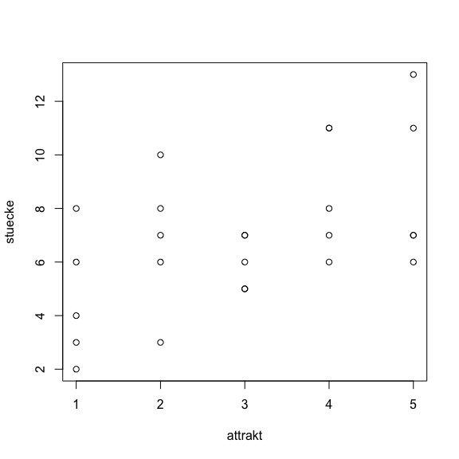
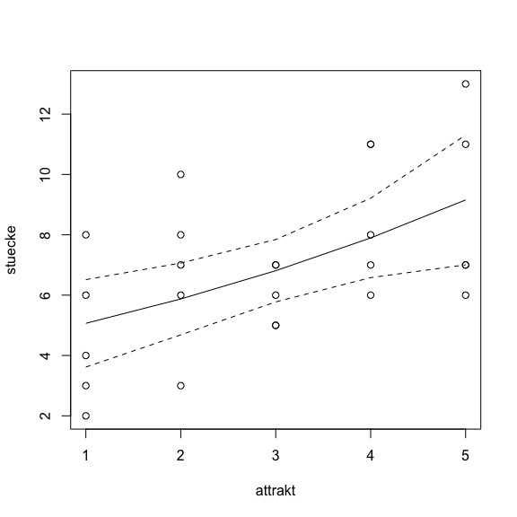
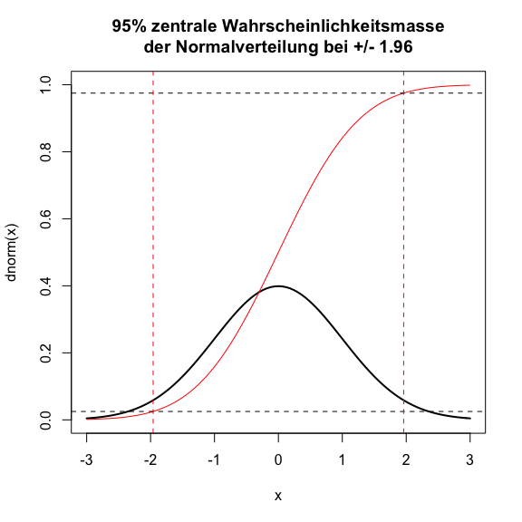
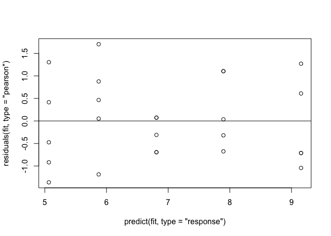
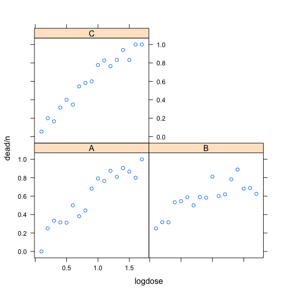
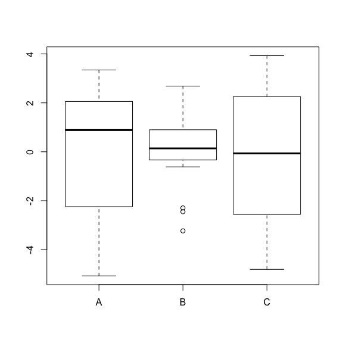
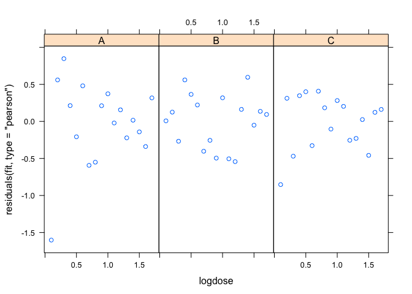
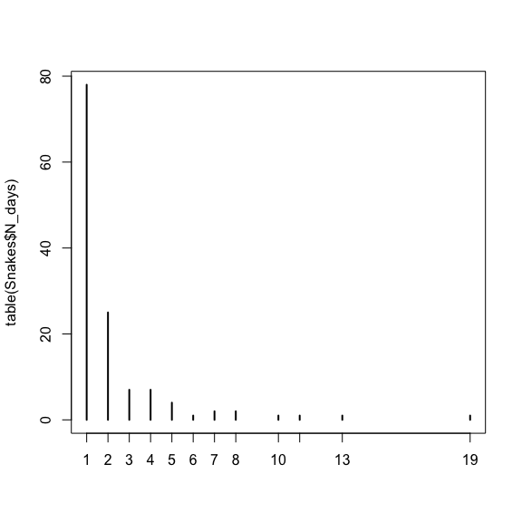
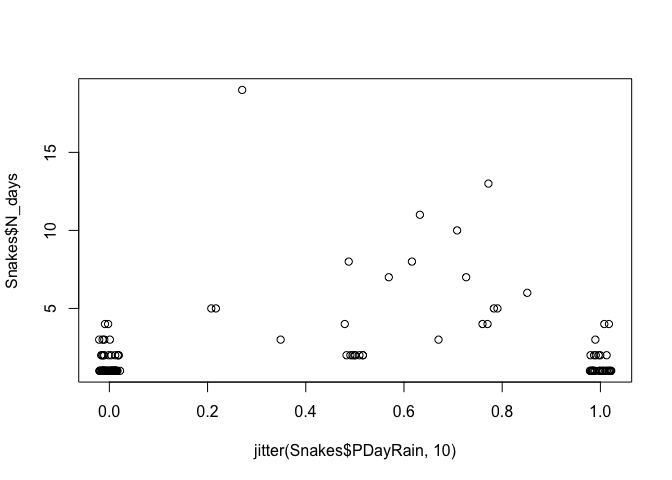
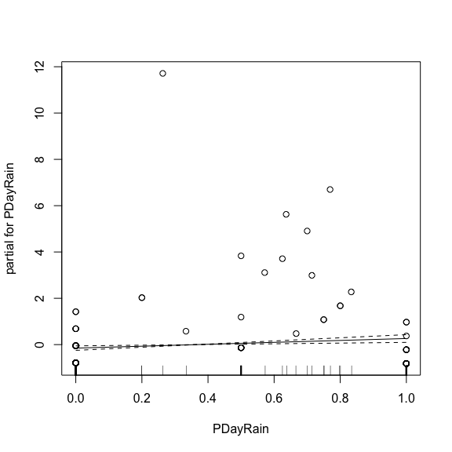

# VGAM
Florian Hartig  
13 Dec 2015  


Im ersten Datensatz geht es darum wie viele Stücke Futter ein junger Vogel von seinen Eltern bekommt, abhängig von seiner Attraktivität


```r
data = read.table("../../../Data/Doorman2013/schnaepper.txt")
plot(stuecke ~ attrakt, data = data)
```

 


```r
fit <- glm(stuecke ~ attrakt, family = poisson, data = data)
summary(fit)
```

```
## 
## Call:
## glm(formula = stuecke ~ attrakt, family = poisson, data = data)
## 
## Deviance Residuals: 
##      Min        1Q    Median        3Q       Max  
## -1.55377  -0.72834   0.03699   0.59093   1.54584  
## 
## Coefficients:
##             Estimate Std. Error z value Pr(>|z|)    
## (Intercept)  1.47459    0.19443   7.584 3.34e-14 ***
## attrakt      0.14794    0.05437   2.721  0.00651 ** 
## ---
## Signif. codes:  0 '***' 0.001 '**' 0.01 '*' 0.05 '.' 0.1 ' ' 1
## 
## (Dispersion parameter for poisson family taken to be 1)
## 
##     Null deviance: 25.829  on 24  degrees of freedom
## Residual deviance: 18.320  on 23  degrees of freedom
## AIC: 115.42
## 
## Number of Fisher Scoring iterations: 4
```


```r
preddata = data.frame(attrakt = 1:5)

# linearer Prediktor
predict(fit, newdata = preddata)
```

```
##        1        2        3        4        5 
## 1.622524 1.770460 1.918397 2.066334 2.214270
```

```r
predict(fit, newdata = preddata, type = "response")
```

```
##        1        2        3        4        5 
## 5.065860 5.873557 6.810034 7.895822 9.154727
```

```r
# alternative:
exp(predict(fit, newdata = preddata))
```

```
##        1        2        3        4        5 
## 5.065860 5.873557 6.810034 7.895822 9.154727
```

```r
# mit Fehler 

pred <- predict(fit, newdata = preddata, type = "response", se.fit = T)


plot(stuecke ~ attrakt, data = data)
lines(preddata$attrakt, pred$fit)
lines(preddata$attrakt, pred$fit + 1.96*pred$se.fit, lty = 2)
lines(preddata$attrakt, pred$fit - 1.96*pred$se.fit, lty = 2)
```

 

Warum eigentlich 1.96 - weil die zentralen 95% der Normalverteilung, d.h. die 0.025 und 0.975 quantile bei +/- 1.96 liegen. 


```r
curve(dnorm, -3,3, ylim = c(0,1), lwd = 2, main="95% zentrale Wahrscheinlichkeitsmasse\nder Normalverteilung bei +/- 1.96")
curve(pnorm, -3, 3, col = "red", add = T)
abline(h=c(0.025, 0.975), lty = 2)
abline(v=c(-1.96, 1.96), col = "red", lty = 2)
```

 

Schauen wir uns mal Pearson an


```r
plot(predict(fit, type = "response"), residuals(fit, type = "pearson"))
abline(h = 0)
```

 

sieht OK aus, noch mal Overdispersion testen


```r
summary(fit)
```

```
## 
## Call:
## glm(formula = stuecke ~ attrakt, family = poisson, data = data)
## 
## Deviance Residuals: 
##      Min        1Q    Median        3Q       Max  
## -1.55377  -0.72834   0.03699   0.59093   1.54584  
## 
## Coefficients:
##             Estimate Std. Error z value Pr(>|z|)    
## (Intercept)  1.47459    0.19443   7.584 3.34e-14 ***
## attrakt      0.14794    0.05437   2.721  0.00651 ** 
## ---
## Signif. codes:  0 '***' 0.001 '**' 0.01 '*' 0.05 '.' 0.1 ' ' 1
## 
## (Dispersion parameter for poisson family taken to be 1)
## 
##     Null deviance: 25.829  on 24  degrees of freedom
## Residual deviance: 18.320  on 23  degrees of freedom
## AIC: 115.42
## 
## Number of Fisher Scoring iterations: 4
```

```r
# 18/23
library(AER)
```

```
## Warning: package 'AER' was built under R version 3.1.3
```

```
## Loading required package: car
## Loading required package: lmtest
```

```
## Warning: package 'lmtest' was built under R version 3.1.3
```

```
## Loading required package: zoo
## 
## Attaching package: 'zoo'
## 
## The following objects are masked from 'package:base':
## 
##     as.Date, as.Date.numeric
## 
## Loading required package: sandwich
## Loading required package: survival
## Loading required package: splines
```

```r
dispersiontest(fit)
```

```
## 
## 	Overdispersion test
## 
## data:  fit
## z = -1.9084, p-value = 0.9718
## alternative hypothesis: true dispersion is greater than 1
## sample estimates:
## dispersion 
##  0.7303061
```

Leicht underdispersed, aber nicht signifikant, also müssen wir nichts machen! Aber was wäre denn bei einem anderen Datensatz?


## Example 2

Hier wurden Pflanzen mit drei verschiedenen Pflanzengiften behandelt, wir schauen wie viele von von n Planzen (variiert) gestorben sind. Erst mal graphisch


```r
data = read.table("../../../Data/Doorman2013/logistic.txt", header = T)
head(data)
```

```
##   logdose  n dead product
## 1     0.1 18    0       A
## 2     0.2 16    4       A
## 3     0.3 21    7       A
## 4     0.4 19    6       A
## 5     0.5 16    5       A
## 6     0.6 20   10       A
```

```r
library(lattice)
xyplot(dead/n ~ logdose | product, data=data)
```

 

Die Frage ist: gibt es Unterschiede zwischen den Giften. Ich will hier demonstrieren dass falsche Modellannahmen zu underdisperion führen. Die falsche Annahmen die wir machen ist dass die Mortalitätsrate nur vom Gift abhängt. In Wirklichkeit hängt sie auch von der Dosis ab, aber das lassen wir hier erst mal außer Acht. Dann fitten wir mal das Modell


```r
fit <- glm(cbind(dead,n-dead) ~ product, family = binomial, data = data)
```

Ergebnisse anschauen


```r
summary(fit)
```

```
## 
## Call:
## glm(formula = cbind(dead, n - dead) ~ product, family = binomial, 
##     data = data)
## 
## Deviance Residuals: 
##     Min       1Q   Median       3Q      Max  
## -5.6547  -2.0712   0.1397   2.0981   4.8825  
## 
## Coefficients:
##             Estimate Std. Error z value Pr(>|z|)   
## (Intercept)  0.35821    0.11432   3.133  0.00173 **
## productB    -0.05094    0.15986  -0.319  0.74999   
## productC     0.08310    0.15831   0.525  0.59965   
## ---
## Signif. codes:  0 '***' 0.001 '**' 0.01 '*' 0.05 '.' 0.1 ' ' 1
## 
## (Dispersion parameter for binomial family taken to be 1)
## 
##     Null deviance: 311.24  on 50  degrees of freedom
## Residual deviance: 310.49  on 48  degrees of freedom
## AIC: 463.49
## 
## Number of Fisher Scoring iterations: 4
```

```r
boxplot(residuals(fit, type = "pearson") ~ data$product)
```

 

Und, was wir hier sehen ist Varianzheterogenität, und auch ein bisschen Pattern in den Residuen - Gift B hat weniger Varianz als die anderen, und es schent so als geht der Mittelwert runter von A zu C. Wenn wir sowas sehen brauchen wir uns eigentlich gar nich um Overdispersion zu kümment, aber wir hätten auch Overdispersion denn sie sehen wir haben 

Residual = 88 / 48 dgf = dispersion von 2 > 1, d.h. overdispersion. 

Dann nehmen wir doch mal die fehlenden Variable dazu:


```r
fit <- glm(cbind(dead,n-dead) ~ product * logdose + I(logdose^2), family = binomial, data = data)
summary(fit)
```

```
## 
## Call:
## glm(formula = cbind(dead, n - dead) ~ product * logdose + I(logdose^2), 
##     family = binomial, data = data)
## 
## Deviance Residuals: 
##      Min        1Q    Median        3Q       Max  
## -2.08449  -0.54486  -0.08257   0.59920   1.76829  
## 
## Coefficients:
##                  Estimate Std. Error z value Pr(>|z|)    
## (Intercept)       -2.4610     0.3814  -6.452  1.1e-10 ***
## productB           1.3191     0.3900   3.383 0.000718 ***
## productC          -0.3198     0.4369  -0.732 0.464219    
## logdose            4.1497     0.7488   5.542  3.0e-08 ***
## I(logdose^2)      -0.7495     0.3863  -1.940 0.052354 .  
## productB:logdose  -1.6183     0.4170  -3.881 0.000104 ***
## productC:logdose   0.4465     0.4823   0.926 0.354583    
## ---
## Signif. codes:  0 '***' 0.001 '**' 0.01 '*' 0.05 '.' 0.1 ' ' 1
## 
## (Dispersion parameter for binomial family taken to be 1)
## 
##     Null deviance: 311.241  on 50  degrees of freedom
## Residual deviance:  38.566  on 44  degrees of freedom
## AIC: 199.57
## 
## Number of Fisher Scoring iterations: 4
```

Ich plotte mal Pearson Residuen gegen die Dosis, für alle 3 Gifte extra


```r
xyplot(residuals(fit, type = "pearson") ~ logdose | product, data=data)
```

 

sieht gut aus, aber Sie sehen dass die Werten nicht zwischen -2 und 2 streuen, sondern viel weniger, d.g. underdispersion. Das sieht man auch durch 

Residual = 11 / 44 dgf = dispersion von 0.25 < 1, d.h. underdispersion. 

Ich hatte es ja gesagt: underdispersion ist auch schlecht, denn sie bekommen zu große p-Werte. Wenn Sie die Underdispersion rausnehmen, werden die Schätzer signifikanter.


```r
fit <- glm(cbind(dead,n) ~ product * logdose + I(logdose^2), family = quasibinomial, data = data)
summary(fit)
```

```
## 
## Call:
## glm(formula = cbind(dead, n) ~ product * logdose + I(logdose^2), 
##     family = quasibinomial, data = data)
## 
## Deviance Residuals: 
##      Min        1Q    Median        3Q       Max  
## -2.19063  -0.26340   0.09376   0.29348   0.81573  
## 
## Coefficients:
##                  Estimate Std. Error t value Pr(>|t|)    
## (Intercept)      -2.21550    0.14854 -14.916  < 2e-16 ***
## productB          0.61769    0.15156   4.076 0.000189 ***
## productC         -0.10211    0.15836  -0.645 0.522392    
## logdose           2.76762    0.26424  10.474 1.57e-13 ***
## I(logdose^2)     -0.90022    0.12523  -7.189 6.05e-09 ***
## productB:logdose -0.59610    0.13761  -4.332 8.44e-05 ***
## productC:logdose  0.09862    0.13793   0.715 0.478383    
## ---
## Signif. codes:  0 '***' 0.001 '**' 0.01 '*' 0.05 '.' 0.1 ' ' 1
## 
## (Dispersion parameter for quasibinomial family taken to be 0.2117988)
## 
##     Null deviance: 88.388  on 50  degrees of freedom
## Residual deviance: 11.648  on 44  degrees of freedom
## AIC: NA
## 
## Number of Fisher Scoring iterations: 4
```

Bemerkung: natürlich ist nicht alles korrekt was die Werte signifikanter macht, aber im Fall von Underdispersion ist es so dass das korrektere Modell auch signifikantere Werte liefert. 

Bei Overdispersion werden die Werte weniger signifikant wenn sie Overdispersion korrigeren. Korrigieren müssen Sie trotzdem!


# Ein neues Problem 


```r
Snakes = read.table("../../../Data/ZuurDataMixedModelling/snakes.txt", header = T)
```


```r
plot(table(Snakes$N_days))
```

 

```r
plot(Snakes$N_days ~ jitter(Snakes$PDayRain,10))
```

 

```r
#plot(Snakes$N_days ~ jitter(Snakes$Tot_Rain,10))
#plot(Snakes$N_days ~ Snakes$Road_Loc)
```


```r
summary(glm(Snakes$N_days ~ Snakes$PDayRain, family = "poisson"))
```

```
## 
## Call:
## glm(formula = Snakes$N_days ~ Snakes$PDayRain, family = "poisson")
## 
## Deviance Residuals: 
##     Min       1Q   Median       3Q      Max  
## -1.2483  -0.6913  -0.6913   0.1022   7.0944  
## 
## Coefficients:
##                 Estimate Std. Error z value Pr(>|z|)    
## (Intercept)      0.61999    0.08351   7.424 1.14e-13 ***
## Snakes$PDayRain  0.41446    0.13176   3.145  0.00166 ** 
## ---
## Signif. codes:  0 '***' 0.001 '**' 0.01 '*' 0.05 '.' 0.1 ' ' 1
## 
## (Dispersion parameter for poisson family taken to be 1)
## 
##     Null deviance: 226.38  on 129  degrees of freedom
## Residual deviance: 216.64  on 128  degrees of freedom
## AIC: 536.47
## 
## Number of Fisher Scoring iterations: 5
```

```r
# Alternative aus vglm
library(VGAM)
```

```
## Warning: package 'VGAM' was built under R version 3.1.3
```

```
## Loading required package: stats4
## 
## Attaching package: 'VGAM'
## 
## The following object is masked from 'package:AER':
## 
##     tobit
## 
## The following object is masked from 'package:lmtest':
## 
##     lrtest
## 
## The following object is masked from 'package:car':
## 
##     logit
```

```r
fit <- vglm(N_days ~ PDayRain, poissonff, data = Snakes)
summary(fit)
```

```
## 
## Call:
## vglm(formula = N_days ~ PDayRain, family = poissonff, data = Snakes)
## 
## Pearson residuals:
##                 Min    1Q Median     3Q   Max
## loge(lambda) -1.081 -0.63  -0.63 0.1035 11.76
## 
## Coefficients:
##             Estimate Std. Error z value Pr(>|z|)    
## (Intercept)  0.61999    0.08351   7.424 1.14e-13 ***
## PDayRain     0.41446    0.13176   3.145  0.00166 ** 
## ---
## Signif. codes:  0 '***' 0.001 '**' 0.01 '*' 0.05 '.' 0.1 ' ' 1
## 
## Number of linear predictors:  1 
## 
## Name of linear predictor: loge(lambda) 
## 
## (Default) Dispersion Parameter for poissonff family:   1
## 
## Residual deviance: 216.6421 on 128 degrees of freedom
## 
## Log-likelihood: -266.237 on 128 degrees of freedom
## 
## Number of iterations: 5
```

```r
plotvgam(fit, se = T, residuals = T, type.residuals = "pearson")
```

 

Wir haben overdispersion, also 


```r
summary(glm(Snakes$N_days ~ Snakes$PDayRain, family = "quasipoisson"))
```

```
## 
## Call:
## glm(formula = Snakes$N_days ~ Snakes$PDayRain, family = "quasipoisson")
## 
## Deviance Residuals: 
##     Min       1Q   Median       3Q      Max  
## -1.2483  -0.6913  -0.6913   0.1022   7.0944  
## 
## Coefficients:
##                 Estimate Std. Error t value Pr(>|t|)    
## (Intercept)       0.6200     0.1400   4.429 2.01e-05 ***
## Snakes$PDayRain   0.4145     0.2209   1.877   0.0629 .  
## ---
## Signif. codes:  0 '***' 0.001 '**' 0.01 '*' 0.05 '.' 0.1 ' ' 1
## 
## (Dispersion parameter for quasipoisson family taken to be 2.809706)
## 
##     Null deviance: 226.38  on 129  degrees of freedom
## Residual deviance: 216.64  on 128  degrees of freedom
## AIC: NA
## 
## Number of Fisher Scoring iterations: 5
```

```r
#oder negative Binominialverteilung
library(MASS)
summary(glm.nb(Snakes$N_days ~ Snakes$PDayRain))
```

```
## 
## Call:
## glm.nb(formula = Snakes$N_days ~ Snakes$PDayRain, init.theta = 2.964078756, 
##     link = log)
## 
## Deviance Residuals: 
##     Min       1Q   Median       3Q      Max  
## -0.9924  -0.5384  -0.5384   0.1061   4.4349  
## 
## Coefficients:
##                 Estimate Std. Error z value Pr(>|z|)    
## (Intercept)       0.5958     0.1076   5.537 3.08e-08 ***
## Snakes$PDayRain   0.4740     0.1762   2.691  0.00713 ** 
## ---
## Signif. codes:  0 '***' 0.001 '**' 0.01 '*' 0.05 '.' 0.1 ' ' 1
## 
## (Dispersion parameter for Negative Binomial(2.9641) family taken to be 1)
## 
##     Null deviance: 110.56  on 129  degrees of freedom
## Residual deviance: 104.24  on 128  degrees of freedom
## AIC: 491.92
## 
## Number of Fisher Scoring iterations: 1
## 
## 
##               Theta:  2.964 
##           Std. Err.:  0.719 
## 
##  2 x log-likelihood:  -485.924
```

```r
# Alternative aus vglm
fit <- vglm(N_days ~ PDayRain, negbinomial, data = Snakes)
summary(fit)
```

```
## 
## Call:
## vglm(formula = N_days ~ PDayRain, family = negbinomial, data = Snakes)
## 
## Pearson residuals:
##                 Min      1Q  Median     3Q    Max
## loge(mu)    -0.7963 -0.4762 -0.4762 0.1085 9.0813
## loge(size) -19.4137 -0.1951  0.3651 0.5436 0.8839
## 
## Coefficients:
##               Estimate Std. Error z value Pr(>|z|)    
## (Intercept):1   0.5958     0.1076   5.538 3.06e-08 ***
## (Intercept):2   1.0861     0.3148   3.450  0.00056 ***
## PDayRain        0.4740     0.1761   2.691  0.00712 ** 
## ---
## Signif. codes:  0 '***' 0.001 '**' 0.01 '*' 0.05 '.' 0.1 ' ' 1
## 
## Number of linear predictors:  2 
## 
## Names of linear predictors: loge(mu), loge(size)
## 
## Dispersion Parameter for negbinomial family:   1
## 
## Log-likelihood: -242.9619 on 257 degrees of freedom
## 
## Number of iterations: 14
```

Der Output ist etwas verwirrend - der 2. Intercept entsprichte dem theta (dispersion) auf der link skala exp(1.0861) = 2.96


Bleibt immer noch das Problem dass wir keine Nullen in den Daten haben - dafür gibt es die zero.truncated negative Binominialverteilung.

Ich hab keine Ahnung warum, aber mit allen Daten hatte er irgendwie immer einen Fehler geworfen - sollte eigentlich nicht so sein. Zur Demonstration deshalb hier nur mit einem Teil der Daten:


```r
fit <- vglm(Snakes$N_days[1:80] ~ Snakes$PDayRain[1:80] , family = posnegbinomial)
summary(fit)
```

```
## 
## Call:
## vglm(formula = Snakes$N_days[1:80] ~ Snakes$PDayRain[1:80], family = posnegbinomial)
## 
## Pearson residuals:
##               Min        1Q   Median     3Q   Max
## loge(munb) -1.093 -0.615772 -0.58667 0.7384 1.939
## loge(size) -5.211 -0.008415  0.07125 0.6390 0.890
## 
## Coefficients:
##                       Estimate Std. Error z value Pr(>|z|)   
## (Intercept):1          -4.0075    18.3457  -0.218  0.82708   
## (Intercept):2          -3.9597    18.7654  -0.211  0.83288   
## Snakes$PDayRain[1:80]   1.8575     0.6099   3.046  0.00232 **
## ---
## Signif. codes:  0 '***' 0.001 '**' 0.01 '*' 0.05 '.' 0.1 ' ' 1
## 
## Number of linear predictors:  2 
## 
## Names of linear predictors: loge(munb), loge(size)
## 
## Dispersion Parameter for posnegbinomial family:   1
## 
## Log-likelihood: -92.9807 on 157 degrees of freedom
## 
## Number of iterations: 11
```

