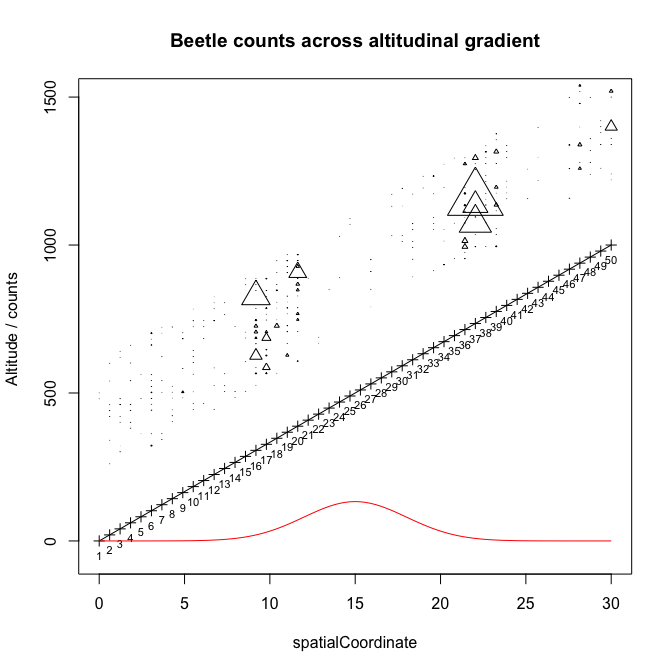

Mixed Model exercise - data creation
=====================


## Background

The national forest agency has asked you for advice - research has suggested that bark beetle attacks will be reduced if the climate becomes wetter under climate change, as suggested for the region we are looking at here.

However, the foresters don't believe this. They suggest that the beetles mostly depend on mimum temperature in winter, which is predicted to increase.  

The forest agency provides you with a dataset of counted bark beetles, and a number of predictors and other variables. Your job is to find out if beetles are depending more on precipitation, or on minimum winter temperatures. 


## The data 

The forest agency measured bark beetle counts over 20 years on 50 different plots in 7 regions across an altitudinal gradient. Measurements were performed by 5 different technicians. 

Environmental predictors are precipitation, average temperature, minimum winter temperature and altitude (the latter is fix for each plot).

<font size="5">

```r
str(data)
```

```
## 'data.frame':	1000 obs. of  11 variables:
##  $ dataID           : int  1 2 3 4 5 6 7 8 9 10 ...
##  $ beetles          : int  0 0 0 0 0 0 0 0 0 0 ...
##  $ precipitation    : num  0.185 0.702 0.573 0.168 0.944 ...
##  $ altitude         : num  0 0 0 0 0 0 0 0 0 0 ...
##  $ temperature      : num  11.43 9.52 13.09 12.29 10.23 ...
##  $ minTemp          : num  -7.17 -7.61 -9.76 -7.59 -12.26 ...
##  $ region           : int  1 1 1 1 1 1 1 1 1 1 ...
##  $ plot             : int  1 1 1 1 1 1 1 1 1 1 ...
##  $ year             : int  1 2 3 4 5 6 7 8 9 10 ...
##  $ technician       : int  1 3 5 2 2 3 5 1 5 1 ...
##  $ spatialCoordinate: num  0 0 0 0 0 0 0 0 0 0 ...
```
</font>

<font size="4">

</font>


<font size="4">

</font>

## Task

Analyze the data and give your evaluation of the situation


