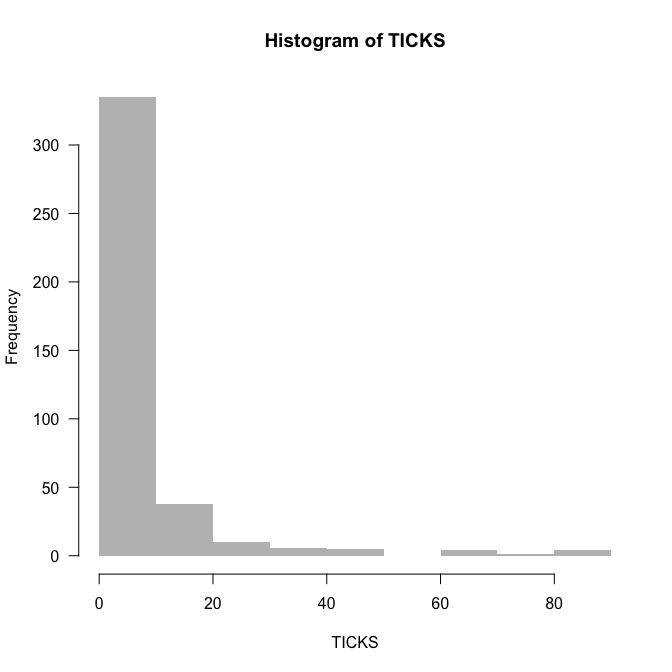
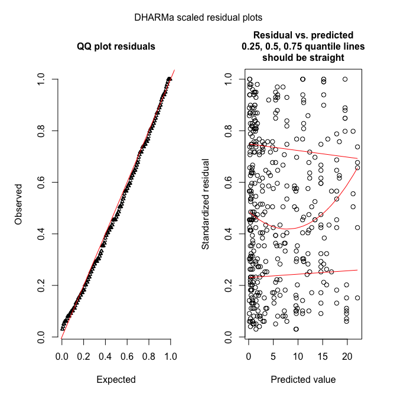
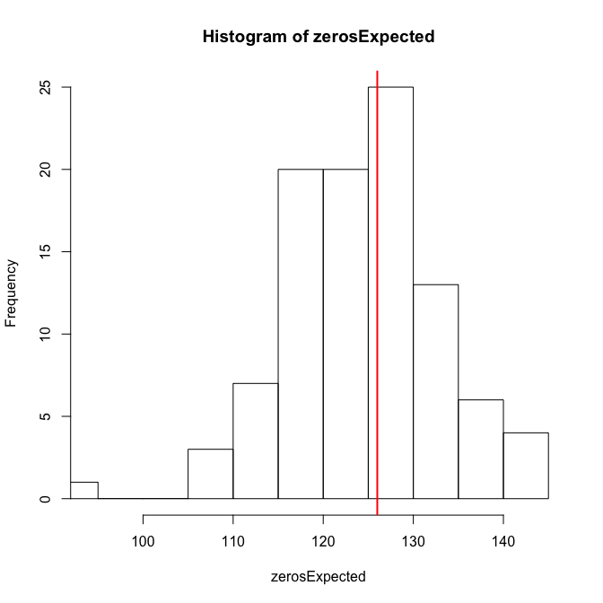
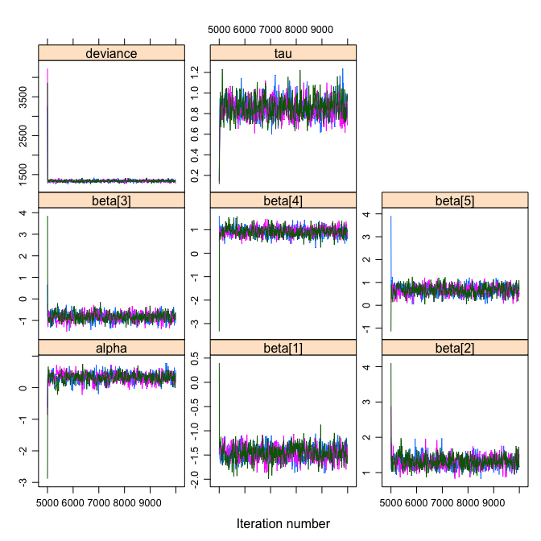
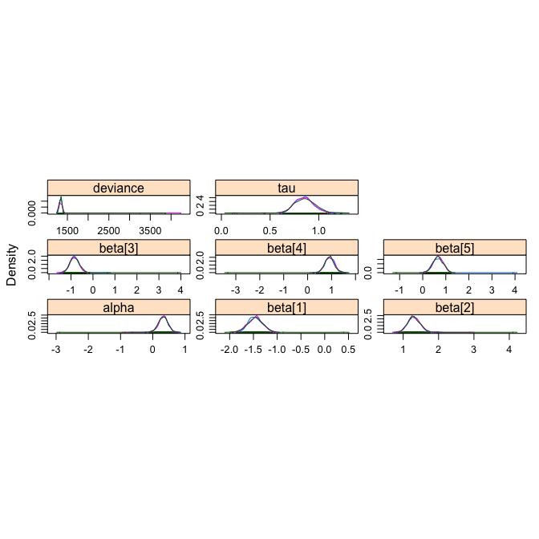

# Introduction: what is overdispersion?
Overdispersion describes the observation that variation is higher than would be expected. Some distributions do not have a parameter to fit variability of the observation. For example, the *normal distribution* does that through the parameter $\sigma$ (i.e. the standard deviation of the model), which is constant in a typical regression. In contrast, the *Poisson distribution* has no such parameter, and in fact the variance increases with the mean (i.e. the variance and the mean have the same value). In this latter case, for an expected value of $E(y)= 5$, we also expect that the variance of observed data points is $5$. But what if it is not? What if the observed variance is much higher, i.e. if the data are overdispersed?
(Note that it could also be lower, underdispersed. This is less often the case, and not all approaches below allow for modelling underdispersion, but some do.)

Overdispersion arises in different ways, most commonly through "clumping". Imagine the number of seedlings in a forest plot. Depending on the distance to the source tree, there may be many (hundreds) or none. The same goes for shooting stars: either the sky is empty, or littered with shooting stars. Such data would be overdispersed for a Poisson distribution.
Also, overdispersion arises "naturally" if important predictors are missing or functionally misspecified (e.g. linear instead of non-linear).

Overdispersion is often mentioned together with zero-inflation, but it is distinct. Overdispersion also includes the case where none of your data points are actually $0$. We'll look at zero-inflation later, and stick to overdispersion here.

# Recognising (and testing for) overdispersion
May we should start with an example to get the point visualised. Note that we manually set the breaks to 1-unit bins, so that we can see the $0$s as they are, not pooled with 1s, 2s, etc.

```r
library(lme4)
data(grouseticks)
summary(grouseticks)
```

```
     INDEX         TICKS           BROOD         HEIGHT      YEAR        LOCATION  
 1      :  1   Min.   : 0.00   606    : 10   Min.   :403.0   95:117   14     : 24  
 2      :  1   1st Qu.: 0.00   602    :  9   1st Qu.:430.0   96:155   4      : 20  
 3      :  1   Median : 2.00   537    :  7   Median :457.0   97:131   19     : 20  
 4      :  1   Mean   : 6.37   601    :  7   Mean   :462.2            28     : 19  
 5      :  1   3rd Qu.: 6.00   643    :  7   3rd Qu.:494.0            50     : 17  
 6      :  1   Max.   :85.00   711    :  7   Max.   :533.0            36     : 16  
 (Other):397                   (Other):356                            (Other):287  
    cHEIGHT       
 Min.   :-59.241  
 1st Qu.:-32.241  
 Median : -5.241  
 Mean   :  0.000  
 3rd Qu.: 31.759  
 Max.   : 70.759  
                  
```

```r
# INDEX is individual
head(grouseticks)
```

```
  INDEX TICKS BROOD HEIGHT YEAR LOCATION   cHEIGHT
1     1     0   501    465   95       32  2.759305
2     2     0   501    465   95       32  2.759305
3     3     0   502    472   95       36  9.759305
4     4     0   503    475   95       37 12.759305
5     5     0   503    475   95       37 12.759305
6     6     3   503    475   95       37 12.759305
```

```r
attach(grouseticks)
hist(TICKS, col="grey", border=NA, las=1, breaks=0:90)
```



The data are rich in $0$s, but that does not mean they are $0$-inflated. We'll find out about overdispersion by fitting the Poisson-model and looking at deviance and degrees of freedom (as a rule of thumb):


```r
plot(TICKS ~ HEIGHT, las=1)
```


```r
summary(fmp <- glm(TICKS ~ HEIGHT*YEAR, family=poisson))
```

```

Call:
glm(formula = TICKS ~ HEIGHT * YEAR, family = poisson)

Deviance Residuals: 
    Min       1Q   Median       3Q      Max  
-6.0993  -1.7956  -0.8414   0.6453  14.1356  

Coefficients:
                Estimate Std. Error z value Pr(>|z|)    
(Intercept)    27.454732   1.084156   25.32   <2e-16 ***
HEIGHT         -0.058198   0.002539  -22.92   <2e-16 ***
YEAR96        -18.994362   1.140285  -16.66   <2e-16 ***
YEAR97        -19.247450   1.565774  -12.29   <2e-16 ***
HEIGHT:YEAR96   0.044693   0.002662   16.79   <2e-16 ***
HEIGHT:YEAR97   0.040453   0.003590   11.27   <2e-16 ***
---
Signif. codes:  0 '***' 0.001 '**' 0.01 '*' 0.05 '.' 0.1 ' ' 1

(Dispersion parameter for poisson family taken to be 1)

    Null deviance: 5847.5  on 402  degrees of freedom
Residual deviance: 3009.0  on 397  degrees of freedom
AIC: 3952

Number of Fisher Scoring iterations: 6
```
In this case, our residual deviance is $3000$ for $397$ degrees of freedom. The rule of thumb is that the ratio of deviance to df should be $1$, but it is $7.6$, indicating severe overdispersion.
This can be done more formally, using either package **AER** or **DHARMa**:

```r
library(AER)
dispersiontest(fmp)
```

```

	Overdispersion test

data:  fmp
z = 4.3892, p-value = 5.69e-06
alternative hypothesis: true dispersion is greater than 1
sample estimates:
dispersion 
  10.57844 
```
The value here is higher than $7.5$ (remember, it was a rule of thumb!), but the result is the same: substantial overdispersion.
Same thing in **DHARMa** (where we can additionally visualise overdispersion):

```r
library(devtools) # assuming you have that
devtools::install_github(repo = "DHARMa", username = "florianhartig", subdir = "DHARMa")
```

```r
library(DHARMa)
sim_fmp <- simulateResiduals(fmp, refit=T) 
testOverdispersion(sim_fmp)
```

```

	Overdispersion test via comparison to simulation under H0

data:  sim_fmp
dispersion = 11.334, p-value < 2.2e-16
alternative hypothesis: overdispersion
```

```r
plotSimulatedResiduals(sim_fmp)
```


**DHARMa** works by simulating new data from the fitted model, and then comparing the observed data to those simulated (see DHARMa's nice vignette for an introduction to the idea).

# "Fixing" overdispersion
Overdispersion means the assumptions of the model are not met, hence we cannot trust its output (e.g. our beloved $P$-values)! Let's do something about it.

## Quasi-families
The quasi-families augment the normal families by adding a dispersion parameter. In other words, while for Poisson data $\bar{Y} = s^2_Y$, the quasi-Poisson allows for $\bar{Y} = \tau \cdot s^2_Y$, and estimates the overdispersion parameter $\tau$ (or underdispersion, if $\tau < 1$).

```r
summary(fmqp <- glm(TICKS ~ YEAR*HEIGHT, family=quasipoisson, data=grouseticks))
```

```

Call:
glm(formula = TICKS ~ YEAR * HEIGHT, family = quasipoisson, data = grouseticks)

Deviance Residuals: 
    Min       1Q   Median       3Q      Max  
-6.0993  -1.7956  -0.8414   0.6453  14.1356  

Coefficients:
                Estimate Std. Error t value Pr(>|t|)    
(Intercept)    27.454732   3.648824   7.524 3.58e-13 ***
YEAR96        -18.994362   3.837731  -4.949 1.10e-06 ***
YEAR97        -19.247450   5.269753  -3.652 0.000295 ***
HEIGHT         -0.058198   0.008547  -6.809 3.64e-11 ***
YEAR96:HEIGHT   0.044693   0.008959   4.988 9.12e-07 ***
YEAR97:HEIGHT   0.040453   0.012081   3.349 0.000890 ***
---
Signif. codes:  0 '***' 0.001 '**' 0.01 '*' 0.05 '.' 0.1 ' ' 1

(Dispersion parameter for quasipoisson family taken to be 11.3272)

    Null deviance: 5847.5  on 402  degrees of freedom
Residual deviance: 3009.0  on 397  degrees of freedom
AIC: NA

Number of Fisher Scoring iterations: 6
```
You see that $\tau$ is estimated as 11.3, a value similar to those in the overdispersion tests above (as you'd expect).
The main effect is the substantially larger errors for the estimates (the point estimates do not change), and hence potentially changed significances (though not here). (You can manually compute the corrected standard errors as Poisson-standard errors $\cdot \sqrt{\tau}$.)
Note that because this is no maximum likelihood method (but a quasi-likelihood method), no likelihood and hence no AIC are available. No overdispersion tests can be conducted for quasi-family objects (neither in **AER** nor **DHARMa**).

## Different distribution (here: negative binomial)
Maybe our distributional assumption was simply wrong, and we choose a different distribution. For Poisson, the most obvious "upgrade" is the negative binomial, which includes in fact a dispersion parameter similar to $\tau$ above.

```r
library(MASS)
summary(fmnb <- glm.nb(TICKS ~ YEAR*HEIGHT, data=grouseticks))
```

```

Call:
glm.nb(formula = TICKS ~ YEAR * HEIGHT, data = grouseticks, init.theta = 0.9000852793, 
    link = log)

Deviance Residuals: 
    Min       1Q   Median       3Q      Max  
-2.3765  -1.0281  -0.5052   0.2408   3.2440  

Coefficients:
                Estimate Std. Error z value Pr(>|z|)    
(Intercept)    20.030124   1.827525  10.960  < 2e-16 ***
YEAR96        -10.820259   2.188634  -4.944 7.66e-07 ***
YEAR97        -10.599427   2.527652  -4.193 2.75e-05 ***
HEIGHT         -0.041308   0.004033 -10.242  < 2e-16 ***
YEAR96:HEIGHT   0.026132   0.004824   5.418 6.04e-08 ***
YEAR97:HEIGHT   0.020861   0.005571   3.745 0.000181 ***
---
Signif. codes:  0 '***' 0.001 '**' 0.01 '*' 0.05 '.' 0.1 ' ' 1

(Dispersion parameter for Negative Binomial(0.9001) family taken to be 1)

    Null deviance: 840.71  on 402  degrees of freedom
Residual deviance: 418.82  on 397  degrees of freedom
AIC: 1912.6

Number of Fisher Scoring iterations: 1

              Theta:  0.9001 
          Std. Err.:  0.0867 

 2 x log-likelihood:  -1898.5880 
```
Already here we see that the ratio of deviance and df is near $1$ and hence probably fine. Let's check:

```r
try(dispersiontest(fmnb))
```
That's a bit disappointing. Well, we'll use **DHARMa** then.

```r
sim_fmnb <- simulateResiduals(fmnb, refit=T, n=99)
plotSimulatedResiduals(sim_fmnb)
```



```r
testOverdispersion(sim_fmnb) # requires refit=T
```

```

	Overdispersion test via comparison to simulation under H0

data:  sim_fmnb
dispersion = 1.3179, p-value = 0.0101
alternative hypothesis: overdispersion
```
These figures show what it should look like!

## Observation-level random effects (OLRE)
The general idea is to allow the expectation to vary more than a Poisson distribution would suggest. To do so, we multiply the Poisson-expectation with an overdispersion parameter ( larger 1), along the lines of $$Y \sim Pois(\lambda=e^{\tau} \cdot E(Y)) = Pois(\lambda=e^{\tau} \cdot e^{aX+b}),$$ where expectation $E(Y)$ is the prediction from our regression. Without overdispersion, $\tau=0$. We use $e^\tau$ to force this factor to be positive.

You may recall that the Poisson-regression uses a log-link, so we can reformulate the above formulation to $$Y \sim Pois(\lambda=e^{\tau} \cdot e^{aX+b}) = Pois(\lambda=e^{aX+b+\tau}).$$
So the overdispersion multiplier at the response-scale becomes an overdispersion summand at the log-scale.


That means, we can add another predictor to our model, one which changes *with each value of Y*, and which we do not really care for: a random effect. Remember that a (Gaussian) random effect has a mean of $0$ and its standard deviation is estimated from the data.
How does that work? Well, if we expected a value of, say, $2$, we add noise to this value, and hence increase the range of values realised. 

```r
set.seed(1)
hist(Y1 <- rpois(1000, 2), breaks=seq(0, 30), col="grey60", freq=F, ylim=c(0, 0.45), las=1, 
     main="", xlab="Y")
hist(Y2 <- rpois(1000, 2 * exp( rnorm(1000, mean=0, sd=1))), add=T, freq=F, breaks=seq(0, 100))
legend("right", legend=c("Poisson", "overdispersed Poisson"), pch=15, col=c("grey40", "grey80"), 
       bty="n", cex=1.5)
```


```r
var(Y1); var(Y2)
```

```
[1] 2.074954
```

```
[1] 23.52102
```
We see that with an overdispersion modelled as observation-level random effect with mean$=0$ and an innocent-looking sd$=1$, we increase the spread of the distribution substantially. In this case both more $0$s *and* more high values, i.e. more variance altogether.


So, in fact modelling overdispersion as OLRE is very simple: just add a random effect which is different for each observation. In our data set, the column INDEX is just a continuously varying value from 1 to $N$, which we use as random effect.

```r
library(lme4)
summary(fmOLRE <- glmer(TICKS ~ YEAR*HEIGHT + (1|INDEX), family=poisson, data=grouseticks))
```

```
Generalized linear mixed model fit by maximum likelihood (Laplace Approximation) ['glmerMod']
 Family: poisson  ( log )
Formula: TICKS ~ YEAR * HEIGHT + (1 | INDEX)
   Data: grouseticks

     AIC      BIC   logLik deviance df.resid 
  1903.0   1931.0   -944.5   1889.0      396 

Scaled residuals: 
    Min      1Q  Median      3Q     Max 
-1.2977 -0.5020 -0.0659  0.2241  1.9138 

Random effects:
 Groups Name        Variance Std.Dev.
 INDEX  (Intercept) 1.132    1.064   
Number of obs: 403, groups:  INDEX, 403

Fixed effects:
                Estimate Std. Error z value Pr(>|z|)    
(Intercept)    19.058416   1.878182  10.147  < 2e-16 ***
YEAR96        -10.435391   2.274773  -4.587 4.49e-06 ***
YEAR97         -9.469675   2.668900  -3.548 0.000388 ***
HEIGHT         -0.040492   0.004149  -9.760  < 2e-16 ***
YEAR96:HEIGHT   0.025381   0.005018   5.058 4.24e-07 ***
YEAR97:HEIGHT   0.018682   0.005885   3.175 0.001500 ** 
---
Signif. codes:  0 '***' 0.001 '**' 0.01 '*' 0.05 '.' 0.1 ' ' 1

Correlation of Fixed Effects:
            (Intr) YEAR96 YEAR97 HEIGHT YEAR96:
YEAR96      -0.825                             
YEAR97      -0.703  0.581                      
HEIGHT      -0.997  0.822  0.701               
YEAR96:HEIG  0.824 -0.997 -0.580 -0.825        
YEAR97:HEIG  0.702 -0.581 -0.997 -0.703  0.582 
convergence code: 0
Model failed to converge with max|grad| = 0.0175048 (tol = 0.001, component 1)
Model is nearly unidentifiable: very large eigenvalue
 - Rescale variables?
Model is nearly unidentifiable: large eigenvalue ratio
 - Rescale variables?
```
Oops! What's that? So it converged ("convergence code: 0"), but apparently the algorithm is "unhappy". Let's follow its suggestion and scale the numeric predictor:


```r
height <- scale(grouseticks$HEIGHT)
summary(fmOLRE <- glmer(TICKS ~ YEAR*height + (1|INDEX), family=poisson, data=grouseticks))
```

```
Generalized linear mixed model fit by maximum likelihood (Laplace Approximation) ['glmerMod']
 Family: poisson  ( log )
Formula: TICKS ~ YEAR * height + (1 | INDEX)
   Data: grouseticks

     AIC      BIC   logLik deviance df.resid 
  1903.0   1931.0   -944.5   1889.0      396 

Scaled residuals: 
     Min       1Q   Median       3Q      Max 
-1.29773 -0.50197 -0.06591  0.22414  1.91377 

Random effects:
 Groups Name        Variance Std.Dev.
 INDEX  (Intercept) 1.132    1.064   
Number of obs: 403, groups:  INDEX, 403

Fixed effects:
              Estimate Std. Error z value Pr(>|z|)    
(Intercept)     0.3414     0.1426   2.395  0.01663 *  
YEAR96          1.2967     0.1705   7.607 2.81e-14 ***
YEAR97         -0.8340     0.2006  -4.157 3.23e-05 ***
height         -1.4559     0.1494  -9.746  < 2e-16 ***
YEAR96:height   0.9126     0.1807   5.050 4.42e-07 ***
YEAR97:height   0.6717     0.2117   3.173  0.00151 ** 
---
Signif. codes:  0 '***' 0.001 '**' 0.01 '*' 0.05 '.' 0.1 ' ' 1

Correlation of Fixed Effects:
            (Intr) YEAR96 YEAR97 height YEAR96:
YEAR96      -0.813                             
YEAR97      -0.668  0.562                      
height       0.312 -0.258 -0.216               
YEAR96:hght -0.251  0.298  0.180 -0.826        
YEAR97:hght -0.206  0.177  0.291 -0.704  0.583 
```
In the random-effects output, we see that the standard deviation for the random effect is around 1.06, i.e. similar to what we have simulated above. The overdispersion is thus substantial.
Note that the estimates for intercept, YEAR96 and YEAR97 are *substantially* different (as is height, but then that has been re-scaled).

Here's the diagnostic plot (only **DHARMa**):

```r
sim_fmOLRE <- simulateResiduals(fmOLRE, refit=T, n=250) # takes a while, about 10 minutes or so
plotSimulatedResiduals(sim_fmOLRE)
```


```r
testOverdispersion(sim_fmOLRE) # requires refit=T
```

```

	Overdispersion test via comparison to simulation under H0

data:  sim_fmOLRE
dispersion = 1.1079, p-value = 0.096
alternative hypothesis: overdispersion
```

```r
testZeroInflation(sim_fmOLRE)  # no zero-inflation
```



```

	Zero-inflation test via comparison to expected zeros with simulation under H0

data:  sim_fmOLRE
ratioObsExp = 1.0107, p-value = 0.416
alternative hypothesis: more
```
Hm. The QQ-plot looks great, but the residual-predicted-plot is miserable. This may be due to a misspecified model (e.g. missing important predictors), leading to underfitting of the high values (all large values have high quantiles, indicating that these residuals (O-E) are all positive and large).

The overdispersion, and just for fun also the zero-inflation test, are negative. So overall I guess that the OLRE-model is fine. 

We can finally compare the actual fit of all models:

```r
AIC(fmp, fmnb, fmOLRE)
```

```
       df      AIC
fmp     6 3951.963
fmnb    7 1912.588
fmOLRE  7 1902.998
```
And the winner is: OLRE!

# Overdispersion in JAGS
In JAGS, we follow the OLRE-approach (we could also fit a negative binomial, of course, but the illustration of the OLRE is much nicer for understanding the workings of JAGS).

First, we need to prepare the data for JAGS, define which parameters to monitor and the settings for sampling, and write an (optional) inits-function. Then we define the actual overdispersion model.

```r
library(R2jags)
# prepare data for JAGS: 
# There is a convenient function to do this for us, and it includes interactions, too!
Xterms <- model.matrix(~ YEAR*height, data=grouseticks)[,-1]
head(Xterms)
```

```
  YEAR96 YEAR97    height YEAR96:height YEAR97:height
1      0      0 0.0767401             0             0
2      0      0 0.0767401             0             0
3      0      0 0.2714198             0             0
4      0      0 0.3548539             0             0
5      0      0 0.3548539             0             0
6      0      0 0.3548539             0             0
```

```r
# The "[,-1]" removes the intercept that would automatically be produced.

grouseticksData <- list(TICKS=grouseticks$TICKS, YEAR96=Xterms[,1], YEAR97=Xterms[,2], HEIGHT=Xterms[,3], 
                        INT96=Xterms[,4], INT97=Xterms[,5], N=nrow(grouseticks))

parameters <- c("alpha", "beta", "tau") # which parameters are we interested in getting reported? , "lambda"

ni <- 1E4; nb <- ni/2  # number of iterations; number of burnins
nc <- 3; nt <- 10      # number of chains; thinning

inits <- function(){list(OLRE=rnorm(nrow(grouseticks), 0, 2), tau=runif(1, 0,.005), 
                         alpha=runif(1, 0, 2), beta = rnorm(5))}

OLRE <- function() {
  for(i in 1:N){ # loop through all data points
    TICKS[i] ~ dpois(lambda[i]) 
    log(lambda[i]) <- alpha + beta[1]*HEIGHT[i] + beta[2]*YEAR96[i] + beta[3]*YEAR97[i] + 
      beta[4]*INT96[i] + beta[5]*INT97[i] + OLRE[i]
    # "OLRE" is random effect for each individual observation
    # alternatively, multiply lambda[i] by exp(OLRE[i]) in the ~ dpois line.
  } 
  
  # priors:
  for (m in 1:5){
    beta[m] ~ dnorm(0, 0.01)      # Linear effects
  }  
  alpha ~ dnorm(0, 0.01)     # overall model intercept
  for (j in 1:N){
    OLRE[j] ~ dnorm(0, tau)    # random effect for each nest
  }
  tau ~ dgamma(0.001, 0.001)    # prior for mixed effect precision
}
```
Now we can run JAGS, print and plot the results:

```r
OLREjags <- jags(grouseticksData, inits=inits, parameters, model.file = OLRE, n.chains = nc, 
                 n.thin = nt, n.iter = ni, n.burnin = nb, working.directory = getwd())
```

```
Compiling model graph
   Resolving undeclared variables
   Allocating nodes
Graph information:
   Observed stochastic nodes: 403
   Unobserved stochastic nodes: 410
   Total graph size: 4183

Initializing model
```

```r
plot(OLREjags)
```


```r
OLREjags
```

```
Inference for Bugs model at "/var/folders/cc/3jfhfx190rb2ptxnqrqxj94m0000gp/T//Rtmp44wxkr/modeld3325b257793.txt", fit using jags,
 3 chains, each with 10000 iterations (first 5000 discarded), n.thin = 10
 n.sims = 1500 iterations saved
          mu.vect sd.vect     2.5%      25%      50%      75%    97.5%  Rhat n.eff
alpha       0.320   0.170    0.014    0.232    0.329    0.418    0.595 1.018  1500
beta[1]    -1.461   0.160   -1.767   -1.564   -1.458   -1.361   -1.163 1.008  1500
beta[2]     1.309   0.189    0.999    1.194    1.297    1.416    1.655 1.000  1500
beta[3]    -0.838   0.239   -1.238   -0.982   -0.844   -0.704   -0.435 1.031   570
beta[4]     0.918   0.220    0.563    0.789    0.919    1.049    1.295 1.031  1500
beta[5]     0.665   0.235    0.229    0.518    0.665    0.816    1.069 1.008  1500
tau         0.852   0.103    0.673    0.783    0.851    0.914    1.050 1.003  1000
deviance 1339.809 113.757 1284.927 1317.200 1335.325 1352.481 1385.537 1.006  1500

For each parameter, n.eff is a crude measure of effective sample size,
and Rhat is the potential scale reduction factor (at convergence, Rhat=1).

DIC info (using the rule, pD = var(deviance)/2)
pD = 6478.5 and DIC = 7818.4
DIC is an estimate of expected predictive error (lower deviance is better).
```

```r
OLREjags$BUGSoutput$mean # just the means
```

```
$alpha
[1] 0.3202091

$beta
[1] -1.4609046  1.3092390 -0.8377453  0.9178329  0.6646542

$deviance
[1] 1339.809

$tau
[1] 0.8517494
```


```r
OLREmcmc <- as.mcmc.list(OLREjags$BUGSoutput)
library(lattice)
xyplot(OLREmcmc,layout=c(3,3))
```



```r
densityplot(OLREmcmc, layout=c(3,3))
```



```r
gelman.diag(OLREmcmc)
```

```
Potential scale reduction factors:

         Point est. Upper C.I.
alpha          1.02       1.02
beta[1]        1.01       1.01
beta[2]        1.01       1.01
beta[3]        1.03       1.04
beta[4]        1.03       1.03
beta[5]        1.01       1.01
deviance       1.02       1.02
tau            1.00       1.01

Multivariate psrf

1.01
```
This JAGS-object is not directly amenable to overdispersion-diagnostics with **DHARMa** (but see the experimental function <tt>createDHARMa</tt>). We can do something manually ourselves, but it is not identical to the output we had looked at before. I shall therefore leave it out here.
