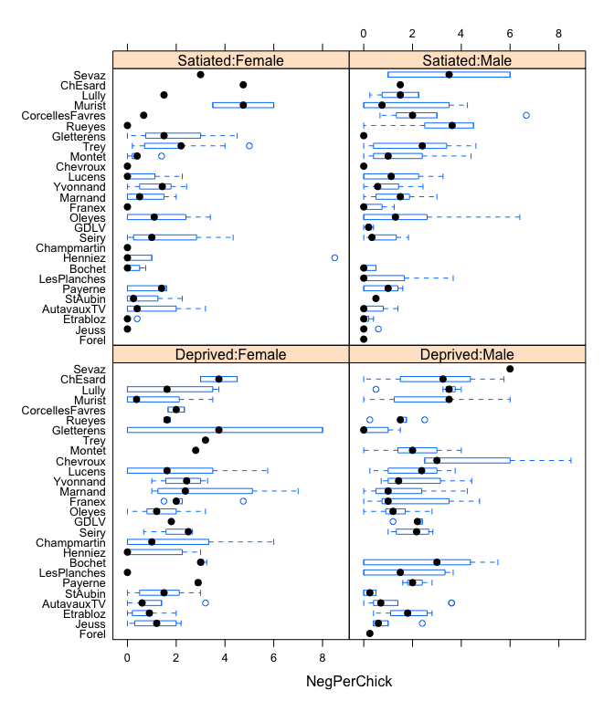
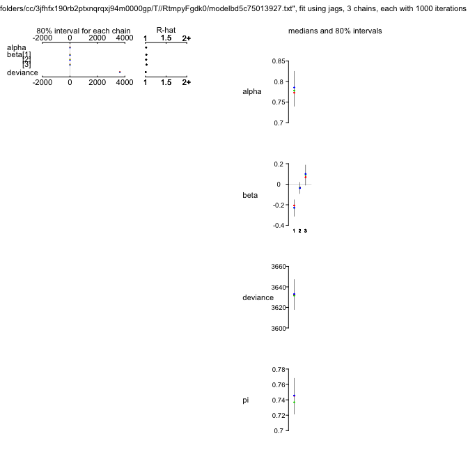
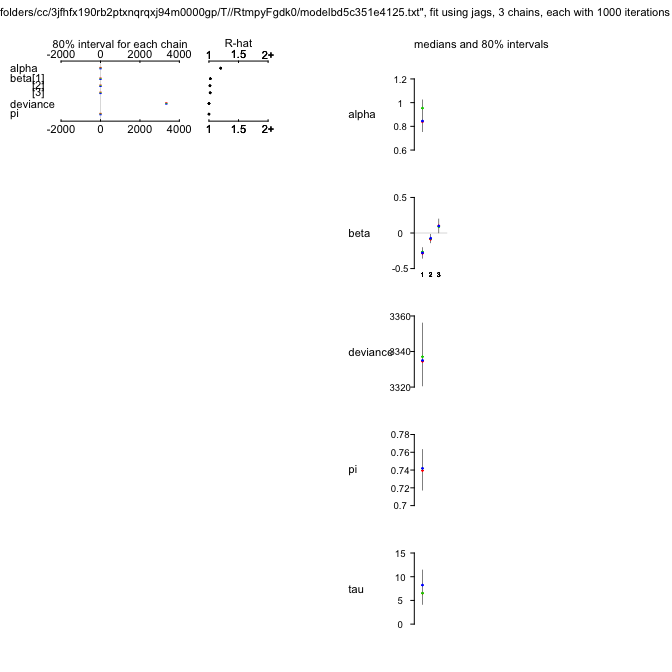
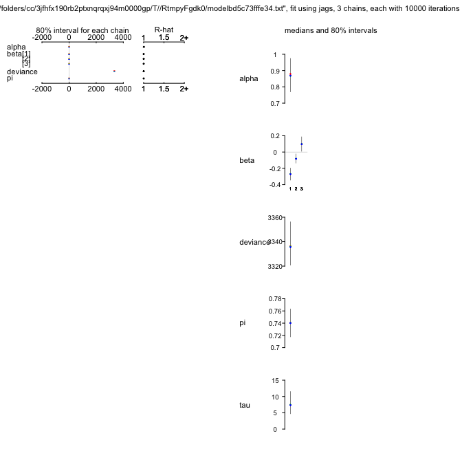
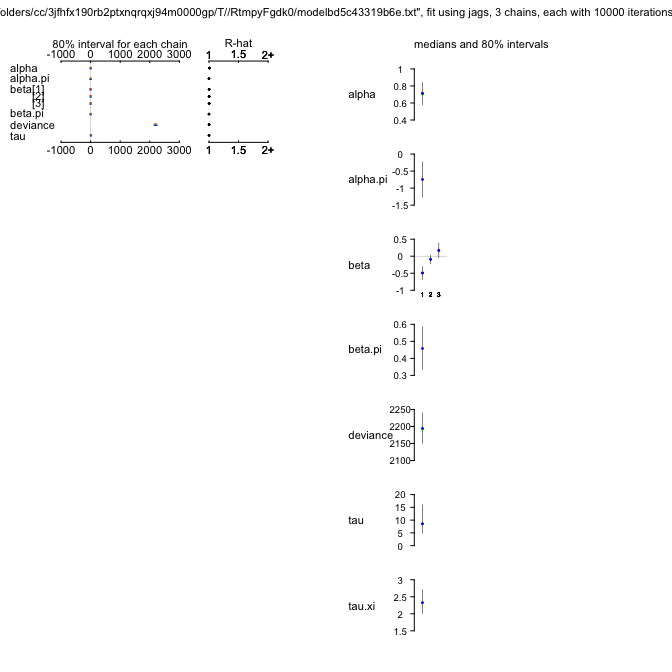
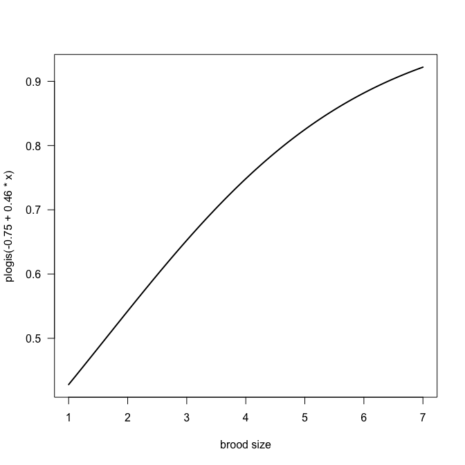
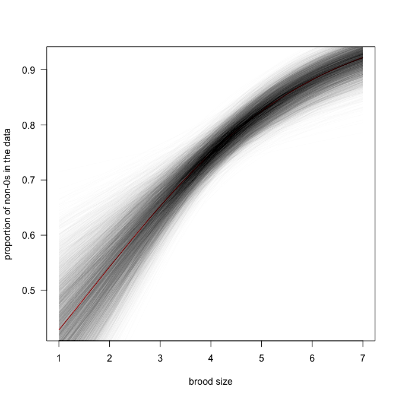
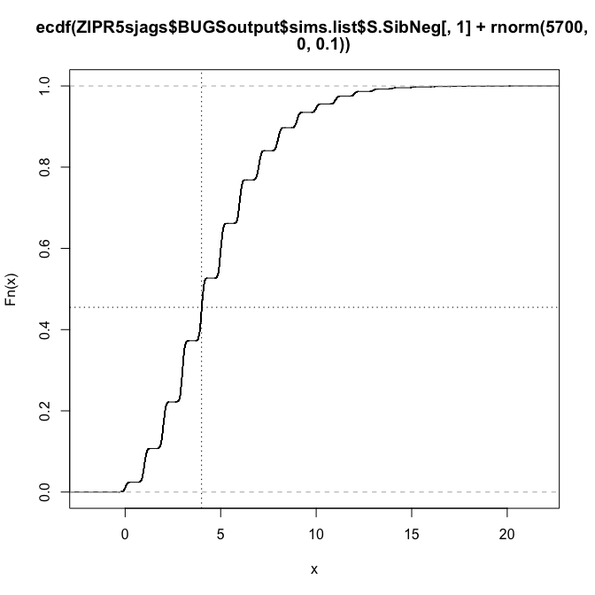
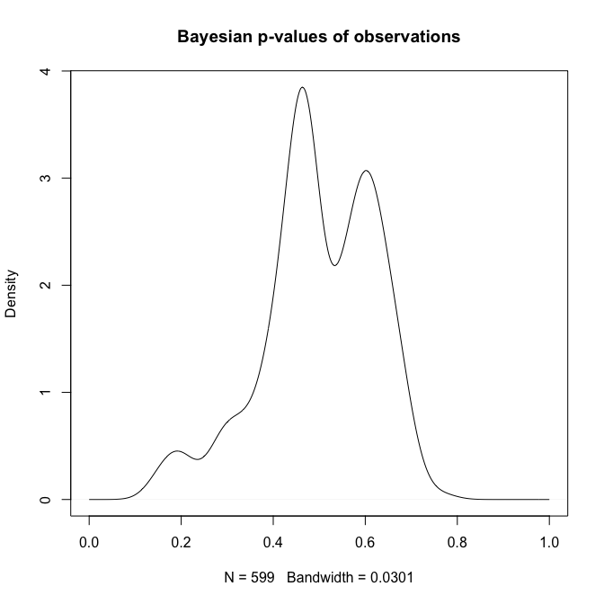
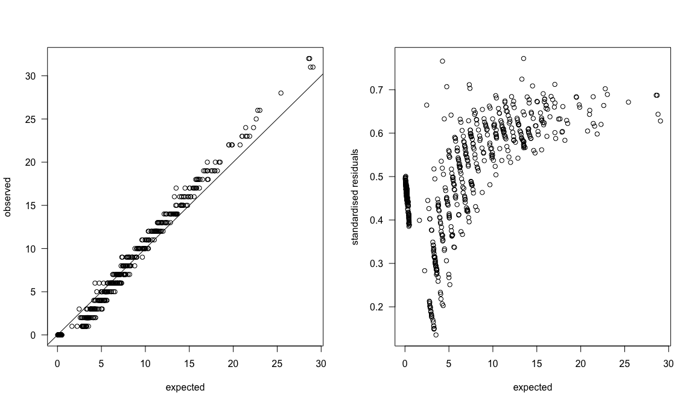

# Introduction: what is zero-inflation?

Put simply, if you have more $0$s in your data than you would expect, you are facing zero-inflation. One common cause of zero-inflation is overdispersion (dealt with in a separate example). If there is zero-inflation even *after* properly modelling overdispersion (e.g. through a different family or observation-level random effects), then we are talking *real* zero-inflation, in the strict sense.

We imagine the excess $0$s to be the result of observing the outcome of two co-occurring processes, each contributing some of the $0$s. Let's take an ecological example.

Imagine we count the number of frogs in 100 ponds at different distances from the river Elbe (as in the paper by Dick et al., about to be published in J. Herpetology). We find that some ponds have no frog, others hundreds. A histogram reveals a high number of $0$s (not shown), and an excess even after using the negative binomial. The authors hypothesis that two processes determine the number of frogs in a pond: (1) the distance to the river determines whether a pond is colonised; (2) if colonised, the local conditions (pond area, hydroperiod, fish) determine survival of spawning frogs, and hence finally the number of individuals. 

# Mixture of distributions
Thus, our data are a *mixture* of two distributions: one that describes *whether* a frog has reached the pond, and one that describes *how many* eggs hatched *if* a frog reached the pond. In perfect analogy, we also have to model the data as a mixture of two distributions, one for each of these two processes:

$$Y \sim \begin{cases} Pois(\lambda=\text{mean abundance}) & \text{, frog arrived} \\ 0 & \text{, frog did not arrive, with probability } \pi \end{cases}$$
A mixture distribution is defined (according to Wikipedia and my understanding) as "a collection of random variables derived as follows: first, a random variable is selected by chance from the collection according to given probabilities of selection, and then the value of the selected random variable is realized". This may sound unnecessarily complicated, but essentially we use one distribution to pick another one, from which we then draw the actual realised observation $Y_i$. In our pond example, we draw from the Bernoulli distribution whether a pond has been colonised, and then draw 0, if it hasn't, or from a Poisson if it has.

We can also write down the actual probabilities of observing $x$ frogs in a pond, remembering that the Poisson distribution looks like this:
$$P(k=x) = \frac{\lambda^x e^{-lambda}}{x!}$$
Then our new mixture of the Bernoulli (for the colonisation process) and Poisson (for the population dynamics) is:
$$\begin{aligned} P(k=0) &= \pi (1-\pi)e^{-\lambda}\\
P(k=x) &= (1-\pi)\frac{\lambda^x e^{-\lambda}}{x!} 
\end{aligned}$$

So we see that our observed $0$s have two sources: those that are $0$ because of the Bernoulli distribution (the proportion $\pi$), plus those from the Poisson distribution for the ponds that *have* been colonised, but failed to generate surviving frogs (the proportion $(1-\pi)$ times the proportion of $0s$ in the Poisson distribution with a given $\lambda$, which we can get from the Poisson distribution equation).

# Modelling mixture distributions in JAGS

We use the owl begging data set of Roulin & Bersier (2007) from the **glmmADMB**-package. It describes the number of begging calls ("sibling negotiations") in a nest for females and males, being well-fed or food-deprived. The data look like this:

```r
if ("glmmADMB" %in% rownames(installed.packages()) == FALSE){
	install.packages("R2admb")
	install.packages("glmmADMB", repos=c("http://glmmadmb.r-forge.r-project.org/repos",  getOption("repos")),  type="source")
}

library(glmmADMB)
data(Owls)
summary(Owls)
```

```
          Nest      FoodTreatment  SexParent    ArrivalTime    SiblingNegotiation   BroodSize    
 Oleyes     : 52   Deprived:320   Female:245   Min.   :21.71   Min.   : 0.00      Min.   :1.000  
 Montet     : 41   Satiated:279   Male  :354   1st Qu.:23.11   1st Qu.: 0.00      1st Qu.:4.000  
 Etrabloz   : 34                               Median :24.38   Median : 5.00      Median :4.000  
 Yvonnand   : 34                               Mean   :24.76   Mean   : 6.72      Mean   :4.392  
 Champmartin: 30                               3rd Qu.:26.25   3rd Qu.:11.00      3rd Qu.:5.000  
 Lucens     : 29                               Max.   :29.25   Max.   :32.00      Max.   :7.000  
 (Other)    :379                                                                                 
  NegPerChick     logBroodSize  
 Min.   :0.000   Min.   :0.000  
 1st Qu.:0.000   1st Qu.:1.386  
 Median :1.200   Median :1.386  
 Mean   :1.564   Mean   :1.439  
 3rd Qu.:2.500   3rd Qu.:1.609  
 Max.   :8.500   Max.   :1.946  
                                
```

```r
library(lattice)
bwplot(reorder(Nest,NegPerChick)~NegPerChick|FoodTreatment:SexParent, data=Owls)
```


The model will become slightly complicated by the fact that "SiblingNegotiations" are measured *per nest*, rather than per chick. We hence would need to divide them by the number of chicks per nest, but that would yield non-integer values! The solution is to use brood size as an offset (at the link-scale, i.e. using log(brood size) instead).

## Data preparation for JAGS
Let's see how we can prepare the data for JAGS:

```r
library(R2jags)
# prepare data as JAGS likes it:
attach(Owls)
head(Owls)
```

```
        Nest FoodTreatment SexParent ArrivalTime SiblingNegotiation BroodSize NegPerChick
1 AutavauxTV      Deprived      Male       22.25                  4         5         0.8
2 AutavauxTV      Satiated      Male       22.38                  0         5         0.0
3 AutavauxTV      Deprived      Male       22.53                  2         5         0.4
4 AutavauxTV      Deprived      Male       22.56                  2         5         0.4
5 AutavauxTV      Deprived      Male       22.61                  2         5         0.4
6 AutavauxTV      Deprived      Male       22.65                  2         5         0.4
  logBroodSize
1     1.609438
2     1.609438
3     1.609438
4     1.609438
5     1.609438
6     1.609438
```
Note that FoodTreatment and SexParent are factors. In a model, they need to be numerical values. The simplest way to convert them is like this:

```r
head(as.numeric(FoodTreatment))
```

```
[1] 1 2 1 1 1 1
```
This leads to values of 1, 2, ... . Since there are only two levels, I want them to be 0 and 1:

```r
head(as.numeric(FoodTreatment) - 1)
```

```
[1] 0 1 0 0 0 0
```

```r
# and
head(as.numeric(SexParent) - 1)
```

```
[1] 1 1 1 1 1 1
```
However, there is a more convenient function to do this for us, and include interactions, too!

```r
Xterms <- model.matrix(~ FoodTreatment*SexParent, data=Owls)[,-1]
head(Xterms)
```

```
  FoodTreatmentSatiated SexParentMale FoodTreatmentSatiated:SexParentMale
1                     0             1                                   0
2                     1             1                                   1
3                     0             1                                   0
4                     0             1                                   0
5                     0             1                                   0
6                     0             1                                   0
```
Nice, ey? The "<tt>[,-1]</tt>" removes the intercept that would automatically be produced.

Which leads us to the JAGS-data:

```r
OwlsData <- list(SibNeg = SiblingNegotiation, FoodTreatment=Xterms[,1], SexParent=Xterms[,2], FoodSex=Xterms[,3], Nest=Nest, lgBroodSize=log(BroodSize), N=nrow(Owls), nnests=length(levels(Owls$Nest)) )
detach(Owls)
```
Now comes the crucial bit!

## The first (very primitive) zero-inflation model in JAGS
Note that it is costumary to model the proportion of 1s (now called $\psi = 1-\pi$), rather than the proportion of $0$s ($\pi$)!

```r
ZIPR <- function() {
  for(i in 1:N){ # loop through all data points
    SibNeg[i] ~ dpois(mu[i]) 
    mu[i] <- lambda[i]*z[i] + 0.00001 ## hack required for Rjags -- otherwise 'incompatible'-error 
     z[i] ~ dbern(psi)
    
    log(lambda[i]) <-  lgBroodSize[i] + alpha 
    # lgBroodSize is offset
    # alpha is overall intercept
  } 
 
  # priors:
  alpha ~ dnorm(0, 0.01)     # overall model intercept
  psi ~ dunif(0, 1)          # proportion of non-zeros
}
```

Now we need to define which parameters to monitor, how to initialise them, and what the chain settings are:

```r
parameters <- c("alpha", "psi") # which parameters are we interested in getting reported?

ni <- 1E3; nb <- ni/2 # number of iterations; number of burnins
nc <- 3; nt <- 5      # number of chains; thinning

inits <- function(){list(alpha=runif(1, 0, 2), psi = runif(1, 0, 1))}
```
And now we run it and look at the outcome.

## Run the model
As usual, running the model takes a bit of time.

```r
ZIPRjags <- jags(OwlsData, inits=inits, parameters, model.file = ZIPR, n.chains = nc, n.thin = nt, n.iter = ni, n.burnin = nb, working.directory = getwd())
```

```r
plot(ZIPRjags)
```


```r
ZIPRjags
```

```
Inference for Bugs model at "/var/folders/cc/3jfhfx190rb2ptxnqrqxj94m0000gp/T//Rtmp3nt2lM/model508825e4dc53.txt", fit using jags,
 3 chains, each with 1000 iterations (first 500 discarded), n.thin = 5
 n.sims = 300 iterations saved
          mu.vect sd.vect     2.5%      25%      50%      75%    97.5%  Rhat n.eff
alpha       0.695   0.016    0.665    0.685    0.695    0.704    0.726 1.000   300
psi         0.740   0.019    0.703    0.726    0.740    0.752    0.775 1.001   300
deviance 3655.572  10.674 3641.861 3649.165 3654.024 3662.400 3678.350 1.002   300

For each parameter, n.eff is a crude measure of effective sample size,
and Rhat is the potential scale reduction factor (at convergence, Rhat=1).

DIC info (using the rule, pD = var(deviance)/2)
pD = 57.3 and DIC = 3712.9
DIC is an estimate of expected predictive error (lower deviance is better).
```
So we get estimates for $\psi$ (around 0.74) and $\alpha$ (around 0.69), indicating that there is quite a bit of zero-inflation! However, our model is currently really stupid and does not use any information on the predictors to explain begging. Maybe once we put these in we can explain more of the $0$s by "Poisson-zeros", rather than "Bernoulli-zeros" (aka excess zeros).

# Model 2: add predictors for $\lambda$

```r
ZIPR2 <- function() {
  for(i in 1:N){ # loop through all data points
    SibNeg[i] ~ dpois(mu[i]) 
    mu[i] <- lambda[i]*z[i] + 0.00001 ## hack required for Rjags -- otherwise 'incompatible'-error 
     z[i] ~ dbern(psi)
    
    log(lambda[i]) <-  lgBroodSize[i] + alpha + beta[1]*FoodTreatment[i] + beta[2]*SexParent[i] + beta[3]*FoodSex[i]
    # lgBroodSize is offset
    # alpha is overall intercept
  } 
 
  # priors:
  alpha ~ dnorm(0, 0.01)     # overall model intercept
  for (m in 1:3){
      beta[m] ~ dnorm(0, 0.01)      # Linear effects
  }  
  psi ~ dunif(0, 1)          # proportion of non-zeros
}
```

```r
parameters <- c("alpha", "beta", "psi") # which parameters are we interested in getting reported?
ZIPR2jags <- jags(OwlsData, inits=inits, parameters, model.file = ZIPR2, n.chains = nc, n.thin = nt, n.iter = ni, n.burnin = nb, working.directory = getwd())
```

```r
plot(ZIPR2jags)
```



```r
ZIPR2jags
```

```
Inference for Bugs model at "/var/folders/cc/3jfhfx190rb2ptxnqrqxj94m0000gp/T//Rtmp3nt2lM/model508817f056ad.txt", fit using jags,
 3 chains, each with 1000 iterations (first 500 discarded), n.thin = 5
 n.sims = 300 iterations saved
          mu.vect sd.vect     2.5%      25%      50%      75%    97.5%  Rhat n.eff
alpha       0.777   0.037    0.709    0.754    0.778    0.802    0.844 1.015   120
beta[1]    -0.222   0.055   -0.330   -0.262   -0.220   -0.181   -0.125 1.014   170
beta[2]    -0.027   0.045   -0.112   -0.058   -0.027    0.001    0.062 1.011   150
beta[3]     0.077   0.071   -0.056    0.023    0.075    0.131    0.194 1.004   300
psi         0.743   0.018    0.708    0.732    0.744    0.755    0.774 0.997   300
deviance 3632.916  12.067 3615.077 3624.123 3631.281 3639.269 3662.814 0.999   300

For each parameter, n.eff is a crude measure of effective sample size,
and Rhat is the potential scale reduction factor (at convergence, Rhat=1).

DIC info (using the rule, pD = var(deviance)/2)
pD = 73.2 and DIC = 3706.1
DIC is an estimate of expected predictive error (lower deviance is better).
```
So while the model has improved (the DIC is lower by 10 units), the value for $\psi$ hasn't changed much.

We can do better still.

Notice that so far the siblings within a nest are treated as independent, while they are in fact "nested" (pun intended). So we need to incorporate a random term for nest as well.

# Model 3: add random effect for nest

```r
ZIPR3 <- function() {
  for(i in 1:N){ # loop through all data points
    SibNeg[i] ~ dpois(mu[i]) 
    mu[i] <- lambda[i]*z[i] + 0.00001 ## hack required for Rjags -- otherwise 'incompatible'-error 
     z[i] ~ dbern(psi)
    
    log(lambda[i]) <-  lgBroodSize[i] + alpha + beta[1]*FoodTreatment[i] + beta[2]*SexParent[i] + beta[3]*FoodSex[i] + a[Nest[i]]
    # lgBroodSize is offset
    # alpha is overall intercept
    # "a" is random effect of nest; because alpha is overall intercept, a should be centred on 0.
  } 
 
  # priors:
  alpha ~ dnorm(0, 0.01)     # overall model intercept
  for (m in 1:3){
      beta[m] ~ dnorm(0, 0.01)      # Linear effects
  }  
  psi ~ dunif(0, 1)          # proportion of non-zeros
  for (j in 1:nnests){
    a[j] ~ dnorm(0, tau)     # random effect for each nest
  }
  tau ~ dgamma(0.001, 0.001) # prior for mixed effect variance

}
```

```r
parameters <- c("alpha", "beta", "psi", "tau") # which parameters are we interested in getting reported?
ZIPR3jags <- jags(OwlsData, inits=inits, parameters, model.file = ZIPR3, n.chains = nc, n.thin = nt, n.iter = ni, n.burnin = nb, working.directory = getwd())
```

```r
plot(ZIPR3jags)
```



```r
ZIPR3jags
```

```
Inference for Bugs model at "/var/folders/cc/3jfhfx190rb2ptxnqrqxj94m0000gp/T//Rtmp3nt2lM/model508836ca17c9.txt", fit using jags,
 3 chains, each with 1000 iterations (first 500 discarded), n.thin = 5
 n.sims = 300 iterations saved
          mu.vect sd.vect     2.5%      25%      50%      75%    97.5%  Rhat n.eff
alpha       0.863   0.084    0.680    0.810    0.870    0.917    1.018 1.004   300
beta[1]    -0.254   0.060   -0.378   -0.289   -0.253   -0.214   -0.146 0.998   300
beta[2]    -0.070   0.046   -0.156   -0.103   -0.073   -0.036    0.016 1.006   300
beta[3]     0.082   0.073   -0.051    0.029    0.076    0.128    0.233 1.001   300
psi         0.741   0.019    0.700    0.728    0.741    0.754    0.774 1.004   300
tau         8.005   2.810    3.650    6.041    7.717    9.591   15.517 1.003   300
deviance 3336.646  12.951 3313.077 3328.174 3334.857 3344.479 3364.048 0.998   300

For each parameter, n.eff is a crude measure of effective sample size,
and Rhat is the potential scale reduction factor (at convergence, Rhat=1).

DIC info (using the rule, pD = var(deviance)/2)
pD = 84.4 and DIC = 3421.1
DIC is an estimate of expected predictive error (lower deviance is better).
```
While we are now seeing a dramatic improvement in fit (DIC down by another 260 units or so!), we also notice that convergence has suffered, and the $\hat{R}$-values are higher than they should be for $\alpha$. We re-adjust our settings and repeat the run (which will take around 10 times as long).

```r
ni <- 1E4
parameters <- c("alpha", "beta", "psi", "tau") # which parameters are we interested in getting reported?
ZIPR3jags <- jags(OwlsData, inits=inits, parameters, model.file = ZIPR3, n.chains = nc, n.thin = nt, n.iter = ni, n.burnin = nb, working.directory = getwd())
```

```r
plot(ZIPR3jags)
```



```r
ZIPR3jags
```

```
Inference for Bugs model at "/var/folders/cc/3jfhfx190rb2ptxnqrqxj94m0000gp/T//Rtmp3nt2lM/model5088435e6622.txt", fit using jags,
 3 chains, each with 10000 iterations (first 500 discarded), n.thin = 5
 n.sims = 5700 iterations saved
          mu.vect sd.vect     2.5%      25%      50%      75%    97.5%  Rhat n.eff
alpha       0.861   0.087    0.688    0.804    0.863    0.920    1.029 1.013   160
beta[1]    -0.269   0.059   -0.385   -0.308   -0.268   -0.229   -0.153 1.001  5700
beta[2]    -0.079   0.046   -0.169   -0.110   -0.079   -0.048    0.014 1.001  5700
beta[3]     0.095   0.073   -0.048    0.046    0.095    0.144    0.235 1.001  5700
psi         0.741   0.018    0.705    0.729    0.741    0.753    0.775 1.001  5700
tau         7.732   2.711    3.448    5.836    7.361    9.273   14.022 1.002  1300
deviance 3337.793  14.126 3315.107 3327.365 3336.244 3346.369 3369.838 1.001  5000

For each parameter, n.eff is a crude measure of effective sample size,
and Rhat is the potential scale reduction factor (at convergence, Rhat=1).

DIC info (using the rule, pD = var(deviance)/2)
pD = 99.8 and DIC = 3437.6
DIC is an estimate of expected predictive error (lower deviance is better).
```
Okay. Again, $\psi$ is still high and seems to be a feature of the data, rather than due to our poor modelling of $\lambda$.

So, a first result interpretation is indicated:
**What effects do you see, and what do they mean?**


# Model 4: add effect of brood size on whether the chicks call at all
It could be that a clutch of chicks is more vocal when it is larger. A single chick may remain silent more often than it would when in a group of siblings (maybe I am extrapolating too much from football supporters on their way to the stadium). Statistically, we can make $\psi$ a function of other predictors, too, in this case of brood size. Let's try.


```r
ZIPR4 <- function() {
  for(i in 1:N){ # loop through all data points
    SibNeg[i] ~ dpois(mu[i]) 
    mu[i] <- lambda[i]*z[i] + 0.00001 ## hack required for Rjags -- otherwise 'incompatible'-error 
    
    z[i] ~ dbern(psi[i])
    logit(psi[i]) <- alpha.psi + beta.psi*exp(lgBroodSize[i]) 
    
    log(lambda[i]) <-  lgBroodSize[i] + alpha + beta[1]*FoodTreatment[i] + beta[2]*SexParent[i] + beta[3]*FoodSex[i] + a[Nest[i]]
    # lgBroodSize is offset
    # alpha is overall intercept
    # "a" is random effect of nest; because alpha is overall intercept, a should be centred on 0.
  } 
 
  # priors:
  alpha ~ dnorm(0, 0.01)     # overall model intercept
  for (m in 1:3){
      beta[m] ~ dnorm(0, 0.01)      # Linear effects
  }  
  # remove this: psi ~ dunif(0, 1)          # proportion of non-zeros
  for (j in 1:nnests){
    a[j] ~ dnorm(0, tau)     # random effect for each nest
  }
  tau ~ dgamma(0.001, 0.001) # prior for mixed effect variance
  alpha.psi ~ dnorm(0, 0.01)
  beta.psi  ~ dnorm(0, 0.01)

}
```
Since I am too lazy to re-code the inits-function, I simply set the inits-argument to auto-pilot.

```r
parameters <- c("alpha", "beta", "tau", "alpha.psi", "beta.psi") # which parameters are we interested in getting reported?
ZIPR4jags <- jags(OwlsData, inits=NULL, parameters, model.file = ZIPR4, n.chains = nc, n.thin = nt, n.iter = ni, n.burnin = nb, working.directory = getwd())
```

```r
plot(ZIPR4jags)
```


```r
ZIPR4jags
```

```
Inference for Bugs model at "/var/folders/cc/3jfhfx190rb2ptxnqrqxj94m0000gp/T//Rtmp3nt2lM/model508833669bf.txt", fit using jags,
 3 chains, each with 10000 iterations (first 500 discarded), n.thin = 5
 n.sims = 5700 iterations saved
           mu.vect sd.vect     2.5%      25%      50%      75%    97.5%  Rhat n.eff
alpha        0.873   0.083    0.709    0.819    0.872    0.926    1.039 1.012   300
alpha.psi   -0.828   0.373   -1.553   -1.083   -0.827   -0.570   -0.081 1.001  5700
beta[1]     -0.272   0.058   -0.385   -0.311   -0.272   -0.232   -0.158 1.001  5600
beta[2]     -0.081   0.046   -0.171   -0.112   -0.081   -0.049    0.008 1.002  2100
beta[3]      0.099   0.072   -0.043    0.051    0.099    0.147    0.239 1.001  5700
beta.psi     0.442   0.086    0.273    0.384    0.441    0.501    0.611 1.001  5700
tau          7.678   2.707    3.495    5.730    7.309    9.222   13.889 1.002  2200
deviance  3336.929  13.632 3315.456 3327.124 3335.439 3344.824 3368.752 1.001  5700

For each parameter, n.eff is a crude measure of effective sample size,
and Rhat is the potential scale reduction factor (at convergence, Rhat=1).

DIC info (using the rule, pD = var(deviance)/2)
pD = 92.9 and DIC = 3429.8
DIC is an estimate of expected predictive error (lower deviance is better).
```
And this model is better still (although "only" by 5 DIC-units).

So the one thing that we could still add is overdispersion as observation-level random effect. This is more to show that we can, and less because I think it is really necessary.

# Model 5: add OLRE-overdispersion
We add OLRE in the form of an additive effect $\xi$ at the level of the Poisson regression. All $\xi$ are normally distributed with mean 0 (otherwise they'd compete with intercept $\alpha$), and the precision of that normal distribution is taken to be $\gamma$-distributed (as is common for precision).

Note that we now have two competing random effects: one at the level of the nest ($a$) and one at the level of the individual observation ($\xi$).


```r
ZIPR5 <- function() {
  for(i in 1:N){ # loop through all data points
    SibNeg[i] ~ dpois(mu[i]) 
    mu[i] <- lambda[i]*z[i] + 0.00001 ## hack required for Rjags -- otherwise 'incompatible'-error 
    
    z[i] ~ dbern(psi[i])
    logit(psi[i]) <- alpha.psi + beta.psi*exp(lgBroodSize[i]) 
    
    log(lambda[i]) <-  lgBroodSize[i] + alpha + beta[1]*FoodTreatment[i] + beta[2]*SexParent[i] + beta[3]*FoodSex[i] + a[Nest[i]] + xi[i]
    # lgBroodSize is offset
    # alpha is overall intercept
    # "a" is random effect of nest; because alpha is overall intercept, a should be centred on 0.
  } 
 
  # priors:
  alpha ~ dnorm(0, 0.01)     # overall model intercept
  for (m in 1:3){
      beta[m] ~ dnorm(0, 0.01)      # Linear effects
  }  
  # remove this: psi ~ dunif(0, 1)          # proportion of non-zeros
  for (j in 1:nnests){
    a[j] ~ dnorm(0, tau)     # random effect for each nest
  }
  tau ~ dgamma(0.001, 0.001) # prior for mixed effect variance
  alpha.psi ~ dnorm(0, 0.01)
  beta.psi  ~ dnorm(0, 0.01)

  for (i in 1:N){
  	xi[i] ~ dnorm(0, tau.xi) # on average, xi should be 0 otherwise it competes with the intercept alpha!
  }
  tau.xi ~ dgamma(0.001, 0.001) # prior for mixed effect variance

}
```

```r
parameters <- c("alpha", "beta", "tau", "alpha.psi", "beta.psi", "tau.xi") # which parameters are we interested in getting reported?
ZIPR5jags <- jags(OwlsData, inits=NULL, parameters, model.file = ZIPR5, n.chains = nc, n.thin = nt, n.iter = ni, n.burnin = nb, working.directory = getwd())
```

```r
plot(ZIPR5jags)
```



```r
ZIPR5jags
```

```
Inference for Bugs model at "/var/folders/cc/3jfhfx190rb2ptxnqrqxj94m0000gp/T//Rtmp3nt2lM/model50881f668080.txt", fit using jags,
 3 chains, each with 10000 iterations (first 500 discarded), n.thin = 5
 n.sims = 5700 iterations saved
           mu.vect sd.vect     2.5%      25%      50%      75%    97.5%  Rhat n.eff
alpha        0.719   0.109    0.511    0.644    0.717    0.791    0.948 1.032    91
alpha.psi   -0.746   0.417   -1.563   -1.027   -0.750   -0.459    0.050 1.001  3100
beta[1]     -0.498   0.143   -0.781   -0.593   -0.497   -0.404   -0.214 1.018   170
beta[2]     -0.104   0.106   -0.310   -0.176   -0.105   -0.036    0.114 1.017   140
beta[3]      0.182   0.169   -0.152    0.069    0.182    0.298    0.506 1.016   170
beta.psi     0.459   0.099    0.270    0.391    0.460    0.525    0.655 1.001  4000
tau         10.122   5.770    3.544    6.427    8.858   12.138   24.233 1.006   530
tau.xi       2.336   0.269    1.841    2.149    2.323    2.505    2.903 1.002  2400
deviance  2193.981  34.979 2128.450 2169.281 2193.797 2217.590 2262.885 1.001  3600

For each parameter, n.eff is a crude measure of effective sample size,
and Rhat is the potential scale reduction factor (at convergence, Rhat=1).

DIC info (using the rule, pD = var(deviance)/2)
pD = 611.6 and DIC = 2805.6
DIC is an estimate of expected predictive error (lower deviance is better).
```
Oh, that's somewhat of a surprise! The DIC dropped precipitously to just under 2800, i.e. by over 500 units. So I guess the data were substantially overdispersed, not only zero-inflated. Zero-inflation is still prevalent, and we should plot the relationship for $\psi$ to see which values it takes.


```r
curve(plogis(-0.75 + 0.46*x), from=min(Owls$BroodSize), to=max(Owls$BroodSize), lwd=2, las=1, xlab="brood size")
```


Obviously we should do this with all samples, not just the mean estimates:

```r
# str(ZIPR5jags$BUGSoutput$sims.list)
curve(plogis(-0.75 + 0.46*x), from=min(Owls$BroodSize), to=max(Owls$BroodSize), lwd=1, col="red", las=1, xlab="brood size", ylab="proportion of non-0s in the data")
for (i in 1:length(ZIPR5jags$BUGSoutput$sims.list$alpha.psi)){
  thisA <- ZIPR5jags$BUGSoutput$sims.list$alpha.psi[i]
  thisB <- ZIPR5jags$BUGSoutput$sims.list$beta.psi[i]
  curve(plogis(thisA + thisB*x), from=min(Owls$BroodSize), to=max(Owls$BroodSize), add=T, col=rgb(0.1, 0.1, 0.1, 0.01))
}
```


So the proportion of $0$s is between 0.4 and 0.9, and the trend is positive (i.e. more non-$0$s when there are more siblings). So owl chicks are very much like football supporters, it seems.


# Model diagnostics: simulation from model (5b)
So far we have not spend any time on evaluating whether any of the models was really "good". That is not a trivial task, and we need to consider a new idea before being able to do so.

**We call a model "good", if it is able to invent data that look like those we used to fit it to.**

That is (I hope) logical. If a model fits poorly, then simulating (= inventing) data based on this model will lead to data that may look very different from the original data. A near-perfect fit, in contrast, will yield simulated data very similar to those observed. 

In the following code, we simulate data from the model, not once, but several thousand times. We can then see, how our observed data are positioned within the several thousand simulations (e.g. on which quantile they lie; this is called the "Bayesian p-value").

To simulate, it is easiest to use JAGS itself, rather than its output. To do so, we "invent" our response again, within the model, with a new name (in this case <tt>S.SibNeg</tt>, with <tt>S</tt>. standing for "simulated"). Unsurprisingly, almost doubling the number of parameters will also lead to substantially longer computation time!

```r
ZIPR5s <- function() {
  for(i in 1:N){ # loop through all data points
    SibNeg[i] ~ dpois(mu[i]) 
    mu[i] <- lambda[i]*z[i] + 0.00001 ## hack required for Rjags -- otherwise 'incompatible'-error 
    
    z[i] ~ dbern(psi[i])
    logit(psi[i]) <- alpha.psi + beta.psi*exp(lgBroodSize[i]) 
    
    log(lambda[i]) <-  lgBroodSize[i] + alpha + beta[1]*FoodTreatment[i] + beta[2]*SexParent[i] + beta[3]*FoodSex[i] + a[Nest[i]] + xi[i]
    # lgBroodSize is offset
    # alpha is overall intercept
    # "a" is random effect of nest; because alpha is overall intercept, a should be centred on 0.
  } 
  
  # priors:
  alpha ~ dnorm(0, 0.01)     # overall model intercept
  for (m in 1:3){
      beta[m] ~ dnorm(0, 0.01)      # Linear effects
  }  
  # remove this: psi ~ dunif(0, 1)          # proportion of non-zeros
  for (j in 1:nnests){
    a[j] ~ dnorm(0, tau)     # random effect for each nest
  }
  tau ~ dgamma(0.001, 0.001) # prior for mixed effect variance
  alpha.psi ~ dnorm(0, 0.01)
  beta.psi  ~ dnorm(0, 0.01)

  for (i in 1:N){
  	xi[i] ~ dnorm(0, tau.xi) # on average, xi should be 0 otherwise it competes with the intercept alpha!
  }
  tau.xi ~ dgamma(0.001, 0.001) # prior for mixed effect variance

  # # # # # # # # # # # # # # # 
  # simulate data here:
  # replace all latent variables L with an S.L (mu, lambda, psi, z), as well as the response:
  for (i in 1:N){ # loop through all data points
    S.SibNeg[i] ~ dpois(S.mu[i]) 
    S.mu[i] <- S.lambda[i]*z[i] + 0.00001 ## hack required for Rjags -- otherwise 'incompatible'-error 
    
    S.z[i] ~ dbern(S.psi[i])
    logit(S.psi[i]) <- alpha.psi + beta.psi*exp(lgBroodSize[i]) 
    
    log(S.lambda[i]) <-  lgBroodSize[i] + alpha + beta[1]*FoodTreatment[i] + beta[2]*SexParent[i] + beta[3]*FoodSex[i] + a[Nest[i]] + xi[i]
  } 
  
}
```

```r
parameters <- c("alpha", "beta", "tau", "alpha.psi", "beta.psi", "tau.xi", "S.SibNeg") # which parameters are we interested in getting reported?
ZIPR5sjags <- jags(OwlsData, inits=NULL, parameters, model.file = ZIPR5s, n.chains = nc, n.thin = nt, n.iter = ni, n.burnin = nb, working.directory = getwd())
```
We rather not look at the plot, where there would now be 599 values for <tt>S.SibNeg</tt> in addition to all the model parameters we have looked at before. Same for the summary of the model, which also should be the same as in model 5.

Instead, we extract the simulated data for each original data point. First, as an example, for the first data point only:

```r
plot(ecdf(ZIPR5sjags$BUGSoutput$sims.list$S.SibNeg[,1]+rnorm(5700, 0, 0.1)), verticals=T)
abline(v=Owls$SiblingNegotiation[1], lty=3)
abline(h=ecdf(ZIPR5sjags$BUGSoutput$sims.list$S.SibNeg[,1]+rnorm(5700, 0, 0.1))(Owls$SiblingNegotiation[1]), lty=3)
```


Notice that adding some noise smoothes out the ECDF-curve, as has been recommended (somewhere).

So we see that the first data point (4 calls) lies roughly at the 0.5 quantile of the simulated data. Let's do this computation for all observations (and simulations), and plot these quantiles:

```r
qq <- numeric(599)
for (i in 1:599){
    qq[i] <- ecdf(ZIPR5sjags$BUGSoutput$sims.list$S.SibNeg[,i]+rnorm(5700, 0, 0.1))(Owls$SiblingNegotiation[i]+rnorm(5700, 0, 0.1))
}
plot(density(qq, from=0, to=1), main="Bayesian p-values of observations")
```



```r
summary(qq)
```

```
   Min. 1st Qu.  Median    Mean 3rd Qu.    Max. 
0.00193 0.38590 0.54750 0.49990 0.62780 0.96750 
```
Ideally, we want our observations to be more or less evenly distributed across the range from $0$ to $1$. That is clearly not the case. What we see is that most observations are around quantiles 0.45 and 0.6, in a very non-uniform fashion.


```r
par(mfrow=c(1,2))
plot(apply(ZIPR5sjags$BUGSoutput$sims.list$S.SibNeg, 2, mean), Owls$SiblingNegotiation, las=1, xlab="expected", ylab="observed")
abline(0,1)
plot(qq ~ apply(ZIPR5sjags$BUGSoutput$sims.list$S.SibNeg, 2, mean), las=1, xlab="expected", ylab="standardised residuals")
```


The quantile-quantile-plot looks almost fine, with some overestimation at high values. The standardised residuals (which are actually the quantiles) show should no pattern with expectation, however!


That means: we're not done yet. More model tuning is required to improve the model, so that the distribution of simulations is more in line with the distribution of observations.
(Small note: there is an integer problem here, so some tricks such as adding noise was indicated. See DHARMa and its vignette for some comments on that.)
