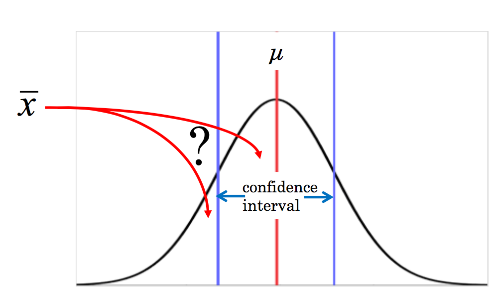
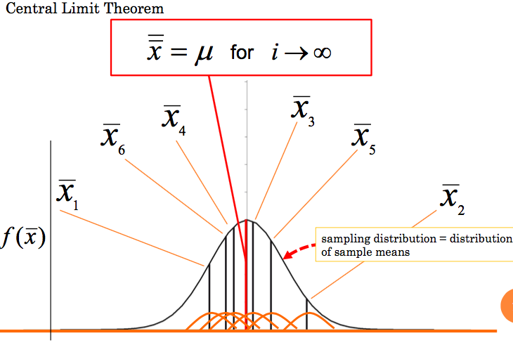
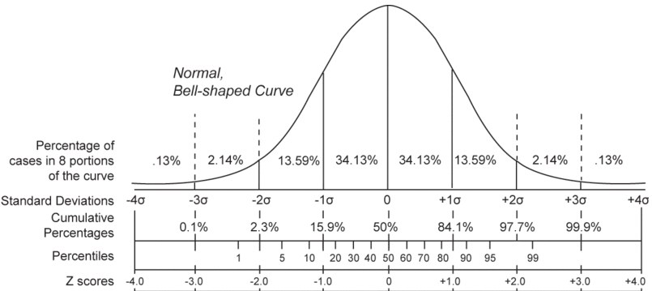
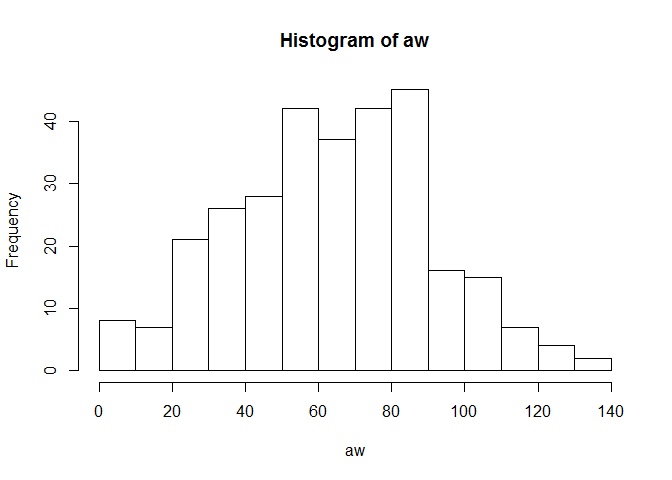
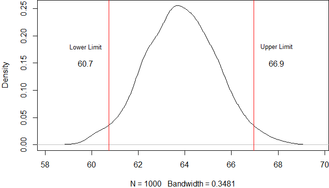
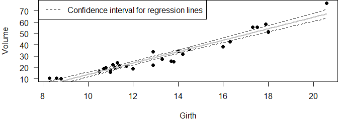
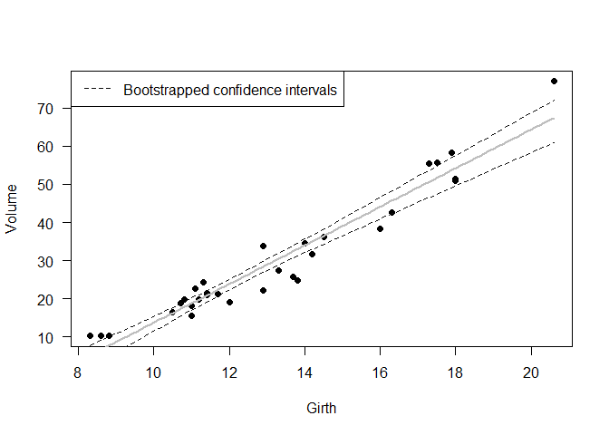

# Statistic-Cafe: Bootstrap and Confidence Intervals
Anne Mupepele  
15 February 2017  


## Wrap-up: Resampling
+ Permutation/Randomization: sampling without replacement

```r
sample(1:4,3,replace=F)
```

```
## [1] 1 2 4
```
+ Bootstrap: sampling with replacement

```r
sample(1:4,3,replace=T)
```

```
## [1] 3 3 1
```
+ Jackknife: leave one (or several out)

##Bootstrap in R
+ manually
+ package boot
+ package bootstrap
+ package car


```r
library(car) #bootCase()
library(boot) #boot.ci()
```

```
## 
## Attaching package: 'boot'
```

```
## The following object is masked from 'package:car':
## 
##     logit
```


## Confidence interval
+ How confident can we be that our estimate is good? 
      + e.g. How well does our sample mean $\bar{x}$ estimate the population mean $\mu$?


  
## Confidence interval 
+ How likely is it that the sample mean $\bar{x}$ lies within a previously specified confidence interval around the population mean $\mu$
+ The 95% confidence intervals means that 95% of the intervals obtained from samples will contain the true parameter.
+ Versus Bayesian credible interval: for the 95% percent credible interval there is a 95% probability that the true parameter value lies within this range.

#Confidence intervals for the mean of one variable

##Confidence interval
+ the sample mean is a good estimator for the population mean. 
+ sample standard deviation together with the sample size is a good estimator for the standard error. Based on the assumption that the sample is normally distributed. 
+ the sampling distribution of several sampling means - if several random samples were taken from the same population - also needs to be normally distributed.

 

+ $\triangle_{crit} = \mu \pm z_{\alpha} \cdot \sigma_{\bar{x}}$
+ $\mu$ = population mean, estimated through sample mean $\bar{x}$
+ $z_{\alpha}$ z-score related to the chosen significane level
+ $\sigma_{\bar{x}}$ = standard error of the mean = $\dfrac{\sigma}{\sqrt{n}}$
    + $\sigma$ population standard deviation, estimated by sample standard deviation $\dfrac{\displaystyle\sum_{i=1}^{n}{(x_i-\bar{x})^2}}{n-1}$; sd() in R

## Z-Score
+ $z_i=\dfrac{x_i-\bar{x}}{s}$; $s= \dfrac{\displaystyle\sum_{i=1}^{n}{(x_i-\bar{x})^2}}{n}$
+ 95% of all possible sample means are within the interval -1.96<z<1.96

 
 <figcaption>Plot from Wikipedia 'z-score' 15 February 2017</figcaption>

##Data
Harvest weight [kg] of 300 apples trees.

```r
aw <- rnorm(300,mean=66,sd=30)
hist(aw)
```

<!-- -->

```r
mean(aw)
```

```
## [1] 63.87615
```

##Confidence interval in R
+ $\triangle_{crit} = \mu \pm z_{\alpha} \cdot \sigma_{\bar{x}}$


```r
mean(aw)
```

```
## [1] 63.87615
```

```r
mean(aw) - 1.96*sd(aw)/sqrt(300) # lower limit 
```

```
## [1] 60.85203
```

```r
mean(aw) + 1.96*sd(aw)/sqrt(300)# higher limit 
```

```
## [1] 66.90026
```

```r
diff <- mean(aw) + 1.96*sd(aw)/sqrt(300) - mean(aw)
```

$\triangle_{crit} = 63.9 \pm 3$ 


## Confidence intervals via bootstrapping
The following R-chunk creates a matrix with 1000 rows (number of bootstraps, I have chosen) and 300 columns (length of the original variable 'aw'). This matrix is filled through resampling from 'aw'. It results in 1000 bootstrapped - samples.

```r
B <- 1000 # 1000 times resampling of 'aw' 
bootstrap_aw <- matrix(
  sample(aw,size=B*length(aw),replace=T)
  ,B,length(aw))
```

## Distribution of means 
+ Mean of every bootstrapped sample (= mean of every row in the matrix)

```r
bootstraped_means <- apply(bootstrap_aw,1,mean)
hist(bootstraped_means,prob=T,main="")
lines(density(bootstraped_means),col="red")
```

<!-- -->

## Confidence interval from bootstraps
+ population mean and standard deviation (sd) are not estimated by the sample mean and sd, but by the mean and sd of many samples' means (obtained by bootstrapping)
+ $\triangle_{crit} = \mu \pm z_{\alpha} \cdot \sigma$

```r
mean(bootstraped_means)
```

```
## [1] 63.83405
```

```r
mean(bootstraped_means) - 1.96*sd(bootstraped_means) # lower limit 
```

```
## [1] 60.81608
```

```r
mean(bootstraped_means) + 1.96*sd(bootstraped_means)# higher limit 
```

```
## [1] 66.85201
```

## Confidence interval from bootstraps
+ with package boot, instead of doing it manually

```r
mean_indices <- function(x,indices){return(mean(x[indices]))}
boot.ci(boot(aw,mean_indices,1000))
```

```
## BOOTSTRAP CONFIDENCE INTERVAL CALCULATIONS
## Based on 1000 bootstrap replicates
## 
## CALL : 
## boot.ci(boot.out = boot(aw, mean_indices, 1000))
## 
## Intervals : 
## Level      Normal              Basic         
## 95%   (60.87, 66.92 )   (60.89, 66.93 )  
## 
## Level     Percentile            BCa          
## 95%   (60.82, 66.86 )   (60.89, 66.90 )  
## Calculations and Intervals on Original Scale
```

## Confidence intervals with Percentile Bootstrap
+ Instead of using the mean of bootstrapped means (+ sd of bootstrapped means), we take the percentiles of the bootstrapped means distribution
+ Efron 1979
+ Resampling leads to many means and you identify the one that splits your data into the lowest 5% interval
+ finding the two values that include the central 95% of this distribution

## Percentile Bootstrap in R
+ bootstraped_means = means of 1000 bootstrapped samples
+ quantile() function in R


```r
par(mar=c(4,4,0,0))
plot(density(bootstraped_means),main="")
q95 <- quantile(bootstraped_means,c(0.025,0.975))
abline(v=q95,col="red")
text(c(q95[1]-1,q95[2]+1),0.18,c("Lower Limit","Upper Limit"),cex=0.8)
text(c(q95[1]-1,q95[2]+1),0.15,round(q95,1))
```

<!-- -->

#Confidence Intervals (CI) in linear regression

##CI in linear regression

```r
data("trees")
par(mar=c(4,4,0,0))
fm <-glm(Volume ~Girth, data=trees, family=gaussian)
Girthnew <-seq(min(trees$Girth), max(trees$Girth), len=101) 
preds <- predict(fm, newdata=data.frame("Girth"=Girthnew),se.fit=T) 
plot(Volume ~ Girth, data=trees, las=1, pch=16) 
lines(Girthnew, preds$fit, lwd=2, col="grey")
lines(Girthnew, preds$fit + 1.96*preds$se.fit, lty=2, col="grey6") #upper limit 
lines(Girthnew, preds$fit - 1.96*preds$se.fit, lty=2, col="grey6") #lower limit
legend("topleft",lty=2,c("Confidence interval for regression lines"),col="grey6")
```

<!-- -->

##Bootstrapping CI
+ model-based resampling: bootstrap the response variable and keep the predictors fixed (keep Girth constant and bootstrap in the column 'Volume')


```r
bootCase(fm,function(x)predict(x,data.frame(Girth=c(1:5))),B=9) #9 bootstrapped models predicting on Girth=1 to 5
```

```
##               1         2         3         4          5
##  [1,] -34.78982 -29.53322 -24.27661 -19.02000 -13.763390
##  [2,] -32.87914 -27.80695 -22.73476 -17.66257 -12.590378
##  [3,] -25.38396 -20.93728 -16.49061 -12.04393  -7.597254
##  [4,] -31.78404 -26.75338 -21.72271 -16.69205 -11.661386
##  [5,] -29.13218 -24.29325 -19.45431 -14.61538  -9.776440
##  [6,] -37.11161 -31.58993 -26.06825 -20.54656 -15.024883
##  [7,] -32.84251 -27.73887 -22.63524 -17.53161 -12.427981
##  [8,] -38.97483 -33.35372 -27.73260 -22.11149 -16.490381
##  [9,] -37.69776 -32.16168 -26.62560 -21.08951 -15.553427
## attr(,"class")
## [1] "bootCase" "matrix"  
## attr(,"pointEstimate")
##         1         2         3         4         5 
## -31.87760 -26.81175 -21.74589 -16.68003 -11.61418
```

```r
bootfit <- bootCase(fm,function(x)predict(x,data.frame(Girth=Girthnew)),B=999)
bootstrapped_sd <- apply(bootfit,2,sd) #sd for every bootrapped prediction, not necessary
q95 <- apply(bootfit,2,function(i)quantile(i,c(0.025,0.975)))
plot(Volume ~ Girth, data=trees, las=1, pch=16) 
lines(Girthnew, preds$fit, lwd=2, col="grey")
lines(Girthnew,q95[2,] , lty=2, col="grey6") #upper limit 
lines(Girthnew, q95[1,], lty=2, col="grey6") #lower limit
legend("topleft",lty=2,c("Bootstrapped confidence intervals"),col="grey6")
```

<!-- -->

+ in case of non-constant variance, standard errors from bootstraps are still valid

## When bootstrap fails
+ Not 'assumption free': Assumption of the percentile method: there is a monotonic and increasing transformation function of your estimates (here: $f(\bar{x})$) that follows a normal distribution -> bias-corrected percentile method (Efron, 1981 and other bias-corrections) 

## Further use of bootstrapping
+ here the focus was on confidence interval, the main use, but bootstrapping just means resampling with replacement and can be used for other issues
+ Bootstrapping for smoothing methods
+ Bootstrap tests of significance (similar to permutation tests, we create our own reference test statistic distribution)
+ Manly BFJ (2007) p75, bootstrapping can be used for:
  + estimating the size of a population from mark-recapture
  + the analysis of line-transect data
  + comparison of principal components from real and randomly constructed set of ecological data

##References
+ Efron B. 1979. Bootstrap methods: another look at the jackknife. The Annals of Statistics 7: 1–26.
+ Quinn GP and Keough MJ (2002) Experimental Design and Data Analysis for Biologists, Cambridge University Press
+ Dormann CF (2013) Parametrische Statistik. Berlin, Heidelberg: Springer Berlin Heidelberg.
+ Larget Bret (2013) Appendix of Chapter 3 in: Lock RH, Lock PF, Morgan KL, Lock EF, Lock DF (2013) Statistics: Unlocking the Power of Data
+ Büchner, S (2016) Lecture notes 'Dealing with numerical information' University College Freiburg
+ Manly BFJ (2007) Randomization, Bootstrap and Monte Carlo Methods in Biology, Chapman and Hall/CRC 
