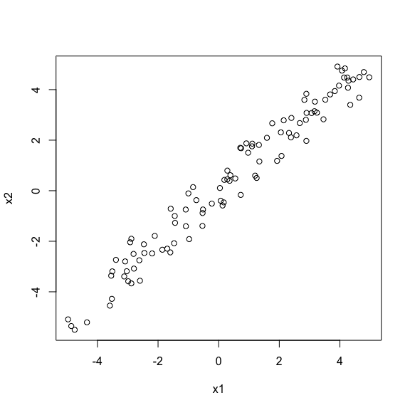
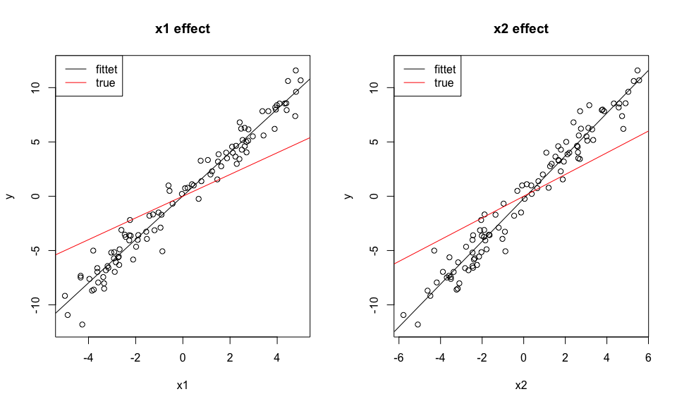
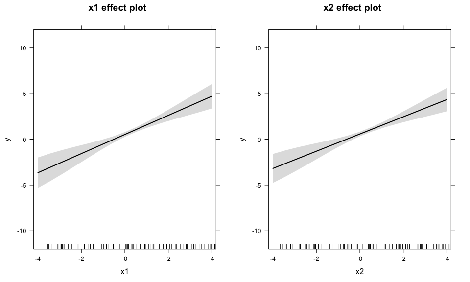
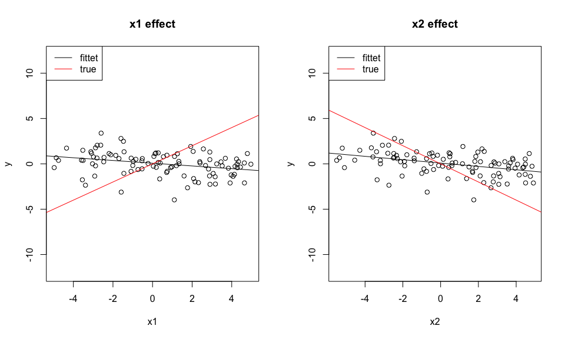
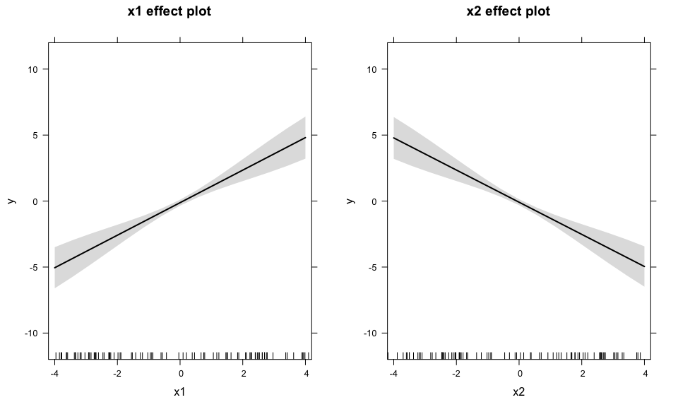

# The difference between univariate and multivariate regression
Florian Hartig  
21 Apr 2015  


## Background

A common question for statistical beginners is 

1. Why and how do results between univariate and multivariate regressions differ?
2. Why do I read in most good textbooks that I shoudln't use univariate regressions for a multivariate problem, especially if there is multicolinearity

The aim of this script to give an answer to these questions

## Test data with colinear predictors 

Assume we have two predictors that are positively correlated, i.e. correlation coefficient > 1


```r
x1 = runif(100, -5,5)
x2 = x1 + 0.2*runif(100, -5,5)
```

We can check that this worked visually as well as by calculating the correlation coefficient. 


```r
plot(x1,x2)
```

 

```r
cor(x1, x2)
```

```
## [1] 0.9793804
```

## Sign of product of effect sizes the same as correlation --> univariate biased upwards

The first case I want to look at is when effect1 * effect2 > 1, i.e. if the sign of the product of the effect sizes goes in the same direction as the correlation between the predictors. Let's create such a situation:


```r
y = x1 + x2 + rnorm(100)
```

In this case, univariate models have too high effect sizes, because 1) pos correlation 2) same effect direction means that predictors can absorb each other's effect if one is taken out.


```r
coef(lm(y~x1))
```

```
## (Intercept)          x1 
##  0.02354845  2.00061035
```

```r
coef(lm(y~x2))
```

```
## (Intercept)          x2 
##  -0.2181146   1.9683555
```

you see this also visually


```r
par(mfrow =c(1,2))
plot(x1, y, main = "x1 effect", ylim = c(-12,12))
abline(lm(y~x1))
abline(0,1, col = "red")
legend("topleft", c("fittet", "true"), lwd=1, col = c("black", "red")) 
plot(x2, y, main = "x2 effect", ylim = c(-12,12))
abline(lm(y~x2))
abline(0,1, col = "red")
legend("topleft", c("fittet", "true"), lwd=1, col = c("black", "red")) 
```

 

The multivariate model, on the other hand, is fine


```r
coef(lm(y~x1 + x2))
```

```
## (Intercept)          x1          x2 
## -0.07400416  1.20538486  0.80212943
```

```r
plot(allEffects(lm(y~x1 + x2)), ylim = c(-12,12))
```

 

## Sign of product of effect sizes not the same as correlation --> univariate biased downwards

Let's look at the case that we have positive correlation of the predictors, but they have opposite effects, so 1, -1


```r
y = x1 - x2 + rnorm(100)
```

Now, univariate models have too low effect sizes, because correlation is positve, but effects are opposite, which means univariately we see no effects 


```r
coef(lm(y~x1))
```

```
## (Intercept)          x1 
## -0.17709282  0.02475871
```

```r
coef(lm(y~x2))
```

```
## (Intercept)          x2 
## -0.17628832 -0.02576099
```

you see this also in the plot


```r
par(mfrow =c(1,2))
plot(x1, y, main = "x1 effect", ylim = c(-12,12))
abline(lm(y~x1))
abline(0,1, col = "red")
legend("topleft", c("fittet", "true"), lwd=1, col = c("black", "red")) 
plot(x2, y, main = "x2 effect", ylim = c(-12,12))
abline(lm(y~x2))
abline(0,1, col = "red")
legend("topleft", c("fittet", "true"), lwd=1, col = c("black", "red")) 
```

 

Again, the multivariate model is fine


```r
coef(lm(y~x1 + x2))
```

```
## (Intercept)          x1          x2 
## -0.02895158  1.23237060 -1.21809607
```

```r
plot(allEffects(lm(y~x1 + x2)), ylim = c(-12,12))
```

 

## No correlation between predictors

So, the result so far was that if we have colinearity between predictors, univariate models are generally not reliable. Does that mean that, in turn, if there is no colinearity we're fine?

That is nearly correct, but not completely. Effect sizes are fine, but because the univariate models see more variability (a predictor is missing), p-values for the univariate models are too high.


```r
x1 = runif(50, -1,1)
x2 = runif(50, -1,1)
y = x1 + x2 + rnorm(50)

summary(lm(y~x1))
```

```
## 
## Call:
## lm(formula = y ~ x1)
## 
## Residuals:
##     Min      1Q  Median      3Q     Max 
## -2.6007 -0.6927 -0.0654  0.8666  2.3123 
## 
## Coefficients:
##             Estimate Std. Error t value Pr(>|t|)   
## (Intercept)  -0.1545     0.1681  -0.919  0.36261   
## x1            1.0723     0.3127   3.429  0.00125 **
## ---
## Signif. codes:  0 '***' 0.001 '**' 0.01 '*' 0.05 '.' 0.1 ' ' 1
## 
## Residual standard error: 1.178 on 48 degrees of freedom
## Multiple R-squared:  0.1967,	Adjusted R-squared:   0.18 
## F-statistic: 11.76 on 1 and 48 DF,  p-value: 0.001254
```

```r
summary(lm(y~x2))
```

```
## 
## Call:
## lm(formula = y ~ x2)
## 
## Residuals:
##     Min      1Q  Median      3Q     Max 
## -2.3224 -0.5165 -0.1176  0.3894  2.8186 
## 
## Coefficients:
##             Estimate Std. Error t value Pr(>|t|)    
## (Intercept)   0.1862     0.1555   1.197    0.237    
## x2            1.3874     0.2604   5.329 2.61e-06 ***
## ---
## Signif. codes:  0 '***' 0.001 '**' 0.01 '*' 0.05 '.' 0.1 ' ' 1
## 
## Residual standard error: 1.042 on 48 degrees of freedom
## Multiple R-squared:  0.3717,	Adjusted R-squared:  0.3586 
## F-statistic: 28.39 on 1 and 48 DF,  p-value: 2.61e-06
```

```r
summary(lm(y~x1 + x2))
```

```
## 
## Call:
## lm(formula = y ~ x1 + x2)
## 
## Residuals:
##      Min       1Q   Median       3Q      Max 
## -1.74296 -0.43387 -0.09816  0.42307  2.10909 
## 
## Coefficients:
##             Estimate Std. Error t value Pr(>|t|)    
## (Intercept)   0.1034     0.1394   0.742 0.461857    
## x1            0.9300     0.2461   3.779 0.000443 ***
## x2            1.2970     0.2317   5.598 1.09e-06 ***
## ---
## Signif. codes:  0 '***' 0.001 '**' 0.01 '*' 0.05 '.' 0.1 ' ' 1
## 
## Residual standard error: 0.9222 on 47 degrees of freedom
## Multiple R-squared:  0.5181,	Adjusted R-squared:  0.4976 
## F-statistic: 25.26 on 2 and 47 DF,  p-value: 3.545e-08
```

