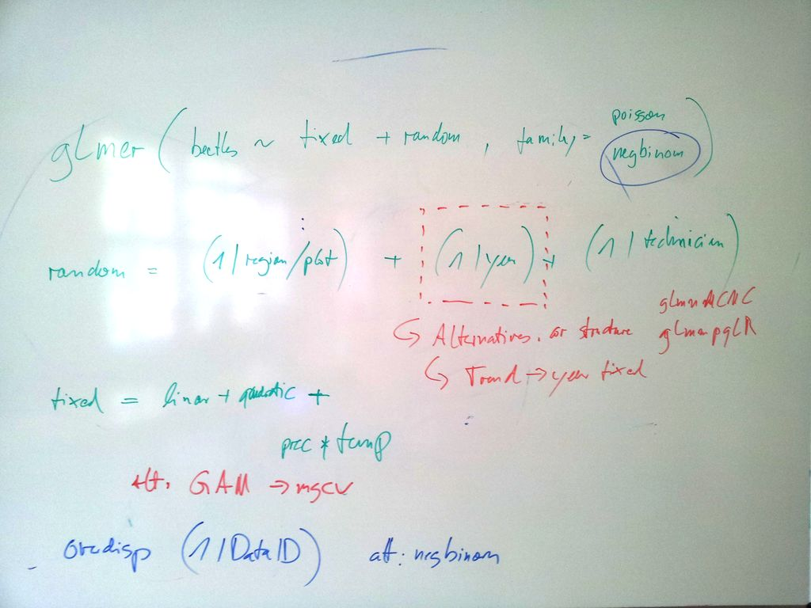

```{r, echo=F, message=F}
library(lme4)
library(lmerTest)
library(msm)
library(effects)
```

## Read in the data 


```{r}
data <- read.table("data.txt", header=TRUE, quote="\"")

data$precipitation = scale(data$precipitation)
data$temperature = scale(data$temperature)
data$altitude = scale(data$altitude)
data$minTemp = scale(data$minTemp)

```

## Results of the discussion in the group

The following picture shows the results of the group discussion



Summary

* Starting with poisson and glmer, might move to mgcv and negative binomial if heavy overdispersion is found
* Random terms as displayed, fixed, normally no MS on these terms but could use simulated LRT if particular hypotheses are to be contrasted
  * Year is as random, but could also be used as fixed if a contrast is expected
* linear and quadratic terms for all predictors, one interaction that seemed to be biologically sensible
  * MS is probably not neccessary because sample size should be large enough to support this model
 
## Result of the fit


```{r,  eval = T, fig.width = 10, fig.height = 10}
fit <- glmer(beetles ~ precipitation + I(precipitation^2) + altitude + I(altitude^2) + temperature + I(temperature^2) + minTemp + I(minTemp^2) + precipitation:temperature + precipitation:I(temperature^2) + (1|region/plot) + (1|technician) + (1|year), family = poisson, data = data)
summary(fit)
plot(allEffects(fit))

```

The results of the fit are fine, but it's a lot easier to see what's going if we don't have all this interactions flying around. Well, if you know that there are actually no interactions in there. I added also a  (1|dataID) term to absorb potential overdispersion. Would I have chosen this model if I wouldn't have known what the true model is? Who knows. But it's a good reminder that interactions can screw up your significance and will make results more difficult to interpret

```{r,  eval = T, fig.width = 10, fig.height = 10}
fit <- glmer(beetles ~ precipitation + I(precipitation^2) + altitude + I(altitude^2) + temperature + I(temperature^2) + minTemp + I(minTemp^2)  + (1|region/plot) + (1|technician) + (1|year) , family = poisson, data = data)
summary(fit)
plot(allEffects(fit))
```

OK, here we go. Parameter estimates are fine, results are that temp / minTemp are the things that matter. The forests were right!

If you want to compare to the true values, have a look at the Rmd file that creates the data. 


## Still todo

* Check for overdispersion and potentially correct overdispersion 
* Check for homogeneity of residuals, and for normality of the random effects

How to do both things are described in my lectures. I skip this here because I know the truth and know that the conclusions are fine, but in general you should check of course.


