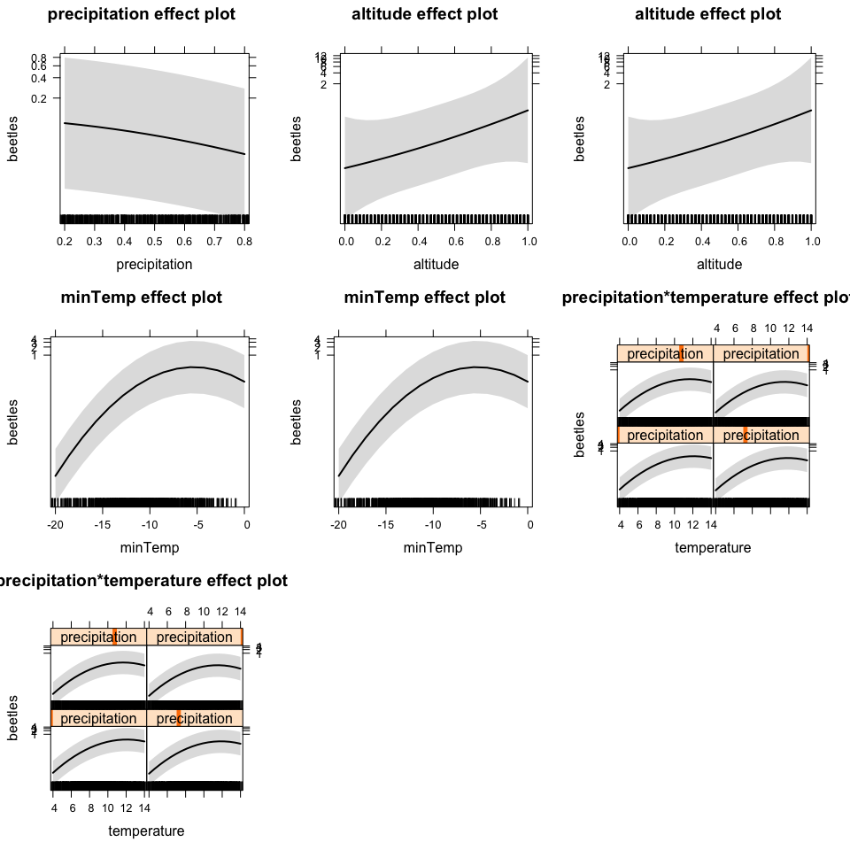
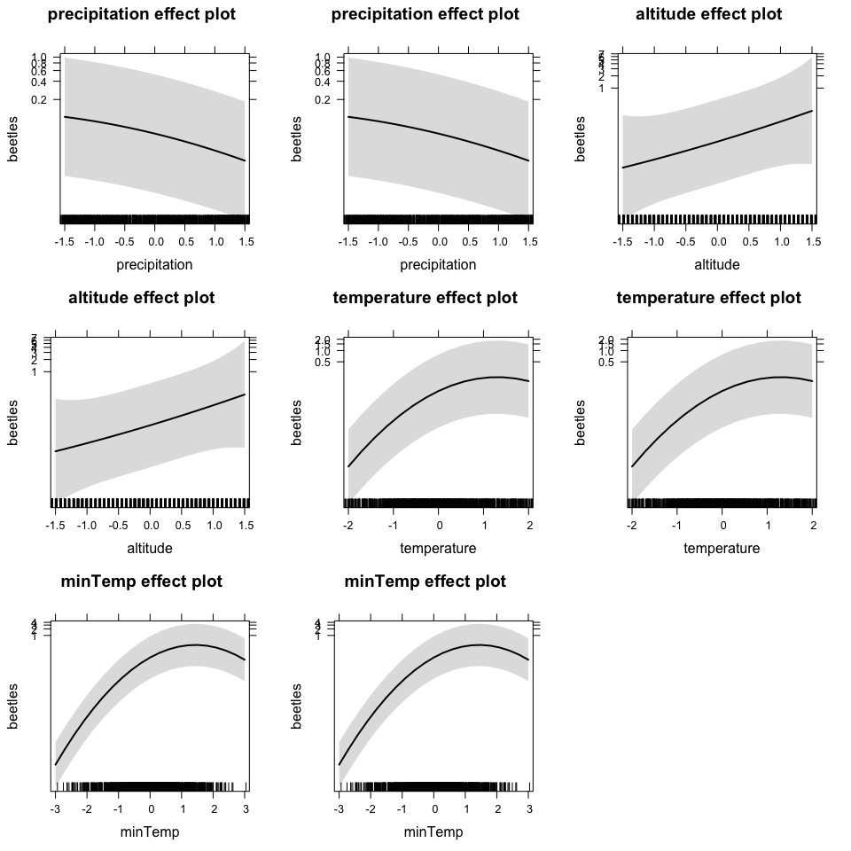

# Mixed Model exercise - data analysis
FlorianHartig  
29 Apr 2015  


## Read in the data 


```r
data <- read.table("data.txt", header=TRUE, quote="\"")

data$precipitation = scale(data$precipitation)
data$temperature = scale(data$temperature)
data$altitude = scale(data$altitude)
data$minTemp = scale(data$minTemp)
```

## Results of the discussion in the group

The following picture shows the results of the group discussion


Summary

* Starting with poisson and glmer, might move to mgcv and negative binomial if heavy overdispersion is found
* Random terms as displayed, fixed, normally no MS on these terms but could use simulated LRT if particular hypotheses are to be contrasted
  * Year is as random, but could also be used as fixed if a contrast is expected
* linear and quadratic terms for all predictors, one interaction that seemed to be biologically sensible
  * MS is probably not neccessary because sample size should be large enough to support this model
 
## Result of the fit


```r
fit <- glmer(beetles ~ precipitation + I(precipitation^2) + altitude + I(altitude^2) + temperature + I(temperature^2) + minTemp + I(minTemp^2) + precipitation:temperature + precipitation:I(temperature^2) + (1|region/plot) + (1|technician) + (1|year), family = poisson, data = data)
summary(fit)
```

```
## Generalized linear mixed model fit by maximum likelihood (Laplace
##   Approximation) [glmerMod]
##  Family: poisson  ( log )
## Formula: 
## beetles ~ precipitation + I(precipitation^2) + altitude + I(altitude^2) +  
##     temperature + I(temperature^2) + minTemp + I(minTemp^2) +  
##     precipitation:temperature + precipitation:I(temperature^2) +  
##     (1 | region/plot) + (1 | technician) + (1 | year)
##    Data: data
## 
##      AIC      BIC   logLik deviance df.resid 
##   1922.2   1995.8   -946.1   1892.2      985 
## 
## Scaled residuals: 
##     Min      1Q  Median      3Q     Max 
## -2.7223 -0.3559 -0.1097 -0.0091  5.8601 
## 
## Random effects:
##  Groups      Name        Variance Std.Dev.
##  plot:region (Intercept) 0.3332   0.5773  
##  year        (Intercept) 0.4753   0.6894  
##  region      (Intercept) 4.7187   2.1723  
##  technician  (Intercept) 3.9249   1.9811  
## Number of obs: 1000, groups:  
## plot:region, 50; year, 20; region, 10; technician, 5
## 
## Fixed effects:
##                                Estimate Std. Error z value Pr(>|z|)    
## (Intercept)                    -1.76171    1.21281   -1.45 0.146339    
## precipitation                  -0.50142    0.03065  -16.36  < 2e-16 ***
## I(precipitation^2)             -0.10701    0.02808   -3.81 0.000138 ***
## altitude                        1.08491    0.57364    1.89 0.058587 .  
## I(altitude^2)                   0.07834    0.41970    0.19 0.851922    
## temperature                     1.31692    0.05717   23.03  < 2e-16 ***
## I(temperature^2)               -0.56499    0.03666  -15.41  < 2e-16 ***
## minTemp                         1.83858    0.05016   36.66  < 2e-16 ***
## I(minTemp^2)                   -0.63202    0.03413  -18.52  < 2e-16 ***
## precipitation:temperature      -0.09445    0.04077   -2.32 0.020510 *  
## precipitation:I(temperature^2) -0.01850    0.03341   -0.55 0.579789    
## ---
## Signif. codes:  0 '***' 0.001 '**' 0.01 '*' 0.05 '.' 0.1 ' ' 1
## 
## Correlation of Fixed Effects:
##             (Intr) prcptt I(p^2) altitd I(l^2) tmprtr I(t^2) minTmp I(T^2)
## precipitatn  0.014                                                        
## I(prcptt^2) -0.023 -0.009                                                 
## altitude    -0.013  0.005 -0.012                                          
## I(altitd^2) -0.341 -0.003 -0.006  0.042                                   
## temperature -0.019  0.140  0.012  0.071  0.030                            
## I(tmprtr^2) -0.002 -0.314  0.028  0.005 -0.038 -0.346                     
## minTemp     -0.008 -0.136 -0.085  0.004  0.005 -0.078  0.050              
## I(minTmp^2)  0.005  0.160  0.037 -0.002 -0.017 -0.029 -0.128 -0.767       
## prcpttn:tmp  0.001 -0.045  0.116 -0.014 -0.021 -0.202  0.244  0.034  0.009
## prcpt:I(^2) -0.015 -0.457  0.080  0.014  0.015  0.244  0.210  0.055 -0.119
##             prcpt:
## precipitatn       
## I(prcptt^2)       
## altitude          
## I(altitd^2)       
## temperature       
## I(tmprtr^2)       
## minTemp           
## I(minTmp^2)       
## prcpttn:tmp       
## prcpt:I(^2) -0.616
```

```r
plot(allEffects(fit))
```

 

The results of the fit are fine, but it's a lot easier to see what's going if we don't have all this interactions flying around, so I removed them. Would I have chosen this model if I wouldn't have known what the true model is? Who knows. But it's a good reminder that interactions can screw up your significance and will make results more difficult to interpret


```r
fit <- glmer(beetles ~ precipitation + I(precipitation^2) + altitude + I(altitude^2) + temperature + I(temperature^2) + minTemp + I(minTemp^2)  + (1|region/plot) + (1|technician) + (1|year) , family = poisson, data = data)
summary(fit)
```

```
## Generalized linear mixed model fit by maximum likelihood (Laplace
##   Approximation) [glmerMod]
##  Family: poisson  ( log )
## Formula: 
## beetles ~ precipitation + I(precipitation^2) + altitude + I(altitude^2) +  
##     temperature + I(temperature^2) + minTemp + I(minTemp^2) +  
##     (1 | region/plot) + (1 | technician) + (1 | year)
##    Data: data
## 
##      AIC      BIC   logLik deviance df.resid 
##   1930.1   1993.9   -952.1   1904.1      987 
## 
## Scaled residuals: 
##     Min      1Q  Median      3Q     Max 
## -2.8111 -0.3515 -0.1100 -0.0102  5.8728 
## 
## Random effects:
##  Groups      Name        Variance Std.Dev.
##  plot:region (Intercept) 0.3439   0.5864  
##  year        (Intercept) 0.4928   0.7020  
##  region      (Intercept) 4.7581   2.1813  
##  technician  (Intercept) 3.9724   1.9931  
## Number of obs: 1000, groups:  
## plot:region, 50; year, 20; region, 10; technician, 5
## 
## Fixed effects:
##                    Estimate Std. Error z value Pr(>|z|)    
## (Intercept)        -1.81705    1.22013   -1.49  0.13643    
## precipitation      -0.55441    0.02380  -23.29  < 2e-16 ***
## I(precipitation^2) -0.08709    0.02741   -3.18  0.00148 ** 
## altitude            1.07771    0.57770    1.87  0.06211 .  
## I(altitude^2)       0.06046    0.42426    0.14  0.88668    
## temperature         1.31241    0.05504   23.84  < 2e-16 ***
## I(temperature^2)   -0.50343    0.03107  -16.20  < 2e-16 ***
## minTemp             1.85644    0.05008   37.07  < 2e-16 ***
## I(minTemp^2)       -0.64478    0.03382  -19.07  < 2e-16 ***
## ---
## Signif. codes:  0 '***' 0.001 '**' 0.01 '*' 0.05 '.' 0.1 ' ' 1
## 
## Correlation of Fixed Effects:
##             (Intr) prcptt I(p^2) altitd I(l^2) tmprtr I(t^2) minTmp
## precipitatn  0.004                                                 
## I(prcptt^2) -0.021  0.161                                          
## altitude    -0.013  0.012 -0.012                                   
## I(altitd^2) -0.343 -0.003 -0.003  0.042                            
## temperature -0.016  0.269 -0.001  0.071  0.027                     
## I(tmprtr^2)  0.007 -0.020 -0.095  0.004 -0.041 -0.444              
## minTemp     -0.007 -0.096 -0.112  0.004  0.006 -0.088 -0.004       
## I(minTmp^2)  0.003  0.091  0.069  0.000 -0.018 -0.005 -0.075 -0.767
```

```r
plot(allEffects(fit))
```

 

OK, here we go. Parameter estimates are fine, results are that temp / minTemp are the things that matter. The forests were right!

If you want to compare to the true values, have a look at the Rmd file that creates the data. 


## Still todo

* Check for overdispersion and potentially correct overdispersion 
* Check for homogeneity of residuals, and for normality of the random effects

How to do both things are described in my lectures. I skip this here because I know the truth and know that the conclusions are fine, but in general you should check of course.


