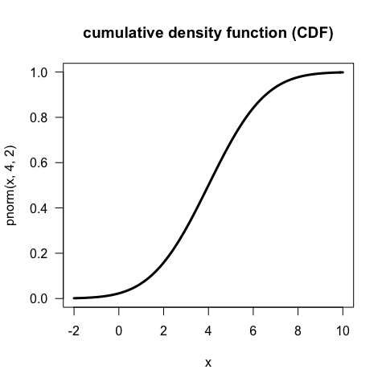
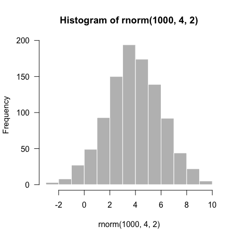
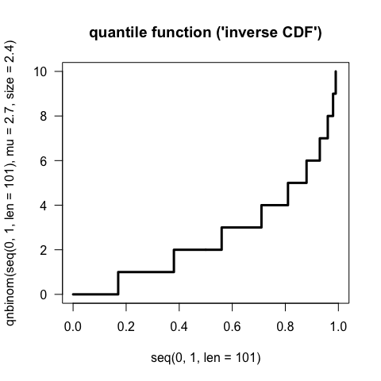
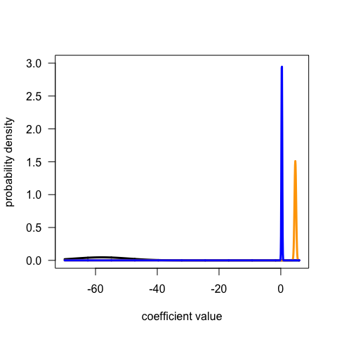
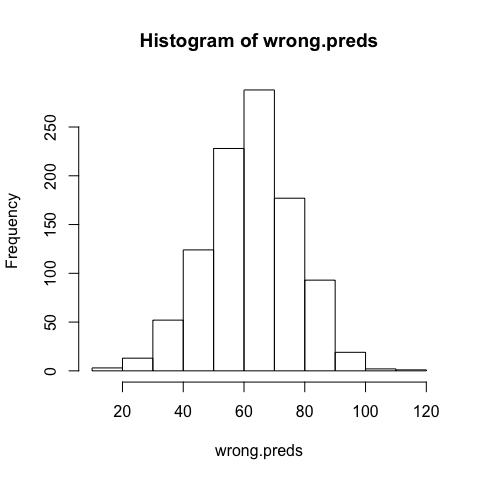
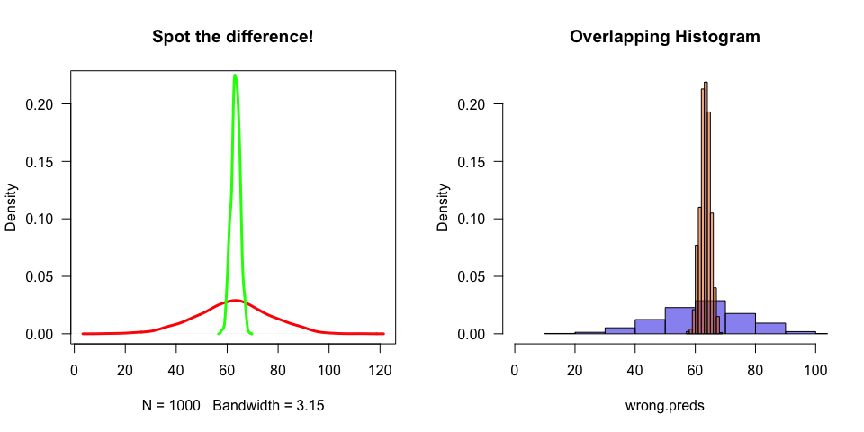
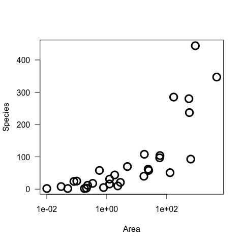
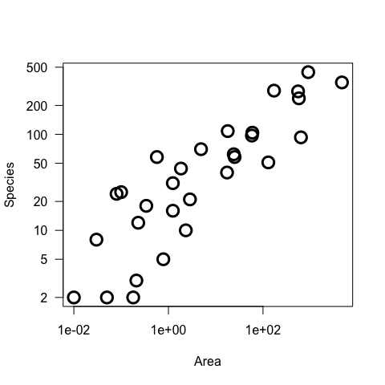

# Mixed Effects Models Mini-Series. Part I. A GLM refresher and some definitions
Carsten F. Dormann  
19 November 2014  

This session will lay the foundation before starting with the actual mixed model. We should mean the same thing when we use the following terms:

 *  distribution ("family")
 *  probability
 *  (probability) density
 *  likelihood
 *  maximum likelihood
 *  parameters (theta)
 *  estimate
 *  link scale, link function 
 *  fitted values vs predicted values (response vs link scale)
 *  standard error (vs standard deviation)
 *  marginal distribution
 *  correlation of parameters (in the estimation process)
 *  simulation: 
    +  from distribution
    +  from fitted model

# Distributions
**Probability density distributions** (for continuous variables) and **discrete probability distributions** (for discrete variables) have a counterpart in their cumulative version. We can use R to visualise such distributions. The functions start with the following letters, 
`d...`, `p...`, `q...` and `r...`, followed by the abbreviated name of the distribution itself.

## The normal distribution
Let us look at an example, the normal distribution, which is continuous:


```r
curve(dnorm(x, 4, 2), from=-2, to=10, main="probability density function (PDF)", lwd=3, las=1)
```

 

```r
curve(pnorm(x, 4, 2), from=-2, to=10, main="cumulative density function (CDF)", lwd=3, las=1)
```

 

```r
curve(qnorm(x, 4, 2), from=0, to=1, main="quantile function ('inverse CDF')", lwd=3, las=1)
```

 

```r
hist(rnorm(1000, 4, 2), las=1, col="grey", border="white")
```

 

## The negative binomial distribution
A second example takes a discrete distribution, the negative binomial:


```r
plot(0:15, dnbinom(0:15, mu=2.7, size=2.4), type="h", main="probability mass function (PMF)", lwd=3, las=1)
```

 

```r
plot(0:15, pnbinom(0:15, mu=2.7, size=2.4), type="s", main="cumulative distribution function (CDF)", lwd=3, las=1)
```

 

```r
plot(seq(0, 1, len=101), qnbinom(seq(0, 1, len=101), mu=2.7, size=2.4), main="quantile function ('inverse CDF')", type="s", lwd=3, las=1)
```

 

```r
hist(rnbinom(1000, mu=2.7, size=2.4), las=1, col="grey", border="white")
```

 


# The log-likelihood

The likelihood is a value that quantifies how a (set of) parameters is, given a dataset $y$: $L(\theta | y)$. For independent observations, the likelihood is simply the product of probability densities under the distribution specified by parameters $\theta$: $L(\theta | y) = P(y | \theta)$. 

Take, for example, the following observations, `obs`:


```r
obs <- c(4,4,7,3,1,1,3,2,1,1,0,5,1,0,1)
```

Then the probability density of each single point in a normal distribution with parameters $\theta = (\mu, \sigma) = (2.2, 2.4)$ is


```r
dnbinom(obs, mu=2.7, size=2.4)
```

```
##  [1] 0.10395330 0.10395330 0.02922071 0.14544906 0.20813417 0.20813417
##  [7] 0.14544906 0.18732075 0.20813417 0.20813417 0.16380930 0.07044365
## [13] 0.20813417 0.16380930 0.20813417
```

Since the product of many values smaller than 1 becomes tediously small, we instead take their logarithm:

```r
dnbinom(obs, mu=2.7, size=2.4, log=T)
```

```
##  [1] -2.263814 -2.263814 -3.532878 -1.927929 -1.569572 -1.569572 -1.927929
##  [8] -1.674933 -1.569572 -1.569572 -1.809052 -2.652942 -1.569572 -1.809052
## [15] -1.569572
```

Finally, to compute the actual log-likelihood of the entire data set, we sum the log-probability densites (remember that $\log(\prod x) = \sum(\log x)$)

```r
sum(dnbinom(obs, mu=2.7, size=2.4, log=T))
```

```
## [1] -29.27978
```

Now this more or less exactly what a GLM is based on. It computes the log-likelihood (typically abbreviated as $\ell$) of a dataset, given the distribution parameters: $\ell = \sum log(P(y | \theta))$. Then, it optimises the parameters in $\theta$ in such a way that $\ell$ is maximised. This is the idea of **maximum likelihood**. In other words, we can use a GLM to fit a distribution to our observations, for example assuming a negative binomial distribution, like so:

```r
library(MASS)
summary(glm.nb(obs ~ 1))
```

```
## 
## Call:
## glm.nb(formula = obs ~ 1, init.theta = 3.234352339, link = log)
## 
## Deviance Residuals: 
##     Min       1Q   Median       3Q      Max  
## -1.8535  -0.7614  -0.7614   0.5553   1.7547  
## 
## Coefficients:
##             Estimate Std. Error z value Pr(>|z|)    
## (Intercept)   0.8183     0.2237   3.659 0.000253 ***
## ---
## Signif. codes:  0 '***' 0.001 '**' 0.01 '*' 0.05 '.' 0.1 ' ' 1
## 
## (Dispersion parameter for Negative Binomial(3.2344) family taken to be 1)
## 
##     Null deviance: 16.12  on 14  degrees of freedom
## Residual deviance: 16.12  on 14  degrees of freedom
## AIC: 61.908
## 
## Number of Fisher Scoring iterations: 1
## 
## 
##               Theta:  3.23 
##           Std. Err.:  3.03 
## 
##  2 x log-likelihood:  -57.908
```

Here the $\ell$ is given as $-57.908/2 = -28.954$ (don't ask me why summary.glm.nb doesn't return the likelihood itself!). We should be able to produce this value by hand, if we only knew, which parameter values we require! 

The `summary` of the model output provides the data we need: the `(Intercept)` with a value of 0.818 is at the log-scale, since the negative binomial GLM by default uses a logarithmic **link function**. Hence, our first parameter (called `mu`) has the value of $e^0.8183=2.27$. The second parameter (called `size`) is given as dispersion parameter in the output: 3.23. Thus, by hand we compute now the log-likelihood of our dataset `obs`, given the parameter vector $\theta = (mean, size) = (2.27, 3.23)$:


```r
sum(dnbinom(obs, mu=exp(0.8183), size=3.23, log=T))
```

```
## [1] -28.95423
```

# A simple GLM, and the correlation matrix of model parameter estimates
Let us move on to a regression example to define the next few terms.

We use a GLM to fit a multiple regression to the `trees` data. We have to specify a **family**, which is R's term for the distribution (for historic reasons the normal distribution is called `gaussian` here). We fit the model, put the result in object `fm` and have its summary printed. In addition to the usual output, I also request the **parameter estimate correlation matrix** to be returned, using the argument `correlation=TRUE` in the `summary` call.


```r
data(trees)
fm <- glm(Volume ~ Girth + Height, family="gaussian", data=trees)
summary(fm, correlation=T)
```

```
## 
## Call:
## glm(formula = Volume ~ Girth + Height, family = "gaussian", data = trees)
## 
## Deviance Residuals: 
##     Min       1Q   Median       3Q      Max  
## -6.4065  -2.6493  -0.2876   2.2003   8.4847  
## 
## Coefficients:
##             Estimate Std. Error t value Pr(>|t|)    
## (Intercept) -57.9877     8.6382  -6.713 2.75e-07 ***
## Girth         4.7082     0.2643  17.816  < 2e-16 ***
## Height        0.3393     0.1302   2.607   0.0145 *  
## ---
## Signif. codes:  0 '***' 0.001 '**' 0.01 '*' 0.05 '.' 0.1 ' ' 1
## 
## (Dispersion parameter for gaussian family taken to be 15.06862)
## 
##     Null deviance: 8106.08  on 30  degrees of freedom
## Residual deviance:  421.92  on 28  degrees of freedom
## AIC: 176.91
## 
## Number of Fisher Scoring iterations: 2
## 
## Correlation of Coefficients:
##        (Intercept) Girth
## Girth   0.19            
## Height -0.93       -0.52
```

We can also compute the correlation matrix by means of the variance-covariance matrix by foot:


```r
vcov(fm)
```

```
##             (Intercept)       Girth      Height
## (Intercept)  74.6189461  0.43217138 -1.05076889
## Girth         0.4321714  0.06983578 -0.01786030
## Height       -1.0507689 -0.01786030  0.01693933
```

```r
cov2cor(vcov(fm))
```

```
##             (Intercept)      Girth     Height
## (Intercept)   1.0000000  0.1893182 -0.9346189
## Girth         0.1893182  1.0000000 -0.5192801
## Height       -0.9346189 -0.5192801  1.0000000
```

The model we have fitted here can be written like this: $y \sim N(\mu=b_0 + b_1 Girth + b_2 Height, \sigma=s)$, where the $b$ represent the fitted parameters, which are given in the three rows of the `summary.glm`. The first column gives the **maximum likelihood estimates** (MLE) of these three parameters. In the second column we see the **standard error** of this maximum likelihood estimate. Like the standard error of the mean in a sample statistic, this s.e. is a measure of how well determined the MLE is. In terms of optimisation we can think of the s.e. as describing how 'pointy' the peak of the optimum is. Poorly fitting data will have 'blunt' peaks and hence large standard errors for the parameter estimate.

During the optimisation process, we find that the more one value is increased, the more another should be decreased to maintain a high likelihood. Think of a simple linear regression. If we increase the y-intercept from its optimum value, we should compensate for this by lessening the slope value. Thus, intercept and slope estimate are somewhat correlated, particularly near the optimum fit. 

This correlation between model parameter estimates is shown by the correlation matrix. In the above case, $b_0$ (= `(Intercept)`) and $b_2$ (= `Height`) are highly negatively correlated: the more we increase the value of the intercept, the lower the estimate for height should be to maintain a reasonably high log-likelihood.

# The marginal distribution
Actually, the standard error of a parameter estimate is equivalent the standard deviation of a sample. With it we can plot the distribution in which the GLM tells us the true parameter value will lie.


```r
curve(dnorm(x, summary(fm)$coefficients[1,1], summary(fm)$coefficients[1,2]), n=1001, from=-70, to=6, ylim=c(0, 3), lwd=3, xlab="coefficient value", ylab="probability density", las=1)
curve(dnorm(x, summary(fm)$coefficients[2,1], summary(fm)$coefficients[2,2]), n=1001, add=T, lwd=3, col="orange")
curve(dnorm(x, summary(fm)$coefficients[3,1], summary(fm)$coefficients[3,2]), n=1001, add=T, lwd=3, col="blue")
```

 

This may not be an ideal way to present the three marginal distributions, but it clearly shows that the intercept (in black) is less well determined than the two other estimates. These **marginal distributions** of the parameter estimates are one-dimensional projections of the three-dimensional fit.

## Sampling from the model by sampling from the estimator distributions
If our model is good, we should be able to generate a dataset similar to the one we fitted the model to, if we simply draw random values from the distribution of each estimated parameter and combine them to a new value.

We remember from some introductory course to statistics, that the generalised linear model has the form $\hat{\mathbf{y}} = \mathbf{Xb}$, where $\hat{\mathbf{y}}$ is the expected value of the model, $\mathbf{X}$ is the vector (or matrix) of predictor values (including a column of 1s for the intercept) and $\mathbf{b}$ is the vector of model parameter estimates. 
Hence we need to produce the vector $\mathbf{b}$ by sampling from the parameter distributions and then matrix-multiply it with the values for which we want to get the predicted value for (say for a girth of 20 inch and a height of 80 feet).

### The **WRONG** way!
We simply draw the value from the marginal distribution as given in the model statistics and multiply them onto our column-vector of $\mathbf{X}$:

```r
t(c(1, 20, 80)) %*% c(rnorm(1, summary(fm)$coefficients[1,1], summary(fm)$coefficients[1,2]),
rnorm(1, summary(fm)$coefficients[2,1], summary(fm)$coefficients[2,2]),
rnorm(1, summary(fm)$coefficients[3,1], summary(fm)$coefficients[3,2]))
```

```
##          [,1]
## [1,] 29.78053
```

We can do this, say, 1000 times and plot the distribution of predicted values:


```r
wrong.preds <- replicate(1000, t(c(1, 20, 80)) %*% c(rnorm(1, summary(fm)$coefficients[1,1], summary(fm)$coefficients[1,2]),
                      rnorm(1, summary(fm)$coefficients[2,1], summary(fm)$coefficients[2,2]),
                      rnorm(1, summary(fm)$coefficients[3,1], summary(fm)$coefficients[3,2])))
hist(wrong.preds)
```

 

```r
summary(wrong.preds)
```

```
##    Min. 1st Qu.  Median    Mean 3rd Qu.    Max. 
##   12.80   53.22   62.67   62.41   71.90  112.00
```

Why is this **wrong**?

The reason why we **cannot** draw from the marginal distributions independently for each parameter is that the parameters are correlated (as we know from the `summary.glm`-output above)!

### The right way!
Instead, we need to draw the three values simultaneously from a multivariate normal distribution (or conditionally, starting with one, but we leave this option for later sessions). This requires us to specify the three means and the variance-covariance matrix (which we have already met above):


```r
library(mvtnorm)
right.preds <- replicate(1000, t(c(1, 20, 80)) %*% t(rmvnorm(1, mean=summary(fm)$coefficients[1:3,1], sigma=vcov(fm))))
hist(right.preds)
```

 

```r
summary(right.preds)
```

```
##    Min. 1st Qu.  Median    Mean 3rd Qu.    Max. 
##   57.71   62.21   63.33   63.31   64.48   68.61
```

So at first glance this looks just the same, doesn't it? Well, let us plot the two together (either as density plot or as histogram), and we notice a *slight* difference:

```r
par(mfrow=c(1,2))
#plot both together:
plot(density(wrong.preds), lwd=3, col="red", ylim=c(0, 0.22), las=1, main="Spot the difference!")  
lines(density(right.preds), lwd=3, col="green")  
# same as histograms:
hist(wrong.preds, freq=F, col=rgb(0.1,0.1,0.9,0.5), xlim=c(0,100), ylim=c(0,0.22), main="Overlapping Histogram", las=1)
hist(right.preds, freq=F, col=rgb(0.9,0.4,0.,0.5), add=T)
```

 

This should conclude most of todays content. However, as a teaser, here comes a small question.

# Fitting a negative binomial GLM

So, only as final throw-out, let's fit a negative binomial GLM. Our response is the number of plant species on the different Galapagos islands, and the predictors are area (log-ed), elevationand distance to nearest island:


```r
library(faraway)
data(gala)
summary(glm.nb(Species ~ log(Area) + I(log(Area)^2) + Elevation + Nearest, data=gala), correlation=T)
```

```
## 
## Call:
## glm.nb(formula = Species ~ log(Area) + I(log(Area)^2) + Elevation + 
##     Nearest, data = gala, init.theta = 2.874040147, link = log)
## 
## Deviance Residuals: 
##     Min       1Q   Median       3Q      Max  
## -2.0553  -0.8791  -0.2717   0.6540   1.6898  
## 
## Coefficients:
##                  Estimate Std. Error z value Pr(>|z|)    
## (Intercept)     3.4673783  0.1982971  17.486  < 2e-16 ***
## log(Area)       0.4289939  0.0662552   6.475 9.49e-11 ***
## I(log(Area)^2)  0.0040240  0.0140228   0.287    0.774    
## Elevation      -0.0007925  0.0006656  -1.191    0.234    
## Nearest        -0.0152803  0.0088710  -1.722    0.085 .  
## ---
## Signif. codes:  0 '***' 0.001 '**' 0.01 '*' 0.05 '.' 0.1 ' ' 1
## 
## (Dispersion parameter for Negative Binomial(2.874) family taken to be 1)
## 
##     Null deviance: 146.166  on 29  degrees of freedom
## Residual deviance:  32.737  on 25  degrees of freedom
## AIC: 286.45
## 
## Number of Fisher Scoring iterations: 1
## 
## Correlation of Coefficients:
##                (Intercept) log(Area) I(log(Area)^2) Elevation
## log(Area)       0.45                                         
## I(log(Area)^2) -0.10       -0.20                             
## Elevation      -0.43       -0.49     -0.65                   
## Nearest        -0.59       -0.44      0.07           0.25    
## 
## 
##               Theta:  2.874 
##           Std. Err.:  0.841 
## 
##  2 x log-likelihood:  -274.451
```

Again, be reminded that the above correlation does **not** represent correlation among predictors, but among estimators of their effect. To get the correlation between predictors use `cor`:


```r
cor(log(gala[, "Area"])^2, gala[,"Elevation"])
```

```
## [1] 0.8759724
```

You may notice that the terms `log(Area)^2` and `Elevation` are positively correlated, but their estimates are *negatively* correlated. This makes sense (and is generally true), because you can now increase the estimate for `log(Area)^2` and compensate this by *decreasing* the estimate for `Elevation`.

Let's see what the data actually look like:


```r
plot(Species ~ Area, data=gala, log="x", lwd=3, las=1, cex=2)
```

 

## Question
So there is clearly a non-linear effect of log(Area) on species richness. But then, why isn't the quadratic term in the model significant???

(And the answer is: !!Because the negative binomial distribution uses a log-link function!!) The plot should be more like this, in order to represent the data at the link scale:


```r
plot(Species ~ Area, data=gala, log="xy", lwd=3, las=1, cex=2)
```

 

Ah!

# Excercise
In the `trees` analysis, center the predictors by subtracting the mean before the analysis. How does that affect the correlation between estimates?

Does the same trick work for the `gala` predictors?


