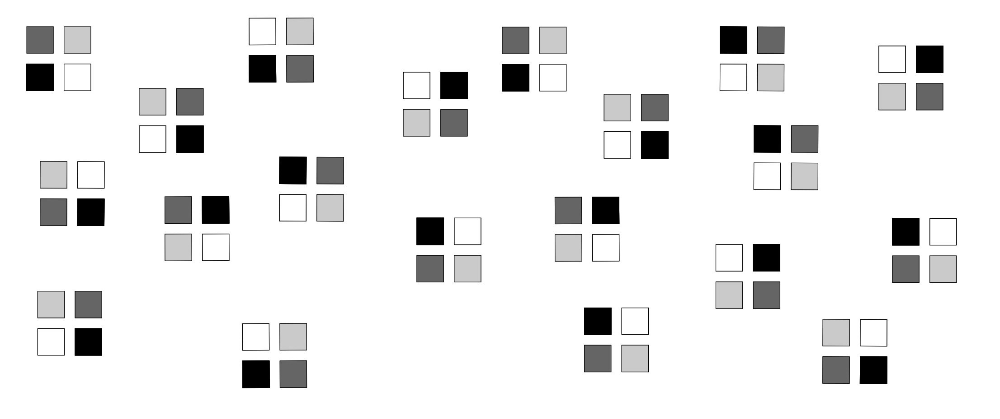
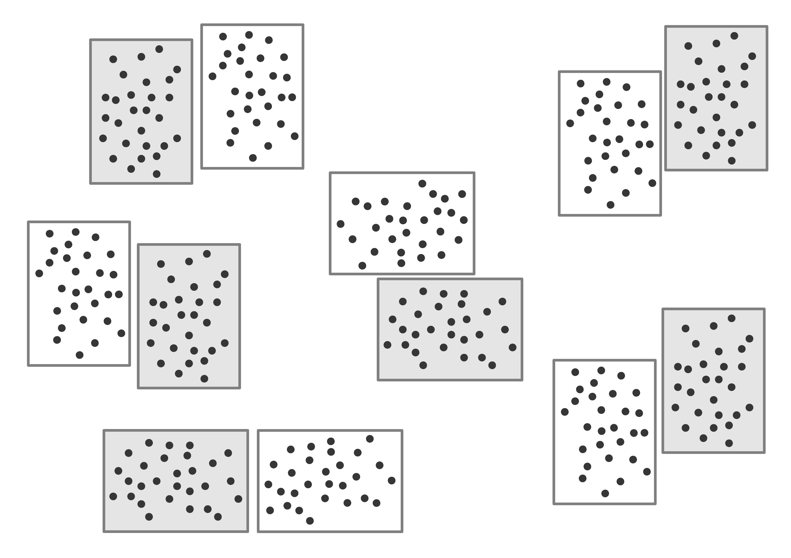
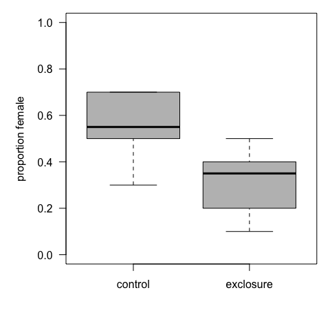

# Mixed Effects Models Mini-Series. Part II. Violation of independence and mixed effects
Carsten F. Dormann  
27 November 2014  

This session will explain, why we cannot solve all statistical problems with a regression model. Specifically, we will introduce the mixed-effect model as a *hierarchical model*, in which some effects are estimated as "a different level" than the typical regression coefficients.

The key terms are:

 * non-independence of observations
 * modelling variances
 * random effects vs fixed effects
 * nested data, repeated measurements
 * autocorrelation (spatial and temporal)

One way to start thinking of hierarchical models is by example. Let's start with a very common experimental design, and what it may tell us.

# Randomised block design

In a randomised block design one set of treatment manipulations is called a block, and the block is then the unit that is replicated (with treatment units randomly shuffled within the block). The result looks like this:



We see that we have four treatments (in different shades of grey) and 20 replicated blocks. As an example, we shall look at the effect of competition and nematode grazing on the growth of *Artemisia maritima*. We thus have a 2 x 2 factorial design, with 16 block and missing data. We can analyse this kind of data using a classical ANOVA.


```r
setwd("/Users/cdormann/Data/aktuell/Misc/Stats/APES/MixedEffectModels/")
nema <- read.table("MixedEffectModel_miniseries_2_files/nematode.txt", header=TRUE)
boxplot(Artemisia ~ comp*nematodes, data=nema, col=c("white", "grey"), las=1, names=c("00", "C0", "0N", "CN"), ylab="biomass Artemisia [g]")
legend("topright",bty="n", legend=c("C = competition", "N = nematode grazing"))
```

 

```r
summary(aov(Artemisia ~ comp*nematodes, data=nema))
```

```
##                Df Sum Sq Mean Sq F value Pr(>F)    
## comp            1 1939.4  1939.4 266.800 <2e-16 ***
## nematodes       1    1.1     1.1   0.148  0.702    
## comp:nematodes  1    2.5     2.5   0.344  0.560    
## Residuals      47  341.7     7.3                   
## ---
## Signif. codes:  0 '***' 0.001 '**' 0.01 '*' 0.05 '.' 0.1 ' ' 1
## 2 observations deleted due to missingness
```

That is fine as far as it goes. But now consider that we have thrown away information: that there are blocks. Imagine that some blocks are on wetter soil than others. In this case we would expect that there is some variability between blocks, irrespective of the treatments. Could this variability somehow be harnassed and incorporated in the model?

One approach would be to include `block` as a term in the ANOVA:


```r
summary(faov <- aov(Artemisia ~ as.factor(block) + comp*nematodes, data=nema))
```

```
##                  Df Sum Sq Mean Sq F value Pr(>F)    
## as.factor(block) 15  159.6    10.6   1.658  0.113    
## comp              1 1916.9  1916.9 298.661 <2e-16 ***
## nematodes         1    0.6     0.6   0.101  0.753    
## comp:nematodes    1    2.1     2.1   0.324  0.573    
## Residuals        32  205.4     6.4                   
## ---
## Signif. codes:  0 '***' 0.001 '**' 0.01 '*' 0.05 '.' 0.1 ' ' 1
## 2 observations deleted due to missingness
```

Why should that make a difference? Well, because the effects are tested, using the *F*-test, against the residual variation. Any effect reducing this residual variation will therefore also increase the potential for detecting effects of competition and/or nematode grazing. Our `block`-effect contributes 159.6 sum-of-squares units, and it does so at the expense of the competition effect (which now has slightly *lower* SS). However, the residual SS is substantially reduced to 205.4 (vs earlier 341.7) units. In our example, *F*-values and significances still hardly change, but the idea should be clear, that they could have changed.

But are really interested in the effect of blocks? Aren't they just a sort of nuisance term, a random variable that our design imposes on us, but which we are not really interested in? Indeed! The `block` is a **random effect**, and the really important effects (by design) are competition and nematode grazing: these are our **fixed effects**.

In other words: Fixed effects are the model terms we are interested in, random effects are typically *structural* variables (imposed, e.g. by the design of the experiment). Think of a medical trial of a new drug, tested on various subjects. The `subject` is not really of any concern to us, it could be this person or another. It is, in a real sense, random. So if a variable represents a random selection from a large pool of things (subjects, points in the landscape, sampling intervals in time, ...), then very often we are not interested in *this specific datum*, but they represent a randomly choosen variable realisation. These terms are called **random effects**, and we shall see more of them.

There is little change, in terms of R syntax, when moving from the above ANOVA to a model, where the random effects are declared as such. A model that has both fixed and random effects is called a **mixed effects model**. It is customary to abbreviate it *LME*, not MEM, because the model is typically a **linear mixed effect model**. Let's have one:


```r
library(nlme)
anova(flme <- lme(Artemisia ~ comp*nematodes, random=~1|as.factor(block), data=nema, na.action=na.omit))
```

```
##                numDF denDF  F-value p-value
## (Intercept)        1    32 248.2943  <.0001
## comp               1    32 313.2804  <.0001
## nematodes          1    32   0.1487  0.7023
## comp:nematodes     1    32   0.3822  0.5408
```

The random term is somewhat strange in structure: it can be verbally presented as: "fit a model where block is a random effect which is added as intercept". Or: a model with a random intercept effect of block. (We could also have more complicated random effects, but that is a later topic.)

One immediately obvious thing is that the output is not entirely unlike the previous ANOVA-table, but now with two rows of degrees of freedom (DF). The first is called "numerator" the second "denominator" degrees of freedom. We will see, with the next example, why we may need both of them, and that they can differ from one effect to the next.

First, however, we shall compare the fixed effect model of block with the random effect model of block in terms of model fit, using AIC:


```r
AIC(faov)
```

```
## [1] 255.778
```

```r
AIC(flme)
```

```
## [1] 247.2666
```

So the random effect model has a lower AIC i.e. better fit. But is that really correct? Let us look at the actual log-likelihood of the two models:


```r
logLik(faov)
```

```
## 'log Lik.' -107.889 (df=20)
```

```r
logLik(flme)
```

```
## 'log Lik.' -117.6333 (df=6)
```

Now the mixed effect model has a lower log-likelihood, i.e. poorer fit. The reason why the AIC is still better is because estimating the random effects is not counted as sucking up degrees of freedom! Thus, the fixed effect model consumes 20 degrees of freedom, while the LME only takes up 6 in terms of model complexity. The denDF still shows 32 for the LME, meaning that for the *F*-test the random factor estimates are counted. 

>  This is one of the unresolved issues in mixed effect modelling! How many degrees of freedom are taken up, and how will they be used to compute AIC and alike (see also [http://glmm.wikidot.com/faq])?
  
Let's move on to looking at the LME using the `summary` function, which is the more common approach, as the `anova` only works for Gaussian data.


```r
summary(flme)
```

```
## Linear mixed-effects model fit by REML
##  Data: nema 
##        AIC      BIC    logLik
##   247.2666 258.3675 -117.6333
## 
## Random effects:
##  Formula: ~1 | as.factor(block)
##         (Intercept) Residual
## StdDev:     1.02408 2.482451
## 
## Fixed effects: Artemisia ~ comp * nematodes 
##                     Value Std.Error DF    t-value p-value
## (Intercept)     15.236751 0.8041351 32  18.947999  0.0000
## comp           -13.167689 0.9829787 32 -13.395701  0.0000
## nematodes       -0.872424 1.2005971 32  -0.726658  0.4727
## comp:nematodes   0.919424 1.4871965 32   0.618226  0.5408
##  Correlation: 
##                (Intr) comp   nemtds
## comp           -0.735              
## nematodes      -0.625  0.511       
## comp:nematodes  0.504 -0.676 -0.807
## 
## Standardized Within-Group Residuals:
##         Min          Q1         Med          Q3         Max 
## -2.54987101 -0.48292405 -0.05955895  0.32623427  2.21777990 
## 
## Number of Observations: 51
## Number of Groups: 16
```

We get all the information we would expect from a linear model, too, plus the correlation matrix of the parameter estimates (see last session) **and** the estimate of the random effects. What are these?

Okay, now it is time to explain a bit more how a random effect actually works. In our design above, the 20 blocks are actually interpreted in the LME as *random realisations* of an underlying normally distributed effect of block. That means, any block could have a higher or lower biomass value, and this value is drawn randomly from a normal distribution. The mean of this normal distribution is 0 (because it is fitted into the intercept: if it were, say, 5, then the intercept would be estimated 5 units higher). But the standard deviation of that random effect is estimated as part of the model fitting, and it is actually given in the `Random effects:` output. In this case, the standard deviation of the block effect-distribution is 1.024. The `Residual` term is the equivalent of the mean sum of squares of the residuals term in the ANOVA table, just here it is in standard deviation, there in sum of squares (2.48^2=6.15 is not very far from the 6.5 in the `faov` summary above).

> This is another important message from mixed effect models. Not only are the means for each block estimated, as in the fixed-effect model, but they are also assumed to come from the same underlying normal distribution with a standard deviation estimated alongside the LME.

There is another commonly employed package to run such mixed effect models, `lme4`. The syntax is slightly different, the output even more so, and the philosophy dramatically so.


```r
library(lme4)
```

```
## Loading required package: Matrix
## Loading required package: Rcpp
## 
## Attaching package: 'lme4'
## 
## The following object is masked from 'package:nlme':
## 
##     lmList
```

```r
summary(flmer <- lmer(Artemisia ~ comp*nematodes + (1|block), data=nema))
```

```
## Linear mixed model fit by REML ['lmerMod']
## Formula: Artemisia ~ comp * nematodes + (1 | block)
##    Data: nema
## 
## REML criterion at convergence: 235.3
## 
## Scaled residuals: 
##      Min       1Q   Median       3Q      Max 
## -2.54987 -0.48292 -0.05956  0.32623  2.21778 
## 
## Random effects:
##  Groups   Name        Variance Std.Dev.
##  block    (Intercept) 1.049    1.024   
##  Residual             6.163    2.482   
## Number of obs: 51, groups:  block, 16
## 
## Fixed effects:
##                Estimate Std. Error t value
## (Intercept)     15.2368     0.8041  18.948
## comp           -13.1677     0.9830 -13.396
## nematodes       -0.8724     1.2006  -0.727
## comp:nematodes   0.9194     1.4872   0.618
## 
## Correlation of Fixed Effects:
##             (Intr) comp   nemtds
## comp        -0.735              
## nematodes   -0.625  0.511       
## comp:nemtds  0.504 -0.676 -0.807
```

```r
AIC(flmer)
```

```
## [1] 247.2666
```

First, we see no *P*-values behind the effects. Then there is no AIC and alike. Why not?

Well, statistician Douglas Bates, the main developer behind `lme4`, argues that there is no clear solution to the question of how many degrees of freedom a random effect term consumes, and hence we do not know how to compute *F*-values and *P*-values (which require the DF to compute the mean sum of squares).

To get something akin to *P*-values, we have to compute approximate confidence intervals (from within the `lme4`) or the so-called Satterthwaite approximation (also used in `nlme`):


```r
confint.merMod(flmer)
```

```
## Computing profile confidence intervals ...
```

```
##                     2.5 %     97.5 %
## .sig01           0.000000   2.012728
## .sigma           1.927122   3.037783
## (Intercept)     13.694832  16.779977
## comp           -15.058314 -11.271926
## nematodes       -3.177684   1.432325
## comp:nematodes  -1.938997   3.778577
```

```r
library(car)
Anova(flmer)
```

```
## Analysis of Deviance Table (Type II Wald chisquare tests)
## 
## Response: Artemisia
##                   Chisq Df Pr(>Chisq)    
## comp           310.2018  1     <2e-16 ***
## nematodes        0.1487  1     0.6998    
## comp:nematodes   0.3822  1     0.5364    
## ---
## Signif. codes:  0 '***' 0.001 '**' 0.01 '*' 0.05 '.' 0.1 ' ' 1
```

Just for completeness, the `MCMCglmm` package also offers an LME-model, as does `mgcv`:


```r
library(MCMCglmm)
```

```
## Loading required package: coda
## Loading required package: lattice
## Loading required package: ape
```

```r
fMCMCglmm <- MCMCglmm(Artemisia ~ comp*nematodes, random=~block, data=nema)
```

```
## 
##                       MCMC iteration = 0
## 
##                       MCMC iteration = 1000
## 
##                       MCMC iteration = 2000
## 
##                       MCMC iteration = 3000
## 
##                       MCMC iteration = 4000
## 
##                       MCMC iteration = 5000
## 
##                       MCMC iteration = 6000
## 
##                       MCMC iteration = 7000
## 
##                       MCMC iteration = 8000
## 
##                       MCMC iteration = 9000
## 
##                       MCMC iteration = 10000
## 
##                       MCMC iteration = 11000
## 
##                       MCMC iteration = 12000
## 
##                       MCMC iteration = 13000
```

```r
summary(fMCMCglmm)
```

```
## 
##  Iterations = 3001:12991
##  Thinning interval  = 10
##  Sample size  = 1000 
## 
##  DIC: 251.5915 
## 
##  G-structure:  ~block
## 
##       post.mean  l-95% CI u-95% CI eff.samp
## block    0.1591 4.004e-16    1.087    51.76
## 
##  R-structure:  ~units
## 
##       post.mean l-95% CI u-95% CI eff.samp
## units     7.446    4.797    10.83     1000
## 
##  Location effects: Artemisia ~ comp * nematodes 
## 
##                post.mean l-95% CI u-95% CI eff.samp  pMCMC    
## (Intercept)      15.2398  13.7046  16.7474     1000 <0.001 ***
## comp            -13.1404 -15.1929 -11.1503     1000 <0.001 ***
## nematodes        -0.8817  -3.5262   1.7200     1037  0.466    
## comp:nematodes    0.8986  -2.5541   3.6788     1063  0.540    
## ---
## Signif. codes:  0 '***' 0.001 '**' 0.01 '*' 0.05 '.' 0.1 ' ' 1
```

```r
library(mgcv)
```

```
## This is mgcv 1.8-3. For overview type 'help("mgcv-package")'.
```

```r
fgamm <- gamm(Artemisia ~ comp*nematodes, random=list("block"=~1), data=nema)
summary(fgamm$lme)
```

```
## Linear mixed-effects model fit by maximum likelihood
##  Data: strip.offset(mf) 
##        AIC      BIC    logLik
##   252.2287 263.8197 -120.1144
## 
## Random effects:
##  Formula: ~1 | block
##         (Intercept) Residual
## StdDev:   0.9906703 2.380833
## 
## Fixed effects: y ~ X - 1 
##                      Value Std.Error DF    t-value p-value
## X(Intercept)     15.236970 0.8042319 32  18.945992  0.0000
## Xcomp           -13.167908 0.9821675 32 -13.406987  0.0000
## Xnematodes       -0.872383 1.2000208 32  -0.726974  0.4725
## Xcomp:nematodes   0.919383 1.4862361 32   0.618599  0.5406
##  Correlation: 
##                 X(Int) Xcomp  Xnmtds
## Xcomp           -0.735              
## Xnematodes      -0.624  0.511       
## Xcomp:nematodes  0.504 -0.676 -0.807
## 
## Standardized Within-Group Residuals:
##         Min          Q1         Med          Q3         Max 
## -2.65197254 -0.50515063 -0.06360512  0.34041873  2.30768841 
## 
## Number of Observations: 51
## Number of Groups: 16
```

To wrap up this first example:

 1. Mixed-effect models have fixed and random effects.
 22929. Random effects are often structural, design features or nuisance variables, while the fixed effects are what we are more interested in.
 27. Random effects are estimated differently to fixed effects, as their estimates are assumed to come from the same underlying normal distribution, which is automatically fitted.
 18. Because the random effect distribution is not estimated from the data directly, but rather from the parameter fitted to blocks, it is at a different level, one level up (or down, depending on how you look at it) in the hierarchy. Thus, random effect models are **hierarchical models**, with parameter estimated at different *distances* from the data.
 2992112. The hierarchical structure has an effect on the estimation of the model parameters, as well as on the likelihood. Sometimes, this produces rather strange effects that even statisticians struggle to understand. 
 
 
#  Nested sampling designs

Our next example is a bit more realistic for the use mixed effect models. Here the design is different in that several values are measured per experimental unit. In this specific case (see figure), we also have blocks as random effects, which we will (initially) ignore.



In the example data, we have measured in each point the sex of an individual of arctic willow (*Salix polaris*). Treatment is herbivore exclosure, with controls allowing free access. The research question is: Does the exclusion of herbivores lead to changes is the sex-ratio of the preferred food plant?

The data look like this:


```r
setwd("/Users/cdormann/Data/aktuell/Misc/Stats/APES/MixedEffectModels/")
will <- read.table("MixedEffectModel_miniseries_2_files/willowsex.txt", header=TRUE)
head(will, 12)
```

```
##    block subs excl female
## 1      1    1    0      1
## 2      1    2    0      0
## 3      1    3    0      1
## 4      1    4    0      1
## 5      1    5    0      0
## 6      1    6    0      0
## 7      1    7    0      1
## 8      1    8    0      0
## 9      1    9    0      1
## 10     1   10    0      1
## 11     2    1    0      1
## 12     2    2    0      1
```

`blocks` are the replicated unit (in a randomised block design with 6 replicates), `subs` refers to the subsample (1 to 10), i.e. the actual measurement within each sampling unit, `excl` is the treatment (0 and 1), and `female` is the response, with a 1 indicating a female plant and a 0 indicating a male.

It should be obvious (?!) that we do **not** have 120 independent measurements! We have only 6 blocks with 2 treatments each, i.e. 12 experimental units, no matter how often we subsample any of them. Thus, **by design** we are forced to somehow accomodate the fact that we have subsamples.

The traditional (and correct but inefficient and sometimes more difficult) way of dealing with this is to average the subsamples. In our case, we could compute the percentage of females in each of the 12 plots. However, percentages are typically not nicely distributed and may require a GLM with some fancy distribution (such as the beta). Instead, we want to use the actually observed data, which are binary, requiring us to use a binomial GLM.

First, we plot the data, using the traditional method of averaging subplots:


```r
attach(will)
averaged <- tapply(female, list(block, excl), mean)
par(mar=c(5,5,1,1))
boxplot(averaged, names=c("control", "exclosure"), las=1, col="grey", ylim=c(0,1), ylab="proportion female")
```

 

```r
detach(will)
```

So, here we use the random part of the mixed effect model to instruct the `lme`, how to correctly use the subsample information, like so:


```r
fglmer <- glmer(female ~ excl + (1|block/excl/subs), family=binomial, data=will)
```

```
## Warning in checkConv(attr(opt, "derivs"), opt$par, ctrl = control$checkConv, : Model is nearly unidentifiable: large eigenvalue ratio
##  - Rescale variables?
```

```r
summary(fglmer)
```

```
## Generalized linear mixed model fit by maximum likelihood (Laplace
##   Approximation) [glmerMod]
##  Family: binomial  ( logit )
## Formula: female ~ excl + (1 | block/excl/subs)
##    Data: will
## 
##      AIC      BIC   logLik deviance df.resid 
##    167.5    181.4    -78.7    157.5      115 
## 
## Scaled residuals: 
##     Min      1Q  Median      3Q     Max 
## -1.1055 -0.6807 -0.6807  0.9045  1.4690 
## 
## Random effects:
##  Groups            Name        Variance Std.Dev.
##  subs:(excl:block) (Intercept) 0        0       
##  excl:block        (Intercept) 0        0       
##  block             (Intercept) 0        0       
## Number of obs: 120, groups:  
## subs:(excl:block), 120; excl:block, 12; block, 6
## 
## Fixed effects:
##             Estimate Std. Error z value Pr(>|z|)  
## (Intercept)   0.2007     0.2595   0.773   0.4393  
## excl         -0.9698     0.3799  -2.553   0.0107 *
## ---
## Signif. codes:  0 '***' 0.001 '**' 0.01 '*' 0.05 '.' 0.1 ' ' 1
## 
## Correlation of Fixed Effects:
##      (Intr)
## excl -0.683
```

The random-code tells the model that the subsamples are *nested* within the actual treatment (`excl`), which are themselves nested in blocks, as indicated by the `/`.

To run the same analysis with the `lme`-equivalent function, we resort to the following code:


```r
library(MASS)
fglmmPQL <- glmmPQL(female ~ excl, random=~1|block/excl/subs, family=binomial, data=will)
```

```
## iteration 1
## iteration 2
## iteration 3
## iteration 4
## iteration 5
## iteration 6
## iteration 7
## iteration 8
## iteration 9
## iteration 10
```

```r
summary(fglmmPQL)
```

```
## Linear mixed-effects model fit by maximum likelihood
##  Data: will 
##   AIC BIC logLik
##    NA  NA     NA
## 
## Random effects:
##  Formula: ~1 | block
##          (Intercept)
## StdDev: 3.533516e-06
## 
##  Formula: ~1 | excl %in% block
##          (Intercept)
## StdDev: 6.147445e-06
## 
##  Formula: ~1 | subs %in% excl %in% block
##         (Intercept)     Residual
## StdDev:    7.458236 1.882975e-05
## 
## Variance function:
##  Structure: fixed weights
##  Formula: ~invwt 
## Fixed effects: female ~ excl 
##                 Value Std.Error  DF    t-value p-value
## (Intercept)  0.887775 0.9709796 108  0.9143088  0.3626
## excl        -4.218577 1.3731725   5 -3.0721394  0.0277
##  Correlation: 
##      (Intr)
## excl -0.707
## 
## Standardized Within-Group Residuals:
##           Min            Q1           Med            Q3           Max 
## -7.830017e-05 -6.248559e-05 -6.248559e-05  7.189772e-05  8.322112e-05 
## 
## Number of Observations: 120
## Number of Groups: 
##                     block           excl %in% block 
##                         6                        12 
## subs %in% excl %in% block 
##                       120
```
<!---
fgamm2 <- gamm(female ~ excl, random=list("block"= ~excl, "excl"=~subs), data=will, family=binomial)
summary(fgamm2$lme)
-->

The results differ slightly, but not qualitatively. (Don't ask me why the `glmer` does give *P*-values, althought the `lmer` did not.) More interestingly, the variance estimated for the random effects are virtually all approximately 0. This is often the case when the random effects are "only" structural constraints. It means that there is no relevant variance stored in these levels, and that the majority of effects is still in the fixed effect (and residuals).

You can (and should!) check that the model was correctly specified by looking at the degrees of freedom. Remembering our experience from the previous analysis, we expect as the remaining DF the number of plots (not subsamples) minus the number of estimated effects (without intercept) minus the number of random effect parameters *at the level above the plot* (in this case 6 blocks): 12 - 1 - 6 = 5. This is indeed the DF-value in the `glmmPQL`-output (but not provided by the `glmer`). Personally, I find the `glmer`-output not sufficient to see whether I have coded the model correctly.


<!---
Finally, we may want to plot the predictions for exclosures from this model. This is a bit tricky, since the model requires the specification of exactly which block (and subsample) the prediction should be for. But we want to know the effect irrespective of the random effects. (We can do so using the function `lsmeans` of the support-package `lmerTest` but *only for linear mixed effect models*, not their generalised equivalent). Instead, we have to compute the prediction for each block separately and then average:

 # fine, but only yields means, which we can easily extract from the model directly
preds <- predict(fglmer, newdata=data.frame(excl=rep(c(0,1), each=6), block=rep(1:6, times=2), subs=c(1,1)))
tapply(preds, rep(c(0,1), each=6), mean)
-->
<!---
 doesn't work: for lmer only!
library(lmerTest)
lsmeans(fglmer, test.effs="excl")
-->

<!---
response: listmafragh$traits$tabQuantitative
predictor: listmafragh$env
phylogeny: listmafragh$phy (phylog object)
aus: http://onlinelibrary.wiley.com/doi/10.1111/j.1365-2745.2010.01743.x/suppinfo
-->


Outlook:


At the heart of mixed effect models lie two related concepts: 

 1. Accommodating non-independence of data points.
 2. Estimating model parameters at different hierarchical levels.
 
 
There are other sources of non-independence than the two designs discussed above. Consider these examples:
 
 1. Bark thickness is measured in three tree species at 1, 3, 5 and 10 m height, in 20 replicate trees per species. What is the the random effect? What would the model look like?
 2. Body size of male and female mammals is compared between asian and american species. Where is the non-independence? How can we correct for it?
 3. Every year for ten years, the wristbones of children starting at age 8 are measured. We want to reconstruct phases of growth in girls and boys. Where is the non-independence?
 4. The geographic distribution of a forest pest outbreak is analysed in a GIS for its potential environmental predictors. Pixel size is 1 ha. Where is the (potential) problem?
 5. Racoon population size in Göttingen has been monitored since over 20 years now. If we want to analyse how population size depends on the increase of maize production, where may the problem of non-independence come in?
 
 
These examples show that non-independence may arise phylogenetically, spatially, temporally and by experimental design. We must practice to detect non-independence by design, but luckily we can diagnose spatial/temporal/phylogenetic independence in data from surveys, where the design does not necessarily suggest a problem. More on this in the next session.
  

