# Mixed Effects Models Mini-Series. Part III. Detect and embrace temporal and spatial non-independence
Carsten F. Dormann  
5 December 2014  


This session will look at a different type of non-independence than the previous one. While there data were non-independent *by design*, in this session they are (or may be not) non-independent due to mechanistic ecological processes (such as dispersal of animals) or statistical artefacts (such as "forgetting" to include an important predictor). Key terms are:

 * autocorrelation (temporal and spatial)
 * time series
 * variance-covariance matrix of data points
 * ACF/PACF
 * correlogram, variogram
 * spatial residual plot
 
# Time series

Imagine a data set consisting of repeated measurements of, say, CO$_2$ in the atmosphere (plots should ALWAYS be square, except in the case of time series and maps):


```r
par(las=1) # globally set las to 1!
plot(co2)
```

 

We are interested in whether there is a significant trend over time, thus `time` is our fixed effect. Let's start with a simple linear model and see where we go. To do so, we first have to convert this time-series object into two vectors, one with the CO$_2$ concentrations and one with the date.

```r
TIME <- as.vector(time(co2))
CO2 <- as.vector(co2)
fm1 <- lm(CO2 ~ TIME)
summary(fm1)
```

```
## 
## Call:
## lm(formula = CO2 ~ TIME)
## 
## Residuals:
##     Min      1Q  Median      3Q     Max 
## -6.0399 -1.9476 -0.0017  1.9113  6.5149 
## 
## Coefficients:
##               Estimate Std. Error t value Pr(>|t|)    
## (Intercept) -2.250e+03  2.127e+01  -105.8   <2e-16 ***
## TIME         1.308e+00  1.075e-02   121.6   <2e-16 ***
## ---
## Signif. codes:  0 '***' 0.001 '**' 0.01 '*' 0.05 '.' 0.1 ' ' 1
## 
## Residual standard error: 2.618 on 466 degrees of freedom
## Multiple R-squared:  0.9695,	Adjusted R-squared:  0.9694 
## F-statistic: 1.479e+04 on 1 and 466 DF,  p-value: < 2.2e-16
```

The `TIME` effect is clearly important and highly predictive (with an $R^2 = 0.97$) and we can do even better with a polynomial of `TIME`:


```r
fm2 <- lm(CO2 ~ poly(TIME, 2))
fm3 <- lm(CO2 ~ poly(TIME, 3))
fm4 <- lm(CO2 ~ poly(TIME, 4))
anova(fm1, fm2, fm3, fm4)
```

```
## Analysis of Variance Table
## 
## Model 1: CO2 ~ TIME
## Model 2: CO2 ~ poly(TIME, 2)
## Model 3: CO2 ~ poly(TIME, 3)
## Model 4: CO2 ~ poly(TIME, 4)
##   Res.Df    RSS Df Sum of Sq        F  Pr(>F)    
## 1    466 3194.1                                  
## 2    465 2214.5  1    979.63 220.0767 < 2e-16 ***
## 3    464 2066.6  1    147.90  33.2253 1.5e-08 ***
## 4    463 2060.9  1      5.61   1.2599  0.2622    
## ---
## Signif. codes:  0 '***' 0.001 '**' 0.01 '*' 0.05 '.' 0.1 ' ' 1
```

So a cubic function fits best:

```r
plot(CO2 ~ TIME, type="l", lwd=2)
lines(TIME, predict(fm4), col="red", lwd=2)
```

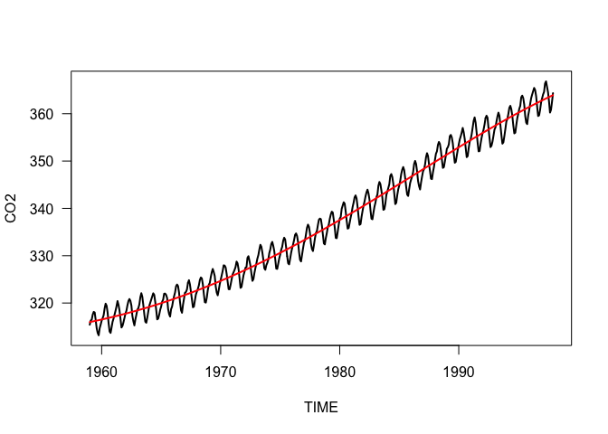 

## The autocorrelation function

From the last session, we have the creepy feeling that this regression is some not correct. We *know* that data points are not independent, since they are taken in exactly the same place, month after month. But that is not necessarily a problem! We account for this by using `TIME` as predictor. This may already be enough to accommodate the temporal dependence of data into account. To find out whether indeed our data have a temporal dependence in the response which is **not** accounted for by the model, we use a diagnostic tool called *autocorrelation function*, short ACF. The ACF creates a new data set of `CO2`, which is displaced against the original by 1, 2, 3, ... time units. Then the new vector is correlated with the original and the correlation value is plotted against the displacement (called the *lag*). The result looks like this:


```r
acf(residuals(fm4))
```

 

Thus, as we lag the data set by 1, 2, 3, ... months, the correlation decreases down to a random value (indicated by the stippled blue lines), only then to increase as negative correlation again to a maximum at lag 6. This means that CO$_2$-concentrations in half a year (and in one year, two years, ...) can be extremely well predicted from the current value, *despite* the fact that our model already accounts for a trend in time!

  > The plot shows that we have **temporal autocorrelation** in our model residuals, indicating that they are indeed **not** independent!

We are now left with two possible ways forward:

 1. Try to identify the reason for this temporal autocorrelation and use it as fixed effect in our model. Or,
 2. try some statistical trick to tell the model that the data are temporally autocorrelated, much in the same way as we did in the last session with design-based non-independence.
 
Let's start with the second option, since this is a mixed-effect model series, not a time series analysis workshop.

## Accommodating temporal autocorrelation in a linear model: GLS

The key trick we have to do is to tell our model that it should know that data points nearer in time are more correlated than those further apart. Thus, correlation is a function of time-distance. But, you may say, the pattern repeats over and over again, so data points 2 years apart are *more* correlated that those 3 months apart. Well, yes. But they are so closely correlated because the correlation carries over from one lag to the next. So if I know the correlation in lag 12, I also know it (roughly) in lag 24, 36 and so forth. Thus, we don't need to model each lag-distance, because it automatically is predicted by that 12 months earlier.

To visualise this, we use the *partial* autocorrelation function:


```r
pacf(residuals(fm4))
```

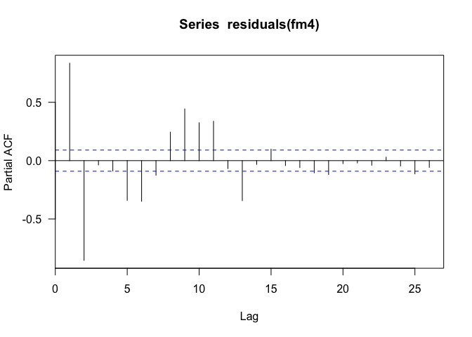 

 > The *partial* autocorrelation function shows us the lag effect *after accounting for what can be predicted from the previous lag effects*.
 
In this case, it is a bit messy, since the autocorrelation doesn't simply fade away with larger lag, but goes up and down in a damped oscillation. Anyway, this is an example, and we shall now try to modify the `lm` to account for temporal autocorrelation.

The way to do so is called "Generalised Least Squares", short GLS. In addition to the standard linear model, it also models the way that data point expectations covary with each other. In this case, we expect a data point of lag 1 to be highly positively correlated with the data, one of lag 2 highly negatively and so forth. If we imagine that each data point is a random variate drawn from some distribution, then we can think of a variance-covariance matrix of the data: each data point has its own column and row. On the diagonal, we have the variances, and on the off-diagonal, the covariance among data points. In a linear model, the off-diagonal entries are 0, i.e. data points are drawn independently of one another (and the diagonal is constant, i.e. all data points have the same variance). In a GLS, we can make the off-diagonal entries a function of the temporal distance between data! Isn't that cool?

MAYBE A FIGURE WOULDN'T HURT HERE!

In R, we use the `gls`-function from package `nlme`. (Actually, this function is also internally behind the `lme` function.)


```r
library(nlme)
fgls <- gls(CO2 ~ poly(TIME, 3), correlation=corAR1(form=~TIME))
summary(fgls)
```

```
## Generalized least squares fit by REML
##   Model: CO2 ~ poly(TIME, 3) 
##   Data: NULL 
##       AIC      BIC    logLik
##   1465.39 1490.229 -726.6948
## 
## Correlation Structure: ARMA(1,0)
##  Formula: ~TIME 
##  Parameter estimate(s):
##      Phi1 
## 0.9511127 
## 
## Coefficients:
##                   Value Std.Error   t-value p-value
## (Intercept)    351.3331   3.51152 100.05155  0.0000
## poly(TIME, 3)1 383.5095  61.85704   6.19993  0.0000
## poly(TIME, 3)2 -36.6866  43.36966  -0.84590  0.3980
## poly(TIME, 3)3  10.5001  35.81249   0.29320  0.7695
## 
##  Correlation: 
##                (Intr) p(TIME,3)1 p(TIME,3)2
## poly(TIME, 3)1  0.237                      
## poly(TIME, 3)2 -0.361  0.397               
## poly(TIME, 3)3  0.155 -0.520      0.259    
## 
## Standardized residuals:
##        Min         Q1        Med         Q3        Max 
## -18.465603 -14.848658 -12.871317 -10.647402   1.372831 
## 
## Residual standard error: 1.185015 
## Degrees of freedom: 468 total; 464 residual
```

```r
acf(residuals(fgls))
```

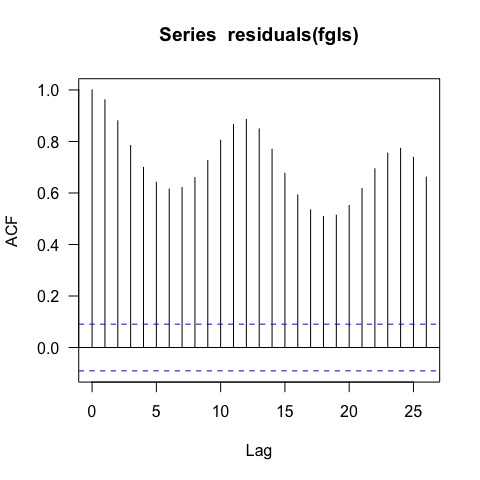 

We see that a correlation of 0.95 was fitted for a lag of 1 ("Parameter estimate Phi1"), so only one lag was accommodated (thus: `corAR1`). With a look at the ACF of the residuals we can see that it is not nearly good enough.

We can construct much more complicated correlation structures using the `corARMA` function, but this is only for illustration:

```r
COR3 <- corARMA(form=~TIME, p=3, q=0)
COR3 <- Initialize(COR3, data=data.frame("TIME"=TIME))
flag3 <- gls(CO2 ~ poly(TIME, 3), correlation=COR3) # takes a while
summary(flag3)
```

```
## Generalized least squares fit by REML
##   Model: CO2 ~ poly(TIME, 3) 
##   Data: NULL 
##       AIC      BIC    logLik
##   1469.31 1502.429 -726.6549
## 
## Correlation Structure: ARMA(3,0)
##  Formula: ~TIME 
##  Parameter estimate(s):
##       Phi1       Phi2       Phi3 
##  1.8094257 -1.3809934  0.5403717 
## 
## Coefficients:
##                   Value Std.Error  t-value p-value
## (Intercept)    351.5273   3.54070 99.28198  0.0000
## poly(TIME, 3)1 393.1591  59.36127  6.62316  0.0000
## poly(TIME, 3)2 -32.9159  41.34740 -0.79608  0.4264
## poly(TIME, 3)3   9.0507  34.02375  0.26601  0.7903
## 
##  Correlation: 
##                (Intr) p(TIME,3)1 p(TIME,3)2
## poly(TIME, 3)1  0.241                      
## poly(TIME, 3)2 -0.413  0.368               
## poly(TIME, 3)3  0.141 -0.543      0.228    
## 
## Standardized residuals:
##        Min         Q1        Med         Q3        Max 
## -18.472352 -15.120912 -13.098248 -10.914279   1.405969 
## 
## Residual standard error: 1.184642 
## Degrees of freedom: 468 total; 464 residual
```
<!---
pacf(fitted.values(flag3))
pacf does not work as a way to look at the fitted autocorrelation ... so how?
--->

So we need to be smarter about how to embrace multi-lag dependence. Luckily, someone else has thought of an automatic way to fit autoregressive models.

```r
library(forecast)
fautogls <- auto.arima(CO2, xreg=poly(TIME, 3))
```

```
## Warning in auto.arima(CO2, xreg = poly(TIME, 3)): Unable to fit final
## model using maximum likelihood. AIC value approximated
```

```r
summary(fautogls)
```

```
## Series: CO2 
## ARIMA(4,0,3) with non-zero mean 
## 
## Coefficients:
##          ar1      ar2     ar3      ar4      ma1     ma2      ma3
##       2.6924  -3.6352  2.6383  -0.9524  -1.4055  1.2651  -0.3368
## s.e.  0.0145   0.0301  0.0302   0.0144   0.0369  0.0455   0.0399
##       intercept         1        2         3
##        337.0490  319.4155  31.0893  -10.6938
## s.e.     0.0427    0.9287   0.9322    0.9374
## 
## sigma^2 estimated as 0.2073:  log likelihood=-295.79
## AIC=616.78   AICc=617.46   BIC=666.56
## 
## Training set error measures:
##                        ME      RMSE       MAE          MPE      MAPE
## Training set 0.0007055813 0.4533035 0.3561352 6.187736e-05 0.1057402
##                   MASE        ACF1
## Training set 0.3308964 -0.08238655
```

```r
acf(residuals(fautogls))
```

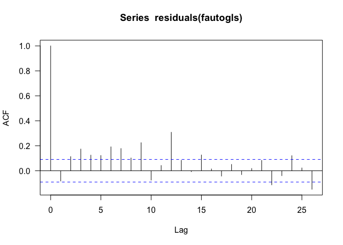 

This is indeed a much better look of the residual autocorrelation. There are occasional peaks here and there, but the overall level is dramatically reduced. Let's plot this model onto the data and see what else can be done.

```r
plot(TIME, CO2, type="l", lwd=3)
lines(TIME, fitted.values(fautogls), col="red", lwd=2, lty=2)
```

 

A marvellous fit! The key thing to notice here is that the *seasonal* pattern of CO$_2$ is actually fitted using the covariance matrix, **not** using a seasonal predictor. We shouldn't do that, if we can avoid it, because we may want to interpret this seasonality as an actual ecological process, rather than a statistical nuisance.

So, quickly, here is a way to put seasonality into a GLS:


```r
COS <- cos(2*pi*TIME)
SIN <- sin(2*pi*TIME)
fglsseason <- gls(CO2 ~ poly(TIME, 3) + COS + SIN, correlation=COR3)
summary(fglsseason)
```

```
## Generalized least squares fit by REML
##   Model: CO2 ~ poly(TIME, 3) + COS + SIN 
##   Data: NULL 
##        AIC      BIC    logLik
##   891.9649 933.3205 -435.9824
## 
## Correlation Structure: ARMA(3,0)
##  Formula: ~TIME 
##  Parameter estimate(s):
##       Phi1       Phi2       Phi3 
##  1.6733064 -1.3091694  0.5955463 
## 
## Coefficients:
##                   Value Std.Error   t-value p-value
## (Intercept)    329.9930  1.905882 173.14448  0.0000
## poly(TIME, 3)1 293.2508 29.689997   9.87709  0.0000
## poly(TIME, 3)2  71.0640 20.830769   3.41149  0.0007
## poly(TIME, 3)3 -14.6249 17.091150  -0.85570  0.3926
## COS             -0.3594  0.079973  -4.49340  0.0000
## SIN              2.8940  0.085547  33.82968  0.0000
## 
##  Correlation: 
##                (Intr) p(TIME,3)1 p(TIME,3)2 p(TIME,3)3 COS   
## poly(TIME, 3)1  0.255                                        
## poly(TIME, 3)2 -0.453  0.329                                 
## poly(TIME, 3)3  0.139 -0.550      0.213                      
## COS            -0.135 -0.033      0.030     -0.015           
## SIN            -0.343 -0.103      0.143     -0.042      0.037
## 
## Standardized residuals:
##       Min        Q1       Med        Q3       Max 
## -2.187965  9.152905 12.387934 13.893225 16.171102 
## 
## Residual standard error: 0.6299837 
## Degrees of freedom: 468 total; 462 residual
```

```r
AIC(fgls)
```

```
## [1] 1465.39
```

```r
AIC(fglsseason) # much better fit!
```

```
## [1] 891.9649
```

And now the same for the auto.arima (which requires the predictors to be handed over as a matrix):


```r
fautoglsseason <- auto.arima(CO2, xreg=cbind(poly(TIME,3), COS, SIN))
summary(fautogls)
```

```
## Series: CO2 
## ARIMA(4,0,3) with non-zero mean 
## 
## Coefficients:
##          ar1      ar2     ar3      ar4      ma1     ma2      ma3
##       2.6924  -3.6352  2.6383  -0.9524  -1.4055  1.2651  -0.3368
## s.e.  0.0145   0.0301  0.0302   0.0144   0.0369  0.0455   0.0399
##       intercept         1        2         3
##        337.0490  319.4155  31.0893  -10.6938
## s.e.     0.0427    0.9287   0.9322    0.9374
## 
## sigma^2 estimated as 0.2073:  log likelihood=-295.79
## AIC=616.78   AICc=617.46   BIC=666.56
## 
## Training set error measures:
##                        ME      RMSE       MAE          MPE      MAPE
## Training set 0.0007055813 0.4533035 0.3561352 6.187736e-05 0.1057402
##                   MASE        ACF1
## Training set 0.3308964 -0.08238655
```

```r
summary(fautoglsseason)
```

```
## Series: CO2 
## ARIMA(2,0,2) with non-zero mean 
## 
## Coefficients:
##          ar1      ar2     ma1     ma2  intercept         1        2
##       0.8755  -0.7049  0.0733  0.4291   337.0547  319.2127  31.3632
## s.e.  0.0487   0.0466  0.0684  0.0482     0.0367    0.7951   0.7951
##              3      COS     SIN
##       -10.9952  -0.3930  2.7468
## s.e.    0.7956   0.0622  0.0622
## 
## sigma^2 estimated as 0.1925:  log likelihood=-279.45
## AIC=580.9   AICc=581.48   BIC=626.53
## 
## Training set error measures:
##                         ME      RMSE       MAE           MPE      MAPE
## Training set -0.0002279262 0.4387431 0.3489505 -0.0002288606 0.1033012
##                   MASE      ACF1
## Training set 0.3242209 0.1084915
```

```r
AIC(fautogls)
```

```
## [1] 615.5866
```

```r
AIC(fautoglsseason)
```

```
## [1] 580.8961
```

```r
plot(TIME, CO2, type="l", lwd=3)
lines(TIME, fitted.values(fautogls), col="red", lwd=2, lty=2)
lines(TIME, fitted.values(fautoglsseason), col="green", lwd=2, lty=3)
```

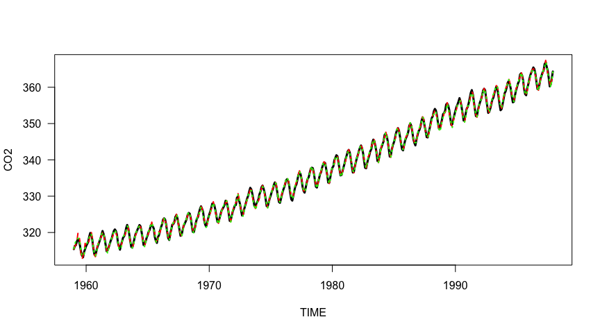 

# Repeated measurements

A very common design is to sample units (= subjects, plots) repeatedly, a.k.a. *repeated measurements*. Here we have to tell the model the structure (i.e. samples within plots over time) as well as attempt to represent the temporal dependency itself. Currently, only `lme` and `mgcv::gamm` can handle both a random effect and a correlation structure as in the previous time example.

## Fitting a repeated measurement model with lme
Let's take a typical example (actually not so typical, but rather exceptional in the long time series these data constitute). In this case, forest plots were treated in three different ways (control, logging, logging and thinning) and monitored repeatedly over decades. Response is basal area (m$^2$/ha). Additionally, the replicated treatments are arranged in five blocks. First, we make a nice "German-colourscheme" plot of the data.
 

```r
dats <- read.csv("Data_Angela2.csv")
summary(dats)
```

```
##      Block        Treat         year           plot             ba        
##  Min.   :1.000   C   :42   Min.   :1983   Min.   :110.0   Min.   : 3.880  
##  1st Qu.:2.000   L   :70   1st Qu.:1987   1st Qu.:206.0   1st Qu.: 6.080  
##  Median :3.000   LLTI:49   Median :1995   Median :305.0   Median : 6.950  
##  Mean   :3.174             Mean   :1997   Mean   :324.3   Mean   : 6.887  
##  3rd Qu.:5.000             3rd Qu.:2008   3rd Qu.:504.0   3rd Qu.: 7.630  
##  Max.   :5.000             Max.   :2012   Max.   :512.0   Max.   :10.050
```

```r
dats$Block <- as.factor(dats$Block)
dats$plot <- as.factor(dats$plot)
dats$year <- dats$year - 1983 # reset first year to 0
attach(dats)
plot(ba ~ year, las=1, type="n")
points(ba ~ year, data=dats[Treat=="C",], pch=16, cex=1.5)
points(ba ~ I(year+0.5), data=dats[Treat=="L",], pch=17, cex=1.5, col="red")
points(ba ~ I(year+1), data=dats[Treat=="LLTI",], pch=18, cex=1.5, col="gold")
matlines(unique(year), t(tapply(ba, list(Treat, year), mean)), lwd=2, col=c("black", "red", "gold"), lty=1)
legend("topleft", legend=c("control", "logging", "logging & thinning"), col=c("black", "red", "gold"), lty=1, lwd=2, bty="n", cex=1.25, pch=16:18)
```

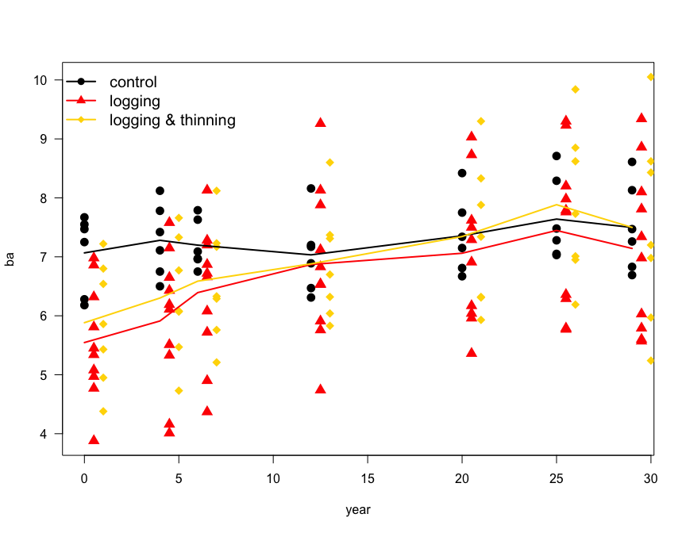 

Next, we try to fit a model *for the control treatment only*, just as a warm-up exercise. We need to tell the model that `plot`s are nested in `Block` and that through the `year`s there is a (linear) dependence. For some reason, the grouping structure of the random term and the correlation must be identical. Thus, we fit a correlation for `year` effect per each `plot` in each `Block` (which actually makes sense, too).


```r
library(nlme)
flmeC <- lme(ba ~ year, random=~1|Block/plot, correlation=corLin(form=~year|Block/plot), data=dats[Treat=="C",], control=list(maxIter=5000))
summary(flmeC)
```

```
## Linear mixed-effects model fit by REML
##  Data: dats[Treat == "C", ] 
##        AIC      BIC    logLik
##   62.44111 72.57439 -25.22056
## 
## Random effects:
##  Formula: ~1 | Block
##         (Intercept)
## StdDev:   0.2018494
## 
##  Formula: ~1 | plot %in% Block
##         (Intercept)  Residual
## StdDev:   0.4373343 0.4905449
## 
## Correlation Structure: Linear spatial correlation
##  Formula: ~year | Block/plot 
##  Parameter estimate(s):
##    range 
## 12.64518 
## Fixed effects: ba ~ year 
##                Value Std.Error DF   t-value p-value
## (Intercept) 7.024450 0.3229865 35 21.748429  0.0000
## year        0.015868 0.0096598 35  1.642633  0.1094
##  Correlation: 
##      (Intr)
## year -0.425
## 
## Standardized Within-Group Residuals:
##         Min          Q1         Med          Q3         Max 
## -1.67069908 -0.33653119 -0.01761703  0.74708113  1.90099297 
## 
## Number of Observations: 42
## Number of Groups: 
##           Block plot %in% Block 
##               1               6
```
We included `year` as a fixed effect to test, whether over time there was a significant change in basal area (there wasn't, phew, because this is the control and there shouldn't be one).

Now we can ramp up the model and do the same thing across the three treatments:


```r
flme <- lme(ba ~ Treat*year, random=~1|Block/plot, correlation=corLin(form=~year|Block/plot), data=dats, control=list(maxIter=5000))
anova(flme)
```

```
##             numDF denDF   F-value p-value
## (Intercept)     1   135 315.60604  <.0001
## Treat           2    16   0.29473  0.7487
## year            1   135  52.66428  <.0001
## Treat:year      2   135   3.74813  0.0260
```

```r
summary(flme)
```

```
## Linear mixed-effects model fit by REML
##  Data: dats 
##        AIC      BIC    logLik
##   292.5515 322.9858 -136.2758
## 
## Random effects:
##  Formula: ~1 | Block
##         (Intercept)
## StdDev:   0.7372255
## 
##  Formula: ~1 | plot %in% Block
##         (Intercept)  Residual
## StdDev:   0.8154133 0.6011608
## 
## Correlation Structure: Linear spatial correlation
##  Formula: ~year | Block/plot 
##  Parameter estimate(s):
##   range 
## 12.3611 
## Fixed effects: ba ~ Treat * year 
##                    Value Std.Error  DF   t-value p-value
## (Intercept)     7.021039 0.8373936 135  8.384396  0.0000
## TreatL         -1.086506 0.9678319  16 -1.122619  0.2782
## TreatLLTI      -1.287857 0.9987940  16 -1.289412  0.2156
## year            0.016007 0.0117984 135  1.356723  0.1771
## TreatL:year     0.036568 0.0149239 135  2.450306  0.0156
## TreatLLTI:year  0.038853 0.0160785 135  2.416486  0.0170
##  Correlation: 
##                (Intr) TreatL TrLLTI year   TrtL:y
## TreatL         -0.865                            
## TreatLLTI      -0.838  0.858                     
## year           -0.200  0.173  0.167              
## TreatL:year     0.158 -0.219 -0.132 -0.791       
## TreatLLTI:year  0.147 -0.127 -0.228 -0.734  0.580
## 
## Standardized Within-Group Residuals:
##        Min         Q1        Med         Q3        Max 
## -2.3961400 -0.3396705  0.0863781  0.6390154  1.8910513 
## 
## Number of Observations: 161
## Number of Groups: 
##           Block plot %in% Block 
##               5              23
```

We now see that the three treatments differ in their trajectory over time! They have the same intercept (basal area in year 0 = 1983), as indicated by the non-significant effect of `Treat`. The basal area increases with time (`year` effect), but this time effect is different for the three treatments (`Treat:year` interaction significant). Specifically, for the control there is no trend over time (`year` in the `summary` is not significant), but both treatments exhibit a trend (the interaction effects are significant).

Our model now has various parameters fitted, but how can we "simply" visualise the effect of treatment, across years? To do so, we need to compute the expected value for each level of the random effect(s), for the desired values of the fixed effects. In other words, if we want the value for, say, control in 1990, we need to compute the model prediction *for each `block/plot` combination* and then average those, to get the *population-level* prediction. Let us as an example extract the expected value for one specific plot, treatment and year:


```r
newdata <- data.frame("Treat"="C", year=1990, Block="5", plot="504")
predict(flme, newdata=newdata)
```

```
##    5/504 
## 39.67845 
## attr(,"label")
## [1] "Predicted values"
```

Luckily there is a build-in option in the `predict`-function for `lme` that aggregates across all random effects if we are only interested in the population-level prediction. If we additionally are interested in the confidence interval of this prediction (and I think we should be), then we need to resort to another package and function.


```r
newdata <- data.frame("Treat"="C", year=1990)
predict(flme, newdata=newdata, level=0)
```

```
## [1] 38.87518
## attr(,"label")
## [1] "Predicted values"
```

```r
library(AICcmodavg)
predictSE(flme, newdata=newdata, level=0)
```

```
## $fit
## [1] 38.87518
## 
## $se.fit
## [1] 23.32589
```

The `level=0` instructs the model to do this averaging over all random effects for us, and only returns the population-level estimate. Note, however, that we cannot just take random values for `Block` and `plot`, but rather use combinations that actually exist!

So now turn this into a nice plot:


```r
attach(dats)
plot(ba ~ year, las=1, type="n", xlim=c(0, 35))
points(ba ~ year, data=dats[Treat=="C",], pch=16, cex=1.5)
points(ba ~ I(year+0.5), data=dats[Treat=="L",], pch=17, cex=1.5, col="red")
points(ba ~ I(year+1), data=dats[Treat=="LLTI",], pch=18, cex=1.5, col="gold")
newC <- data.frame("Treat"="C", year=0:35)
predsC <- predictSE(flme, newdata=newC, level=0)
matlines(0:35, cbind(predsC$fit,predsC$fit + 2*predsC$se.fit, predsC$fit - 2*predsC$se.fit), lwd=2, lty=c(1,2,2), col="black")
newL <- data.frame("Treat"="L", year=0:35)
predsL <- predictSE(flme, newdata=newL, level=0)
matlines(0:35, cbind(predsL$fit, predsL$fit + 2*predsL$se.fit, predsL$fit - 2*predsL$se.fit), lwd=2, lty=c(1,2,2), col="red")
newLT <- data.frame("Treat"="LLTI", year=0:35)
predsLT <- predictSE(flme, newdata=newLT, level=0)
matlines(0:35, cbind(predsLT$fit, predsLT$fit + 2*predsLT$se.fit, predsLT$fit - 2*predsLT$se.fit), lwd=2, lty=c(1,2,2), col="gold")
legend("topleft", legend=c("control", "logging", "logging & thinning"), col=c("black", "red", "gold"), lty=1, lwd=2, bty="n", cex=1.25, pch=16:18)
```

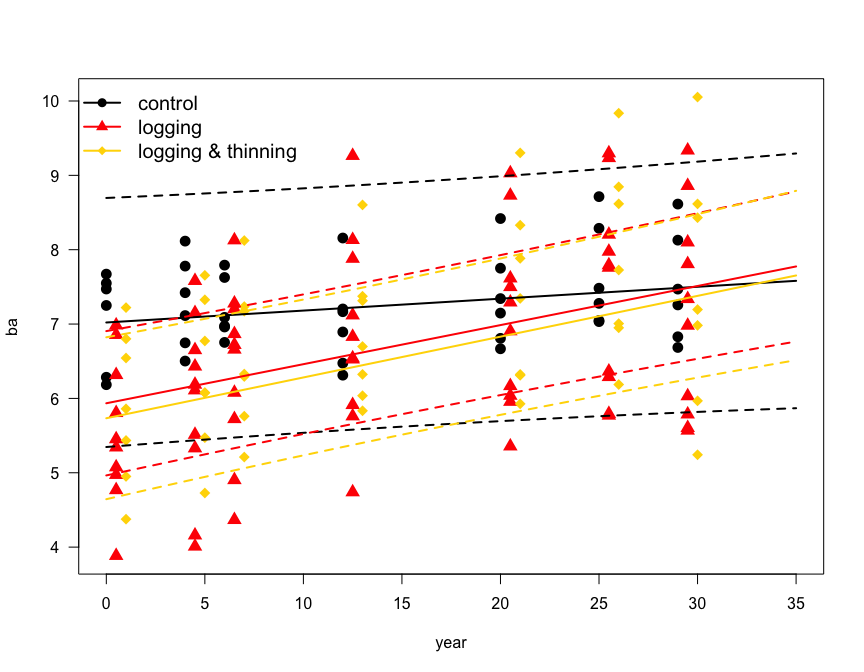 

You may wonder, why the 96%-confidence intervals are so parallel to the expected values. The main reason is that they depict only the effect of the fixed effect. Another that I have not extrapolated much beyond the data. There you should see a substantial increase in spread of the CI.

Finally, we should always do the usual model diagnostics: residual plots, alternative model structure, etc. Here is a plot of residuals over fitted:


```r
plot(residuals(flme) ~ fitted.values(flme))
```

 

Hm. Is it only me who can see some upwards trend in the right half of the plot? Maybe the trend is not linear through time? I add a quadratic term for `year` and its interactions, plus a cubic term for `year` alone (wouldn't converge otherwise).


```r
flme2 <- lme(ba ~ Treat*(year+I(year^2)) + I(year^3), random=~1|Block/plot, correlation=corLin(form=~year|Block/plot), data=dats, control=list(maxIter=5000))
anova(flme2)
```

```
##                 numDF denDF   F-value p-value
## (Intercept)         1   131 315.09821  <.0001
## Treat               2    16   0.29361  0.7495
## year                1   131  60.04371  <.0001
## I(year^2)           1   131  17.96329  <.0001
## I(year^3)           1   131   3.25469  0.0735
## Treat:year          2   131   4.30400  0.0155
## Treat:I(year^2)     2   131   2.40724  0.0940
```

```r
summary(flme2)
```

```
## Linear mixed-effects model fit by REML
##  Data: dats 
##        AIC      BIC    logLik
##   330.0395 372.2814 -151.0197
## 
## Random effects:
##  Formula: ~1 | Block
##         (Intercept)
## StdDev:   0.7383107
## 
##  Formula: ~1 | plot %in% Block
##         (Intercept)  Residual
## StdDev:   0.8234325 0.5621305
## 
## Correlation Structure: Linear spatial correlation
##  Formula: ~year | Block/plot 
##  Parameter estimate(s):
##    range 
## 12.55121 
## Fixed effects: ba ~ Treat * (year + I(year^2)) + I(year^3) 
##                         Value Std.Error  DF   t-value p-value
## (Intercept)          6.998420 0.8415239 131  8.316365  0.0000
## TreatL              -1.340809 0.9732582  16 -1.377649  0.1873
## TreatLLTI           -1.497400 1.0047462  16 -1.490326  0.1556
## year                -0.017549 0.0409769 131 -0.428261  0.6692
## I(year^2)            0.004059 0.0026633 131  1.523882  0.1299
## I(year^3)           -0.000101 0.0000559 131 -1.804075  0.0735
## TreatL:year          0.121679 0.0421003 131  2.890225  0.0045
## TreatLLTI:year       0.109226 0.0453573 131  2.408127  0.0174
## TreatL:I(year^2)    -0.002923 0.0013674 131 -2.137820  0.0344
## TreatLLTI:I(year^2) -0.002420 0.0014732 131 -1.642706  0.1028
##  Correlation: 
##                     (Intr) TreatL TrLLTI year   I(y^2) I(y^3) TrtL:y
## TreatL              -0.865                                          
## TreatLLTI           -0.838  0.856                                   
## year                -0.136  0.117  0.113                            
## I(year^2)            0.047 -0.039 -0.038 -0.844                     
## I(year^3)           -0.002  0.000  0.000  0.583 -0.914              
## TreatL:year          0.131 -0.182 -0.110 -0.642  0.303  0.000       
## TreatLLTI:year       0.122 -0.105 -0.190 -0.596  0.281  0.000  0.580
## TreatL:I(year^2)    -0.087  0.121  0.073  0.606 -0.321  0.000 -0.943
## TreatLLTI:I(year^2) -0.081  0.070  0.126  0.562 -0.298  0.000 -0.547
##                     TrLLTI: TL:I(^
## TreatL                            
## TreatLLTI                         
## year                              
## I(year^2)                         
## I(year^3)                         
## TreatL:year                       
## TreatLLTI:year                    
## TreatL:I(year^2)    -0.547        
## TreatLLTI:I(year^2) -0.943   0.580
## 
## Standardized Within-Group Residuals:
##         Min          Q1         Med          Q3         Max 
## -2.09762411 -0.41586193  0.03725153  0.50560563  2.30961144 
## 
## Number of Observations: 161
## Number of Groups: 
##           Block plot %in% Block 
##               5              23
```

Ah! So there is evidence for a non-linear trend (in the `summary`: `TreatL:poly(year, 2)2` is significant).
What do the residuals for this model look like?


```r
plot(residuals(flme2)~ fitted.values(flme2))
```

 

Better! Now we want to see the plot with the new model as well:


```r
plot(ba ~ year, las=1, type="n", xlim=c(0, 35))
points(ba ~ year, data=dats[Treat=="C",], pch=16, cex=1.5)
points(ba ~ I(year+0.5), data=dats[Treat=="L",], pch=17, cex=1.5, col="red")
points(ba ~ I(year+1), data=dats[Treat=="LLTI",], pch=18, cex=1.5, col="gold")
newC <- data.frame("Treat"="C", year=0:35)
predsC <- predictSE(flme2, newdata=newC, level=0)
matlines(0:35, cbind(predsC$fit,predsC$fit + 2*predsC$se.fit, predsC$fit - 2*predsC$se.fit), lwd=2, lty=c(1,2,2), col="black")
newL <- data.frame("Treat"="L", year=0:35)
predsL <- predictSE(flme2, newdata=newL, level=0)
matlines(0:35, cbind(predsL$fit, predsL$fit + 2*predsL$se.fit, predsL$fit - 2*predsL$se.fit), lwd=2, lty=c(1,2,2), col="red")
newLT <- data.frame("Treat"="LLTI", year=0:35)
predsLT <- predictSE(flme2, newdata=newLT, level=0)
matlines(0:35, cbind(predsLT$fit, predsLT$fit + 2*predsLT$se.fit, predsLT$fit - 2*predsLT$se.fit), lwd=2, lty=c(1,2,2), col="gold")
legend("topleft", legend=c("control", "logging", "logging & thinning"), col=c("black", "red", "gold"), lty=1, lwd=2, bty="n", cex=1.25, pch=16:18)
```

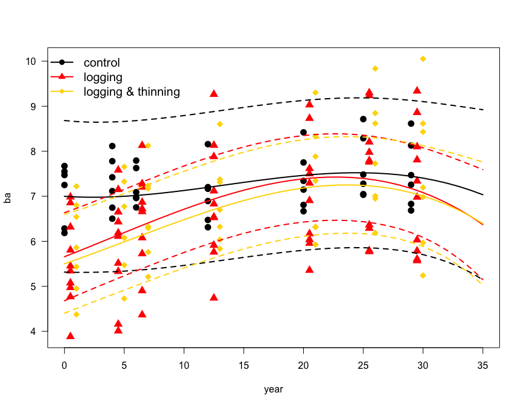 

## Fitting a non-linear trend over time with GAMM

We can also fit a spline for each treatment, using `mgcv:gamm`. The arguments in the spline call are necessary to avoid error messages: `k=3` restricts the flexibility of the spline to the equivalent of a cubic polynomial, while `bs="ts"` employs shrinkage to make the splines as straight as possible (this is a very layman's explanation of what shrinkage is). I also changed the correlation structure to `corExp`, which gives (here) a slightly better fit. And, finally, I had to increase the number of permissable iterations to allow for convergence:


```r
library(mgcv)
fgamm <- gamm(ba ~ s(year, by=Treat, k=3, bs="ts"), random=list("Block"=~1, "plot"=~1), correlation=corExp(form=~year|Block/plot), data=dats, control=list(maxIter=500))
summary(fgamm$lme)
```

```
## Linear mixed-effects model fit by maximum likelihood
##  Data: strip.offset(mf) 
##        AIC      BIC    logLik
##   262.8781 287.5294 -123.4391
## 
## Random effects:
##  Formula: ~Xr - 1 | g
##  Structure: pdIdnot
##               Xr1       Xr2
## StdDev: 0.7660702 0.7660702
## 
##  Formula: ~Xr.0 - 1 | g.0 %in% g
##  Structure: pdIdnot
##           Xr.01   Xr.02
## StdDev: 13.8991 13.8991
## 
##  Formula: ~Xr.1 - 1 | g.1 %in% g.0 %in% g
##  Structure: pdIdnot
##            Xr.11    Xr.12
## StdDev: 8.248333 8.248333
## 
##  Formula: ~1 | Block %in% g.1 %in% g.0 %in% g
##         (Intercept)
## StdDev:   0.4386258
## 
##  Formula: ~1 | plot %in% Block %in% g.1 %in% g.0 %in% g
##         (Intercept)  Residual
## StdDev:   0.7677279 0.6610901
## 
## Correlation Structure: Exponential spatial correlation
##  Formula: ~year | g/g.0/g.1/Block/plot 
##  Parameter estimate(s):
##    range 
## 16.41818 
## Fixed effects: y ~ X - 1 
##      Value Std.Error  DF  t-value p-value
## X 6.786756 0.2761888 138 24.57288       0
## 
## Standardized Within-Group Residuals:
##         Min          Q1         Med          Q3         Max 
## -1.76911610 -0.38347263  0.02654953  0.45675969  2.05403319 
## 
## Number of Observations: 161
## Number of Groups: 
##                                        g 
##                                        1 
##                               g.0 %in% g 
##                                        1 
##                      g.1 %in% g.0 %in% g 
##                                        1 
##           Block %in% g.1 %in% g.0 %in% g 
##                                        5 
## plot %in% Block %in% g.1 %in% g.0 %in% g 
##                                       23
```

The interpretation is a bit more awkward, since we now have a GAM-part of the object, and an LME-part. We can use the LME-part of the model to investigate how much variance is attributed to different hierarchical levels. And, citing from the `gamm` help page (see Value: lme), "Note that the model formulae and grouping structures may appear to be rather bizarre, because of the manner in which the GAMM is split up and the calls to lme and gammPQL are constructed." This means that we may not actually be completely sure, whether the coding of the random effects is correct. (You may want to try, e.g. `"Block"=~1|plot` to see that this gives different estimates, especially for the range of spatial autocorrelation! I used this as a guidance that it would *not* be the correct way to communicate the random effect structure to `gamm`.)

First of all, the AIC is (substantially) lower for the GAMM than for the LME. (I actually had `Treat` as an additional fixed effect in the GAMM, but that model was slightly worse and so I deleted it.) Secondly, both range and `Block/plot` random effects are estimated very similarly. And finally, `year:Treat` is also indicating a different slope for the two treatments than for the control.


```r
summary(fgamm$gam)
```

```
## 
## Family: gaussian 
## Link function: identity 
## 
## Formula:
## ba ~ s(year, by = Treat, k = 3)
## 
## Parametric coefficients:
##             Estimate Std. Error t value Pr(>|t|)    
## (Intercept)   6.7895     0.2753   24.66   <2e-16 ***
## ---
## Signif. codes:  0 '***' 0.001 '**' 0.01 '*' 0.05 '.' 0.1 ' ' 1
## 
## Approximate significance of smooth terms:
##                     edf Ref.df      F  p-value    
## s(year):TreatC    1.000  1.000  2.306    0.131    
## s(year):TreatL    1.934  1.934 32.031 3.55e-12 ***
## s(year):TreatLLTI 1.846  1.846 15.733 1.90e-06 ***
## ---
## Signif. codes:  0 '***' 0.001 '**' 0.01 '*' 0.05 '.' 0.1 ' ' 1
## 
## R-sq.(adj) =  0.186   
##   Scale est. = 0.29487   n = 161
```

The GAM-part of the model tells us that the "spline" for controls over time is horizontal (has virtually no estimated degree of freedom, edf), while those for the two treatments L and LLTI have a unimodal shape (2 edf). The control-trend is not significant, but those for the two logging treatments are.

Let's plot also this model. Notice that we only use the GAM-part of the model, which has an `se.fit` option. Here the fixed-only structure of the predictions is more explicit than in the previous LMEs.


```r
plot(ba ~ year, las=1, type="n", xlim=c(0, 35))
points(ba ~ year, data=dats[Treat=="C",], pch=16, cex=1.5)
points(ba ~ I(year+0.5), data=dats[Treat=="L",], pch=17, cex=1.5, col="red")
points(ba ~ I(year+1), data=dats[Treat=="LLTI",], pch=18, cex=1.5, col="gold")
newC <- data.frame("Treat"="C", year=0:35)
predsC <- predict(fgamm$gam, newdata=newC, se.fit=T)
matlines(0:35, cbind(predsC$fit,predsC$fit + 2*predsC$se.fit, predsC$fit - 2*predsC$se.fit), lwd=2, lty=c(1,2,2), col="black")
newL <- data.frame("Treat"="L", year=0:35)
predsL <- predict(fgamm$gam, newdata=newL, se.fit=T)
matlines(0:35, cbind(predsL$fit, predsL$fit + 2*predsL$se.fit, predsL$fit - 2*predsL$se.fit), lwd=2, lty=c(1,2,2), col="red")
newLT <- data.frame("Treat"="LLTI", year=0:35)
predsLT <- predict(fgamm$gam, newdata=newLT, se.fit=T)
matlines(0:35, cbind(predsLT$fit, predsLT$fit + 2*predsLT$se.fit, predsLT$fit - 2*predsLT$se.fit), lwd=2, lty=c(1,2,2), col="gold")
legend("topleft", legend=c("control", "logging", "logging & thinning"), col=c("black", "red", "gold"), lty=1, lwd=2, bty="n", cex=1.25, pch=16:18)
```

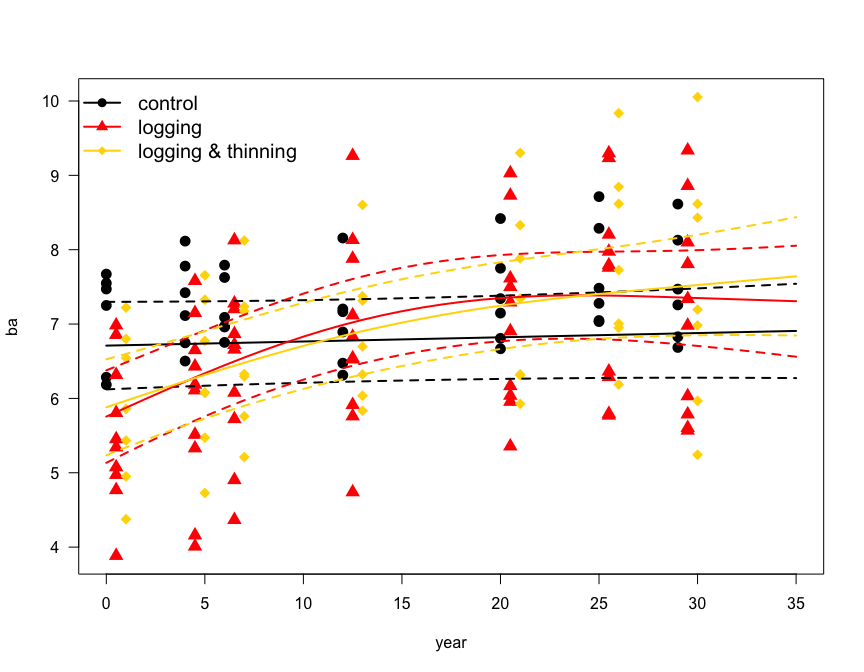 


```r
detach(dats)
```

# Spatial autocorrelation

A typical setting, in which non-independence arises, is the analysis of spatial data. Here the "first law of geography" holds, that points near each other are more similar than those further away. This is called spatial autocorrelation, and it is the same thing as we have seen in the time-series analysis above, just now in two dimensions.

Note that it is very important to tell between spatial autocorrelation in raw data and in residuals! The former may simply be a consequence of the fact that our environment is spatially autocorrelated, the second is a statistical problem. If our data are only spatially autocorrelated because the environment is, then this is also called "spatial dependence". Say we are interested in the distribution of a species, say pine marten *Martes martes* in Europe. Then we would expect that forests are a good predictor, and forests are distributed in a clumped and hence spatially autocorrelated way. As a result, the raw data of pine marten distribution are also spatially autocorrelated, due to spatial dependence on forests. However, we could hope that accounting for forest cover, the model residuals are *not* spatially autocorrelated anymore. 

We will see that they still are, possibly because pine martens can move and thus are more likely to be found even in unsuitable sites near to suitable ones. This may also cause spatial autocorrelation (in the residuals).

<!---
load("data.all.Rdata")
names(data.all)
martes <- data.all[, c(3,4,11,12,23,90)]
save(martes, file="martes.Rdata")
--->

```r
load("martes.Rdata")
plot(NOFORIGIN ~ EOFORIGIN, data=martes, pch=15, col=ifelse(martes_martes==0, "grey80", "black"), cex=0.7, main="Pine marten distribution in Europe")
```

 


```r
round(cor(martes), 3) # no problematic collinearity
```

```
##               EOFORIGIN NOFORIGIN    GDD PRE_YEAR   WOOD martes_martes
## EOFORIGIN         1.000     0.210 -0.178   -0.266  0.170         0.186
## NOFORIGIN         0.210     1.000 -0.883    0.110  0.352         0.427
## GDD              -0.178    -0.883  1.000   -0.280 -0.471        -0.529
## PRE_YEAR         -0.266     0.110 -0.280    1.000  0.209         0.175
## WOOD              0.170     0.352 -0.471    0.209  1.000         0.434
## martes_martes     0.186     0.427 -0.529    0.175  0.434         1.000
```

```r
fMM <- glm(martes_martes ~ GDD*PRE_YEAR*WOOD, family=binomial, data=martes)
anova(fMM, test="Chisq")
```

```
## Analysis of Deviance Table
## 
## Model: binomial, link: logit
## 
## Response: martes_martes
## 
## Terms added sequentially (first to last)
## 
## 
##                   Df Deviance Resid. Df Resid. Dev  Pr(>Chi)    
## NULL                               3036     3532.7              
## GDD                1   889.52      3035     2643.2 < 2.2e-16 ***
## PRE_YEAR           1     5.64      3034     2637.6   0.01752 *  
## WOOD               1   158.22      3033     2479.4 < 2.2e-16 ***
## GDD:PRE_YEAR       1    51.56      3032     2427.8 6.939e-13 ***
## GDD:WOOD           1   192.31      3031     2235.5 < 2.2e-16 ***
## PRE_YEAR:WOOD      1     4.93      3030     2230.6   0.02637 *  
## GDD:PRE_YEAR:WOOD  1    27.31      3029     2203.2 1.729e-07 ***
## ---
## Signif. codes:  0 '***' 0.001 '**' 0.01 '*' 0.05 '.' 0.1 ' ' 1
```

```r
summary(fMM)
```

```
## 
## Call:
## glm(formula = martes_martes ~ GDD * PRE_YEAR * WOOD, family = binomial, 
##     data = martes)
## 
## Deviance Residuals: 
##     Min       1Q   Median       3Q      Max  
## -3.2647  -0.2977   0.2772   0.5839   2.4467  
## 
## Coefficients:
##                     Estimate Std. Error z value Pr(>|z|)    
## (Intercept)        8.851e+00  7.102e-01  12.463  < 2e-16 ***
## GDD               -2.911e-03  2.650e-04 -10.987  < 2e-16 ***
## PRE_YEAR          -1.674e-03  8.306e-04  -2.015   0.0439 *  
## WOOD               8.111e-01  1.942e-01   4.175 2.97e-05 ***
## GDD:PRE_YEAR       8.350e-07  3.353e-07   2.490   0.0128 *  
## GDD:WOOD          -9.989e-05  6.389e-05  -1.564   0.1179    
## PRE_YEAR:WOOD      7.413e-04  2.547e-04   2.911   0.0036 ** 
## GDD:PRE_YEAR:WOOD -4.420e-07  9.788e-08  -4.516 6.30e-06 ***
## ---
## Signif. codes:  0 '***' 0.001 '**' 0.01 '*' 0.05 '.' 0.1 ' ' 1
## 
## (Dispersion parameter for binomial family taken to be 1)
## 
##     Null deviance: 3532.7  on 3036  degrees of freedom
## Residual deviance: 2203.2  on 3029  degrees of freedom
## AIC: 2219.2
## 
## Number of Fisher Scoring iterations: 6
```

## Correlogram
We can now analyse the residuals for spatial autocorrelation:

```r
library(ncf)
resids <- residuals(fMM)
COR <- correlog(martes$EOFORIGIN, martes$NOFORIGIN, resids, increment=50000, resamp=1) # takes a while!
```

```
## 1  of  1
```

```r
plot(COR)
abline(h=0)
```

 

What we see here is similar to the ACF-plot for time series: with spatial distance (on the *x*-axis) the similarity of data points decreases. This plot is called a *correlogram*. People more used to GIS will know its counterpart, the (semi-)variogram. This shows how the variance between points increases with distance, to level off at some "range". This range should be the same distance when the corelogram becomes approximately 0.

## Variogram
The variogram has the advantage of being computable in different directions, e.g. towards north and east. To do so, we first have to turn the data into a specific format:


```r
library(sp)
resids.spdf <- SpatialPointsDataFrame(coords=cbind(martes$EOFORIGIN, martes$NOFORIGIN), data=data.frame(resids))
library(gstat)
plot(variogram(resids~1, data=resids.spdf, alpha=c(0,90)))
```

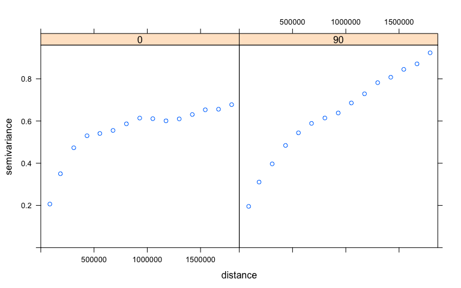 

We notice a slightly stronger spatial autocorrelation towards the east (90°).

To nicely depict the spatial pattern in the residuals, we can use `sp`'s `bubble` plot:

## Spatial residual map

```r
bubble(resids.spdf, maxsize=1.5)
```

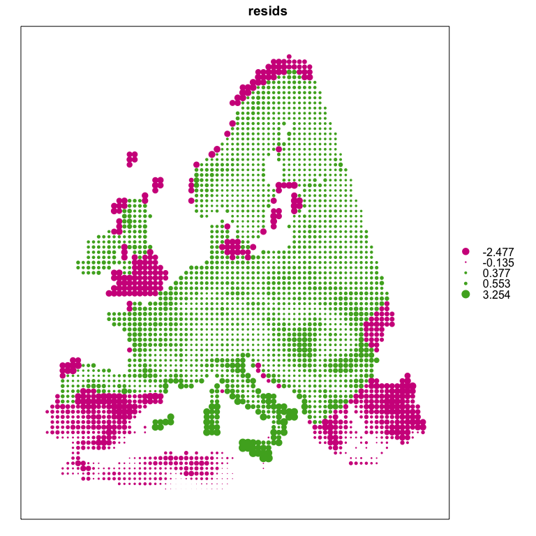 

In a dataset without residual spatial autocorrelation there would be no pattern, a nice mixture of colours. This is clearly **not** the case here, as we could already tell from correlogram and variogram.

Now, In my humble opinion, the most common causes of residual spatial autocorrelation is *model misspecification*, i.e. omitting important variables from the model or specifying the wrong functional form (e.g. no quadratic effect). Let's see whether this makes a difference here, by putting also in the interactions between predictors.


```r
fMM2 <- glm(martes_martes ~ poly(GDD, 2) + poly(PRE_YEAR, 2) + poly(WOOD, 2) + GDD*PRE_YEAR*WOOD, family=binomial, data=martes)
resids2 <- residuals(fMM2)
cor(resids, resids2) # highly correlated, so probabably little change
```

```
## [1] 0.9500467
```

```r
resids2.spdf <- SpatialPointsDataFrame(coords=cbind(martes$EOFORIGIN, martes$NOFORIGIN), data=data.frame(resids2))
plot(variogram(resids~1, data=resids2.spdf, alpha=c(0,90))) # no correlog, takes too long
```

 

```r
bubble(resids2.spdf, maxsize=1.5)
```

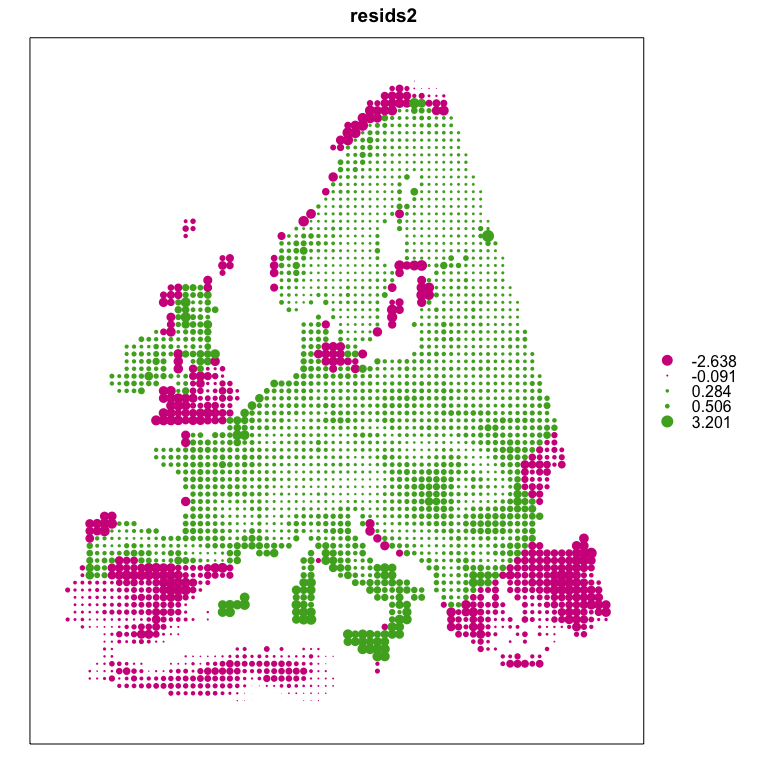 

This made little difference, we cannot reduce rSAC substantially, although the model is substantially better (AIC of `fMM` = 2219.2458543, AIC of `fMM2`= 2016.6409393). (Now there may be many other predictors missing, which will always be the case.) Instead of further complicating the fixed effects of the model, we shall 


```r
library(MASS)
fake <- as.factor(rep("a", nrow(martes)))
set.seed(2)
martes2 <- cbind(martes, fake)[sample(nrow(martes), 300),]
fglmmPQL <- glmmPQL(martes_martes ~ GDD*PRE_YEAR*WOOD, random=~1|fake, correlation=corExp(form=~EOFORIGIN+NOFORIGIN), family=binomial, data=martes2, control=list(maxIter=100))
```

```
## iteration 1
## iteration 2
## iteration 3
## iteration 4
## iteration 5
## iteration 6
## iteration 7
## iteration 8
## iteration 9
## iteration 10
```

```r
summary(fglmmPQL)
```

```
## Linear mixed-effects model fit by maximum likelihood
##  Data: martes2 
##   AIC BIC logLik
##    NA  NA     NA
## 
## Random effects:
##  Formula: ~1 | fake
##          (Intercept)  Residual
## StdDev: 0.0001514485 0.8466033
## 
## Correlation Structure: Exponential spatial correlation
##  Formula: ~EOFORIGIN + NOFORIGIN | fake 
##  Parameter estimate(s):
##    range 
## 389245.1 
## Variance function:
##  Structure: fixed weights
##  Formula: ~invwt 
## Fixed effects: martes_martes ~ GDD * PRE_YEAR * WOOD 
##                       Value Std.Error  DF    t-value p-value
## (Intercept)        3.624138 1.4937463 292  2.4262072  0.0159
## GDD               -0.000741 0.0004819 292 -1.5364983  0.1255
## PRE_YEAR          -0.001377 0.0013029 292 -1.0565219  0.2916
## WOOD               0.398192 0.2643055 292  1.5065585  0.1330
## GDD:PRE_YEAR       0.000000 0.0000005 292  0.4384001  0.6614
## GDD:WOOD          -0.000078 0.0000647 292 -1.2034781  0.2298
## PRE_YEAR:WOOD      0.000060 0.0003599 292  0.1677211  0.8669
## GDD:PRE_YEAR:WOOD  0.000000 0.0000001 292 -0.3584553  0.7203
##  Correlation: 
##                   (Intr) GDD    PRE_YEAR WOOD   GDD:PRE_YEAR GDD:WO
## GDD               -0.861                                           
## PRE_YEAR          -0.850  0.861                                    
## WOOD               0.605 -0.515 -0.636                             
## GDD:PRE_YEAR       0.682 -0.894 -0.870    0.420                    
## GDD:WOOD          -0.683  0.746  0.766   -0.874 -0.702             
## PRE_YEAR:WOOD     -0.414  0.411  0.603   -0.854 -0.440        0.808
## GDD:PRE_YEAR:WOOD  0.372 -0.495 -0.616    0.559  0.626       -0.769
##                   PRE_YEAR:
## GDD                        
## PRE_YEAR                   
## WOOD                       
## GDD:PRE_YEAR               
## GDD:WOOD                   
## PRE_YEAR:WOOD              
## GDD:PRE_YEAR:WOOD -0.827   
## 
## Standardized Within-Group Residuals:
##        Min         Q1        Med         Q3        Max 
## -2.6425316 -1.1804345  0.6051589  0.7600199  1.5495371 
## 
## Number of Observations: 300
## Number of Groups: 1
```

```r
resids2.spdf <- SpatialPointsDataFrame(coords=cbind(martes2$EOFORIGIN, martes2$NOFORIGIN), data=data.frame("resids"=residuals(fglmmPQL)))
plot(variogram(resids~1, data=resids2.spdf, alpha=c(0,90)))
```

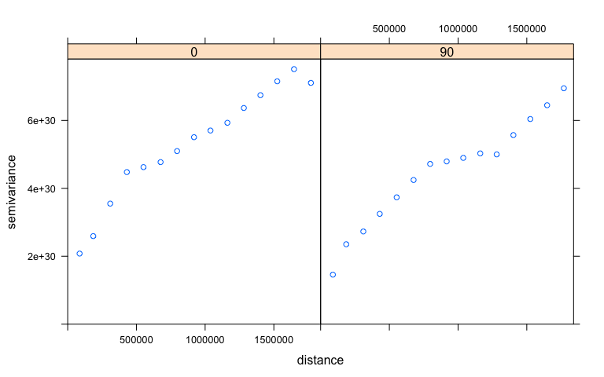 

```r
library(gridExtra)
```

```
## Loading required package: grid
```

```r
b1 <- bubble(resids.spdf, maxsize=1.5, main="non-spatial GLM")
b2 <- bubble(resids2.spdf, maxsize=1.5, main="spatial GLMM")
grid.arrange(b1, b2, ncol=2)
```

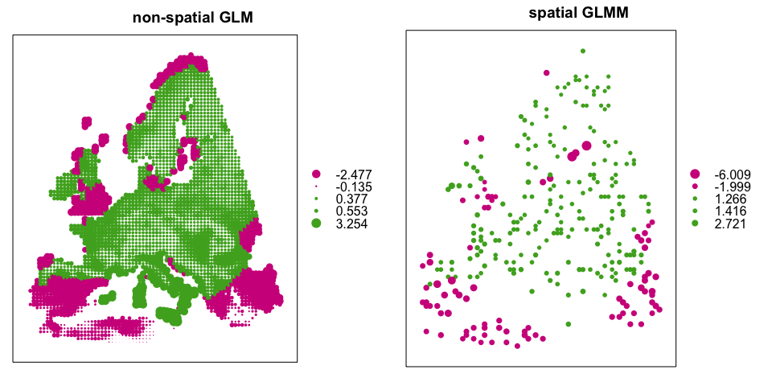 

Not very untypical, the residuals are only moderately improved compared to the non-spatial GLM. Often the improvement is greater when changing to a more flexible modelling approach (say, Boosted Regression Trees), again pointing towards model misspecification rather than biological processes as being the driver behind (some part of the) residual spatial autocorrelation.

Let's check whether the more flexible GAM can do better (if we have about an hour spare):


```r
fgamm <- gamm(martes_martes ~ s(GDD, k=3)+s(PRE_YEAR, k=3)+s(WOOD, k=3), random=list("fake"=~1), correlation=corGaus(form=~EOFORIGIN+NOFORIGIN), family=binomial, data=martes2, niterPQL=100, verbosePQL=T)
```

```
## 
##  Maximum number of PQL iterations:  100
```

```
## iteration 1
## iteration 2
## iteration 3
## iteration 4
## iteration 5
## iteration 6
## iteration 7
## iteration 8
```

```r
summary(fgamm$lme)
```

```
## Linear mixed-effects model fit by maximum likelihood
##  Data: data 
##        AIC      BIC   logLik
##   1217.248 1254.286 -598.624
## 
## Random effects:
##  Formula: ~Xr - 1 | g
##               Xr
## StdDev: 16.81156
## 
##  Formula: ~Xr.0 - 1 | g.0 %in% g
##               Xr.0
## StdDev: 0.01886933
## 
##  Formula: ~Xr.1 - 1 | g.1 %in% g.0 %in% g
##             Xr.1
## StdDev: 4.895147
## 
##  Formula: ~1 | fake %in% g.1 %in% g.0 %in% g
##          (Intercept)  Residual
## StdDev: 6.386462e-06 0.8588705
## 
## Correlation Structure: Gaussian spatial correlation
##  Formula: ~EOFORIGIN + NOFORIGIN | g/g.0/g.1/fake 
##  Parameter estimate(s):
##    range 
## 120274.7 
## Variance function:
##  Structure: fixed weights
##  Formula: ~invwt 
## Fixed effects: list(fixed) 
##                      Value Std.Error  DF   t-value p-value
## X(Intercept)     1.0822809 0.1942020 296  5.572966  0.0000
## Xs(GDD)Fx1       1.1212137 0.1926042 296  5.821336  0.0000
## Xs(PRE_YEAR)Fx1  0.1045540 0.1626421 296  0.642848  0.5208
## Xs(WOOD)Fx1     -0.2769515 0.1379380 296 -2.007797  0.0456
##  Correlation: 
##                 X(Int) X(GDD) X(PRE_
## Xs(GDD)Fx1       0.252              
## Xs(PRE_YEAR)Fx1  0.131  0.258       
## Xs(WOOD)Fx1     -0.053  0.163 -0.244
## 
## Standardized Within-Group Residuals:
##        Min         Q1        Med         Q3        Max 
## -3.6984306 -0.6231922  0.4321477  0.5778921  3.6156208 
## 
## Number of Observations: 300
## Number of Groups: 
##                             g                    g.0 %in% g 
##                             1                             1 
##           g.1 %in% g.0 %in% g fake %in% g.1 %in% g.0 %in% g 
##                             1                             1
```

```r
resids3.spdf <- SpatialPointsDataFrame(coords=cbind(martes2$EOFORIGIN, martes2$NOFORIGIN), data=data.frame("resids"=residuals(fgamm$gam)))
```


```r
vario1 <- variogram(resids~1, data=resids2.spdf, alpha=c(0))
vario2 <- variogram(resids~1, data=resids3.spdf, alpha=c(0))
plot(vario1$dist, vario1$gamma, cex=2, pch=15, type="b", las=1, ylab="semi-variance", xlab="distance [m]")
points(vario2$dist, vario2$gamma, pch=16, cex=2, type="b")
legend("topleft", pch=15:16, cex=2, bty="n", legend=c("GLMM", "GAMM"), lty=1)
```

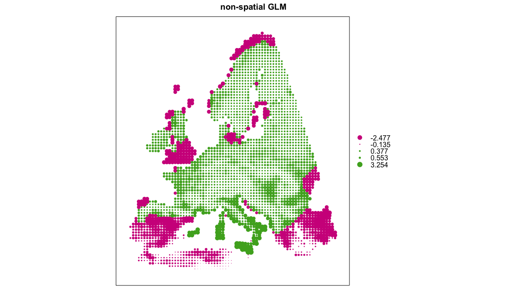 

There is a noticeable drop in spatial autocorrelation! So does that also indicate that the spatial pattern has changed? Let's see:


```r
b3 <- bubble(resids3.spdf, maxsize=1.5, main="spatial GAMM")
grid.arrange(b1, b2, b3, ncol=3)
```

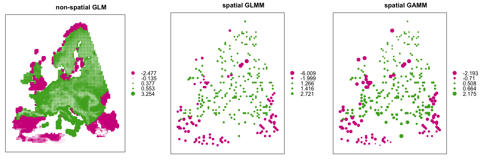 

The point should be clear: we can use a mixed model approach to compute a spatially parameterised variance-covariance matrix. This is typically **very** slow and not always entirely satisfactory. This is not the place to go into details about spatial models, it mainly served to illustrate the point of spatial dependence as an indication of mixed effect models.
