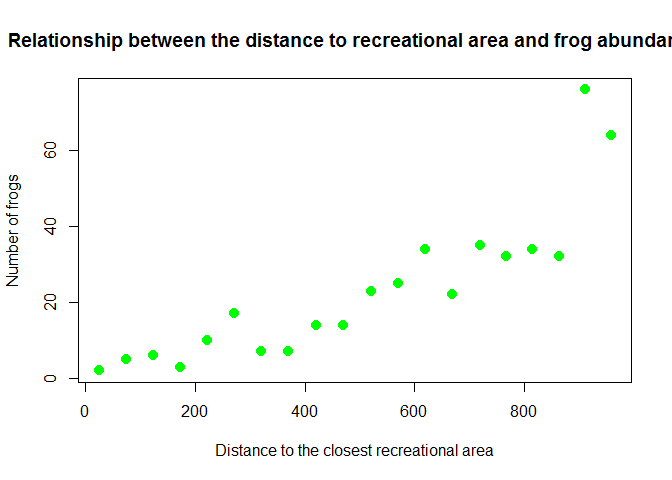
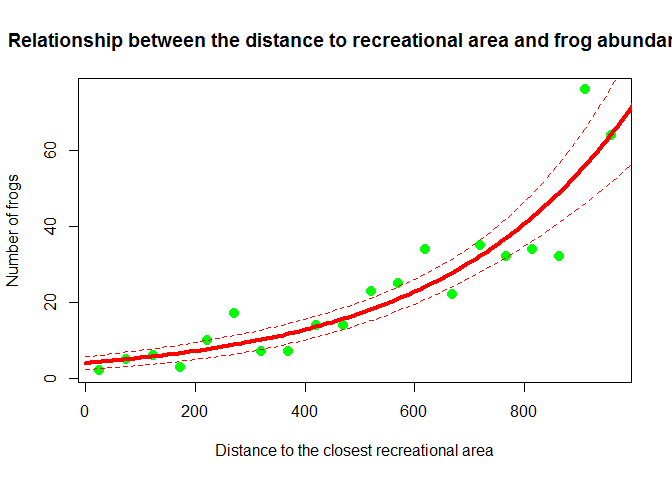
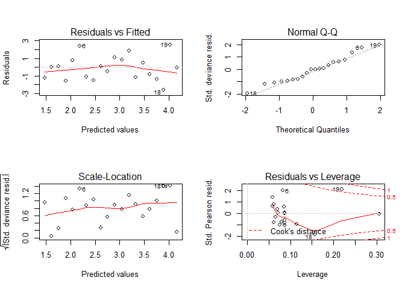

# NAME AND LAST NAME HERE
# Exercise # 1 - Frogs and human disturbance study
A researcher was keen to understand the effect of human disturbance on the abundance of 1 frog species in Spain (Iberian frogs Rana iberica).
The researcher collected data walking along 20 randomly selected transects along streams and ponds (length = 50m) and collected the following information:

frogs = number of frogs 
dist.recr = distance from the center of the transect to the closest recreational area, in meters (that is a proxy for human disturbance)
Here are the data resumed in 2 vectors:

```r
frogs = c(2,5,6,3,10,17,7,7,14,14,23,25,34,22,35,32,34,32,76,64)
dist.recr = c(25.214,74.179,124.080,173.885,223.130,272.089,321.511,370.401,420.477,470.176,520.328,570.669,619.342,669.151,718.762,766.833,815.155,863.224,910.411,957.578)
```
The researcher is aware that he has to collect confounding factors and likely information about water quality, but, prior to plan a massive data collection, he wants to understand preliminary if there is a pattern in the number of frogs depending on the distance to the closest recreational area. 
(i) Help the researcher running the analyses for him and fit the proper model to understand the effect of human disturbance on frog abundance. 
(ii) Plot predicted values with 95% Confidence intervals.
Make sure the researcher is able to understand your analyses and your preliminar results - provide short comments step by step so to justify your analyses and explain your final results. 


# Exercise # 1 - Answers

let's plot the relationship between the distance to the closest recreational area and the number of frogs counted along transects

```r
plot(dist.recr,frogs, xlab="Distance to the closest recreational area", ylab="Number of frogs", cex=2,pch=20, col="green", main="Relationship between the distance to recreational area and frog abundance") # plotting the relationship, y = frogs (response), x = dist.recr (predictor)
```

 

Let's fit a generalized linear model for count data (family = poisson)

```r
model1 = glm(frogs ~ dist.recr, family = poisson) #run a glm family poisson (response = count data)
summary(model1) # let's check the summary
```

```
## 
## Call:
## glm(formula = frogs ~ dist.recr, family = poisson)
## 
## Deviance Residuals: 
##      Min        1Q    Median        3Q       Max  
## -2.58290  -1.18785  -0.01624   0.80654   2.52505  
## 
## Coefficients:
##              Estimate Std. Error z value Pr(>|z|)    
## (Intercept) 1.3960518  0.1458905   9.569   <2e-16 ***
## dist.recr   0.0028892  0.0001975  14.625   <2e-16 ***
## ---
## Signif. codes:  0 '***' 0.001 '**' 0.01 '*' 0.05 '.' 0.1 ' ' 1
## 
## (Dispersion parameter for poisson family taken to be 1)
## 
##     Null deviance: 294.273  on 19  degrees of freedom
## Residual deviance:  36.911  on 18  degrees of freedom
## AIC: 132.99
## 
## Number of Fisher Scoring iterations: 4
```
Apparently, there is an increase of the number of frogs as the distance from the recreational area increases.
We need to check if the model is over dispersed.


```r
model1$deviance/model1$df.residual  # the dispersion parameter is estimated to be 2.05 
```

```
## [1] 2.050588
```

```r
# let's check if this overdispersion should worry us
1-pchisq(model1$deviance, model1$df.residual) # actually, p = 0.005, and we reject the null hypothesis. We need to be worried about overdispersion.
```

```
## [1] 0.005382852
```

```r
# as a double check, we can apply a proper overdispersion test

library(AER)
```

```
## Loading required package: car
## Loading required package: lmtest
## Loading required package: zoo
## 
## Attaching package: 'zoo'
## 
## The following objects are masked from 'package:base':
## 
##     as.Date, as.Date.numeric
## 
## Loading required package: sandwich
## Loading required package: survival
```

```r
dispersiontest(model1,trafo=1) 
```

```
## 
## 	Overdispersion test
## 
## data:  model1
## z = 1.7847, p-value = 0.03716
## alternative hypothesis: true alpha is greater than 0
## sample estimates:
##     alpha 
## 0.8859713
```

```r
# OK, there is an overdispersion problem here. Really mild overdispersion, but still, overdispersion is there. 
```

Estimates of model 1 are correct, although SEs need to be re-calculated taking into account of overdispersion.
Let's run a quasi-GLM 


```r
model2 = glm(frogs ~ dist.recr, family = quasipoisson)
summary(model2)
```

```
## 
## Call:
## glm(formula = frogs ~ dist.recr, family = quasipoisson)
## 
## Deviance Residuals: 
##      Min        1Q    Median        3Q       Max  
## -2.58290  -1.18785  -0.01624   0.80654   2.52505  
## 
## Coefficients:
##              Estimate Std. Error t value Pr(>|t|)    
## (Intercept) 1.3960518  0.2105394   6.631 3.18e-06 ***
## dist.recr   0.0028892  0.0002851  10.135 7.27e-09 ***
## ---
## Signif. codes:  0 '***' 0.001 '**' 0.01 '*' 0.05 '.' 0.1 ' ' 1
## 
## (Dispersion parameter for quasipoisson family taken to be 2.082632)
## 
##     Null deviance: 294.273  on 19  degrees of freedom
## Residual deviance:  36.911  on 18  degrees of freedom
## AIC: NA
## 
## Number of Fisher Scoring iterations: 4
```

After taking into account for overdispersion, we still have a significant pattern.
Let's sketch predictions


```r
plot(dist.recr,frogs, xlab="Distance to the closest recreational area", ylab="Number of frogs", cex=2,pch=20, col="green", main="Relationship between the distance to recreational area and frog abundance") # p

MyData = data.frame(dist.recr = seq(from = 0, to = 1000, by = 10))
G = predict(model2, newdata = MyData, type = "response", se = T)
F = G$fit
FSEUP = G$fit + 1.96*G$se.fit
FSELOW = G$fit - 1.96*G$se.fit
lines(MyData$dist.recr, F, lty = 1,col = 2,lwd = 4)
lines(MyData$dist.recr, FSEUP, lty = 2, col = 2)
lines(MyData$dist.recr, FSELOW,lty = 2, col = 2)
```

 

The number of frogs significantly decreases as we sample closer to recrational areas, suggesting a negative effect of human disturbance on frog abundance. Clearly, important predictors are missing (e.g., water quality, habitat type, other confounding factors) which are required prior to draw final conclusions (and avoid the Simpson paradox)

Last check about the assumptions in the GLM quasi-Poisson


```r
par(mfrow = c(2,2))
plot(model2)
```

 

```r
par(mfrow = c(1,1))
# clearly, these plots refer to the model diagnostic prior to back-transform the data. In simple words, the link function transforms the data, then the GLM fits the linear regression (and  estimates the slope). That means we are  fitting a linear model on data transformed by the link function, and here we check for the assumtpion of homogeneity and normality in a linear regression (gaussian) framework. Pretty all good here. In general, we have to worry if there are strong patterns in the residuals, meaning that we do not meet the assumption of homogeneity.
# refer to in-class discussion for more details.
```


