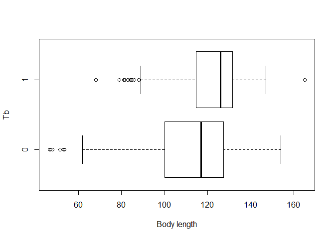
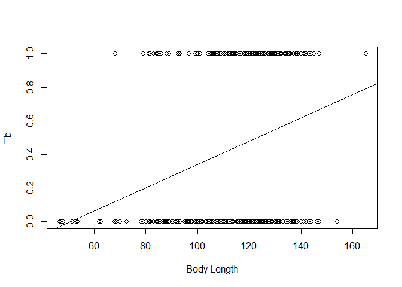
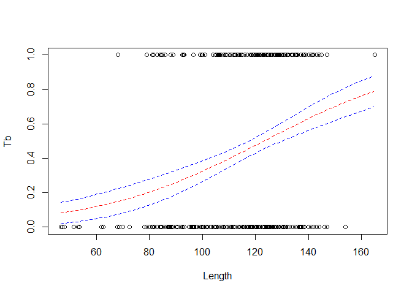
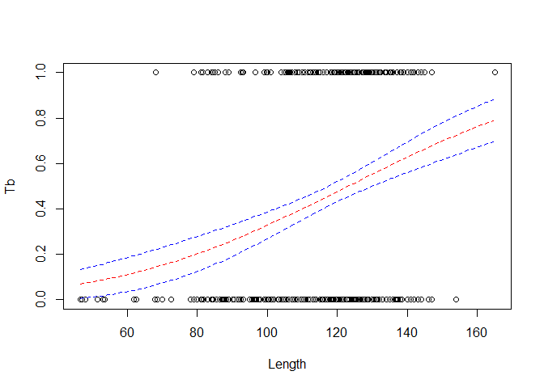
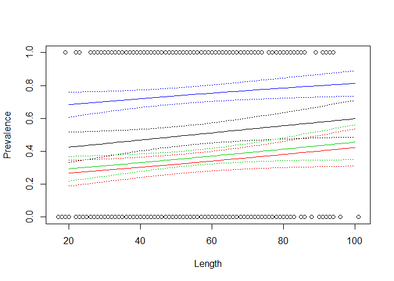
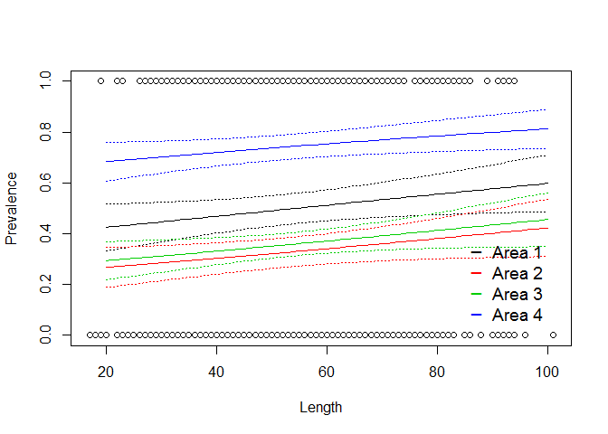
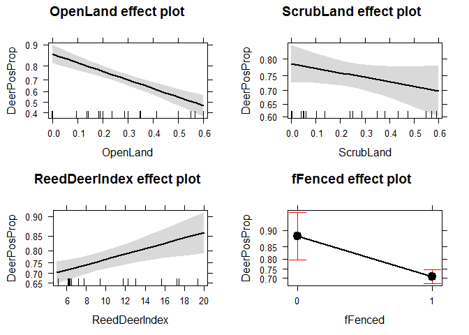
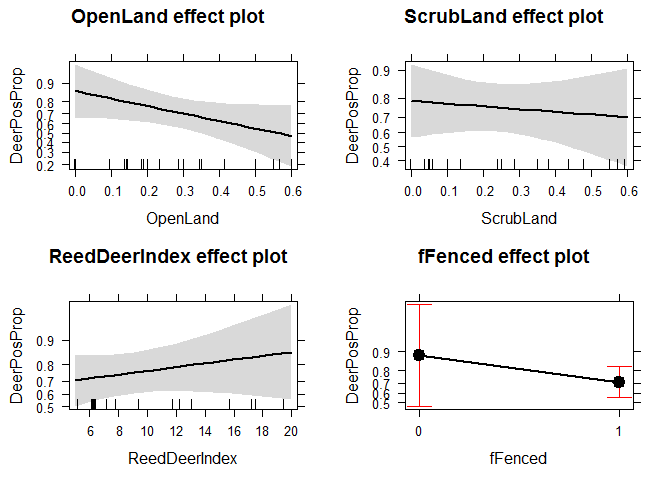
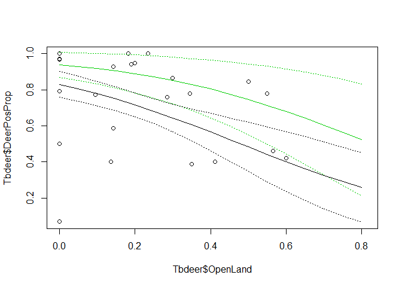

# GLM binomial

Presence / absence data - binary data.

Logistic regression is a method for fitting a regression curve, y = f(x), when y consists of proportions or probabilities, or binary coded (0,1--failure,success) data. When the response is a binary (dichotomous) variable, and x is numerical, logistic regression fits a logistic curve to the relationship between x and y. 


Assumptions
The true conditional probabilities are a logistic function of the independent variables.
No important variables are omitted.
No extraneous variables are included.
The independent variables are measured without error.
The observations are independent.
The independent variables are not linear combinations of each other.

##Example 1 - tubercolosis in Wild Boar

Wild boar with/without tubercolosis as a function of body lenght (age is collinear with length and we do not use it as predictor)

```r
#import wildboar data
setwd("~/TEACHING IN FREIBURG/11 - Statistics with R fall 2015/10_GLMs - Binomial and Quasi-Binomial")
load("Boar.RData")
head(Boar)
```

```
##   Tb SEX AgeClass LengthCT
## 1  0   1        1     46.5
## 2  0   2        1     47.0
## 3  0   1        1     48.0
## 4  0   1        1     51.5
## 5  0   2        1     53.0
## 6  0   2        1     53.0
```

```r
summary(Boar)
```

```
##        Tb              SEX           AgeClass       LengthCT    
##  Min.   :0.0000   Min.   :1.000   Min.   :1.00   Min.   : 46.5  
##  1st Qu.:0.0000   1st Qu.:1.000   1st Qu.:3.00   1st Qu.:106.5  
##  Median :0.0000   Median :2.000   Median :3.00   Median :121.5  
##  Mean   :0.4587   Mean   :1.583   Mean   :3.13   Mean   :117.0  
##  3rd Qu.:1.0000   3rd Qu.:2.000   3rd Qu.:4.00   3rd Qu.:130.0  
##  Max.   :1.0000   Max.   :2.000   Max.   :4.00   Max.   :165.0  
##                   NA's   :14
```

```r
cor(Boar[,c(3,4)])
```

```
##           AgeClass  LengthCT
## AgeClass 1.0000000 0.8910191
## LengthCT 0.8910191 1.0000000
```

A bit of data exploration

```r
attach(Boar)
boxplot(LengthCT ~ Tb, xlab = 'Body length', ylab = 'Tb', horizontal = T) #certainly, not the best way to show binomial data 
```

 

```r
plot(Boar$LengthCT, Boar$Tb, xlab = "Body Length", ylab = "Tb")

#just to get a feeling with what is going on with these data
B0 = lm(Tb ~ LengthCT, data = Boar)
abline(B0) 
```

 

```r
#wrong in principle, because we deal with probabilities here, while linear regression also predicts negative probabilities
```
We need a function that maps the values between 0 and 1
(e.g., logit link, probit link, clog-log link, log-log link).
the default is logit link


```r
B1 = glm(Tb ~ LengthCT, family = binomial, data = Boar) # logit link is the default
summary(B1)
```

```
## 
## Call:
## glm(formula = Tb ~ LengthCT, family = binomial, data = Boar)
## 
## Deviance Residuals: 
##     Min       1Q   Median       3Q      Max  
## -1.6095  -1.1200  -0.7089   1.1261   1.9515  
## 
## Coefficients:
##              Estimate Std. Error z value Pr(>|z|)    
## (Intercept) -3.892109   0.671152  -5.799 6.67e-09 ***
## LengthCT     0.031606   0.005588   5.656 1.55e-08 ***
## ---
## Signif. codes:  0 '***' 0.001 '**' 0.01 '*' 0.05 '.' 0.1 ' ' 1
## 
## (Dispersion parameter for binomial family taken to be 1)
## 
##     Null deviance: 700.76  on 507  degrees of freedom
## Residual deviance: 663.56  on 506  degrees of freedom
## AIC: 667.56
## 
## Number of Fisher Scoring iterations: 4
```

Probability that an animal is infected is:
p = (e^(-3.89 + 0.03 * length)) / (1 + e^( -3.89 + 0.03 * length))


```r
plot(Boar$LengthCT, Boar$Tb,xlab="Length", ylab="Tb")
MyData = data.frame(LengthCT = seq(46.5, 165, by = 1))
Pred = predict(B1,newdata = MyData, type = "response", se = T)
lines(MyData$LengthCT, Pred$fit ,col = 2,lty = 2)
lines(MyData$LengthCT, Pred$fit + (1.96 * Pred$se.fit),col = 4,lty = 2)
lines(MyData$LengthCT, Pred$fit - (1.96 * Pred$se.fit),col = 4,lty = 2)
```

 


other option (actually changing the link function)

```r
B1.A = glm(Tb ~ LengthCT, family = binomial(link = "probit"), data = Boar)
summary(B1.A)
```

```
## 
## Call:
## glm(formula = Tb ~ LengthCT, family = binomial(link = "probit"), 
##     data = Boar)
## 
## Deviance Residuals: 
##     Min       1Q   Median       3Q      Max  
## -1.6062  -1.1218  -0.7085   1.1270   1.9708  
## 
## Coefficients:
##              Estimate Std. Error z value Pr(>|z|)    
## (Intercept) -2.379150   0.395284  -6.019 1.76e-09 ***
## LengthCT     0.019325   0.003305   5.847 5.01e-09 ***
## ---
## Signif. codes:  0 '***' 0.001 '**' 0.01 '*' 0.05 '.' 0.1 ' ' 1
## 
## (Dispersion parameter for binomial family taken to be 1)
## 
##     Null deviance: 700.76  on 507  degrees of freedom
## Residual deviance: 663.58  on 506  degrees of freedom
## AIC: 667.58
## 
## Number of Fisher Scoring iterations: 4
```

```r
# logit and probit link assume that you have about the same number of zeros and ones
# clog-log is a good option if you have lots of zeros, or viceversa family = binomial(link="cloglog")

plot(Boar$LengthCT, Boar$Tb,xlab="Length", ylab="Tb")
MyData = data.frame(LengthCT = seq(46.5, 165, by = 1))
Pred = predict(B1.A,newdata = MyData, type = "response", se = T)
lines(MyData$LengthCT, Pred$fit ,col = 2,lty = 2)
lines(MyData$LengthCT, Pred$fit + (1.96 * Pred$se.fit),col = 4,lty = 2)
lines(MyData$LengthCT, Pred$fit - (1.96 * Pred$se.fit),col = 4,lty = 2)
```

 

Pseudo R Square

```r
#Null Deviance - residual Deviance / Null Deviance
((B1.A$null.deviance-B1.A$deviance)/B1.A$null.deviance)*100 #5% of total variability explained
```

```
## [1] 5.306524
```


##Example 2 - Parasites in cod (fish)


```r
ParasiteCod <- read.delim("ParasiteCod.txt")

head(ParasiteCod)
```

```
##   Sample Intensity Prevalence Year Depth Weight Length Sex Stage Age Area
## 1      1         0          0 1999   220    148     26   0     0   0    2
## 2      2         0          0 1999   220    144     26   0     0   0    2
## 3      3         0          0 1999   220    146     27   0     0   0    2
## 4      4         0          0 1999   220    138     26   0     0   0    2
## 5      5         0          0 1999   220     40     17   0     0   0    2
## 6      6         0          0 1999   220     68     20   0     0   0    2
```
Response variable: Prevalance 0 1
Explanatories: year, area, depth at which fish were caught
Depth and area are collinear; other explanatory are sex, length, weight, stage, age..all collinear except for sex


```r
ParasiteCod$fArea = factor(ParasiteCod$Area)

attach(ParasiteCod)
P1 = glm(Prevalence ~ fArea + Length,
               family = binomial, data = ParasiteCod)  

summary(P1)
```

```
## 
## Call:
## glm(formula = Prevalence ~ fArea + Length, family = binomial, 
##     data = ParasiteCod)
## 
## Deviance Residuals: 
##     Min       1Q   Median       3Q      Max  
## -1.8149  -0.9695  -0.8348   1.1573   1.6293  
## 
## Coefficients:
##              Estimate Std. Error z value Pr(>|z|)    
## (Intercept) -0.476947   0.263066  -1.813 0.069827 .  
## fArea2      -0.708339   0.181428  -3.904 9.45e-05 ***
## fArea3      -0.576006   0.159221  -3.618 0.000297 ***
## fArea4       1.070599   0.178388   6.002 1.95e-09 ***
## Length       0.008742   0.004342   2.013 0.044085 *  
## ---
## Signif. codes:  0 '***' 0.001 '**' 0.01 '*' 0.05 '.' 0.1 ' ' 1
## 
## (Dispersion parameter for binomial family taken to be 1)
## 
##     Null deviance: 1727.8  on 1247  degrees of freedom
## Residual deviance: 1592.0  on 1243  degrees of freedom
##   (6 observations deleted due to missingness)
## AIC: 1602
## 
## Number of Fisher Scoring iterations: 4
```

```r
plot(Length,Prevalence)

MyData = data.frame(Length = seq(from = 20, to = 100, by = 1), fArea="1")
Pred = predict(P1,newdata = MyData, type = "response", se = T)
lines(MyData$Length, Pred$fit, col = 1,lty = 1)
lines(MyData$Length, Pred$fit + (1.96 * Pred$se.fit), col = 1,lty = 3)
lines(MyData$Length, Pred$fit - (1.96 * Pred$se.fit), col = 1,lty = 3)


MyData = data.frame(Length = seq(from = 20, to = 100, by = 1), fArea="2")
Pred = predict(P1,newdata = MyData, type = "response", se = T)
lines(MyData$Length, Pred$fit, col = 2,lty = 1)
lines(MyData$Length, Pred$fit + (1.96 * Pred$se.fit), col = 2,lty = 3)
lines(MyData$Length, Pred$fit - (1.96 * Pred$se.fit), col = 2,lty = 3)


MyData = data.frame(Length = seq(from = 20, to = 100, by = 1), fArea="3")
Pred = predict(P1,newdata = MyData, type = "response", se = T)
lines(MyData$Length, Pred$fit, col = 3,lty = 1)
lines(MyData$Length, Pred$fit + (1.96 * Pred$se.fit), col = 3,lty = 3)
lines(MyData$Length, Pred$fit - (1.96 * Pred$se.fit), col = 3,lty = 3)


MyData = data.frame(Length = seq(from = 20, to = 100, by = 1), fArea="4")
Pred = predict(P1,newdata = MyData, type = "response", se = T)
lines(MyData$Length, Pred$fit, col = 4,lty = 1)
lines(MyData$Length, Pred$fit + (1.96 * Pred$se.fit), col = 4,lty = 3)
lines(MyData$Length, Pred$fit - (1.96 * Pred$se.fit), col = 4,lty = 3)
```

 

```r
# you can fix it with a loop, if you wish
AREA = 1:4
plot(Length,Prevalence)
for (i in AREA) {
  MyData = data.frame(Length = seq(from = 20, to = 100, by = 1), fArea = as.factor(i))
Pred = predict(P1,newdata = MyData, type = "response", se = T)
lines(MyData$Length, Pred$fit, col = i,lty = 1)
lines(MyData$Length, Pred$fit + (1.96 * Pred$se.fit), col = i,lty = 3)
lines(MyData$Length, Pred$fit - (1.96 * Pred$se.fit), col = i,lty = 3)
}

legend("bottomright", c("Area 1", "Area 2", "Area 3", "Area 4"), col = 1:4, title = "",
       bty="n", pch = rep("_", 4), inset = .04, cex = 1.2)
```

 


##Example 3 - Tubercolosis in deer, this time proportion data (ranging from 0 to 1)


```r
Tbdeer <- read.delim("Tbdeer.txt")
head(Tbdeer)
```

```
##   Farm BoarPosTB BoarSampledTB DeerPosTB DeerSampledTB DeerPosCervi
## 1    1         4            14        NA            NA           NA
## 2    2        20            34         3            13            6
## 3    3         2             5         0            23           28
## 4    4         8            13         1            39           39
## 5    5         7            23         0             6           13
## 6    6        11            20         2            36           19
##   DeerSampledCervi OpenLand ScrubLand PinePlantation QuercusPlants
## 1               NA    0.409     0.591          0.000         7.000
## 2               15    0.412     0.059          0.000        14.706
## 3               28    0.182     0.136          0.091         5.318
## 4               45    0.300     0.250          0.000        14.737
## 5               13    0.000     0.571          0.000         9.333
## 6               25    0.286     0.476          0.000        21.543
##   QuercusTrees WildBoarIndex ReedDeerIndex EstateSize Fenced
## 1        1.619         0.095         0.000        960      0
## 2        0.118         0.576        17.470       1100      1
## 3        4.045         0.450        19.412       2200      1
## 4        4.200         0.100         6.318       1700      1
## 5        0.952         0.000         4.364       4000      0
## 6        2.972         0.238         5.141      19328      0
```

```r
Tbdeer$DeerPosProp = Tbdeer$DeerPosCervi / Tbdeer$DeerSampledCervi  # proportion of deer infected

Tbdeer$fFenced = factor(Tbdeer$Fenced)
```


Effect of percentage open land, scrubs, pine plantation, number of quercus per unit area, red deer abundance index, estate size, estate fenced ON probability of getting infected


```r
Deer2 <- glm(DeerPosProp ~ OpenLand + ScrubLand + ReedDeerIndex + fFenced,
        family = binomial, weights = DeerSampledCervi, data = Tbdeer)

summary(Deer2)
```

```
## 
## Call:
## glm(formula = DeerPosProp ~ OpenLand + ScrubLand + ReedDeerIndex + 
##     fFenced, family = binomial, data = Tbdeer, weights = DeerSampledCervi)
## 
## Deviance Residuals: 
##     Min       1Q   Median       3Q      Max  
## -8.6520  -0.8267   0.5598   2.0565   3.8771  
## 
## Coefficients:
##               Estimate Std. Error z value Pr(>|z|)    
## (Intercept)    2.36349    0.36082   6.550 5.74e-11 ***
## OpenLand      -3.30559    0.54933  -6.018 1.77e-09 ***
## ScrubLand     -0.78095    0.52706  -1.482  0.13841    
## ReedDeerIndex  0.06294    0.02027   3.106  0.00190 ** 
## fFenced1      -1.14915    0.35816  -3.208  0.00133 ** 
## ---
## Signif. codes:  0 '***' 0.001 '**' 0.01 '*' 0.05 '.' 0.1 ' ' 1
## 
## (Dispersion parameter for binomial family taken to be 1)
## 
##     Null deviance: 235.58  on 23  degrees of freedom
## Residual deviance: 164.83  on 19  degrees of freedom
##   (8 observations deleted due to missingness)
## AIC: 233.92
## 
## Number of Fisher Scoring iterations: 4
```


This is a Binomial GLM with proportion data.
We can have overdispersion. 
Residual deviance / df should be ~1


```r
Deer2$deviance / Deer2$df.residual #~9
```

```
## [1] 8.675464
```

```r
library(effects)
plot(allEffects(Deer2))
```

 

we add a dispersion parameter to the variance of Y

```r
Deer3 <- glm(DeerPosProp ~ OpenLand + ScrubLand + ReedDeerIndex + fFenced,
             family = quasibinomial, weights = DeerSampledCervi, data = Tbdeer)
summary(Deer3)
```

```
## 
## Call:
## glm(formula = DeerPosProp ~ OpenLand + ScrubLand + ReedDeerIndex + 
##     fFenced, family = quasibinomial, data = Tbdeer, weights = DeerSampledCervi)
## 
## Deviance Residuals: 
##     Min       1Q   Median       3Q      Max  
## -8.6520  -0.8267   0.5598   2.0565   3.8771  
## 
## Coefficients:
##               Estimate Std. Error t value Pr(>|t|)  
## (Intercept)    2.36349    1.11328   2.123   0.0471 *
## OpenLand      -3.30559    1.69488  -1.950   0.0660 .
## ScrubLand     -0.78095    1.62617  -0.480   0.6365  
## ReedDeerIndex  0.06294    0.06253   1.007   0.3268  
## fFenced1      -1.14915    1.10505  -1.040   0.3114  
## ---
## Signif. codes:  0 '***' 0.001 '**' 0.01 '*' 0.05 '.' 0.1 ' ' 1
## 
## (Dispersion parameter for quasibinomial family taken to be 9.51958)
## 
##     Null deviance: 235.58  on 23  degrees of freedom
## Residual deviance: 164.83  on 19  degrees of freedom
##   (8 observations deleted due to missingness)
## AIC: NA
## 
## Number of Fisher Scoring iterations: 4
```

```r
Deer3$deviance / Deer3$df.residual
```

```
## [1] 8.675464
```

```r
plot(allEffects(Deer3))
```

 

We have lost many of the significant patterns that were biased by overdispersion.
The new results are pretty different.


```r
plot(Tbdeer$OpenLand, Tbdeer$DeerPosProp)

MyData = data.frame(OpenLand = seq (min(Tbdeer$OpenLand), max(Tbdeer$OpenLand), 0.05),
                    ScrubLand = mean(Tbdeer$ScrubLand), ReedDeerIndex = mean(Tbdeer$ReedDeerIndex), fFenced = "0") # scenario no-fenced
Pred = predict(Deer3,newdata = MyData, type = "response", se = T)
lines(MyData$OpenLand, Pred$fit, col = 3,lty = 1)
lines(MyData$OpenLand, Pred$fit + Pred$se.fit, col = 3,lty = 3)
lines(MyData$OpenLand, Pred$fit - Pred$se.fit, col = 3,lty = 3)


MyData = data.frame(OpenLand = seq (min(Tbdeer$OpenLand), max(Tbdeer$OpenLand), 0.05),
                    ScrubLand = mean(Tbdeer$ScrubLand), ReedDeerIndex = mean(Tbdeer$ReedDeerIndex), fFenced = "1") # scenario yes-fenced
Pred = predict(Deer3,newdata = MyData, type = "response", se = T)
lines(MyData$OpenLand, Pred$fit, col = 1,lty = 1)
lines(MyData$OpenLand, Pred$fit + Pred$se.fit, col = 1,lty = 3)
lines(MyData$OpenLand, Pred$fit - Pred$se.fit, col = 1,lty = 3)
```

 

-> IN-class discussion about diagnostics in GLM binomial and model evaluation.

+++++++++++++++++
Edited by Simone Ciuti, University of Freiburg, 27/10/2015; 
Intended for the only purpose of teaching @ Freiburg University; 
Sources: Mick Crawley, R book, 2nd edition; Simone Ciuti, simulated data.; Mike Marin Stat, University of British Columbia; quick-R; 
Zuur, Ieno, Walker, Saveliev and Smith 2009 Mixed Effects Models and Extensions in Ecology with R.
+++++++++++++++++++++++++++++++++++++++++++++++++

