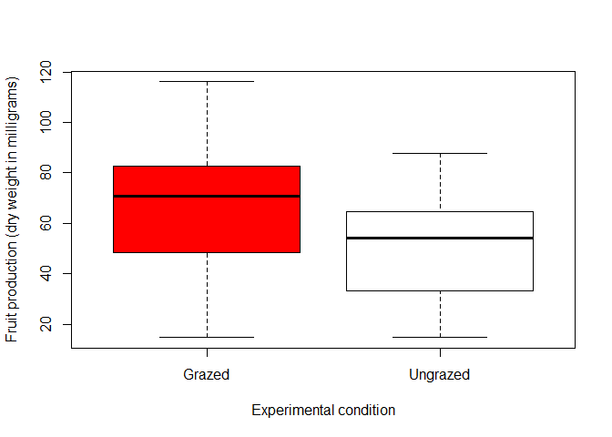
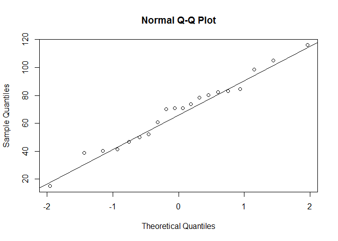
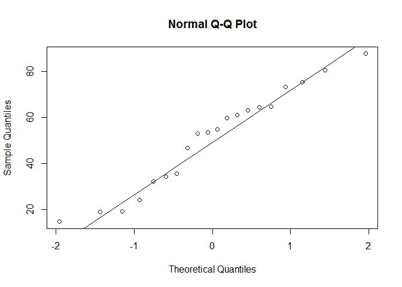
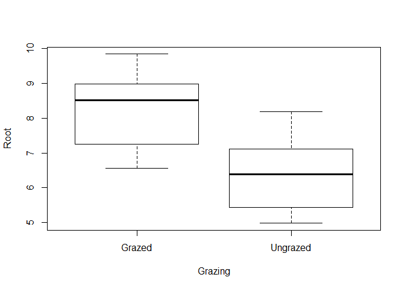
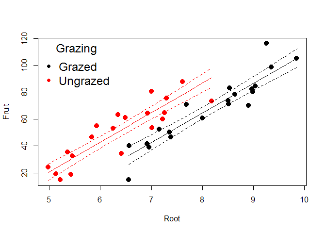
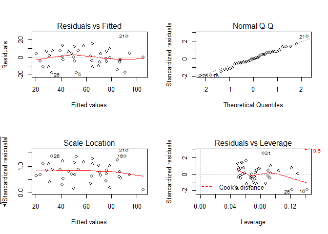

# The Simpson Paradox - an example

As we discussed in class already (i.e., dataset on lung capacity: models predicting LungCap depending on Smoke habits, and eventually getting opposite estimates of the effect of smoke depending on whether we included confounding factors or not), here we deal with another example of the Simpson paradox.

To learn more about the Simpson paradox, see https://en.wikipedia.org/wiki/Simpson%27s_paradox


# Example 1 - part I.

Load the dataset (regrowth1A)

```r
setwd("~/TEACHING IN FREIBURG/11 - Statistics with R fall 2015/11_the Simpson paradox")
regrowth = read.delim("regrowth1A.txt")
head(regrowth)
```

```
##   Fruit  Grazing
## 1 59.77 Ungrazed
## 2 60.98 Ungrazed
## 3 14.73 Ungrazed
## 4 19.28 Ungrazed
## 5 34.25 Ungrazed
## 6 35.53 Ungrazed
```

Experiment details:
Our worked example concerns an experiment on the impact of grazing on the fruit production of a biennial plant. 
Forty plants were allocated to two treatments, grazed and ungrazed, and the grazed plants were exposed to rabbits during the first two weeks of stem elongation. They were then protected from subsequent grazing by the erection of a fence and allowed to regrow. At the end of the growing season, the fruit production (dry weight in milligrams) was recorded on each of the 40 plants.
Two columns in the dataset:
Grazing: 2 levels (Grazed, with rabbits), (Ungrazed, no rabbits)
Fruit: weight of fruits produced by the plant (dry weight in milligrams)

Question 1. Identify the predictor (independent variable) and the response variable. Make a plot to visualize the relationship between these two variables.

```r
attach(regrowth)
plot(Fruit ~ Grazing, col = c("red", "white"), ylab = "Fruit production (dry weight in milligrams)", xlab = "Experimental condition") #Grazing: categorical predictor; Fruit: response variable (numeric, continuous)
```

 

Question 2. Run a proper statistical procedure to disentangle the effect of the indipendent variable on the response.


```r
# clearly, these 2 samples are independent. We need to fit a t-test for 2-independent samples (parametric procedure), unless we do not meet test's assumptions (then we would switch to a non-parametric procedure if needed)

# check for normality assumption
shapiro.test(Fruit[Grazing == "Grazed"]); qqnorm(Fruit[Grazing == "Grazed"]) ; qqline(Fruit[Grazing == "Grazed"])
```

```
## 
## 	Shapiro-Wilk normality test
## 
## data:  Fruit[Grazing == "Grazed"]
## W = 0.97951, p-value = 0.9276
```

 

```r
shapiro.test(Fruit[Grazing == "Ungrazed"]); qqnorm(Fruit[Grazing == "Ungrazed"]) ; qqline(Fruit[Grazing == "Ungrazed"])
```

```
## 
## 	Shapiro-Wilk normality test
## 
## data:  Fruit[Grazing == "Ungrazed"]
## W = 0.95372, p-value = 0.4272
```

```r
# all good normality-wise

#How about homogeneity?
library(car)
```

 

```r
leveneTest(Fruit ~ Grazing) #all good here as weel
```

```
## Levene's Test for Homogeneity of Variance (center = median)
##       Df F value Pr(>F)
## group  1  0.1467 0.7039
##       38
```

```r
# we now are allowed to run the t-test
t.test(Fruit ~ Grazing, var.eq = TRUE, paired = F)
```

```
## 
## 	Two Sample t-test
## 
## data:  Fruit by Grazing
## t = 2.304, df = 38, p-value = 0.02678
## alternative hypothesis: true difference in means is not equal to 0
## 95 percent confidence interval:
##   2.070631 32.049369
## sample estimates:
##   mean in group Grazed mean in group Ungrazed 
##                67.9405                50.8805
```

```r
detach(regrowth)
```

Question 3. How do you interpret the results you just obtained?

```r
# The effect of Grazing on Fruit production results to be significant. This is incredible, because Grazed plants actually produce more Fruit!!!!! 
# it is tough to believe that plants that were heavily grazed during stem elongation would end up producing more fruit! 
# this clearly is an example of the Simpson paradox (UNLESS YOU INCLUDE ALL POTENTIAL CONFOUNDING FACTORS AND YOU STILL FIND THE SAME PATTERN, THEN YOU WOULD NEED TO UNDERSTAND THE MECHANISM BEHIND THE FACILITATION OF GRAZERS ON PLANT FRUIT PRODUCTION!)
```


#Example 1 - part II.

Well. Let's say that we collected a confounding factor in this experiment.
Because initial plant size was thought likely to influence fruit production, the diameter of the top of the rootstock was measured before each plant was potted up.
Root: diameter of the rootstock right before the beginning of the experiment
Now load the proper dataset with the full experiment.

Load the dataset (regrowth1A)

```r
setwd("~/TEACHING IN FREIBURG/11 - Statistics with R fall 2015/11_the Simpson paradox")
regrowth = read.delim("regrowth1B.txt")
head(regrowth)
```

```
##    Root Fruit  Grazing
## 1 7.225 59.77 Ungrazed
## 2 6.487 60.98 Ungrazed
## 3 5.219 14.73 Ungrazed
## 4 5.130 19.28 Ungrazed
## 5 6.417 34.25 Ungrazed
## 6 5.359 35.53 Ungrazed
```

```r
attach(regrowth)
```

Question 1. 
You now have Root, Fruit, and Grazing. What affects what?

```r
#Grazing (independent) is expected to affect Fruit production (dependent), while taking into account of root size (independent, confounding factor).
```

Question 2. 
Fit a proper statistical procedure which takes the structure Y ~ x1 + x2, where Y is the response (dependent) variable, x1 and x2 are the independent predictors.
Plot the predictions of the model without using the effects library


```r
# let's check whether the 2 predictors are collinear
cor(as.numeric(Grazing), Root)  # definitely a very strong correlation. This means that the experiment has been very badly managed (!), with large plants in the plot where grazers were allowed, and small plants where grazers were not allowed.
```

```
## [1] -0.6870574
```

```r
plot(Root ~ Grazing) # larger plants are those that were allowed to be grazed!
```

 

```r
# we are below the 0.7 threshold for collinearity. In this specific case, better including a potentially collinear predictor than omitting a critical confounding factor(!)

model1 = lm(Fruit ~ Grazing + Root)
summary(model1)
```

```
## 
## Call:
## lm(formula = Fruit ~ Grazing + Root)
## 
## Residuals:
##      Min       1Q   Median       3Q      Max 
## -17.8443  -5.0245  -0.0667   6.8149  24.0588 
## 
## Coefficients:
##                 Estimate Std. Error t value Pr(>|t|)    
## (Intercept)     -111.029     13.632  -8.145 8.98e-10 ***
## GrazingUngrazed   22.191      4.294   5.168 8.39e-06 ***
## Root              21.941      1.649  13.304 1.13e-15 ***
## ---
## Signif. codes:  0 '***' 0.001 '**' 0.01 '*' 0.05 '.' 0.1 ' ' 1
## 
## Residual standard error: 9.867 on 37 degrees of freedom
## Multiple R-squared:  0.8483,	Adjusted R-squared:  0.8401 
## F-statistic: 103.4 on 2 and 37 DF,  p-value: 7.055e-16
```

```r
# Here it comes. The Simpson paradox. By including the confounding factor, then Ungrazed plants eventually produce more fruit! Let's plot it

plot(Root,Fruit, col = Grazing, pch = 20, cex = 2)

table(Grazing, Root) #to understand the variability of Root depending on Grazing, and predict accordingly
```

```
##           Root
## Grazing    4.975 5.13 5.219 5.359 5.426 5.451 5.836 5.928 6.248 6.352
##   Grazed       0    0     0     0     0     0     0     0     0     0
##   Ungrazed     1    1     1     1     1     1     1     1     1     1
##           Root
## Grazing    6.417 6.487 6.555 6.566 6.916 6.93 6.958 7.001 7.013 7.158
##   Grazed       0     0     1     1     1    0     1     0     0     1
##   Ungrazed     1     1     0     0     0    1     0     1     1     0
##           Root
## Grazing    7.225 7.264 7.302 7.354 7.382 7.614 7.691 8.001 8.181 8.508
##   Grazed       0     0     0     1     1     0     1     1     0     1
##   Ungrazed     1     1     1     0     0     1     0     0     1     0
##           Root
## Grazing    8.515 8.53 8.643 8.91 8.975 8.988 9.039 9.253 9.351 9.844
##   Grazed       1    1     1    1     1     1     1     1     1     1
##   Ungrazed     0    0     0    0     0     0     0     0     0     0
```

```r
#predict the scenario for Grazed plants
mydata = data.frame(Root = seq(6.555, 9.884, 0.1), Grazing = "Grazed")
pred1 = predict(model1, mydata, type = "response", se = T)
myfit1 = pred1$fit
myfit1CIup = pred1$fit + 1.96*pred1$se.fit
myfit1CIdown = pred1$fit - 1.96*pred1$se.fit
lines(mydata$Root, myfit1, col = "black")
lines(mydata$Root, myfit1CIup, col = "black", lty = 2)
lines(mydata$Root, myfit1CIdown, col = "black", lty = 2)

#predict the scenario for Ungrazed plants
mydata = data.frame(Root = seq(4.975, 8.181, 0.1), Grazing = "Ungrazed")
pred1 = predict(model1, mydata, type = "response", se = T)
myfit1 = pred1$fit
myfit1CIup = pred1$fit + 1.96*pred1$se.fit
myfit1CIdown = pred1$fit - 1.96*pred1$se.fit
lines(mydata$Root, myfit1, col = "red")
lines(mydata$Root, myfit1CIup, col = "red", lty = 2)
lines(mydata$Root, myfit1CIdown, col = "red", lty = 2)

legend("topleft", c("Grazed", "Ungrazed"), col = c("black", "red"), title = "Grazing",
       bty = "n", pch = c(20, 20), cex = 1.5)
```

 


```r
par(mfrow = c(2, 2))
plot(model1)
```

 

```r
par(mfrow = c(1, 1))
```


Simone Ciuti, Uni Freiburg. 29.10.2015. Dataset (modified) taken from Mick Crawley, The R Book, Second Edition.


