# Model complexity and selection

## Switching from simple models to more complex model structures.

### Interaction and non-linear terms in regressions.


```r
load("elk_data.RData")
head(elk_data)
```

```
##   dist_roads NDVI ruggedness  dem presence habitat
## 1    1213.42 7022    26.6271 1652        1    open
## 2    1282.65 7012    29.9333 1698        1  forest
## 3    1083.74 5500    11.4018 1791        1    open
## 4    1320.34 6391    16.1555 1771        1    open
## 5    1116.47 5463    10.6301 1786        1    open
## 6    1106.35 6726    31.6702 1808        1    open
```
Where:
Dist_roads: distance to the closed road in meters.
NDVI: normalized differenced vegetation index (proxy for vegetation productivity) (range 0 - 10000, where 10000 is the max productivity).
Ruggedness: terrain ruggedness index (in meters).
Dem: digital elevation model (in meters).
Presence: elk scats found (presence) or not found (absence) in randomly selected sampling points [1 m2]. 
Habitat: open (canopy cover < 25%), forest (canopy cover > 25%).

Our response is binary (1/0, presence/absence), our predictors are both numerical and categoricals.
Let's start with few single models to better understand the use of quadratic effects and interactions.


```r
m1 = glm(presence ~ dem + I(dem^2), family = binomial, data = elk_data)

#plotting predictions with the effects library
library(effects)
myplot = effect("dem", m1)
plot(myplot)
```

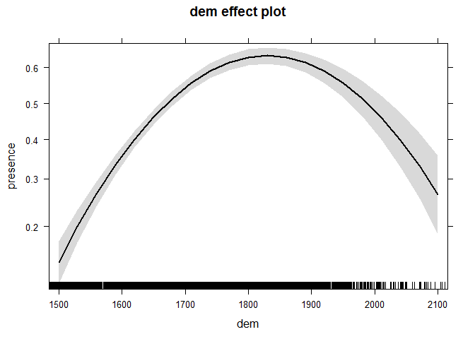 

```r
#plotting manually..
newdata = data.frame(dem = seq (min(elk_data$dem), max(elk_data$dem), 10))
preds = predict(m1, newdata, se = T, type = "response")
plot(newdata$dem, preds$fit, col = "red", ylab = "presence", xlab = "DEM", type = "l")
lines(newdata$dem, preds$fit + 1.96 * preds$se.fit, col = "red", lty = 3)
lines(newdata$dem, preds$fit - 1.96 * preds$se.fit, col = "red", lty = 3)
```

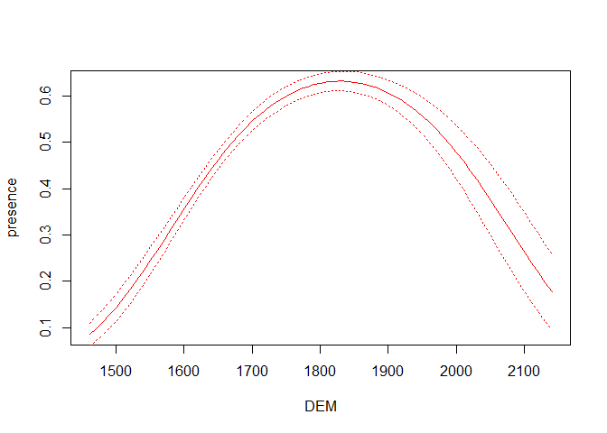 

Let's include another predictor along its quadratic effect. 


```r
m2 = glm(presence ~ dist_roads + I(dist_roads ^2) + ruggedness + I(ruggedness^2) , family = binomial, data = elk_data)

#plotting predictions with the effects library
myplot = effect("dist_roads", m2)
plot(myplot)
```

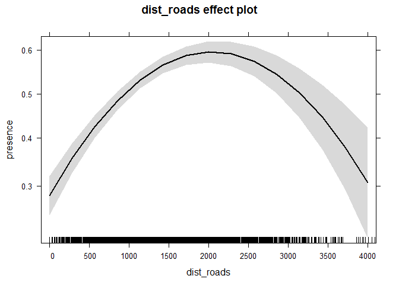 

```r
myplot = effect("ruggedness", m2)
plot(myplot)
```

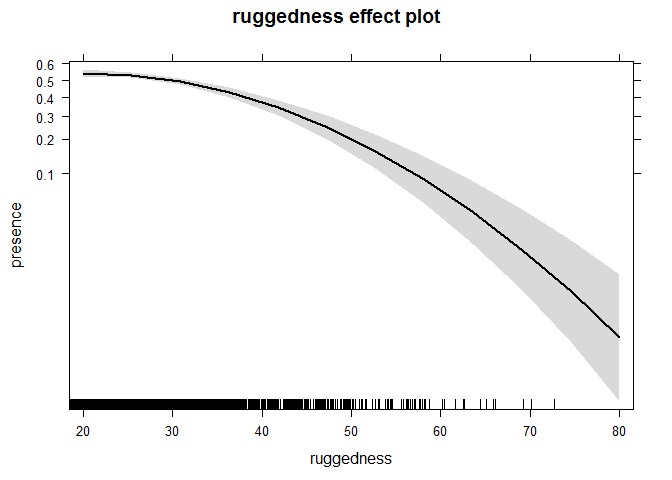 

```r
#plotting manually.. scenario with mean value of dist_roads
newdata = data.frame(ruggedness = seq (min(elk_data$ruggedness), max(elk_data$ruggedness), 10), dist_roads = mean(elk_data$dist_roads))
preds = predict(m2, newdata, se = T, type = "response")
plot(newdata$ruggedness, preds$fit, col = "red", ylab = "presence", xlab = "ruggedness", type = "l", ylim = c(0, 1))
lines(newdata$ruggedness, preds$fit + 1.96 * preds$se.fit, col = "red", lty = 3)
lines(newdata$ruggedness, preds$fit - 1.96 * preds$se.fit, col = "red", lty = 3)
```

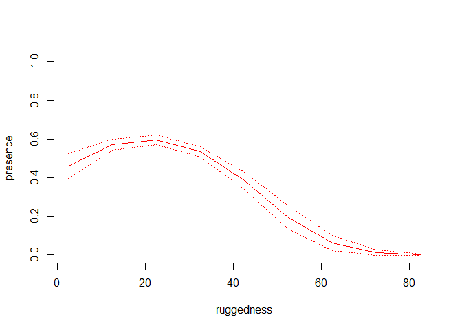 

However, we may expect that animals select steeper terrain when close to roads (antipredator strategy against humans), and flatter terrain when far from roads. This implies an interaction between distance to road and terrain ruggedness


```r
m4 = glm(presence ~ dist_roads + I(dist_roads ^2) + ruggedness + I(ruggedness^2) + dist_roads * ruggedness, family = binomial, data = elk_data)

myplot = effect("dist_roads * ruggedness", m4)
plot(myplot)
```

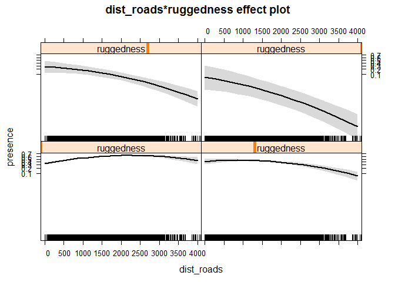 

```r
# plotting manually produces much nicer plots. 
summary(elk_data$dist_roads)
```

```
##    Min. 1st Qu.  Median    Mean 3rd Qu.    Max. 
##     0.0   603.6  1210.0  1282.0  1864.0  4090.0
```

```r
# let's create scenarios for the min, median, and the max value of dist from road, respectively.

#plotting manually. Min dist from roads
newdata = data.frame(ruggedness = seq (min(elk_data$ruggedness), max(elk_data$ruggedness), 10), dist_roads = min(elk_data$dist_roads))
preds = predict(m4, newdata, se = T, type = "response")
plot(newdata$ruggedness, preds$fit, col = "red", ylab = "presence", xlab = "ruggedness", type = "l", ylim = c(0, 1))
lines(newdata$ruggedness, preds$fit + 1.96 * preds$se.fit, col = "red", lty = 3)
lines(newdata$ruggedness, preds$fit - 1.96 * preds$se.fit, col = "red", lty = 3)

#adding scenario when dist from road is at median level
newdata = data.frame(ruggedness = seq (min(elk_data$ruggedness), max(elk_data$ruggedness), 10), dist_roads = median(elk_data$dist_roads))
preds = predict(m4, newdata, se = T, type = "response")
lines(newdata$ruggedness, preds$fit, col = "black")
lines(newdata$ruggedness, preds$fit + 1.96 * preds$se.fit, col = "black", lty = 3)
lines(newdata$ruggedness, preds$fit - 1.96 * preds$se.fit, col = "black", lty = 3)

#adding scenario when dist from road is at max level
newdata = data.frame(ruggedness = seq (min(elk_data$ruggedness), max(elk_data$ruggedness), 10), dist_roads = max(elk_data$dist_roads))
preds = predict(m4, newdata, se = T, type = "response")
lines(newdata$ruggedness, preds$fit, col = "blue")
lines(newdata$ruggedness, preds$fit + 1.96 * preds$se.fit, col = "blue", lty = 3)
lines(newdata$ruggedness, preds$fit - 1.96 * preds$se.fit, col = "blue", lty = 3)

legend("topright", pch = rep("_", 3), col = c("red", "black", "blue"), legend = c("min", "median", "max"), title = "Distance from roads" , cex = 0.9, bty = "n")
```

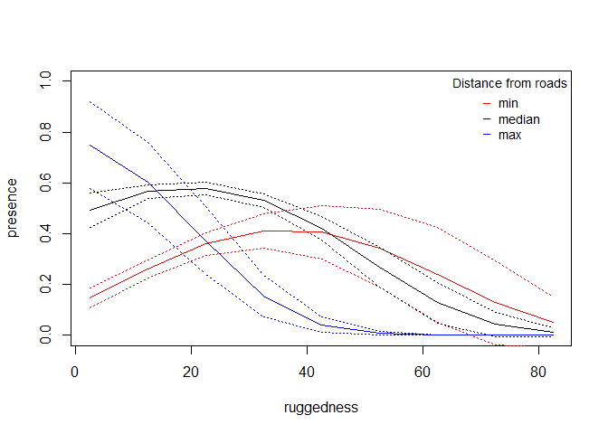 

```r
#Clearly, the selection for rugged terrain is not always the same, but it changes depending on the distance from roads. This is a classical example of interaction between two numerical predictors.
```

Let's see an example with a categorical predictor involved in an interaction.


```r
m5 = glm(presence ~ ruggedness + I(ruggedness ^2) + ruggedness * habitat + dist_roads + I(dist_roads ^2), family = binomial, data = elk_data)

myplot = effect("ruggedness * habitat", m5)
plot(myplot)
```

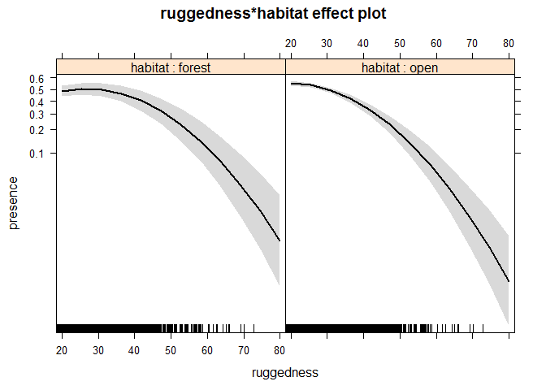 

```r
#plotting manually. OPEN habitat
newdata = data.frame(ruggedness = seq (min(elk_data$ruggedness), max(elk_data$ruggedness), 10), habitat = "open", dist_roads = mean(elk_data$dist_roads))
preds = predict(m5, newdata, se = T, type = "response")
plot(newdata$ruggedness, preds$fit, col = "red", ylab = "presence", xlab = "ruggedness", type = "l", ylim = c(0, 1))
lines(newdata$ruggedness, preds$fit + 1.96 * preds$se.fit, col = "red", lty = 3)
lines(newdata$ruggedness, preds$fit - 1.96 * preds$se.fit, col = "red", lty = 3)

#adding scenario within FOREST
newdata = data.frame(ruggedness = seq (min(elk_data$ruggedness), max(elk_data$ruggedness), 10), habitat = "forest", dist_roads = mean(elk_data$dist_roads))
preds = predict(m5, newdata, se = T, type = "response")
lines(newdata$ruggedness, preds$fit, col = "blue")
lines(newdata$ruggedness, preds$fit + 1.96 * preds$se.fit, col = "blue", lty = 3)
lines(newdata$ruggedness, preds$fit - 1.96 * preds$se.fit, col = "blue", lty = 3)

legend("topright", pch = rep("_", 2), col = c("red", "blue"), legend = c("open", "forest"), title = "Habitat" , cex = 1.2, bty = "n")
```

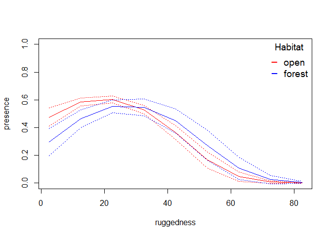 

Refer to in-class discussion for more details on how and whether including quadratic effects as interaction terms. 


## A short (but useful) tutorial on stat modelling, including model selection.

STEP 1: think! Causation? Research question?
We deal here with the elk_data introduced earlier in this tutorial.
The presence of elk signs (response variable, binary) is expected to be affected by a number of independent variables (e.g., elevation, environmental characteristics ecc.)

STEP 2: collinearity check.


```r
source("collinearity check.r")  #loading useful functions

#bind together the column of interest
attach(elk_data)
Z = cbind(presence, dist_roads, NDVI, ruggedness, dem, as.numeric(habitat))

pairs(Z, lower.panel = panel.smooth2,
      upper.panel = panel.cor, diag.panel = panel.hist)
```

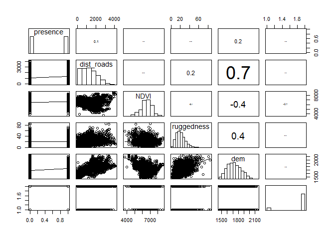 

```r
detach(elk_data)
corvif(Z[,-1])
```

```
## 
## 
## Variance inflation factors
## 
##                GVIF
## dist_roads 2.170935
## NDVI       1.463874
## ruggedness 1.160386
## dem        2.900574
## V5         1.022735
```

```r
# dist from roads and dem are collinear; we retain the distance from roads that is a proxy of human disturbancee and discard elevation.  
```

STEP 3: picking the proper model class.
Here we clearly need a GLM, family = binomial.

STEP 4: model structure. 


```r
m1 = glm(presence ~ dist_roads + I(dist_roads^2) + NDVI + I(NDVI^2) + ruggedness + I(ruggedness^2) + habitat + dist_roads * NDVI + dist_roads * ruggedness + dist_roads * habitat + NDVI * habitat + ruggedness * habitat, data = elk_data, family = binomial)

# we included all fixed effects (but not dem becasue collinear with distance from roads), quadratic effects, and five 2-way interactions based on our expectations. 
```


STEP 5. Model selection procedures.

Option 1. The MuMIn package
Model selection based on AIC. The Akaike information criterion (AIC) is a measure of the relative quality of statistical models for a given set of data. Given a collection of models for the data, AIC estimates the quality of each model, relative to each of the other models. Hence, AIC provides a means for model selection

AIC = 2k - 2 ln(L)
k = number of estimated parameters in the model 
ln(L) =  the maximum likelihood estimate for the model (L)

The likelihood function, denoted L(B), is the product of the probability density functions (or probability mass functions for discrete distributions) evaluated at the observed data values. Given the observed data, maximum likelihood estimation seeks to find values for the parameters, B, that maximize L(B).
Rather than maximize the likelihood function L(B), it is more convenient to work with the negative of the natural logarithm of the likelihood function, -Log L(B). The problem of maximizing L(B) is reformulated as a minimization problem where you seek to minimize -LogLikelihood = -Log L(B). Therefore, smaller values of -LogLikelihood (or -2LogLikelihood) indicate better model fits.


```r
library(MuMIn)
#options(na.action = "na.fail")   #  prevent fitting models to different datasets (WE CANNOT COMPARE AIC VALUES BETWEEN MODELS FIT WITH DIFFERENT SAMPLE SIZE DUE TO NOT AVAILABLE DATA)

#mydredge = dredge(m1)  # it runs all possible combinations of model m1. (this one takes few minutes). 
# to avoid to slow down my markdown file, I ran it at home and saved it as a RData file. Let's load it now.
load("mydredge.RData")
#head(mydredge)
#subset(mydredge, delta < 4)

# the best model has all fixed effects (including quadratic terms) and all interactions but 1 (dist from roads * habitat)

# in case you decide not to pick the top-ranked model (weigth 0.564) as the best one, then you can decide to perform model averaging.

#summary(model.avg(mydredge, subset = delta < 4))
# depending on the strategy you wish to adopt, you can do the same by picking the models with delta < 2, delta < 4, or cumulative weights 95%
#summary(model.avg(mydredge, subset = cumsum(weight) <= .95))
```

Option 2. Step AIC 

```r
step(m1)
```

```
## Start:  AIC=5002.94
## presence ~ dist_roads + I(dist_roads^2) + NDVI + I(NDVI^2) + 
##     ruggedness + I(ruggedness^2) + habitat + dist_roads * NDVI + 
##     dist_roads * ruggedness + dist_roads * habitat + NDVI * habitat + 
##     ruggedness * habitat
## 
##                         Df Deviance    AIC
## - dist_roads:habitat     1   4978.0 5002.0
## <none>                       4976.9 5002.9
## - NDVI:habitat           1   4983.3 5007.3
## - dist_roads:NDVI        1   4984.3 5008.3
## - ruggedness:habitat     1   4984.6 5008.6
## - I(ruggedness^2)        1   5006.5 5030.5
## - dist_roads:ruggedness  1   5015.7 5039.7
## - I(dist_roads^2)        1   5021.3 5045.3
## - I(NDVI^2)              1   5027.5 5051.5
## 
## Step:  AIC=5002.04
## presence ~ dist_roads + I(dist_roads^2) + NDVI + I(NDVI^2) + 
##     ruggedness + I(ruggedness^2) + habitat + dist_roads:NDVI + 
##     dist_roads:ruggedness + NDVI:habitat + ruggedness:habitat
## 
##                         Df Deviance    AIC
## <none>                       4978.0 5002.0
## - NDVI:habitat           1   4984.0 5006.0
## - ruggedness:habitat     1   4984.6 5006.6
## - dist_roads:NDVI        1   4985.9 5007.9
## - I(ruggedness^2)        1   5006.8 5028.8
## - dist_roads:ruggedness  1   5018.6 5040.6
## - I(dist_roads^2)        1   5023.5 5045.5
## - I(NDVI^2)              1   5028.5 5050.5
```

```
## 
## Call:  glm(formula = presence ~ dist_roads + I(dist_roads^2) + NDVI + 
##     I(NDVI^2) + ruggedness + I(ruggedness^2) + habitat + dist_roads:NDVI + 
##     dist_roads:ruggedness + NDVI:habitat + ruggedness:habitat, 
##     family = binomial, data = elk_data)
## 
## Coefficients:
##            (Intercept)              dist_roads         I(dist_roads^2)  
##              7.567e+00               3.054e-03              -3.319e-07  
##                   NDVI               I(NDVI^2)              ruggedness  
##             -4.131e-03               3.860e-07               1.183e-01  
##        I(ruggedness^2)             habitatopen         dist_roads:NDVI  
##             -1.397e-03               3.187e+00              -1.745e-07  
##  dist_roads:ruggedness        NDVI:habitatopen  ruggedness:habitatopen  
##             -3.289e-05              -3.579e-04              -2.463e-02  
## 
## Degrees of Freedom: 3847 Total (i.e. Null);  3836 Residual
## Null Deviance:	    5334 
## Residual Deviance: 4978 	AIC: 5002
```

```r
# the best model picked by step(m1) is the same ranked as best by the MuMIn package

#In a similar manner, you can perform stepwise selection (forward, backward, both) using the stepAIC( ) function from the MASS package. stepAIC( ) performs stepwise model selection by exact AIC.
```


Option 3. Model simplification
The principle of parsimony (Occam's razor) and model simplification
The process of model simplification is an integral part of HYPOTHESIS TESTING in R. In general, a variable is retained in the model only if it causes a significant increase in deviance when it is removed from the current model. (e.g. Stepwise regression with backward elimination)

Parsimony requires that the model should be as simple as possible. This means that the model should
not contain any redundant parameters or factor levels. We achieve this by fitting a maximal model and then
simplifying it by following one or more of these steps:
- remove non-signficant interaction terms;
- remove non-signficant quadratic or other non-linear terms;
- remove non-signficant explanatory variables;
- if categorial variables have multi-levels, levels should be grouped into fewer categories until they are all significant in the simplest model that you can achieve.


```r
m1 = glm(presence ~ dist_roads + I(dist_roads^2) + NDVI + I(NDVI^2) + ruggedness + I(ruggedness^2) + habitat + dist_roads * NDVI + dist_roads * ruggedness + dist_roads * habitat + NDVI * habitat + ruggedness * habitat, data = elk_data, family = binomial)
summary(m1)
```

```
## 
## Call:
## glm(formula = presence ~ dist_roads + I(dist_roads^2) + NDVI + 
##     I(NDVI^2) + ruggedness + I(ruggedness^2) + habitat + dist_roads * 
##     NDVI + dist_roads * ruggedness + dist_roads * habitat + NDVI * 
##     habitat + ruggedness * habitat, family = binomial, data = elk_data)
## 
## Deviance Residuals: 
##     Min       1Q   Median       3Q      Max  
## -2.1089  -1.1212   0.2318   1.0828   2.7785  
## 
## Coefficients:
##                          Estimate Std. Error z value Pr(>|z|)    
## (Intercept)             7.653e+00  2.564e+00   2.985  0.00284 ** 
## dist_roads              2.886e-03  4.715e-04   6.120 9.38e-10 ***
## I(dist_roads^2)        -3.289e-07  4.963e-08  -6.627 3.43e-11 ***
## NDVI                   -4.138e-03  7.323e-04  -5.651 1.59e-08 ***
## I(NDVI^2)               3.868e-07  5.538e-08   6.985 2.85e-12 ***
## ruggedness              1.220e-01  1.785e-02   6.835 8.18e-12 ***
## I(ruggedness^2)        -1.422e-03  2.747e-04  -5.178 2.24e-07 ***
## habitatopen             3.185e+00  1.024e+00   3.110  0.00187 ** 
## dist_roads:NDVI        -1.693e-07  6.244e-08  -2.711  0.00671 ** 
## dist_roads:ruggedness  -3.240e-05  5.274e-06  -6.142 8.14e-10 ***
## dist_roads:habitatopen  1.313e-04  1.253e-04   1.048  0.29468    
## NDVI:habitatopen       -3.708e-04  1.478e-04  -2.509  0.01211 *  
## ruggedness:habitatopen -2.795e-02  1.008e-02  -2.773  0.00555 ** 
## ---
## Signif. codes:  0 '***' 0.001 '**' 0.01 '*' 0.05 '.' 0.1 ' ' 1
## 
## (Dispersion parameter for binomial family taken to be 1)
## 
##     Null deviance: 5334.5  on 3847  degrees of freedom
## Residual deviance: 4976.9  on 3835  degrees of freedom
## AIC: 5002.9
## 
## Number of Fisher Scoring iterations: 4
```

```r
# Inspect the parameter estimates using the R function summary. Remove the least significant terms first, using update -, starting with the highest-order interactions.

m2 = update(m1, ~. - dist_roads:habitat)

summary(m2)  # This is the minimal adequate model
```

```
## 
## Call:
## glm(formula = presence ~ dist_roads + I(dist_roads^2) + NDVI + 
##     I(NDVI^2) + ruggedness + I(ruggedness^2) + habitat + dist_roads:NDVI + 
##     dist_roads:ruggedness + NDVI:habitat + ruggedness:habitat, 
##     family = binomial, data = elk_data)
## 
## Deviance Residuals: 
##     Min       1Q   Median       3Q      Max  
## -2.1219  -1.1248   0.2218   1.0823   2.7550  
## 
## Coefficients:
##                          Estimate Std. Error z value Pr(>|z|)    
## (Intercept)             7.567e+00  2.562e+00   2.954  0.00314 ** 
## dist_roads              3.054e-03  4.432e-04   6.891 5.55e-12 ***
## I(dist_roads^2)        -3.319e-07  4.951e-08  -6.705 2.02e-11 ***
## NDVI                   -4.131e-03  7.316e-04  -5.646 1.64e-08 ***
## I(NDVI^2)               3.859e-07  5.532e-08   6.977 3.02e-12 ***
## ruggedness              1.183e-01  1.751e-02   6.755 1.43e-11 ***
## I(ruggedness^2)        -1.397e-03  2.734e-04  -5.110 3.22e-07 ***
## habitatopen             3.187e+00  1.026e+00   3.105  0.00190 ** 
## dist_roads:NDVI        -1.745e-07  6.216e-08  -2.807  0.00501 ** 
## dist_roads:ruggedness  -3.289e-05  5.243e-06  -6.274 3.52e-10 ***
## NDVI:habitatopen       -3.579e-04  1.475e-04  -2.427  0.01523 *  
## ruggedness:habitatopen -2.463e-02  9.600e-03  -2.566  0.01029 *  
## ---
## Signif. codes:  0 '***' 0.001 '**' 0.01 '*' 0.05 '.' 0.1 ' ' 1
## 
## (Dispersion parameter for binomial family taken to be 1)
## 
##     Null deviance: 5334.5  on 3847  degrees of freedom
## Residual deviance: 4978.0  on 3836  degrees of freedom
## AIC: 5002
## 
## Number of Fisher Scoring iterations: 4
```

```r
#We ended up with the same model compared to previous model selection procedures. However, stepwise backward selection more commonly ends up with a different model structure compared to selection procedures based on AIC.
```


## Another quick example about model selection 

Lung Capacity dataset introduced ealrier this week

```r
load("lung.RData")
names(lung)
```

```
## [1] "LungCap"   "Age"       "Height"    "Smoke"     "Gender"    "Caesarean"
```

```r
# we know from earlier tutorials that Age and Height are collinear. For our exercise, here we retain Heigth and discard Age

model1 = lm(LungCap ~ (Height + Smoke + Gender + Caesarean)^2, lung)
# with this special syntax we allow all possible 2-way interactions. This should be avoided, in general, and we should focus on interactions that attempt to test  specific predictions we formulated when we designed the experiment. However, just for exercise, here we include all 2-ways.
summary(model1)
```

```
## 
## Call:
## lm(formula = LungCap ~ (Height + Smoke + Gender + Caesarean)^2, 
##     data = lung)
## 
## Residuals:
##     Min      1Q  Median      3Q     Max 
## -3.3847 -0.7484  0.0448  0.7429  2.9908 
## 
## Coefficients:
##                           Estimate Std. Error t value Pr(>|t|)    
## (Intercept)             -14.162253   0.566978 -24.978   <2e-16 ***
## Height                    0.340029   0.008915  38.141   <2e-16 ***
## Smokeyes                  2.105629   1.731996   1.216    0.224    
## Gendermale               -0.317075   0.741737  -0.427    0.669    
## Caesareanyes              0.171713   0.885460   0.194    0.846    
## Height:Smokeyes          -0.040413   0.025480  -1.586    0.113    
## Height:Gendermale         0.007615   0.011469   0.664    0.507    
## Height:Caesareanyes      -0.007139   0.013680  -0.522    0.602    
## Smokeyes:Gendermale       0.118507   0.276860   0.428    0.669    
## Smokeyes:Caesareanyes     0.384385   0.300485   1.279    0.201    
## Gendermale:Caesareanyes   0.059527   0.194198   0.307    0.759    
## ---
## Signif. codes:  0 '***' 0.001 '**' 0.01 '*' 0.05 '.' 0.1 ' ' 1
## 
## Residual standard error: 1.074 on 714 degrees of freedom
## Multiple R-squared:  0.8395,	Adjusted R-squared:  0.8372 
## F-statistic: 373.3 on 10 and 714 DF,  p-value: < 2.2e-16
```

Model selection using MuMIn


```r
options(na.action = "na.fail")
myselection = dredge(model1)
```

```
## Fixed term is "(Intercept)"
```

```r
subset(myselection, delta < 4)
```

```
## Global model call: lm(formula = LungCap ~ (Height + Smoke + Gender + Caesarean)^2, 
##     data = lung)
## ---
## Model selection table 
##      (Int) Csr Gnd    Hgh Smk Csr:Gnd Csr:Hgh Csr:Smk Gnd:Hgh Gnd:Smk
## 528 -14.32   +   + 0.3421   +                                        
## 592 -14.32   +   + 0.3424   +                       +                
## 80  -14.18   +   + 0.3402   +                       +                
## 16  -14.16   +   + 0.3397   +                                        
## 656 -14.04   +   + 0.3377   +                               +        
## 784 -14.32   +   + 0.3423   +                                       +
## 720 -14.03   +   + 0.3378   +                       +       +        
## 560 -14.38   +   + 0.3431   +               +                        
## 544 -14.31   +   + 0.3421   +       +                                
## 848 -14.33   +   + 0.3425   +                       +               +
## 624 -14.42   +   + 0.3438   +               +       +                
## 208 -13.87   +   + 0.3354   +                       +       +        
## 608 -14.32   +   + 0.3423   +       +               +                
## 144 -13.86   +   + 0.3350   +                               +        
## 112 -14.30   +   + 0.3421   +               +       +                
## 96  -14.17   +   + 0.3402   +       +               +                
## 48  -14.25   +   + 0.3410   +               +                        
## 336 -14.18   +   + 0.3402   +                       +               +
## 32  -14.16   +   + 0.3397   +       +                                
## 272 -14.16   +   + 0.3397   +                                       +
## 527 -14.31       + 0.3413   +                                        
## 912 -14.09   +   + 0.3386   +                               +       +
## 688 -14.10   +   + 0.3387   +               +               +        
## 816 -14.38   +   + 0.3432   +               +                       +
## 672 -14.04   +   + 0.3378   +       +                       +        
## 800 -14.32   +   + 0.3423   +       +                               +
## 752 -14.12   +   + 0.3392   +               +       +       +        
## 976 -14.07   +   + 0.3385   +                       +       +       +
## 15  -14.17       + 0.3390   +                                        
## 576 -14.38   +   + 0.3432   +       +       +                        
## 736 -14.03   +   + 0.3379   +       +               +       +        
## 880 -14.41   +   + 0.3439   +               +       +               +
##     Hgh:Smk df    logLik   AICc delta
## 528       +  7 -1076.351 2166.9  0.00
## 592       +  8 -1075.568 2167.3  0.48
## 80           7 -1076.885 2167.9  1.07
## 16           6 -1077.948 2168.0  1.16
## 656       +  8 -1076.068 2168.3  1.48
## 784       +  8 -1076.088 2168.4  1.52
## 720       +  9 -1075.266 2168.8  1.93
## 560       +  8 -1076.300 2168.8  1.94
## 544       +  8 -1076.323 2168.8  1.99
## 848       +  9 -1075.376 2169.0  2.15
## 624       +  9 -1075.451 2169.2  2.30
## 208          8 -1076.544 2169.3  2.43
## 608       +  9 -1075.526 2169.3  2.45
## 144          7 -1077.626 2169.4  2.55
## 112          8 -1076.697 2169.6  2.74
## 96           8 -1076.829 2169.9  3.00
## 48           7 -1077.853 2169.9  3.01
## 336          8 -1076.867 2169.9  3.08
## 32           7 -1077.910 2170.0  3.12
## 272          7 -1077.912 2170.0  3.12
## 527       +  6 -1078.947 2170.0  3.15
## 912       +  9 -1075.896 2170.0  3.18
## 688       +  9 -1076.011 2170.3  3.42
## 816       +  9 -1076.044 2170.3  3.48
## 672       +  9 -1076.050 2170.4  3.49
## 800       +  9 -1076.068 2170.4  3.53
## 752       + 10 -1075.139 2170.6  3.73
## 976       + 10 -1075.155 2170.6  3.76
## 15           5 -1080.291 2170.7  3.81
## 576       +  9 -1076.258 2170.8  3.91
## 736       + 10 -1075.237 2170.8  3.92
## 880       + 10 -1075.272 2170.9  3.99
## Models ranked by AICc(x)
```

```r
# the top-ranked model has all 4 fixed effects and 1 interaction (Heigth * Smoke)  
bestmodel = lm(LungCap ~ Height + Smoke + Gender + Caesarean + Height * Smoke, lung)
plot(allEffects(bestmodel))
```

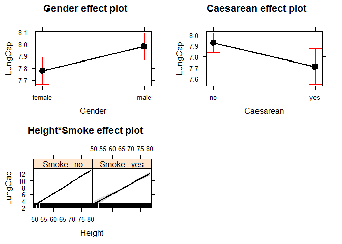 

```r
# selection via AIC retains the interaction Heigth * Smoke. It is up to the researcher whether including such interaction in the starting full model, i.e., it should be included to test a specific prediction we had during sampling design. This interaction tells us that the slope for LungCap ~ Height is less steep for smokers, that means that smokers have a lower than expected (non-smokers) gain in lung capacity as they become taller (or, if you prefer, as they get older). However, this experiment should be handled with care becasue there are not smokers in patient younger than 10 y.o. We discussed about it in class earlier.
```


Model selection using Step AIC

```r
step(model1)
```

```
## Start:  AIC=114.52
## LungCap ~ (Height + Smoke + Gender + Caesarean)^2
## 
##                    Df Sum of Sq    RSS    AIC
## - Gender:Caesarean  1   0.10839 823.79 112.62
## - Smoke:Gender      1   0.21136 823.90 112.71
## - Height:Caesarean  1   0.31419 824.00 112.80
## - Height:Gender     1   0.50857 824.19 112.97
## - Smoke:Caesarean   1   1.88777 825.57 114.18
## <none>                          823.68 114.52
## - Height:Smoke      1   2.90209 826.59 115.07
## 
## Step:  AIC=112.62
## LungCap ~ Height + Smoke + Gender + Caesarean + Height:Smoke + 
##     Height:Gender + Height:Caesarean + Smoke:Gender + Smoke:Caesarean
## 
##                    Df Sum of Sq    RSS    AIC
## - Smoke:Gender      1   0.22736 824.02 110.82
## - Height:Caesarean  1   0.26319 824.06 110.85
## - Height:Gender     1   0.52967 824.32 111.08
## - Smoke:Caesarean   1   1.83572 825.63 112.23
## <none>                          823.79 112.62
## - Height:Smoke      1   2.97041 826.76 113.23
## 
## Step:  AIC=110.82
## LungCap ~ Height + Smoke + Gender + Caesarean + Height:Smoke + 
##     Height:Gender + Height:Caesarean + Smoke:Caesarean
## 
##                    Df Sum of Sq    RSS    AIC
## - Height:Caesarean  1   0.28976 824.31 109.07
## - Height:Gender     1   0.70885 824.73 109.44
## - Smoke:Caesarean   1   1.98455 826.00 110.56
## <none>                          824.02 110.82
## - Height:Smoke      1   2.74343 826.76 111.23
## 
## Step:  AIC=109.07
## LungCap ~ Height + Smoke + Gender + Caesarean + Height:Smoke + 
##     Height:Gender + Smoke:Caesarean
## 
##                   Df Sum of Sq    RSS    AIC
## - Height:Gender    1   0.68571 825.00 107.67
## - Smoke:Caesarean  1   1.82496 826.14 108.67
## <none>                         824.31 109.07
## - Height:Smoke     1   2.91055 827.22 109.63
## 
## Step:  AIC=107.67
## LungCap ~ Height + Smoke + Gender + Caesarean + Height:Smoke + 
##     Smoke:Caesarean
## 
##                   Df Sum of Sq    RSS    AIC
## - Smoke:Caesarean  1    1.7840 826.78 107.24
## <none>                         825.00 107.67
## - Height:Smoke     1    3.0022 828.00 108.31
## - Gender           1    7.1401 832.14 111.92
## 
## Step:  AIC=107.24
## LungCap ~ Height + Smoke + Gender + Caesarean + Height:Smoke
## 
##                Df Sum of Sq    RSS    AIC
## <none>                      826.78 107.24
## - Height:Smoke  1    3.6509 830.43 108.44
## - Caesarean     1    5.9423 832.72 110.43
## - Gender        1    7.3581 834.14 111.67
```

```
## 
## Call:
## lm(formula = LungCap ~ Height + Smoke + Gender + Caesarean + 
##     Height:Smoke, data = lung)
## 
## Coefficients:
##     (Intercept)           Height         Smokeyes       Gendermale  
##       -14.32079          0.34215          2.44968          0.20444  
##    Caesareanyes  Height:Smokeyes  
##        -0.21732         -0.04314
```

```r
# it ends up with the same model structure compared with MuMin
```

Model selection using stepwise backward selection


```r
summary(model1)
```

```
## 
## Call:
## lm(formula = LungCap ~ (Height + Smoke + Gender + Caesarean)^2, 
##     data = lung)
## 
## Residuals:
##     Min      1Q  Median      3Q     Max 
## -3.3847 -0.7484  0.0448  0.7429  2.9908 
## 
## Coefficients:
##                           Estimate Std. Error t value Pr(>|t|)    
## (Intercept)             -14.162253   0.566978 -24.978   <2e-16 ***
## Height                    0.340029   0.008915  38.141   <2e-16 ***
## Smokeyes                  2.105629   1.731996   1.216    0.224    
## Gendermale               -0.317075   0.741737  -0.427    0.669    
## Caesareanyes              0.171713   0.885460   0.194    0.846    
## Height:Smokeyes          -0.040413   0.025480  -1.586    0.113    
## Height:Gendermale         0.007615   0.011469   0.664    0.507    
## Height:Caesareanyes      -0.007139   0.013680  -0.522    0.602    
## Smokeyes:Gendermale       0.118507   0.276860   0.428    0.669    
## Smokeyes:Caesareanyes     0.384385   0.300485   1.279    0.201    
## Gendermale:Caesareanyes   0.059527   0.194198   0.307    0.759    
## ---
## Signif. codes:  0 '***' 0.001 '**' 0.01 '*' 0.05 '.' 0.1 ' ' 1
## 
## Residual standard error: 1.074 on 714 degrees of freedom
## Multiple R-squared:  0.8395,	Adjusted R-squared:  0.8372 
## F-statistic: 373.3 on 10 and 714 DF,  p-value: < 2.2e-16
```

```r
model2 = update(model1, ~. - Gender:Caesarean)
summary(model2)
```

```
## 
## Call:
## lm(formula = LungCap ~ Height + Smoke + Gender + Caesarean + 
##     Height:Smoke + Height:Gender + Height:Caesarean + Smoke:Gender + 
##     Smoke:Caesarean, data = lung)
## 
## Residuals:
##     Min      1Q  Median      3Q     Max 
## -3.3777 -0.7411  0.0541  0.7419  2.9851 
## 
## Coefficients:
##                         Estimate Std. Error t value Pr(>|t|)    
## (Intercept)           -14.155877   0.566237 -25.000   <2e-16 ***
## Height                  0.339825   0.008885  38.249   <2e-16 ***
## Smokeyes                2.134480   1.728340   1.235    0.217    
## Gendermale             -0.313688   0.741185  -0.423    0.672    
## Caesareanyes            0.157433   0.883673   0.178    0.859    
## Height:Smokeyes        -0.040828   0.025428  -1.606    0.109    
## Height:Gendermale       0.007764   0.011451   0.678    0.498    
## Height:Caesareanyes    -0.006444   0.013482  -0.478    0.633    
## Smokeyes:Gendermale     0.122757   0.276338   0.444    0.657    
## Smokeyes:Caesareanyes   0.378190   0.299614   1.262    0.207    
## ---
## Signif. codes:  0 '***' 0.001 '**' 0.01 '*' 0.05 '.' 0.1 ' ' 1
## 
## Residual standard error: 1.073 on 715 degrees of freedom
## Multiple R-squared:  0.8394,	Adjusted R-squared:  0.8374 
## F-statistic: 415.3 on 9 and 715 DF,  p-value: < 2.2e-16
```

```r
model3 = update(model2, ~. - Smoke:Gender)
summary(model3)
```

```
## 
## Call:
## lm(formula = LungCap ~ Height + Smoke + Gender + Caesarean + 
##     Height:Smoke + Height:Gender + Height:Caesarean + Smoke:Caesarean, 
##     data = lung)
## 
## Residuals:
##     Min      1Q  Median      3Q     Max 
## -3.3704 -0.7364  0.0534  0.7237  2.9753 
## 
## Coefficients:
##                         Estimate Std. Error t value Pr(>|t|)    
## (Intercept)           -14.124073   0.561378 -25.160   <2e-16 ***
## Height                  0.339229   0.008778  38.647   <2e-16 ***
## Smokeyes                1.979660   1.691888   1.170    0.242    
## Gendermale             -0.368272   0.730519  -0.504    0.614    
## Caesareanyes            0.177395   0.882035   0.201    0.841    
## Height:Smokeyes        -0.037828   0.024501  -1.544    0.123    
## Height:Gendermale       0.008795   0.011207   0.785    0.433    
## Height:Caesareanyes    -0.006752   0.013457  -0.502    0.616    
## Smokeyes:Caesareanyes   0.391308   0.297989   1.313    0.190    
## ---
## Signif. codes:  0 '***' 0.001 '**' 0.01 '*' 0.05 '.' 0.1 ' ' 1
## 
## Residual standard error: 1.073 on 716 degrees of freedom
## Multiple R-squared:  0.8394,	Adjusted R-squared:  0.8376 
## F-statistic: 467.7 on 8 and 716 DF,  p-value: < 2.2e-16
```

```r
model4 = update(model3, ~. - Height:Caesarean)
summary(model4)
```

```
## 
## Call:
## lm(formula = LungCap ~ Height + Smoke + Gender + Caesarean + 
##     Height:Smoke + Height:Gender + Smoke:Caesarean, data = lung)
## 
## Residuals:
##     Min      1Q  Median      3Q     Max 
## -3.3685 -0.7277  0.0300  0.7191  2.9921 
## 
## Coefficients:
##                         Estimate Std. Error t value Pr(>|t|)    
## (Intercept)           -14.033141   0.531044 -26.426   <2e-16 ***
## Height                  0.337811   0.008306  40.669   <2e-16 ***
## Smokeyes                2.056182   1.684121   1.221   0.2225    
## Gendermale             -0.358754   0.729891  -0.492   0.6232    
## Caesareanyes           -0.262219   0.101849  -2.575   0.0102 *  
## Height:Smokeyes        -0.038832   0.024406  -1.591   0.1120    
## Height:Gendermale       0.008648   0.011197   0.772   0.4402    
## Smokeyes:Caesareanyes   0.372152   0.295379   1.260   0.2081    
## ---
## Signif. codes:  0 '***' 0.001 '**' 0.01 '*' 0.05 '.' 0.1 ' ' 1
## 
## Residual standard error: 1.072 on 717 degrees of freedom
## Multiple R-squared:  0.8393,	Adjusted R-squared:  0.8378 
## F-statistic: 535.1 on 7 and 717 DF,  p-value: < 2.2e-16
```

```r
model5 = update(model4, ~. - Height:Gender)
summary(model5)
```

```
## 
## Call:
## lm(formula = LungCap ~ Height + Smoke + Gender + Caesarean + 
##     Height:Smoke + Smoke:Caesarean, data = lung)
## 
## Residuals:
##     Min      1Q  Median      3Q     Max 
## -3.3761 -0.7343  0.0458  0.7296  3.0293 
## 
## Coefficients:
##                        Estimate Std. Error t value Pr(>|t|)    
## (Intercept)           -14.32320    0.37533 -38.162   <2e-16 ***
## Height                  0.34236    0.00586  58.418   <2e-16 ***
## Smokeyes                2.09536    1.68288   1.245   0.2135    
## Gendermale              0.20147    0.08082   2.493   0.0129 *  
## Caesareanyes           -0.26107    0.10181  -2.564   0.0105 *  
## Height:Smokeyes        -0.03942    0.02439  -1.616   0.1064    
## Smokeyes:Caesareanyes   0.36789    0.29524   1.246   0.2132    
## ---
## Signif. codes:  0 '***' 0.001 '**' 0.01 '*' 0.05 '.' 0.1 ' ' 1
## 
## Residual standard error: 1.072 on 718 degrees of freedom
## Multiple R-squared:  0.8392,	Adjusted R-squared:  0.8379 
## F-statistic: 624.5 on 6 and 718 DF,  p-value: < 2.2e-16
```

```r
model6 = update(model5, ~. - Smoke:Caesarean)
summary(model6)
```

```
## 
## Call:
## lm(formula = LungCap ~ Height + Smoke + Gender + Caesarean + 
##     Height:Smoke, data = lung)
## 
## Residuals:
##     Min      1Q  Median      3Q     Max 
## -3.3647 -0.7253  0.0569  0.7438  3.0397 
## 
## Coefficients:
##                  Estimate Std. Error t value Pr(>|t|)    
## (Intercept)     -14.32079    0.37547 -38.141   <2e-16 ***
## Height            0.34214    0.00586  58.384   <2e-16 ***
## Smokeyes          2.44968    1.65932   1.476   0.1403    
## Gendermale        0.20444    0.08082   2.530   0.0116 *  
## Caesareanyes     -0.21732    0.09560  -2.273   0.0233 *  
## Height:Smokeyes  -0.04314    0.02421  -1.782   0.0752 .  
## ---
## Signif. codes:  0 '***' 0.001 '**' 0.01 '*' 0.05 '.' 0.1 ' ' 1
## 
## Residual standard error: 1.072 on 719 degrees of freedom
## Multiple R-squared:  0.8388,	Adjusted R-squared:  0.8377 
## F-statistic: 748.5 on 5 and 719 DF,  p-value: < 2.2e-16
```

```r
model7 = update(model6, ~. - Height:Smoke)
summary(model7)
```

```
## 
## Call:
## lm(formula = LungCap ~ Height + Smoke + Gender + Caesarean, data = lung)
## 
## Residuals:
##     Min      1Q  Median      3Q     Max 
## -3.3631 -0.7360  0.0290  0.7529  3.0710 
## 
## Coefficients:
##                Estimate Std. Error t value Pr(>|t|)    
## (Intercept)  -14.162235   0.365323 -38.766  < 2e-16 ***
## Height         0.339699   0.005706  59.536  < 2e-16 ***
## Smokeyes      -0.497653   0.132004  -3.770 0.000177 ***
## Gendermale     0.197766   0.080852   2.446 0.014683 *  
## Caesareanyes  -0.206444   0.095549  -2.161 0.031055 *  
## ---
## Signif. codes:  0 '***' 0.001 '**' 0.01 '*' 0.05 '.' 0.1 ' ' 1
## 
## Residual standard error: 1.074 on 720 degrees of freedom
## Multiple R-squared:  0.8381,	Adjusted R-squared:  0.8372 
## F-statistic: 932.1 on 4 and 720 DF,  p-value: < 2.2e-16
```

```r
# model7 is the best one using backward stepwise selection.
# MuMIn and step AIC end up with the same model including 1 interaction (Smoke * Height), while stepwise selection retains single effects only.
```


+++++++++++++++++
Edited by Simone Ciuti, University of Freiburg, 01/11/2015; 
Intended for the only purpose of teaching @ Freiburg University; 
+++++++++++++++++++++++++++++++++++++++++++++++++
