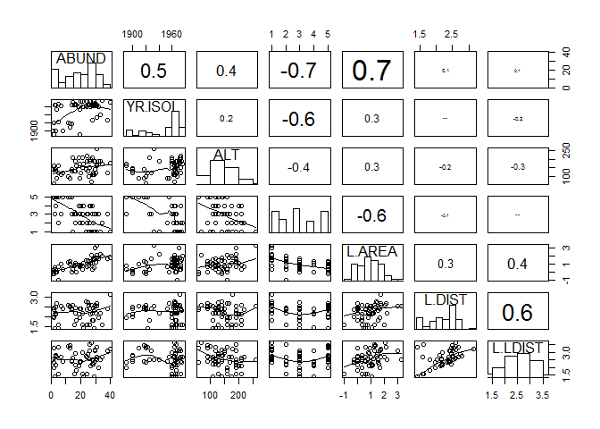
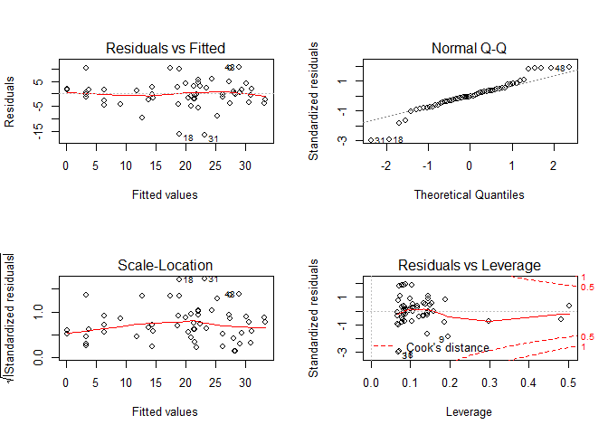
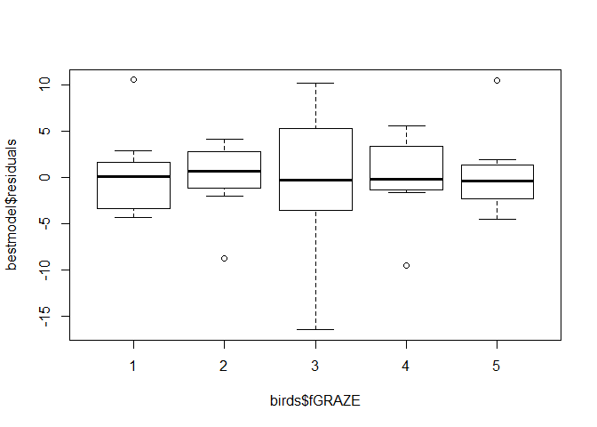
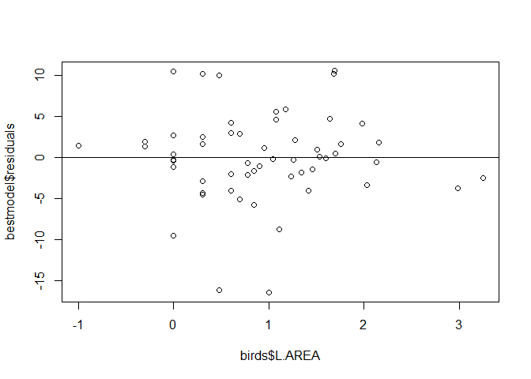

# Exercise 1

Set your working directory here:

```r
setwd("~/TEACHING IN FREIBURG/11 - Statistics with R fall 2015/13_Week 2-3 wrap-up and exercises")
```


This chunck loads the data for you (including some pre-required data handling):

```r
birds <- read.delim("birds.txt")
birds$fGRAZE = as.factor(birds$GRAZE)
birds$L.AREA = log10(birds$AREA)
birds$L.DIST = log10(birds$DIST)
birds$L.LDIST = log10(birds$LDIST)
head(birds)
```

```
##   Site ABUND AREA DIST LDIST YR.ISOL GRAZE ALT fGRAZE   L.AREA   L.DIST
## 1    1   5.3  0.1   39    39    1968     2 160      2 -1.00000 1.591065
## 2    2   2.0  0.5  234   234    1920     5  60      5 -0.30103 2.369216
## 3    3   1.5  0.5  104   311    1900     5 140      5 -0.30103 2.017033
## 4    4  17.1  1.0   66    66    1966     3 160      3  0.00000 1.819544
## 5    5  13.8  1.0  246   246    1918     5 140      5  0.00000 2.390935
## 6    6  14.1  1.0  234   285    1965     3 130      3  0.00000 2.369216
##    L.LDIST
## 1 1.591065
## 2 2.369216
## 3 2.492760
## 4 1.819544
## 5 2.390935
## 6 2.454845
```

Dataset details:
ABUND =  RESPONSE [bird density measured in 56 forest patches in Victoria, Australia].
AREA =  size FOREST patch.
DIST = dist closest patch. 
LDIST =  distance to the nearest larger patch.
YR.ISOL = year isolation by clearance. 
GRAZE =  index of livestock grazing (1 light, 5 intensive).
ALT =  altitude of the patch.

In the previous chunk, we actually converted GRAZE into a factor, and log10 transformed AREA, DIST, and LDIST to reduce the influence of outliers (you can plot the distributions of these data and will see how they look after data transformation). SO, forget about AREA, DIST, and LDIST.. you are supposed to use L.AREA L.DIST and L.LDIST instead. The full list of predictors we expect to affect ABUND is: YR.ISOL, ALT, fGRAZE, L.AREA, L.DIST, L.LDIST.


Now, your tasks.

(1) check/test for collinearity issues.

```r
source("collinearity check.r")  #loading useful functions

#bind together the columns of interest
attach(birds)
Z = cbind(ABUND, YR.ISOL, ALT, as.numeric(fGRAZE), L.AREA, L.DIST, L.LDIST)

pairs(Z, lower.panel = panel.smooth2,
      upper.panel = panel.cor, diag.panel = panel.hist)
```

 

```r
detach(birds)

# there are many strongly correlated predictors here. However, if we stick to the +/- 0.7 threshold, then there are no collinear predictors.
#let's test for multi-collinearity now. 
corvif(Z[,-1])
```

```
## 
## 
## Variance inflation factors
```

```
## Warning in summary.lm(object): essentially perfect fit: summary may be
## unreliable
```

```
##             GVIF
## YR.ISOL 1.804769
## ALT     1.467937
## V3      2.524814
## L.AREA  1.911514
## L.DIST  1.654553
## L.LDIST 2.009749
```

```r
#OK, we are done here. We are allowed to use YR.ISOL, ALT, fGRAZE, L.AREA, L.DIST, and L.LDIST as predictors in our models
```

(2) define the model structure including all quadratic effects but not interactions (we do not have specific expectations here. Also, the dataset is 56 rows and we should be cautious in using interactions here).


```r
m1 = lm(ABUND ~ YR.ISOL + I(YR.ISOL^2) + ALT + I(ALT^2)  + fGRAZE + L.AREA + I(L.AREA^2)  + L.DIST + I(L.DIST^2)  + L.LDIST + I(L.LDIST^2) , data = birds)
```

(3) perform model selection using MuMIn package. What's the structure of the top-ranked model suggested by MuMIn?


```r
library(MuMIn)
options(na.action = "na.fail")   #  prevent fitting models to different datasets
mydredge = dredge(m1)
```

```
## Fixed term is "(Intercept)"
```

```r
head(mydredge)
```

```
## Global model call: lm(formula = ABUND ~ YR.ISOL + I(YR.ISOL^2) + ALT + I(ALT^2) + 
##     fGRAZE + L.AREA + I(L.AREA^2) + L.DIST + I(L.DIST^2) + L.LDIST + 
##     I(L.LDIST^2), data = birds)
## ---
## Model selection table 
##      (Int)     ALT     ALT^2 fGR  L.ARE L.ARE^2   YR.ISO   YR.ISO^2 df
## 29   15.91                     + 10.370  -1.532                      8
## 13   15.72                     +  7.247                              7
## 31   14.36         6.377e-05   + 10.740  -1.781                      9
## 30   13.04 0.01899             + 10.670  -1.731                      9
## 1053 46.81                     + 10.410  -1.601          -7.971e-06  9
## 541  75.78                     + 10.400  -1.599 -0.03041             9
##        logLik  AICc delta weight
## 29   -173.666 366.4  0.00  0.337
## 13   -175.522 367.4  0.98  0.206
## 31   -173.187 368.3  1.89  0.131
## 30   -173.200 368.3  1.92  0.129
## 1053 -173.471 368.9  2.46  0.099
## 541  -173.476 368.9  2.47  0.098
## Models ranked by AICc(x)
```

```r
#the structure of the best model suggested by MuMIn is the following:
bestmodel = lm(ABUND ~ fGRAZE + L.AREA + I(L.AREA^2), birds)
```

(4) perform model selection using step AIC. Does the model structure differ from (3)?


```r
step(m1)
```

```
## Start:  AIC=214
## ABUND ~ YR.ISOL + I(YR.ISOL^2) + ALT + I(ALT^2) + fGRAZE + L.AREA + 
##     I(L.AREA^2) + L.DIST + I(L.DIST^2) + L.LDIST + I(L.LDIST^2)
## 
##                Df Sum of Sq    RSS    AIC
## - I(ALT^2)      1      1.67 1498.5 212.07
## - ALT           1      4.49 1501.3 212.17
## - L.LDIST       1     22.84 1519.7 212.85
## - I(L.LDIST^2)  1     23.15 1520.0 212.86
## - L.DIST        1     29.67 1526.5 213.10
## - I(L.DIST^2)   1     30.90 1527.8 213.15
## - YR.ISOL       1     49.87 1546.7 213.84
## - I(YR.ISOL^2)  1     50.17 1547.0 213.85
## <none>                      1496.9 214.00
## - I(L.AREA^2)   1    121.21 1618.1 216.36
## - fGRAZE        4    395.73 1892.6 219.14
## - L.AREA        1    627.86 2124.7 231.62
## 
## Step:  AIC=212.07
## ABUND ~ YR.ISOL + I(YR.ISOL^2) + ALT + fGRAZE + L.AREA + I(L.AREA^2) + 
##     L.DIST + I(L.DIST^2) + L.LDIST + I(L.LDIST^2)
## 
##                Df Sum of Sq    RSS    AIC
## - ALT           1     20.47 1519.0 210.83
## - L.LDIST       1     25.70 1524.2 211.02
## - I(L.LDIST^2)  1     25.94 1524.5 211.03
## - L.DIST        1     33.66 1532.2 211.31
## - I(L.DIST^2)   1     34.43 1533.0 211.34
## - YR.ISOL       1     51.46 1550.0 211.96
## - I(YR.ISOL^2)  1     51.80 1550.3 211.97
## <none>                      1498.5 212.07
## - I(L.AREA^2)   1    135.52 1634.0 214.91
## - fGRAZE        4    397.98 1896.5 217.26
## - L.AREA        1    660.10 2158.6 230.50
## 
## Step:  AIC=210.83
## ABUND ~ YR.ISOL + I(YR.ISOL^2) + fGRAZE + L.AREA + I(L.AREA^2) + 
##     L.DIST + I(L.DIST^2) + L.LDIST + I(L.LDIST^2)
## 
##                Df Sum of Sq    RSS    AIC
## - L.LDIST       1     39.08 1558.1 210.25
## - I(L.LDIST^2)  1     41.19 1560.2 210.32
## - YR.ISOL       1     41.56 1560.6 210.34
## - I(YR.ISOL^2)  1     41.94 1561.0 210.35
## - I(L.DIST^2)   1     43.20 1562.2 210.40
## - L.DIST        1     44.37 1563.4 210.44
## <none>                      1519.0 210.83
## - I(L.AREA^2)   1    118.63 1637.6 213.04
## - fGRAZE        4    476.79 1995.8 218.11
## - L.AREA        1    652.00 2171.0 228.82
## 
## Step:  AIC=210.25
## ABUND ~ YR.ISOL + I(YR.ISOL^2) + fGRAZE + L.AREA + I(L.AREA^2) + 
##     L.DIST + I(L.DIST^2) + I(L.LDIST^2)
## 
##                Df Sum of Sq    RSS    AIC
## - I(L.LDIST^2)  1      2.75 1560.8 208.35
## - L.DIST        1     14.10 1572.2 208.75
## - I(L.DIST^2)   1     15.23 1573.3 208.79
## - YR.ISOL       1     34.76 1592.8 209.48
## - I(YR.ISOL^2)  1     35.18 1593.3 209.50
## <none>                      1558.1 210.25
## - I(L.AREA^2)   1    128.84 1686.9 212.70
## - fGRAZE        4    516.64 2074.7 218.28
## - L.AREA        1    662.58 2220.7 228.09
## 
## Step:  AIC=208.35
## ABUND ~ YR.ISOL + I(YR.ISOL^2) + fGRAZE + L.AREA + I(L.AREA^2) + 
##     L.DIST + I(L.DIST^2)
## 
##                Df Sum of Sq    RSS    AIC
## - L.DIST        1     13.79 1574.6 206.84
## - I(L.DIST^2)   1     14.33 1575.2 206.86
## - YR.ISOL       1     33.26 1594.1 207.53
## - I(YR.ISOL^2)  1     33.68 1594.5 207.54
## <none>                      1560.8 208.35
## - I(L.AREA^2)   1    126.45 1687.3 210.71
## - fGRAZE        4    576.43 2137.3 217.95
## - L.AREA        1    751.90 2312.7 228.37
## 
## Step:  AIC=206.84
## ABUND ~ YR.ISOL + I(YR.ISOL^2) + fGRAZE + L.AREA + I(L.AREA^2) + 
##     I(L.DIST^2)
## 
##                Df Sum of Sq    RSS    AIC
## - I(L.DIST^2)   1      0.69 1575.3 204.86
## - YR.ISOL       1     32.81 1607.4 205.99
## - I(YR.ISOL^2)  1     33.12 1607.8 206.00
## <none>                      1574.6 206.84
## - I(L.AREA^2)   1    133.43 1708.0 209.39
## - fGRAZE        4    563.03 2137.7 215.96
## - L.AREA        1    772.22 2346.8 227.19
## 
## Step:  AIC=204.86
## ABUND ~ YR.ISOL + I(YR.ISOL^2) + fGRAZE + L.AREA + I(L.AREA^2)
## 
##                Df Sum of Sq    RSS    AIC
## - YR.ISOL       1     32.87 1608.2 204.02
## - I(YR.ISOL^2)  1     33.17 1608.5 204.03
## <none>                      1575.3 204.86
## - I(L.AREA^2)   1    136.80 1712.1 207.53
## - fGRAZE        4    590.03 2165.3 214.68
## - L.AREA        1    810.98 2386.3 226.12
## 
## Step:  AIC=204.02
## ABUND ~ I(YR.ISOL^2) + fGRAZE + L.AREA + I(L.AREA^2)
## 
##                Df Sum of Sq    RSS    AIC
## - I(YR.ISOL^2)  1     11.27 1619.5 202.41
## <none>                      1608.2 204.02
## - I(L.AREA^2)   1    118.75 1726.9 206.01
## - fGRAZE        4    557.71 2165.9 212.69
## - L.AREA        1    811.05 2419.2 224.89
## 
## Step:  AIC=202.41
## ABUND ~ fGRAZE + L.AREA + I(L.AREA^2)
## 
##               Df Sum of Sq    RSS    AIC
## <none>                     1619.5 202.41
## - I(L.AREA^2)  1    110.94 1730.4 204.12
## - L.AREA       1    806.16 2425.6 223.03
## - fGRAZE       4   1089.49 2708.9 223.22
```

```
## 
## Call:
## lm(formula = ABUND ~ fGRAZE + L.AREA + I(L.AREA^2), data = birds)
## 
## Coefficients:
## (Intercept)      fGRAZE2      fGRAZE3      fGRAZE4      fGRAZE5  
##     15.9102      -0.2003      -1.4983      -3.1225     -12.5573  
##      L.AREA  I(L.AREA^2)  
##     10.3692      -1.5323
```

```r
# the model structure suggested by step AIC is the same compared to that suggested by MuMIn.
```

(5) referring to the best model selected by MuMIn. Does it meet model assumptions? Y/N? Why?


```r
par(mfrow = c(2, 2))
plot(bestmodel)
```

 

```r
par(mfrow = c(1,1))

# independence -> OK (based on the info provided on the experiment, sampling stations are independent)

# linearity assumption -> OK

# homogeneity -> as far as we can tell from the top-lef plot, there is a slight pattern in the residuals (reduced and positive spread from small fitted values, increasing spread as fitted values increase). This is multiple regression (2 predictors, e.g., fGraze and L.AREA). So, we can further inspect heterogeneity
plot(bestmodel$residuals ~ birds$fGRAZE) # it does not look good. spread with grazing intensity 3 is much wider
```

 

```r
plot(bestmodel$residuals ~ birds$L.AREA); abline(h = 0) # this is not that bad, considering the low sample size.
```

 

```r
# in general, homogeneity assumption is not fully met.
# you can even test it
bartlett.test(bestmodel$residuals ~ birds$fGRAZE) #rejected the null hypothesis that variances do not change across levels.
```

```
## 
## 	Bartlett test of homogeneity of variances
## 
## data:  bestmodel$residuals by birds$fGRAZE
## Bartlett's K-squared = 11.87, df = 4, p-value = 0.01834
```

```r
# normality -> not met
shapiro.test(bestmodel$residuals)
```

```
## 
## 	Shapiro-Wilk normality test
## 
## data:  bestmodel$residuals
## W = 0.93611, p-value = 0.005314
```

```r
# answer. Assumptions of the linear model are not fully met. We have problems both with normality and heterogeneity.
```

