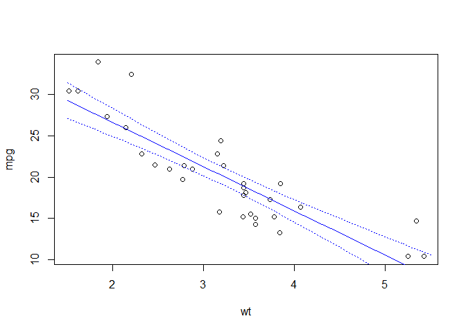
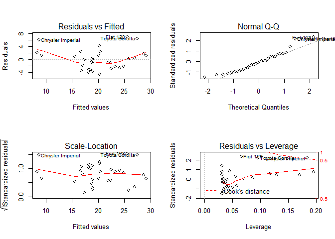
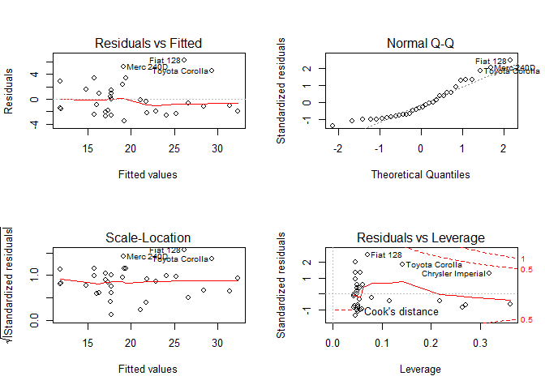
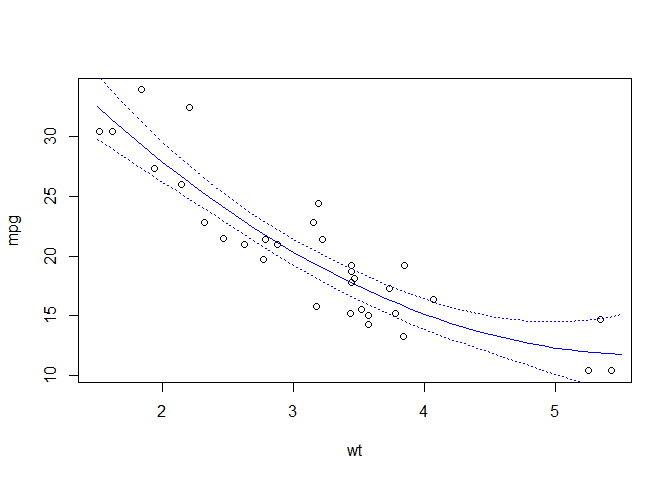

# Exercise 9


```r
#dataset matcars
head(mtcars)
```

```
##                    mpg cyl disp  hp drat    wt  qsec vs am gear carb
## Mazda RX4         21.0   6  160 110 3.90 2.620 16.46  0  1    4    4
## Mazda RX4 Wag     21.0   6  160 110 3.90 2.875 17.02  0  1    4    4
## Datsun 710        22.8   4  108  93 3.85 2.320 18.61  1  1    4    1
## Hornet 4 Drive    21.4   6  258 110 3.08 3.215 19.44  1  0    3    1
## Hornet Sportabout 18.7   8  360 175 3.15 3.440 17.02  0  0    3    2
## Valiant           18.1   6  225 105 2.76 3.460 20.22  1  0    3    1
```

```r
#?mtcars #for full details on the dataset
```

(1) you are thinking to run a linear model with cyl and wt as predictors, mpg as response. Are you allowed to do that? Y/N? Why?


```r
attach(mtcars)
cor(cyl, wt) 
```

```
## [1] 0.7824958
```

```r
#the 2 variables are collinear and cannot be used as predictors in the same model
```

(2) run a regression with x = wt, y = mpg. Plot predictions with 95% CIs (library effects not allowed here).


```r
model1 = lm(mpg ~ wt, mtcars)
plot(wt, mpg)
MyData = data.frame(wt = seq(1.5, 5.5, 0.1))
pred = predict(model1, MyData, se = T, type = "response")

lines(MyData$wt, pred$fit, col = 4)    
lines(MyData$wt, pred$fit + 1.96*pred$se.fit, col = 4, lty = 3)
lines(MyData$wt, pred$fit - 1.96*pred$se.fit, col = 4, lty = 3)
```

 


(3) Are the assumptions of the model met?


```r
par(mfrow = c(2, 2))
plot(model1)
```

 

```r
par(mfrow = c(1, 1))
#normality does not look a big problem
shapiro.test(model1$residuals)
```

```
## 
## 	Shapiro-Wilk normality test
## 
## data:  model1$residuals
## W = 0.94508, p-value = 0.1044
```

```r
# the problem here is 1) non linearity and 2) not homogenous residual spread (only positive residuals for small and large fitted values). Problems with cook distance and influencial values.
# No, we do not fully meet model assumptions here.
```

(4) if your answer to question 3 is yes, we are good here.

(5) if your answer to question 3 is no, do something to improve the model fit and better meet the assumptions. Whatever improvements you achieve, decribe it.


```r
model2 = lm(mpg ~ wt + I(wt^2), mtcars) #including a quadratic term may help to improve homogeneity
summary(model2)
```

```
## 
## Call:
## lm(formula = mpg ~ wt + I(wt^2), data = mtcars)
## 
## Residuals:
##    Min     1Q Median     3Q    Max 
## -3.483 -1.998 -0.773  1.462  6.238 
## 
## Coefficients:
##             Estimate Std. Error t value Pr(>|t|)    
## (Intercept)  49.9308     4.2113  11.856 1.21e-12 ***
## wt          -13.3803     2.5140  -5.322 1.04e-05 ***
## I(wt^2)       1.1711     0.3594   3.258  0.00286 ** 
## ---
## Signif. codes:  0 '***' 0.001 '**' 0.01 '*' 0.05 '.' 0.1 ' ' 1
## 
## Residual standard error: 2.651 on 29 degrees of freedom
## Multiple R-squared:  0.8191,	Adjusted R-squared:  0.8066 
## F-statistic: 65.64 on 2 and 29 DF,  p-value: 1.715e-11
```

```r
par(mfrow = c(2, 2))
plot(model2)
```

 

```r
par(mfrow = c(1, 1)) 

# compared to model 1, here we improved homogeneity (although it is still bad) and actually we lost the normality of residuals
shapiro.test(model2$residuals)
```

```
## 
## 	Shapiro-Wilk normality test
## 
## data:  model2$residuals
## W = 0.91488, p-value = 0.01513
```

```r
plot(wt, mpg)
MyData = data.frame(wt = seq(1.5, 5.5, 0.1))
pred = predict(model2, MyData, se = T, type = "response")
lines(MyData$wt, pred$fit, col = 4)    
lines(MyData$wt, pred$fit + 1.96*pred$se.fit, col = 4, lty = 3)
lines(MyData$wt, pred$fit - 1.96*pred$se.fit, col = 4, lty = 3)
```

 

```r
# compared to model1, model 2 is a better fit, with an improvement of almost 8 points in AIC
AIC(model1, model2)
```

```
##        df      AIC
## model1  3 166.0294
## model2  4 158.0484
```

```r
# our last resort. transforming the response variable
model3 = lm(log(mpg) ~ wt + I(wt^2), mtcars) 
summary(model3)
```

```
## 
## Call:
## lm(formula = log(mpg) ~ wt + I(wt^2), data = mtcars)
## 
## Residuals:
##      Min       1Q   Median       3Q      Max 
## -0.18504 -0.09455 -0.02304  0.08569  0.25526 
## 
## Coefficients:
##             Estimate Std. Error t value Pr(>|t|)    
## (Intercept)  4.13391    0.21151  19.545  < 2e-16 ***
## wt          -0.46369    0.12626  -3.672 0.000966 ***
## I(wt^2)      0.02797    0.01805   1.549 0.132175    
## ---
## Signif. codes:  0 '***' 0.001 '**' 0.01 '*' 0.05 '.' 0.1 ' ' 1
## 
## Residual standard error: 0.1331 on 29 degrees of freedom
## Multiple R-squared:  0.813,	Adjusted R-squared:  0.8001 
## F-statistic: 63.05 on 2 and 29 DF,  p-value: 2.758e-11
```

```r
par(mfrow = c(2, 2))
plot(model3)
```

 

```r
par(mfrow = c(1, 1)) 
# normalty of residuals is back. Homogeneity looks better if compared to previous models. Certainly, this is not the dream model. Adding more predictors and increasing sample size would help a lot here!!
```


