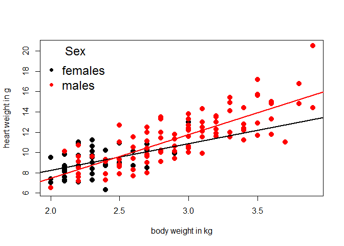
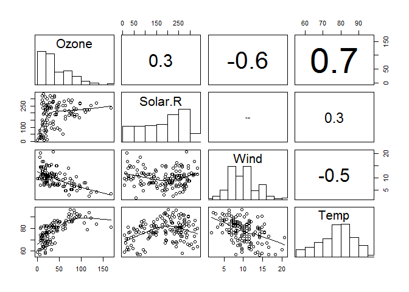
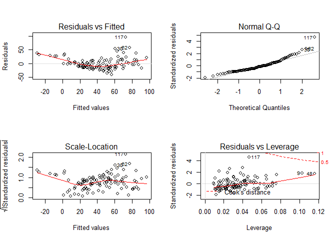
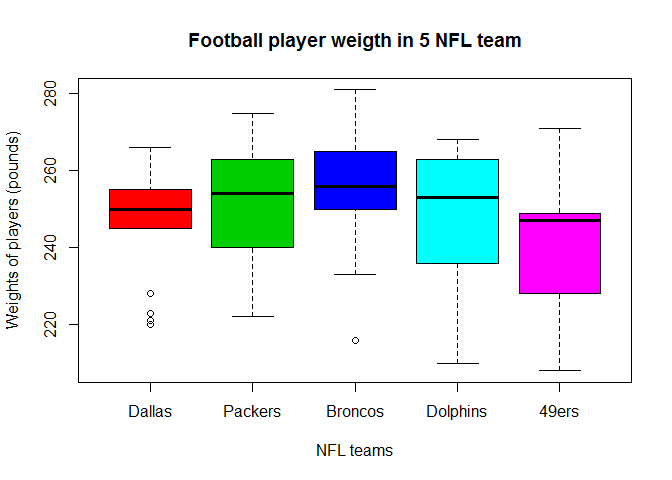
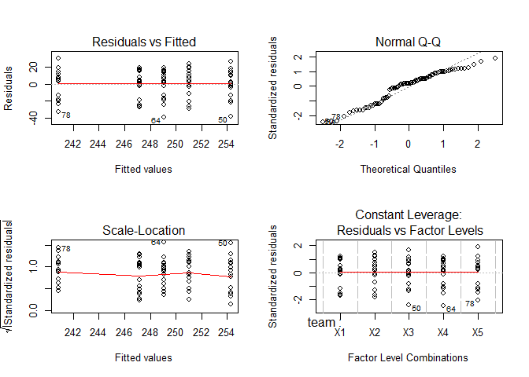
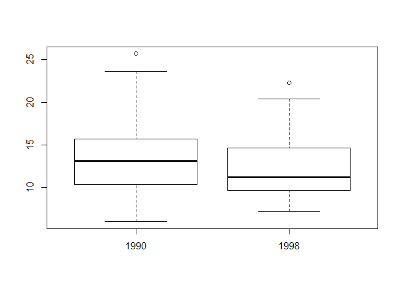
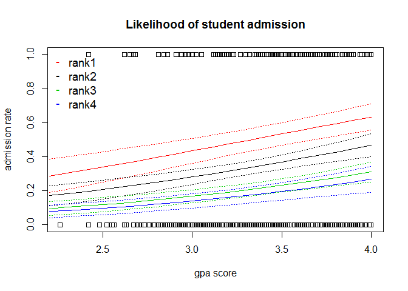

# Exercises

# Exercise # 4 - Quick revision of basic tasks in R

(1) Create a vector with numbers from 1 to 100 increasing by 0.12 (myvector is the name assigned to the vector); 
(2) how many numbers are stored in your vector?
(3) calculate the sqrt of the 50th value minus the log10 of the 10th value


```r
#(1)
myvector = seq(1, 100, 0.12)
#(2)
length(myvector)
```

```
## [1] 826
```

```r
#(3)
sqrt(myvector[50]) - log10(myvector[10])
```

```
## [1] 2.304912
```

(4) Create 2 samples (sample size = 184 in both cases) randomly drawn for 2 normal distributions. 
    One sample is randomly drawn from a standard normal distribution.
    The other sample is randomly drawn from a normal distribution with mean = 103 and sd = 12
(5) create a matrix (rowwise,92 rows) with the first sample, and another matrix (columnwise, 92 rows) with the second sample


```r
#(4)
sample1 = rnorm(184)
sample2 = rnorm(184, mean = 103, sd = 12)
#(5)
mymatrix1 = matrix(sample1, nrow = 92, byrow = TRUE)
mymatrix2 = matrix(sample2, nrow = 92, byrow = FALSE)
```
(6) provided the following data (old experiment from the 40s)

```r
library(MASS); data(cats); attach(cats)
```
Is the variable Hwt (heart weight) normally distributed?

```r
qqnorm(Hwt); qqline(Hwt) # banana shape. let's run the shapiro test
```

 

```r
shapiro.test(Hwt) # we reject the null hypothesis. Hwt is not normally distributed
```

```
## 
## 	Shapiro-Wilk normality test
## 
## data:  Hwt
## W = 0.96039, p-value = 0.0003654
```

(7) Using the same dataset that it is still attached (cats), make a plot with x = Bwt (body weight in kg) and y = Hwt (heart weight in g). 
Add 2 simple linear fits (one for females, one for males). Make sure you use different colours for symbols depending on Sex. Add a proper legend and detach the dataset.


```r
plot(Bwt, Hwt, xlab = "body weight in kg", ylab = "heart weight in g", col = Sex, pch = 20, cex = 2)
abline(lm(Hwt[Sex == "F"] ~ Bwt[Sex == "F"]), col = "black", lwd = 2)
abline(lm(Hwt[Sex == "M"] ~ Bwt[Sex == "M"]), col = "red", lwd = 2)
legend("topleft",c("females","males"), col = c("black", "red"), title = "Sex",
       bty = "n", pch = c(20, 20), cex = 1.5)
```

 

```r
detach(cats)
```


# Exercise # 5 - Airquality dataset
Daily air quality measurements in New York, May to September 1973
A data frame with 154 observations on 6 variables.

[,1]  Ozone	 numeric	 Ozone (ppb)
[,2]	Solar.R	 numeric	 Solar R (lang)
[,3]	Wind	 numeric	 Wind (mph)
[,4]	Temp	 numeric	 Temperature (degrees F)


```r
data(airquality)
#we remove 2 columns that are not the target of our analyses 
airquality$Month = NULL
airquality$Day = NULL
summary(airquality)
```

```
##      Ozone           Solar.R           Wind             Temp      
##  Min.   :  1.00   Min.   :  7.0   Min.   : 1.700   Min.   :56.00  
##  1st Qu.: 18.00   1st Qu.:115.8   1st Qu.: 7.400   1st Qu.:72.00  
##  Median : 31.50   Median :205.0   Median : 9.700   Median :79.00  
##  Mean   : 42.13   Mean   :185.9   Mean   : 9.958   Mean   :77.88  
##  3rd Qu.: 63.25   3rd Qu.:258.8   3rd Qu.:11.500   3rd Qu.:85.00  
##  Max.   :168.00   Max.   :334.0   Max.   :20.700   Max.   :97.00  
##  NA's   :37       NA's   :7
```

```r
head(airquality)
```

```
##   Ozone Solar.R Wind Temp
## 1    41     190  7.4   67
## 2    36     118  8.0   72
## 3    12     149 12.6   74
## 4    18     313 11.5   62
## 5    NA      NA 14.3   56
## 6    28      NA 14.9   66
```

```r
attach(airquality)
```
You are interest on the effect of Solar.R, Wind, and Temp on Ozone concentrations. 
(1) are you allowed to use these 3 predictors in the same model?


```r
setwd("~/TEACHING IN FREIBURG/11 - Statistics with R fall 2015/13_Week 2-3 wrap-up and exercises")
source("collinearity check.r")  #loading useful functions
Z = cbind(Ozone, Solar.R, Wind, Temp)
#run the plot
pairs(Z, lower.panel = panel.smooth2,
      upper.panel = panel.cor, diag.panel = panel.hist)
```

 

```r
# Solar.R, Wind, and Temp are correlated but not collinear (if we stick to the threshold of +-0.7)

#let's check for mulitcollinearity
corvif(Z[,-1])
```

```
## 
## 
## Variance inflation factors
## 
##             GVIF
## Solar.R 1.089300
## Wind    1.267492
## Temp    1.367450
```
Yes, we are allowed to use them in the same model as predictors. 

(2) fit a multiple linear regression without any interaction terms or quadratic terms. Are the assumption of the model met? Y/N? Why?


```r
model1 = lm(Ozone ~ Solar.R + Wind + Temp)
summary(model1)
```

```
## 
## Call:
## lm(formula = Ozone ~ Solar.R + Wind + Temp)
## 
## Residuals:
##     Min      1Q  Median      3Q     Max 
## -40.485 -14.219  -3.551  10.097  95.619 
## 
## Coefficients:
##              Estimate Std. Error t value Pr(>|t|)    
## (Intercept) -64.34208   23.05472  -2.791  0.00623 ** 
## Solar.R       0.05982    0.02319   2.580  0.01124 *  
## Wind         -3.33359    0.65441  -5.094 1.52e-06 ***
## Temp          1.65209    0.25353   6.516 2.42e-09 ***
## ---
## Signif. codes:  0 '***' 0.001 '**' 0.01 '*' 0.05 '.' 0.1 ' ' 1
## 
## Residual standard error: 21.18 on 107 degrees of freedom
##   (42 observations deleted due to missingness)
## Multiple R-squared:  0.6059,	Adjusted R-squared:  0.5948 
## F-statistic: 54.83 on 3 and 107 DF,  p-value: < 2.2e-16
```

```r
par(mfrow=c(2,2))
plot(model1)
```

 

```r
par(mfrow=c(1,1))
```
Clearly, we hardly meet the assumptions of linear regression here
i) assumption of linearity is not met
ii) there are clear patterns in the residuals
iii) also normality of residuals seems to be a problem here. However, our main concern here is about heterogeneity!


```r
shapiro.test(model1$residuals)
```

```
## 
## 	Shapiro-Wilk normality test
## 
## data:  model1$residuals
## W = 0.91709, p-value = 3.618e-06
```

```r
detach(airquality)
```


# Exercise # 6 Weights of American football players
load the provided dataset weights.txt


```r
weights <- read.delim("weights.txt")
head(weights)
```

```
##   team weight
## 1   X1    250
## 2   X1    255
## 3   X1    255
## 4   X1    264
## 5   X1    250
## 6   X1    265
```

The  data represent weights (pounds) of a random sample of professional football players on the following teams.
X1 = weights of players for the Dallas Cowboys
X2 = weights of players for the Green Bay Packers
X3 = weights of players for the Denver Broncos
X4 = weights of players for the Miami Dolphins
X5 = weights of players for the San Francisco Forty Niners
Reference: The Sports Encyclopedia Pro Football

(1) Using a parametric procedure, can you detect any difference in player weights depending on the team? What is your null hypothesis? Can we reject the null hypothesis? Provide a plot and explain your results. 


```r
attach(weights)
boxplot(weight~team, main = "Football player weigth in 5 NFL team", names = c("Dallas","Packers","Broncos","Dolphins","49ers"), col = c(2,3,4,5,6),
        xlab = "NFL teams", ylab  ="Weights of players (pounds)")
```

 

```r
model1 = aov(weight ~ team)
summary(model1)
```

```
##             Df Sum Sq Mean Sq F value Pr(>F)
## team         4   1714   428.4   1.575  0.189
## Residuals   80  21761   272.0
```
The null is ' mean weights are not different across teams'. Actually, we cannot reject the null hypothesis. Thus, there is no need to run post-hoc tests.  

(2) do we meet model assumptions of the parametric model? Y/N? why?


```r
par(mfrow = c(2, 2))
plot(model1)
```

 

```r
par(mfrow = c(1, 1))

fligner.test(weight~team) #very good, we cannot reject the null for Fligner.test; no issues here.
```

```
## 
## 	Fligner-Killeen test of homogeneity of variances
## 
## data:  weight by team
## Fligner-Killeen:med chi-squared = 0.41151, df = 4, p-value =
## 0.9815
```

```r
shapiro.test(model1$residuals) # there is a problem with residuals that are not normally distributed.
```

```
## 
## 	Shapiro-Wilk normality test
## 
## data:  model1$residuals
## W = 0.94462, p-value = 0.001161
```

(3) run the non-parametric alternative. What is the null hypothesis here? Is the final conclusion you get from the non-parametric procedure different to that shown by the parametric one? Would you recommend using the parametric or the non-parametric test here?


```r
kruskal.test(weight ~ team)
```

```
## 
## 	Kruskal-Wallis rank sum test
## 
## data:  weight by team
## Kruskal-Wallis chi-squared = 7.9307, df = 4, p-value = 0.09415
```

```r
detach(weights)
```
null: median weights are not different across teams
Well, actually,we cannot reject the null hypothesis  using Kruskal-Wallis  , so the final conclusion is similar to that recorded by ANOVA
However, KW is better suited here becasue of the non-normality of residuals.


# Exercise # 7 Poverty level
Load the dataset poverty.txt
In the following data pairs
first column: percentage of population below poverty level in 1998, as recorded in 51 randomly selected villages.
second column: percentage of population below poverty level in 1990 (same villages as the first column.
Reference: Statistical Abstract of the United States, 120th edition.


```r
poverty <- read.delim("poverty.txt")
head(poverty)
```

```
##   y1998 y1990
## 1  14.5  19.2
## 2   9.4  11.4
## 3  16.6  13.7
## 4  14.8  19.6
## 5  15.4  13.9
## 6   9.2  13.7
```

Did poverty levels change in 1998 compared to 1990?


```r
attach(poverty)
qqnorm(y1998); qqline(y1998)
```

 

```r
qqnorm(y1990); qqline(y1990)
```

 

```r
shapiro.test(y1998)
```

```
## 
## 	Shapiro-Wilk normality test
## 
## data:  y1998
## W = 0.92053, p-value = 0.002197
```

```r
shapiro.test(y1990)
```

```
## 
## 	Shapiro-Wilk normality test
## 
## data:  y1990
## W = 0.95916, p-value = 0.07684
```

```r
# well, actually we cannot make assumption on the distribution of the two populations, they are not normally distributed
# better apply a non-parametric test here
boxplot(y1990, y1998, names=c(1990, 1998))
```

 

```r
#we need to run a test for paired samples

wilcox.test(y1998, y1990, mu = 0, paired = T)
```

```
## 
## 	Wilcoxon signed rank test with continuity correction
## 
## data:  y1998 and y1990
## V = 393.5, p-value = 0.01873
## alternative hypothesis: true location shift is not equal to 0
```

```r
detach(poverty)
```
We reject the null hypothesis here. Actually, poverty levels significantly decreased from 1990 to 1998


# Exercise # 8  Admission at school 
Load the dataset provided


```r
load("mydata.Rdata")
head(mydata)
```

```
##   admit gre  gpa rank
## 1     0 380 3.61    3
## 2     1 660 3.67    3
## 3     1 800 4.00    1
## 4     1 640 3.19    4
## 5     0 520 2.93    4
## 6     1 760 3.00    2
```

```r
mydata$rank = as.factor(mydata$rank)
attach(mydata)
summary(mydata)
```

```
##      admit             gre             gpa        rank   
##  Min.   :0.0000   Min.   :220.0   Min.   :2.260   1: 61  
##  1st Qu.:0.0000   1st Qu.:520.0   1st Qu.:3.130   2:151  
##  Median :0.0000   Median :580.0   Median :3.395   3:121  
##  Mean   :0.3175   Mean   :587.7   Mean   :3.390   4: 67  
##  3rd Qu.:1.0000   3rd Qu.:660.0   3rd Qu.:3.670          
##  Max.   :1.0000   Max.   :800.0   Max.   :4.000
```
A researcher is interested in how variables, such as GRE (Graduate Record Exam scores), GPA (grade point average) and prestige of the undergraduate institution, effect admission into graduate school. The response variable, admit/don't admit, is a binary variable. 
The variable rank takes on the values 1 through 4. Institutions with a rank of 1 have the highest prestige, while those with a rank of 4 have the lowest. 

(1) Fit a regression in order to predict the students' probability of being admitted based on gre, gpa, and rank (for this exercise, you are NOT required to include quadratic and/or interaction terms)
How do you interpret the results? 


```r
model1 = glm(admit ~ gre + gpa + rank, family = binomial)
summary(model1)
```

```
## 
## Call:
## glm(formula = admit ~ gre + gpa + rank, family = binomial)
## 
## Deviance Residuals: 
##     Min       1Q   Median       3Q      Max  
## -1.6268  -0.8662  -0.6388   1.1490   2.0790  
## 
## Coefficients:
##              Estimate Std. Error z value Pr(>|z|)    
## (Intercept) -3.989979   1.139951  -3.500 0.000465 ***
## gre          0.002264   0.001094   2.070 0.038465 *  
## gpa          0.804038   0.331819   2.423 0.015388 *  
## rank2       -0.675443   0.316490  -2.134 0.032829 *  
## rank3       -1.340204   0.345306  -3.881 0.000104 ***
## rank4       -1.551464   0.417832  -3.713 0.000205 ***
## ---
## Signif. codes:  0 '***' 0.001 '**' 0.01 '*' 0.05 '.' 0.1 ' ' 1
## 
## (Dispersion parameter for binomial family taken to be 1)
## 
##     Null deviance: 499.98  on 399  degrees of freedom
## Residual deviance: 458.52  on 394  degrees of freedom
## AIC: 470.52
## 
## Number of Fisher Scoring iterations: 4
```
Higher the gre, higher the likelihood of being admitted. The same for gpa.
Having attended undergraduate schools of rank 1 increases the likelihood of being admitted compared to rank 2, 3, 4. 

(2) Keeping gre to its median value, plot the predictions of the model (x = gpa, y = admit, 4 lines for the 4 ranks) including SEs 


```r
plot(gpa, admit, xlab = "gpa score", ylab = "admission rate", pch = 0, main = "Likelihood of student admission")
MyData = data.frame(gpa = seq(2.2, 4, 0.1), gre = median(mydata$gre), rank = "1")
Pred = predict(model1, newdata = MyData, type = "response", se = T)
lines(MyData$gpa, Pred$fit, col = 2, lty = 1)
lines(MyData$gpa, Pred$fit + Pred$se.fit, col = 2,lty = 3)
lines(MyData$gpa, Pred$fit - Pred$se.fit, col = 2, lty = 3)

MyData = data.frame(gpa = seq(2.2, 4, 0.1), gre = median(mydata$gre), rank = "2")
Pred = predict(model1, newdata = MyData, type = "response", se = T)
lines(MyData$gpa, Pred$fit, col = 1, lty = 1)
lines(MyData$gpa, Pred$fit + Pred$se.fit, col = 1, lty = 3)
lines(MyData$gpa, Pred$fit - Pred$se.fit, col = 1, lty = 3)

MyData = data.frame(gpa = seq(2.2, 4, 0.1), gre = median(mydata$gre), rank = "3")
Pred = predict(model1, newdata = MyData, type = "response", se = T)
lines(MyData$gpa, Pred$fit, col = 3, lty = 1)
lines(MyData$gpa, Pred$fit + Pred$se.fit, col = 3, lty = 3)
lines(MyData$gpa, Pred$fit - Pred$se.fit, col = 3, lty = 3)

MyData = data.frame(gpa = seq(2.2, 4, 0.1), gre = median(mydata$gre), rank = "4")
Pred = predict(model1, newdata = MyData, type = "response", se = T)
lines(MyData$gpa, Pred$fit,col=4,lty=1)
lines(MyData$gpa, Pred$fit + Pred$se.fit, col = 4, lty = 3)
lines(MyData$gpa, Pred$fit - Pred$se.fit, col = 4, lty = 3)

legend("topleft", c("rank1", "rank2", "rank3", "rank4"), col = c(2, 1, 3, 4),
       bty = "n", pch = c("-", "-", "-", "-"), cex=1.2)
```

 


