# FINAL EXAM - TYPE YOUR NAME HERE

Set your working directory here

```r
setwd("~/TEACHING IN FREIBURG/11 - Statistics with R fall 2015/14_FINAL_EXAM")
```


## Exercise 1 - Fungi yields in 4 habitat types

Load Fungi.txt


```r
Fungi <- read.delim("Fungi.txt")
```
These data are from a researcher who measured yield in 40 fungi randomly selected in 4 different habitat types. Habitat types have been defined based on the main tree species occurring within a 10 meter buffer around the sampled fungi. 
Based on these info, which variable is depedent and which one is independent?


```r
# DEPENDENT : yield
# INDEPENDENT : habitat
```


Plot the data in a meaningful way (putting the response variable on the y-axis). 
Fit the proper statistical procedure to test the effect of the response variable on the indipendent one.
Verify whether you meet the assumptions of the statistical procedure you use. 
Briefly describe your final results.


```r
attach(Fungi)
boxplot(Fugus.yield ~ Habitat, ylab = "Fungus yield", xlab = "habitat",
        col = c("grey", "grey45", "white", "wheat"))
```

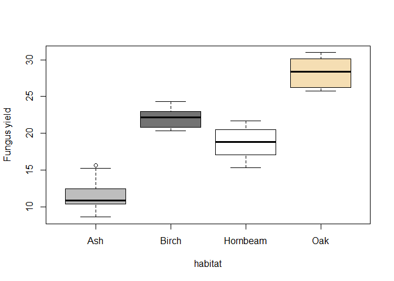 

```r
model = aov(Fugus.yield ~ Habitat)
summary(model) # yes, there is an effect of habitat on Fungus yield.
```

```
##             Df Sum Sq Mean Sq F value Pr(>F)    
## Habitat      3 1468.4   489.5     124 <2e-16 ***
## Residuals   36  142.1     3.9                   
## ---
## Signif. codes:  0 '***' 0.001 '**' 0.01 '*' 0.05 '.' 0.1 ' ' 1
```

```r
#let's check model assumptions:
par(mfrow = c(2, 2))
plot(model)
```

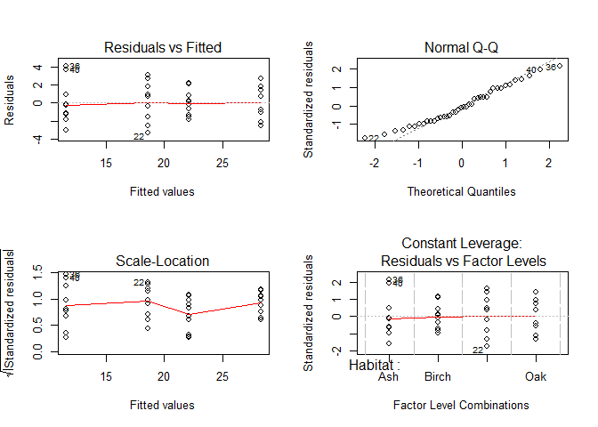 

```r
par(mfrow = c(1,1))

shapiro.test(model$residuals)
```

```
## 
## 	Shapiro-Wilk normality test
## 
## data:  model$residuals
## W = 0.96964, p-value = 0.3506
```

```r
bartlett.test(model$residuals ~ Habitat)
```

```
## 
## 	Bartlett test of homogeneity of variances
## 
## data:  model$residuals by Habitat
## Bartlett's K-squared = 2.2365, df = 3, p-value = 0.5248
```

```r
# normality and homogeneity are OK.


# let's run the post hoc test
TukeyHSD(model)
```

```
##   Tukey multiple comparisons of means
##     95% family-wise confidence level
## 
## Fit: aov(formula = Fugus.yield ~ Habitat)
## 
## $Habitat
##                     diff       lwr       upr     p adj
## Birch-Ash      10.580554  8.187574 12.973534 0.0000000
## Hornbeam-Ash    7.069783  4.676803  9.462763 0.0000000
## Oak-Ash        16.761646 14.368666 19.154626 0.0000000
## Hornbeam-Birch -3.510771 -5.903751 -1.117791 0.0018910
## Oak-Birch       6.181092  3.788112  8.574072 0.0000002
## Oak-Hornbeam    9.691863  7.298883 12.084843 0.0000000
```

```r
par(mar = c(5, 8, 5, 1))
plot(TukeyHSD(model), las = 1)
```

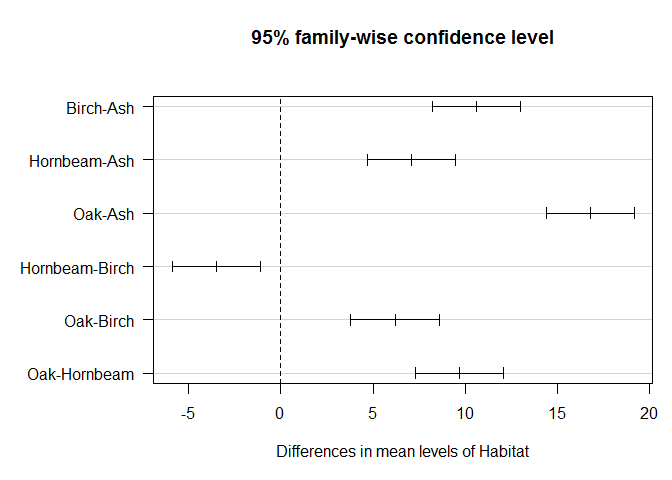 

```r
par(mar = c(5, 4, 4, 2))
detach(Fungi)

# the habitat has a clear influence on fungus yield. The Tukey post-hoc shows that all the multiple comparisons are statistically significant (p < 0.05), meaning that yield in oak forest is higher than those recorded in Birch, Hornbeam, and Ash forests, where the researcher recorded the lowest yield.
```


## Exercise 2 - Daphnia dataset
Data from a freshwater experiment carried out in the lab.
Growth rate measured in the lab on 36 daphnia sampled from 2 rivers of England (Tyne river and Wear river). The researcher who took the measurements wants to know whether Daphnia growth rate differs depending on which river they come from. 

Load the data, make a proper plot depicting the experiment, fit a statistical procedure and breifly describe your final results to the researcher. 


```r
daphnia <- read.delim("daphnia.txt")
head(daphnia)
```

```
##   Growth.rate Water
## 1    2.919086  Tyne
## 2    2.492904  Tyne
## 3    3.021804  Tyne
## 4    2.350874  Tyne
## 5    3.148174  Tyne
## 6    4.423853  Tyne
```

```r
attach(daphnia)

boxplot(Growth.rate ~ Water, ylab = "Daphnia growth rate", xlab = "River name", col = c("wheat", "beige"))
```

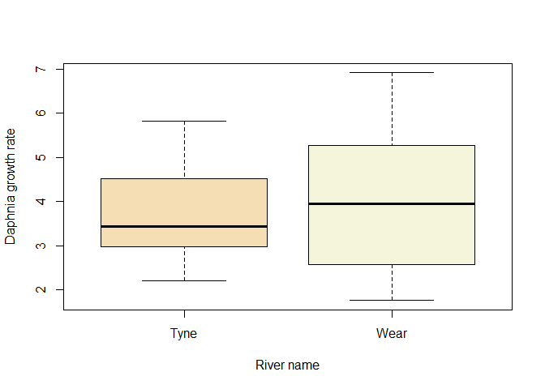 

```r
# check and test for normality
qqnorm(Growth.rate[Water == "Tyne"]);qqline(Growth.rate[Water == "Tyne"])
```

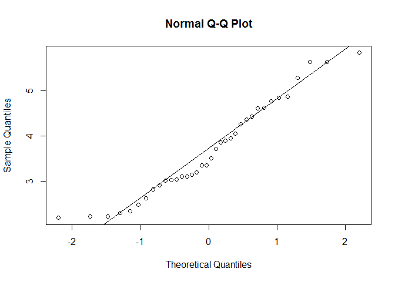 

```r
qqnorm(Growth.rate[Water == "Wear"]); qqline(Growth.rate[Water == "Wear"])
shapiro.test(Growth.rate[Water == "Tyne"])
```

```
## 
## 	Shapiro-Wilk normality test
## 
## data:  Growth.rate[Water == "Tyne"]
## W = 0.94836, p-value = 0.09285
```

```r
shapiro.test(Growth.rate[Water == "Wear"])
```

```
## 
## 	Shapiro-Wilk normality test
## 
## data:  Growth.rate[Water == "Wear"]
## W = 0.9492, p-value = 0.09868
```

```r
# normality does not look really good, even though we cannot reject the null hypothesis with the Shapiro test. Techically, if we stick to 0.05 significant level, our data are normally distributed. 

# let's test for  homogeneity.

library(car)
```

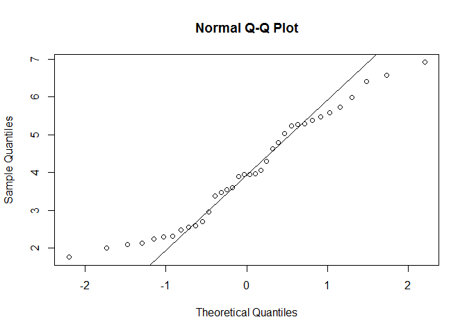 

```r
leveneTest(Growth.rate ~ Water)
```

```
## Levene's Test for Homogeneity of Variance (center = median)
##       Df F value  Pr(>F)  
## group  1   4.775 0.03223 *
##       70                  
## ---
## Signif. codes:  0 '***' 0.001 '**' 0.01 '*' 0.05 '.' 0.1 ' ' 1
```

```r
# there is a problem of heterogeneity as well. We prefer to fit the t test, thus taking care of the heterogeneity, rather than running a non-parametric procedure.

t.test(Growth.rate ~ Water, mu = 0, alt = "two.sided", conf = 0.95, var.eq = F, paired = F)
```

```
## 
## 	Welch Two Sample t-test
## 
## data:  Growth.rate by Water
## t = -1.0984, df = 63.189, p-value = 0.2762
## alternative hypothesis: true difference in means is not equal to 0
## 95 percent confidence interval:
##  -0.9362193  0.2720467
## sample estimates:
## mean in group Tyne mean in group Wear 
##           3.685862           4.017948
```

```r
detach(daphnia)

# there is no significant difference between the growth rates of daphnia sampled in the 2 different rivers. 
```


## Exercise 3 - Mule Deer population survey from North Dakota badlands, USA (part I)

Load the file Mule Deer.txt

```r
MD <- read.delim("Mule Deer.txt")
```

Data details:

1) study_site: 51 survey units spread across SW North Dakota. The size of each site is the same (50 km2).

2) md_spring: number of mule deer counted in spring.

3) md_fall: number of mule deer counted in fall.

4) fall_recruit: number of fawns per female (ratio) recorded in fall. 

5) coyote_density: number of coyotes per 100 km2 (ratio) recorded in spring.            

In simple words, researchers collected data on population size (md_spring) and predator presence (coyote_density) during the spring, then they collected population size (md_fall) and recruitment (fall_recruit) in the fall (autumn). 

Additionally, during the winter prior to the spring survey, the researcher gathered weather data that are proxy of winter severity

6) WSI: winter severity index.                     
7) Average_preci_winter (precipitation)     
8) Average_snowfall_winter  
9) Average_snowdepth_winter
10) Average_maxtemp_winter   
11) Average_mintemp_winter   
12) Average_NP_winter (north pacific index)       
13) Average_PDO_winter (pacific decadal oscillation)      
14) Average_MEI_winter (el nino multivariate index)    

Now. 
Reclassify study sites based on coyote density. In practice, add a column 'coyote' and assign 'low' to coyote densities lower than the median of coyote density, while assign 'high' to coyote densities equal or higher than the median of coyote density. Whatever procedure you use to get the new column 'coyote', make sure that eventually it is a factor column.

Make a plot of fall_recruit depending on Average_mintemp_winter. Data points should look different depending on the value of the column 'coyote', meaning that in the given study site - depending on the colour - there is a high or low coyote density. Add 2 linear fits to the plotted relationship: one for low coyote densities and one for high coyote densities. Include a proper legend 


```r
head(MD)
```

```
##   study_site md_spring md_fall fall_recruit coyote_density   WSI
## 1          1       398     264    0.9732143      24.385382 109.5
## 2          2       409     352    1.5289256       8.128461  82.0
## 3          3       473     543    1.2190476       8.128461 102.5
## 4          4       467     546    0.8260870       8.128461 158.0
## 5          5       459     488    1.2404372      43.351790 110.0
## 6          6       361     549    1.2307692      27.094869 115.0
##   Average_preci_winter Average_snowfall_winter Average_snowdepth_winter
## 1                 7.34                    69.6                 28.78157
## 2                14.70                    99.2                 22.62220
## 3                 2.98                    90.0                 32.34683
## 4                14.22                   193.0                201.15038
## 5                13.18                   128.4                 66.25453
## 6                13.82                   234.8                 34.59948
##   Average_maxtemp_winter Average_mintemp_winter Average_NP_winter
## 1              0.7562734              -16.08749            10.684
## 2              3.9900952              -11.70364             7.466
## 3              3.8251383              -12.84041             9.076
## 4             -2.3462949              -16.55879             9.884
## 5              2.7266052              -12.94432            11.274
## 6              2.3102965              -11.39476            10.958
##   Average_PDO_winter Average_MEI_winter
## 1             -1.680              14.00
## 2             -0.472              18.00
## 3             -0.846              42.25
## 4             -0.936              23.75
## 5             -0.534              56.75
## 6             -0.610              19.75
```

```r
MD$coyote = as.factor(ifelse(MD$coyote_density < median(MD$coyote_density), "low", "high"))

attach(MD)

plot(Average_mintemp_winter[coyote == "high"], fall_recruit[coyote == "high"], col = "red", pch = 20, xlim = c(-17, -8), ylim = c(0.5, 1.6), xlab = "Winter Min Temperature", ylab = "Fawn recruitment")
points(Average_mintemp_winter[coyote == "low"], fall_recruit[coyote == "low"], col = "black", pch = 20)

abline(lm(fall_recruit[coyote == "high"] ~ Average_mintemp_winter[coyote == "high"]), col = "red")
abline(lm(fall_recruit[coyote == "low"] ~ Average_mintemp_winter[coyote == "low"]), col = "black")

legend("topleft", legend = c("High", "Low"), col = c("red", "black"), pch = c("_", "_"), bty = "n", cex = 1, title = "Coyote density")
```

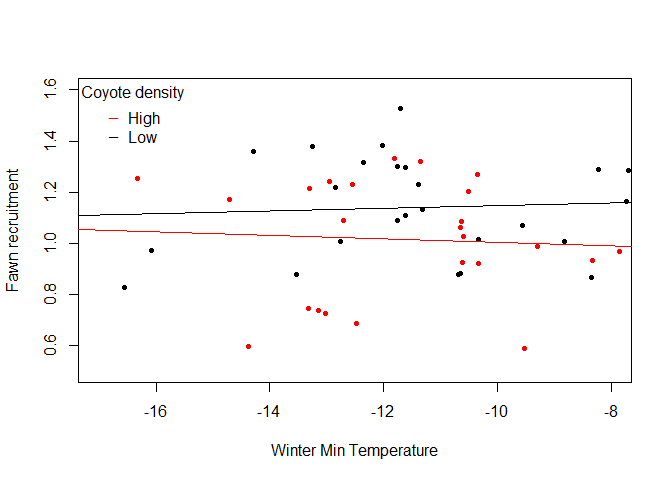 

Fit a simple linear model taking the following structure: 

fall_recruit ~ (md_spring + Average_mintemp_winter + coyote_density)^2 + I(md_spring^2) + I(Average_mintemp_winter^2) + I(coyote_density^2)

Select the best model structure using the step function. 
Plot the effects of the best model using the library effects.
What is your interpretation of the interaction term in this model?
Does the best model meet the assumptions of linear models?


```r
model = lm(fall_recruit ~ (md_spring + Average_mintemp_winter + coyote_density)^2 + I(md_spring^2) + I(Average_mintemp_winter^2) + I(coyote_density^2), MD) 

step(model)
```

```
## Start:  AIC=-174.25
## fall_recruit ~ (md_spring + Average_mintemp_winter + coyote_density)^2 + 
##     I(md_spring^2) + I(Average_mintemp_winter^2) + I(coyote_density^2)
## 
##                                         Df Sum of Sq    RSS     AIC
## - I(coyote_density^2)                    1  0.001253 1.1322 -176.19
## - md_spring:Average_mintemp_winter       1  0.009237 1.1402 -175.83
## - md_spring:coyote_density               1  0.016505 1.1475 -175.51
## - I(md_spring^2)                         1  0.033092 1.1641 -174.78
## - Average_mintemp_winter:coyote_density  1  0.033787 1.1647 -174.75
## - I(Average_mintemp_winter^2)            1  0.036792 1.1678 -174.61
## <none>                                               1.1310 -174.25
## 
## Step:  AIC=-176.19
## fall_recruit ~ md_spring + Average_mintemp_winter + coyote_density + 
##     I(md_spring^2) + I(Average_mintemp_winter^2) + md_spring:Average_mintemp_winter + 
##     md_spring:coyote_density + Average_mintemp_winter:coyote_density
## 
##                                         Df Sum of Sq    RSS     AIC
## - md_spring:Average_mintemp_winter       1  0.008159 1.1404 -177.82
## - md_spring:coyote_density               1  0.015349 1.1476 -177.50
## - Average_mintemp_winter:coyote_density  1  0.033681 1.1659 -176.69
## - I(Average_mintemp_winter^2)            1  0.035542 1.1678 -176.61
## - I(md_spring^2)                         1  0.037125 1.1693 -176.54
## <none>                                               1.1322 -176.19
## 
## Step:  AIC=-177.82
## fall_recruit ~ md_spring + Average_mintemp_winter + coyote_density + 
##     I(md_spring^2) + I(Average_mintemp_winter^2) + md_spring:coyote_density + 
##     Average_mintemp_winter:coyote_density
## 
##                                         Df Sum of Sq    RSS     AIC
## - md_spring:coyote_density               1  0.013605 1.1540 -179.22
## - Average_mintemp_winter:coyote_density  1  0.027759 1.1681 -178.60
## - I(Average_mintemp_winter^2)            1  0.029370 1.1697 -178.53
## <none>                                               1.1404 -177.82
## - I(md_spring^2)                         1  0.056792 1.1972 -177.34
## 
## Step:  AIC=-179.22
## fall_recruit ~ md_spring + Average_mintemp_winter + coyote_density + 
##     I(md_spring^2) + I(Average_mintemp_winter^2) + Average_mintemp_winter:coyote_density
## 
##                                         Df Sum of Sq    RSS     AIC
## - I(Average_mintemp_winter^2)            1  0.031076 1.1850 -179.86
## <none>                                               1.1540 -179.22
## - I(md_spring^2)                         1  0.047120 1.2011 -179.18
## - Average_mintemp_winter:coyote_density  1  0.048914 1.2029 -179.10
## - md_spring                              1  0.188530 1.3425 -173.50
## 
## Step:  AIC=-179.86
## fall_recruit ~ md_spring + Average_mintemp_winter + coyote_density + 
##     I(md_spring^2) + Average_mintemp_winter:coyote_density
## 
##                                         Df Sum of Sq    RSS     AIC
## <none>                                               1.1850 -179.86
## - I(md_spring^2)                         1  0.053183 1.2382 -179.62
## - Average_mintemp_winter:coyote_density  1  0.076437 1.2615 -178.68
## - md_spring                              1  0.203060 1.3881 -173.80
```

```
## 
## Call:
## lm(formula = fall_recruit ~ md_spring + Average_mintemp_winter + 
##     coyote_density + I(md_spring^2) + Average_mintemp_winter:coyote_density, 
##     data = MD)
## 
## Coefficients:
##                           (Intercept)  
##                             2.302e+00  
##                             md_spring  
##                            -4.551e-04  
##                Average_mintemp_winter  
##                             6.719e-02  
##                        coyote_density  
##                            -1.070e-02  
##                        I(md_spring^2)  
##                             7.357e-08  
## Average_mintemp_winter:coyote_density  
##                            -9.452e-04
```

```r
bestmodel = lm(fall_recruit ~ md_spring + Average_mintemp_winter + 
    coyote_density + I(md_spring^2) + Average_mintemp_winter:coyote_density, 
    data = MD)

library(effects)
```

```
## 
## Attaching package: 'effects'
## 
## The following object is masked from 'package:car':
## 
##     Prestige
```

```r
myplot = effect("md_spring", bestmodel)
plot(myplot) 
```

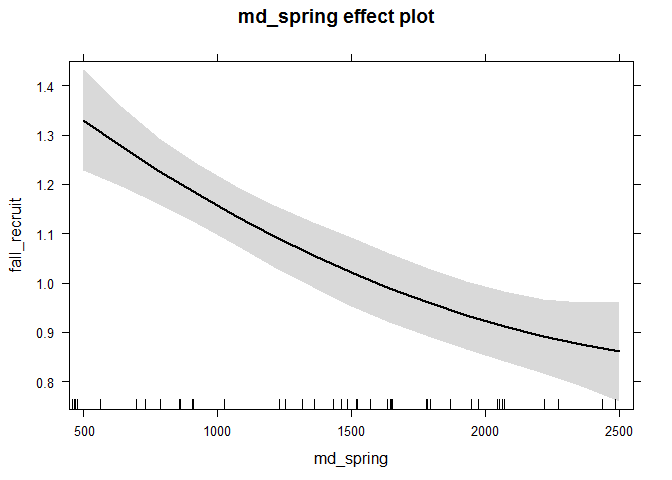 

```r
myplot = effect("Average_mintemp_winter * coyote_density", bestmodel)
plot(myplot)
```

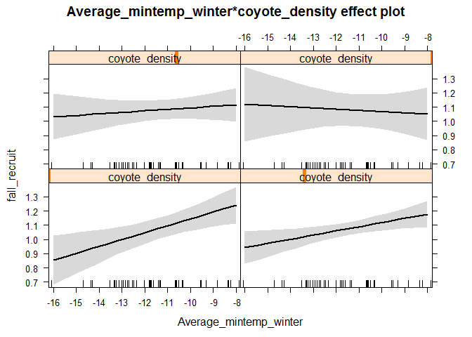 

```r
# When coyote density is low, warmer winters facilitate higher recruitment rates eventually recorded in the autumn. This is not true when coyote densities are higher, when the warmer winters have no longer positive effects on recruitment becasue of the contrasting predator pressure.

par(mfrow = c(2,2))
plot(bestmodel)
```

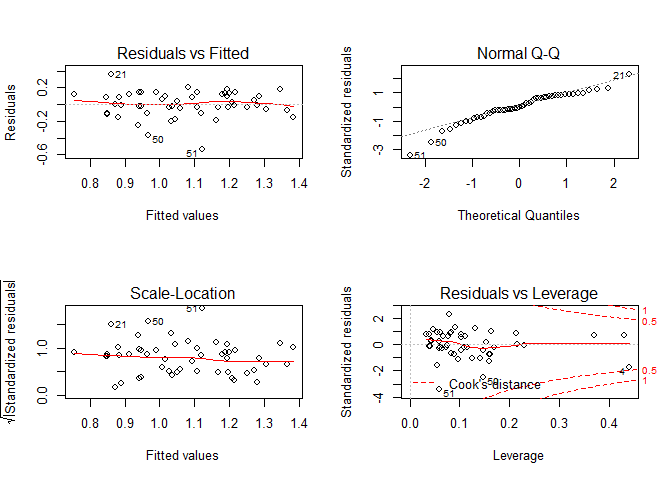 

```r
par(mfrow = c(1,1))


#normality is weak
shapiro.test(bestmodel$residuals)
```

```
## 
## 	Shapiro-Wilk normality test
## 
## data:  bestmodel$residuals
## W = 0.94386, p-value = 0.01759
```

```r
# some of the influential values (cook plots) are a problem here.

# homogeneity does not look bad from the residual plot.
plot(md_spring, bestmodel$residuals); abline(h = 0)
```

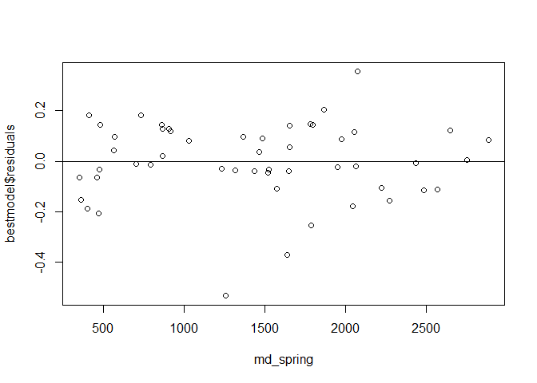 

```r
plot(Average_mintemp_winter, bestmodel$residuals); abline(h = 0)
```

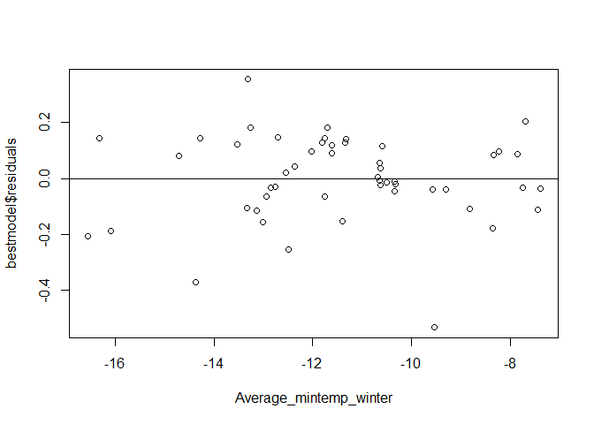 

```r
plot(coyote_density, bestmodel$residuals); abline(h = 0)
```

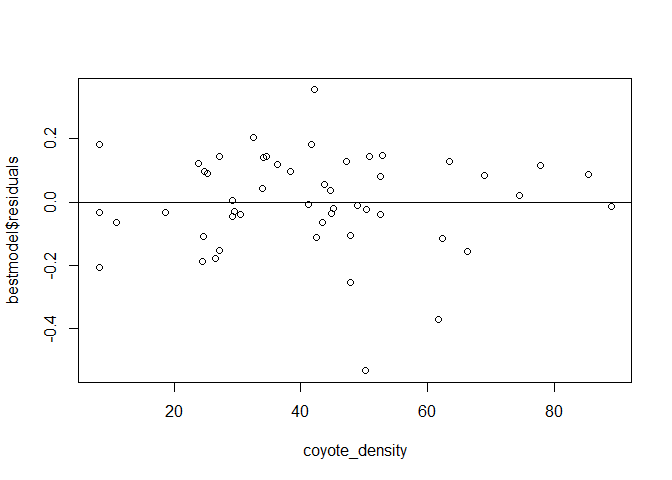 

```r
#Tthere are no clear patterns in the residuals.  

# In general, we have seen way worse models in class. This one is not that bad, although normality could be improved and homogeneity better achieved by increasing sample size and/or adding predictors. 


detach(MD)
```


## Exercise 4 - Mule Deer population survey from North Dakota badlands, USA (part II)

Same MD dataset introduced in exercise 3.

Response variable: fall_recruit.
All the others: potential predictors. 

Check and test for collinearity in the predictors.


```r
source("collinearity check.r")  #loading useful functions

#bind together the columns of interest
attach(MD)
Z = cbind(fall_recruit, md_fall, md_spring, coyote_density, WSI, Average_preci_winter, Average_snowfall_winter, Average_snowdepth_winter, Average_maxtemp_winter, Average_mintemp_winter, Average_NP_winter, Average_PDO_winter, Average_MEI_winter )

pairs(Z, lower.panel = panel.smooth2,
      upper.panel = panel.cor, diag.panel = panel.hist)
```

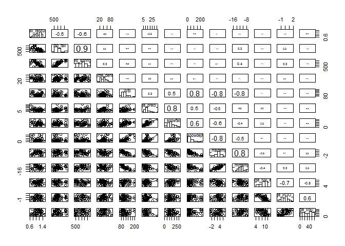 

```r
# weather data collected in the winter have serious problems of collinearity (see 0.8 and -0.8 in the pairs plot)
# also NP and PDO are collinear.

# strong collinearity patters are confirmed by the VIF
corvif(Z[,-1])
```

```
## 
## 
## Variance inflation factors
```

```
## Warning in summary.lm(object): essentially perfect fit: summary may be
## unreliable
```

```
##                              GVIF
## md_fall                  4.780229
## md_spring                5.173967
## coyote_density           1.279399
## WSI                      5.037035
## Average_preci_winter     2.730269
## Average_snowfall_winter  3.857258
## Average_snowdepth_winter 5.006310
## Average_maxtemp_winter   8.130708
## Average_mintemp_winter   5.146150
## Average_NP_winter        3.618909
## Average_PDO_winter       4.058589
## Average_MEI_winter       1.843719
```

```r
detach(MD)
```


Run a Principal Component Analysis for the winter weather predictors:
["WSI", "Average_preci_winter", "Average_snowfall_winter", "Average_snowdepth_winter", "Average_maxtemp_winter", "Average_mintemp_winter"]


What variables have positive loadings on the first axis (PC1), and which ones negative loadings?

How many PC axes you would need to explain at least 90% of the variability of these 6 winter weather predictors? 

Add 2 columns to the MD dataset corresponding to the values of the first and the second axes (PC1 and PC2).


```r
newdata = MD[, c("WSI", "Average_preci_winter", "Average_snowfall_winter", "Average_snowdepth_winter", "Average_maxtemp_winter", "Average_mintemp_winter")]
myPCA = prcomp(newdata, scale = TRUE)
summary(myPCA)    
```

```
## Importance of components:
##                           PC1    PC2     PC3     PC4     PC5     PC6
## Standard deviation     2.0172 1.0404 0.59200 0.47083 0.41105 0.32752
## Proportion of Variance 0.6782 0.1804 0.05841 0.03695 0.02816 0.01788
## Cumulative Proportion  0.6782 0.8586 0.91701 0.95396 0.98212 1.00000
```

```r
biplot(myPCA, main = "example of PCA ", cex = 0.5)
```

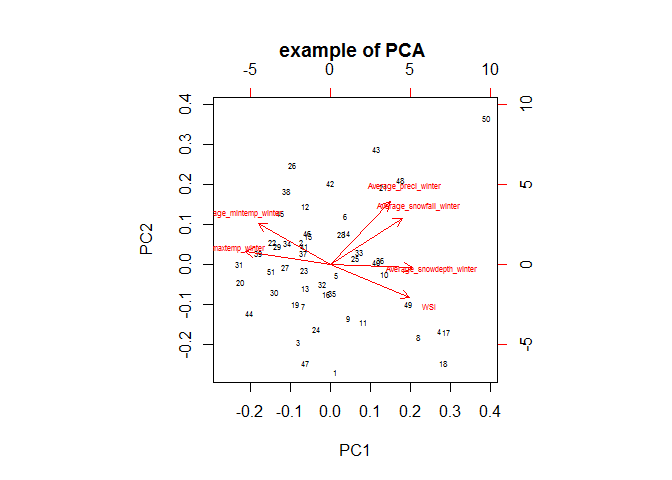 

```r
#Precipitations, WSI, snowfall and snowdepth have positive loadings on pc1, while max temp and min temp have negative loadings.

#we need the first 3 axes (PC1, PC2, and PC3 to explain at least 90% of variability)
MD$PC1 = predict(myPCA)[,1]      
MD$PC2 = predict(myPCA)[,2] 
```


## Exercise 5 - Mule Deer population survey from North Dakota badlands, USA (part III) 
Same dataset introduced in exercise 3. MD


Response variable: md_fall (population size in autumn).

Predictors: coyote_density, Average_mintemp_winter.


Fit the proper model to explain the variability of population size in autumn (number of mule deer counted in autumn) with the 2 predictors provided. Include quadratic effects and interactions. Use the dredge from MuMIn to select the best model.


```r
model = glm(md_fall ~ I(coyote_density^2) +  I(Average_mintemp_winter^2) + coyote_density * Average_mintemp_winter, data = MD, family = poisson)
library(MuMIn)
options(na.action = "na.fail")
mydredge = dredge(model)
```

```
## Fixed term is "(Intercept)"
```

```r
head(mydredge)
```

```
## Global model call: glm(formula = md_fall ~ I(coyote_density^2) + I(Average_mintemp_winter^2) + 
##     coyote_density * Average_mintemp_winter, family = poisson, 
##     data = MD)
## ---
## Model selection table 
##    (Int) Avr_mnt_wnt Avr_mnt_wnt^2 cyt_dns  cyt_dns^2 Avr_mnt_wnt:cyt_dns
## 32 4.311    -0.26620     -0.009893 0.07368 -0.0004189           0.0026740
## 30 5.635    -0.03055               0.07122 -0.0004261           0.0023630
## 16 6.022    -0.09998     -0.007449 0.03486 -0.0003158                    
## 15 6.554                 -0.003059 0.03555 -0.0003221                    
## 14 6.900     0.06738               0.03600 -0.0003260                    
## 24 5.934    -0.20120     -0.010670 0.01106                      0.0006042
##    df    logLik    AICc   delta
## 32  6 -4639.186  9292.3    0.00
## 30  5 -4729.368  9470.1  177.79
## 16  5 -4885.229  9781.8  489.51
## 15  4 -4903.322  9815.5  523.23
## 14  4 -4937.107  9883.1  590.80
## 24  5 -5390.670 10792.7 1500.39
## Models ranked by AICc(x)
```

```r
# the best model is our model. no need to remove any terms or interaction.
```

Does this model have problems? do we meet the assumptios?


```r
summary(model)
```

```
## 
## Call:
## glm(formula = md_fall ~ I(coyote_density^2) + I(Average_mintemp_winter^2) + 
##     coyote_density * Average_mintemp_winter, family = poisson, 
##     data = MD)
## 
## Deviance Residuals: 
##     Min       1Q   Median       3Q      Max  
## -20.819  -10.518   -2.556    4.105   42.883  
## 
## Coefficients:
##                                         Estimate Std. Error z value
## (Intercept)                            4.311e+00  1.231e-01   35.03
## I(coyote_density^2)                   -4.189e-04  1.126e-05  -37.20
## I(Average_mintemp_winter^2)           -9.893e-03  7.480e-04  -13.23
## coyote_density                         7.368e-02  2.048e-03   35.97
## Average_mintemp_winter                -2.662e-01  1.856e-02  -14.34
## coyote_density:Average_mintemp_winter  2.674e-03  1.212e-04   22.07
##                                       Pr(>|z|)    
## (Intercept)                             <2e-16 ***
## I(coyote_density^2)                     <2e-16 ***
## I(Average_mintemp_winter^2)             <2e-16 ***
## coyote_density                          <2e-16 ***
## Average_mintemp_winter                  <2e-16 ***
## coyote_density:Average_mintemp_winter   <2e-16 ***
## ---
## Signif. codes:  0 '***' 0.001 '**' 0.01 '*' 0.05 '.' 0.1 ' ' 1
## 
## (Dispersion parameter for poisson family taken to be 1)
## 
##     Null deviance: 12251.8  on 50  degrees of freedom
## Residual deviance:  8834.7  on 45  degrees of freedom
## AIC: 9290.4
## 
## Number of Fisher Scoring iterations: 4
```

```r
# the dispersion parameter is 8834.7 / 45 = 196.
# this means that we cannot deal with such overdispersion, and we should fit a Negative Binomial model. 

#if somebody decided to go for a quasi-Poisson, fine. However, you know from our in-class discussions that moving to Negative Binomila would be our first choice here. 
```


## Exercise 6 - Students' awards (OPTIONAL)

Our response variable here is the number of awards earned by students at one high school. Predictors of the number of awards earned include the type of program (prog) in which the student was enrolled (e.g., vocational, general or academic: prog is a categorical predictor variable with three levels indicating the type of program in which the students were enrolled) and the score on their final exam in math.

Run the script to get the data.


```r
load("p.RData")
head(p)
```

```
##    id num_awards prog math
## 1  45          0    3   41
## 2 108          0    1   41
## 3  15          0    3   44
## 4  67          0    3   42
## 5 153          0    3   40
## 6  51          0    1   42
```

```r
p$id = factor(p$id)
p$prog = factor(p$prog, levels=1:3, labels=c("General", "Academic", "Vocational"))
head(p)
```

```
##    id num_awards       prog math
## 1  45          0 Vocational   41
## 2 108          0    General   41
## 3  15          0 Vocational   44
## 4  67          0 Vocational   42
## 5 153          0 Vocational   40
## 6  51          0    General   42
```

```r
summary(p)
```

```
##        id        num_awards           prog          math      
##  1      :  1   Min.   :0.00   General   : 45   Min.   :33.00  
##  2      :  1   1st Qu.:0.00   Academic  :105   1st Qu.:45.00  
##  3      :  1   Median :0.00   Vocational: 50   Median :52.00  
##  4      :  1   Mean   :0.63                    Mean   :52.65  
##  5      :  1   3rd Qu.:1.00                    3rd Qu.:59.00  
##  6      :  1   Max.   :6.00                    Max.   :75.00  
##  (Other):194
```

Plot the data and fit the proper model with prog, math, and the interaction prog*math as predictors and num_awards as response variable. Based on a backward stepwise selection procedure, remove model terms accordingly. 
Do you meet model assumptions?


```r
plot(p$math,p$num_awards,xlab="Math Score",
     ylab="Number of awards",col=p$prog)
```

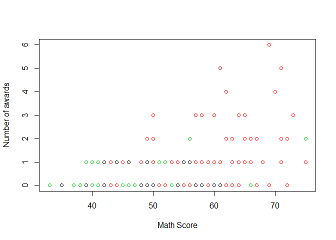 

```r
m1 = glm(num_awards ~ prog * math, family = "poisson", data = p)
m2 = glm(num_awards ~ prog + math, family = "poisson", data = p)

# stepwise selection is over already, it is enough removing the interactions. An option would have been re-classifying the categorical predictor (for the sake of parsimony), but it is more a personal choice here. I do not do it here, and keep m2 as the best. You guys might have done it differently.

summary(m2)
```

```
## 
## Call:
## glm(formula = num_awards ~ prog + math, family = "poisson", data = p)
## 
## Deviance Residuals: 
##     Min       1Q   Median       3Q      Max  
## -2.2043  -0.8436  -0.5106   0.2558   2.6796  
## 
## Coefficients:
##                Estimate Std. Error z value Pr(>|z|)    
## (Intercept)    -5.24712    0.65845  -7.969 1.60e-15 ***
## progAcademic    1.08386    0.35825   3.025  0.00248 ** 
## progVocational  0.36981    0.44107   0.838  0.40179    
## math            0.07015    0.01060   6.619 3.63e-11 ***
## ---
## Signif. codes:  0 '***' 0.001 '**' 0.01 '*' 0.05 '.' 0.1 ' ' 1
## 
## (Dispersion parameter for poisson family taken to be 1)
## 
##     Null deviance: 287.67  on 199  degrees of freedom
## Residual deviance: 189.45  on 196  degrees of freedom
## AIC: 373.5
## 
## Number of Fisher Scoring iterations: 6
```

```r
#overdispersion
m1$deviance/m1$df.residual  #it looks pretty good
```

```
## [1] 0.9747506
```

```r
par(mfrow = c(2, 2))
plot(m1)
```

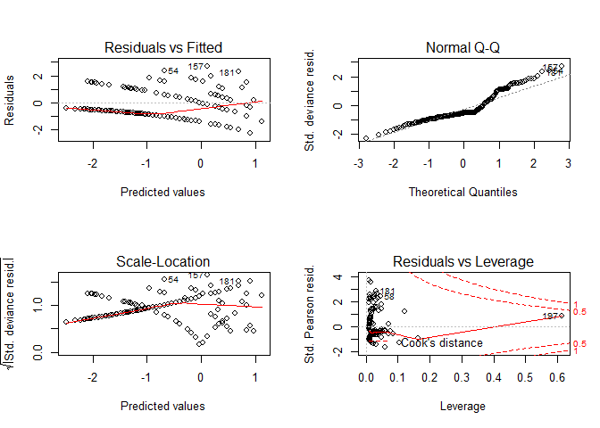 

```r
par(mfrow = c(1, 1))
plot(m2$residuals ~ p$prog)
```

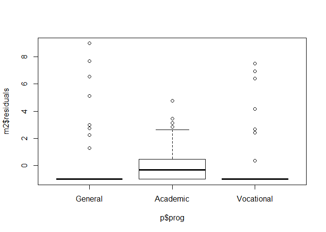 

```r
plot(m2$residuals ~ p$math)
```

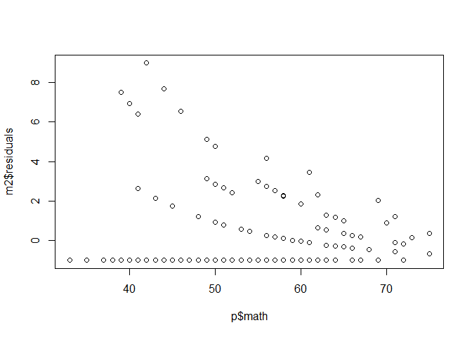 

```r
#serious problems with heterogeneity, influencial values, and normality of the linear fit on log-link transformed data. 
```

what is the amount of variability explained by this model?


```r
100*(m2$null.deviance-m2$deviance)/m2$null.deviance
```

```
## [1] 34.14393
```

Plot maually the predictions of the model. 
math score on the x-axis, number of awards on the y axis, and predictions for the 3 different programs.


```r
MyData = data.frame(math = seq(from = 33, to = 75,length = 1000),prog = "General")
G = predict(m2, newdata = MyData, type = "response", se = T)
plot(p$math, p$num_awards, xlab="Math Score",
     ylab = "NUmber of awards",col = c("red", "blue", "black"), pch = 20)
lines(MyData$math, G$fit, lty = 1, col = "red")
lines(MyData$math, G$fit + 1.96*G$se.fit, lty = 2, col = "red")
lines(MyData$math, G$fit - 1.96*G$se.fit, lty = 2, col = "red")

MyData = data.frame(math = seq(from = 33, to = 75,length = 1000),prog = "Academic")
G = predict(m2, newdata = MyData, type = "response", se = T)
lines(MyData$math, G$fit, lty = 1, col = "blue")
lines(MyData$math, G$fit + 1.96*G$se.fit, lty = 2, col = "blue")
lines(MyData$math, G$fit - 1.96*G$se.fit, lty = 2, col = "blue")

MyData = data.frame(math = seq(from = 33, to = 75,length = 1000),prog = "Vocational")
G = predict(m2, newdata = MyData, type = "response", se = T)
lines(MyData$math, G$fit, lty = 1, col = "black")
lines(MyData$math, G$fit + 1.96*G$se.fit, lty = 2, col = "black")
lines(MyData$math, G$fit - 1.96*G$se.fit, lty = 2, col = "black")

legend("topleft", legend = c("General", "Academic", "Vocational"), col = c("red", "blue", "black"), pch = c(20, 20, 20), bty = "n", cex = 1.2) 
```

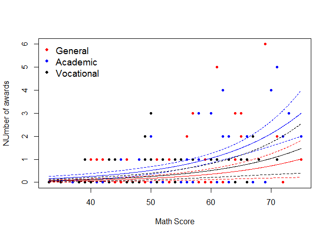 

Briefly explain your final results. 


```r
#Students coming from the Academic program and those with high math scores are predicted to get more awards. However, the model has serious issues of heterogeneity and cannot be trusted as a valid model. More data analyses are required here to get a proper model.
```


