# Intro to exploratory stat (basic plotting)


```r
setwd("~/TEACHING IN FREIBURG/11 - Statistics with R fall 2015/2_intro to very basic exploratory statistics") #set working directory
```


## Tips to better handle plots in R
graphics.off()  # shuts down all open graphics devices.
x11(h = 12, w = 12)  # opens a new plotting window 12 by 12
plot(mtcars)
savePlot(filename="myplot",type="wmf", device=dev.cur()) # save the plot (metafile), but it can be a pdf, bmp ect.
savePlot(filename="myplot1",type="pdf", device=dev.cur())


## Bar Charts 
appropriate for summarizing the distribution of a categorical variable


```r
# basic data handling - let's convert am into a factor (new column fam)
head(mtcars)
```

```
##                    mpg cyl disp  hp drat    wt  qsec vs am gear carb
## Mazda RX4         21.0   6  160 110 3.90 2.620 16.46  0  1    4    4
## Mazda RX4 Wag     21.0   6  160 110 3.90 2.875 17.02  0  1    4    4
## Datsun 710        22.8   4  108  93 3.85 2.320 18.61  1  1    4    1
## Hornet 4 Drive    21.4   6  258 110 3.08 3.215 19.44  1  0    3    1
## Hornet Sportabout 18.7   8  360 175 3.15 3.440 17.02  0  0    3    2
## Valiant           18.1   6  225 105 2.76 3.460 20.22  1  0    3    1
```

```r
mtcars$fam=factor(mtcars$am, levels=c(0,1), labels=c("automatic","manual"))
head(mtcars)
```

```
##                    mpg cyl disp  hp drat    wt  qsec vs am gear carb
## Mazda RX4         21.0   6  160 110 3.90 2.620 16.46  0  1    4    4
## Mazda RX4 Wag     21.0   6  160 110 3.90 2.875 17.02  0  1    4    4
## Datsun 710        22.8   4  108  93 3.85 2.320 18.61  1  1    4    1
## Hornet 4 Drive    21.4   6  258 110 3.08 3.215 19.44  1  0    3    1
## Hornet Sportabout 18.7   8  360 175 3.15 3.440 17.02  0  0    3    2
## Valiant           18.1   6  225 105 2.76 3.460 20.22  1  0    3    1
##                         fam
## Mazda RX4            manual
## Mazda RX4 Wag        manual
## Datsun 710           manual
## Hornet 4 Drive    automatic
## Hornet Sportabout automatic
## Valiant           automatic
```


```r
attach(mtcars)
table(fam) #frequency table
```

```
## fam
## automatic    manual 
##        19        13
```

```r
#let's store it in a object
count = table(fam)
count
```

```
## fam
## automatic    manual 
##        19        13
```

```r
#let's compute frequencies %
percent = table(fam) / length(fam)
percent
```

```
## fam
## automatic    manual 
##   0.59375   0.40625
```

```r
barplot(count)
```

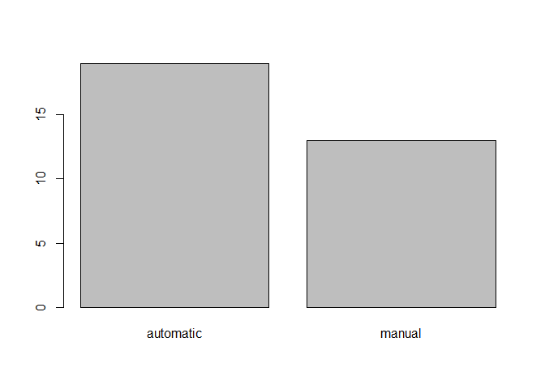 

```r
barplot(percent)
```

 

```r
#let's add a title
barplot(percent, main="the title", xlab="transmission", ylab="%", las=1, ylim=c(0,1), names.arg=c("aut transm", "man transm") )
```

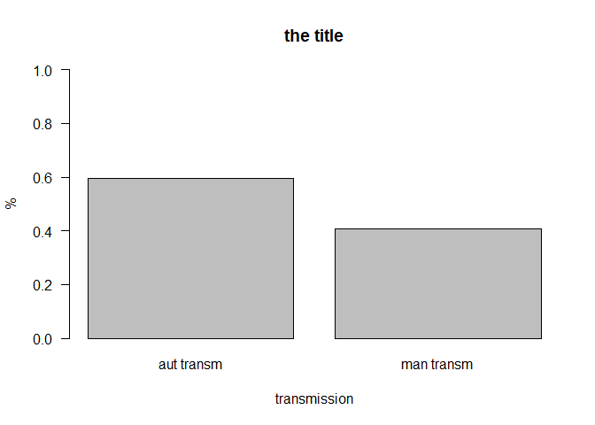 

## Pie Charts


```r
pie(count, main="the title", col=c(2,3))
box()
```

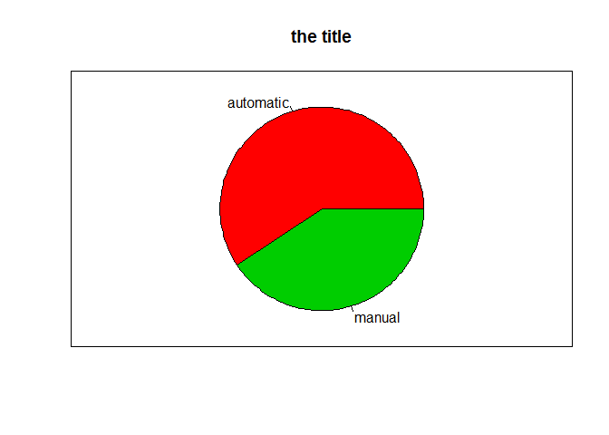 

?pie 
?barchart

-> homework: change the look of these plots. just google it!

## boxplot
appropirate to summarize the distribution of a numerical variable
type ?boxplot


```r
summary(mpg)
```

```
##    Min. 1st Qu.  Median    Mean 3rd Qu.    Max. 
##   10.40   15.42   19.20   20.09   22.80   33.90
```

```r
quantile(mpg)
```

```
##     0%    25%    50%    75%   100% 
## 10.400 15.425 19.200 22.800 33.900
```

```r
quantile(mpg,probs=c(0, 0.25, 0.50, 0.75,1))
```

```
##     0%    25%    50%    75%   100% 
## 10.400 15.425 19.200 22.800 33.900
```

```r
boxplot(mpg,main="title", ylab="mpg", ylim=c(0,50), las=1)
```

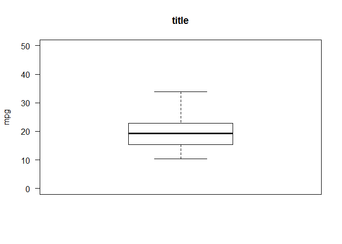 

```r
boxplot(mpg~fam, main="MPG by transmission")
```

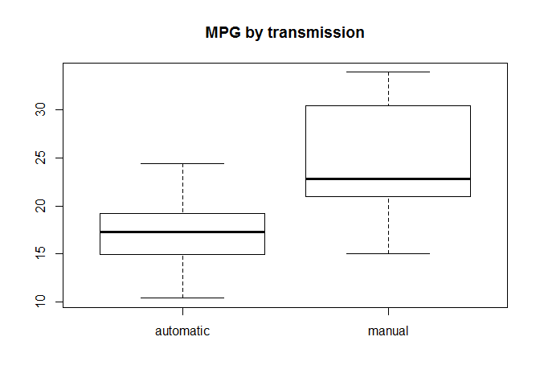 

```r
boxplot(mpg[fam=="automatic"])
```

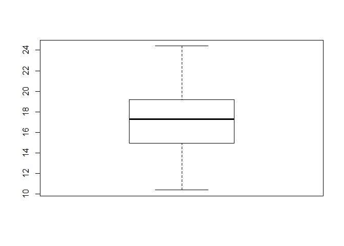 


## histograms
appropriate for summarizing the distribution of a numerical variable 
WARNING(!!) -> depending on the number of breaks (or bins), histograms look very differently. Not always a good tool! 


```r
hist(mpg)
```

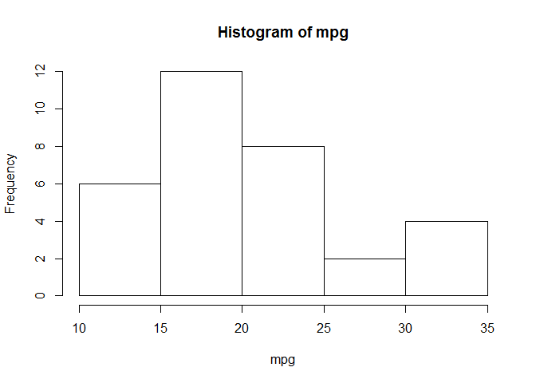 

```r
hist(mpg, freq=FALSE, main="my histogram")
```

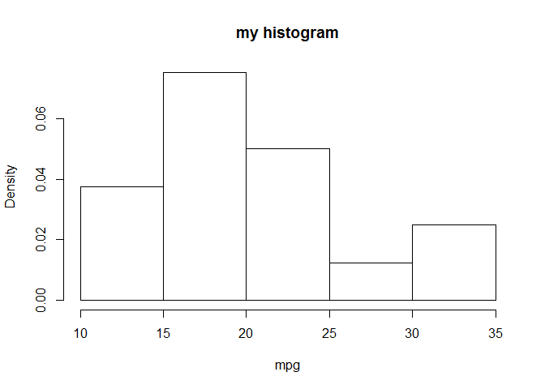 

```r
hist(mpg, prob=TRUE, ylim=c(0,0.1))
lines(density(mpg))  #add a density curve
lines(density(mpg), col="red", lwd=3)
```

 

```r
hist(mpg, breaks = seq(10,36, by=2), las=1)
```

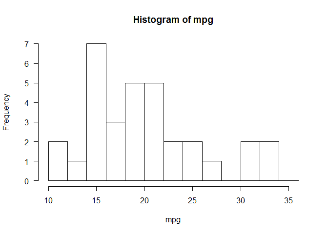 


## scatterplots
appropriate to examine the relation between two numerical variables
 
 
Relationship between horsepower hp and consumption mpg

```r
plot(mpg ~ hp) # y~x form
```

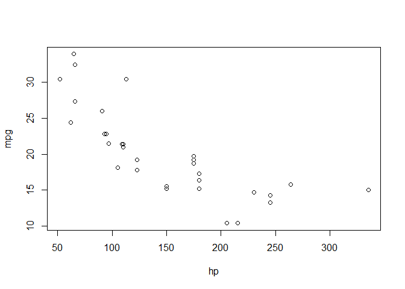 

```r
plot(hp, mpg) # x,y form
```

 

```r
plot(hp, mpg, xlab = "Gross horsepower", ylab="Miles/(US) gallon", las = 1, col = "red", xlim = c(0,400), cex = 2 )  #cex (plotting characters size times 2)
```

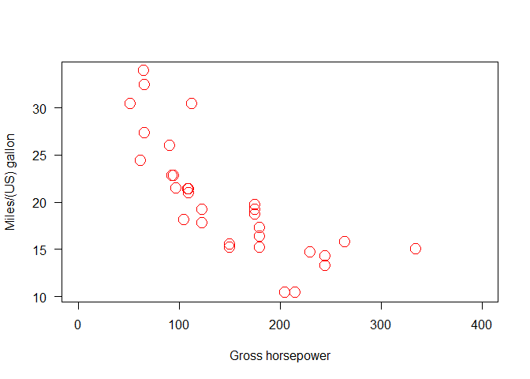 

```r
plot(hp, mpg, xlab = "Gross horsepower", ylab="Miles/(US) gallon", las = 1,col = "red", xlim = c(0,400), pch = 8)  #pch (plotting symbol)

abline(lm(mpg ~ hp), col="blue", lwd=5, lty=3) #add linear regression, line width and type
```

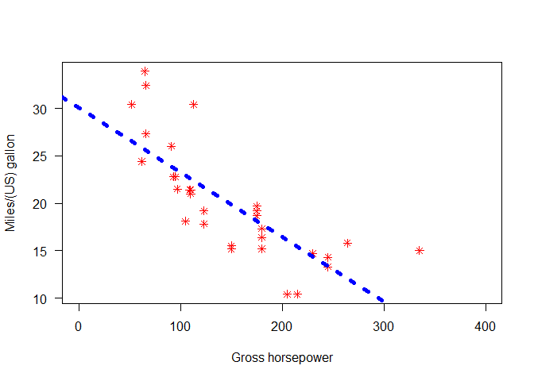 

```r
x = 1:20
plot(x, pch = x, cex = 3)
```

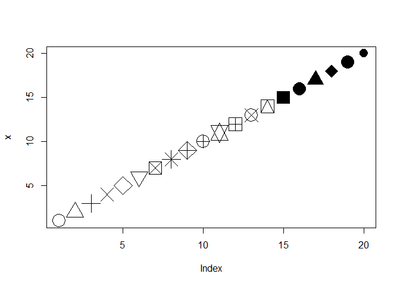 

```r
plot(x, col = x, cex = 3)
```

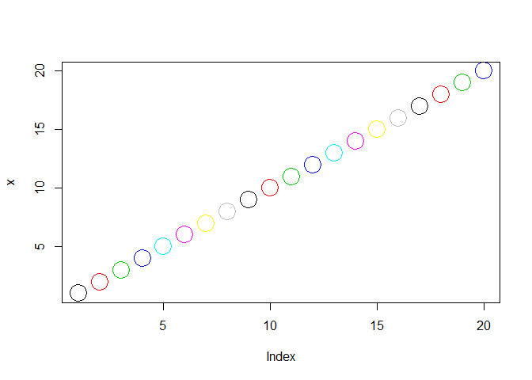 

```r
plot(x, col = x, cex = x)
```

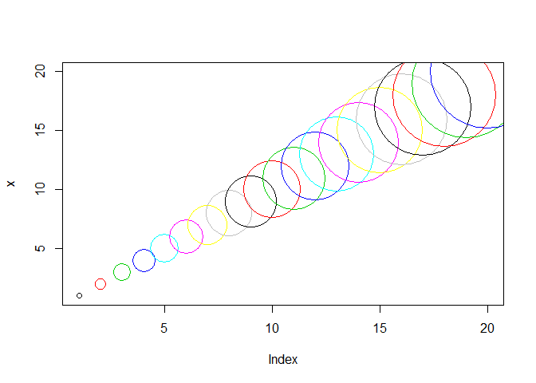 


## summary statistics

categorical variable fam

```r
table(fam)
```

```
## fam
## automatic    manual 
##        19        13
```

```r
table(fam)/length(fam)
```

```
## fam
## automatic    manual 
##   0.59375   0.40625
```

```r
#contingency table (2-way table)
table(mpg,fam)
```

```
##       fam
## mpg    automatic manual
##   10.4         2      0
##   13.3         1      0
##   14.3         1      0
##   14.7         1      0
##   15           0      1
##   15.2         2      0
##   15.5         1      0
##   15.8         0      1
##   16.4         1      0
##   17.3         1      0
##   17.8         1      0
##   18.1         1      0
##   18.7         1      0
##   19.2         2      0
##   19.7         0      1
##   21           0      2
##   21.4         1      1
##   21.5         1      0
##   22.8         1      1
##   24.4         1      0
##   26           0      1
##   27.3         0      1
##   30.4         0      2
##   32.4         0      1
##   33.9         0      1
```

```r
table(fam,mpg)
```

```
##            mpg
## fam         10.4 13.3 14.3 14.7 15 15.2 15.5 15.8 16.4 17.3 17.8 18.1 18.7
##   automatic    2    1    1    1  0    2    1    0    1    1    1    1    1
##   manual       0    0    0    0  1    0    0    1    0    0    0    0    0
##            mpg
## fam         19.2 19.7 21 21.4 21.5 22.8 24.4 26 27.3 30.4 32.4 33.9
##   automatic    2    0  0    1    1    1    1  0    0    0    0    0
##   manual       0    1  2    1    0    1    0  1    1    2    1    1
```

numerical variable mpg

```r
mean(mpg)
```

```
## [1] 20.09062
```

```r
summary(mpg)
```

```
##    Min. 1st Qu.  Median    Mean 3rd Qu.    Max. 
##   10.40   15.42   19.20   20.09   22.80   33.90
```

```r
sd(mpg)
```

```
## [1] 6.026948
```

```r
var(mpg)
```

```
## [1] 36.3241
```

```r
sqrt(var(mpg)) # = to sd
```

```
## [1] 6.026948
```

```r
sd(mpg)^2 # = to variance
```

```
## [1] 36.3241
```

```r
max(mpg)
```

```
## [1] 33.9
```

```r
tapply(mpg,fam,mean)
```

```
## automatic    manual 
##  17.14737  24.39231
```

```r
tapply(mpg,list(fam,gear),mean)
```

```
##                  3      4     5
## automatic 16.10667 21.050    NA
## manual          NA 26.275 21.38
```


-> IN CLASS EXERCISES 1_introEXERCISES.txt

+++++++++++++++++
Edited by Simone Ciuti, University of Freiburg, 9/10/2014; 
Intended for the only purpose of teaching @ Freiburg University
+++++++++++++++++++++++++++++++++++++++++++++++++
