# Changing the look of your plots

## Changing the look of plots

```r
setwd("~/TEACHING IN FREIBURG/11 - Statistics with R fall 2015/2_intro to very basic exploratory statistics")
load("data1.RData")
head(data1)
```

```
##   Musclemass Age Height Beer Gender
## 1      6.475   6   62.1   no   male
## 2     10.125  18   74.7  yes female
## 3      9.550  16   69.7   no female
## 4     11.125  14   71.0   no   male
## 5      4.800   5   56.9   no   male
## 6      6.225  11   58.7   no female
```

```r
attach(data1)
```

chr size adjustements

```r
plot(Age, Height,main="My scatterplot")
```

 

```r
#cex changes the size of plotting characters
plot(Age, Height,main="My scatterplot",cex=0.5) #half of size
```

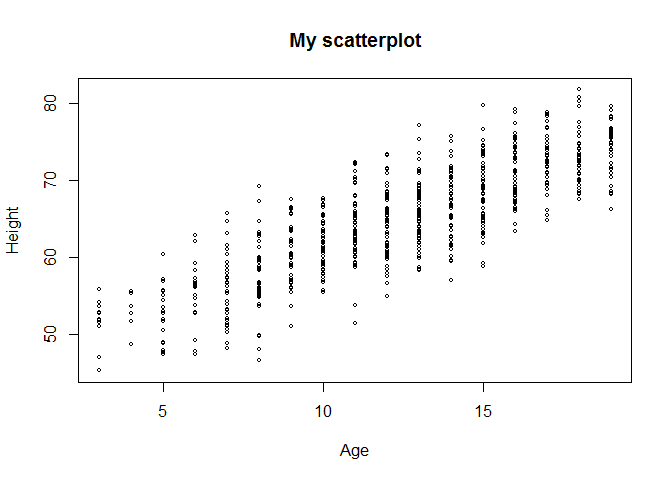 

```r
#cex.main adjusts the size of title
plot(Age, Height,main="My scatterplot",cex=0.5,cex.main=0.8)
```

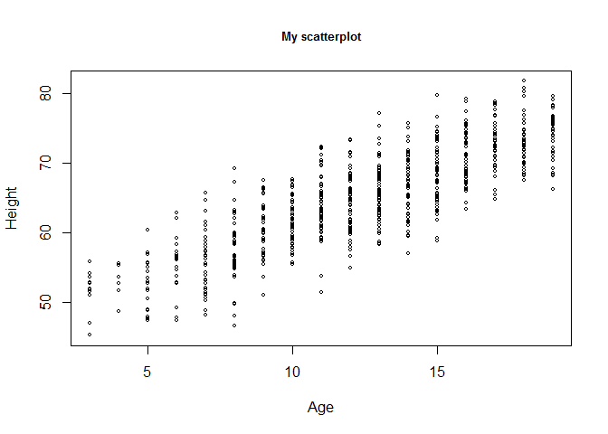 

```r
#cex.lab for the size of axis lables
plot(Age, Height,main="My scatterplot",cex=0.5,cex.main=0.8,cex.lab=1.2)
```

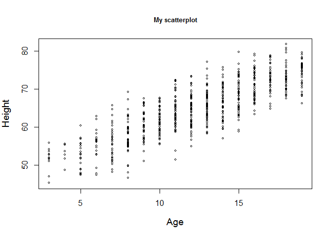 

```r
#size of x/y axis value cex.axis
plot(Age, Height,main="My scatterplot",cex=0.5,cex.main=0.8,cex.lab=1.2,cex.axis=1.2)
```

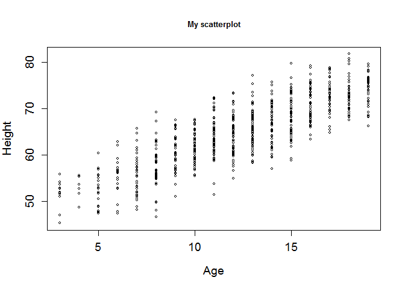 

fonts adjustments

```r
plot(Age, Height,main="My scatterplot")
```

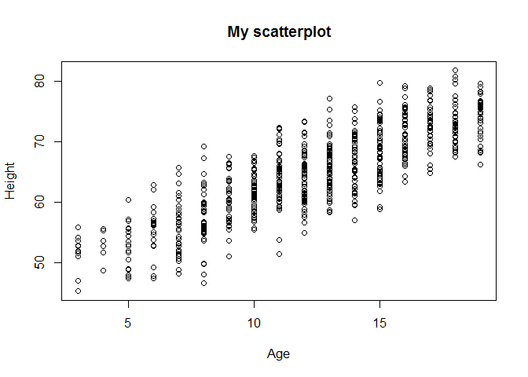 

```r
#font.main  (3 = italic; 4 = bold italic)
plot(Age, Height,main="My scatterplot",font.main=3)
```

 

```r
plot(Age, Height,main="My scatterplot",font.main=4)
```

 

```r
#font.lab
plot(Age, Height,main="My scatterplot",font.main=4,font.lab=2)
```

 

```r
#font.axis
plot(Age, Height,main="My scatterplot",font.main=4,font.lab=2, font.axis=2)
```

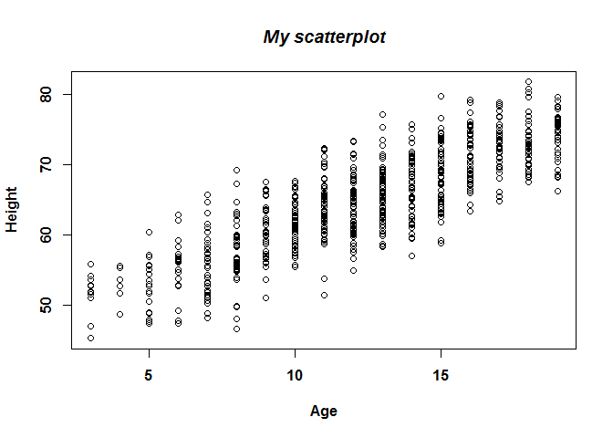 

# changing colours

```r
plot(Age, Height,main="My scatterplot")
```

 

```r
#col
plot(Age, Height,main="My scatterplot",col="red")
```

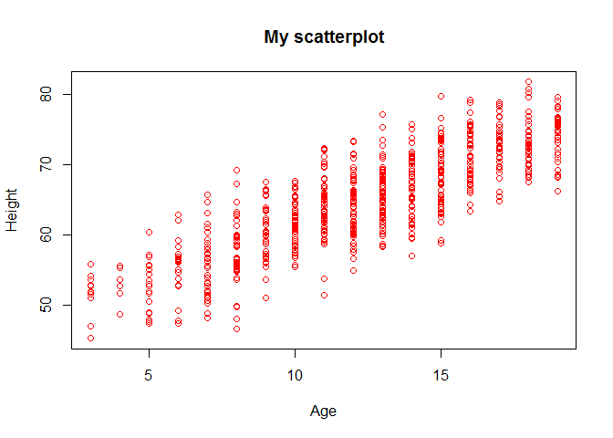 

```r
plot(Age, Height,main="My scatterplot",col="red",col.main="blue")
```

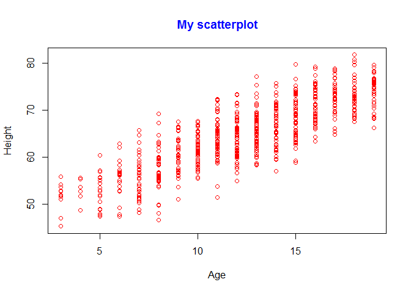 

```r
plot(Age, Height,main="My scatterplot",col="red",col.main="blue", col.axis=12)
```

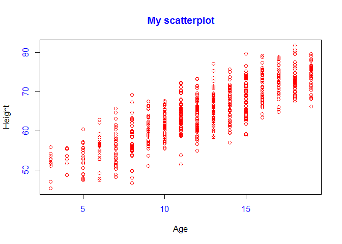 

```r
plot(Age, Height,main="My scatterplot",col="red",col.main="blue", col.axis=12,col.lab="violet")
```

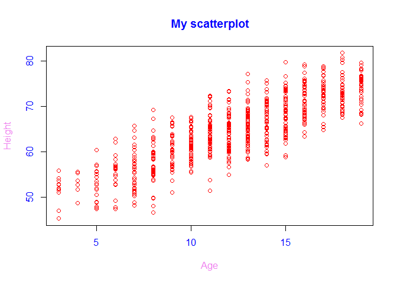 

```r
plot(Age, Height,main="My scatterplot",col="red",col.main="blue", col.axis=12,col.lab="violet")

x=1:25
plot(x,col=x,cex=2.5)
```

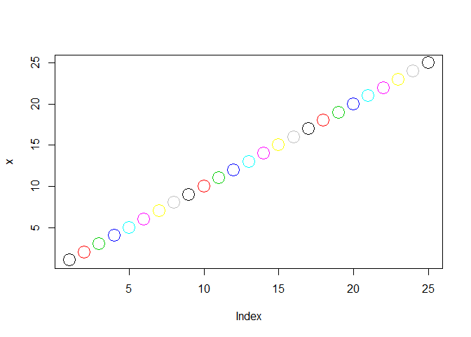 

# changing plotting chrs plus changing the look of the regression line

```r
plot(Age, Height,main="My scatterplot",pch=2)
```

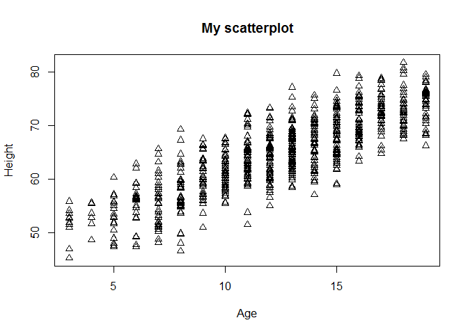 

```r
plot(Age, Height,main="My scatterplot",pch=4)
```

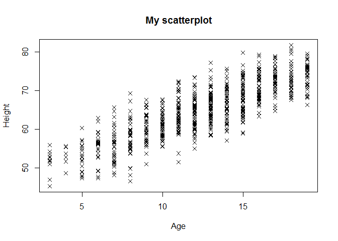 

```r
plot(Age, Height,main="My scatterplot",pch="w")
```

 

```r
plot(Age, Height,main="My scatterplot",pch="a",cex=0.5)
 
abline(lm(Height~Age))
abline(lm(Height~Age),col="red",lty=3,lwd=5)
```

 


```r
plot(Age[Gender == "male"],Height[Gender == "male"], col = 4, pch = "m",xlab = "Age",ylab = "Height",cex = 0.5,main = "Height vs Age")

#add females
points(Age[Gender == "female"],Height[Gender == "female"],col = 2, pch = "f",cex = 1.2)
```

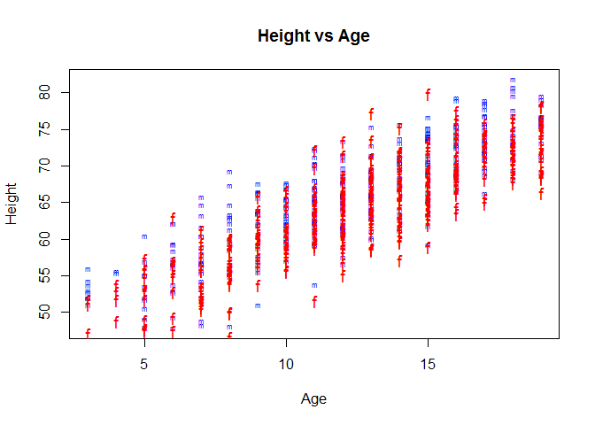 

```r
#we may want males and females appearing in different plots
par(mfrow=c(1,2)) #1 row, 2 columns

plot(Age[Gender=="male"],Height[Gender=="male"], col=4, pch="m",xlab="Age",ylab="Height",cex=0.5,main="Height vs Age for males",xlim=c(0,20), ylim=c(45,85))

plot(Age[Gender=="female"],Height[Gender=="female"], col=6, pch="f",xlab="Age",ylab="Height",cex=0.5,main="Height vs Age for females",xlim=c(0,20), ylim=c(45,85))
```

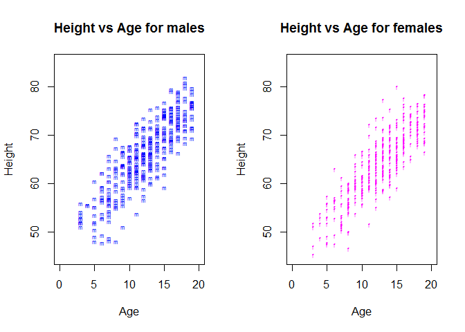 

```r
par(mfrow=c(1,1)) #back to one plot / screen
```


#changing x y axis

```r
plot(Age, Height,main="My scatterplot")
```

 

```r
plot(Age, Height,main="My scatterplot",axes =F)
axis(side=1,at=c(7,12.3,15),labels=c("sev","mean","15"))
axis(side=2,at=c(55,65,75),labels=c(55,65,75))
box()

axis(side=4,at=c(50,60,70,80),labels=c(50,60,70,80),las=1)
```

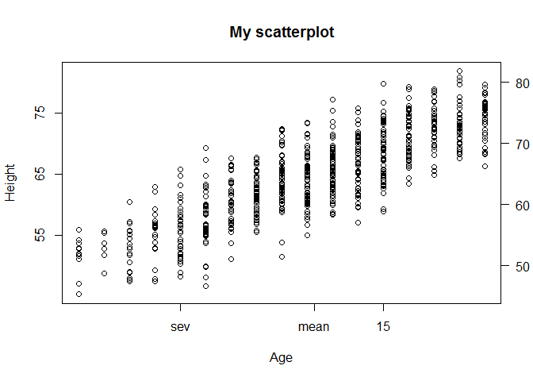 

you may want to change the size of the margins, text allignement, explore ?par

## adding text to plots

text and mtext commands: explore them with the ?

```r
plot(Age, Musclemass,main="My scatterplot",las=1)
#Pearson
cor(Age,Musclemass)
```

```
## [1] 0.8196749
```

```r
plot(Age, Musclemass,main="My scatterplot",las=1)
text(x=5,y=13,label="r = 0.82",col=2) #text centered in 5,13
text(x=5,y=13,label="r = 0.82",col=2,adj=0) #text start @ 5,13.
```

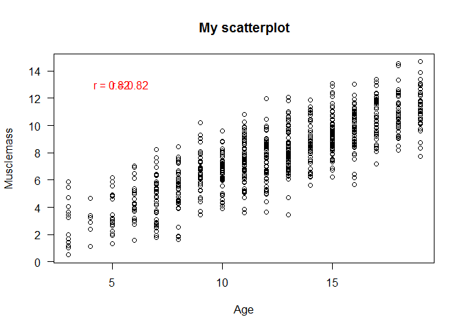 


```r
plot(Age, Musclemass,main="My scatterplot",las=1)
text(x=5,y=13,label="r = 0.82",col=4,cex=1.5,font=4)

#add line
abline(h=mean(Musclemass),col=2,lwd=4,lty=3)
text(2.5,8.5,adj=0,label="mean Musclemass",cex=0.7,col=2)
```

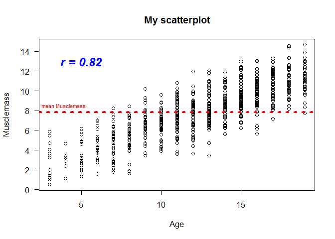 

add text @ the margins of the plot

```r
plot(Age, Musclemass,main="My scatterplot",las=1)
mtext(text ="r = 0.82",side=1)
mtext(text ="r = 0.82",side=3)
mtext(text ="r = 0.82",side=4)
mtext(text ="r = 0.82",side=1,adj=1)
mtext(text ="r = 0.82",side=1,adj=0.3)

mtext(text ="r = 0.82",side=3,adj=0.3,col=2,cex=2,font=4)
```

 


+++++++++++++++++
Edited by Simone Ciuti, University of Freiburg, 15/10/2015; 
Intended for the only purpose of teaching @ Freiburg University
source: Mike Marin Stat Tutorials, University of British Columbia (strongly edited and modified)
+++++++++++++++++++++++++++++++++++++++++++++++++
