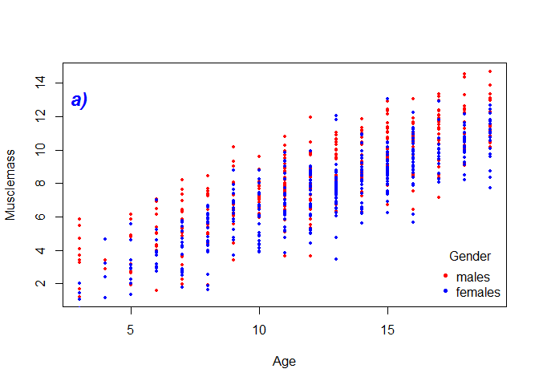
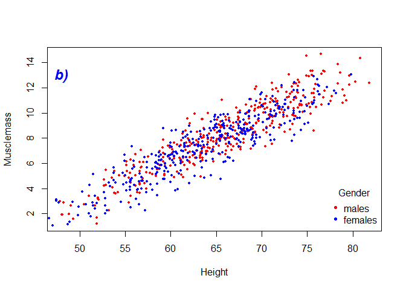
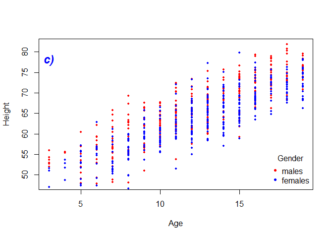
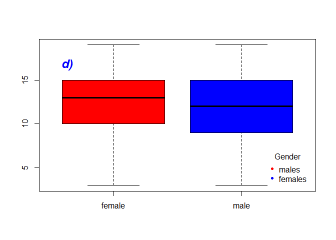
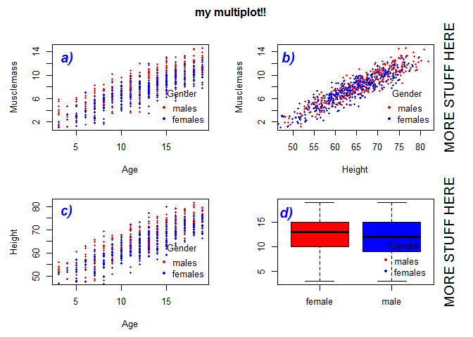

# 3 - more about basic plotting


```r
setwd("~/TEACHING IN FREIBURG/11 - Statistics with R fall 2015/2_intro to very basic exploratory statistics")
load("data1.RData")
head(data1)
```

```
##   Musclemass Age Height Beer Gender
## 1      6.475   6   62.1   no   male
## 2     10.125  18   74.7  yes female
## 3      9.550  16   69.7   no female
## 4     11.125  14   71.0   no   male
## 5      4.800   5   56.9   no   male
## 6      6.225  11   58.7   no female
```

We prepare 4 simple plots... 
we add a text and a legend to each of them.


```r
attach(data1)
plot(Musclemass[Gender=="male"]~Age[Gender=="male"],col="red", pch=20,cex=0.8,xlab="Age",ylab="Musclemass")
points(Musclemass[Gender=="female"]~Age[Gender=="female"],col="blue", pch=20,cex=0.8)
text(x=3,y=13,label="a)",col=4,cex=1.5,font=4)
legend("bottomright",c("males","females"), col=c("red","blue"),title="Gender",
       bty="n", pch=c(20,20))
```

 

```r
plot(Musclemass[Gender=="male"]~Height[Gender=="male"],col="red", pch=20,cex=0.8,xlab="Height",ylab="Musclemass")
points(Musclemass[Gender=="female"]~Height[Gender=="female"],col="blue", pch=20,cex=0.8)
text(x=48,y=13,label="b)",col=4,cex=1.5,font=4)
legend("bottomright",c("males","females"), col=c("red","blue"),title="Gender",
       bty="n", pch=c(20,20))
```

 

```r
plot(Height[Gender=="male"]~Age[Gender=="male"],col="red", pch=20,cex=0.8,xlab="Age",ylab="Height")
points(Height[Gender=="female"]~Age[Gender=="female"],col="blue", pch=20,cex=0.8)
text(x=3,y=78,label="c)",col=4,cex=1.5,font=4)
legend("bottomright",c("males","females"), col=c("red","blue"),title="Gender",
       bty="n", pch=c(20,20))
```

 

```r
boxplot(Age~Gender,col=c("red","blue"))
text(x=1,y=16.8,label="d)",col=4,cex=1.5,font=4,adj=4.5)
legend("bottomright",c("males","females"), col=c("red","blue"),title="Gender",
       bty="n", pch=c(20,20),inset=.02)
```

 


we are now ready to put them together.
we use par(mfrow) to split the plot window (2x2)
we use par(oma) to set the margins of the multiplot (around the 4 plots)
par(mar) to adjust the space around each plot (between plots)


```r
#you may want to plot the all thing in a new plotting window
#graphics.off()
#x11(h = 12, w = 12) 

par(mfrow=c(2,2))

par(oma=c(0.5,0.5,2,1.5)) #A vector of the form c(bottom, left, top, right) giving the size of the outer margins in lines of text.

par(mar=c(4.2,4.2,2,2)) #A numerical vector of the form c(bottom, left, top, right) which gives the number of lines of margin to be specified on the four sides of the plot. The default is c(5, 4, 4, 2) + 0.1.

#### for more info type ?par

plot(Musclemass[Gender=="male"]~Age[Gender=="male"],col="red", pch=20,cex=0.8,xlab="Age",ylab="Musclemass")
points(Musclemass[Gender=="female"]~Age[Gender=="female"],col="blue", pch=20,cex=0.8)
text(x=4,y=13,label="a)",col=4,cex=1.5,font=4)
legend("bottomright",c("males","females"), col=c("red","blue"),title="Gender",
       bty="n", pch=c(20,20))

plot(Musclemass[Gender=="male"]~Height[Gender=="male"],col="red", pch=20,cex=0.8,xlab="Height",ylab="Musclemass")
points(Musclemass[Gender=="female"]~Height[Gender=="female"],col="blue", pch=20,cex=0.8)
text(x=49,y=13,label="b)",col=4,cex=1.5,font=4)
legend("bottomright",c("males","females"), col=c("red","blue"),title="Gender",
       bty="n", pch=c(20,20))


mtext("MORE STUFF HERE",side=4,line=1,cex=1.2)   

plot(Height[Gender=="male"]~Age[Gender=="male"],col="red", pch=20,cex=0.8,xlab="Age",ylab="Height")
points(Height[Gender=="female"]~Age[Gender=="female"],col="blue", pch=20,cex=0.8)
text(x=4,y=78,label="c)",col=4,cex=1.5,font=4)
legend("bottomright",c("males","females"), col=c("red","blue"),title="Gender",
       bty="n", pch=c(20,20))

boxplot(Age~Gender,col=c("red","blue"))
text(x=1,y=16.8,label="d)",col=4,cex=1.5,font=4,adj=3)
legend("bottomright",c("males","females"), col=c("red","blue"),title="Gender",
       bty="n", pch=c(20,20),inset=.02)

mtext("MORE STUFF HERE",side=4,line=1,cex=1.2)


title(main="my multiplot!!",outer=T)  #FINAL TITLE
```

 

```r
par(mfrow=c(1,1))

#savePlot(filename = "multiplot",type="pdf", device=dev.cur())
```

to get a better feeling of par

try par(oma=c(0,0,0,0))

try par(mar=c(0,0,0,0))


Home work: KEEP IMPROVING THESE PLOTS (CHANGE FONT SIZE, TYPES, COLOURS..) or make plots with the other datasets that have been provided in class.
-> best position for a b c d
-> rotate all numbers (horizontal)
-> place a title in each plot
-> pick your best combination of colours, font size and type
-> use google!

