# 4 - More plotting and exploratory stat
VERY IMPORTANT: we could do this for days and days. What we have done with the plotting / exploratory statistics so far is to allow you to get a better feeling on how to do it. However, given that now you have a bit more of confidence and flexibility in R, it should be easy for you to get access to online tutorials and learn new tools. It also depends on what you are supposed to do - as soon as you know your problem, GOOGLE it!! 

## more on scatterplots 
(Source -> our APES website http://biometry.github.io/APES/ you better check this out!!!!!)

We’ll use the dataset Iris


```r
attach(iris) # remember to detach in the end 
head(iris)
```

```
##   Sepal.Length Sepal.Width Petal.Length Petal.Width Species
## 1          5.1         3.5          1.4         0.2  setosa
## 2          4.9         3.0          1.4         0.2  setosa
## 3          4.7         3.2          1.3         0.2  setosa
## 4          4.6         3.1          1.5         0.2  setosa
## 5          5.0         3.6          1.4         0.2  setosa
## 6          5.4         3.9          1.7         0.4  setosa
```

To plot Sepal.Length against Petal.Length, use the following command

```r
plot(Petal.Length, Sepal.Length)
```

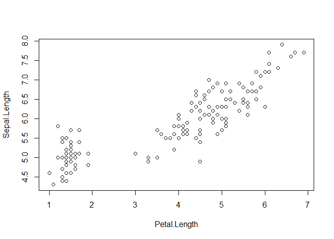 
We can improve this plot by adding graphic options. The most basic options are provided in the help


```r
plot(Petal.Length, Sepal.Length, main="Simple Scatterplot",xlab="Petal Length ",ylab="Sepal Length " , 
     pch=22, col="red", bg="blue",cex=3, lwd=2)
```

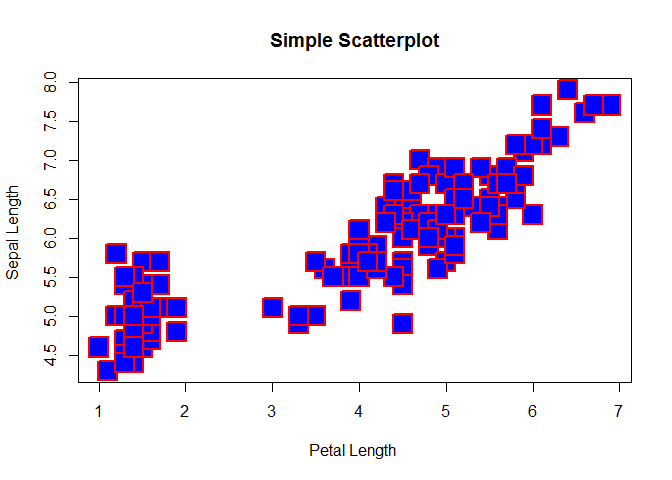 
Where:
* Petal.Length = x
* Sepal.Length = y
* main = Main title
* xlab = title for the x axis
* ylab = title for the y axis
* pch = type of symbol
* col = color of pch
* bg = background color of pch (from 21 to 25)
* cex = size of pch
* lwd = thickness of symbol outline 


```r
library(car)
scatterplot(Sepal.Length~Petal.Length, data=iris, boxplots= "x,y",
            xlab="Petal Length ",ylab="Sepal Length ",
            main="Enhanced Scatter Plot", labels=row.names(iris))
```

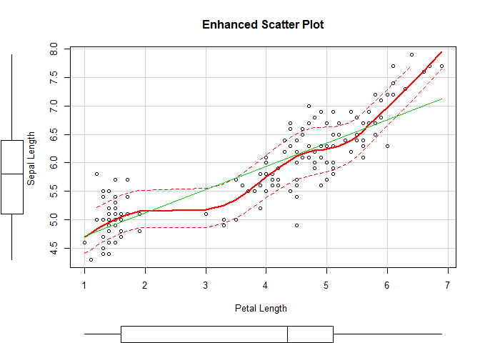 

```r
scatterplot(Sepal.Length~Petal.Length | Species, data=iris, boxplots= "x,y",
            xlab="Petal Length ",ylab="Sepal Length ",
            main="Enhanced Scatter Plot")
```

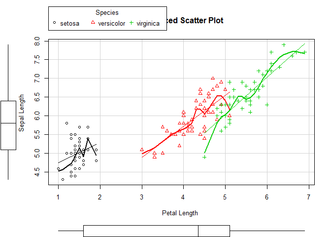 

Where:
* Sepal.Length~Petal.Length | Species = the formula to plot by groups (x ~ y | z). It could also be a formula of the type x ~ y.
* data = dataframe
* boxplots = boxplots for x and/or y
* main = main title
* xlab = title for the x axis
* ylab = title for the y axis

Check ?scatterplot to leanr more on how to use it. (it adds by default a LoessLine smoother and a Generalized linear model smoother)


## scatterplots matrices


```r
pairs(iris)
```

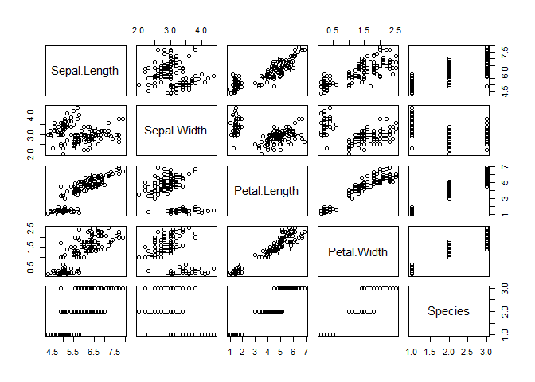 

```r
pairs(~Sepal.Length+Sepal.Width+Petal.Length+Petal.Width,data=iris,
      main="Simple Scatterplot Matrix")
```

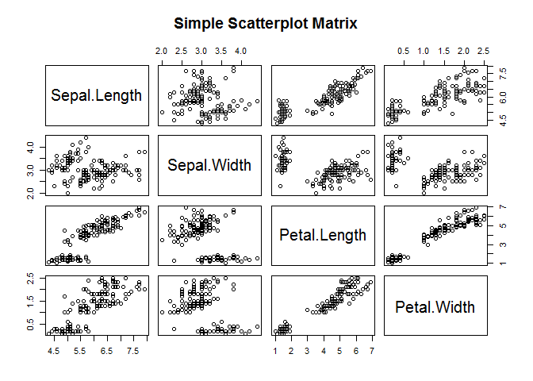 

```r
# also
pairs(iris[,1:3])
```

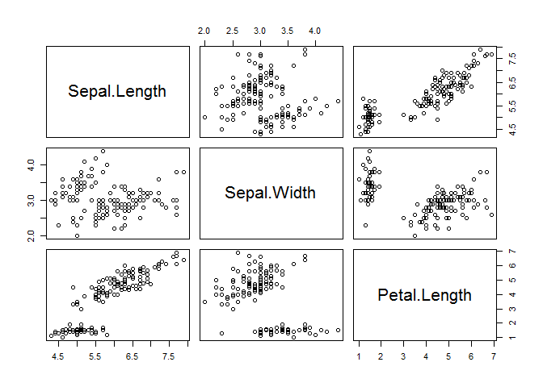 

Where:
* ~Sepal.Length+Sepal.Width+Petal.Length+Petal.Width = Numeric vectors that represent the variables in the plot
* data = the data frame
* main = main title 

With the lattice package we can condition our matrix on a factor (tree specie in this case)
the package supports the creation of trellis graphs - a family of techniques for viewing complex, multi-variable data sets


```r
library(lattice)
super.sym <- trellis.par.get("superpose.symbol") 

splom(~iris[1:4], groups = Species, data = iris,  
      superpanel, key = list(title = "Varieties of Iris",  
                 columns = 3,   
                 points = list(pch = super.sym$pch[1:3],  
                               col = super.sym$col[1:3]),  
                 text = list(c("Setosa", "Versicolor", "Virginica")))) 
```

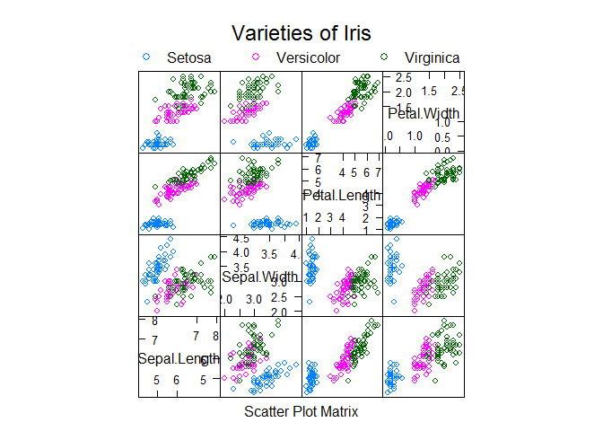 

Where:
.~iris[1:4] = the object we want to analyse (columns 1 to 4).
.groups = which variable is going to be evaluated.
.data = dataframe.
.superpanel = function that sets up the splom display, by default as a scatterplot matrix.
.key = legend.
.text = labels for levels of the grouping variable.

## High density scatterplot


```r
library(hexbin)  
bin<-hexbin(Petal.Width ~ Petal.Length, xbins=100, xlab="Petal.Width",ylab="Petal.Length")  
plot(bin, main="Hexagonal Binning")
```

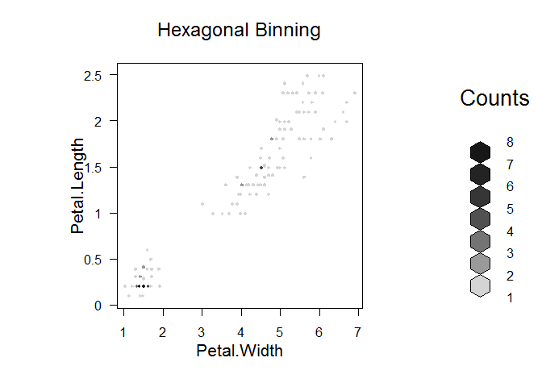 

Where:
.xbins = number of hexagons across the x axis 


```r
bin<-hexbin(Petal.Width ~ Petal.Length, xbins=10, xlab="Petal.Width",ylab="Petal.Length")  
plot(bin, main="Hexagonal Binning")
```

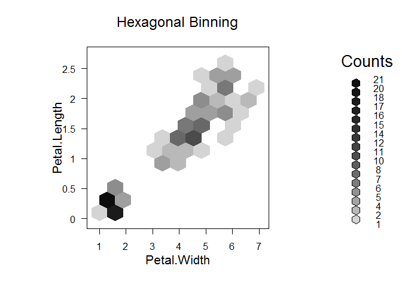 

## Simple and stacked bar plots
Simple:

```r
counts <- table(iris$Petal.Length)
barplot(counts, main="Iris Distribution", 
        xlab="Petal Length")
```

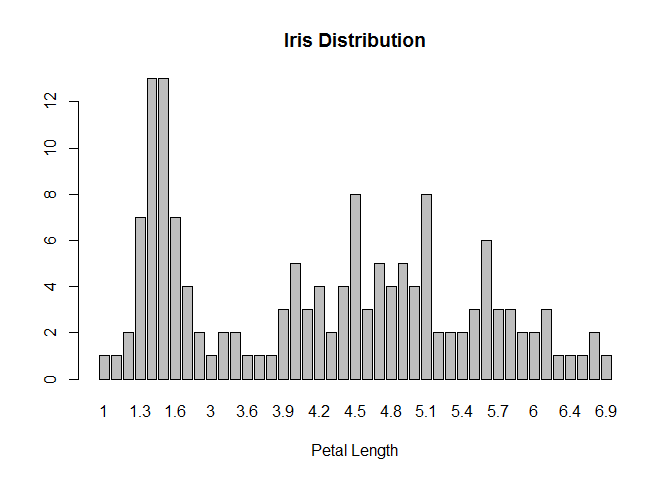 

```r
barplot(counts, main="Iris Distribution", 
        xlab="Petal Length", horiz=TRUE) # horizontal bars
```

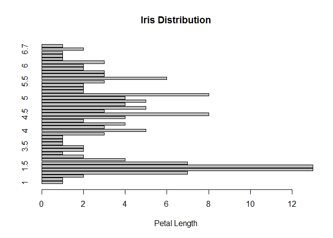 

Stacked:

```r
counts <- table(iris$Species, iris$Petal.Length)  
barplot(counts, main="iris species distribution by petal leghts",
                    xlab="Petal Length",  col=c("darkblue","red", "green"),
                    legend = rownames(counts))
```

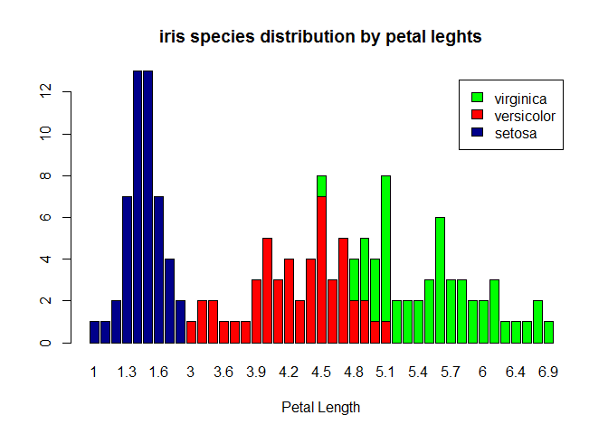 

```r
detach(iris)  ## never forget this!
```


## eager to plot more??
Visit our Apes website
http://biometry.github.io/APES/

or:


    Wiki page with basic plotting examples
https://en.wikibooks.org/wiki/R_Programming/Graphics

    The Quick-R page has more complete information about everytipe of plot
http://www.statmethods.net/graphs/creating.html

    Derek Ogle’s book chapter is a quick but clear introduction to plotting for Fisheries Analyses
https://sites.google.com/site/fishrfiles/home/ifswr-drafts/Plotting_IntroFishAnalysisR.pdf?attredirects=1

    List of graphic packages that are available and how they fit together
https://mran.revolutionanalytics.com/taskview/info/?Graphics

    Paul Maurell’s book, “R Graphics”, is a resource that helps users to master the intricacies of R graphics
https://www.stat.auckland.ac.nz/~paul/RGraphics/rgraphics.html

    How to change the font in R charts
http://blog.revolutionanalytics.com/2012/09/how-to-use-your-favorite-fonts-in-r-charts.html

    About changing the background color in plots
https://stat.ethz.ch/pipermail/r-help/2003-May/033971.html

    Some tips about how to improve R graphics
http://blog.revolutionanalytics.com/2009/01/10-tips-for-making-your-r-graphics-look-their-best.html

    We can also find a R graphic’s chapter in “An Introduction to R”
https://cran.r-project.org/doc/manuals/r-release/R-intro.html#Graphics


Browse these websites in the afternoon and try out the plots you are more interested on.  


