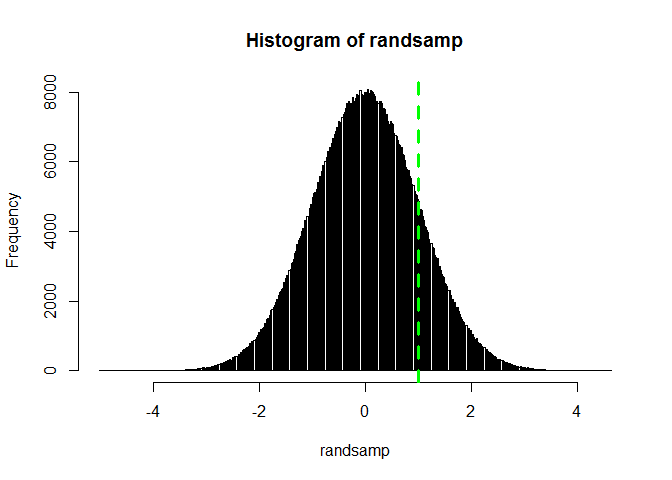
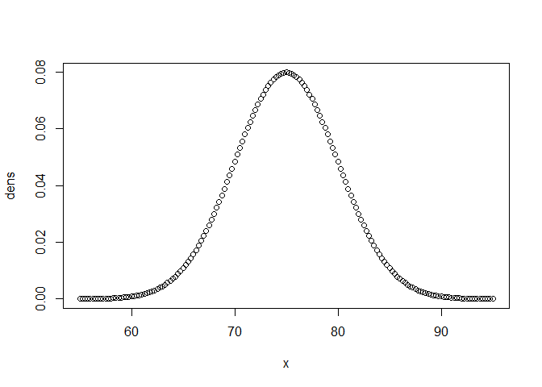
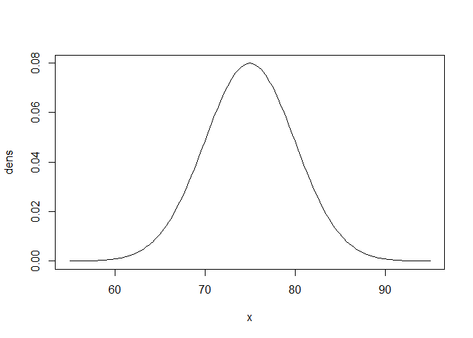
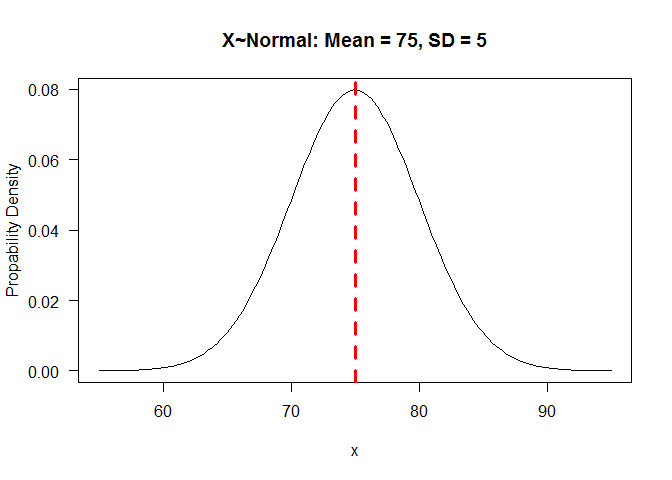

# Normal distribution
example:
X is Normally Distributed with a known mean of 55 and a standard deviation of 7 (variance 7^2) 
In simple words, 2 parameters define the normal (Gaussian) distribution: the mean and the variance (sd ^ 2)


```r
# draw 1 million observations from the above mentioned normal distribution
randsamp = rnorm(n = 1000000, mean = 55, sd = 7)
hist(randsamp, breaks = 500)


# probability than X is lower than 80
abline(v = 80, col = 2, lty = 2, lwd = 3)
pnorm(q = 80,mean = 55,sd = 5,lower.tail = T) #less than 80
```

```
## [1] 0.9999997
```

```r
# probability than X is lower than 55
abline(v = 55, col = "white", lty = 2, lwd = 3)
```

 

```r
pnorm(q = 55, mean = 55, sd = 5, lower.tail = T)
```

```
## [1] 0.5
```

```r
#area above a q = 55 is 50% of total area..

# probability than X is higher than 56
pnorm(q=56,mean=55,sd=5,lower.tail=F)
```

```
## [1] 0.4207403
```

```r
#standard normal Z
#mean = 0, sd=1
#P than Z is lower than 1
randsamp = rnorm(n = 1000000, mean = 0, sd = 1)
hist(randsamp, breaks = 500)
abline(v = 1, col = "green", lty = 2, lwd = 3)
```

 

```r
pnorm(q = 1, mean = 0, sd = 1, lower.tail = F)
```

```
## [1] 0.1586553
```

```r
#16% is aprroximately the area above 1
```


x is Normally Distributed with a known mean of 75 and a standard deviation of 5 (variance 5^2 = 25)

```r
#let's create a sequence of values that should cover large part of the normal distribution
x = seq(from = 55,to = 95,by = 0.25)
x
```

```
##   [1] 55.00 55.25 55.50 55.75 56.00 56.25 56.50 56.75 57.00 57.25 57.50
##  [12] 57.75 58.00 58.25 58.50 58.75 59.00 59.25 59.50 59.75 60.00 60.25
##  [23] 60.50 60.75 61.00 61.25 61.50 61.75 62.00 62.25 62.50 62.75 63.00
##  [34] 63.25 63.50 63.75 64.00 64.25 64.50 64.75 65.00 65.25 65.50 65.75
##  [45] 66.00 66.25 66.50 66.75 67.00 67.25 67.50 67.75 68.00 68.25 68.50
##  [56] 68.75 69.00 69.25 69.50 69.75 70.00 70.25 70.50 70.75 71.00 71.25
##  [67] 71.50 71.75 72.00 72.25 72.50 72.75 73.00 73.25 73.50 73.75 74.00
##  [78] 74.25 74.50 74.75 75.00 75.25 75.50 75.75 76.00 76.25 76.50 76.75
##  [89] 77.00 77.25 77.50 77.75 78.00 78.25 78.50 78.75 79.00 79.25 79.50
## [100] 79.75 80.00 80.25 80.50 80.75 81.00 81.25 81.50 81.75 82.00 82.25
## [111] 82.50 82.75 83.00 83.25 83.50 83.75 84.00 84.25 84.50 84.75 85.00
## [122] 85.25 85.50 85.75 86.00 86.25 86.50 86.75 87.00 87.25 87.50 87.75
## [133] 88.00 88.25 88.50 88.75 89.00 89.25 89.50 89.75 90.00 90.25 90.50
## [144] 90.75 91.00 91.25 91.50 91.75 92.00 92.25 92.50 92.75 93.00 93.25
## [155] 93.50 93.75 94.00 94.25 94.50 94.75 95.00
```

```r
#let's compute the value of the probability density functions for these X values
dens = dnorm(x, mean = 75, sd = 5)
dens
```

```
##   [1] 2.676605e-05 3.265128e-05 3.973109e-05 4.822532e-05 5.838939e-05
##   [6] 7.051914e-05 8.495605e-05 1.020930e-04 1.223804e-04 1.463329e-04
##  [11] 1.745365e-04 2.076563e-04 2.464438e-04 2.917462e-04 3.445138e-04
##  [16] 4.058096e-04 4.768176e-04 5.588517e-04 6.533638e-04 7.619524e-04
##  [21] 8.863697e-04 1.028528e-03 1.190506e-03 1.374553e-03 1.583090e-03
##  [26] 1.818713e-03 2.084187e-03 2.382449e-03 2.716594e-03 3.089869e-03
##  [31] 3.505660e-03 3.967471e-03 4.478906e-03 5.043644e-03 5.665408e-03
##  [36] 6.347930e-03 7.094919e-03 7.910008e-03 8.796719e-03 9.758404e-03
##  [41] 1.079819e-02 1.191894e-02 1.312316e-02 1.441297e-02 1.579003e-02
##  [46] 1.725546e-02 1.880982e-02 2.045298e-02 2.218417e-02 2.400180e-02
##  [51] 2.590352e-02 2.788611e-02 2.994549e-02 3.207667e-02 3.427372e-02
##  [56] 3.652982e-02 3.883721e-02 4.118725e-02 4.357044e-02 4.597643e-02
##  [61] 4.839414e-02 5.081181e-02 5.321705e-02 5.559698e-02 5.793831e-02
##  [66] 6.022749e-02 6.245079e-02 6.459447e-02 6.664492e-02 6.858877e-02
##  [71] 7.041307e-02 7.210539e-02 7.365403e-02 7.504807e-02 7.627756e-02
##  [76] 7.733362e-02 7.820854e-02 7.889587e-02 7.939051e-02 7.968878e-02
##  [81] 7.978846e-02 7.968878e-02 7.939051e-02 7.889587e-02 7.820854e-02
##  [86] 7.733362e-02 7.627756e-02 7.504807e-02 7.365403e-02 7.210539e-02
##  [91] 7.041307e-02 6.858877e-02 6.664492e-02 6.459447e-02 6.245079e-02
##  [96] 6.022749e-02 5.793831e-02 5.559698e-02 5.321705e-02 5.081181e-02
## [101] 4.839414e-02 4.597643e-02 4.357044e-02 4.118725e-02 3.883721e-02
## [106] 3.652982e-02 3.427372e-02 3.207667e-02 2.994549e-02 2.788611e-02
## [111] 2.590352e-02 2.400180e-02 2.218417e-02 2.045298e-02 1.880982e-02
## [116] 1.725546e-02 1.579003e-02 1.441297e-02 1.312316e-02 1.191894e-02
## [121] 1.079819e-02 9.758404e-03 8.796719e-03 7.910008e-03 7.094919e-03
## [126] 6.347930e-03 5.665408e-03 5.043644e-03 4.478906e-03 3.967471e-03
## [131] 3.505660e-03 3.089869e-03 2.716594e-03 2.382449e-03 2.084187e-03
## [136] 1.818713e-03 1.583090e-03 1.374553e-03 1.190506e-03 1.028528e-03
## [141] 8.863697e-04 7.619524e-04 6.533638e-04 5.588517e-04 4.768176e-04
## [146] 4.058096e-04 3.445138e-04 2.917462e-04 2.464438e-04 2.076563e-04
## [151] 1.745365e-04 1.463329e-04 1.223804e-04 1.020930e-04 8.495605e-05
## [156] 7.051914e-05 5.838939e-05 4.822532e-05 3.973109e-05 3.265128e-05
## [161] 2.676605e-05
```

```r
plot(x, dens)
```

 

```r
plot(x, dens, type = "l")
```

 

```r
plot(x, dens, type = "l", main = "X~Normal: Mean = 75, SD = 5",xlab = "x", ylab = "Propability Density", las = 1)

#add vertical line
abline(v = 75, col = 2, lty = 2, lwd = 3)
```

 


-----> IN-CLASS EXERCISE


+++++++++++++++++
Edited by Simone Ciuti, University of Freiburg, 16/10/2015; 
Intended for the only purpose of teaching @ Freiburg University
+++++++++++++++++++++++++++++++++++++++++++++++++
