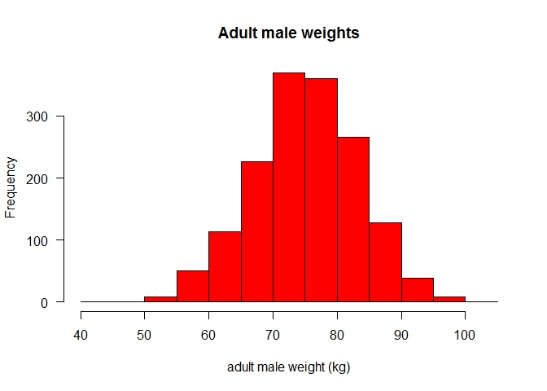
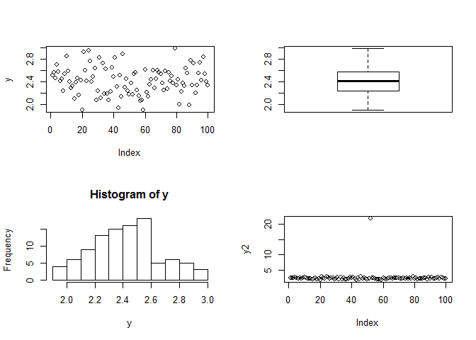
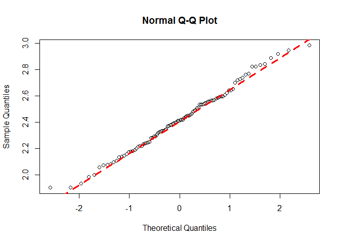
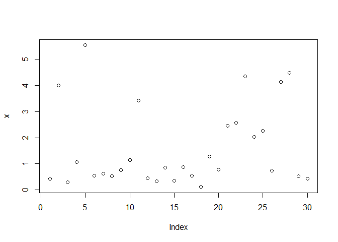
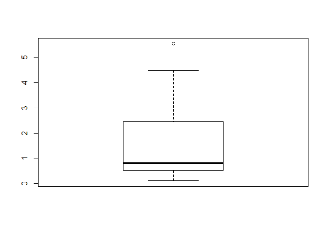
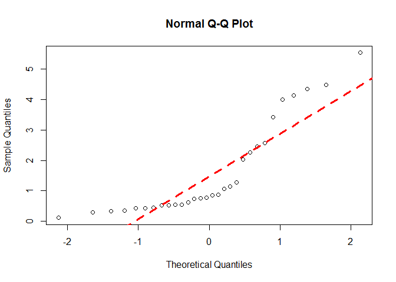

# Classical Tests part I

## non-parametric vs parametric statistical analyses
A parametric statistical test is one that makes assumptions 
about the parameters (defining properties) of the population distribution(s) 
from which one's data are drawn, while a non-parametric test is one 
that makes no such assumptions. 

For practical purposes, you can think of "parametric" as referring to tests, 
such as t-tests , that assume the underlying 
source population(s) to be normally distributed.

##Checking and testing for normality

Normal distribution - let's simulate one

```r
#let's simulate the weight of 1570 adult males
set.seed(15) # by doing this, the random draw performed in the following line will be always the same (15 could be replaced by any number of your choice)
data1 = rnorm(1570, mean = 75, sd = 8)
hist(data1, main="Adult male weights", xlab="adult male weight (kg)", col="red", las=1)
```

 


Load example data


```r
setwd("~/TEACHING IN FREIBURG/11 - Statistics with R fall 2015/4_Classical Tests")
data = read.table("das.txt", header = T)
summary(data)
```

```
##        y        
##  Min.   :1.904  
##  1st Qu.:2.241  
##  Median :2.414  
##  Mean   :2.419  
##  3rd Qu.:2.568  
##  Max.   :2.984
```

Visualize example data


```r
attach(data) #remember to use search() to verify what is/is not attached)
par(mfrow = c(2, 2))
plot(y)
boxplot(y)
hist(y, breaks = 10)  # hist is not good to check for normality properly
y2 = y
y2[52] = 21.75 # suppose 52nd value 21.75 instead of 2.175:
plot(y2)     #very good to spot mistakes, outliers
```

 

```r
par(mfrow=c(1,1))
```

1) check for normality: quantile-quantile plot
This one plots the ranked samples from our distribution against 
a similar number of ranked quantiles taken from a normal distribution.
If our sample is normally distributed then the line will be straight. 
Departures from normality show up as various sorts of non-linearity 
(e.g. S-shapes or banana shapes). 


```r
qqnorm(y)
qqline(y, lty = 2, col = 2, lwd = 3)
```

 

2) Test for normality: Shapiro.test


```r
shapiro.test(y)  ## very good, these data are normally distributed
```

```
## 
## 	Shapiro-Wilk normality test
## 
## data:  y
## W = 0.9911, p-value = 0.753
```

```r
detach(data)
```


Create fake data log-normally distributed and verify the assumption of normality

```r
set.seed(5) # by doing this, the random draw performed in the following line will be always the same (5 could be replaced by any number of your choice)
x=exp(rnorm(30))  #rnorm without specification picks data from the standard normal mean = 0, sd = 1
plot(x)
```

 

```r
boxplot(x)
```

 

```r
qqnorm(x)
qqline(x,lty=2,col=2,lwd=3)
```

 

```r
shapiro.test(x)
```

```
## 
## 	Shapiro-Wilk normality test
## 
## data:  x
## W = 0.7991, p-value = 6.314e-05
```

-> IN CLASS EXERCISES PART I

+++++++++++++++++
Edited by Simone Ciuti, University of Freiburg, 20/10/2015; 
Intended for the only purpose of teaching @ Freiburg University; 
+++++++++++++++++++++++++++++++++++++++++++++++++
