# Classical Tests Part II

Today we deal with most classical non-parametric and parametric tests

Let's use a dataset already available in R

```r
head(mtcars)
```

```
##                    mpg cyl disp  hp drat    wt  qsec vs am gear carb
## Mazda RX4         21.0   6  160 110 3.90 2.620 16.46  0  1    4    4
## Mazda RX4 Wag     21.0   6  160 110 3.90 2.875 17.02  0  1    4    4
## Datsun 710        22.8   4  108  93 3.85 2.320 18.61  1  1    4    1
## Hornet 4 Drive    21.4   6  258 110 3.08 3.215 19.44  1  0    3    1
## Hornet Sportabout 18.7   8  360 175 3.15 3.440 17.02  0  0    3    2
## Valiant           18.1   6  225 105 2.76 3.460 20.22  1  0    3    1
```

```r
#?mtcars     # check this out to get a feeling about these data
```

##Correlations

Pearson's correlation (1) is a parametric measure of
the linear association between 2 numeric variables (PARAMETRIC TEST)

Spearman's rank correlation (2) is a non-parametric measure
of the monotonic association between 2 numeric variables (NON-PARAMETRIC TEST)

Kendall's rank correlation (3) is another non-parametric 
measure of the associaTion, based on concordance
or discordance of x-y pairs (NON-PARAMETRIC TEST)


```r
attach(mtcars)  
plot(hp, wt, main = "scatterplot", las = 1, xlab = "gross horse power", ylab = "Weight (lb/1000)")
```

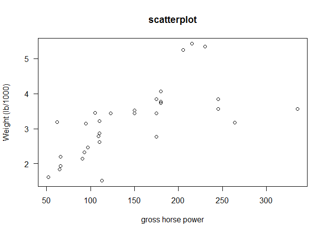 


Compute correlation coefficients

```r
cor(hp, wt, method = "pearson")
```

```
## [1] 0.6587479
```

```r
cor(hp, wt)#Pearson is the default; order of variables is not important
```

```
## [1] 0.6587479
```

```r
cor(hp, wt, method = "spearman")
```

```
## [1] 0.7746767
```

```r
cor(hp, wt, method = "kendal")
```

```
## [1] 0.6113081
```

```r
# Kendall is preferred over Speraman when used in small samples or when we have many values with the same score. In general, as a rule of thumb, if the correlation looks non-linear, Kendall tau should be better than Spearman Rho.
```

The null hypothesis here is  correlation = 0


```r
cor.test(hp, wt, method = "pearson") #Pearson corr test
```

```
## 
## 	Pearson's product-moment correlation
## 
## data:  hp and wt
## t = 4.7957, df = 30, p-value = 4.146e-05
## alternative hypothesis: true correlation is not equal to 0
## 95 percent confidence interval:
##  0.4025113 0.8192573
## sample estimates:
##       cor 
## 0.6587479
```

```r
cor.test(hp, wt, method = "spearman") #Spearman is non-parametric procedure, thus you do not get CIs. You also get error message because cannot compute exact p values (test based on ranks, we have few cars with the same hp or wt). We can rid off the warning letting R know that we are happy with approximate values
```

```
## Warning in cor.test.default(hp, wt, method = "spearman"): Cannot compute
## exact p-value with ties
```

```
## 
## 	Spearman's rank correlation rho
## 
## data:  hp and wt
## S = 1229.4, p-value = 1.954e-07
## alternative hypothesis: true rho is not equal to 0
## sample estimates:
##       rho 
## 0.7746767
```

```r
cor.test(hp, wt, method = "spearman", exact = F) 
```

```
## 
## 	Spearman's rank correlation rho
## 
## data:  hp and wt
## S = 1229.4, p-value = 1.954e-07
## alternative hypothesis: true rho is not equal to 0
## sample estimates:
##       rho 
## 0.7746767
```

```r
#same story with Kendal corr test
cor.test(hp, wt, method = "kendal", exact = F)
```

```
## 
## 	Kendall's rank correlation tau
## 
## data:  hp and wt
## z = 4.845, p-value = 1.266e-06
## alternative hypothesis: true tau is not equal to 0
## sample estimates:
##       tau 
## 0.6113081
```


Ok, the latest chuncks were to let you know how to fit a correlation test. However, let's go back to the beginning, which test are we supposed to use?
Parametric or non-parametric?


```r
par(mfrow=c(1,2))

qqnorm(hp)
qqline(hp,lty=2)
shapiro.test(hp)
```

```
## 
## 	Shapiro-Wilk normality test
## 
## data:  hp
## W = 0.93342, p-value = 0.04881
```

```r
qqnorm(wt)
qqline(wt,lty=2)
```

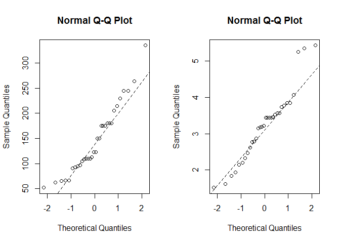 

```r
shapiro.test(wt)
```

```
## 
## 	Shapiro-Wilk normality test
## 
## data:  wt
## W = 0.94326, p-value = 0.09265
```

```r
par(mfrow=c(1,1))
```
Here, I would recommend a non-parametric correlation.
Kendall or Spearman? Check out how these tests work and you'll select the best option for you depending on the data. As a rule of thumb, if the correlation looks non-linear, Kendall tau should be better than Spearman Rho.


## more handy tools for your correlations

Plot all possible combinations

```r
pairs(mtcars)  # all possible pairwise plots
```

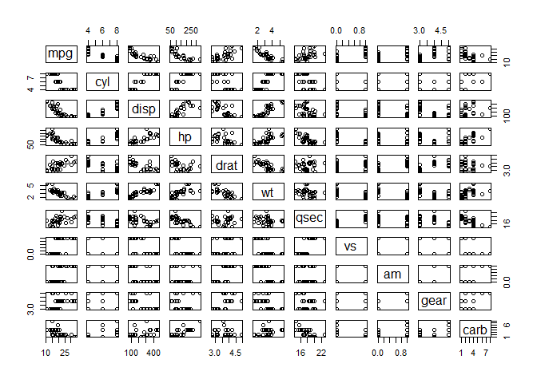 

Not that meaningful. Let's grab what we need


```r
names(mtcars)
```

```
##  [1] "mpg"  "cyl"  "disp" "hp"   "drat" "wt"   "qsec" "vs"   "am"   "gear"
## [11] "carb"
```

```r
pairs(mtcars[, c(1, 4, 6)]) ## subsetting getting only certain columns of the dataset
```

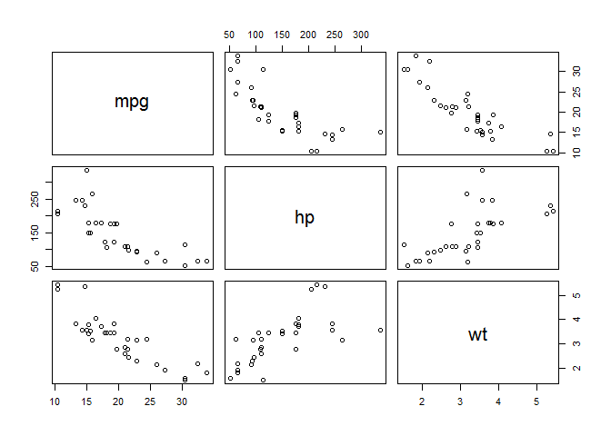 

Building a correlation matrix


```r
cor(mtcars)
```

```
##             mpg        cyl       disp         hp        drat         wt
## mpg   1.0000000 -0.8521620 -0.8475514 -0.7761684  0.68117191 -0.8676594
## cyl  -0.8521620  1.0000000  0.9020329  0.8324475 -0.69993811  0.7824958
## disp -0.8475514  0.9020329  1.0000000  0.7909486 -0.71021393  0.8879799
## hp   -0.7761684  0.8324475  0.7909486  1.0000000 -0.44875912  0.6587479
## drat  0.6811719 -0.6999381 -0.7102139 -0.4487591  1.00000000 -0.7124406
## wt   -0.8676594  0.7824958  0.8879799  0.6587479 -0.71244065  1.0000000
## qsec  0.4186840 -0.5912421 -0.4336979 -0.7082234  0.09120476 -0.1747159
## vs    0.6640389 -0.8108118 -0.7104159 -0.7230967  0.44027846 -0.5549157
## am    0.5998324 -0.5226070 -0.5912270 -0.2432043  0.71271113 -0.6924953
## gear  0.4802848 -0.4926866 -0.5555692 -0.1257043  0.69961013 -0.5832870
## carb -0.5509251  0.5269883  0.3949769  0.7498125 -0.09078980  0.4276059
##             qsec         vs          am       gear        carb
## mpg   0.41868403  0.6640389  0.59983243  0.4802848 -0.55092507
## cyl  -0.59124207 -0.8108118 -0.52260705 -0.4926866  0.52698829
## disp -0.43369788 -0.7104159 -0.59122704 -0.5555692  0.39497686
## hp   -0.70822339 -0.7230967 -0.24320426 -0.1257043  0.74981247
## drat  0.09120476  0.4402785  0.71271113  0.6996101 -0.09078980
## wt   -0.17471588 -0.5549157 -0.69249526 -0.5832870  0.42760594
## qsec  1.00000000  0.7445354 -0.22986086 -0.2126822 -0.65624923
## vs    0.74453544  1.0000000  0.16834512  0.2060233 -0.56960714
## am   -0.22986086  0.1683451  1.00000000  0.7940588  0.05753435
## gear -0.21268223  0.2060233  0.79405876  1.0000000  0.27407284
## carb -0.65624923 -0.5696071  0.05753435  0.2740728  1.00000000
```

```r
cor(mtcars[,c(1,4,6)])
```

```
##            mpg         hp         wt
## mpg  1.0000000 -0.7761684 -0.8676594
## hp  -0.7761684  1.0000000  0.6587479
## wt  -0.8676594  0.6587479  1.0000000
```

```r
detach(mtcars)
```


#### [ quick PPT presentation, CAUSATION VS CORRELATION]


## t-test for 1 sample (PARAMETRIC TEST)

The one-sample t-test compares the MEAN score of a sample to a known value, usually the population MEAN (the average for the outcome of some population of interest). 


Let's use the normally-distributed dataset we used earlier

```r
setwd("~/TEACHING IN FREIBURG/11 - Statistics with R fall 2015/4_Classical Tests")
data = read.table("das.txt",header=T)
attach(data)
boxplot(y)
```

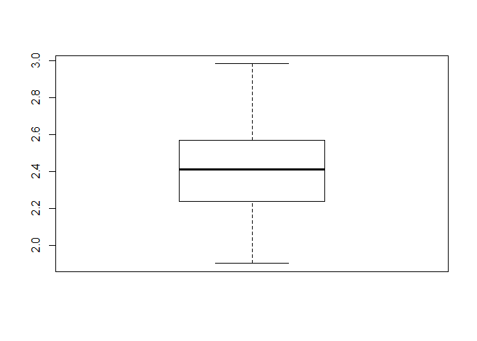 


Example from the real world: imagine you have the weight of 100 lizards collected in your research, and you want to compare it with known average weights available in the scientific literature. Also, we expect that our lizards are lighter than those from literature becasue our data come from an area with food shortage.
Our null hypothesis is that the mean is not less than 2.5


```r
boxplot(y, ylab = "Lizards weight (g)")
```

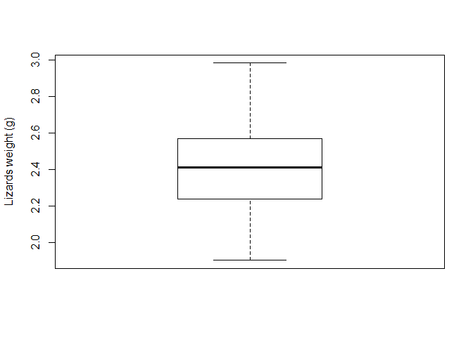 

```r
summary(y)
```

```
##    Min. 1st Qu.  Median    Mean 3rd Qu.    Max. 
##   1.904   2.241   2.414   2.419   2.568   2.984
```

```r
t.test(y, mu = 2.5, alt = "less", conf = 0.95)  # mean = 2.5, alternative hypothesis 1 sided; we get a one-sided 95% CI for the mean 
```

```
## 
## 	One Sample t-test
## 
## data:  y
## t = -3.3349, df = 99, p-value = 0.000601
## alternative hypothesis: true mean is less than 2.5
## 95 percent confidence interval:
##      -Inf 2.459557
## sample estimates:
## mean of x 
##  2.419456
```

2 sided-version


```r
t.test(y, mu = 2.5, alt = "two.sided", conf = 0.95) 
```

```
## 
## 	One Sample t-test
## 
## data:  y
## t = -3.3349, df = 99, p-value = 0.001202
## alternative hypothesis: true mean is not equal to 2.5
## 95 percent confidence interval:
##  2.371533 2.467379
## sample estimates:
## mean of x 
##  2.419456
```

```r
detach(data)
```


## t-test for 1 sample (NON-PARAMETRIC TEST)

One-sample Wilcoxon signed rank test is a non-parametric alternative method of one-sample t-test, which is used to test whether the location (MEDIAN) of the measurement is equal to a specified value


Create fake data log-normally distributed and verify data distribution

```r
set.seed(15)
x<-exp(rnorm(15))
plot(x)
```

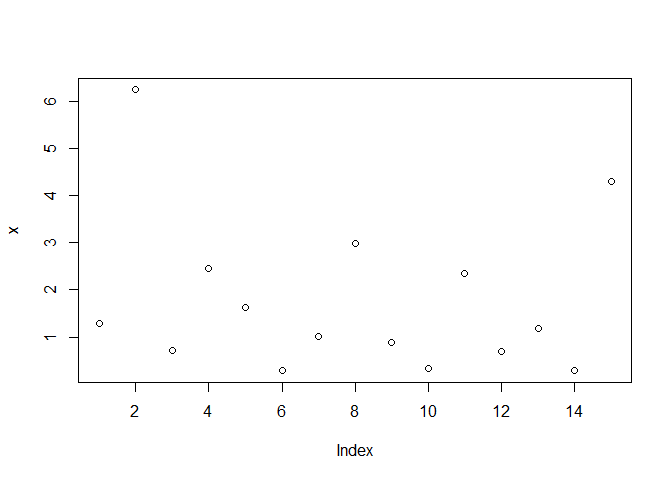 

```r
boxplot(x)
```

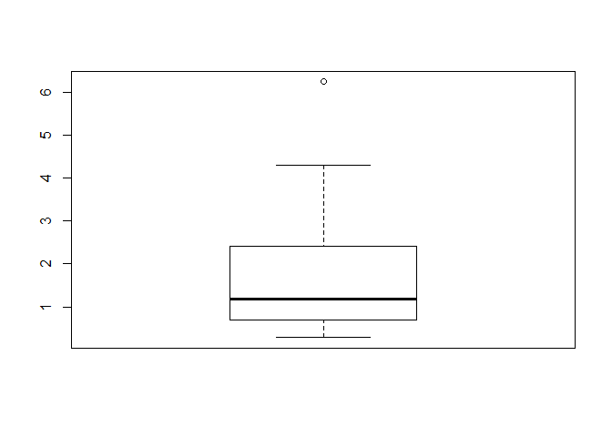 

```r
qqnorm(x)
qqline(x,lty=2,col=2,lwd=3)
```

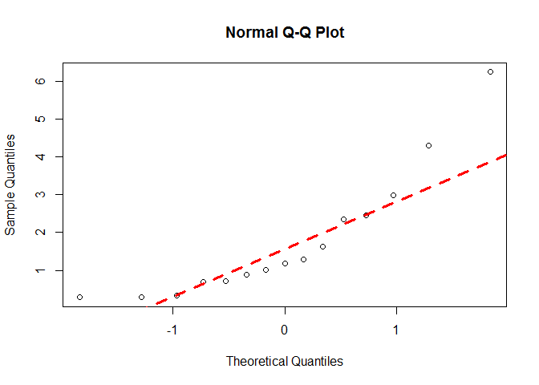 

```r
shapiro.test(x)
```

```
## 
## 	Shapiro-Wilk normality test
## 
## data:  x
## W = 0.82095, p-value = 0.006916
```

```r
summary(x)
```

```
##    Min. 1st Qu.  Median    Mean 3rd Qu.    Max. 
##  0.2850  0.7031  1.1800  1.7770  2.4020  6.2410
```

Our null hypothesis is that the median of x is not different from 1


```r
wilcox.test(x, alternative = "two.sided", mu = 1) #we cannot reject the null hypothesis here.
```

```
## 
## 	Wilcoxon signed rank test
## 
## data:  x
## V = 81, p-value = 0.2524
## alternative hypothesis: true location is not equal to 1
```


## Two Indipendent Samples T-test (PARAMETRIC TEST)
Parametric method for examining the difference in means between two independent populations. 

Let's use again our dataset on cars


```r
#mpg = consumption Miles/(US) gallon


head(mtcars)
```

```
##                    mpg cyl disp  hp drat    wt  qsec vs am gear carb
## Mazda RX4         21.0   6  160 110 3.90 2.620 16.46  0  1    4    4
## Mazda RX4 Wag     21.0   6  160 110 3.90 2.875 17.02  0  1    4    4
## Datsun 710        22.8   4  108  93 3.85 2.320 18.61  1  1    4    1
## Hornet 4 Drive    21.4   6  258 110 3.08 3.215 19.44  1  0    3    1
## Hornet Sportabout 18.7   8  360 175 3.15 3.440 17.02  0  0    3    2
## Valiant           18.1   6  225 105 2.76 3.460 20.22  1  0    3    1
```

```r
#transform am into a factor [Transmission (0 = automatic, 1 = manual)]
mtcars$fam = factor(mtcars$am, levels = c(0,1), labels = c("automatic", "manual"))


attach(mtcars)
head(mtcars)
```

```
##                    mpg cyl disp  hp drat    wt  qsec vs am gear carb
## Mazda RX4         21.0   6  160 110 3.90 2.620 16.46  0  1    4    4
## Mazda RX4 Wag     21.0   6  160 110 3.90 2.875 17.02  0  1    4    4
## Datsun 710        22.8   4  108  93 3.85 2.320 18.61  1  1    4    1
## Hornet 4 Drive    21.4   6  258 110 3.08 3.215 19.44  1  0    3    1
## Hornet Sportabout 18.7   8  360 175 3.15 3.440 17.02  0  0    3    2
## Valiant           18.1   6  225 105 2.76 3.460 20.22  1  0    3    1
##                         fam
## Mazda RX4            manual
## Mazda RX4 Wag        manual
## Datsun 710           manual
## Hornet 4 Drive    automatic
## Hornet Sportabout automatic
## Valiant           automatic
```

```r
summary(mtcars$fam)
```

```
## automatic    manual 
##        19        13
```

Now, we want to test for the difference in car consumption depending on the transmission type. 
Are the 2 'indipendent populations' normally distributed?


```r
par(mfrow = c(1,2))
qqnorm(mpg[fam == "manual"]);qqline(mpg[fam == "manual"])
qqnorm(mpg[fam == "automatic"]); qqline(mpg[fam == "automatic"])
```

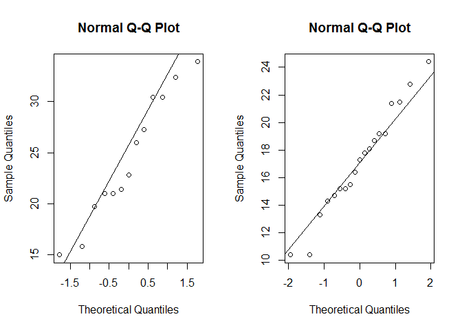 

```r
shapiro.test(mpg[fam == "manual"])
```

```
## 
## 	Shapiro-Wilk normality test
## 
## data:  mpg[fam == "manual"]
## W = 0.9458, p-value = 0.5363
```

```r
shapiro.test(mpg[fam == "automatic"])
```

```
## 
## 	Shapiro-Wilk normality test
## 
## data:  mpg[fam == "automatic"]
## W = 0.97677, p-value = 0.8987
```

```r
par(mfrow=c(1,1))
```

let's plot what we aim to test for 

```r
boxplot(mpg ~ fam, ylab = "Miles/gallon", xlab = "Transmission", las = 1)
```

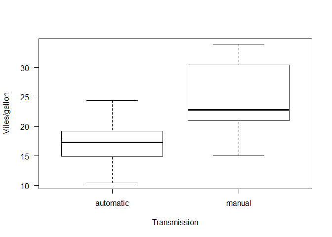 

Our Ho null hypothesis is that the consumption is the same irrespective to transmission. We assume non-equal variances


```r
t.test(mpg  ~fam, mu = 0, alt = "two.sided", conf = 0.95, var.eq = F, paired = F)
```

```
## 
## 	Welch Two Sample t-test
## 
## data:  mpg by fam
## t = -3.7671, df = 18.332, p-value = 0.001374
## alternative hypothesis: true difference in means is not equal to 0
## 95 percent confidence interval:
##  -11.280194  -3.209684
## sample estimates:
## mean in group automatic    mean in group manual 
##                17.14737                24.39231
```

```r
# from the output: please note that CIs are the confidence intervales for differences in means

# same results if you run the following (meaning that the other commands were all default)
t.test(mpg ~ fam) 
```

```
## 
## 	Welch Two Sample t-test
## 
## data:  mpg by fam
## t = -3.7671, df = 18.332, p-value = 0.001374
## alternative hypothesis: true difference in means is not equal to 0
## 95 percent confidence interval:
##  -11.280194  -3.209684
## sample estimates:
## mean in group automatic    mean in group manual 
##                17.14737                24.39231
```

```r
#the alternative could be one-sided (greater, lesser) as we discussed earlier for one-sample t-tests
```

If we assume equal variance, we run the following 


```r
t.test(mpg ~ fam, var.eq = TRUE, paired = F)
```

```
## 
## 	Two Sample t-test
## 
## data:  mpg by fam
## t = -4.1061, df = 30, p-value = 0.000285
## alternative hypothesis: true difference in means is not equal to 0
## 95 percent confidence interval:
##  -10.84837  -3.64151
## sample estimates:
## mean in group automatic    mean in group manual 
##                17.14737                24.39231
```

OK. Let's sum up. We have two (roughly) normally distributed populations.
We wanted to test for differences in means, and we applied a t-test for indipendent samples. Any time we work with the t-test, we have to verify whether the variance is equal betwenn the 2 populations or not, then we fit the t-test accordingly.  

Ways to check for equal / not equal variance

1) examine the boxplot visually


```r
boxplot(mpg ~ fam, ylab = "Miles/gallon", xlab = "Transmission", las = 1)
```

 

2) we compute the actual variance

```r
var(mpg[fam == "manual"])
```

```
## [1] 38.02577
```

```r
var(mpg[fam == "automatic"])
```

```
## [1] 14.6993
```

```r
#actually, there is 2/3 times difference in variance.
```

3) Levene's test

```r
library(car)
leveneTest(mpg ~ fam) # Ho that population variances are equal
```

```
## Levene's Test for Homogeneity of Variance (center = median)
##       Df F value  Pr(>F)  
## group  1  4.1876 0.04957 *
##       30                  
## ---
## Signif. codes:  0 '***' 0.001 '**' 0.01 '*' 0.05 '.' 0.1 ' ' 1
```

```r
# Ho rejected, non-equal variances

# in conclusion, variances are not homogeneous, and we should run a t-test with var.eq = F
```


## Mann-Whitney U test for two indipendent samples  (NON-PARAMETRIC TEST) (also referred to as Wilcoxon rank-sum test)

Let's change our response variable. Focus now on hp (Gross horsepower)
(remember, mtcars is still attached)

```r
qqnorm(hp[fam == "manual"]); qqline(hp[fam == "manual"])
```

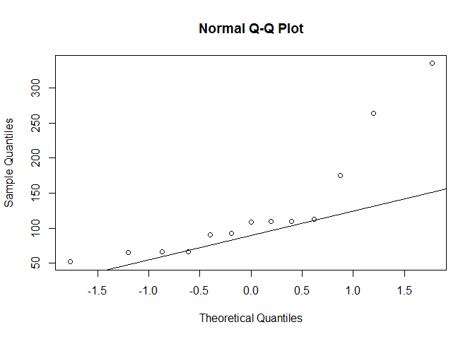 

```r
qqnorm(hp[fam == "automatic"]);qqline(hp[fam == "automatic"])
```

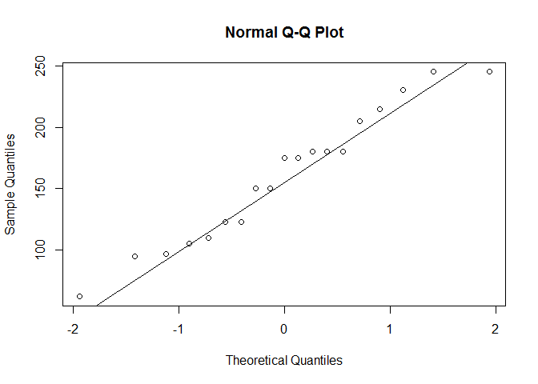 

```r
shapiro.test(hp[fam=="manual"])
```

```
## 
## 	Shapiro-Wilk normality test
## 
## data:  hp[fam == "manual"]
## W = 0.76758, p-value = 0.00288
```

```r
shapiro.test(hp[fam=="automatic"])
```

```
## 
## 	Shapiro-Wilk normality test
## 
## data:  hp[fam == "automatic"]
## W = 0.95835, p-value = 0.5403
```

Let's use a more conservative approach this time, being hp not-normally distributed (at least in the 'population' of cars with manual transmission)
test for independent samples - non-parametric

We want to test for difference in hp depending on transmission
Using a non-parametric test, we test for differences in MEDIANS between 2 independent populations


```r
boxplot(hp ~ fam)
```

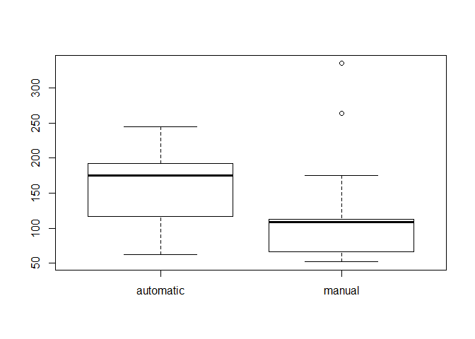 

our null hypothesis is that medians are equal (two-sided)


```r
wilcox.test(hp ~ fam, mu = 0, alt = "two.sided", conf.int = T, conf.level = 0.95, paired = F, exact = F)## non parametric conf.int are reported
```

```
## 
## 	Wilcoxon rank sum test with continuity correction
## 
## data:  hp by fam
## W = 176, p-value = 0.0457
## alternative hypothesis: true location shift is not equal to 0
## 95 percent confidence interval:
##  8.624237e-05 9.199995e+01
## sample estimates:
## difference in location 
##               55.00007
```

now it is time to detach our dataset

```r
detach(mtcars)
```

+++++++++++++++++
Edited by Simone Ciuti, University of Freiburg, 20/10/2015; 
Intended for the only purpose of teaching @ Freiburg University; 
+++++++++++++++++++++++++++++++++++++++++++++++++


