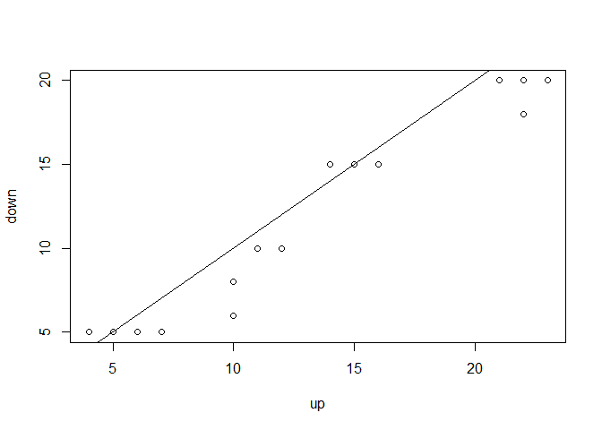
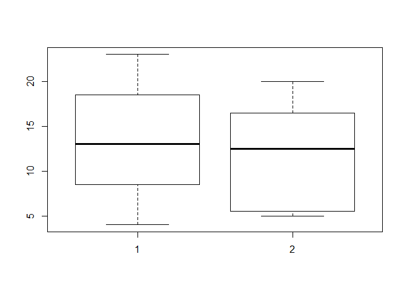
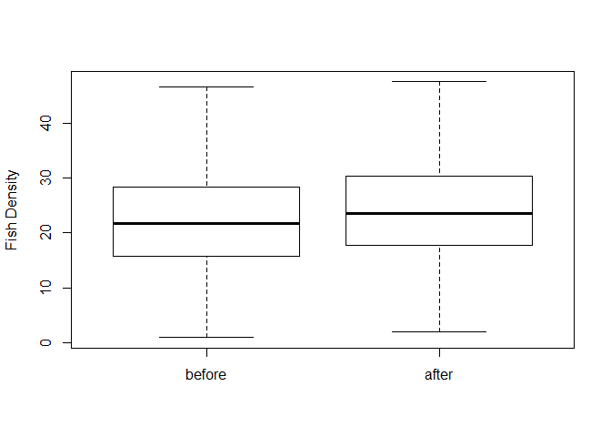
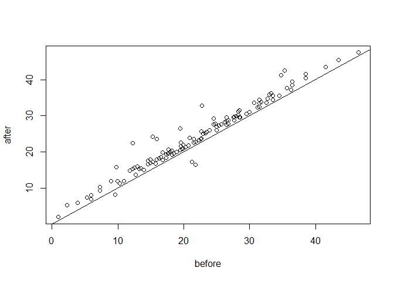

# Classical Tests Part III

## Two dependend samples test. Wilcoxon signed rank test (NON PARAMETRIC)
This is a non-parametric method appropriate for examining the median difference in observations for 2 populations that are paired or dependent on one onother

Open the dataset 'streams'
Water measurements taken at different levels of a river:
'up' and 'down' are water quality measurements of the same river taken before and after a water treatment filter, respectively 


```r
setwd("~/TEACHING IN FREIBURG/11 - Statistics with R fall 2015/4_Classical Tests")
streams = read.table("streams.txt",header=T)
head(streams)
```

```
##   down up
## 1   20 23
## 2   15 16
## 3    6 10
## 4    5  4
## 5   20 22
## 6   15 15
```


```r
attach(streams)
summary(streams)
```

```
##       down             up       
##  Min.   : 5.00   Min.   : 4.00  
##  1st Qu.: 5.75   1st Qu.: 9.25  
##  Median :12.50   Median :13.00  
##  Mean   :12.00   Mean   :13.38  
##  3rd Qu.:15.75   3rd Qu.:17.25  
##  Max.   :20.00   Max.   :23.00
```

```r
plot(up, down)
abline(a = 0, b = 1) #add a line with intercept 0 and slope 1
```

 
The line you see in the plot corresponds to x = y, that means same water measuremets before and after the water treatment (it looks like to be true in 2 rivers only)


Our null hypothesis is that the median before and after is not different


```r
shapiro.test(down)
```

```
## 
## 	Shapiro-Wilk normality test
## 
## data:  down
## W = 0.86604, p-value = 0.02367
```

```r
shapiro.test(up)
```

```
## 
## 	Shapiro-Wilk normality test
## 
## data:  up
## W = 0.93609, p-value = 0.3038
```

```r
#the assumption of normality is certainly not met for measurements after the treatment. Let's go for a more conservative non-parametric procedure

summary(up)
```

```
##    Min. 1st Qu.  Median    Mean 3rd Qu.    Max. 
##    4.00    9.25   13.00   13.38   17.25   23.00
```

```r
summary(down)
```

```
##    Min. 1st Qu.  Median    Mean 3rd Qu.    Max. 
##    5.00    5.75   12.50   12.00   15.75   20.00
```

```r
boxplot(up, down)
```

 

```r
wilcox.test(up, down, mu = 0, paired = T, conf.int = T, exact = F) #paired = T !!!
```

```
## 
## 	Wilcoxon signed rank test with continuity correction
## 
## data:  up and down
## V = 97, p-value = 0.004971
## alternative hypothesis: true location shift is not equal to 0
## 95 percent confidence interval:
##  0.9999931 2.4999530
## sample estimates:
## (pseudo)median 
##            1.5
```

```r
detach(streams)
```


## Two dependend samples test. Paired T-test (PARAMETRIC)
This is the parametric method for examining the difference in means for two populations that are paired or dependent on one another


```r
fish = read.table("fishing.txt",header=T)
```

This is a dataset about the density of a fish prey species (fish/km2) in 121 lakes before and after removing a non-native predator

  

```r
attach(fish)
head(fish)
```

```
##   lakes    before     after
## 1     1 19.508582 20.508582
## 2     2  5.297289  7.297289
## 3     3 26.495652 27.495652
## 4     4  3.928250  5.928250
## 5     5 12.955881 15.955881
## 6     6  9.776376 15.776376
```

```r
boxplot(before,after,ylab="Fish Density",
        names=c("before", "after"))
```

 

```r
shapiro.test(before)
```

```
## 
## 	Shapiro-Wilk normality test
## 
## data:  before
## W = 0.99579, p-value = 0.9777
```

```r
shapiro.test(after)
```

```
## 
## 	Shapiro-Wilk normality test
## 
## data:  after
## W = 0.99458, p-value = 0.9258
```

```r
plot(before,after)
abline(a=0,b=1) 
```

 


```r
t.test(before, after, mu = 0, paired = T)
```

```
## 
## 	Paired t-test
## 
## data:  before and after
## t = -12.062, df = 120, p-value < 2.2e-16
## alternative hypothesis: true difference in means is not equal to 0
## 95 percent confidence interval:
##  -2.513985 -1.805017
## sample estimates:
## mean of the differences 
##               -2.159501
```

```r
t.test(after, before, mu = 0, paired = T) #changing the order of variables, we have a change in the sign of the t-test estimated mean of differences
```

```
## 
## 	Paired t-test
## 
## data:  after and before
## t = 12.062, df = 120, p-value < 2.2e-16
## alternative hypothesis: true difference in means is not equal to 0
## 95 percent confidence interval:
##  1.805017 2.513985
## sample estimates:
## mean of the differences 
##                2.159501
```

```r
detach(fish)
```

+++++++++++++++++
Edited by Simone Ciuti, University of Freiburg, 20/10/2015; 
Intended for the only purpose of teaching @ Freiburg University; 

+++++++++++++++++++++++++++++++++++++++++++++++++


