# NAME AND LAST NAME HERE

# Exercise # 3
load data1.txt.
These are data from 2 gardens a & b, we collect 10 samples for each and measure ozone concentration. 
Our null hypothesis here is that means of Ozone concentrations in the 2 gardens are equal. Can you reject it?


```r
setwd("~/TEACHING IN FREIBURG/11 - Statistics with R fall 2015/5_Week 1 wrap-up/raw data")
data1 <- read.delim("data1.txt")
attach(data1)
head(data1)
```

```
##   Ozone garden
## 1     3      a
## 2     4      a
## 3     4      a
## 4     3      a
## 5     2      a
## 6     3      a
```

```r
boxplot(Ozone ~ garden, xlab = "Garden", ylab = "Ozone", col = "red")


# the question is about "means", but are we allowed to run a parametric procedure here?
shapiro.test(Ozone[garden == "a"])
```

```
## 
## 	Shapiro-Wilk normality test
## 
## data:  Ozone[garden == "a"]
## W = 0.95288, p-value = 0.7026
```

```r
shapiro.test(Ozone[garden == "b"])
```

```
## 
## 	Shapiro-Wilk normality test
## 
## data:  Ozone[garden == "b"]
## W = 0.95288, p-value = 0.7026
```

```r
# yes, indeed.

# boxplots look to have comparable variances
var(Ozone[garden == "a"])
```

```
## [1] 1.333333
```

```r
var(Ozone[garden == "b"])  # indeed, they are identical!
```

```
## [1] 1.333333
```

```r
# just for fun (although unnecessary here)
library(car)
```

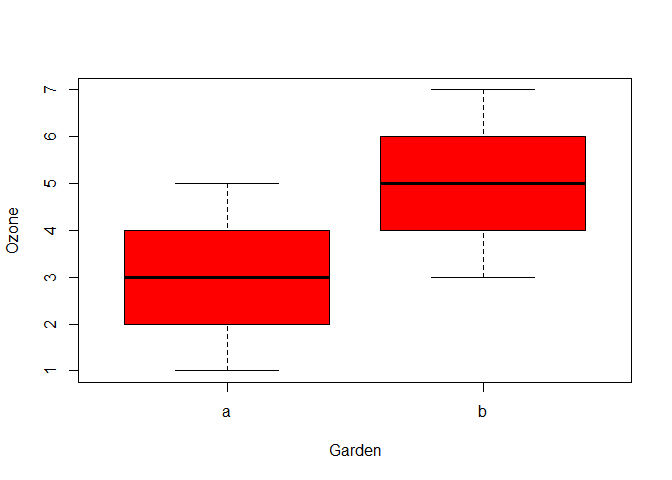 

```r
leveneTest(Ozone ~ garden)
```

```
## Levene's Test for Homogeneity of Variance (center = median)
##       Df F value Pr(>F)
## group  1       0      1
##       18
```

```r
# definitely, no problems of homogeneity of variances here!
# parametric, 2 independent samples, homogeneity OK. let's run the t-test
t.test(Ozone ~ garden, mu = 0, alt = "two.sided", conf = 0.95, var.eq = T, paired = F)
```

```
## 
## 	Two Sample t-test
## 
## data:  Ozone by garden
## t = -3.873, df = 18, p-value = 0.001115
## alternative hypothesis: true difference in means is not equal to 0
## 95 percent confidence interval:
##  -3.0849115 -0.9150885
## sample estimates:
## mean in group a mean in group b 
##               3               5
```

```r
# final answer is YES. we can reject the null hipothesis
detach(data1)
```

# Exercise # 4

(1) load the dataset Mule Deer.txt
This is a time series (51 years) of mule deer population surveys (columns 2:4) and associated covariates (columns 5:14), i.e., presence of predators (coyotes) and weather data. 


```r
setwd("~/TEACHING IN FREIBURG/11 - Statistics with R fall 2015/5_Week 1 wrap-up/raw data")
MD <- read.delim("Mule Deer.txt")
```

(2) create a vector with a logic statement where year is < 1983

```r
year1 = MD$year < 1983
```


(3) add the vector to the Mule Deer dataset

```r
MD = cbind(MD, year1)
head(MD)
```

```
##   year NumbMDSpring TotalMDFall Fw.FrationFall BadlandsCoyote.1000kmsq
## 1 1962          398         264      0.9732143               24.385382
## 2 1963          409         352      1.5289256                8.128461
## 3 1964          473         543      1.2190476                8.128461
## 4 1965          467         546      0.8260870                8.128461
## 5 1966          459         488      1.2404372               43.351790
## 6 1967          361         549      1.2307692               27.094869
##     WSI Average_preci_winter Average_snowfall_winter
## 1 109.5                 7.34                    69.6
## 2  82.0                14.70                    99.2
## 3 102.5                 2.98                    90.0
## 4 158.0                14.22                   193.0
## 5 110.0                13.18                   128.4
## 6 115.0                13.82                   234.8
##   Average_snowdepth_winter Average_maxtemp_winter Average_mintemp_winter
## 1                 28.78157              0.7562734              -16.08749
## 2                 22.62220              3.9900952              -11.70364
## 3                 32.34683              3.8251383              -12.84041
## 4                201.15038             -2.3462949              -16.55879
## 5                 66.25453              2.7266052              -12.94432
## 6                 34.59948              2.3102965              -11.39476
##   Average_NP_winter Average_PDO_winter Average_MEI_winter year1
## 1            10.684             -1.680              14.00  TRUE
## 2             7.466             -0.472              18.00  TRUE
## 3             9.076             -0.846              42.25  TRUE
## 4             9.884             -0.936              23.75  TRUE
## 5            11.274             -0.534              56.75  TRUE
## 6            10.958             -0.610              19.75  TRUE
```


(4) repeat the same procedure, adding a numeric column this time 
(and change the logic statement with year is equal to 1990)

```r
year2 = as.numeric(MD$year == 1990)
MD = cbind(MD, year2)
head(MD)
```

```
##   year NumbMDSpring TotalMDFall Fw.FrationFall BadlandsCoyote.1000kmsq
## 1 1962          398         264      0.9732143               24.385382
## 2 1963          409         352      1.5289256                8.128461
## 3 1964          473         543      1.2190476                8.128461
## 4 1965          467         546      0.8260870                8.128461
## 5 1966          459         488      1.2404372               43.351790
## 6 1967          361         549      1.2307692               27.094869
##     WSI Average_preci_winter Average_snowfall_winter
## 1 109.5                 7.34                    69.6
## 2  82.0                14.70                    99.2
## 3 102.5                 2.98                    90.0
## 4 158.0                14.22                   193.0
## 5 110.0                13.18                   128.4
## 6 115.0                13.82                   234.8
##   Average_snowdepth_winter Average_maxtemp_winter Average_mintemp_winter
## 1                 28.78157              0.7562734              -16.08749
## 2                 22.62220              3.9900952              -11.70364
## 3                 32.34683              3.8251383              -12.84041
## 4                201.15038             -2.3462949              -16.55879
## 5                 66.25453              2.7266052              -12.94432
## 6                 34.59948              2.3102965              -11.39476
##   Average_NP_winter Average_PDO_winter Average_MEI_winter year1 year2
## 1            10.684             -1.680              14.00  TRUE     0
## 2             7.466             -0.472              18.00  TRUE     0
## 3             9.076             -0.846              42.25  TRUE     0
## 4             9.884             -0.936              23.75  TRUE     0
## 5            11.274             -0.534              56.75  TRUE     0
## 6            10.958             -0.610              19.75  TRUE     0
```

(5) rename the columns you added 

```r
names(MD)
```

```
##  [1] "year"                     "NumbMDSpring"            
##  [3] "TotalMDFall"              "Fw.FrationFall"          
##  [5] "BadlandsCoyote.1000kmsq"  "WSI"                     
##  [7] "Average_preci_winter"     "Average_snowfall_winter" 
##  [9] "Average_snowdepth_winter" "Average_maxtemp_winter"  
## [11] "Average_mintemp_winter"   "Average_NP_winter"       
## [13] "Average_PDO_winter"       "Average_MEI_winter"      
## [15] "year1"                    "year2"
```

```r
names(MD)[15:16] = c("prior_1983", "yes_1990")
names(MD)
```

```
##  [1] "year"                     "NumbMDSpring"            
##  [3] "TotalMDFall"              "Fw.FrationFall"          
##  [5] "BadlandsCoyote.1000kmsq"  "WSI"                     
##  [7] "Average_preci_winter"     "Average_snowfall_winter" 
##  [9] "Average_snowdepth_winter" "Average_maxtemp_winter"  
## [11] "Average_mintemp_winter"   "Average_NP_winter"       
## [13] "Average_PDO_winter"       "Average_MEI_winter"      
## [15] "prior_1983"               "yes_1990"
```

(6) remove column number 4 from the dataset

```r
MD$Fw.FrationFall = NULL
# or MD[,4] = NULL
names(MD)
```

```
##  [1] "year"                     "NumbMDSpring"            
##  [3] "TotalMDFall"              "BadlandsCoyote.1000kmsq" 
##  [5] "WSI"                      "Average_preci_winter"    
##  [7] "Average_snowfall_winter"  "Average_snowdepth_winter"
##  [9] "Average_maxtemp_winter"   "Average_mintemp_winter"  
## [11] "Average_NP_winter"        "Average_PDO_winter"      
## [13] "Average_MEI_winter"       "prior_1983"              
## [15] "yes_1990"
```

(7) are Average_preci_winter and Average_snowfall_winter correlated?

```r
attach(MD)
qqnorm(Average_preci_winter); qqline(Average_preci_winter)
```

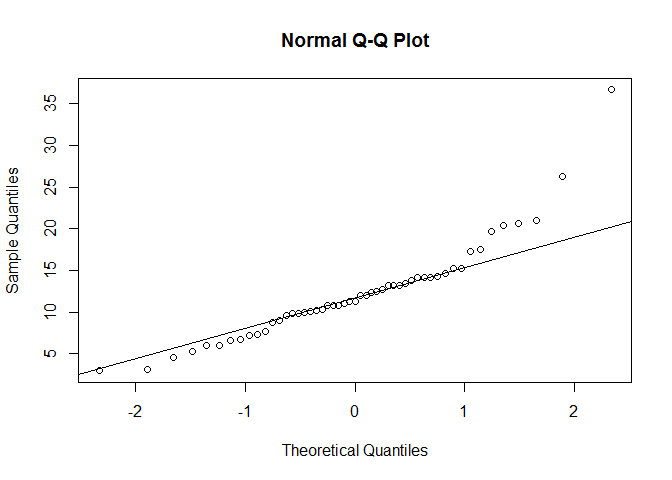 

```r
qqnorm(Average_snowfall_winter); qqline(Average_snowfall_winter)
```

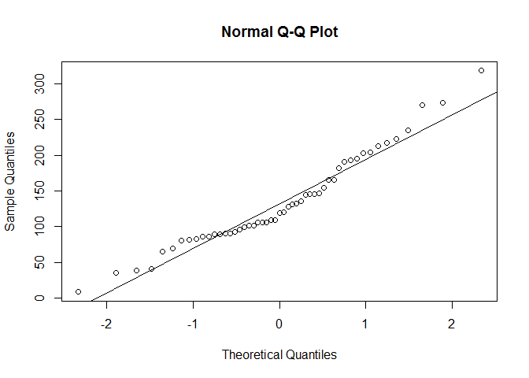 

```r
shapiro.test(Average_preci_winter); shapiro.test(Average_snowfall_winter)
```

```
## 
## 	Shapiro-Wilk normality test
## 
## data:  Average_preci_winter
## W = 0.88609, p-value = 0.000149
```

```
## 
## 	Shapiro-Wilk normality test
## 
## data:  Average_snowfall_winter
## W = 0.95541, p-value = 0.05321
```

```r
plot(Average_preci_winter, Average_snowfall_winter)
```

 

```r
cor.test(Average_preci_winter, Average_snowfall_winter, method = "spearman")
```

```
## Warning in cor.test.default(Average_preci_winter,
## Average_snowfall_winter, : Cannot compute exact p-value with ties
```

```
## 
## 	Spearman's rank correlation rho
## 
## data:  Average_preci_winter and Average_snowfall_winter
## S = 5706.1, p-value = 4.73e-10
## alternative hypothesis: true rho is not equal to 0
## sample estimates:
##       rho 
## 0.7418034
```

(8) Are  WSI and Average_snowfall_winter correlated?


```r
qqnorm(WSI); qqline(WSI)
```

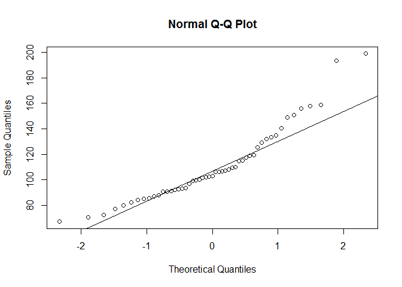 

```r
qqnorm(Average_snowfall_winter); qqline(Average_snowfall_winter)
```

 

```r
shapiro.test(WSI); shapiro.test(Average_snowfall_winter)
```

```
## 
## 	Shapiro-Wilk normality test
## 
## data:  WSI
## W = 0.91187, p-value = 0.001074
```

```
## 
## 	Shapiro-Wilk normality test
## 
## data:  Average_snowfall_winter
## W = 0.95541, p-value = 0.05321
```

```r
plot(WSI, Average_snowfall_winter)
```

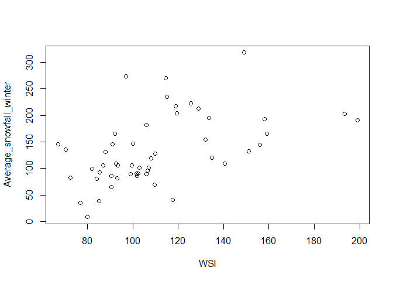 

```r
cor.test(WSI, Average_snowfall_winter, method = "spearman") 
```

```
## Warning in cor.test.default(WSI, Average_snowfall_winter, method =
## "spearman"): Cannot compute exact p-value with ties
```

```
## 
## 	Spearman's rank correlation rho
## 
## data:  WSI and Average_snowfall_winter
## S = 9772.9, p-value = 2.115e-05
## alternative hypothesis: true rho is not equal to 0
## sample estimates:
##      rho 
## 0.557788
```

(9) Are Average_snowdepth_winter and Average_maxtemp_winter correlated?

```r
qqnorm(Average_snowdepth_winter); qqline(Average_snowdepth_winter)
```

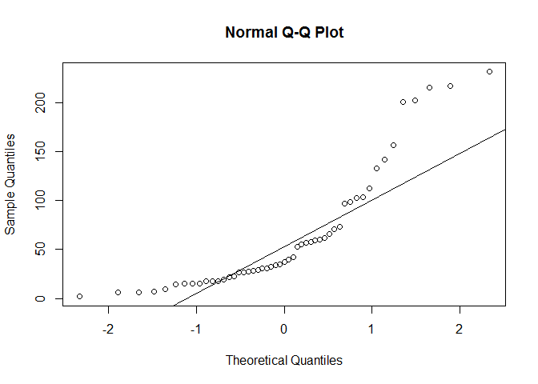 

```r
qqnorm(Average_maxtemp_winter); qqline(Average_maxtemp_winter)
```

 

```r
shapiro.test(Average_snowdepth_winter); shapiro.test(Average_maxtemp_winter)
```

```
## 
## 	Shapiro-Wilk normality test
## 
## data:  Average_snowdepth_winter
## W = 0.80303, p-value = 8.497e-07
```

```
## 
## 	Shapiro-Wilk normality test
## 
## data:  Average_maxtemp_winter
## W = 0.97486, p-value = 0.3479
```

```r
plot(Average_snowdepth_winter, Average_maxtemp_winter)
```

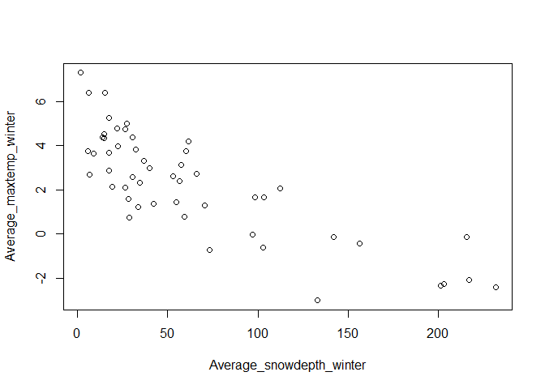 

```r
cor.test(Average_snowdepth_winter, Average_maxtemp_winter, method = "spearman")
```

```
## 
## 	Spearman's rank correlation rho
## 
## data:  Average_snowdepth_winter and Average_maxtemp_winter
## S = 39414, p-value < 2.2e-16
## alternative hypothesis: true rho is not equal to 0
## sample estimates:
##        rho 
## -0.7834389
```

(10) Are Average_maxtemp_winter and Average_mintemp_winter correlated?


```r
qqnorm(Average_maxtemp_winter); qqline(Average_maxtemp_winter)
```

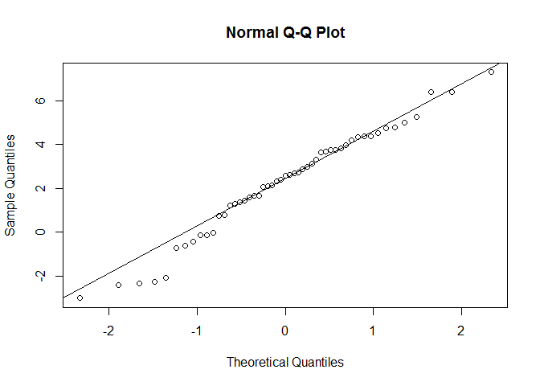 

```r
qqnorm(Average_mintemp_winter); qqline(Average_mintemp_winter)
```

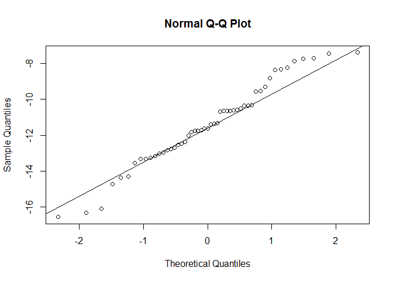 

```r
shapiro.test(Average_maxtemp_winter); shapiro.test(Average_mintemp_winter)
```

```
## 
## 	Shapiro-Wilk normality test
## 
## data:  Average_maxtemp_winter
## W = 0.97486, p-value = 0.3479
```

```
## 
## 	Shapiro-Wilk normality test
## 
## data:  Average_mintemp_winter
## W = 0.97277, p-value = 0.2874
```

```r
plot(Average_maxtemp_winter, Average_mintemp_winter)
```

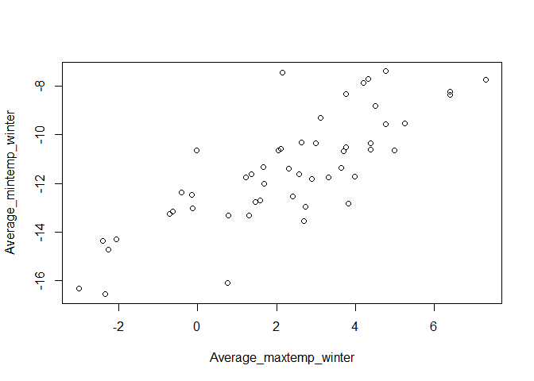 

```r
cor.test(Average_maxtemp_winter, Average_mintemp_winter, method = "pearson")
```

```
## 
## 	Pearson's product-moment correlation
## 
## data:  Average_maxtemp_winter and Average_mintemp_winter
## t = 9.2245, df = 49, p-value = 2.735e-12
## alternative hypothesis: true correlation is not equal to 0
## 95 percent confidence interval:
##  0.6675752 0.8791810
## sample estimates:
##       cor 
## 0.7966051
```

```r
detach(MD)
```


# Exercise # 5


Create a vector X with 18 numbers randomly picked from a standard normal distribution.
(set.seed(5))
Create a vector Y with 18 numbers randomly picked from a normal distribution with mean=5 and sd=2.(set.seed(12))
Check / test for the normality of both vectors. 
Create a dataframe 'data' combining the 2 vectors, assign X1 and Y1 as column names (if you cannot figure it out, google it!).
Rename the columns as column1 and column2 (if you cannot figure it out, google it!).
Prepare a scatterplot column1 (x-axis) vs column2 (y-axis) of all values except the second row.
Run a Kendal correlation test between the variables (again, no data from row 2)
is the Kendal the best correlation test that should be used in this specific case?


```r
set.seed(5)
X = rnorm(18)
set.seed(12)
Y = rnorm(18, mean = 5, sd = 2)
shapiro.test(X); qqnorm(X); qqline(X)
```

```
## 
## 	Shapiro-Wilk normality test
## 
## data:  X
## W = 0.93257, p-value = 0.2154
```

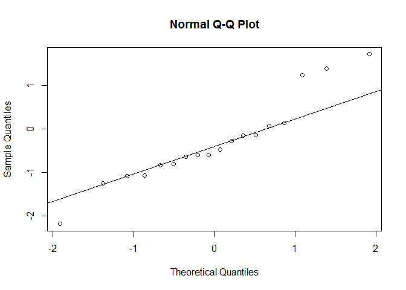 

```r
shapiro.test(Y); qqnorm(Y); qqline(Y)
```

```
## 
## 	Shapiro-Wilk normality test
## 
## data:  Y
## W = 0.97107, p-value = 0.8176
```

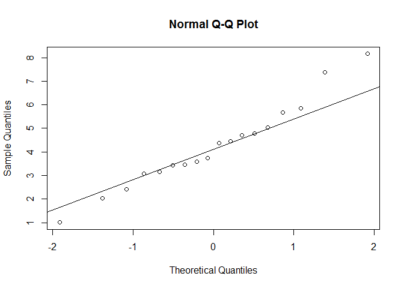 

```r
data = data.frame("X1" = X, "Y1" = Y)
names(data) = c("column1", "column2")
plot(data$column1[-2], data$column2[-2])
```

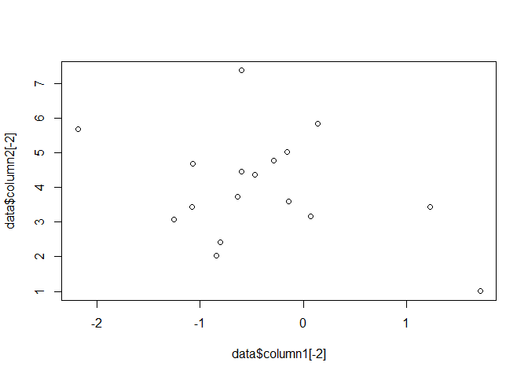 

```r
cor.test(data$column1[-2], data$column1[-2], method = "kendal")
```

```
## 
## 	Kendall's rank correlation tau
## 
## data:  data$column1[-2] and data$column1[-2]
## T = 136, p-value = 5.551e-15
## alternative hypothesis: true tau is not equal to 0
## sample estimates:
## tau 
##   1
```

```r
#well, data are normally distributed so we would be allowed to run the Pearson
```


