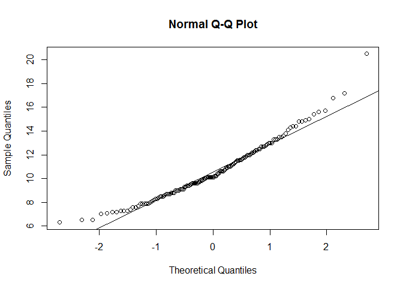
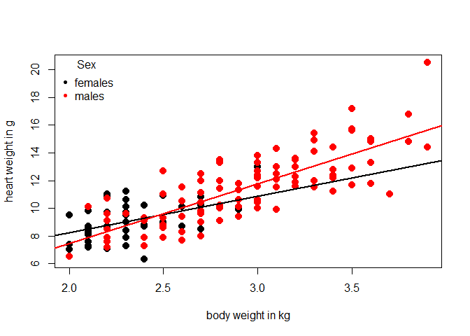
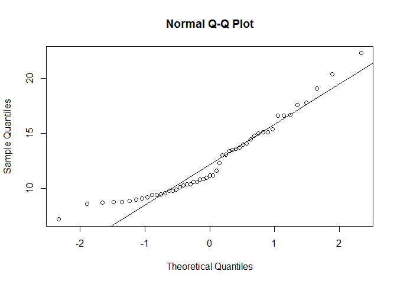
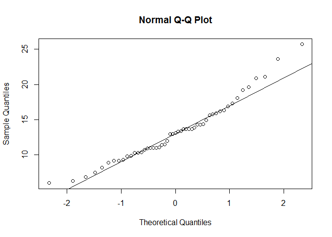
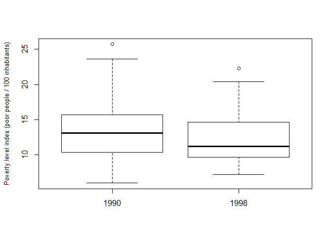

# NAME AND LAST NAME HERE
# Exercise # 1 - Quick revision of basic tasks in R

(1) Create a vector with numbers from 1 to 100 increasing by 0.12 (myvector is the name assigned to the vector); 
(2) how many numbers are stored in your vector?
(3) calculate the sqrt of the 50th value minus the log10 of the 10th value of the vector


```r
#(1)
myvector = seq(1, 100 , 0.12)
#(2)
length(myvector)
```

```
## [1] 826
```

```r
#(3)
sqrt(myvector[50]) - log10(myvector[10])
```

```
## [1] 2.304912
```

(4) Create 2 samples (sample size = 184 in both cases) randomly drawn for 2 normal distributions. 
    Set the seed with the number 10 to make your results comparable to your colleagues
    One sample is randomly drawn from a standard normal distribution.
    The other sample is randomly drawn from a normal distribution with mean = 103 and sd = 12
(5) create a matrix (rowwise, 92 rows) with the first sample, and another matrix (columnwise, 92 rows) with the second sample


```r
#(4)
set.seed(10)
sample1 = rnorm(184)
set.seed(10)
sample2 = rnorm(184, mean = 103, sd = 12)
#(5)
mymatrix1 = matrix(sample1, nrow = 92, byrow = TRUE)
mymatrix2 = matrix(sample2, nrow = 92, byrow = FALSE)
```
(6) provided the following data (old experiment from the 40s)

```r
library(MASS)
data(cats)
attach(cats)
head(cats)
```

```
##   Sex Bwt Hwt
## 1   F 2.0 7.0
## 2   F 2.0 7.4
## 3   F 2.0 9.5
## 4   F 2.1 7.2
## 5   F 2.1 7.3
## 6   F 2.1 7.6
```
Is the variable Hwt (heart weight) normally distributed?

```r
qqnorm(Hwt)
qqline(Hwt) # banana shape. let's run the shapiro test
```

 

```r
shapiro.test(Hwt) # we reject the null hypothesis. Hwt is not normally distributed
```

```
## 
## 	Shapiro-Wilk normality test
## 
## data:  Hwt
## W = 0.96039, p-value = 0.0003654
```

(7) Using the same dataset that it is still attached (cats), make a plot with x= Bwt (body weight in kg) and y= Hwt (heart weight in g). 
Add 2 simple linear fits (one for females, one for males). Make sure you use different colours for symbols depending on Sex. Add a proper legend and detach the dataset.


```r
plot(Bwt, Hwt, xlab = "body weight in kg", ylab = "heart weight in g", col = Sex, pch = 20, cex = 2)
abline(lm(Hwt[Sex == "F"] ~ Bwt[Sex == "F"]), col = "black", lwd = 2)
abline(lm(Hwt[Sex == "M"] ~ Bwt[Sex == "M"]), col = "red", lwd = 2)
legend("topleft", c("females", "males"), col = c("black", "red"), title = "Sex",
       bty = "n", pch = c(20, 20), cex = 1)
```

 

```r
detach(cats)
```


# Exercise # 2 Poverty level
Load the dataset poverty.txt
In the following data pairs
first column: percentage of population below poverty level in 1998, as recorded in 51 randomly selected villages
second column: percentage of population below poverty level in 1990 (same villages as the first column
Reference: Statistical Abstract of the United States, 120th edition


```r
setwd("~/TEACHING IN FREIBURG/11 - Statistics with R fall 2015/5_Week 1 wrap-up/raw data")
poverty <- read.delim("poverty.txt")
head(poverty)
```

```
##   y1998 y1990
## 1  14.5  19.2
## 2   9.4  11.4
## 3  16.6  13.7
## 4  14.8  19.6
## 5  15.4  13.9
## 6   9.2  13.7
```

Did poverty levels change in 1998 compared to 1990?


```r
attach(poverty)
qqnorm(y1998)
qqline(y1998)
```

 

```r
qqnorm(y1990)
qqline(y1990)
```

 

```r
shapiro.test(y1998)
```

```
## 
## 	Shapiro-Wilk normality test
## 
## data:  y1998
## W = 0.92053, p-value = 0.002197
```

```r
shapiro.test(y1990)
```

```
## 
## 	Shapiro-Wilk normality test
## 
## data:  y1990
## W = 0.95916, p-value = 0.07684
```

```r
# well, actually we cannot make assumption on the distribution of the two populations, they are not normally distributed
# (at least 1 for sure!) better apply a non-parametric test here
boxplot(y1990, y1998, names = c(1990, 1998), ylab = "Poverty level index (poor people / 100 inhabitants)", cex.lab = 0.8)
```

 

```r
#we need to run a test for paired samples

wilcox.test(y1998, y1990, mu = 0, paired = T)
```

```
## 
## 	Wilcoxon signed rank test with continuity correction
## 
## data:  y1998 and y1990
## V = 393.5, p-value = 0.01873
## alternative hypothesis: true location shift is not equal to 0
```
We reject the null hypothesis here. Actually, poverty levels significantly decreased from 1990 to 1998


