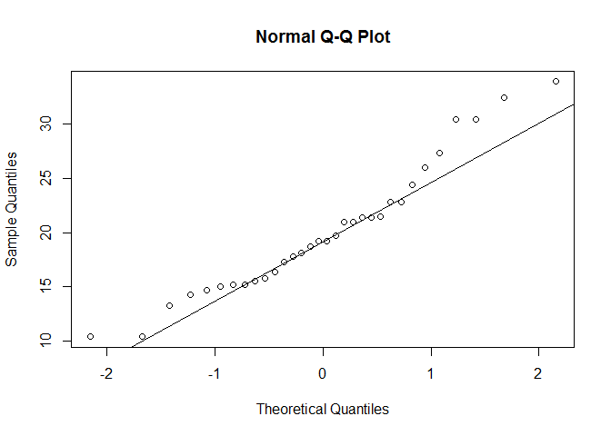

# Use of markdown

This is an R Markdown document. Markdown is a simple formatting syntax for authoring HTML, PDF, and MS Word documents. For more details on using R Markdown see <http://rmarkdown.rstudio.com>.

When you click the **Knit** button a document will be generated that includes both content as well as the output of any embedded R code chunks within the document. You can embed an R code chunk like this:


```r
summary(cars)
```

```
##      speed           dist       
##  Min.   : 4.0   Min.   :  2.00  
##  1st Qu.:12.0   1st Qu.: 26.00  
##  Median :15.0   Median : 36.00  
##  Mean   :15.4   Mean   : 42.98  
##  3rd Qu.:19.0   3rd Qu.: 56.00  
##  Max.   :25.0   Max.   :120.00
```

You can also embed plots, for example:

 

Note that the `echo = FALSE` parameter was added to the code chunk to prevent printing of the R code that generated the plot.


Markdown is a very powerful tool that allows you to present your data analysis to colleagues and supervisors. It also a great tool to summarize analyses for your personal use (e.g., one file has comments, scripts, and output of scripts in just one shot).

see <http://rmarkdown.rstudio.com> on how to improve the look of your markdown files. 
R Markdown is not the only tool of its kind. R sweave is another excellent option for producing reproducible analyses along with comments, details and explanations. 


This is also the way we do the exam in class (Statistics with R). Here's an example


# Exercise 1
Are consumption rates (MPG) from the mtcars dataframe normally distributed?
(you will find an empty 'chunck' after the question, you are supposed to type there your answers and comments; make sure you do not modify the starting and ending codes that define a chunk)


```r
attach(mtcars)
# check for normality using the qq-plot
qqnorm(mpg)
qqline(mpg)
```

 

```r
# Given the low sample size, the qq-plot is a bit misleading and I am not certain whether this is a normal distribution
# I decide to run a test
shapiro.test(mpg)
```

```
## 
## 	Shapiro-Wilk normality test
## 
## data:  mpg
## W = 0.94756, p-value = 0.1229
```

```r
# based on the result of the shapiro test, mpg is a normally distributed variable.

detach(mtcars)
```


Any time you compile scripts in R markdown, Knit it and make sure that everything is fine. If it does not work, this tells you that you have made some typing errors and the machine refuses to produce an HTLM file for you. 

########## End of tutorial 
########## Simone Ciuti, University of Freiburg, 25.10.2015


