# Simple linear regression 

```r
setwd("~/TEACHING IN FREIBURG/11 - Statistics with R fall 2015/6_Simple Linear Regression")
load("lung.Rdata")
head(lung)
```

```
##   LungCap Age Height Smoke Gender Caesarean
## 1   6.475   6   62.1    no   male        no
## 2  10.125  18   74.7   yes female        no
## 3   9.550  16   69.7    no female       yes
## 4  11.125  14   71.0    no   male        no
## 5   4.800   5   56.9    no   male        no
## 6   6.225  11   58.7    no female        no
```


Plot the relationship between age and lung capacity

```r
attach(lung)
plot(Age,LungCap,main="Relation between age and lung capacity"
     , col="green",las=1, xlab="Age of the patient", ylab="Lung capacity")
# we now are interested in the relationship between Age and Lung capacity(causation involved? yes indeed - Age is the independent variable here, whereas Lung capacity is the dependent variable)
#let's run the linear model
mod = lm(LungCap ~ Age)
abline(mod,lwd = 2, col = "grey")
```

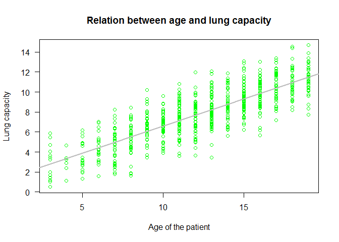 

```r
summary(mod)
```

```
## 
## Call:
## lm(formula = LungCap ~ Age)
## 
## Residuals:
##     Min      1Q  Median      3Q     Max 
## -4.7799 -1.0203 -0.0005  0.9789  4.2650 
## 
## Coefficients:
##             Estimate Std. Error t value Pr(>|t|)    
## (Intercept)  1.14686    0.18353   6.249 7.06e-10 ***
## Age          0.54485    0.01416  38.476  < 2e-16 ***
## ---
## Signif. codes:  0 '***' 0.001 '**' 0.01 '*' 0.05 '.' 0.1 ' ' 1
## 
## Residual standard error: 1.526 on 723 degrees of freedom
## Multiple R-squared:  0.6719,	Adjusted R-squared:  0.6714 
## F-statistic:  1480 on 1 and 723 DF,  p-value: < 2.2e-16
```
In the summary you can find: call (the equation of the model you fit), Residuals (summary stat of residuals), coefficents (parameter estimates for intercept and Age including the null hypothesis testing for intercept = 0 and slope = 0; stars' code for significance levels are provided, alpha = 0.05). Also, residual SE (i.e., measure of variation of observations around regression line), R squared, and F-statistic (with the null hypothesis implies that all estimates are 0) are provided.  

Here, we modelled the relationship between AGE (predictor, independent variable) and Lung Capacity (response, dependent variable). The summary(mod) answered our "research question".
However, do we meet model assumptions?

## Assumptions in linear models

1) Y VALUES (OR THE ERRORS) ARE INDEPENDENT (a.k.a., indipendence)
2) Y VALUES CAN BE EXPRESSED AS A LINEAR FUNCTION OF X (a.k.a. linearity)
3) VARIATION OF OBSERVATIONS AROUND THE REGRESSION LINE
(THE RESIDUAL STANDARD ERROR) IS CONSTANT (a.k.a., homoscedasticity)
4) FOR A GIVEN X VALUE, Y VALUES (OR THE ERRORS) ARE NORMALLY DISTRIBUTED (normality)

In relation to the first assumption, it is important to think about the study design / data collection. Data can be spatially or temporally correlated, there may be repeated measures from sampling units, and these repeated measures can be unbalanced. 
All these problems are dealt with by switching to different model classes (models including spatial and temporal correlation structures, and / or mixed models). These assumption can be partially checked (e.g., spatial autocorrelation): however, it is duty of the researcher whether deciding that these models we are running meet the assumption of independence of errors! It depends on how the researcher collected the data! 


All the other assumptions can be checked by examining the residuals


```r
par(mfrow=c(2,2))
plot(mod)
```

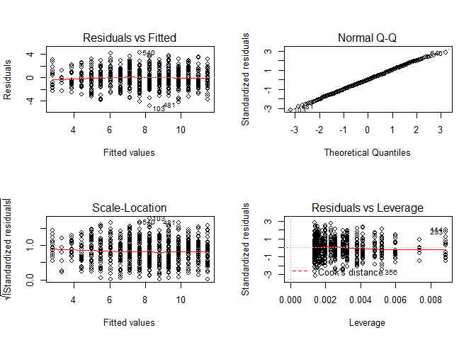 

```r
par(mfrow=c(1,1))
```


TOP-LEFT PLOT
Fitted values vs residuals; we should not see patterns here (homogeneity), red line relatively flat (linearity)

TOP-RIGHT PLOT
normality of residuals check; classical qq-plot

BOTTOM-LEFT PLOT
The third plot (bottom left) this plot is similar to the top left, but on a different scale; it shows the square root of the standardized residuals (where all the values are positive) against the fitted values. If there was a problem, such as the variance increasing with the mean, then the points would be distributed inside a triangular shape, with the scatter of the residuals increasing as the fitted values increase. But there is no such pattern here, which is good.

BOTTOM-RIGHT PLOT
This plot shows standardized residuals as a function of leverage, along with Cook's distance  for each of the observed values of the response variable. The point of this plot is to highlight those y values that have the biggest effect on the parameter estimate problem when points are close to cook's distance contour'


```r
# to get the full list of attributes of the models
attributes(mod)
```

```
## $names
##  [1] "coefficients"  "residuals"     "effects"       "rank"         
##  [5] "fitted.values" "assign"        "qr"            "df.residual"  
##  [9] "xlevels"       "call"          "terms"         "model"        
## 
## $class
## [1] "lm"
```

```r
#for instance
mod$coefficients   # these are the coefficients from the summary table
```

```
## (Intercept)         Age 
##   1.1468578   0.5448484
```

```r
#ls(mod)
mod$fitted.values[1:50]
```

```
##         1         2         3         4         5         6         7 
##  4.415948 10.954129  9.864432  8.774735  3.871100  7.140190  5.505645 
##         8         9        10        11        12        13        14 
##  7.140190  9.319584  7.140190 11.498977 10.409280  7.685039  6.595342 
##        15        16        17        18        19        20        21 
##  6.595342  8.229887  9.319584  5.505645  7.140190  8.774735  4.415948 
##        22        23        24        25        26        27        28 
##  5.505645  9.864432  7.140190  7.140190  7.685039  7.685039  6.050493 
##        29        30        31        32        33        34        35 
##  3.326251 10.954129  3.326251  8.229887  8.229887  8.229887  7.685039 
##        36        37        38        39        40        41        42 
##  6.595342  4.415948  6.050493  7.140190 10.409280  8.774735 10.409280 
##        43        44        45        46        47        48        49 
##  5.505645  7.685039  4.415948  7.140190  7.140190  7.685039 10.409280 
##        50 
##  4.960797
```

```r
# these are the fitted values of our linear model

plot(Age, LungCap, main="Relation between age and lung capacity", col = "green", las = 1, xlab = "Age of the patient", ylab = "Lung capacity")
abline(mod, lwd = 2, col = "grey")
points(Age, mod$fitted.values, pch = 20, col = 2, cex = 1.8)
```

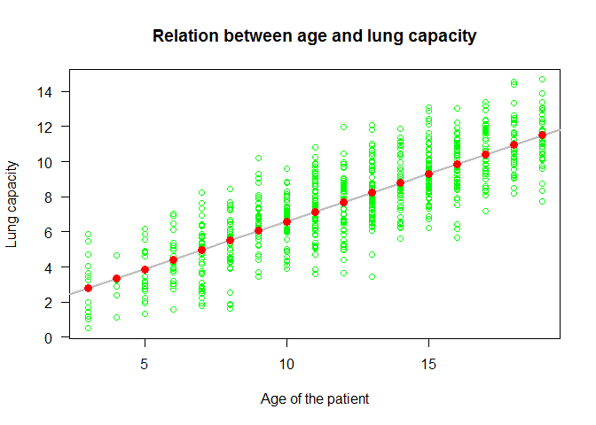 

```r
plot(Age, mod$residuals, pch = 20, col = "blue")
abline(h = 0, lwd = 3)
```

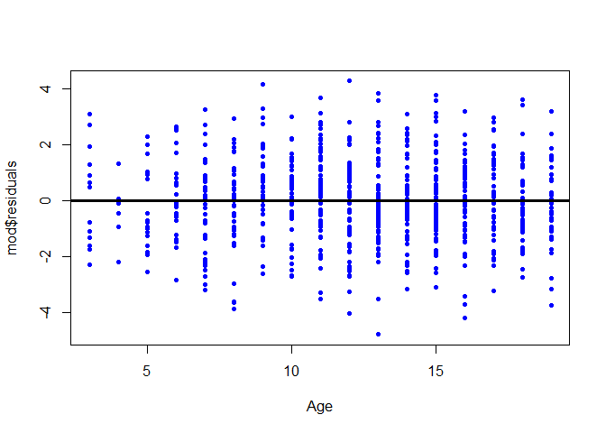 

let's plot the regression line - again

```r
plot(Age, LungCap, main = "Relation between age and lung capacity", col = "green", las = 1, xlab = "Age of the patient", ylab = "Lung capacity")
abline(mod, col = 2,lwd = 1)

#Let's plot the error associated to our predicted linear relationship
#we can either fit the Standard errors or the 95% confidence intervals (1.96 * SEs)

summary(lung$Age)
```

```
##    Min. 1st Qu.  Median    Mean 3rd Qu.    Max. 
##    3.00    9.00   13.00   12.33   15.00   19.00
```

```r
newdata = data.frame(Age = seq(3, 19, 1)) 
newdata
```

```
##    Age
## 1    3
## 2    4
## 3    5
## 4    6
## 5    7
## 6    8
## 7    9
## 8   10
## 9   11
## 10  12
## 11  13
## 12  14
## 13  15
## 14  16
## 15  17
## 16  18
## 17  19
```

```r
predictions = predict(mod, newdata = newdata, se = T)
ls(predictions)
```

```
## [1] "df"             "fit"            "residual.scale" "se.fit"
```

```r
lines(newdata$Age, predictions$fit, col = "black") 
lines(newdata$Age, predictions$fit + (1.96 * predictions$se.fit), col = "red", lty = 2) 
lines(newdata$Age, predictions$fit - (1.96 * predictions$se.fit), col = "red", lty = 2) 
```

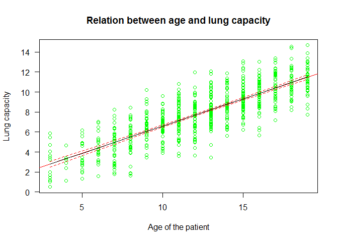 


For those who are not confident in predicting manually

```r
library(effects)
plot(allEffects(mod), ylim = c(0,15))
```

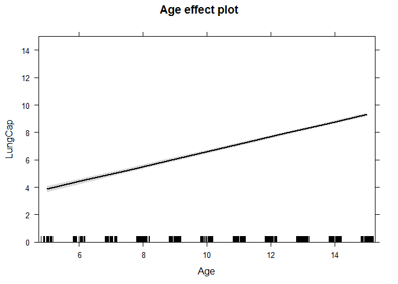 


```r
# more checking on linear model residuals (normality)

shapiro.test(mod$residuals)
```

```
## 
## 	Shapiro-Wilk normality test
## 
## data:  mod$residuals
## W = 0.99897, p-value = 0.9614
```

```r
hist(mod$residuals, freq = F,breaks = 20)   
lines(density(mod$residuals))
```

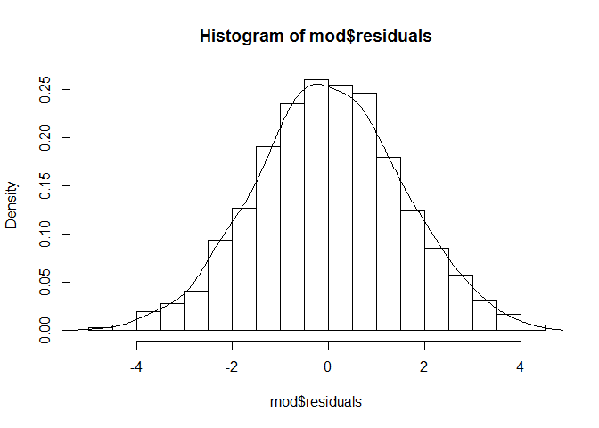 

```r
detach(lung)
```


## another example (to better understand how lm works)

Easier example to appreciate Residuals and Residual Standard error

```r
x1 = c(1, 2, 3, 4, 5)
y1 = c(1, 2, 3, 100, 200)
par(mfrow = c(1,2))
plot(x1, y1, xlim = c(0, 5), ylim = c(-100, 200))
abline(h = 0, lty = 3)

mod2 = lm(y1 ~ x1)
abline(mod2, col = 2,lwd = 2)
summary(mod2)
```

```
## 
## Call:
## lm(formula = y1 ~ x1)
## 
## Residuals:
##     1     2     3     4     5 
##  39.0  -9.6 -58.2 -10.8  39.6 
## 
## Coefficients:
##             Estimate Std. Error t value Pr(>|t|)  
## (Intercept)   -87.60      49.51  -1.769    0.175  
## x1             49.60      14.93   3.323    0.045 *
## ---
## Signif. codes:  0 '***' 0.001 '**' 0.01 '*' 0.05 '.' 0.1 ' ' 1
## 
## Residual standard error: 47.21 on 3 degrees of freedom
## Multiple R-squared:  0.7863,	Adjusted R-squared:  0.7151 
## F-statistic: 11.04 on 1 and 3 DF,  p-value: 0.04496
```

```r
points(x1, mod2$fitted.values, pch = 20, col = "blue", cex = 1.5)
plot(x1, mod2$residuals, pch = 20, col = "blue" ); abline(h = 0, lwd = 3)
```

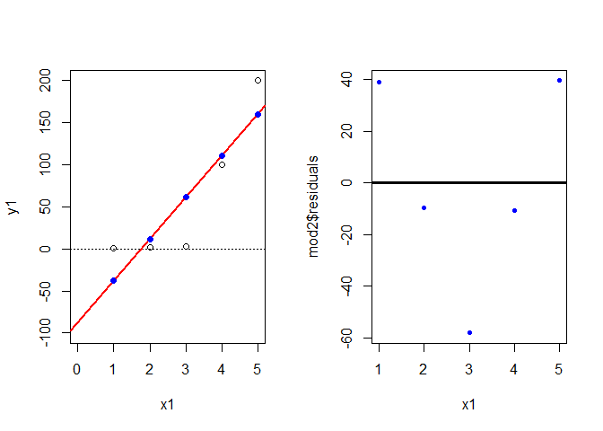 

```r
par(mfrow = c(1,1))
```


## Regressions with problems

We saw earlier that the regression modelling Lung Capacity as a function of Age met the assumptions of a linear regression. Are you able to spot a problem then?


```r
load("problems.RData")
```


```r
attach(problems)
plot(x, y)
mod1 = lm(y ~ x, problems)
abline(mod1, col = "red")
```

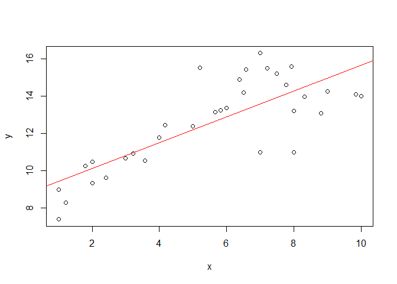 

```r
summary(mod1)
```

```
## 
## Call:
## lm(formula = y ~ x, data = problems)
## 
## Residuals:
##     Min      1Q  Median      3Q     Max 
## -3.2728 -0.7900  0.1845  0.8457  3.1980 
## 
## Coefficients:
##             Estimate Std. Error t value Pr(>|t|)    
## (Intercept)  8.74413    0.60239  14.516 2.27e-15 ***
## x            0.69108    0.09793   7.057 6.32e-08 ***
## ---
## Signif. codes:  0 '***' 0.001 '**' 0.01 '*' 0.05 '.' 0.1 ' ' 1
## 
## Residual standard error: 1.5 on 31 degrees of freedom
## Multiple R-squared:  0.6163,	Adjusted R-squared:  0.604 
## F-statistic:  49.8 on 1 and 31 DF,  p-value: 6.325e-08
```


```r
par(mfrow=c(2,2))
plot(mod1)
```

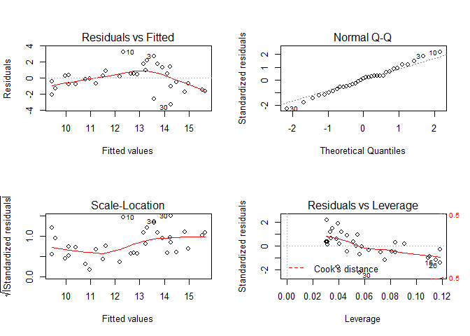 

```r
par(mfrow=c(1,1)) 
```
Assumption of linearity and homoscedasticity (top-left plot) are hardly met in this example.


```r
decay <- read.delim("Decay.txt")

#The data we examine in this section are on the decay of a biodegradable plastic in soil: the response, y, is the mass of plastic remaining and the independent variable, x, is duration of burial

summary(decay)
```

```
##       time          amount       
##  Min.   : 0.0   Min.   :  8.196  
##  1st Qu.: 7.5   1st Qu.: 21.522  
##  Median :15.0   Median : 35.015  
##  Mean   :15.0   Mean   : 42.146  
##  3rd Qu.:22.5   3rd Qu.: 57.460  
##  Max.   :30.0   Max.   :125.000
```

```r
attach(decay)
plot(time, amount)
mod3 = lm(amount ~ time)
abline(mod3, lwd = 2, col = 2)
```

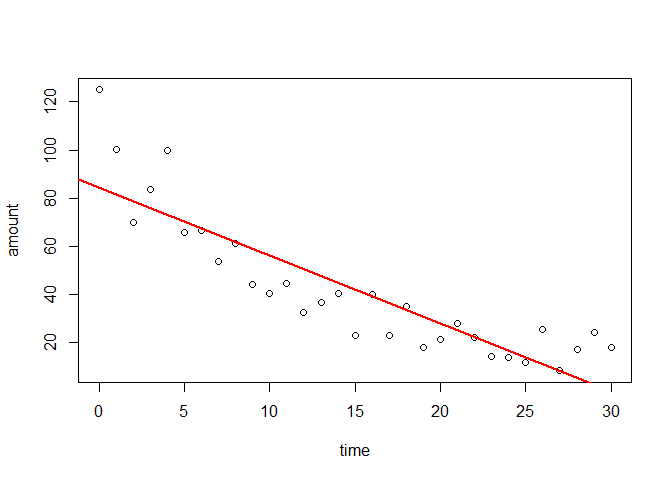 

```r
par(mfrow = c(2, 2))
plot(mod3)
```

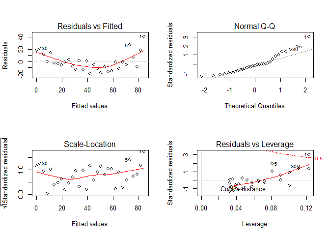 

```r
par(mfrow = c(1, 1))
#### points 1, 5, 30 certainly flag some problems

# plot1: 
#you get a plot of the residuals against the fitted values (left plot) which 
#shows very pronounced curvature; most of the residuals for intermediate fitted
#values are negative, and the positive residuals are concentrated at the smallest 
#and largest fitted values. Remember, this plot should look like the sky at 
#night, with no pattern of any sort. This suggests systematic inadequacy 
#in the structure of the model. 

#plot 2 -> few problems 
shapiro.test(mod3$residuals) # indeed
```

```
## 
## 	Shapiro-Wilk normality test
## 
## data:  mod3$residuals
## W = 0.92139, p-value = 0.0257
```

```r
#The third graph is like a positive-valued version of the first graph; 
#it is good for detecting non-constancy of variance (heteroscedasticity), 
#which shows up as a triangular scatter (like   a wedge of cheese). 
#The fourth graph shows a pronounced pattern in the standardized 
#residuals as a function of the leverage. The graph also shows 
#Cooks distance, highlighting
#the identity of particularly influential data points.

plot(time, amount)
abline(mod3,lwd = 2,col = 2)
points(time[1], amount[1], pch = 20, cex = 1.5)
points(time[5], amount[5], pch = 20, cex = 1.5)
points(time[30], amount[30], pch = 20,cex = 1.5)

points(time, mod3$fitted.values, pch = 20, col = "blue")
```

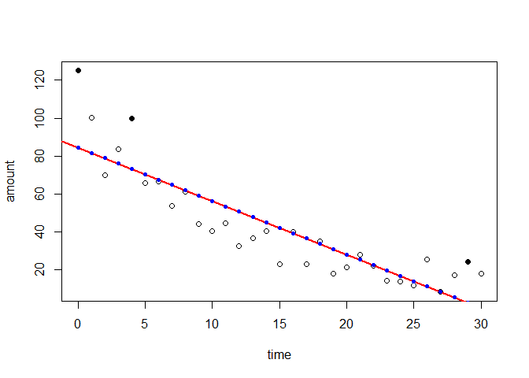 


```r
plot(time, amount) #there is a non-linear trend.. quadratic?

mod4 = lm(amount ~ time + I(time^2))
# abline is no longer working here. 

newdata = data.frame("amount" = seq(0, 30, 1))
predictions = predict(mod4, newdata = newdata, se = T)
lines(newdata$amount, predictions$fit, col = "red")
lines(newdata$amount, predictions$fit + (1.96 * predictions$se.fit), col = "grey")
lines(newdata$amount, predictions$fit - (1.96 * predictions$se.fit), col = "grey")
```

 

```r
par(mfrow = c(2, 2))
plot(mod4)
```

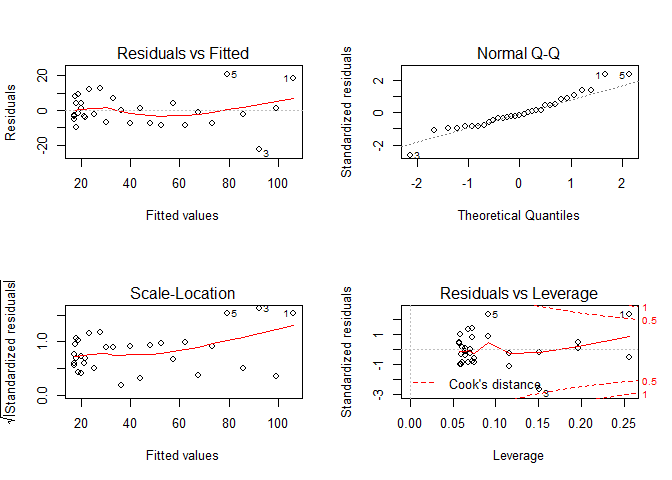 

```r
par(mfrow = c(1, 2))

#comparisons mod 3 vs mod4
plot(time, mod3$residuals)
abline(h = 0, lwd = 3)
plot(time, mod4$residuals)
abline(h = 0, lwd = 3)
```

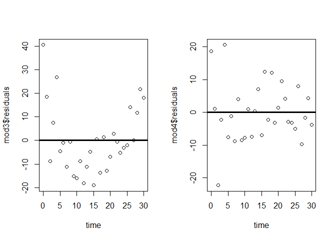 

```r
par(mfrow = c(1, 1))
```


```r
plot(time, amount)
mod5 = lm(amount ~ time + I(time ^ 2) + I(time ^ 3))
newdata = data.frame("amount" = seq(0, 30, 1))
predictions = predict(mod5, newdata = newdata, se = T, type = "response")
lines(newdata$amount, predictions$fit, col = "red")
lines(newdata$amount, predictions$fit + (1.96 * predictions$se.fit), col = "grey")
lines(newdata$amount, predictions$fit - (1.96 * predictions$se.fit), col = "grey")
```

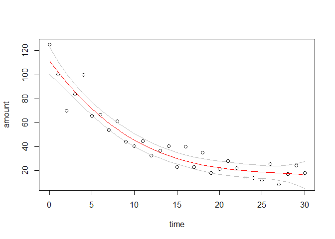 

```r
#comparisons mod 3 vs mod4 vs mod5
par(mfrow = c(1, 3))
plot(time, mod3$residuals)
abline(h = 0, lwd = 3)
plot(time, mod4$residuals)
abline(h = 0, lwd = 3)
plot(time, mod5$residuals)
abline(h = 0, lwd = 3)
```

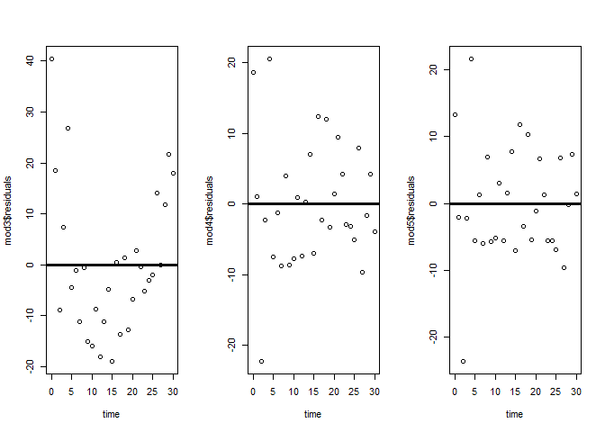 

```r
par(mfrow = c(1, 1))

detach(decay)
```

----> in-class exercise 

+++++++++++++++++
Edited by Simone Ciuti, University of Freiburg, 25/10/2015; 
Intended for the only purpose of teaching @ Freiburg University; 
Source: 1) Mike Marin Stat - UBC 2)Mick Crawley - The R Book, 2nd edition. 3) Simone Ciuti simulated data 
+++++++++++++++++++++++++++++++++++++++++++++++++
