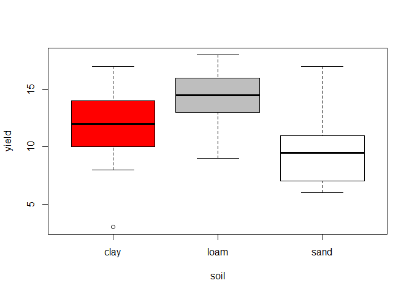
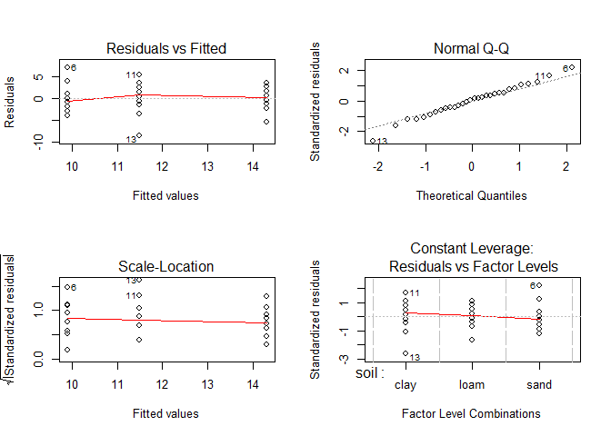
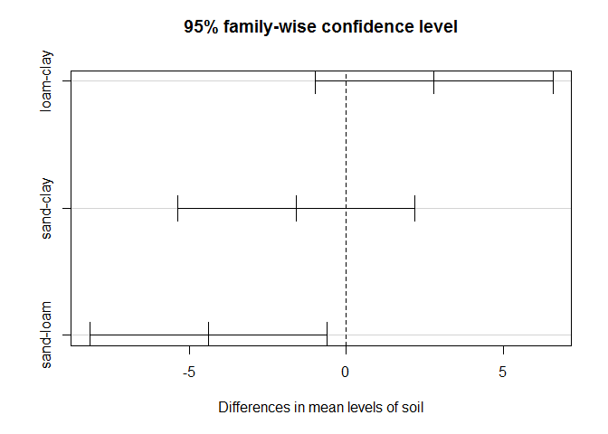
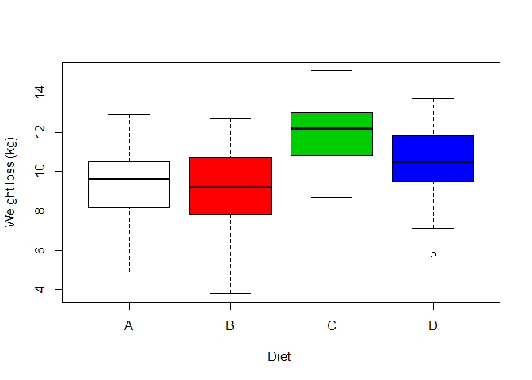
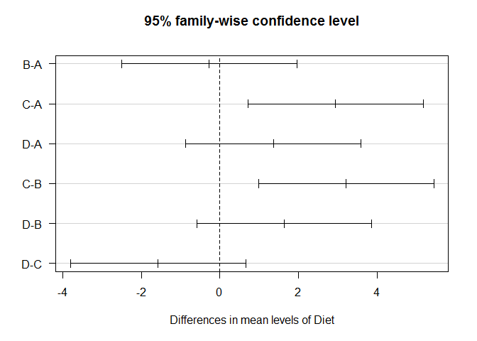
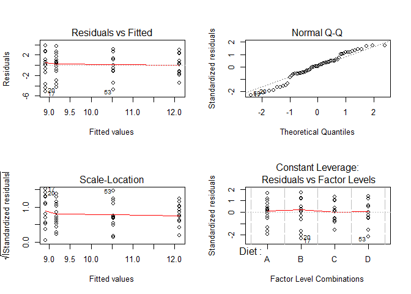
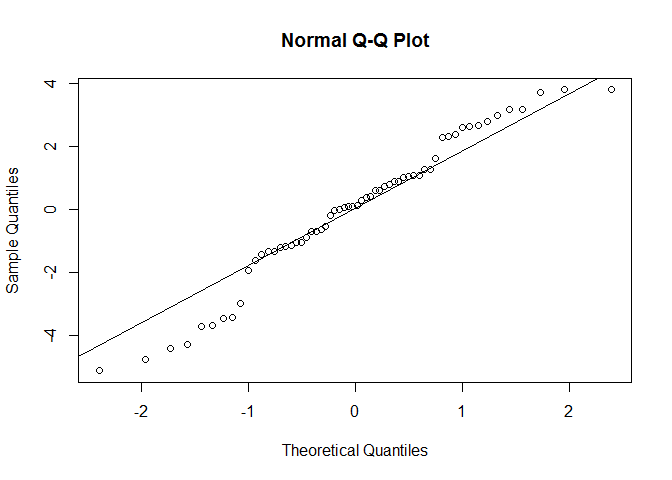

# Analysis of Variance ANOVA

## Simple ONE-WAY ANOVA 

This is a parametric method appropriate for comparing means for more than 2 INDEPENDENT samples
Do not confound it with ANCOVA, which is a model  which blends ANOVA and regression (we'll see it in a later tutorial)

Assumptions:
1) equal variances (homogeneity)
2) indipendent  errors (thus, random sampling) (independency)
3) normal distribution of errors (normality)


```r
#load yields.txt
db <- read.delim("~/TEACHING IN FREIBURG/11 - Statistics with R fall 2015/7_ANOVA/yields.txt")
head(db)  #this is a dataset on the effect of soil type on plan yeld
```

```
##   yield soil
## 1     6 sand
## 2    10 sand
## 3     8 sand
## 4     6 sand
## 5    14 sand
## 6    17 sand
```

```r
attach(db)
plot(yield ~ soil, col = c("red", "grey", "white"))
```

 

```r
#test for homoscedasticity (NULL = variances do not differe among independent samples)

# Fligner-Killeen test of homogeneity of variances
fligner.test(yield ~ soil) #non-parametric procedure.
```

```
## 
## 	Fligner-Killeen test of homogeneity of variances
## 
## data:  yield by soil
## Fligner-Killeen:med chi-squared = 0.36507, df = 2, p-value =
## 0.8332
```

```r
#Bartlett.test
bartlett.test(yield ~ soil) #parametric procedure (thus, works well if independent samples are clearly normally distributed)
```

```
## 
## 	Bartlett test of homogeneity of variances
## 
## data:  yield by soil
## Bartlett's K-squared = 1.2764, df = 2, p-value = 0.5283
```

```r
# assumption 1 is OK -> variances are homogeneous
```


```r
# let's fit the ANOVA
model = aov(yield ~ soil)
summary(model)
```

```
##             Df Sum Sq Mean Sq F value Pr(>F)  
## soil         2   99.2   49.60   4.245  0.025 *
## Residuals   27  315.5   11.69                 
## ---
## Signif. codes:  0 '***' 0.001 '**' 0.01 '*' 0.05 '.' 0.1 ' ' 1
```

```r
par(mfrow = c(2, 2))
plot(aov(yield ~ soil))
```

 

```r
par(mfrow=c(1,1))

#nice model - all assumptions met

#running the test for homogeneity on raw data or residual is the same thing in anova
bartlett.test(yield ~ soil)
```

```
## 
## 	Bartlett test of homogeneity of variances
## 
## data:  yield by soil
## Bartlett's K-squared = 1.2764, df = 2, p-value = 0.5283
```

```r
bartlett.test(model$residuals ~ soil) #homogeneity is ok
```

```
## 
## 	Bartlett test of homogeneity of variances
## 
## data:  model$residuals by soil
## Bartlett's K-squared = 1.2764, df = 2, p-value = 0.5283
```

```r
#normality: it is ok the q-q plot already. If you are uncertain about your visual interpretation:
shapiro.test(model$residuals)
```

```
## 
## 	Shapiro-Wilk normality test
## 
## data:  model$residuals
## W = 0.99131, p-value = 0.9961
```

multiple comparisons

```r
TukeyHSD(model) #all possible combinations
```

```
##   Tukey multiple comparisons of means
##     95% family-wise confidence level
## 
## Fit: aov(formula = yield ~ soil)
## 
## $soil
##           diff        lwr        upr     p adj
## loam-clay  2.8 -0.9903777  6.5903777 0.1785489
## sand-clay -1.6 -5.3903777  2.1903777 0.5546301
## sand-loam -4.4 -8.1903777 -0.6096223 0.0204414
```

```r
plot(TukeyHSD(model))
```

 

```r
detach(db)
```


## Another ANOVA example


```r
# load weight loss depending on 4 different diets

diet <- read.delim("~/TEACHING IN FREIBURG/11 - Statistics with R fall 2015/7_ANOVA/DietWeigthLoss.txt")
head(diet)
```

```
##   WeightLoss Diet
## 1        9.9    A
## 2        9.6    A
## 3        8.0    A
## 4        4.9    A
## 5       10.2    A
## 6        9.0    A
```

```r
summary(diet)
```

```
##    WeightLoss     Diet  
##  Min.   : 3.800   A:15  
##  1st Qu.: 8.975   B:15  
##  Median :10.200   C:15  
##  Mean   :10.185   D:15  
##  3rd Qu.:11.900         
##  Max.   :15.100
```

```r
attach(diet)
```


```r
boxplot(WeightLoss ~ Diet, ylab = "Weight loss (kg)", xlab = "Diet ",col = c(0, 2, 3, 4))
```

 

```r
model1 = aov(WeightLoss ~ Diet)

summary(model1) 
```

```
##             Df Sum Sq Mean Sq F value  Pr(>F)   
## Diet         3  97.33   32.44   6.118 0.00113 **
## Residuals   56 296.99    5.30                   
## ---
## Signif. codes:  0 '***' 0.001 '**' 0.01 '*' 0.05 '.' 0.1 ' ' 1
```

multiple comparisons

```r
TukeyHSD(model1) #all possible combinations
```

```
##   Tukey multiple comparisons of means
##     95% family-wise confidence level
## 
## Fit: aov(formula = WeightLoss ~ Diet)
## 
## $Diet
##           diff        lwr       upr     p adj
## B-A -0.2733333 -2.4999391 1.9532725 0.9880087
## C-A  2.9333333  0.7067275 5.1599391 0.0051336
## D-A  1.3600000 -0.8666058 3.5866058 0.3773706
## C-B  3.2066667  0.9800609 5.4332725 0.0019015
## D-B  1.6333333 -0.5932725 3.8599391 0.2224287
## D-C -1.5733333 -3.7999391 0.6532725 0.2521236
```

```r
plot(TukeyHSD(model1), las=1)
```

 


Again, checking ANOVA's assumptions

```r
par(mfrow=c(2,2))
plot(model1)
```

 

```r
par(mfrow=c(1,1))

bartlett.test(model1$residuals ~ Diet)  # all good, homogeneity-wise
```

```
## 
## 	Bartlett test of homogeneity of variances
## 
## data:  model1$residuals by Diet
## Bartlett's K-squared = 2.5792, df = 3, p-value = 0.4611
```

```r
qqnorm(model1$residuals);qqline(model1$residuals)
```

 

```r
shapiro.test(model1$residuals) # we are a bit weak here.. 
```

```
## 
## 	Shapiro-Wilk normality test
## 
## data:  model1$residuals
## W = 0.9646, p-value = 0.07918
```

```r
# normality is a bit weak here. However, ANOVA is considered a robust test against the normality assumption. This means that it tolerates violations to its normality assumption rather well. Remember, we are more worried about homogeneity of variances rather than about normality of residuals!
```


## Non-parametric version of the Analysis of Variance
KRUSKAS WALLIS 1-WAY Analysis of Variance is a non-parametric equivalent of ANOVA for independent samples.

We work on the same dataset just used above.


```r
model2 = kruskal.test(WeightLoss ~ Diet)
model2
```

```
## 
## 	Kruskal-Wallis rank sum test
## 
## data:  WeightLoss by Diet
## Kruskal-Wallis chi-squared = 15.902, df = 3, p-value = 0.001188
```

```r
library(pgirmess)
kruskalmc(WeightLoss ~ Diet) # compare it with the results we got from the parametric version (TukeyHSD)
```

```
## Multiple comparison test after Kruskal-Wallis 
## p.value: 0.05 
## Comparisons
##       obs.dif critical.dif difference
## A-B  1.166667     16.82428      FALSE
## A-C 21.166667     16.82428       TRUE
## A-D  9.733333     16.82428      FALSE
## B-C 22.333333     16.82428       TRUE
## B-D 10.900000     16.82428      FALSE
## C-D 11.433333     16.82428      FALSE
```

```r
detach(diet)
```
However, the Kruskal-Wallis test should not be regarded as a panacea. 
It is primarily intended to cure problems with normality, not problems with homogeneity! 

## Important notes.

NOTE 1)
during week 1, we dealt with 
-> test for 2 independent samples  (parametric, non-parametric), i.e. categorical predictor with 2 independent levels.
In this tutorial we just dealt with 
-> test for > 2 independent samples (parametric, non-parametric), i.e. categorical predictor with > 2 independent levels.

NOTE 2)
During week 1, we also dealt with
-> test for 2 dependent samples  (parametric, non-parametric), i.e. categorical predictor with 2 dependent levels. 
Here, we skip the test for > 2 dependent samples (ANOVA for repeated measures, parametric; Friedman test, non-parametric). Nowdays, we usually deal with repeated measures by using mixed effect models (we do not do it in this class, but keep it in mind!). Also, ANOVA suffers unbalanced designs, that we usually deal with mixed effect models as well. 

NOTE 3) Here we deal with a simple 1-way ANOVA, that means a response variable depending on 1 categorical factor with >2 independent levels. However, the ANOVA can be two-way, taking the following structure: aov(Y ~ x1 + x2), where x1 and x2 are 2 categorical predictors. Example: Body weight ~ Sex + Diet. In this 2 way-anova, we test for the effect of Sex and Diet on bodyweigit. Day after day, with increasingly complex sampling designs, unbalanced sampling, and inclusion of confounding factors, we end up with complex dataset that cannot be dealt with ANOVA properly. That's why we do not spend much more time on this topic in this class - If you need to deal with all these problems, mixed models are likely the right answer to most of them.


+++++++++++++++++
Edited by Simone Ciuti, University of Freiburg, 26/10/2015; 
Intended for the only purpose of teaching @ Freiburg University; 
Sources: Mick Crawley, R book, 2nd edition; Simone Ciuti, simulated data.; Mike Marin Stat, University of British Columbia; quick-R. 
+++++++++++++++++++++++++++++++++++++++++++++++++
