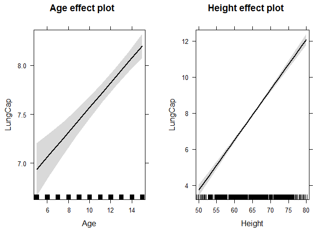
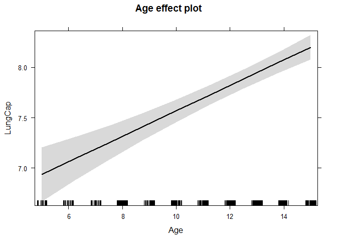
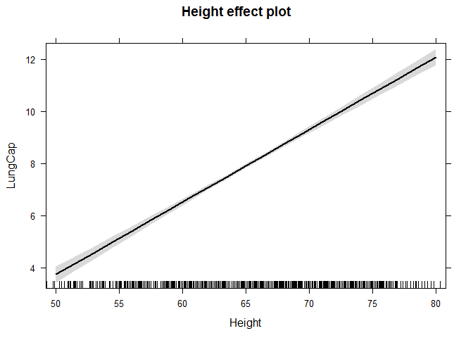
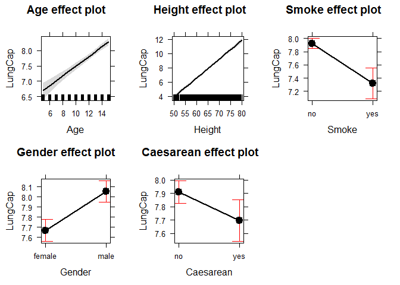
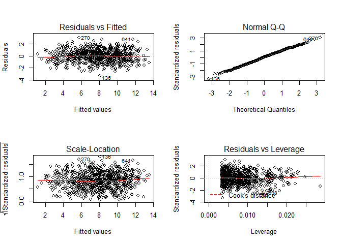
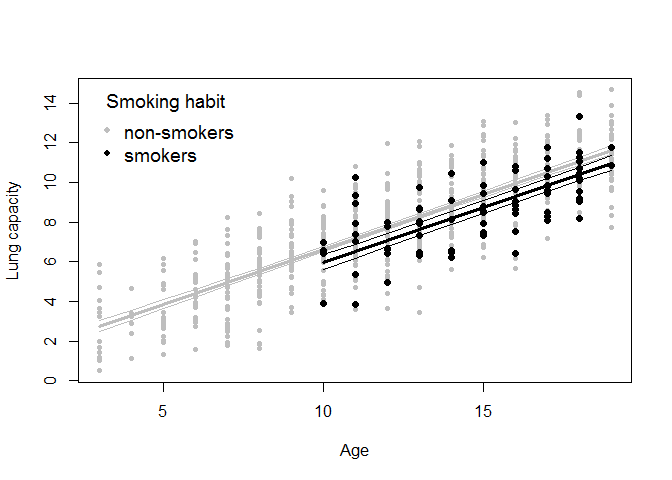
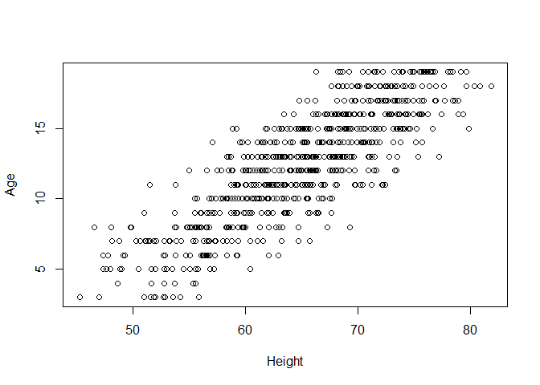
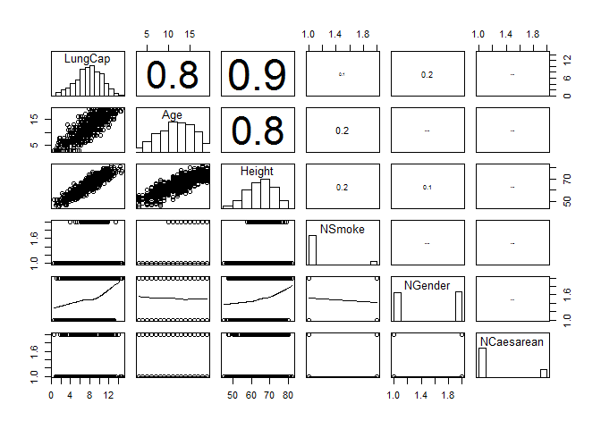
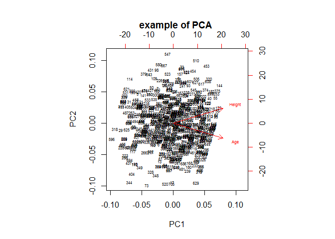

# Multiple linear regression and ANCOVA

The multiple regression is an extension of the simple regression, where we simply add more numeric predictors.


```r
setwd("~/TEACHING IN FREIBURG/11 - Statistics with R fall 2015/8_ANCOVA")
load("lung.RData")

head(lung)
```

```
##   LungCap Age Height Smoke Gender Caesarean
## 1   6.475   6   62.1    no   male        no
## 2  10.125  18   74.7   yes female        no
## 3   9.550  16   69.7    no female       yes
## 4  11.125  14   71.0    no   male        no
## 5   4.800   5   56.9    no   male        no
## 6   6.225  11   58.7    no female        no
```

```r
attach(lung)
```


```r
model1 = lm(LungCap ~ Age + Height)
summary(model1)
```

```
## 
## Call:
## lm(formula = LungCap ~ Age + Height)
## 
## Residuals:
##     Min      1Q  Median      3Q     Max 
## -3.4080 -0.7097 -0.0078  0.7167  3.1679 
## 
## Coefficients:
##               Estimate Std. Error t value Pr(>|t|)    
## (Intercept) -11.747065   0.476899 -24.632  < 2e-16 ***
## Age           0.126368   0.017851   7.079 3.45e-12 ***
## Height        0.278432   0.009926  28.051  < 2e-16 ***
## ---
## Signif. codes:  0 '***' 0.001 '**' 0.01 '*' 0.05 '.' 0.1 ' ' 1
## 
## Residual standard error: 1.056 on 722 degrees of freedom
## Multiple R-squared:  0.843,	Adjusted R-squared:  0.8425 
## F-statistic:  1938 on 2 and 722 DF,  p-value: < 2.2e-16
```

let's quickly check the predictions of the model using the library Effects

```r
library(effects)
plot(allEffects(model1))
```

 

```r
plot(effect("Age",model1))
```

 

```r
plot(effect("Height",model1))
```

 

let's now try the ANCOVA (we blend regression with ANOVA - in simple words, we have at least 1 numeric predictor and 1 categorical predictor)

```r
model2 = lm(LungCap ~ Age + Height + Smoke + Gender + Caesarean)
summary(model2)
```

```
## 
## Call:
## lm(formula = LungCap ~ Age + Height + Smoke + Gender + Caesarean)
## 
## Residuals:
##     Min      1Q  Median      3Q     Max 
## -3.3388 -0.7200  0.0444  0.7093  3.0172 
## 
## Coefficients:
##               Estimate Std. Error t value Pr(>|t|)    
## (Intercept)  -11.32249    0.47097 -24.041  < 2e-16 ***
## Age            0.16053    0.01801   8.915  < 2e-16 ***
## Height         0.26411    0.01006  26.248  < 2e-16 ***
## Smokeyes      -0.60956    0.12598  -4.839 1.60e-06 ***
## Gendermale     0.38701    0.07966   4.858 1.45e-06 ***
## Caesareanyes  -0.21422    0.09074  -2.361   0.0185 *  
## ---
## Signif. codes:  0 '***' 0.001 '**' 0.01 '*' 0.05 '.' 0.1 ' ' 1
## 
## Residual standard error: 1.02 on 719 degrees of freedom
## Multiple R-squared:  0.8542,	Adjusted R-squared:  0.8532 
## F-statistic: 842.8 on 5 and 719 DF,  p-value: < 2.2e-16
```

```r
plot(allEffects(model2))
```

 


```r
### check the assumptions
par(mfrow = c(2, 2))
plot(model2) #all good here
```

 

```r
par(mfrow = c(1, 1)) 
detach(lung)
```

## Plotting predictions in ANCOVA


```r
# we manually plot the predictions of the following model:
model3 = lm(LungCap ~ Age + Smoke, data = lung)

# scenario 1: effect of Age on Lung Capacity for non-smokers
newdata = data.frame(Age = seq(min(lung$Age), max(lung$Age), 1), Smoke = "no")
head(newdata)
```

```
##   Age Smoke
## 1   3    no
## 2   4    no
## 3   5    no
## 4   6    no
## 5   7    no
## 6   8    no
```

```r
mypredictions = predict(model3, newdata = newdata, se = T)
plot(lung$Age[lung$Smoke == "no"], lung$LungCap[lung$Smoke == "no"], xlab = "Age", ylab = "Lung capacity", col = "grey", pch = 20)
lines(newdata$Age, mypredictions$fit, col = "grey", lwd = 3)
lines(newdata$Age, mypredictions$fit + (1.96 * mypredictions$se.fit), col = "gray")
lines(newdata$Age, mypredictions$fit - (1.96 * mypredictions$se.fit), col = "gray")


#scenario 2: effect of Age on Lung Capacity for smokers this time
with(lung, table(Age, Smoke)) # smokers occur when age >= 10. No reason to predict where we have no data (and babies are not smokers anyways)
```

```
##     Smoke
## Age  no yes
##   3  13   0
##   4   6   0
##   5  20   0
##   6  25   0
##   7  37   0
##   8  41   0
##   9  40   0
##   10 47   4
##   11 50   8
##   12 61   7
##   13 61   8
##   14 50   6
##   15 55   9
##   16 45   9
##   17 32  11
##   18 30  13
##   19 35   2
```

```r
newdata = data.frame(Age = seq(10, max(lung$Age), 1), Smoke = "yes")
head(newdata)
```

```
##   Age Smoke
## 1  10   yes
## 2  11   yes
## 3  12   yes
## 4  13   yes
## 5  14   yes
## 6  15   yes
```

```r
mypredictions = predict(model3, newdata = newdata, se = T)
points(lung$Age[lung$Smoke == "yes"], lung$LungCap[lung$Smoke == "yes"], col = "black", pch = 20, cex = 1.5)
lines(newdata$Age, mypredictions$fit, col = "black", lwd = 3)
lines(newdata$Age, mypredictions$fit + (1.96 * mypredictions$se.fit), col = "black")
lines(newdata$Age, mypredictions$fit - (1.96 * mypredictions$se.fit), col = "black")

legend("topleft", c("non-smokers", "smokers"), col = c("grey","black"), title="Smoking habit",
       bty="n", pch=c(20, 20),inset=.02, cex = 1.2)
```

 

```r
# clearly. you can manually predict more complex ANCOVA models. If you had more predictors in your model, you would have to include them in the newdata as well, keeping them constant to mean (if numeric) or to a certain category (if categorical).
```


## Collinearity 
The collinearity is defined as a strong (over the limit) correlation between predictors, and it may lead to parameter instability. 
Are we allowed to fit Age + Height + Smoke + Gender + Caesarean as predictors in the same model?
For instance, we may expect that Heigth and Age are strongly correlated


```r
attach(lung)
plot(Height,Age)
```

 

```r
cor(Height,Age) # certainly, Height and Age ar collinear and shouldn't be included as predictors in the same model.
```

```
## [1] 0.8357368
```

```r
# we cannot correctly say that the slope for age is the actual effect of age on 
# lung capacity adjusting for height age and height are bounded together! 

# our model structure was
#model2 = lm(LungCap ~ Age + Height + Smoke + Gender + Caesarean)
# we cannot include Height and Age in the same model due to collinearity issues!! (|r|>0.7)

model1 = lm(LungCap ~ Height); summary(model1) #adj r2 = 0.83
```

```
## 
## Call:
## lm(formula = LungCap ~ Height)
## 
## Residuals:
##     Min      1Q  Median      3Q     Max 
## -3.3619 -0.7014 -0.0032  0.7787  3.2938 
## 
## Coefficients:
##               Estimate Std. Error t value Pr(>|t|)    
## (Intercept) -13.996829   0.367451  -38.09   <2e-16 ***
## Height        0.337157   0.005633   59.86   <2e-16 ***
## ---
## Signif. codes:  0 '***' 0.001 '**' 0.01 '*' 0.05 '.' 0.1 ' ' 1
## 
## Residual standard error: 1.092 on 723 degrees of freedom
## Multiple R-squared:  0.8321,	Adjusted R-squared:  0.8319 
## F-statistic:  3583 on 1 and 723 DF,  p-value: < 2.2e-16
```

```r
cor(Height, LungCap)
```

```
## [1] 0.9121873
```

```r
model2=lm(LungCap ~ Age); summary(model2) #adj r2 = 0.67
```

```
## 
## Call:
## lm(formula = LungCap ~ Age)
## 
## Residuals:
##     Min      1Q  Median      3Q     Max 
## -4.7799 -1.0203 -0.0005  0.9789  4.2650 
## 
## Coefficients:
##             Estimate Std. Error t value Pr(>|t|)    
## (Intercept)  1.14686    0.18353   6.249 7.06e-10 ***
## Age          0.54485    0.01416  38.476  < 2e-16 ***
## ---
## Signif. codes:  0 '***' 0.001 '**' 0.01 '*' 0.05 '.' 0.1 ' ' 1
## 
## Residual standard error: 1.526 on 723 degrees of freedom
## Multiple R-squared:  0.6719,	Adjusted R-squared:  0.6714 
## F-statistic:  1480 on 1 and 723 DF,  p-value: < 2.2e-16
```

```r
cor(Age,LungCap)
```

```
## [1] 0.8196749
```


## Checking for and avoiding collinearity issues!

 
 

```r
names(lung)
```

```
## [1] "LungCap"   "Age"       "Height"    "Smoke"     "Gender"    "Caesarean"
```

```r
detach(lung) #fist of all, we convert factor into numeric to check whether they are collinear with other variables too
lung$NSmoke = as.numeric(lung$Smoke)
lung$NGender = as.numeric(lung$Gender)
lung$NCaesarean = as.numeric(lung$Caesarean)
summary(lung)
```

```
##     LungCap            Age            Height      Smoke        Gender   
##  Min.   : 0.507   Min.   : 3.00   Min.   :45.30   no :648   female:358  
##  1st Qu.: 6.150   1st Qu.: 9.00   1st Qu.:59.90   yes: 77   male  :367  
##  Median : 8.000   Median :13.00   Median :65.40                         
##  Mean   : 7.863   Mean   :12.33   Mean   :64.84                         
##  3rd Qu.: 9.800   3rd Qu.:15.00   3rd Qu.:70.30                         
##  Max.   :14.675   Max.   :19.00   Max.   :81.80                         
##  Caesarean     NSmoke         NGender        NCaesarean   
##  no :561   Min.   :1.000   Min.   :1.000   Min.   :1.000  
##  yes:164   1st Qu.:1.000   1st Qu.:1.000   1st Qu.:1.000  
##            Median :1.000   Median :2.000   Median :1.000  
##            Mean   :1.106   Mean   :1.506   Mean   :1.226  
##            3rd Qu.:1.000   3rd Qu.:2.000   3rd Qu.:1.000  
##            Max.   :2.000   Max.   :2.000   Max.   :2.000
```


2 different tools to check for collineariy
1) PAIRWISE SCATTERPLOTS with correlation coefficients
2) VIF VARIANCE INFLATION FACTORS (MULTICOLLINEARITY)

 
 

```r
source("collinearity check.r")  #loading useful functions

#bind together the column of interest
attach(lung)
Z = cbind(LungCap, Age, Height, NSmoke, NGender, NCaesarean)

pairs(Z, lower.panel = panel.smooth2,
      upper.panel = panel.cor, diag.panel = panel.hist)
```

 

```r
# rule of thumb |r|>0.7 heavily collinear (however, 0.5 can be used as well -> see Dormann's book)
```

VIF  rule of thumb: VIF>3 highly collinear

```r
corvif(Z[,-1])  # we have to exclude the response variable from the VIF test
```

```
## 
## 
## Variance inflation factors
## 
##                GVIF
## Age        3.620270
## Height     3.655950
## NSmoke     1.050188
## NGender    1.105652
## NCaesarean 1.004598
```

```r
# again, problem here with Height and Age
# we decide to keep the Heigth and discard Age (based on the higher correlation with the response variable)
corvif(Z[,c(-1,-2)])
```

```
## 
## 
## Variance inflation factors
## 
##                GVIF
## Height     1.060038
## NSmoke     1.039761
## NGender    1.027128
## NCaesarean 1.004505
```

```r
# ok, we are good. we can build our multiple regression with the other predictors
# response = "LungCap"
# indipendent variables = "Height"     "Smoke"      "Gender"     "Caesarean" 

# depending on your research question, you may want to include Age instead of height. The alternative is to create a new variable using PCA. See below.
```

## PCA (principal component analysis -> a good option to deal with collinear predictors)


```r
detach(lung)
newdata = lung[,c("Height", "Age")]
myPCA = prcomp(newdata, scale = TRUE)
summary(myPCA)     # the first axis PC1 explains 91% of variability of Height and Age
```

```
## Importance of components:
##                           PC1     PC2
## Standard deviation     1.3549 0.40529
## Proportion of Variance 0.9179 0.08213
## Cumulative Proportion  0.9179 1.00000
```

```r
biplot(myPCA, main = "example of PCA ", cex = 0.5)
```

 

```r
#   Age and Height have a positive loading on PC1 (first axis of the principla component)
#   Height has a positive loading on PCA2, Age has a negative loading on it. 

# finally, you attach PC1 and PC2 to your data

lung$PC1 = predict(myPCA)[,1]      
lung$PC2 = predict(myPCA)[,2]  
head(lung)
```

```
##   LungCap Age Height Smoke Gender Caesarean NSmoke NGender NCaesarean
## 1   6.475   6   62.1    no   male        no      1       2          1
## 2  10.125  18   74.7   yes female        no      2       1          1
## 3   9.550  16   69.7    no female       yes      1       1          2
## 4  11.125  14   71.0    no   male        no      1       2          1
## 5   4.800   5   56.9    no   male        no      1       2          1
## 6   6.225  11   58.7    no female        no      1       1          1
##          PC1         PC2
## 1 -1.3857691  0.84847375
## 2  1.9701039 -0.03326228
## 3  1.1260696 -0.17102839
## 4  0.9005696  0.30973975
## 5 -2.0728723  0.51450459
## 6 -0.8367460 -0.36817360
```

```r
#eventually, you can use principal component axis loadings instead of Age or Height.
# this is very useful WHEN YOU HAVE MANY COLLINEAR PREDICTORS (WEATHER DATA, ENVIRONMENTAL PREDICTORS ECC) AND YOU DO NOT WANT TO PICK ONE. 
```


+++++++++++++++++
Edited by Simone Ciuti, University of Freiburg, 27/10/2015; 
Intended for the only purpose of teaching @ Freiburg University; 
Sources: Mick Crawley, R book, 2nd edition; Simone Ciuti, simulated data.; Mike Marin Stat, University of British Columbia; quick-R; Zuur et al Mixed Effects Models in R; Zuur et al Analysing Ecological Data 
+++++++++++++++++++++++++++++++++++++++++++++++++

