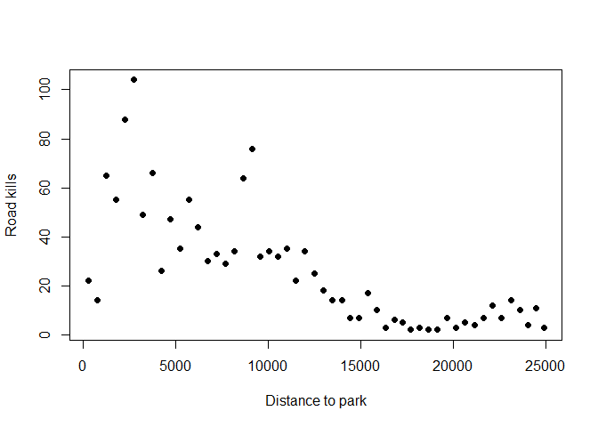
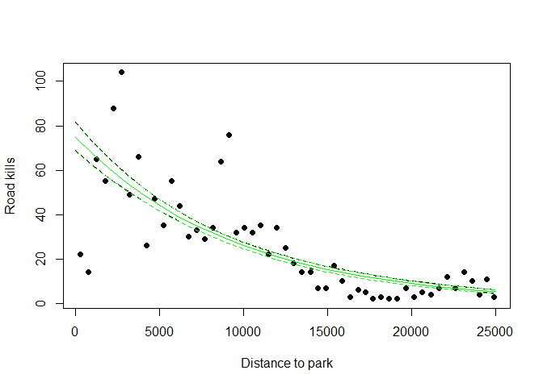
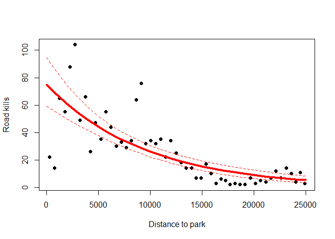
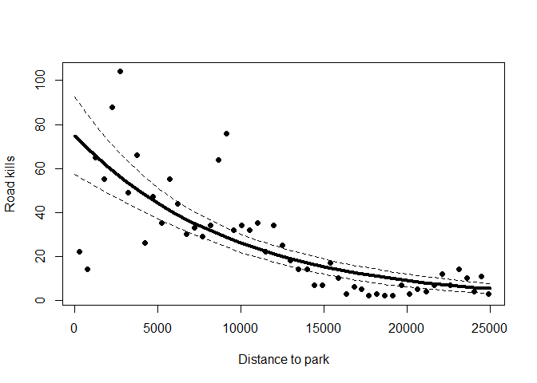
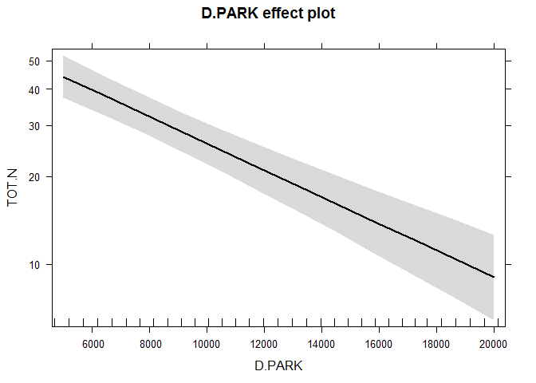
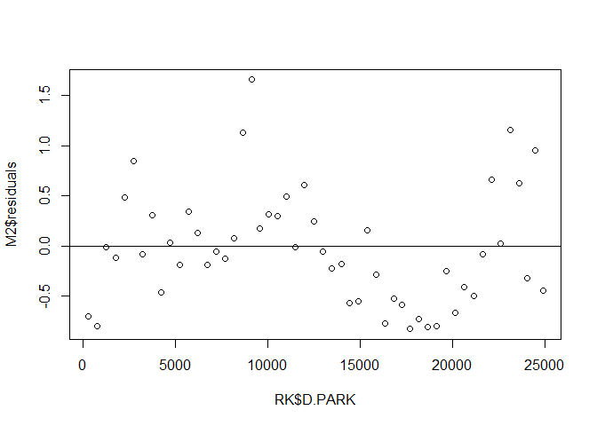

# GLM Poisson

Count data. Poisson distribution.

##Count data - GLM Poisson
Road kills data of amphibians species along a road in Portugal


```r
setwd("~/TEACHING IN FREIBURG/11 - Statistics with R fall 2015/9_GLMs - Poisson and Quasi-Poisson")
load("RK.RData")
head(RK)
```

```
##   Sector      X      Y BufoCalamita TOT.N S.RICH OPEN.L  OLIVE MONT.S
## 1      1 260181 256546            5    22      3 22.684 60.333  0.000
## 2      2 259914 256124            1    14      4 24.657 40.832  0.000
## 3      3 259672 255688           40    65      6 30.121 23.710  0.258
## 4      4 259454 255238           27    55      5 50.277 14.940  1.783
## 5      5 259307 254763           67    88      4 43.609 35.353  2.431
## 6      6 259189 254277           56   104      7 31.385 17.666  0.000
##     MONT POLIC SHRUB  URBAN WAT.RES L.WAT.C L.D.ROAD L.P.ROAD D.WAT.RES
## 1  0.653 4.811 0.406  7.787   0.043   0.583 3330.189    1.975   252.113
## 2  0.161 2.224 0.735 27.150   0.182   1.419 2587.498    1.761   139.573
## 3 10.918 1.946 0.474 28.086   0.453   2.005 2149.651    1.250    59.168
## 4 26.454 0.625 0.607  0.831   0.026   1.924 4222.983    0.666   277.842
## 5 11.330 0.791 0.173  2.452   0.000   2.167 2219.302    0.653   967.808
## 6 43.678 0.054 0.325  2.730   0.039   2.391 1005.629    1.309   560.000
##   D.WAT.COUR   D.PARK N.PATCH  P.EDGE L.SDI
## 1    735.000  250.214     122 553.936 1.801
## 2    134.052  741.179      96 457.142 1.886
## 3    269.029 1240.080      67 432.360 1.930
## 4     48.751 1739.885      63 421.292 1.865
## 5    126.102 2232.130      59 407.573 1.818
## 6    344.444 2724.089      49 420.289 1.799
```


Let's plot the relationship between the distance to the closest Park and road kills (TOT.N) 

```r
plot(RK$D.PARK, RK$TOT.N, xlab="Distance to park", ylab="Road kills", pch = 20, cex = 1.5)
```

 

let's fit the Poisson GLM

```r
M1 = glm(TOT.N ~ D.PARK, family = poisson, data = RK)
summary(M1)
```

```
## 
## Call:
## glm(formula = TOT.N ~ D.PARK, family = poisson, data = RK)
## 
## Deviance Residuals: 
##     Min       1Q   Median       3Q      Max  
## -8.1100  -1.6950  -0.4708   1.4206   7.3337  
## 
## Coefficients:
##               Estimate Std. Error z value Pr(>|z|)    
## (Intercept)  4.316e+00  4.322e-02   99.87   <2e-16 ***
## D.PARK      -1.059e-04  4.387e-06  -24.13   <2e-16 ***
## ---
## Signif. codes:  0 '***' 0.001 '**' 0.01 '*' 0.05 '.' 0.1 ' ' 1
## 
## (Dispersion parameter for poisson family taken to be 1)
## 
##     Null deviance: 1071.4  on 51  degrees of freedom
## Residual deviance:  390.9  on 50  degrees of freedom
## AIC: 634.29
## 
## Number of Fisher Scoring iterations: 4
```
Remember, there is a log link between the mean of Y and the predictor: this function  ensures that fitted values are always non negative

pseudo R-squared for Poisson GLMs

```r
100 * (M1$null.deviance - M1$deviance) / M1$null.deviance
```

```
## [1] 63.51681
```
Remember:
1) null and residual deviance are sort of equivalent of sum of squares and residual sum of squares in classical lm.
2) null deviance is the residual deviance in the only-intercept model, e.g the worst possible model.


Let's sketch the fitted values


```r
## this is to understand what's happening behind the scene of the GLM

MyData = data.frame(D.PARK = seq(from = 0, to = 25000, by = 1000))
G = predict(M1, newdata = MyData, type = "link", se = T)
F = exp(G$fit)
FSEUP = exp(G$fit + 1.96 * G$se.fit)
FSELOW = exp(G$fit - 1.96 * G$se.fit)
plot(RK$D.PARK, RK$TOT.N, xlab = "Distance to park",
     ylab = "Road kills", pch = 20, cex = 1.5)
lines(MyData$D.PARK, F, lty = 1)
lines(MyData$D.PARK, FSEUP, lty = 2)
lines(MyData$D.PARK, FSELOW, lty = 2)


## this is what you can (and should) easily do with all GLMs - just go for the option 'type = "response"

MyData = data.frame(D.PARK = seq(from = 0, to = 25000, by = 1000))
G = predict(M1, newdata = MyData, type = "response", se = T)
F = G$fit
FSEUP = G$fit + 1.96 * G$se.fit
FSELOW = G$fit - 1.96 * G$se.fit
lines(MyData$D.PARK, F, lty = 1, col = "green")
lines(MyData$D.PARK, FSEUP, lty = 2, col = "green")
lines(MyData$D.PARK, FSELOW, lty = 2, col = "green")
```

 

Let's go back to the summary

```r
summary(M1)
```

```
## 
## Call:
## glm(formula = TOT.N ~ D.PARK, family = poisson, data = RK)
## 
## Deviance Residuals: 
##     Min       1Q   Median       3Q      Max  
## -8.1100  -1.6950  -0.4708   1.4206   7.3337  
## 
## Coefficients:
##               Estimate Std. Error z value Pr(>|z|)    
## (Intercept)  4.316e+00  4.322e-02   99.87   <2e-16 ***
## D.PARK      -1.059e-04  4.387e-06  -24.13   <2e-16 ***
## ---
## Signif. codes:  0 '***' 0.001 '**' 0.01 '*' 0.05 '.' 0.1 ' ' 1
## 
## (Dispersion parameter for poisson family taken to be 1)
## 
##     Null deviance: 1071.4  on 51  degrees of freedom
## Residual deviance:  390.9  on 50  degrees of freedom
## AIC: 634.29
## 
## Number of Fisher Scoring iterations: 4
```
Remember the potential problem with Poisson GLMs, i.e. overdispersion
Overdispersion means the VARIANCE IS LARGER THAN THE MEAN, COMPARED TO WHAT YOU EXPECT FROM A POISSON distribution.
The poisson distribution is defined by a single parameter. The variance is kind of assigned by default based on your data. However, if the spread is much bigger than expected by the Poisson distribution, then we do not take care of it properly. 

3 options to check for overdispersion
Option 1

```r
#Res Dev / df
M1$deviance / M1$df.residual
```

```
## [1] 7.817937
```
Model clearly over-dispersed (7.8!) -> Should be 1

Option 2:
we can test for overdispersion

```r
#1-pchisq(residual deviance,df)
1 - pchisq(M1$deviance, M1$df.residual)
```

```
## [1] 0
```

```r
# p values < 0.001, so we reject the null hypothesis that data are not overdispersed.. thus, they are.
```

Option 3:
In the R package AER we can find  the function dispersiontest, which implements a Test for Overdispersion by Cameron & Trivedi (1990)

```r
library(AER)
```

```
## Loading required package: car
## Loading required package: lmtest
## Loading required package: zoo
## 
## Attaching package: 'zoo'
## 
## The following objects are masked from 'package:base':
## 
##     as.Date, as.Date.numeric
## 
## Loading required package: sandwich
## Loading required package: survival
```

```r
dispersiontest(M1, trafo = 1)  #look at alfa, it should be 0!
```

```
## 
## 	Overdispersion test
## 
## data:  M1
## z = 3.2194, p-value = 0.0006423
## alternative hypothesis: true alpha is greater than 0
## sample estimates:
##   alpha 
## 6.36623
```


This model is clearly overdispersed!!


What we can do?
1) try to run a quasi-Poisson model [we deal with it today]. Remember, quasi-Poisson is not a new distribution of error (it is not a new family)

2) move to the next level (Negative-Binomial) [WE DO NOT DO IT, BUT YOU HAVE TO KEEP IN MIND that THIS IS THE NEXT OPTION ON THE LIST]


Let's give a try to the quasi-Poisson
now, sometimes spread in count data is even larger than can be modelled with a POISSON distribution
it is possible to introduce a dispersion parameter p [p > 1  allows for more spread than the standard Poisson mean-variance relationship (overdispersion); conversely, p < 1 underdispersion] 
Estimation of a Poisson regression model with a dispersion parameter p
is called quasi-likelihood (or quasi-Poisson) [technically is no longer a poisson model]
As we introduce a dispersion parameter p all SEs are multiplied with the square root of p


```r
M2 = glm(TOT.N ~ D.PARK, family = quasipoisson, data = RK)
```
Remember, this is not a quasipoisson distribution (it does not exist!)
This is a Poisson corrected for overdispersion! this is a quasi-GLM model!


```r
summary(M2)
```

```
## 
## Call:
## glm(formula = TOT.N ~ D.PARK, family = quasipoisson, data = RK)
## 
## Deviance Residuals: 
##     Min       1Q   Median       3Q      Max  
## -8.1100  -1.6950  -0.4708   1.4206   7.3337  
## 
## Coefficients:
##               Estimate Std. Error t value Pr(>|t|)    
## (Intercept)  4.316e+00  1.194e-01  36.156  < 2e-16 ***
## D.PARK      -1.058e-04  1.212e-05  -8.735 1.24e-11 ***
## ---
## Signif. codes:  0 '***' 0.001 '**' 0.01 '*' 0.05 '.' 0.1 ' ' 1
## 
## (Dispersion parameter for quasipoisson family taken to be 7.630148)
## 
##     Null deviance: 1071.4  on 51  degrees of freedom
## Residual deviance:  390.9  on 50  degrees of freedom
## AIC: NA
## 
## Number of Fisher Scoring iterations: 4
```


Again, we plot the predictions but this time corrected for overdispersion


```r
## again, this is plotting predictions to understand the math behind it

MyData = data.frame(D.PARK = seq(from = 0, to = 25000, by = 1000))
G = predict(M2, newdata = MyData, type = "link", se = T)
F = exp(G$fit)
FSEUP = exp(G$fit + 1.96 * G$se.fit)
FSELOW = exp(G$fit - 1.96 * G$se.fit)
plot(RK$D.PARK, RK$TOT.N, xlab = "Distance to park",
     ylab = "Road kills", pch = 20, cex = 1.5)
lines(MyData$D.PARK, F,lty = 1,col=2, lwd = 4)
lines(MyData$D.PARK, FSEUP,lty = 2, col = 2)
lines(MyData$D.PARK, FSELOW,lty = 2, col = 2)
```

 

```r
## this is the plot you should do (type = "response")

MyData = data.frame(D.PARK = seq(from = 0, to = 25000, by = 1000))
G = predict(M2, newdata = MyData, type = "response", se = T)
F = G$fit
FSEUP = G$fit + 1.96 * G$se.fit
FSELOW = G$fit - 1.96 * G$se.fit
plot(RK$D.PARK, RK$TOT.N, xlab = "Distance to park",
     ylab = "Road kills", pch = 20, cex = 1.5)
lines(MyData$D.PARK, F,lty = 1,col=1, lwd = 4)
lines(MyData$D.PARK, FSEUP,lty = 2, col = 1)
lines(MyData$D.PARK, FSELOW,lty = 2, col = 1)
```

 

```r
## of course, you can use the library effects
library(effects)
```

```
## 
## Attaching package: 'effects'
## 
## The following object is masked from 'package:car':
## 
##     Prestige
```

```r
plot(allEffects(M2)) #clearly, it shows the y-axis stretched to report the linear fit. 
```

 

```r
# if you browse the tutorials of the effects library, you can find out how to plot the effects with the y-axis properly drawn (thus showing non linearity in our final predictions)
```


Compare this model predictions (when we dealt with overdispersion) with the first Poisson model. Same fitted values. However, our quasi-Poisson model allows for wider confidence intervals that take care of the fairly mild overdispersion of this model. 

Are we done here?
Well, remember the main assumptions of regressions and let's adapt it to Poisson and quasi-Poisson GLMs.
SEE IN-CLASS DISCUSSION FOR MORE DETAILS!

1) Independency (we should be able to judge it based on the sampling design).
2) Normality. We can check that on the data transformed by the link function, when we fit the linear regression and we get the estimate for the slope. However, our main concern here is overdispersion, i.e., when we predict on back-transformed data and errors may be larger or smaller than those expected by a Poisson distribution.. 
3) Homogeneity. We certainly allow increasing spread in the data, this is a different framework compared to Gaussian linear models. However (look at the residual plot below) - again referring to our linear fit on 'transformed data by the link function',  up/down in the residuals means that this is not the best fit (solution: increase the number of predictors? switch to more flexible GAM generalized additive models? ) 


```r
attributes(M2)
```

```
## $names
##  [1] "coefficients"      "residuals"         "fitted.values"    
##  [4] "effects"           "R"                 "rank"             
##  [7] "qr"                "family"            "linear.predictors"
## [10] "deviance"          "aic"               "null.deviance"    
## [13] "iter"              "weights"           "prior.weights"    
## [16] "df.residual"       "df.null"           "y"                
## [19] "converged"         "boundary"          "model"            
## [22] "call"              "formula"           "terms"            
## [25] "data"              "offset"            "control"          
## [28] "method"            "contrasts"         "xlevels"          
## 
## $class
## [1] "glm" "lm"
```

```r
plot(RK$D.PARK, M2$residuals)
abline(h = 0)
```

 


+++++++++++++++++
Edited by Simone Ciuti, University of Freiburg, 27/10/2015; 
Intended for the only purpose of teaching @ Freiburg University; 
Source: A. Zuur et al. Mixed Effects Models and Extensions in Ecology with R (2009) Springer; R Book, ny Mick Crawley.
+++++++++++++++++++++++++++++++++++++++++++++++++

 
