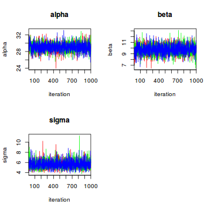
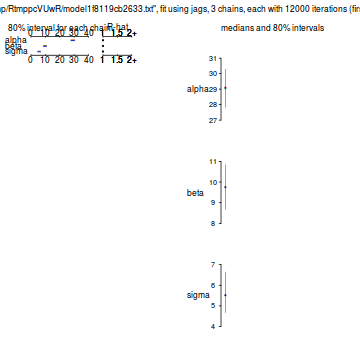
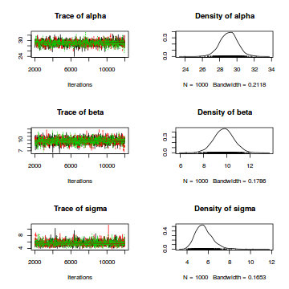
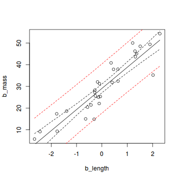
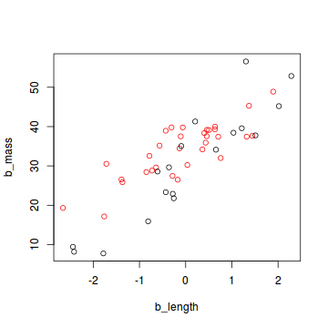
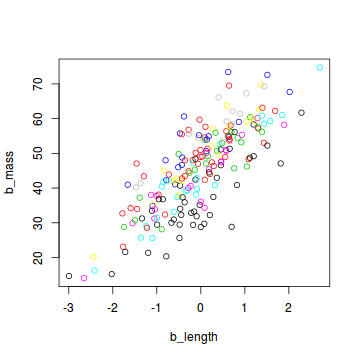

# Introduction

The following text and R code shows three examples of how to fit linear (mixed) models using Bayesian analysis in JAGS. To follow this demonstration, you should have a basic understanding of the principles of Bayesian statistics. Terms such as prior, likelihood, posterior and Markov Chain Monte Carlo (MCMC) should sound familiar to you. If you don't have this basic knowledge yet, I recommend reading the first half of "Bayesian Basics" by Michael Clark (HTML version available [here](https://m-clark.github.io/docs/IntroBayes.html)).


# A simple linear regression

To demonstrate what a linear regression in JAGS looks like, we are going to use a simulated data set of the relationship between body length and body mass of an imaginary snake species. This data simulation is based on code written by Felix May and on chapter 11 of the Bayesian statistics textbook by Kéry (Introduction to WinBUGs for Ecologists, 2010, pp. 141-150).

A linear regression is based on the assumption that the data are random samples from normal (Gaussian) distributions with equal variance and a mean which is a linear function of the predictor(s). Here I create a data set which fulfills this assumption, with body mass of the snake species as a linear function of body length:


```r
set.seed(42) # Set a random seed for reproducibility of the simulation

samplesize <- 30 # Number of data points
b_length <- sort(rnorm(samplesize)) # Body length (explanatory variable)

int_true <- 30 # True intercept
slope_true <- 10 # True slope
mu <- int_true + slope_true * b_length # True means of normal distributions
sigma <- 5 # True standard deviation of normal distributions

b_mass <- rnorm(samplesize, mean = mu, sd = sigma) # Body mass (response variable)

snakes1 <- data.frame(b_length = b_length, b_mass = b_mass)
head(snakes1)
```

```
##     b_length    b_mass
## 1 -2.6564554  5.712696
## 2 -2.4404669  9.119517
## 3 -1.7813084 17.362433
## 4 -1.7631631  9.323737
## 5 -1.3888607 18.636169
## 6 -0.6399949 15.015008
```
The body length values are drawn from a normal distribution with mean 0 and standard deviation 1, even though real body lengths can of course only have positive values. With a real data set one should always scale and center all continuous predictors before the analysis (i.e. subtract the mean and divide by the standard deviation, thereby transforming them to values with a mean of 0 and sd of 1) to avoid running into problems with model fitting. Here, we directly work with predictor values which are similar to a scaled and centered variable.

To fit a linear regression to this data set using JAGS, we first load the R package for communication between R and JAGS:


```r
library(R2jags)
```

Of course, this requires that both JAGS and R2jags are already installed on the computer. The R2jags package can be installed from within R using the command **install.packages("R2jags")**. The method to install JAGS varies between operating systems. Instructions can be found on the [JAGS homepage](http://mcmc-jags.sourceforge.net/).

Before we can analyse the data set in JAGS, it needs to be converted to a different format:


```r
jagsdata_s1 <- with(snakes1, list(b_mass = b_mass, b_length = b_length, N = length(b_mass)))
```

This creates a list with three elements: the response and predictor as vectors and the sample size as a single number.

In the next step we write our JAGS model. Using the R2jags package, we can write the model as an R function which contains the JAGS code:


```r
lm1_jags <- function(){
	# Likelihood:
	for (i in 1:N){
		b_mass[i] ~ dnorm(mu[i], tau) # tau is precision (1 / variance)
		mu[i] <- alpha + beta * b_length[i]
	}
	# Priors:
	alpha ~ dnorm(0, 0.01) # intercept
	beta ~ dnorm(0, 0.01) # slope
	sigma ~ dunif(0, 100) # standard deviation
	tau <- 1 / (sigma * sigma) # sigma^2 doesn't work in JAGS
}
```

Even though the body of this function looks like R code at first glance, it is written in JAGS, not R. The JAGS language is very similar to R, but there are some small differences. For example, in R a normal distribution is specified using the mean and standard deviation, but in JAGS the second parameter of the **dnorm** command is the distribution's *precision* (1 / variance).
In a JAGS model, the tilde sign (~) signifies that the object on the left is a random variable distributed according to the distribution on the right. The assignment arrow (<-) is used to specify deterministic relationships between objects. For more details on the JAGS language, see the [JAGS user manual](https://sourceforge.net/projects/mcmc-jags/files/Manuals/).

In the above function, the first part specifies the likelihood of the data given the linear regression model. Each value of body mass is a random draw from a normal distribution whose mean linearly depends on body length. The parameters **alpha** and **beta** are the intercept and slope of the linear relationship, whose values are to be estimated. The second part of the function specifies the prior distribution for each parameter. Since we are using simulated data, we know what the true values of the parameters are, but in this analysis we are going to pretend that we have no prior information about their values. Hence, we choose *uninformative priors* for all parameters, using flat distributions which make all plausible values approximately equally likely. The prior distribution for **alpha** and **beta** is a normal distribution with mean zero and low precision (i.e. large standard deviation). Since the standard deviation of a normal distribution can only be positive, we use a uniform distribution with a minimum of zero and a large maximum as prior for **sigma**.

The following code specifies initial parameter values for the MCMC sampler, chooses the parameters whose posterior distributions will be reported and runs the model in JAGS:


```r
init_values <- function(){
	list(alpha = rnorm(1), beta = rnorm(1), sigma = runif(1))
}

params <- c("alpha", "beta", "sigma")

fit_lm1 <- jags(data = jagsdata_s1, inits = init_values, parameters.to.save = params, model.file = lm1_jags,
			   n.chains = 3, n.iter = 12000, n.burnin = 2000, n.thin = 10, DIC = F)
```

The last command runs three MCMC chains with 12000 iterations each and discards the first 2000 values ("burn-in"), because these first values depend strongly on the chosen initial values and are therefore not a good representation of the likelihood. To reduce the correlation between consecutive values in the chain, only every 10th iteration is saved and the rest discarded ("thinning").

Let's look at a table of the model output:


```r
fit_lm1
```

```
## Inference for Bugs model at "/tmp/Rtmpe6faDZ/model215c3bfa6d32.txt", fit using jags,
##  3 chains, each with 12000 iterations (first 2000 discarded), n.thin = 10
##  n.sims = 3000 iterations saved
##       mu.vect sd.vect   2.5%    25%    50%    75%  97.5%  Rhat n.eff
## alpha  29.061   1.014 27.062 28.391 29.078 29.718 31.086 1.001  3000
## beta    9.750   0.853  8.023  9.182  9.757 10.302 11.409 1.001  3000
## sigma   5.600   0.800  4.290  5.042  5.516  6.078  7.376 1.001  3000
## 
## For each parameter, n.eff is a crude measure of effective sample size,
## and Rhat is the potential scale reduction factor (at convergence, Rhat=1).
```

This table shows the mean, standard deviation and quantiles of the marginal posterior distribution for each of the three model parameters. Note that the mean posterior values of **alpha**, **beta** and **sigma** are reasonably close to the true values that we used for the simulation (alpha = 30, beta = 10, sigma = 5). The range between the 2.5% and 97.5% quantiles is the 95% *credible interval* for each parameter. This is the Bayesian equivalent of a confidence interval, but its interpretation is different and arguably more intuitive. For example, for the 95% percent credible interval there is a 95% probability that the true parameter value lies within this range.

The last two columns in the table are convergence diagnostics. The effective sample size n.eff is a number smaller than or equal to the number of samples saved from the chains (3 * (12000 - 2000) / 10). The higher the autocorrelation in the saved samples, the smaller the effective sample size. Rhat is a measure of how well the three Markov chains have mixed and should ideally have a value very close to 1. If the Rhat values are substantially larger than one, the chains haven't mixed properly and the posterior estimates cannot be trusted. We can also visually assess how well the chains have mixed using the **traceplot** command:


```r
traceplot(fit_lm1, mfrow = c(2, 2), ask = F)
```



In our case all is well, the chains are quite nicely mixed.

There's a variety of ways to display the marginal posterior distributions of the parameters graphically. 
We can use the **plot** command on the fitted model object:


```r
plot(fit_lm1)
```



For a visualization of the complete posterior distributions with traceplots for each parameter, we first convert the model object to class "mcmc":


```r
lm1_mcmc <- as.mcmc(fit_lm1)
plot(lm1_mcmc)
```



Finally, we typically want to plot the data together with the model prediction. For this purpose, we first create a new sequence of predictor values:


```r
nvalues <- 100
b_length_new <- seq(min(snakes1$b_length), max(snakes1$b_length), length.out = nvalues)
```

To be able to easily use the MCMC samples for prediction, we combine the three chains into one. The following code creates an mcmc object with three columns (one for each parameter) and 3000 rows (one for each MCMC sample):


```r
lm1_mcmc_combi <- as.mcmc(rbind(lm1_mcmc[[1]], lm1_mcmc[[2]], lm1_mcmc[[3]]))
```

We then calculate the expected value of body mass for each of the new body length values using the mean posterior values of the model parameters **alpha** and **beta**:


```r
pred_mean_mean <- mean(lm1_mcmc_combi[, "alpha"]) + b_length_new * mean(lm1_mcmc_combi[, "beta"])
```

We can now plot the prediction line together with the data. However, we're not done yet: a useful plot should not only show the mean predicted value, but also the uncertainty around this mean. In our model, there are two sources of uncertainty: the uncertainty about the true parameter values and the uncertainty caused by the stochasticity of the relationship between body mass and body length (the normal distribution of realized body mass values around the mean). The first type of uncertainty can be quantified as the credible interval around the predicted mean body mass value for a particular value of body length. The following code determines the upper and lower bounds of this 95% credible interval for each of the 100 body lengths:


```r
pred_mean_dist <- matrix(NA, nrow = nrow(lm1_mcmc_combi), ncol = nvalues)
for (i in 1:nrow(pred_mean_dist)){
	pred_mean_dist[i,] <- lm1_mcmc_combi[i,"alpha"] + b_length_new * lm1_mcmc_combi[i,"beta"]
}
credible_lower <- apply(pred_mean_dist, MARGIN = 2, quantile, prob = 0.025)
credible_upper <- apply(pred_mean_dist, MARGIN = 2, quantile, prob = 0.975)
```

As an estimate of both types of uncertainty combined, we can draw random values from a normal distribution with a mean defined by the linear combination of body length and the sampled values of **alpha** and **beta**, and a variance equal to the sampled sigma. The next piece of code produces these random values for each parameter combination in the Markov chains and each body length. To get smoother curves, we first replicate the parameter combinations from the chains 50 times, which allows us to draw 50 random values from the normal distribution for each parameter combination and each value of body length. We then calculate the 2.5% and 97.5% quantiles of the values for each body length:


```r
lm1_mcmc_combi_rep <- do.call(rbind, rep(list(lm1_mcmc_combi), 50)) # replication

# Draw random values for all parameter combinations (rows) and body length values (columns):
pred_data_dist <- matrix(NA, nrow = nrow(lm1_mcmc_combi_rep), ncol = nvalues)
for (i in 1:nrow(pred_data_dist)){
	pred_data_dist[i,] <- lm1_mcmc_combi_rep[i,"alpha"] + b_length_new * lm1_mcmc_combi_rep[i,"beta"] +
		rnorm(nvalues, mean = 0, sd = lm1_mcmc_combi_rep[i, "sigma"])
}

# Calculate quantiles:
uncertain_lower <- apply(pred_data_dist, MARGIN = 2, quantile, prob = 0.025)
uncertain_upper <- apply(pred_data_dist, MARGIN = 2, quantile, prob = 0.975)
```

Finally, we can plot the data with the mean model prediction and the two uncertainty measures:


```r
plot(b_mass ~ b_length, data = snakes1)
lines(b_length_new, pred_mean_mean)
lines(b_length_new, credible_lower, lty = 2)
lines(b_length_new, credible_upper, lty = 2)
lines(b_length_new, uncertain_lower, lty = 2, col = "red")
lines(b_length_new, uncertain_upper, lty = 2, col = "red")
```



If we collect a large sample from the same population and our estimation of the posterior distribution is correct, 95% of the data should lie within the area between the two red lines.


# Same model with an additional categorical predictor

To see what a slightly more complicated linear regression in JAGS looks like, here we add an additional categorical predictor to our data. We'll assume that the relationship between body length and body mass differs between males and females of the snake species. The following code simulates the data for this model:


```r
set.seed(42)

samplesize <- 50 # Larger sample size because we're fitting a more complex model
b_length <- sort(rnorm(samplesize)) # Body length
sex <- sample(c(0, 1), size = samplesize, replace = T) # Sex (0: female, 1: male)

int_true_f <- 30 # Intercept of females
int_true_m_diff <- 5 # Difference between intercepts of males and females
slope_true_f <- 10 # Slope of females
slope_true_m_diff <- -3 # Difference between slopes of males and females

mu <- int_true_f + sex * int_true_m_diff + (slope_true_f + sex * slope_true_m_diff) * b_length # True means
sigma <- 5 # True standard deviation of normal distributions

b_mass <- rnorm(samplesize, mean = mu, sd = sigma) # Body mass (response variable)

# Combine into a data frame:
snakes2 <- data.frame(b_length = b_length, b_mass = b_mass, sex = sex)
head(snakes2)
```

```
##    b_length    b_mass sex
## 1 -2.656455 19.309795   1
## 2 -2.440467  9.436224   0
## 3 -2.414208  8.176761   0
## 4 -1.781308  7.758034   0
## 5 -1.763163 17.158954   1
## 6 -1.717009 30.544474   1
```

```r
plot(b_mass ~ b_length, col = (sex + 1), data = snakes2)
```



In this data set, the sex of a snake is expressed as 0 (female) or 1 (male). For an analysis in JAGS, all categorical data need to be converted to this numerical format. If your categorical variable has more that two levels, you need to express each level as a combination of zeros and ones.

The analysis of this data set in JAGS is very similar to that of the simpler model described above. First, we re-format the data:


```r
jagsdata_s2 <- with(snakes2, list(b_mass = b_mass, b_length = b_length, sex = sex, N = length(b_mass)))
```

Then we write the model as an R function containing the JAGS code:


```r
lm2_jags <- function(){
	# Likelihood:
	for (i in 1:N){
		b_mass[i] ~ dnorm(mu[i], tau) # tau is precision (1 / variance)
		mu[i] <- alpha[1] + sex[i] * alpha[2] + (beta[1] + beta[2] * sex[i]) * b_length[i]
	}
	# Priors:
	for (i in 1:2){
		alpha[i] ~ dnorm(0, 0.01)
		beta[i] ~ dnorm(0, 0.01)
	}
	sigma ~ dunif(0, 100)
	tau <- 1 / (sigma * sigma)
}
```

This model includes an interaction between sex and body length, i.e. both the intercept and slope of the linear relationship between body length and body mass differ by sex. Thus, we need to estimate two values each of alpha and beta. Just as in a normal linear regression in R, the first value of each parameter (in this case the value for females) is used as a reference, and the second value (the value for male snakes) is expressed as a difference to the first.

The next snippet of code defines initial values for the Markov chains, chooses the parameters to be recorded and runs the model:


```r
init_values <- function(){
	list(alpha = rnorm(2), beta = rnorm(2), sigma = runif(1))
}

params <- c("alpha", "beta", "sigma")

fit_lm2 <- jags(data = jagsdata_s2, inits = init_values, parameters.to.save = params, model.file = lm2_jags,
			   n.chains = 3, n.iter = 12000, n.burnin = 2000, n.thin = 10, DIC = F)
```

Let's have a look at the model output:


```r
fit_lm2
```

```
## Inference for Bugs model at "/tmp/Rtmpe6faDZ/model215c43321e46.txt", fit using jags,
##  3 chains, each with 12000 iterations (first 2000 discarded), n.thin = 10
##  n.sims = 3000 iterations saved
##          mu.vect sd.vect   2.5%    25%    50%    75%  97.5%  Rhat n.eff
## alpha[1]  29.752   1.145 27.463 28.992 29.742 30.531 32.045 1.002  3000
## alpha[2]   4.739   1.430  1.890  3.816  4.764  5.730  7.508 1.001  3000
## beta[1]    9.545   0.835  7.842  9.018  9.560 10.101 11.175 1.001  3000
## beta[2]   -3.997   1.171 -6.335 -4.803 -4.015 -3.192 -1.713 1.001  3000
## sigma      4.916   0.536  4.009  4.536  4.866  5.245  6.116 1.001  2700
## 
## For each parameter, n.eff is a crude measure of effective sample size,
## and Rhat is the potential scale reduction factor (at convergence, Rhat=1).
```

The posterior means are pretty close to the true values that were used for the simulation (see above). With the fitted model, you can create the same plots of the output as before, look at convergence diagnostics, plot the data and model predictions etc.

# A linear mixed model

As a third example, we'll create a data set with a random effect which should be analysed with a linear mixed-effects model. Just like the first data set, this one has only one predictor (body length), but in addition we'll assume that snakes were captured at a number of different sites. We'll analyse this data set with a random intercept model, hence we create a data set with the same slope of the effect of body length on body mass for all sites, but with different intercepts per site. The assumption of a mixed model is that the intercepts of the sites are normally distributed around their mean. The following code creates the data:


```r
set.seed(42)

samplesize <- 200
nsites <- 10 # Number of sites
b_length <- sort(rnorm(samplesize)) # Body length (explanatory variable)
sites <- sample(1:10, samplesize, replace = T) # Site (grouping variable)
table(sites)
```

```
## sites
##  1  2  3  4  5  6  7  8  9 10 
## 24 23 22 19 23 19 18 13 20 19
```

```r
int_true_mean <- 45 # True mean intercept
int_true_sigma <- 10 # True standard deviation of intercepts
int_true_sites <- rnorm(n = nsites, mean = int_true_mean, sd = int_true_sigma) # True intercept of each site

# Intercept of each snake individual (depending on the site where it was captured):
sitemat <- matrix(0, nrow = samplesize, ncol = nsites)
for (i in 1:nrow(sitemat)) sitemat[i, sites[i]] <- 1
int_true <- sitemat %*% int_true_sites

slope_true <- 10 # True slope
mu <- int_true + slope_true * b_length # True means of normal distributions
sigma <- 5 # True standard deviation of normal distributions

b_mass <- rnorm(samplesize, mean = mu, sd = sigma) # Body mass (response variable)

snakes3 <- data.frame(b_length = b_length, b_mass = b_mass, site = sites)
head(snakes3)
```

```
##    b_length   b_mass site
## 1 -2.993090 14.66808    1
## 2 -2.656455 14.06197    6
## 3 -2.440467 20.24723    7
## 4 -2.414208 16.23954    5
## 5 -2.024678 15.22331    9
## 6 -1.781308 32.70772    2
```

```r
plot(b_mass ~ b_length, col = site, data = snakes3)
```



When preparing this data set for analysis with JAGS, we include the number of sites as an additional element in the list:


```r
Nsites <- length(levels(as.factor(snakes3$site)))
jagsdata_s3 <- with(snakes3, list(b_mass = b_mass, b_length = b_length, site = site,
								  N = length(b_mass), Nsites = Nsites))
```

The JAGS model is a bit longer than before:


```r
lm3_jags <- function(){
	# Likelihood:
	for (i in 1:N){
		b_mass[i] ~ dnorm(mu[i], tau) # tau is precision (1 / variance)
		mu[i] <- alpha + a[site[i]] + beta * b_length[i] # Random intercept for site
	}
	# Priors:
	alpha ~ dnorm(0, 0.01) # intercept
	sigma_a ~ dunif(0, 100) # standard deviation of random effect (variance between sites)
	tau_a <- 1 / (sigma_a * sigma_a) # convert to precision
	for (j in 1:Nsites){
		a[j] ~ dnorm(0, tau_a) # random intercept for each site
	}
	beta ~ dnorm(0, 0.01) # slope
	sigma ~ dunif(0, 100) # standard deviation of fixed effect (variance within sites)
	tau <- 1 / (sigma * sigma) # convert to precision
}
```

In addition to the overall intercept **alpha**, we estimate an intercept **a** for each site. The site-specific intercepts are normally distributed around the overall intercept with variance **sigma_a**. This variance between sites is an additional parameter that is recorded in the model fitting process:


```r
init_values <- function(){
	list(alpha = rnorm(1), sigma_a = runif(1), beta = rnorm(1), sigma = runif(1))
}

params <- c("alpha", "beta", "sigma", "sigma_a")

fit_lm3 <- jags(data = jagsdata_s3, inits = init_values, parameters.to.save = params, model.file = lm3_jags,
			   n.chains = 3, n.iter = 20000, n.burnin = 5000, n.thin = 10, DIC = F)
```

The output of this model looks like this:


```r
fit_lm3
```

```
## Inference for Bugs model at "/tmp/Rtmpe6faDZ/model215c427ed6db.txt", fit using jags,
##  3 chains, each with 20000 iterations (first 5000 discarded), n.thin = 10
##  n.sims = 4500 iterations saved
##         mu.vect sd.vect   2.5%    25%    50%    75%  97.5%  Rhat n.eff
## alpha    42.669   4.387 31.091 41.305 43.530 45.201 47.948 1.003  4500
## beta      9.893   0.348  9.205  9.662  9.905 10.133 10.553 1.001  2700
## sigma     4.759   0.252  4.296  4.588  4.742  4.919  5.287 1.001  4100
## sigma_a   8.775   4.284  4.685  6.263  7.702  9.849 19.739 1.001  4500
## 
## For each parameter, n.eff is a crude measure of effective sample size,
## and Rhat is the potential scale reduction factor (at convergence, Rhat=1).
```

Again, the estimated mean posterior values are pretty close to the true values used for the simulation.
