Explorative data analysis
===

```r
library(knitr)
```

```
## Warning: package 'knitr' was built under R version 3.0.3
```

```r
opts_knit$set(global.par=TRUE) 
opts_chunk$set(cache=TRUE,fig.align='center')
```
For more details about plotting, please visit: https://github.com/biometry/APES/blob/master/R/R40-plottingInR.md

We will classify here the different plot methods according to their suitability to the variable analysis

# Categorical Variables
## Bar charts

Bar charts are appropiate to summarize categorical variables distributions

```r
attach (mtcars)
head(mtcars)
```

```
##                    mpg cyl disp  hp drat    wt  qsec vs am gear carb
## Mazda RX4         21.0   6  160 110 3.90 2.620 16.46  0  1    4    4
## Mazda RX4 Wag     21.0   6  160 110 3.90 2.875 17.02  0  1    4    4
## Datsun 710        22.8   4  108  93 3.85 2.320 18.61  1  1    4    1
## Hornet 4 Drive    21.4   6  258 110 3.08 3.215 19.44  1  0    3    1
## Hornet Sportabout 18.7   8  360 175 3.15 3.440 17.02  0  0    3    2
## Valiant           18.1   6  225 105 2.76 3.460 20.22  1  0    3    1
```

```r
fam= mtcars$fam=factor(mtcars$am, levels=c(0,1), labels=c("automatic","manual")) #we substract the variable Transmission (0 = automatic, 1 = manual) with "$" from the dataset 
head(mtcars)
```

```
##                    mpg cyl disp  hp drat    wt  qsec vs am gear carb
## Mazda RX4         21.0   6  160 110 3.90 2.620 16.46  0  1    4    4
## Mazda RX4 Wag     21.0   6  160 110 3.90 2.875 17.02  0  1    4    4
## Datsun 710        22.8   4  108  93 3.85 2.320 18.61  1  1    4    1
## Hornet 4 Drive    21.4   6  258 110 3.08 3.215 19.44  1  0    3    1
## Hornet Sportabout 18.7   8  360 175 3.15 3.440 17.02  0  0    3    2
## Valiant           18.1   6  225 105 2.76 3.460 20.22  1  0    3    1
##                         fam
## Mazda RX4            manual
## Mazda RX4 Wag        manual
## Datsun 710           manual
## Hornet 4 Drive    automatic
## Hornet Sportabout automatic
## Valiant           automatic
```

Frequency table of the Transmission variable

```r
table(fam)
```

```
## fam
## automatic    manual 
##        19        13
```

```r
count=table(fam) 
count
```

```
## fam
## automatic    manual 
##        19        13
```

% frequencies calculation

```r
percent=table(fam)/length(fam)
percent
```

```
## fam
## automatic    manual 
##    0.5938    0.4062
```

Graphic representation of both with barplots

```r
barplot(count)
```

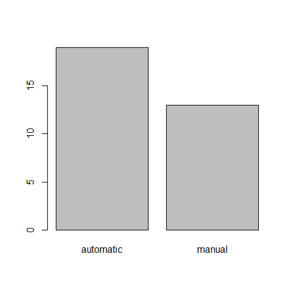

```r
barplot(percent)
```

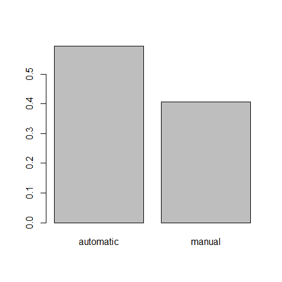

We add a title and x/y labels

```r
barplot(percent,main="the title", xlab="transmission",ylab="%",las=1,ylim=c(0,1), names.arg=c("auto transm", "manual transm") )
```

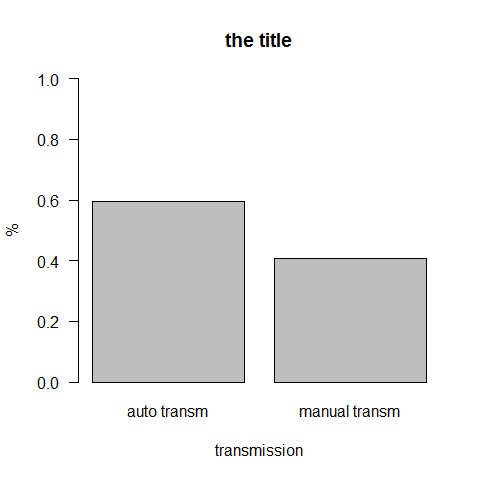

# Numerical Variables
## Boxplot 

Boxplots are appropiate to summarize numerical variables distributions

```r
summary(mpg)
```

```
##    Min. 1st Qu.  Median    Mean 3rd Qu.    Max. 
##    10.4    15.4    19.2    20.1    22.8    33.9
```

```r
quantile(mpg)
```

```
##    0%   25%   50%   75%  100% 
## 10.40 15.43 19.20 22.80 33.90
```

```r
quantile(mpg,probs=c(0,0.20,0.40,0.60,0.80,1))
```

```
##    0%   20%   40%   60%   80%  100% 
## 10.40 15.20 17.92 21.00 24.08 33.90
```

```r
boxplot(mpg,main="title", ylab="mpg", ylim=c(0,50), las=1)
```

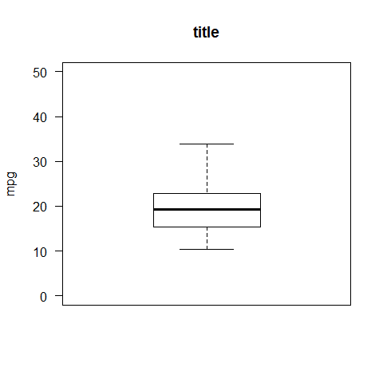

```r
boxplot(mpg~fam, main="mpg by transmission")
```

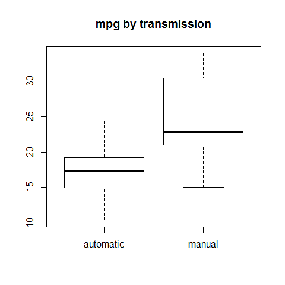

```r
boxplot(mpg[fam=="automatic"],xlab="automatic")
```

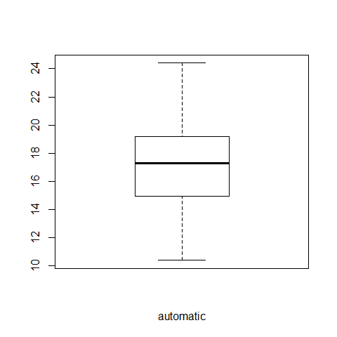

## Histograms 

Histograms are appropiate to summarize numerical variables distributions

```r
hist(mpg)
```

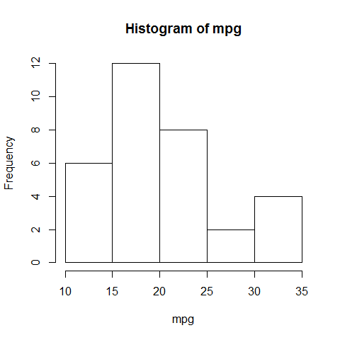

```r
hist(mpg,freq=FALSE,main="my histogram") #instead of counting the number of datapoints per bin, R can give the probability densities by using freq=FALSE 
```

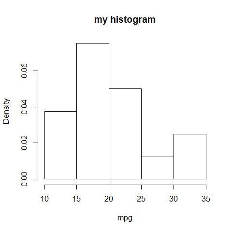

```r
hist(mpg,prob=TRUE,ylim=c(0,0.1)) #prob=T changes the y-axis from frequency counts to probability (to create density curves)

lines(density(mpg))  #add a density curve
lines(density(mpg),col="red",lwd=3)
```

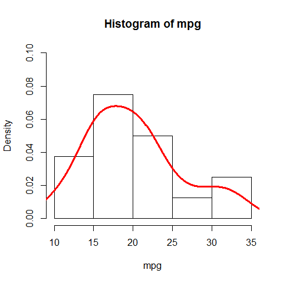

```r
hist(mpg,breaks=seq(10,36,by=2),las=1)
```

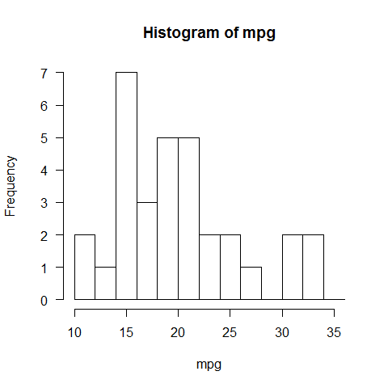

## Stem and Leaf Plots 

Stem and Leaf plots are appropiate to summarize numerical variables distributions (low sample size)

```r
stem(mpg)   
```

```
## 
##   The decimal point is at the |
## 
##   10 | 44
##   12 | 3
##   14 | 3702258
##   16 | 438
##   18 | 17227
##   20 | 00445
##   22 | 88
##   24 | 4
##   26 | 03
##   28 | 
##   30 | 44
##   32 | 49
```
?stem for more info
There are 2 obs 10.4
There is one obs 32.4 and one 32.9
 
## Scatterplots 

Scatterplots are appropiate to summarize the relation between two numerical variables 

Relation ship between horsepower hp and consumption mpg

```r
plot(mpg~hp) # y~x
```

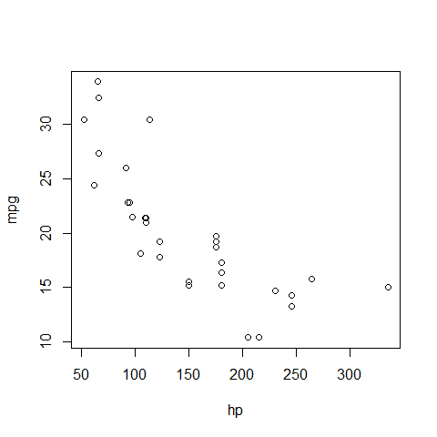

```r
plot(hp, mpg) # x,y
```


```r
plot(hp, mpg,xlab = "Gross horsepower", ylab="Miles/(US) gallon",las=1,col="red", xlim=c(0,400), cex =2 )  #cex (plotting characters size times 2)
```

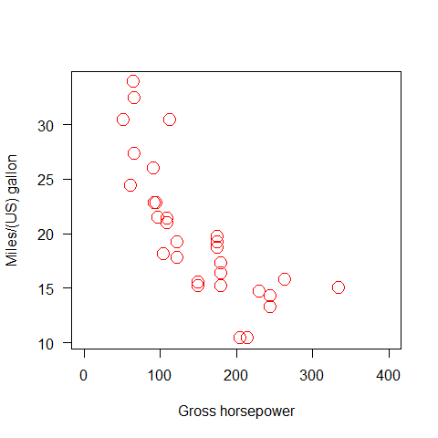

```r
plot(hp, mpg,xlab = "Gross horsepower", ylab="Miles/(US) gallon",las=1,col="red", xlim=c(0,400), pch=8)  #pch (symbol type)
abline(lm(mpg~hp),col="blue",lwd=5,lty=3) #add linear regression, line width and type
```

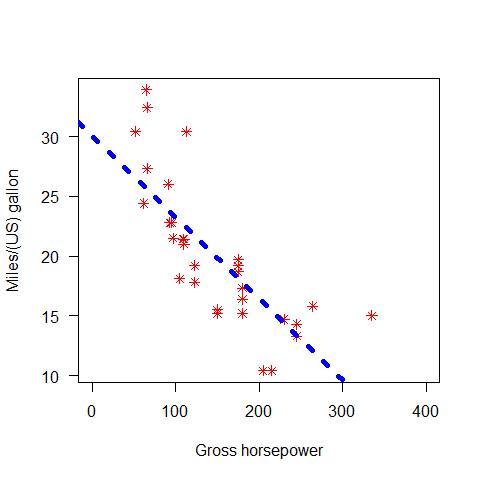

```r
x = 1:20
plot(x,pch=x,cex=3)
```

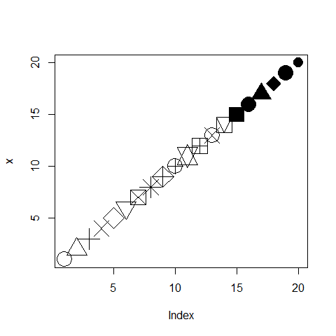


# Summary statistics

Some piece of information that gives a quick and simple description of the data.

For a categorical variable, like "fam"

```r
table(fam)
```

```
## fam
## automatic    manual 
##        19        13
```

```r
table(fam)/length(fam)
```

```
## fam
## automatic    manual 
##    0.5938    0.4062
```

Contingency table (2-way table)

```r
table(mpg,fam) #vertical table
```

```
##       fam
## mpg    automatic manual
##   10.4         2      0
##   13.3         1      0
##   14.3         1      0
##   14.7         1      0
##   15           0      1
##   15.2         2      0
##   15.5         1      0
##   15.8         0      1
##   16.4         1      0
##   17.3         1      0
##   17.8         1      0
##   18.1         1      0
##   18.7         1      0
##   19.2         2      0
##   19.7         0      1
##   21           0      2
##   21.4         1      1
##   21.5         1      0
##   22.8         1      1
##   24.4         1      0
##   26           0      1
##   27.3         0      1
##   30.4         0      2
##   32.4         0      1
##   33.9         0      1
```

```r
table(fam,mpg) # horizontal table
```

```
##            mpg
## fam         10.4 13.3 14.3 14.7 15 15.2 15.5 15.8 16.4 17.3 17.8 18.1 18.7
##   automatic    2    1    1    1  0    2    1    0    1    1    1    1    1
##   manual       0    0    0    0  1    0    0    1    0    0    0    0    0
##            mpg
## fam         19.2 19.7 21 21.4 21.5 22.8 24.4 26 27.3 30.4 32.4 33.9
##   automatic    2    0  0    1    1    1    1  0    0    0    0    0
##   manual       0    1  2    1    0    1    0  1    1    2    1    1
```

For a numerical variable, like "mpg"

```r
mean(mpg)
```

```
## [1] 20.09
```

```r
summary(mpg)
```

```
##    Min. 1st Qu.  Median    Mean 3rd Qu.    Max. 
##    10.4    15.4    19.2    20.1    22.8    33.9
```

```r
sd(mpg) #standard deviation
```

```
## [1] 6.027
```

```r
var(mpg) #variance
```

```
## [1] 36.32
```

```r
sqrt(var(mpg)) # = to sd
```

```
## [1] 6.027
```

```r
sd(mpg)^2 # = to variance
```

```
## [1] 36.32
```

```r
max(mpg)
```

```
## [1] 33.9
```

```r
tapply(mpg,fam,mean)
```

```
## automatic    manual 
##     17.15     24.39
```

```r
tapply(mpg,list(fam,gear),mean)
```

```
##               3     4     5
## automatic 16.11 21.05    NA
## manual       NA 26.27 21.38
```
