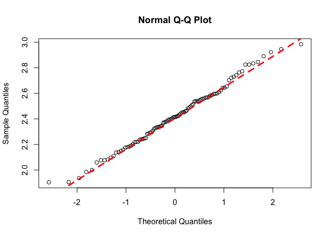
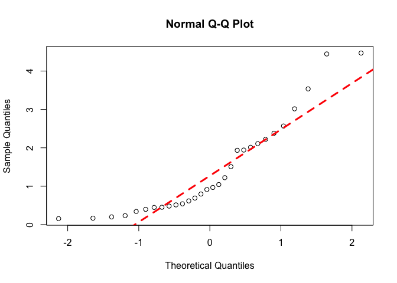

===

# Testing for normality


```r
library(knitr)
opts_knit$set(global.par=TRUE) 
opts_chunk$set(cache.extra = rand_seed,fig.align='center')
set.seed(3)
```

The normal distribution is the most important and most widely used distribution in statistics.

We can say that a distribution is normally distributed when:

1) is symmetric around their mean.

2) the mean, median, and mode of a normal distribution are equal.

3) the area under the normal curve is equal to 1.0.

4) distributions are denser in the center and less dense in the tails.

5) distributions are defined by two parameters, the mean and the standard deviation (sd).

6) 68% of the area of a normal distribution is within one standard deviation of the mean.

7) Approximately 95% of the area of a normal distribution is within two standard deviations of the mean.

Normal distribution 

Simulation of the weight of 1570 adult males normally distributed

```r
data1=rnorm(1570,mean=75,sd=8)
hist(data1,main="Adult male weights",xlab="adult male weight",col="red",las=1)
```


Load example data

```r
data = read.table("../Data/Simone/das.txt",header=T)
summary(data)
```

```
##        y        
##  Min.   :1.904  
##  1st Qu.:2.241  
##  Median :2.414  
##  Mean   :2.419  
##  3rd Qu.:2.568  
##  Max.   :2.984
```

Visualize example data

```r
attach(data) #command search() helps to verify what is/is not attached)
par(mfrow=c(2,2)) #to divide the plot window
plot(y)
boxplot(y)
hist(y,breaks=20)
y2=y
y2[52]=21.75 # to change the 52nd value for 21.75 instead of 2.175:
plot(y2)     #very good to spot mistakes, outliers
```


```r
par(mfrow=c(1,1)) #back to one plot window
```


## Visual Check for Normality: quantile-quantile plot

This one plots the ranked samples from our distribution against a similar number of ranked quantiles taken from a normal distribution.
If our sample is normally distributed then the line will be straight. 
Exceptions from normality show up different sorts of non-linearity (e.g. S-shapes or banana shapes). 


```r
qqnorm(y)
qqline(y,lty=2,col=2,lwd=3)
```




## Normality test: the shapiro.test


```r
shapiro.test(y)  # p-value=0.753, these data are normally distributed
```

```
## 
## 	Shapiro-Wilk normality test
## 
## data:  y
## W = 0.9911, p-value = 0.753
```

```r
detach(data)
```


As an example we will create a fake data log-normally distributed and verify the assumption of normality

```r
x=exp(rnorm(30))  #rnorm without specification (normal distributed or not) picks data from the standard normal, mean = 0, sd = 1
plot(x)
```


```r
boxplot(x)
```


```r
hist(x,breaks=50)
```


```r
qqnorm(x)
qqline(x,lty=2,col=2,lwd=3)
```




```r
shapiro.test(x)  #p-value=8.661e-07, not normally distributed
```

```
## 
## 	Shapiro-Wilk normality test
## 
## data:  x
## W = 0.8572, p-value = 0.0008806
```


# Correlations tests

Correlation tests measure the relationship between variables. This relationship can goes from +1 to -1, where 0 means no relation. Some of the tests that we can use to estimate this relationship are the following:

-Pearson's correlation is a parametric measure of the linear association between 2 numeric variables (PARAMETRIC TEST)

-Spearman's rank correlation is a non-parametric measure of the monotonic association between 2 numeric variables (NON-PARAMETRIC TEST)

-Kendall's rank correlation is another non-parametric measure of the associtaion, based on concordance or discordance of x-y pairs (NON-PARAMETRIC TEST)


```r
attach(mtcars)  
plot(hp,wt, main="scatterplot",las=1, xlab ="gross horse power", ylab="Weight (lb/1000)")
```


Compute the three correlation coefficients

```r
cor(hp,wt,method="pearson")
```

```
## [1] 0.6587479
```

```r
cor(hp,wt)#Pearson is the default method; the order of variables is not important
```

```
## [1] 0.6587479
```

```r
cor(hp,wt,method="spearman")
```

```
## [1] 0.7746767
```

```r
cor(hp,wt,method="kendal")
```

```
## [1] 0.6113081
```

Test the null hypothesis, that means that the correlation is 0 (there is no correlation)

```r
cor.test(hp,wt,method="pearson") #Pearson correlation test
```

```
## 
## 	Pearson's product-moment correlation
## 
## data:  hp and wt
## t = 4.7957, df = 30, p-value = 4.146e-05
## alternative hypothesis: true correlation is not equal to 0
## 95 percent confidence interval:
##  0.4025113 0.8192573
## sample estimates:
##       cor 
## 0.6587479
```

```r
cor.test(hp,wt,method="spearman") #Spearmn is a non-parametric, thus it is not possible to get CIs. There is a error message because R cannot compute exact p values (the test is based on ranks, we have few cars with the same hp or wt).We can get rid off the warning letting R know that approximate values are fine
```

```
## Warning in cor.test.default(hp, wt, method = "spearman"): Cannot compute
## exact p-value with ties
```

```
## 
## 	Spearman's rank correlation rho
## 
## data:  hp and wt
## S = 1229.364, p-value = 1.954e-07
## alternative hypothesis: true rho is not equal to 0
## sample estimates:
##       rho 
## 0.7746767
```

```r
cor.test(hp,wt,method="spearman",exact=F) 
```

```
## 
## 	Spearman's rank correlation rho
## 
## data:  hp and wt
## S = 1229.364, p-value = 1.954e-07
## alternative hypothesis: true rho is not equal to 0
## sample estimates:
##       rho 
## 0.7746767
```

```r
cor.test(hp,wt,method="kendal",exact=F) #same happens with Kendal correlation test
```

```
## 
## 	Kendall's rank correlation tau
## 
## data:  hp and wt
## z = 4.845, p-value = 1.266e-06
## alternative hypothesis: true tau is not equal to 0
## sample estimates:
##       tau 
## 0.6113081
```

When we have non-parametric data and we do not know which correlation method to choose, as a rule of thumb, if the correlation looks non-linear, Kendall tau should be better than Spearman Rho.


## Further handy functions for correlations

Plot all possible combinations with "pairs"

```r
pairs(mtcars)  # all possible pairwise plots
```


To make it simpler we select what we are interested

```r
names(mtcars)
```

```
##  [1] "mpg"  "cyl"  "disp" "hp"   "drat" "wt"   "qsec" "vs"   "am"   "gear"
## [11] "carb"
```

```r
pairs(mtcars[,c(1,4,6)]) # subsetting the categories we will use
```


Building a correlation matrix

```r
cor(mtcars)
```

```
##             mpg        cyl       disp         hp        drat         wt
## mpg   1.0000000 -0.8521620 -0.8475514 -0.7761684  0.68117191 -0.8676594
## cyl  -0.8521620  1.0000000  0.9020329  0.8324475 -0.69993811  0.7824958
## disp -0.8475514  0.9020329  1.0000000  0.7909486 -0.71021393  0.8879799
## hp   -0.7761684  0.8324475  0.7909486  1.0000000 -0.44875912  0.6587479
## drat  0.6811719 -0.6999381 -0.7102139 -0.4487591  1.00000000 -0.7124406
## wt   -0.8676594  0.7824958  0.8879799  0.6587479 -0.71244065  1.0000000
## qsec  0.4186840 -0.5912421 -0.4336979 -0.7082234  0.09120476 -0.1747159
## vs    0.6640389 -0.8108118 -0.7104159 -0.7230967  0.44027846 -0.5549157
## am    0.5998324 -0.5226070 -0.5912270 -0.2432043  0.71271113 -0.6924953
## gear  0.4802848 -0.4926866 -0.5555692 -0.1257043  0.69961013 -0.5832870
## carb -0.5509251  0.5269883  0.3949769  0.7498125 -0.09078980  0.4276059
##             qsec         vs          am       gear        carb
## mpg   0.41868403  0.6640389  0.59983243  0.4802848 -0.55092507
## cyl  -0.59124207 -0.8108118 -0.52260705 -0.4926866  0.52698829
## disp -0.43369788 -0.7104159 -0.59122704 -0.5555692  0.39497686
## hp   -0.70822339 -0.7230967 -0.24320426 -0.1257043  0.74981247
## drat  0.09120476  0.4402785  0.71271113  0.6996101 -0.09078980
## wt   -0.17471588 -0.5549157 -0.69249526 -0.5832870  0.42760594
## qsec  1.00000000  0.7445354 -0.22986086 -0.2126822 -0.65624923
## vs    0.74453544  1.0000000  0.16834512  0.2060233 -0.56960714
## am   -0.22986086  0.1683451  1.00000000  0.7940588  0.05753435
## gear -0.21268223  0.2060233  0.79405876  1.0000000  0.27407284
## carb -0.65624923 -0.5696071  0.05753435  0.2740728  1.00000000
```

```r
cor(mtcars[,c(1,4,6)])
```

```
##            mpg         hp         wt
## mpg  1.0000000 -0.7761684 -0.8676594
## hp  -0.7761684  1.0000000  0.6587479
## wt  -0.8676594  0.6587479  1.0000000
```

```r
detach(mtcars)
```

http://www.uni-kiel.de/psychologie/rexrepos/rerDescriptive.html
