Analysis of variance (ANOVA)
===

Anova or analysis of variance makes basically the same assumptions as a t-test (normally distributed responses), but allows for more than two groups. More precisely, the measured response (i.e. the dependent variable) can be influence by several categorical variables that could also interact. Here a simple example for testing whether weight depends on group, where group is a variable that codes for three different options control, treatment1 and treatment2:


```r
library(knitr)
```

```
## Warning: package 'knitr' was built under R version 3.0.3
```

```r
opts_knit$set(global.par=TRUE) 
opts_chunk$set(cache=TRUE,fig.align='center')

aovresult <- aov(extra~group,  data = sleep)
summary(aovresult)
```

```
##             Df Sum Sq Mean Sq F value Pr(>F)  
## group        1   12.5    12.5    3.46  0.079 .
## Residuals   18   64.9     3.6                 
## ---
## Signif. codes:  0 '***' 0.001 '**' 0.01 '*' 0.05 '.' 0.1 ' ' 1
```

We find a p-value of 0.0159, which is significant at an $\alpha$ level of 0.05. Note that in this case, we don't get any parameter estimates. If you want those, there are two options for the ANOVA:
\begin{itemize}
\item Either you apply what is called post-hoc testing, which means that you test for differences (e.g. with a t-test) between the subgroups, i.e. control vs. treatment1, treatment1 vs. treatment2, etc.
\item Or you switch to a regression, which is described in the next chapter
\end{itemize}
If you do post-hoc testing, you are doing multiple tests on the same data. This is a problem - the idea of the p-value is that you calculate the probability of seeing the data under ONE null hypothesis. If you do this, you will get at most 5\% error at an $\alpha$ level of 0.05. \marginnote{When doing multiple tests on the same data, we need to correct the p-values for multiple testing.} However, if we do multiple tests, we are testing multiple null hypotheses, and there are more options for the test statistics to get significant just by chance. Hence, we need to correct the p-values for multiple testing. There are a number of options to do so, google is your friend. 


# ONE-WAY ANOVA 

ANOVA is a parametric method appropriate to compare means of two or more INDEPENDENT populations by using variances.
Do not confuse with ANCOVA, a model which blends ANOVA and regression 


Model validation, assumptions:
1) Random sampling, or at the very least, random assignment to groups. Independence of scores on the response variable. What we get from one subject should be in no way influenced by what we get from any of the others.
2) Variation of observations around the regression line
(the residual standard error) is CONSTANT (homoscedasticity)
3) Y values (or the errors) are INDEPENDENT (independence)
4) For a given X value, Y values (or the errors) are NORMALLY DISTRIBUTED (normality)

Example, clay's yield depending on the soil

```r
results <- read.delim("Z:/GitHub/RMarkdowns - Stat with R/6_ANOVA/yields.txt")
results
```

```
##    sand clay loam
## 1     6   17   13
## 2    10   15   16
## 3     8    3    9
## 4     6   11   12
## 5    14   14   15
## 6    17   12   16
## 7     9   12   17
## 8    11    8   13
## 9     7   10   18
## 10   11   13   14
```

```r
attach(results)
names(results)
```

```
## [1] "sand" "clay" "loam"
```

```r
#the datset is horizonetal, first we will flip it to vertical
sapply(list(sand,clay,loam),mean) #for horizontal datasets
```

```
## [1]  9.9 11.5 14.3
```

```r
boxplot(sand,clay,loam)
```

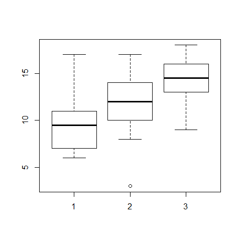

```r
#to flip the dataset
frame <- stack(results)
names(frame) <- c("yield","soil")
detach(results)
attach(frame)
head(frame)
```

```
##   yield soil
## 1     6 sand
## 2    10 sand
## 3     8 sand
## 4     6 sand
## 5    14 sand
## 6    17 sand
```

```r
#now, the dataset is vertical
tapply(yield,soil,var)
```

```
##   clay   loam   sand 
## 15.389  7.122 12.544
```

```r
plot(yield~soil,col="green")
```

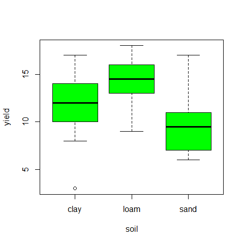

```r
#test for homoscedasticity, one of the model assumptions
fligner.test(yield~soil)   # Fligner-Killeen test of homogeneity of variances
```

```
## 
## 	Fligner-Killeen test of homogeneity of variances
## 
## data:  yield by soil
## Fligner-Killeen:med chi-squared = 0.3651, df = 2, p-value = 0.8332
```

```r
bartlett.test(yield~soil)  #Bartlett.test
```

```
## 
## 	Bartlett test of homogeneity of variances
## 
## data:  yield by soil
## Bartlett's K-squared = 1.276, df = 2, p-value = 0.5283
```

```r
#Once tested the assumptions, we can compute the ANOVA
model=aov(yield~soil)
summary(model)
```

```
##             Df Sum Sq Mean Sq F value Pr(>F)  
## soil         2   99.2    49.6    4.24  0.025 *
## Residuals   27  315.5    11.7                 
## ---
## Signif. codes:  0 '***' 0.001 '**' 0.01 '*' 0.05 '.' 0.1 ' ' 1
```

```r
par(mfrow=c(2,2))
plot(aov(yield~soil))
```

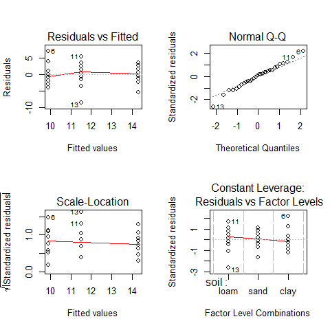

```r
par(mfrow=c(1,1))

#we can see that the assumptions are met

detach(frame)
```

ONE-WAY ANOVA example: Load weight loss depending on 4 different diets

```r
diets <- read.delim("Z:/GitHub/RMarkdowns - Stat with R/6_ANOVA/DietWeigthLoss.txt")
head(diets)
```

```
##   WeightLoss Diet
## 1        9.9    A
## 2        9.6    A
## 3        8.0    A
## 4        4.9    A
## 5       10.2    A
## 6        9.0    A
```

```r
summary(diets)
```

```
##    WeightLoss    Diet  
##  Min.   : 3.80   A:15  
##  1st Qu.: 8.97   B:15  
##  Median :10.20   C:15  
##  Mean   :10.19   D:15  
##  3rd Qu.:11.90         
##  Max.   :15.10
```

```r
attach(diets)

class(WeightLoss) #our response variable
```

```
## [1] "numeric"
```

```r
class(Diet) # our predictor variable (categorical)
```

```
## [1] "factor"
```

```r
levels(Diet)
```

```
## [1] "A" "B" "C" "D"
```

```r
length(WeightLoss)
```

```
## [1] 60
```


```r
boxplot(WeightLoss~Diet, ylab="Weight loss (kg)", xlab="Diet ",col=c(0,2,3,4))
```

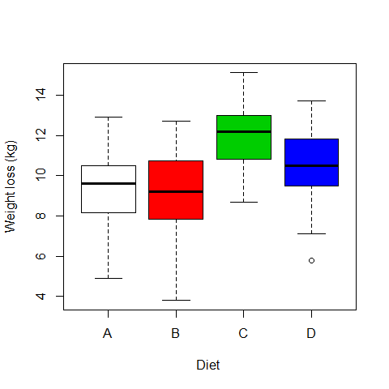

```r
# Ho = mean equal for all diets

model1= aov(WeightLoss~Diet)

summary(model1) 
```

```
##             Df Sum Sq Mean Sq F value Pr(>F)   
## Diet         3   97.3    32.4    6.12 0.0011 **
## Residuals   56  297.0     5.3                  
## ---
## Signif. codes:  0 '***' 0.001 '**' 0.01 '*' 0.05 '.' 0.1 ' ' 1
```

```r
attributes(model1)
```

```
## $names
##  [1] "coefficients"  "residuals"     "effects"       "rank"         
##  [5] "fitted.values" "assign"        "qr"            "df.residual"  
##  [9] "contrasts"     "xlevels"       "call"          "terms"        
## [13] "model"        
## 
## $class
## [1] "aov" "lm"
```

```r
model1$coefficients  #we subset the coefficients from the model's attributes
```

```
## (Intercept)       DietB       DietC       DietD 
##      9.1800     -0.2733      2.9333      1.3600
```

```r
mean(WeightLoss[Diet=="A"])  #coefficients have been estimated with respect to Diet A
```

```
## [1] 9.18
```

Multiple comparisons

```r
TukeyHSD(model1) #all possible combinations between the different diets
```

```
##   Tukey multiple comparisons of means
##     95% family-wise confidence level
## 
## Fit: aov(formula = WeightLoss ~ Diet)
## 
## $Diet
##        diff     lwr    upr  p adj
## B-A -0.2733 -2.4999 1.9533 0.9880
## C-A  2.9333  0.7067 5.1599 0.0051
## D-A  1.3600 -0.8666 3.5866 0.3774
## C-B  3.2067  0.9801 5.4333 0.0019
## D-B  1.6333 -0.5933 3.8599 0.2224
## D-C -1.5733 -3.7999 0.6533 0.2521
```

```r
plot(TukeyHSD(model1), las=1)  #graphic visualization
```


ANOVA's assumptions

```r
par(mfrow=c(2,2))
plot(model1)
```

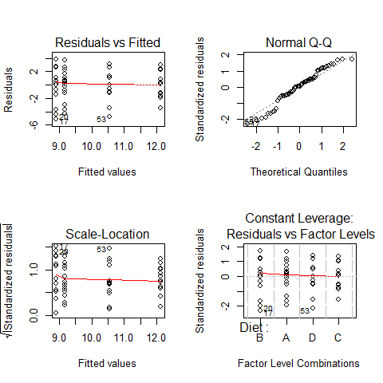

```r
par(mfrow=c(1,1))

qqnorm(model1$residuals);qqline(model1$residuals)
```

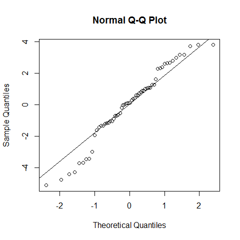

```r
shapiro.test(model1$residuals) # we cannot reject the null hypothesis, but with poor confidence. However, as discussed for the linear regression, the assumption of normality is not that strict.
```

```
## 
## 	Shapiro-Wilk normality test
## 
## data:  model1$residuals
## W = 0.9646, p-value = 0.07918
```
If our data is no normally distributed:
The one-way ANOVA is considered a robust test against the normality assumption. This means that it tolerates violations to its normality assumption rather well. Regarding the normality of the group data, the one-way ANOVA can tolerate data that is non-normal . However, platykurtosis can have a profound effect when the group sizes are small. 
(Kurtosis.jpg)

There are two options: 
1) Transform the data using various algorithms so that the shape of the distributions become normally distributed 
2) Choose the non-parametric Kruskal-Wallis H Test which does not require the assumption of normality.


```r
par(mfrow=c(1,2))
hist(model1$residuals,freq=F,ylim=c(0,0.4),breaks=10);lines(density(model1$residuals))
hist(WeightLoss,freq=F,ylim=c(0,0.4),breaks=10);lines(density(WeightLoss))
```

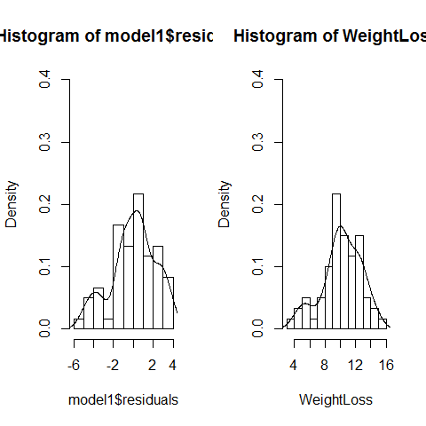

```r
par(mfrow=c(1,1))
#Platykurtosis was not used here, the sample size is not small neither.
```
It is important to remember, that the homogeneity of variances is more important than the normality of residuals

Other option to run a parametric one-way ANOVA with correction for non-equal variances, limited to very simple ANOVAs:

```r
data(InsectSprays)
attach(InsectSprays)
fligner.test(count ~ spray) # variances are not equal
```

```
## 
## 	Fligner-Killeen test of homogeneity of variances
## 
## data:  count by spray
## Fligner-Killeen:med chi-squared = 14.48, df = 5, p-value = 0.01282
```

```r
boxplot(count ~ spray)
```


```r
model3=oneway.test(count ~ spray) #this is not assuming equal variances
model3
```

```
## 
## 	One-way analysis of means (not assuming equal variances)
## 
## data:  count and spray
## F = 36.07, num df = 5.00, denom df = 30.04, p-value = 7.999e-12
```

```r
detach(InsectSprays)
```

More complex example: Serum_iron(microg/dL) dosis in 120 patients

```r
iron <- read.delim("Z:/GitHub/RMarkdowns - Stat with R/6_ANOVA/hospital_ANOVA.txt")

head(iron)   
```

```
##   Serum_iron treatment
## 1      69.78     DrugA
## 2      91.48     DrugA
## 3      67.29     DrugA
## 4      90.71     DrugA
## 5      72.02     DrugA
## 6      71.35     DrugA
```

```r
dim(iron)  #dimensions of the data
```

```
## [1] 120   2
```

```r
attach(iron)
levels(treatment)   
```

```
## [1] "DrugA"   "DrugB"   "DrugC"   "placebo"
```

Running a parametric ANOVA

```r
boxplot(Serum_iron~treatment)
```

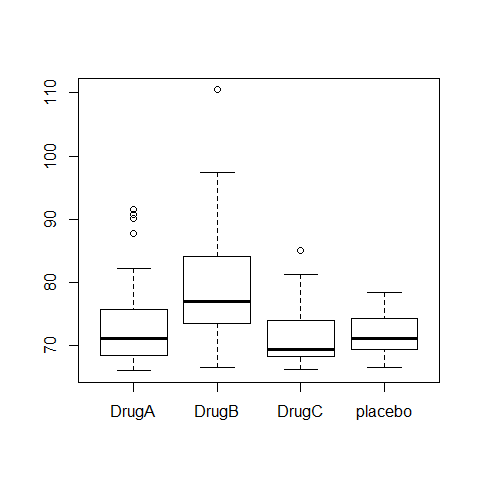

```r
ANOVA1=aov(Serum_iron~treatment)
summary(ANOVA1)
```

```
##              Df Sum Sq Mean Sq F value  Pr(>F)    
## treatment     3   1385     462    9.81 8.1e-06 ***
## Residuals   116   5458      47                    
## ---
## Signif. codes:  0 '***' 0.001 '**' 0.01 '*' 0.05 '.' 0.1 ' ' 1
```

```r
TukeyHSD(ANOVA1)
```

```
##   Tukey multiple comparisons of means
##     95% family-wise confidence level
## 
## Fit: aov(formula = Serum_iron ~ treatment)
## 
## $treatment
##                  diff      lwr    upr  p adj
## DrugB-DrugA    5.5409   0.9244 10.158 0.0118
## DrugC-DrugA   -2.6640  -7.2806  1.953 0.4383
## placebo-DrugA -2.8916  -7.5081  1.725 0.3645
## DrugC-DrugB   -8.2050 -12.8215 -3.588 0.0001
## placebo-DrugB -8.4325 -13.0491 -3.816 0.0000
## placebo-DrugC -0.2275  -4.8441  4.389 0.9992
```

```r
op=par(mar=c(4,8,4,4))
plot(TukeyHSD(ANOVA1),las=1)
```


```r
par(op)

op=par(mfrow=c(2,2))
plot(ANOVA1)
```

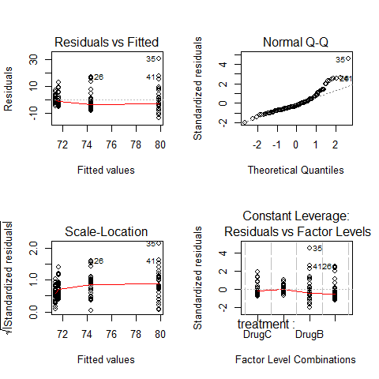

```r
par(op)
par(mfrow=c(1,1))
fligner.test(Serum_iron~treatment)
```

```
## 
## 	Fligner-Killeen test of homogeneity of variances
## 
## data:  Serum_iron by treatment
## Fligner-Killeen:med chi-squared = 9.948, df = 3, p-value = 0.01902
```

```r
bartlett.test(Serum_iron~treatment, iron)
```

```
## 
## 	Bartlett test of homogeneity of variances
## 
## data:  Serum_iron by treatment
## Bartlett's K-squared = 35.6, df = 3, p-value = 9.1e-08
```

```r
#increasing spred in residuals, different spread in residuals depending on drugs

boxplot(ANOVA1$residuals~treatment)
```

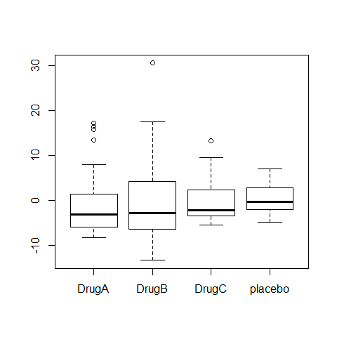

```r
# There is an independence problem, we need more information: are patients all from the same hospital? what about sex and age of patient?
```

## Non-parametric version of the Analysis of Variance

KRUSKAS WALLIS 1-WAY Analysis of Variance is a non-parametric equivalent of ANOVA for independent samples.

```r
model2=kruskal.test(WeightLoss~Diet)
library(pgirmess)
```

```
## Warning: package 'pgirmess' was built under R version 3.0.3
```

```r
kruskalmc(WeightLoss~Diet)
```

```
## Multiple comparison test after Kruskal-Wallis 
## p.value: 0.05 
## Comparisons
##     obs.dif critical.dif difference
## A-B   1.167        16.82      FALSE
## A-C  21.167        16.82       TRUE
## A-D   9.733        16.82      FALSE
## B-C  22.333        16.82       TRUE
## B-D  10.900        16.82      FALSE
## C-D  11.433        16.82      FALSE
```

```r
plot(TukeyHSD(model1), las=1) #compare with results of Tukey plot (line 91) 
```

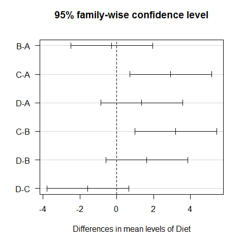

```r
detach(diets)
```
However, the Kruskal-Wallis test should not be regarded as an universal solution, it is primarily intended to solve normality problems. 
It performs better when the distributions have all the same shape, and when there is homogeneity of variance.


```r
kruskal.test(Serum_iron~treatment)
```

```
## 
## 	Kruskal-Wallis rank sum test
## 
## data:  Serum_iron by treatment
## Kruskal-Wallis chi-squared = 24.04, df = 3, p-value = 2.449e-05
```

```r
library(pgirmess)
kruskalmc(Serum_iron~treatment)  #compare with the results of Tukey plot, they are the same
```

```
## Multiple comparison test after Kruskal-Wallis 
## p.value: 0.05 
## Comparisons
##               obs.dif critical.dif difference
## DrugA-DrugB    29.033         23.7       TRUE
## DrugA-DrugC    10.767         23.7      FALSE
## DrugA-placebo   6.667         23.7      FALSE
## DrugB-DrugC    39.800         23.7       TRUE
## DrugB-placebo  35.700         23.7       TRUE
## DrugC-placebo   4.100         23.7      FALSE
```

```r
detach(iron)
```

## hovPlot

The hovPlot( ) function in the HH package provides a graphic test of homogeneity of variances 
based on Brown-Forsyth. Oneway analysis of variance makes the assumption that the variances of the groups are equal.

Example 1  (clearly not homogeneous variances)

```r
# Homogeneity of Variance Plot
library(HH)
```

```
## Warning: package 'HH' was built under R version 3.0.3
```

```
## Loading required package: lattice
```

```
## Warning: package 'lattice' was built under R version 3.0.3
```

```
## Loading required package: grid
## Loading required package: latticeExtra
```

```
## Warning: package 'latticeExtra' was built under R version 3.0.3
```

```
## Loading required package: RColorBrewer
## Loading required package: multcomp
```

```
## Warning: package 'multcomp' was built under R version 3.0.3
```

```
## Loading required package: mvtnorm
```

```
## Warning: package 'mvtnorm' was built under R version 3.0.3
```

```
## Loading required package: survival
## Loading required package: splines
## Loading required package: TH.data
```

```
## Warning: package 'TH.data' was built under R version 3.0.3
```

```r
boxplot(count ~ spray,data = InsectSprays)
```

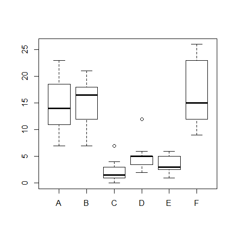

```r
hov(count ~ spray, data = InsectSprays)
```

```
## 
## 	hov: Brown-Forsyth
## 
## data:  count
## F = 3.821, df:spray = 5, df:Residuals = 66, p-value = 0.004223
## alternative hypothesis: variances are not identical
```

```r
hovPlot(count ~ spray, data = InsectSprays) 
```


Example 2  (homogeneous variances)

```r
data(turkey)
head(turkey)
```

```
##      diet wt.gain
## 1 control     4.1
## 2 control     3.3
## 3 control     3.1
## 4 control     4.2
## 5 control     3.6
## 6 control     4.4
```

```r
boxplot(wt.gain ~ diet, data=turkey)
```

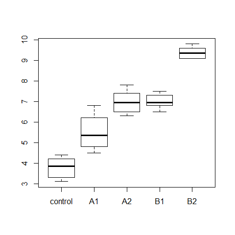

```r
model3=aov(wt.gain ~ diet, data=turkey)
summary(model3)
```

```
##             Df Sum Sq Mean Sq F value  Pr(>F)    
## diet         4  103.0   25.76    81.7 5.6e-14 ***
## Residuals   25    7.9    0.32                    
## ---
## Signif. codes:  0 '***' 0.001 '**' 0.01 '*' 0.05 '.' 0.1 ' ' 1
```

```r
par(mfrow=c(2,2))
plot(model3)
```

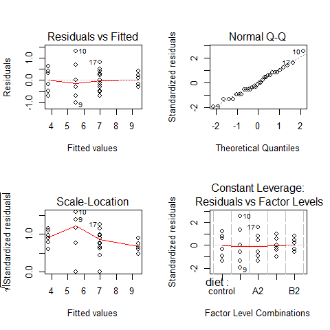

```r
par(mfrow=c(1,1))

hov(wt.gain ~ diet, data=turkey)
```

```
## 
## 	hov: Brown-Forsyth
## 
## data:  wt.gain
## F = 2.226, df:diet = 4, df:Residuals = 25, p-value = 0.09506
## alternative hypothesis: variances are not identical
```

```r
hovPlot(wt.gain ~ diet, data=turkey)
```


```r
#compare it with the example1 plot 
hovPlot(count ~ spray, data = InsectSprays) 
```

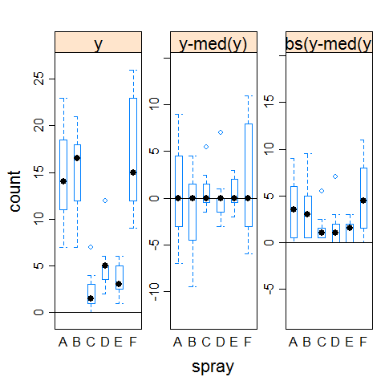

## Contrasts in ANOVA

1) Treatment contrasts in ANOVA using summary.lm instead of summary()

When the design consists of a control condition and several treatments, or when there is a distinct baseline condition to which the other groups can be logically compared, then treatment constrasts offers a mechanism to visualize the treatment effects. 


```r
attach(PlantGrowth)
summary(PlantGrowth)
```

```
##      weight      group   
##  Min.   :3.59   ctrl:10  
##  1st Qu.:4.55   trt1:10  
##  Median :5.16   trt2:10  
##  Mean   :5.07            
##  3rd Qu.:5.53            
##  Max.   :6.31
```

```r
boxplot(weight ~ group)
```

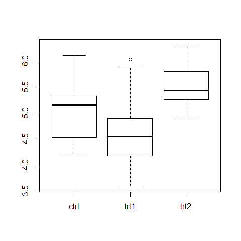

```r
bartlett.test(weight ~ group)
```

```
## 
## 	Bartlett test of homogeneity of variances
## 
## data:  weight by group
## Bartlett's K-squared = 2.879, df = 2, p-value = 0.2371
```

```r
results =  aov(weight ~ group)
summary.aov(results)  #classical approach
```

```
##             Df Sum Sq Mean Sq F value Pr(>F)  
## group        2   3.77   1.883    4.85  0.016 *
## Residuals   27  10.49   0.389                 
## ---
## Signif. codes:  0 '***' 0.001 '**' 0.01 '*' 0.05 '.' 0.1 ' ' 1
```

```r
TukeyHSD(results) #classical approach
```

```
##   Tukey multiple comparisons of means
##     95% family-wise confidence level
## 
## Fit: aov(formula = weight ~ group)
## 
## $group
##             diff     lwr    upr  p adj
## trt1-ctrl -0.371 -1.0622 0.3202 0.3909
## trt2-ctrl  0.494 -0.1972 1.1852 0.1980
## trt2-trt1  0.865  0.1738 1.5562 0.0120
```

```r
plot(TukeyHSD(results))
```

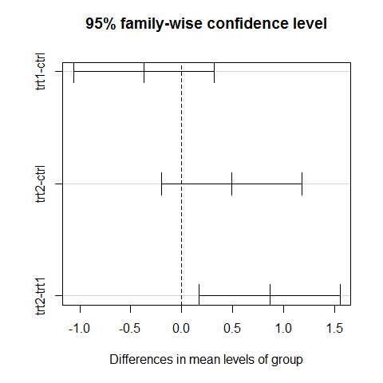

```r
summary.lm(results)
```

```
## 
## Call:
## aov(formula = weight ~ group)
## 
## Residuals:
##    Min     1Q Median     3Q    Max 
## -1.071 -0.418 -0.006  0.263  1.369 
## 
## Coefficients:
##             Estimate Std. Error t value Pr(>|t|)    
## (Intercept)    5.032      0.197   25.53   <2e-16 ***
## grouptrt1     -0.371      0.279   -1.33    0.194    
## grouptrt2      0.494      0.279    1.77    0.088 .  
## ---
## Signif. codes:  0 '***' 0.001 '**' 0.01 '*' 0.05 '.' 0.1 ' ' 1
## 
## Residual standard error: 0.623 on 27 degrees of freedom
## Multiple R-squared:  0.264,	Adjusted R-squared:  0.21 
## F-statistic: 4.85 on 2 and 27 DF,  p-value: 0.0159
```

```r
detach(PlantGrowth)
```

The treatment contrasts are in the Coefficients table. The estimated coefficient for the Intercept is the mean of the baseline or control group. But if the final aim is to do all the possible comparisons anyway, the better solution is to use the Tukey's HSD test, which controls the experimentwise error rate.


2) More on contrasts - controlling the significance in multiple comparisons

The following example concerns the yield of fungus gathered from 16 different habitats:

```r
data <- read.delim("Z:/GitHub/RMarkdowns - Stat with R/6_ANOVA/Fungi.txt")
attach(data)
```

First we establish whether there is any variation in fungus yield to explain:

```r
model <- aov(Fugus.yield~Habitat)
summary(model)
```

```
##              Df Sum Sq Mean Sq F value Pr(>F)    
## Habitat      15   7527     502    72.1 <2e-16 ***
## Residuals   144   1002       7                   
## ---
## Signif. codes:  0 '***' 0.001 '**' 0.01 '*' 0.05 '.' 0.1 ' ' 1
```

There is (p < 0.000 001). 
But this is not too interesting, because it just shows that some habitats produce more fungus than others. We are interested in which habitats produce significantly more fungi than others. 
Multiple comparisons can be an issue since there are 16 habitats (16 × 15)/2 = 120 possible pairwise comparisons. 

There are two options:


```r
TukeyHSD(model)
```

```
##   Tukey multiple comparisons of means
##     95% family-wise confidence level
## 
## Fit: aov(formula = Fugus.yield ~ Habitat)
## 
## $Habitat
##                        diff       lwr      upr  p adj
## Ash-Alder           3.53293  -0.58081   7.6467 0.1844
## Aspen-Alder        12.78574   8.67201  16.8995 0.0000
## Beech-Alder        12.32365   8.20992  16.4374 0.0000
## Birch-Alder        14.11348   9.99974  18.2272 0.0000
## Cherry-Alder       10.29509   6.18135  14.4088 0.0000
## Chestnut-Alder     12.24108   8.12734  16.3548 0.0000
## Holmoak-Alder      -1.44361  -5.55734   2.6701 0.9976
## Hornbeam-Alder     10.60271   6.48897  14.7164 0.0000
## Lime-Alder         19.19458  15.08084  23.3083 0.0000
## Oak-Alder          20.29457  16.18084  24.4083 0.0000
## Pine-Alder         14.34085  10.22711  18.4546 0.0000
## Rowan-Alder         6.29495   2.18121  10.4087 0.0000
## Spruce-Alder       -2.15119  -6.26493   1.9625 0.9037
## Sycamore-Alder      2.80900  -1.30474   6.9227 0.5645
## Willow-Alder        2.77635  -1.33739   6.8901 0.5849
## Aspen-Ash           9.25282   5.13908  13.3666 0.0000
## Beech-Ash           8.79073   4.67699  12.9045 0.0000
## Birch-Ash          10.58055   6.46682  14.6943 0.0000
## Cherry-Ash          6.76216   2.64842  10.8759 0.0000
## Chestnut-Ash        8.70815   4.59441  12.8219 0.0000
## Holmoak-Ash        -4.97653  -9.09027  -0.8628 0.0043
## Hornbeam-Ash        7.06978   2.95605  11.1835 0.0000
## Lime-Ash           15.66165  11.54792  19.7754 0.0000
## Oak-Ash            16.76165  12.64791  20.8754 0.0000
## Pine-Ash           10.80792   6.69418  14.9217 0.0000
## Rowan-Ash           2.76202  -1.35171   6.8758 0.5938
## Spruce-Ash         -5.68412  -9.79786  -1.5704 0.0004
## Sycamore-Ash       -0.72393  -4.83766   3.3898 1.0000
## Willow-Ash         -0.75658  -4.87031   3.3572 1.0000
## Beech-Aspen        -0.46209  -4.57583   3.6516 1.0000
## Birch-Aspen         1.32774  -2.78600   5.4415 0.9990
## Cherry-Aspen       -2.49066  -6.60439   1.6231 0.7546
## Chestnut-Aspen     -0.54467  -4.65840   3.5691 1.0000
## Holmoak-Aspen     -14.22935 -18.34309 -10.1156 0.0000
## Hornbeam-Aspen     -2.18303  -6.29677   1.9307 0.8930
## Lime-Aspen          6.40884   2.29510  10.5226 0.0000
## Oak-Aspen           7.50883   3.39509  11.6226 0.0000
## Pine-Aspen          1.55510  -2.55863   5.6688 0.9946
## Rowan-Aspen        -6.49079 -10.60453  -2.3771 0.0000
## Spruce-Aspen      -14.93694 -19.05068 -10.8232 0.0000
## Sycamore-Aspen     -9.97674 -14.09048  -5.8630 0.0000
## Willow-Aspen      -10.00939 -14.12313  -5.8957 0.0000
## Birch-Beech         1.78983  -2.32391   5.9036 0.9788
## Cherry-Beech       -2.02857  -6.14230   2.0852 0.9382
## Chestnut-Beech     -0.08257  -4.19631   4.0312 1.0000
## Holmoak-Beech     -13.76726 -17.88100  -9.6535 0.0000
## Hornbeam-Beech     -1.72094  -5.83468   2.3928 0.9853
## Lime-Beech          6.87093   2.75719  10.9847 0.0000
## Oak-Beech           7.97092   3.85718  12.0847 0.0000
## Pine-Beech          2.01719  -2.09654   6.1309 0.9409
## Rowan-Beech        -6.02870 -10.14244  -1.9150 0.0001
## Spruce-Beech      -14.47485 -18.58859 -10.3611 0.0000
## Sycamore-Beech     -9.51465 -13.62839  -5.4009 0.0000
## Willow-Beech       -9.54730 -13.66104  -5.4336 0.0000
## Cherry-Birch       -3.81839  -7.93213   0.2953 0.1011
## Chestnut-Birch     -1.87240  -5.98614   2.2413 0.9682
## Holmoak-Birch     -15.55709 -19.67082 -11.4433 0.0000
## Hornbeam-Birch     -3.51077  -7.62451   0.6030 0.1925
## Lime-Birch          5.08110   0.96736   9.1948 0.0031
## Oak-Birch           6.18109   2.06735  10.2948 0.0001
## Pine-Birch          0.22737  -3.88637   4.3411 1.0000
## Rowan-Birch        -7.81853 -11.93227  -3.7048 0.0000
## Spruce-Birch      -16.26468 -20.37841 -12.1509 0.0000
## Sycamore-Birch    -11.30448 -15.41822  -7.1907 0.0000
## Willow-Birch      -11.33713 -15.45087  -7.2234 0.0000
## Chestnut-Cherry     1.94599  -2.16775   6.0597 0.9559
## Holmoak-Cherry    -11.73869 -15.85243  -7.6250 0.0000
## Hornbeam-Cherry     0.30762  -3.80611   4.4214 1.0000
## Lime-Cherry         8.89949   4.78576  13.0132 0.0000
## Oak-Cherry          9.99949   5.88575  14.1132 0.0000
## Pine-Cherry         4.04576  -0.06798   8.1595 0.0592
## Rowan-Cherry       -4.00014  -8.11387   0.1136 0.0662
## Spruce-Cherry     -12.44628 -16.56002  -8.3325 0.0000
## Sycamore-Cherry    -7.48609 -11.59982  -3.3723 0.0000
## Willow-Cherry      -7.51874 -11.63247  -3.4050 0.0000
## Holmoak-Chestnut  -13.68468 -17.79842  -9.5709 0.0000
## Hornbeam-Chestnut  -1.63837  -5.75211   2.4754 0.9909
## Lime-Chestnut       6.95350   2.83977  11.0672 0.0000
## Oak-Chestnut        8.05349   3.93976  12.1672 0.0000
## Pine-Chestnut       2.09977  -2.01397   6.2135 0.9194
## Rowan-Chestnut     -5.94613 -10.05986  -1.8324 0.0002
## Spruce-Chestnut   -14.39227 -18.50601 -10.2785 0.0000
## Sycamore-Chestnut  -9.43208 -13.54582  -5.3183 0.0000
## Willow-Chestnut    -9.46473 -13.57846  -5.3510 0.0000
## Hornbeam-Holmoak   12.04632   7.93258  16.1601 0.0000
## Lime-Holmoak       20.63819  16.52445  24.7519 0.0000
## Oak-Holmoak        21.73818  17.62444  25.8519 0.0000
## Pine-Holmoak       15.78445  11.67072  19.8982 0.0000
## Rowan-Holmoak       7.73856   3.62482  11.8523 0.0000
## Spruce-Holmoak     -0.70759  -4.82133   3.4061 1.0000
## Sycamore-Holmoak    4.25261   0.13887   8.3663 0.0350
## Willow-Holmoak      4.21996   0.10622   8.3337 0.0381
## Lime-Hornbeam       8.59187   4.47813  12.7056 0.0000
## Oak-Hornbeam        9.69186   5.57813  13.8056 0.0000
## Pine-Hornbeam       3.73814  -0.37560   7.8519 0.1207
## Rowan-Hornbeam     -4.30776  -8.42150  -0.1940 0.0302
## Spruce-Hornbeam   -12.75391 -16.86764  -8.6402 0.0000
## Sycamore-Hornbeam  -7.79371 -11.90745  -3.6800 0.0000
## Willow-Hornbeam    -7.82636 -11.94010  -3.7126 0.0000
## Oak-Lime            1.09999  -3.01375   5.2137 0.9999
## Pine-Lime          -4.85373  -8.96747  -0.7400 0.0063
## Rowan-Lime        -12.89963 -17.01337  -8.7859 0.0000
## Spruce-Lime       -21.34578 -25.45951 -17.2320 0.0000
## Sycamore-Lime     -16.38558 -20.49932 -12.2718 0.0000
## Willow-Lime       -16.41823 -20.53197 -12.3045 0.0000
## Pine-Oak           -5.95373 -10.06746  -1.8400 0.0001
## Rowan-Oak         -13.99962 -18.11336  -9.8859 0.0000
## Spruce-Oak        -22.44577 -26.55951 -18.3320 0.0000
## Sycamore-Oak      -17.48557 -21.59931 -13.3718 0.0000
## Willow-Oak        -17.51822 -21.63196 -13.4045 0.0000
## Rowan-Pine         -8.04589 -12.15963  -3.9322 0.0000
## Spruce-Pine       -16.49204 -20.60578 -12.3783 0.0000
## Sycamore-Pine     -11.53185 -15.64558  -7.4181 0.0000
## Willow-Pine       -11.56450 -15.67823  -7.4508 0.0000
## Spruce-Rowan       -8.44615 -12.55988  -4.3324 0.0000
## Sycamore-Rowan     -3.48595  -7.59969   0.6278 0.2019
## Willow-Rowan       -3.51860  -7.63234   0.5951 0.1896
## Sycamore-Spruce     4.96020   0.84646   9.0739 0.0045
## Willow-Spruce       4.92755   0.81381   9.0413 0.0050
## Willow-Sycamore    -0.03265  -4.14639   4.0811 1.0000
```

```r
plot(TukeyHSD(model))
```

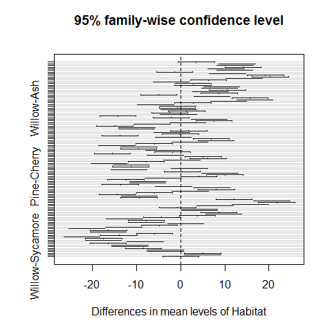
Habitats on opposite sides of the dotted line and not overlapping it are significantly different one from another.

Alternatively, it is possible to use the pairwise.t.test function in which we specify the response variable,
and then the categorical explanatory variable containing the factorlevels we want to compare, separated
by a comma:


```r
pairwise.t.test(Fugus.yield,Habitat)
```

```
## 
## 	Pairwise comparisons using t tests with pooled SD 
## 
## data:  Fugus.yield and Habitat 
## 
##          Alder   Ash     Aspen   Beech   Birch   Cherry  Chestnut Holmoak
## Ash      0.10011 -       -       -       -       -       -        -      
## Aspen    < 2e-16 6.3e-11 -       -       -       -       -        -      
## Beech    < 2e-16 5.4e-10 1.00000 -       -       -       -        -      
## Birch    < 2e-16 1.2e-13 1.00000 1.00000 -       -       -        -      
## Cherry   4.7e-13 2.9e-06 0.87474 1.00000 0.04943 -       -        -      
## Chestnut < 2e-16 7.8e-10 1.00000 1.00000 1.00000 1.00000 -        -      
## Holmoak  1.00000 0.00181 < 2e-16 < 2e-16 < 2e-16 3.9e-16 < 2e-16  -      
## Hornbeam 1.1e-13 8.6e-07 1.00000 1.00000 0.10057 1.00000 1.00000  < 2e-16
## Lime     < 2e-16 < 2e-16 1.1e-05 1.9e-06 0.00131 3.3e-10 1.4e-06  < 2e-16
## Oak      < 2e-16 < 2e-16 1.4e-07 2.0e-08 2.7e-05 1.9e-12 1.5e-08  < 2e-16
## Pine     < 2e-16 3.9e-14 1.00000 1.00000 1.00000 0.02757 1.00000  < 2e-16
## Rowan    1.8e-05 0.51826 8.5e-06 4.7e-05 3.9e-08 0.03053 6.2e-05  5.3e-08
## Spruce   1.00000 0.00016 < 2e-16 < 2e-16 < 2e-16 < 2e-16 < 2e-16  1.00000
## Sycamore 0.50084 1.00000 2.1e-12 1.9e-11 3.3e-15 1.5e-07 2.7e-11  0.01586
## Willow   0.51826 1.00000 1.9e-12 1.6e-11 2.8e-15 1.4e-07 2.4e-11  0.01702
##          Hornbeam Lime    Oak     Pine    Rowan   Spruce  Sycamore
## Ash      -        -       -       -       -       -       -       
## Aspen    -        -       -       -       -       -       -       
## Beech    -        -       -       -       -       -       -       
## Birch    -        -       -       -       -       -       -       
## Cherry   -        -       -       -       -       -       -       
## Chestnut -        -       -       -       -       -       -       
## Holmoak  -        -       -       -       -       -       -       
## Hornbeam -        -       -       -       -       -       -       
## Lime     1.3e-09  -       -       -       -       -       -       
## Oak      8.4e-12  1.00000 -       -       -       -       -       
## Pine     0.05975  0.00253 6.1e-05 -       -       -       -       
## Rowan    0.01380  < 2e-16 < 2e-16 1.5e-08 -       -       -       
## Spruce   < 2e-16  < 2e-16 < 2e-16 < 2e-16 2.5e-09 -       -       
## Sycamore 4.2e-08  < 2e-16 < 2e-16 1.1e-15 0.10218 0.00187 -       
## Willow   3.8e-08  < 2e-16 < 2e-16 9.3e-16 0.10057 0.00203 1.00000 
## 
## P value adjustment method: holm
```
The default method of adjustment of the p values is holm, but other adjustment methods include
hochberg, hommel, bonferroni, BH, BY, fdr and none. 

## Factorial ANOVA

A factorial experiment has two or more factors, each with two or more levels, plus replication for each combination of factors levels. 
This means that we can investigate statistical interactions, in which the response to one factor depends on the level of another factor. 

Our example comes from a farm-scale trial of animal diets. There are two factors: diet and supplement. Diet is a factor with three levels: barley, oats and wheat.
Supplement is a factor with four levels: agrimore, control, supergain and supersupp. The response variable is
weight gain after 6 weeks.

```r
weight <- read.delim("Z:/GitHub/RMarkdowns - Stat with R/6_ANOVA/growth.txt")
```

Tools for data exploration

```r
# attach(weight)
# replications(gain ~ diet * supplement, data=weight)  #this shows that the design is fully balanced
# 
# #try to unbalance the design
# replications(gain ~ diet * supplement,data=weight[1:40,])
# 
# boxplot(gain ~ diet + supplement, ylab="Weight gain" )
# 
# #interaction plot
# interaction.plot(diet, supplement,                 #x.factor=diet, trace.factor=supplement,response=gain
#                      gain, fun=mean, type="b", legend=T,  #type b plots either lines and points
#                      ylab="Weight gain", main="Interaction Plot",
#                      pch=c(1,19))
# 
# coplot(gain ~ diet | supplement, data = weight, panel = panel.smooth,
#        xlab = "Weight gain data: diet vs gain, given type of supplement")
# 
# plot.design(gain ~ diet * supplement, data=ToothGrowth)
```


```r
# barplot(tapply(gain,list(diet,supplement),mean), 
#         beside=T,ylim=c(0,30),col=c("orange","yellow","cornsilk"))   #(note the use of beside=T to get the bars in adjacent clusters rather than vertical stacks
# 
# labs <- c("Barley","Oats","Wheat")
# legend(3,29,labs,fill= c("orange","yellow","cornsilk"))
# #legend(locator(1),labs,fill= c("orange","yellow","cornsilk"))
# 
# tapply(gain,list(diet,supplement),mean)
```

We use either lm and aov to run a a factorial analysis of variance

```r
# model <- aov(gain~diet*supplement)
# summary(model)
```
No hint about a role of the interaction. 

Model simplification

```r
# model <- aov(gain~diet+supplement)
# 
# par(mfrow=c(1,2))
# boxplot(gain~diet); boxplot(gain~supplement)
# par(mfrow=c(1,1))
# 
# summary(model)
```

The disadvantage of the ANOVA table is that it does not show us the effect sizes. Let's check the summary.lm


```r
# summary.lm(model)
```


```r
library(effects) # explore the library(effects) and make sure you know which model classes you can deal with
```

```
## Warning: package 'effects' was built under R version 3.0.3
```

```r
plot(allEffects(model))  
```

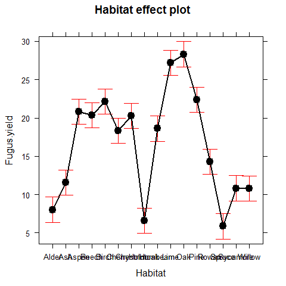

## Pseudoreplication: Nested designs and split plots

The model-fitting functions aov, lme and lmer have the ease to deal with complicated error structures, and
it is important to be able to recognize such error structures, and hence avoid the pitfalls of pseudoreplication.

There are two general cases:

1) split-plot analysis, when designed experiments have different treatments applied to plots of different
sizes 

2) nested sampling, when repeated measurements are taken from the same individual, or observational
studies are conducted at several different spatial scales (mostly random effects);


### Split-plot experiments

In a split-plot experiment, different treatments are applied to plots of different sizes. Each different plot size
is associated with its own error variance, so instead of having one error variance (as in all the ANOVA tables
up to this point), we have as many error terms as there are different plot sizes. The analysis is presented as a
series of component ANOVA tables, one for each plot size, in a hierarchy from the largest plot size with the
lowest replication at the top, down to the smallest plot size with the greatest replication at the bottom.


The following example refers to a designed field experiment on crop yield with three treatments: irrigation
(with two levels, irrigated or not), sowing density (with three levels, low, medium and high), and fertilizer
application (with three levels, low, medium and high).

```r
yields <- read.delim("Z:/GitHub/RMarkdowns - Stat with R/6_ANOVA/splityield.txt")
attach(yields)
names(yields)
```

```
## [1] "yield"      "block"      "irrigation" "density"    "fertilizer"
```

```r
head(yields)
```

```
##   yield block irrigation density fertilizer
## 1    90     A    control     low          N
## 2    95     A    control     low          P
## 3   107     A    control     low         NP
## 4    92     A    control  medium          N
## 5    89     A    control  medium          P
## 6    92     A    control  medium         NP
```

```r
summary(yields)
```

```
##      yield       block      irrigation   density   fertilizer
##  Min.   : 60.0   A:18   control  :36   high  :24   N :24     
##  1st Qu.: 86.0   B:18   irrigated:36   low   :24   NP:24     
##  Median : 95.0   C:18                  medium:24   P :24     
##  Mean   : 99.7   D:18                                        
##  3rd Qu.:114.0                                               
##  Max.   :136.0
```
level 1 -> 4 blocks
level 2 -> irrigation (each half of a block)
level 3 -> seed-sowing densities (in each 1/3 of irrigation splits)
level 4-> each density plot was split into 3, and one of the fertilizer nutrient treatment N, P, N and P together (only one of the )


```r
model =aov(yield~irrigation*density*fertilizer+Error(block/irrigation/density)) #Note that the smallest plot size, fertilizer, does not need to appear in the Error term
summary(model)
```

```
## 
## Error: block
##           Df Sum Sq Mean Sq F value Pr(>F)
## Residuals  3    194    64.8               
## 
## Error: block:irrigation
##            Df Sum Sq Mean Sq F value Pr(>F)  
## irrigation  1   8278    8278    17.6  0.025 *
## Residuals   3   1412     471                 
## ---
## Signif. codes:  0 '***' 0.001 '**' 0.01 '*' 0.05 '.' 0.1 ' ' 1
## 
## Error: block:irrigation:density
##                    Df Sum Sq Mean Sq F value Pr(>F)  
## density             2   1758     879    3.78  0.053 .
## irrigation:density  2   2747    1374    5.91  0.016 *
## Residuals          12   2788     232                 
## ---
## Signif. codes:  0 '***' 0.001 '**' 0.01 '*' 0.05 '.' 0.1 ' ' 1
## 
## Error: Within
##                               Df Sum Sq Mean Sq F value  Pr(>F)    
## fertilizer                     2   1977     989   11.45 0.00014 ***
## irrigation:fertilizer          2    953     477    5.52 0.00811 ** 
## density:fertilizer             4    305      76    0.88 0.48405    
## irrigation:density:fertilizer  4    235      59    0.68 0.61067    
## Residuals                     36   3109      86                    
## ---
## Signif. codes:  0 '***' 0.001 '**' 0.01 '*' 0.05 '.' 0.1 ' ' 1
```

It is possible to see the four ANOVA tables, one for each plot size: blocks are the biggest plots, half blocks
get the irrigation treatment, one third of each half block gets a sowing density treatment, and one third of a
sowing density treatment gets each fertilizer treatment. Note that the non-significant main effect for density
(p = 0.053) does not mean that density is unimportant, because density appears in a significant interaction
with irrigation (the density terms cancel out, when averaged over the two irrigation treatments; see below).

The best way to understand the two significant interaction terms is to plot them using interaction.plot:

```r
interaction.plot(fertilizer,irrigation,yield)
```

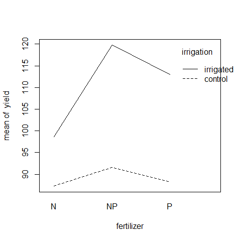

Irrigation increases yield proportionately more on the N-fertilized plots than on the P-fertilized plots. The
irrigation-density interaction is more complicated:


```r
interaction.plot(density,irrigation,yield)
```

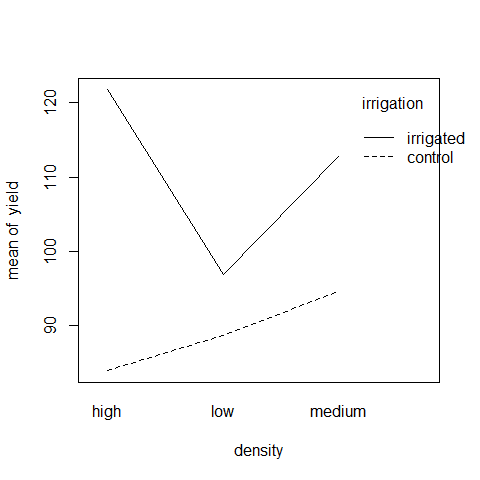
On the irrigated plots, yield is lowest on the low-density plots, but on control plots yield is lowest on the high-density plots. 

## Effect sizes in ANOVA: aov or lm?

The difference between lm and aov is mainly in the output form: 
The summary table with aov is in the traditional form for the analysis of variance, with one row for each categorical variable and each interaction term. 
On the other hand, the summary table for lm produces one row per estimated parameter (i.e. one
row for each factor level and one row for each interaction level). 
If there are multiple error terms (spatial pseudoreplication) then an aov approach must be used because lm does not support the Error term.

Here is a three-way analysis of variance fittdtted firstrst using aov first and lm after:

```r
daphnia <- read.delim("Z:/GitHub/RMarkdowns - Stat with R/6_ANOVA/daphnia.txt")
attach(daphnia)
names(daphnia)
```

```
## [1] "Growth.rate" "Water"       "Detergent"   "Daphnia"
```

```r
model1 <- aov(Growth.rate~Water*Detergent*Daphnia)
summary(model1)
```

```
##                         Df Sum Sq Mean Sq F value  Pr(>F)    
## Water                    1    2.0    1.99    2.85 0.09784 .  
## Detergent                3    2.2    0.74    1.06 0.37548    
## Daphnia                  2   39.2   19.59   28.13 8.2e-09 ***
## Water:Detergent          3    0.2    0.06    0.08 0.96861    
## Water:Daphnia            2   13.7    6.87    9.86 0.00026 ***
## Detergent:Daphnia        6   20.6    3.43    4.93 0.00053 ***
## Water:Detergent:Daphnia  6    5.8    0.97    1.40 0.23432    
## Residuals               48   33.4    0.70                    
## ---
## Signif. codes:  0 '***' 0.001 '**' 0.01 '*' 0.05 '.' 0.1 ' ' 1
```

All three factors are likely to stay in the model because every of them is involved in at least one significant interaction.
We must not be misled by the apparently non-significant main effect for detergent. The three-way interaction
is clearly non-significant and can be deleted (p = 0.234). 

Here is the output from the same analysis using the linear model function:


```r
model2 <- lm(Growth.rate~Water*Detergent*Daphnia)
summary(model2)
```

```
## 
## Call:
## lm(formula = Growth.rate ~ Water * Detergent * Daphnia)
## 
## Residuals:
##     Min      1Q  Median      3Q     Max 
## -1.4882 -0.5440  0.0239  0.3560  1.5250 
## 
## Coefficients:
##                                         Estimate Std. Error t value
## (Intercept)                               2.8113     0.4818    5.83
## WaterWear                                -0.1581     0.6814   -0.23
## DetergentBrandB                          -0.0354     0.6814   -0.05
## DetergentBrandC                           0.4763     0.6814    0.70
## DetergentBrandD                          -0.2141     0.6814   -0.31
## DaphniaClone2                             0.4964     0.6814    0.73
## DaphniaClone3                             2.0553     0.6814    3.02
## WaterWear:DetergentBrandB                 0.4646     0.9636    0.48
## WaterWear:DetergentBrandC                -0.2743     0.9636   -0.28
## WaterWear:DetergentBrandD                 0.2173     0.9636    0.23
## WaterWear:DaphniaClone2                   1.3808     0.9636    1.43
## WaterWear:DaphniaClone3                   0.4316     0.9636    0.45
## DetergentBrandB:DaphniaClone2             0.9189     0.9636    0.95
## DetergentBrandC:DaphniaClone2            -0.1634     0.9636   -0.17
## DetergentBrandD:DaphniaClone2             1.0121     0.9636    1.05
## DetergentBrandB:DaphniaClone3            -0.0649     0.9636   -0.07
## DetergentBrandC:DaphniaClone3            -0.8079     0.9636   -0.84
## DetergentBrandD:DaphniaClone3            -1.2867     0.9636   -1.34
## WaterWear:DetergentBrandB:DaphniaClone2  -1.2638     1.3628   -0.93
## WaterWear:DetergentBrandC:DaphniaClone2   1.3561     1.3628    1.00
## WaterWear:DetergentBrandD:DaphniaClone2   0.7762     1.3628    0.57
## WaterWear:DetergentBrandB:DaphniaClone3  -0.8744     1.3628   -0.64
## WaterWear:DetergentBrandC:DaphniaClone3  -1.0302     1.3628   -0.76
## WaterWear:DetergentBrandD:DaphniaClone3  -1.5540     1.3628   -1.14
##                                         Pr(>|t|)    
## (Intercept)                              4.5e-07 ***
## WaterWear                                 0.8175    
## DetergentBrandB                           0.9588    
## DetergentBrandC                           0.4879    
## DetergentBrandD                           0.7547    
## DaphniaClone2                             0.4699    
## DaphniaClone3                             0.0041 ** 
## WaterWear:DetergentBrandB                 0.6319    
## WaterWear:DetergentBrandC                 0.7771    
## WaterWear:DetergentBrandD                 0.8226    
## WaterWear:DaphniaClone2                   0.1584    
## WaterWear:DaphniaClone3                   0.6563    
## DetergentBrandB:DaphniaClone2             0.3451    
## DetergentBrandC:DaphniaClone2             0.8661    
## DetergentBrandD:DaphniaClone2             0.2988    
## DetergentBrandB:DaphniaClone3             0.9466    
## DetergentBrandC:DaphniaClone3             0.4060    
## DetergentBrandD:DaphniaClone3             0.1881    
## WaterWear:DetergentBrandB:DaphniaClone2   0.3584    
## WaterWear:DetergentBrandC:DaphniaClone2   0.3247    
## WaterWear:DetergentBrandD:DaphniaClone2   0.5716    
## WaterWear:DetergentBrandB:DaphniaClone3   0.5241    
## WaterWear:DetergentBrandC:DaphniaClone3   0.4534    
## WaterWear:DetergentBrandD:DaphniaClone3   0.2598    
## ---
## Signif. codes:  0 '***' 0.001 '**' 0.01 '*' 0.05 '.' 0.1 ' ' 1
## 
## Residual standard error: 0.835 on 48 degrees of freedom
## Multiple R-squared:  0.715,	Adjusted R-squared:  0.578 
## F-statistic: 5.23 on 23 and 48 DF,  p-value: 7.02e-07
```

Note that the two significant interactions from the aov table do not show up in the summary.lm table (Water-
Daphnia and Detergent-Daphnia). This is because summary.lm shows treatment contrasts, comparing
everything to the Intercept, rather than orthogonal contrasts. In the aov table, the p values are 'on deletion' p
values, which is a big advantage.

In complicated designed experiments, it is easier to summarize the effect sizes with plot.design and
model.tables functions. 

For main effects:

```r
plot.design(Growth.rate~Water*Detergent*Daphnia)
```

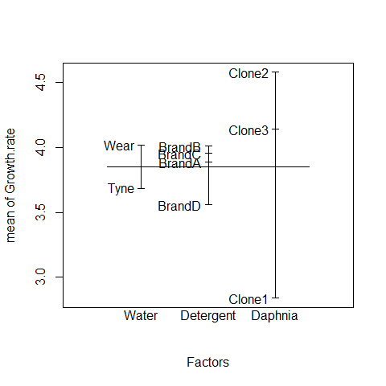

This simple graphical device provides a very clear summary of the three sets of main effects. It is no ideal,
however, at illustrating the interactions. 
The model.tables function takes the name of the fitted model object as its firrst argument, and then it is possible to specify whether we want the standard errors (as we typically would):

Attractive plots of effect sizes can be obtained using the effects library.


```r
library(effects)
plot(allEffects(model2))
```


## ANOVA for repeated measures
This time, we have repeated measures of the same animal, sample sampling unit etc, producing a set of dependent populations.
As long as we have only categorical predictors and balanced designs, it is possible to deal with it using repeated measures ANOVAs

Examples: measures of the same individual before and after the treatment ("client of a psycological clinic"). It is inappropriate to just compare the before and after observations as if they were independent, because they are not. The "after" observations are usually dependent upon the "before" observations and the effect of order. That is, a client who was very anxious at the initial occasion of measurement is likely to be less anxious at subsequent occasions, and because of the selection of clients on the basis of their disturbed psychological state and the change that state over time, our clients (who tended to be more disturbed than usual when they were recruited) will be likely to get somewhat better even if we just tell them to come back in six weeks.


```r
# the aov for repeated measures will take the general form: summary(aov(response~contrasts+Error(ID),mydata))
```

The NON-PARAMETRIC version of the ANOVA for repeated measures is the Friedman test

The next level includes nested and crossed random effects, categorical and/or numerical predictors, unbalanced sample designs, spatial and temporal autocorrelations --->> MIXED-EFFECTS models


