Linear regression
===


# The idea of linear regression

## Simple linear regression


## Multiple linear regression

Multiple linear regression is the term for the situation in which you have multiple predictor variables, but still only one continous response with the same assumptions as before. 

<a href="http://www.youtube.com/watch?v=q1RD5ECsSB0" target="_blank">
<br/ >
Video demonstrating multiple linear regresssion in R
</a>


<<<<<<< HEAD


```r
load("../Data/lung.Rdata")
head(lung)
```

```
##   LungCap Age Height Smoke Gender Caesarean
## 1   6.475   6   62.1    no   male        no
## 2  10.125  18   74.7   yes female        no
## 3   9.550  16   69.7    no female       yes
## 4  11.125  14   71.0    no   male        no
## 5   4.800   5   56.9    no   male        no
## 6   6.225  11   58.7    no female        no
```


Plot the relationship between age and lung capacity

```r
attach(lung)
plot(Age,LungCap,main="Relation between age and lung capacity"
     , col="green",las=1, xlab="Age of the patient", ylab="Lung capacity")
#let's run the linear model
mod=lm(LungCap~Age)
abline(mod,lwd=2,col="grey")
```

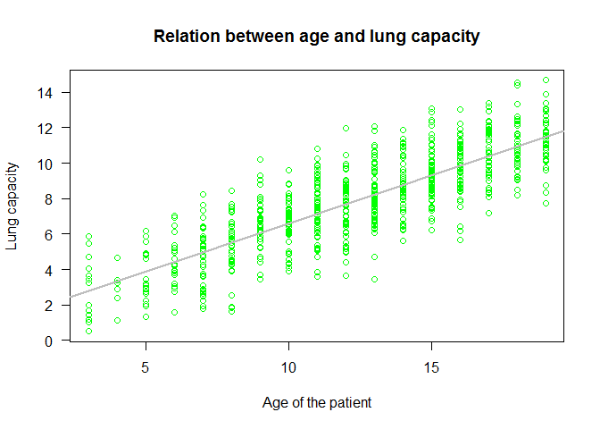 

```r
summary(mod)
=======
# Example1  simple regression 

## The data 


```r
myData <- women
plot(myData)
```

 

## Fit the model 


```r
# Multiple Linear Regression Example
fit <- lm(weight ~ height, data=myData)
```


```r
summary(fit) # show results
>>>>>>> origin/master
```

```
## 
## Call:
<<<<<<< HEAD
## lm(formula = LungCap ~ Age)
## 
## Residuals:
##    Min     1Q Median     3Q    Max 
## -4.780 -1.020  0.000  0.979  4.265 
## 
## Coefficients:
##             Estimate Std. Error t value Pr(>|t|)    
## (Intercept)   1.1469     0.1835    6.25  7.1e-10 ***
## Age           0.5448     0.0142   38.48  < 2e-16 ***
## ---
## Signif. codes:  0 '***' 0.001 '**' 0.01 '*' 0.05 '.' 0.1 ' ' 1
## 
## Residual standard error: 1.53 on 723 degrees of freedom
## Multiple R-squared:  0.672,	Adjusted R-squared:  0.671 
## F-statistic: 1.48e+03 on 1 and 723 DF,  p-value: <2e-16
```

you gotta check:
1) residuals summary
2) estimate for the intercept (null H -> estimate = 0)
3) estimate for the age (slope; null H -> slope = 0 )
4) residual standard error of 1.526 (measure of variation of observations around regression line)
5) R-squared and adjusted R-Squared
6) F-stat (the null hypothesis implies that all estimates are 0)


```r
# to get the full list of attributes
attributes(mod)
```

```
## $names
##  [1] "coefficients"  "residuals"     "effects"       "rank"         
##  [5] "fitted.values" "assign"        "qr"            "df.residual"  
##  [9] "xlevels"       "call"          "terms"         "model"        
## 
## $class
## [1] "lm"
```

```r
#for instance
mod$coefficients
```

```
## (Intercept)         Age 
##      1.1469      0.5448
```

```r
#ls(mod)
mod$fitted.values[1:50]
```

```
##      1      2      3      4      5      6      7      8      9     10 
##  4.416 10.954  9.864  8.775  3.871  7.140  5.506  7.140  9.320  7.140 
##     11     12     13     14     15     16     17     18     19     20 
## 11.499 10.409  7.685  6.595  6.595  8.230  9.320  5.506  7.140  8.775 
##     21     22     23     24     25     26     27     28     29     30 
##  4.416  5.506  9.864  7.140  7.140  7.685  7.685  6.050  3.326 10.954 
##     31     32     33     34     35     36     37     38     39     40 
##  3.326  8.230  8.230  8.230  7.685  6.595  4.416  6.050  7.140 10.409 
##     41     42     43     44     45     46     47     48     49     50 
##  8.775 10.409  5.506  7.685  4.416  7.140  7.140  7.685 10.409  4.961
```

```r
plot(Age,LungCap,main="Relation between age and lung capacity"
     , col="green",las=1, xlab="Age of the patient", ylab="Lung capacity")
abline(mod,lwd=2,col="grey")
points(Age,mod$fitted.values, pch=20, col=2)
```

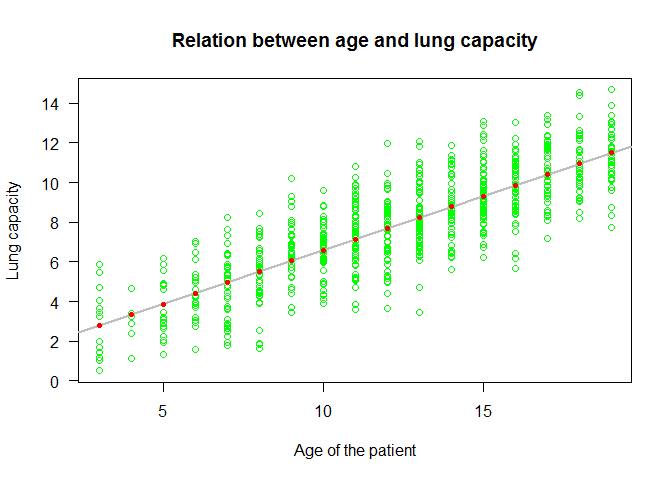 

```r
plot(Age,mod$residuals,pch=20,col="blue" )
abline(h=0, lwd=3)
```

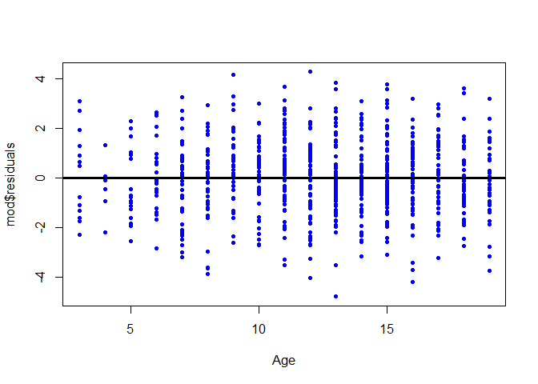 

let's plot the regression line

```r
plot(Age,LungCap,main="Relation between age and lung capacity"
     , col="green",las=1, xlab="Age of the patient", ylab="Lung capacity")
abline(mod,col=2,lwd=4)
=======
## lm(formula = weight ~ height, data = myData)
## 
## Residuals:
##    Min     1Q Median     3Q    Max 
## -1.733 -1.133 -0.383  0.742  3.117 
## 
## Coefficients:
##             Estimate Std. Error t value Pr(>|t|)    
## (Intercept) -87.5167     5.9369   -14.7  1.7e-09 ***
## height        3.4500     0.0911    37.9  1.1e-14 ***
## ---
## Signif. codes:  0 '***' 0.001 '**' 0.01 '*' 0.05 '.' 0.1 ' ' 1
## 
## Residual standard error: 1.53 on 13 degrees of freedom
## Multiple R-squared:  0.991,	Adjusted R-squared:  0.99 
## F-statistic: 1.43e+03 on 1 and 13 DF,  p-value: 1.09e-14
```


## Diagnostics 


```r
layout(matrix(c(1,2,3,4),2,2)) # optional 4 graphs/page
plot(fit)
>>>>>>> origin/master
```

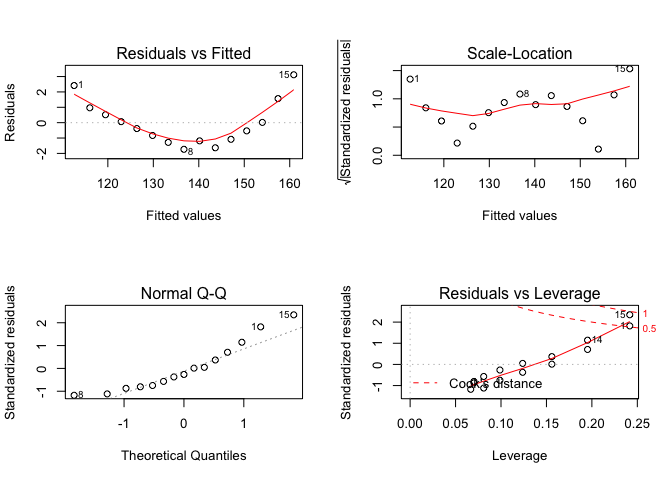 


<<<<<<< HEAD
Easier example to appreciate Residuals and Residual Standard error

```r
x1=c(1,2,3,4,5)
y1=c(1,2,3,100, 200)
plot(x1,y1, xlim=c(0,5), ylim=c(-100,200))
abline(h=0)
mod2=lm(y1~x1); abline(mod2,col=2,lwd=3)
summary(mod2)
```

```
## 
## Call:
## lm(formula = y1 ~ x1)
## 
## Residuals:
##     1     2     3     4     5 
##  39.0  -9.6 -58.2 -10.8  39.6 
## 
## Coefficients:
##             Estimate Std. Error t value Pr(>|t|)  
## (Intercept)    -87.6       49.5   -1.77    0.175  
## x1              49.6       14.9    3.32    0.045 *
## ---
## Signif. codes:  0 '***' 0.001 '**' 0.01 '*' 0.05 '.' 0.1 ' ' 1
## 
## Residual standard error: 47.2 on 3 degrees of freedom
## Multiple R-squared:  0.786,	Adjusted R-squared:  0.715 
## F-statistic:   11 on 1 and 3 DF,  p-value: 0.045
```

```r
points(x1,mod2$fitted.values, pch=20, col="blue",cex=3)
```

 

```r
plot(x1,mod2$residuals,pch=20,col="blue" ); abline(h=0, lwd=3)
```

 

```r
# z are the residuals of my model
z1=c(39.0,-9.6, -58.2, -10.8, 39.6)

#simple function
SumSquares <- function(x) sum(x^2)
SumSquares(z1)  #6685.2
```

```
## [1] 6685
```

```r
#residual standard errors for any linear model
ResSE = function(mymodel) sqrt((sum(mymodel$residuals^2)/ mymodel$df.residual)/length(mymodel$df.residual)) 
ResSE(mod2)
```

```
## [1] 47.21
```

```r
ResSE(mod)
```

```
## [1] 1.526
```

```r
# check the residual standard errors in the model outputs and verify that it is the same. 
```


Time for the model validation: do we meet the main assumptions of the linear regression?

1) Y VALUES (OR THE ERRORS) ARE INDEPENDENT (indipendence)
2) Y VALUES CAN BE EXPRESSED AS A LINEAR FUNCTION OF X (linearity)
3) VARIATION OF OBSERVATIONS AROUND THE REGRESSION LINE
(THE RESIDUAL STANDARD ERROR) IS CONSTANT (homoscedasticity)
4) FOR A GIVEN X VALUE, Y VALUES (OR THE ERRORS) ARE NORMALLY DISTRIBUTED (normality)

In relation to the first assumption, it is important to think about the study design / data collection, if we need to include random effects (see mixed models later on), if we have the potential bias from spatial and temporal autocorrelation. 

All the other assumptions can be checked by examining the residuals


```r
par(mfrow=c(2,2))
plot(mod)
```

 

```r
par(mfrow=c(1,1))
```


TOP-LEFT PLOT
fitted values vs residuals; we should not see patterns here, red line relatively flat

TOP-RIGHT PLOT
normality of residuals check; x axis is the expectation for a normal distribution, y axis observed residuals

BOTTOM-LEFT PLOT
The third plot (bottom left) this plot is similar to the top left, but on a different scale; it shows the square root of the standardized residuals (where all the values are positive) against the fitted values. If there was a problem, such as the variance increasing with the mean, then the points would be distributed inside a triangular shape, with the scatter of the residuals increasing as the fitted values increase. But there is no such pattern here, which is good.

BOTTOM-RIGHT PLOT
This plot shows standardized residuals as a function of
leverage, along with Cook's distance  for each of the observed values of the response
variable. The point of this plot is to highlight those y values that have the biggest effect on the parameter estimate problem when points are close to cook's distance contour'


```r
# more checking on linear model residuals, if we are unhappy with QQplots

shapiro.test(mod$residuals)
```

```
## 
## 	Shapiro-Wilk normality test
## 
## data:  mod$residuals
## W = 0.999, p-value = 0.9614
```

```r
hist(mod$residuals, freq=F,breaks=20)
lines(density(mod$residuals))
```

 


```r
plot(Age,LungCap,main="Relation between age and lung capacity"
     , col="green",las=1, xlab="Age of the patient", ylab="Lung capacity")
abline(mod,lwd=2,col=2)
points(Age[114],LungCap[114],pch=20)
points(Age[293],LungCap[293],pch=20)
```

 

```r
detach(lung)
```
The Lung Capacity linear regression certainly met the assumptions of a linear regression. Are you able to spot a problem then?


```r
load("../Data/problems.RData")
```


```r
attach(problems)
plot(x,y)
mod1=lm(y~x,problems)
abline(mod1,col="red")
```

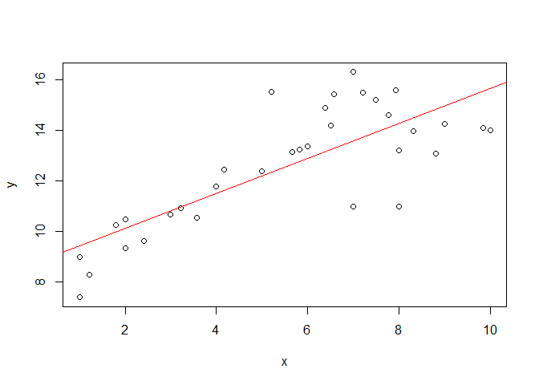 

```r
summary(mod1)
```

```
## 
## Call:
## lm(formula = y ~ x, data = problems)
## 
## Residuals:
##    Min     1Q Median     3Q    Max 
## -3.273 -0.790  0.185  0.846  3.198 
## 
## Coefficients:
##             Estimate Std. Error t value Pr(>|t|)    
## (Intercept)   8.7441     0.6024   14.52  2.3e-15 ***
## x             0.6911     0.0979    7.06  6.3e-08 ***
## ---
## Signif. codes:  0 '***' 0.001 '**' 0.01 '*' 0.05 '.' 0.1 ' ' 1
## 
## Residual standard error: 1.5 on 31 degrees of freedom
## Multiple R-squared:  0.616,	Adjusted R-squared:  0.604 
## F-statistic: 49.8 on 1 and 31 DF,  p-value: 6.32e-08
```


```r
par(mfrow=c(2,2))
plot(mod1)
```

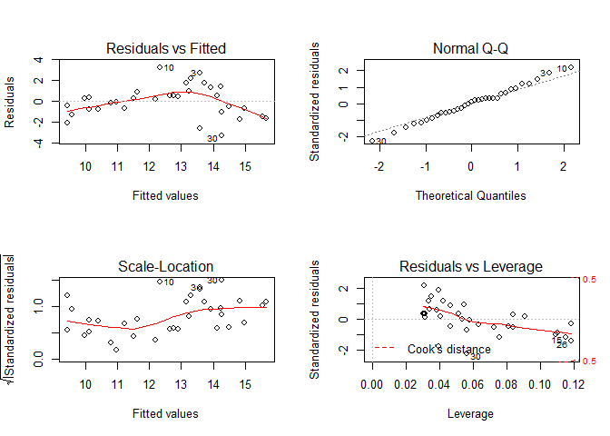 

```r
par(mfrow=c(1,1)) 
```
Assumption of linearity and homoscedasticity (top-left plot) are hardly met in this example.


```r
decay <- read.delim("../Data/Decay.txt")

#The data we examine in this section are on the decay of a biodegradable plastic in soil: the response, y, is the mass of plastic remaining and the explanatory variable, x, is duration of burial

summary(decay)
```

```
##       time          amount     
##  Min.   : 0.0   Min.   :  8.2  
##  1st Qu.: 7.5   1st Qu.: 21.5  
##  Median :15.0   Median : 35.0  
##  Mean   :15.0   Mean   : 42.1  
##  3rd Qu.:22.5   3rd Qu.: 57.5  
##  Max.   :30.0   Max.   :125.0
```

```r
attach(decay)
plot(time,amount)
mod3=lm(amount~time)
abline(mod3,lwd=2,col=2)
```

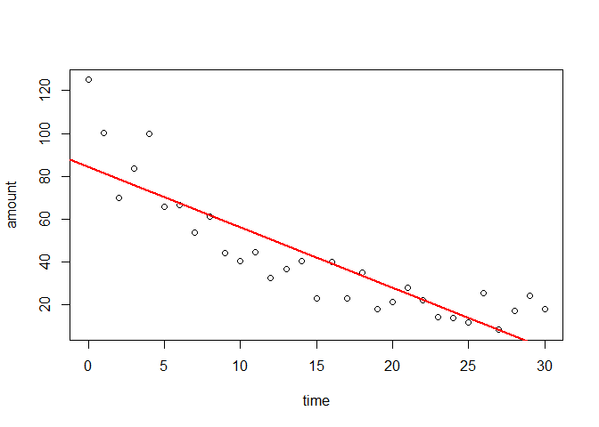 

```r
par(mfrow=c(2,2))
plot(mod3)
```

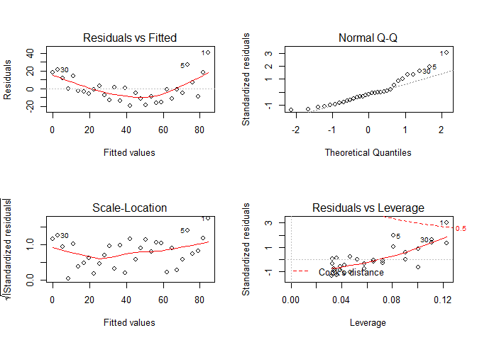 

```r
par(mfrow=c(1,1))


# plot1: 
#you get a plot of the residuals against the fitted values (left plot) which 
#shows very pronounced curvature; most of the residuals for intermediate fitted
#values are negative, and the positive residuals are concentrated at the smallest 
#and largest fitted values. Remember, this plot should look like the sky at 
#night, with no pattern of any sort. This suggests systematic inadequacy 
#in the structure of the model. 

#plot 2 -> few problems 

par(mfrow=c(1,1)) 
shapiro.test(mod3$residuals)
```

```
## 
## 	Shapiro-Wilk normality test
## 
## data:  mod3$residuals
## W = 0.9214, p-value = 0.0257
```

```r
hist(mod3$residuals, freq=F,breaks=20)
lines(density(mod3$residuals))
```

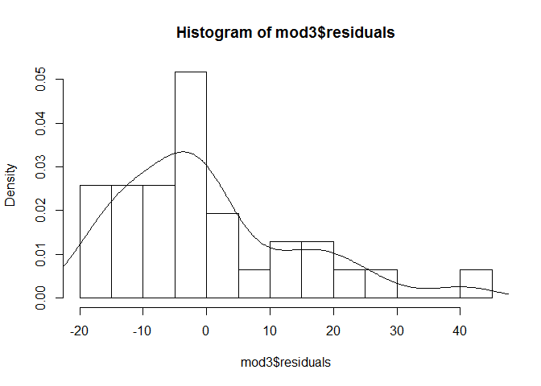 

```r
#The third graph is like a positive-valued version of the first graph; 
#it is good for detecting non-constancy of variance (heteroscedasticity), 
#which shows up as a triangular scatter (like   a wedge of cheese). 
#The fourth graph shows a pronounced pattern in the standardized 
#residuals as a function of the leverage. The graph also shows 
#Cooks distance, highlighting
#the identity of particularly influential data points.

plot(time,amount)
abline(mod3,lwd=2,col=2)
points(time[1],amount[1],pch=20,cex=1.5)
points(time[5],amount[5],pch=20,cex=1.5)
points(time[30],amount[30],pch=20,cex=1.5)

points(time,mod3$fitted.values, pch=20, col="blue")
```

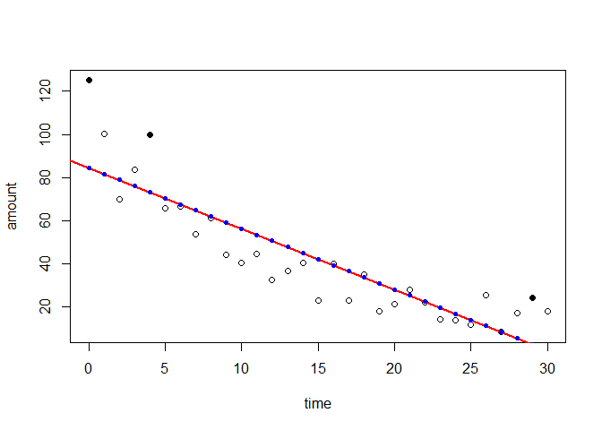 

```r
plot(time,mod3$residuals)
abline(h=0, lwd=3)
points(time[mod3$residuals>=0],mod3$residuals[mod3$residuals>=0],pch=20,col="blue" )
points(time[mod3$residuals<0],mod3$residuals[mod3$residuals<0],pch=20,col="red" )
```

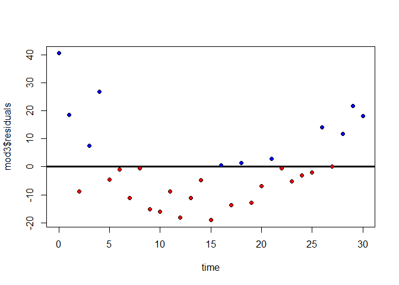 


```r
plot(time,amount) #there is a non-linear trend.. quadratic?

mod4=lm(amount~time+I(time^2))
# abline is no longer working here. 

plot(time,amount)
lines(mod4$fitted.values, type="l", lwd=2,lty=3)
```

 

```r
par(mfrow=c(2,2))
plot(mod4)
```

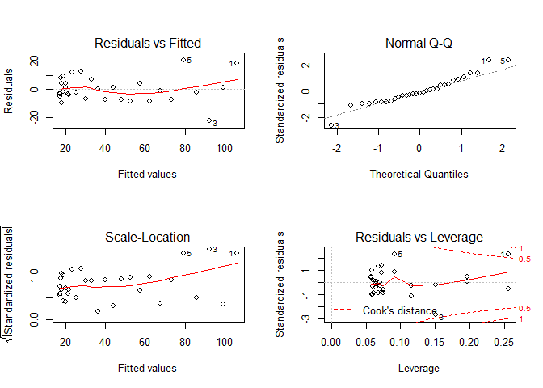 

```r
par(mfrow=c(1,2))

#comparisons mod 3 vs mod4
plot(time,mod3$residuals)
abline(h=0, lwd=3)
points(time[mod3$residuals>=0],mod3$residuals[mod3$residuals>=0],pch=20,col="blue" )
points(time[mod3$residuals<0],mod3$residuals[mod3$residuals<0],pch=20,col="red" )

plot(time,mod4$residuals)
abline(h=0, lwd=3)
points(time[mod4$residuals>=0],mod4$residuals[mod4$residuals>=0],pch=20,col="blue" )
points(time[mod4$residuals<0],mod4$residuals[mod4$residuals<0],pch=20,col="red" )
#influential points
points(time[1],mod4$residuals[5],pch=20,col="yellow" )
points(time[5],mod4$residuals[5],pch=20,col="yellow" )
points(time[3],mod4$residuals[3],pch=20,col="yellow" )
```

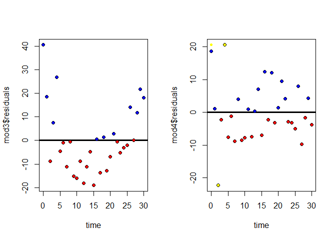 

```r
par(mfrow=c(1,1))
```


```r
plot(time,amount)
mod5=lm(amount~time+I(time^2)+I(time^3))
lines(mod5$fitted.values, type="l", lwd=2,lty=3)
```

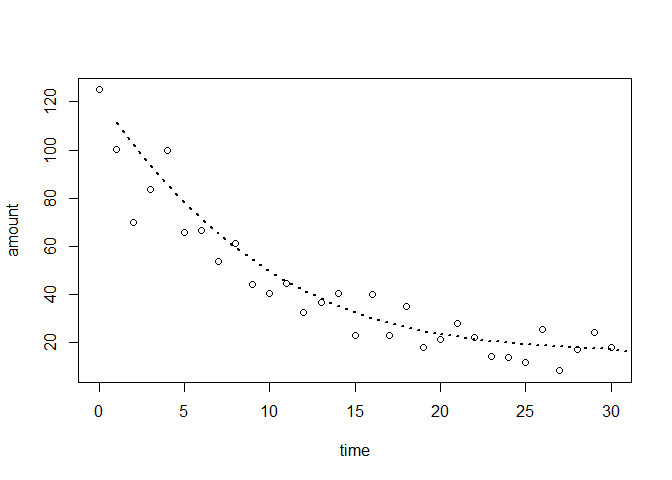 

```r
plot(time,mod5$residuals)
abline(h=0, lwd=3)
points(time[mod5$residuals>=0],mod5$residuals[mod5$residuals>=0],pch=20,col="blue" )
points(time[mod5$residuals<0],mod5$residuals[mod5$residuals<0],pch=20,col="red" )
points(time[1],mod5$residuals[1],pch=20,col="yellow" )
points(time[5],mod5$residuals[5],pch=20,col="yellow" )
```

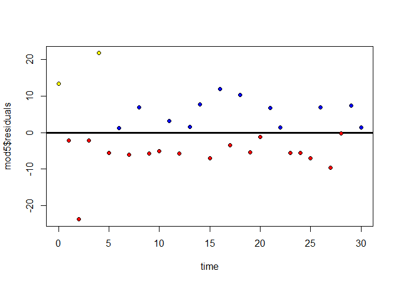 

```r
par(mfrow=c(2,2))
plot(mod5)
```

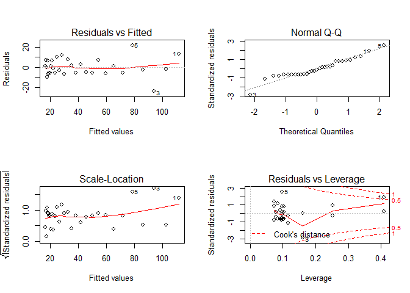 

```r
par(mfrow=c(1,1))

detach(decay)
```


+++++++++++++++++
Edited by Simone Ciuti, University of Freiburg, 9/10/2014; 
Intended for the only purpose of teaching @ Freiburg University; 
Source: 1) Mike Marin Stat - UBC 2)Mick Crawley - The R Book, 2nd edition. 3) Simone Ciuti simulated data 
+++++++++++++++++++++++++++++++++++++++++++++++++
=======


```r
# Other useful functions
coefficients(fit) # model coefficients
```

```
## (Intercept)      height 
##      -87.52        3.45
```

```r
confint(fit, level=0.95) # CIs for model parameters
```

```
##                2.5 %  97.5 %
## (Intercept) -100.343 -74.691
## height         3.253   3.647
```

```r
fitted(fit) # predicted values
```

```
##     1     2     3     4     5     6     7     8     9    10    11    12 
## 112.6 116.0 119.5 122.9 126.4 129.8 133.3 136.7 140.2 143.6 147.1 150.5 
##    13    14    15 
## 154.0 157.4 160.9
```

```r
residuals(fit) # residuals
```

```
##        1        2        3        4        5        6        7        8 
##  2.41667  0.96667  0.51667  0.06667 -0.38333 -0.83333 -1.28333 -1.73333 
##        9       10       11       12       13       14       15 
## -1.18333 -1.63333 -1.08333 -0.53333  0.01667  1.56667  3.11667
```

```r
anova(fit) # anova table
```

```
## Analysis of Variance Table
## 
## Response: weight
##           Df Sum Sq Mean Sq F value  Pr(>F)    
## height     1   3333    3333    1433 1.1e-14 ***
## Residuals 13     30       2                    
## ---
## Signif. codes:  0 '***' 0.001 '**' 0.01 '*' 0.05 '.' 0.1 ' ' 1
```

```r
vcov(fit) # covariance matrix for model parameters
```

```
##             (Intercept)    height
## (Intercept)     35.2473 -0.539881
## height          -0.5399  0.008306
```

```r
influence(fit) # regression diagnostics 
```

```
## $hat
##       1       2       3       4       5       6       7       8       9 
## 0.24167 0.19524 0.15595 0.12381 0.09881 0.08095 0.07024 0.06667 0.07024 
##      10      11      12      13      14      15 
## 0.08095 0.09881 0.12381 0.15595 0.19524 0.24167 
## 
## $coefficients
##    (Intercept)     height
## 1      5.39103 -7.967e-02
## 2      1.75316 -2.574e-02
## 3      0.75132 -1.093e-02
## 4      0.07572 -1.087e-03
## 5     -0.32459  4.557e-03
## 6     -0.48143  6.477e-03
## 7     -0.41244  4.930e-03
## 8     -0.12381 -4.064e-17
## 9      0.21061 -4.545e-03
## 10     0.70665 -1.269e-02
## 11     0.75705 -1.288e-02
## 12     0.52464 -8.696e-03
## 13    -0.02160  3.526e-04
## 14    -2.58176  4.172e-02
## 15    -6.40458  1.027e-01
## 
## $sigma
##     1     2     3     4     5     6     7     8     9    10    11    12 
## 1.370 1.556 1.579 1.587 1.583 1.567 1.540 1.500 1.547 1.509 1.553 1.579 
##    13    14    15 
## 1.587 1.505 1.205 
## 
## $wt.res
##        1        2        3        4        5        6        7        8 
##  2.41667  0.96667  0.51667  0.06667 -0.38333 -0.83333 -1.28333 -1.73333 
##        9       10       11       12       13       14       15 
## -1.18333 -1.63333 -1.08333 -0.53333  0.01667  1.56667  3.11667
```


>>>>>>> origin/master
