```r
library(knitr)
```

```
## Warning: package 'knitr' was built under R version 3.0.3
```

```r
opts_knit$set(global.par=TRUE) 
opts_chunk$set(cache.extra = rand_seed,fig.align='center')
set.seed(21)
```

Contents

* Linear regression summary and idea
* Univariate
  * Continous predictor
    * Interpreting the output   
    * Residual diagnostics
  * Categorical predictor
* Multiple linear regression
  
===
# Linear regression summary and idea


http://sites.uclouvain.be/selt/files/medias/unamur-regression-lineaire-module20.swf

# Univariate linear regression

Univariate means that we have one predictor (independent) variable only. This predictor can be continous or categorical. We will first look at the continous case, because that is easier to understand, and move to the categorical case then. 


## Univariate linear regression with continous data

A simple linear regression model allows modelling the dependence of a continuous response y on a single linear predictor x

The relationship between age and lung capacity


```r
load("../Data/lung.Rdata")
head(lung)
```

```
##   LungCap Age Height Smoke Gender Caesarean
## 1   6.475   6   62.1    no   male        no
## 2  10.125  18   74.7   yes female        no
## 3   9.550  16   69.7    no female       yes
## 4  11.125  14   71.0    no   male        no
## 5   4.800   5   56.9    no   male        no
## 6   6.225  11   58.7    no female        no
```


```r
attach(lung)
plot(Age,LungCap,main="Relation between age and lung capacity"
     , col="green",las=1, xlab="Age of the patient", ylab="Lung capacity")     #las represents the style of axis labels (0=parallel, 1=all horizontal, 2=all perpendicular to axis, 3=all vertical)

mod=lm(LungCap~Age) # the linear model function
abline(mod,lwd=2,col="grey")
```

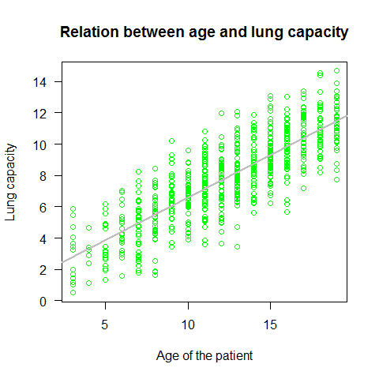

```r
summary(mod)
```

```
## 
## Call:
## lm(formula = LungCap ~ Age)
## 
## Residuals:
##    Min     1Q Median     3Q    Max 
## -4.780 -1.020  0.000  0.979  4.265 
## 
## Coefficients:
##             Estimate Std. Error t value Pr(>|t|)    
## (Intercept)   1.1469     0.1835    6.25  7.1e-10 ***
## Age           0.5448     0.0142   38.48  < 2e-16 ***
## ---
## Signif. codes:  0 '***' 0.001 '**' 0.01 '*' 0.05 '.' 0.1 ' ' 1
## 
## Residual standard error: 1.53 on 723 degrees of freedom
## Multiple R-squared:  0.672,	Adjusted R-squared:  0.671 
## F-statistic: 1.48e+03 on 1 and 723 DF,  p-value: <2e-16
```

Important points on the lm summary:

1) Residuals summary: The residuals are the difference between the actual values of the variable that is beeing predicted and predicted values from the regression. If the difference of the means is close to 0 (like in this case) that means that the residuals are normally distributed
2) Estimate for the intercept (null H -> estimate = 0)
3) Estimate for the age (slope; null H -> slope = 0 )
4) Residual standard error of 1.526 (measure of variation of observations around regression line). For a normal distribution, the ideal would be that the 1st and 3rd quantiles from the residuals summary are 1.5 +/- the std error. 
5) R-squared and adjusted R-Squared. Higher is better with 1 being the best. Corresponds with the amount of variability in what you're predicting that is explained by the model (be aware thaT While a high R-squared indicates good correlation, correlation does not always imply causation)
6) F-stat (the null hypothesis implies that all estimates are 0). Takes the parameters of our model  and compares it to a model that has fewer parmeters. In theory the model with more parameters should fit better. If the model with more parameters (your model) doesn't perform better than the model with fewer parameters, the F-test will have a high p-value (probability NOT significant boost). If the model with more parameters is better than the model with fewer parameters, you will have a lower p-value.


Full list of attributes

```r
attributes(mod)
```

```
## $names
##  [1] "coefficients"  "residuals"     "effects"       "rank"         
##  [5] "fitted.values" "assign"        "qr"            "df.residual"  
##  [9] "xlevels"       "call"          "terms"         "model"        
## 
## $class
## [1] "lm"
```
 
Selection of the coefficient?s attribute

```r
mod$coefficients 
```

```
## (Intercept)         Age 
##      1.1469      0.5448
```

Working with the List Objects

```r
mod$fitted.values[1:50] # the first 50 values from the fitted.values variable
```

```
##      1      2      3      4      5      6      7      8      9     10 
##  4.416 10.954  9.864  8.775  3.871  7.140  5.506  7.140  9.320  7.140 
##     11     12     13     14     15     16     17     18     19     20 
## 11.499 10.409  7.685  6.595  6.595  8.230  9.320  5.506  7.140  8.775 
##     21     22     23     24     25     26     27     28     29     30 
##  4.416  5.506  9.864  7.140  7.140  7.685  7.685  6.050  3.326 10.954 
##     31     32     33     34     35     36     37     38     39     40 
##  3.326  8.230  8.230  8.230  7.685  6.595  4.416  6.050  7.140 10.409 
##     41     42     43     44     45     46     47     48     49     50 
##  8.775 10.409  5.506  7.685  4.416  7.140  7.140  7.685 10.409  4.961
```

```r
plot(Age,LungCap,main="Relation between age and lung capacity"
     , col="green",las=1, xlab="Age of the patient", ylab="Lung capacity")
abline(mod,lwd=2,col="grey")
points(Age,mod$fitted.values, pch=20, col=2)
```

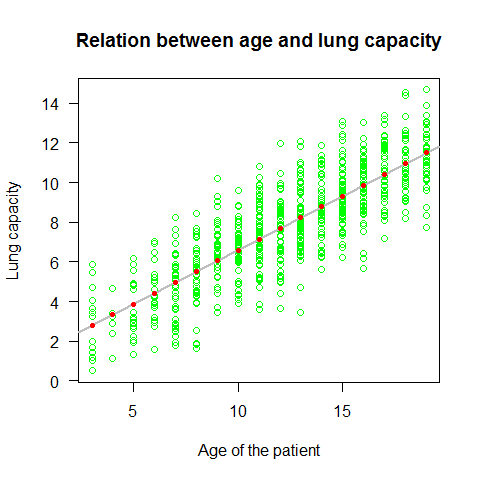

Plotting the residuals

```r
plot(Age,mod$residuals,pch=20,col="blue" )
abline(h=0, lwd=3)
```

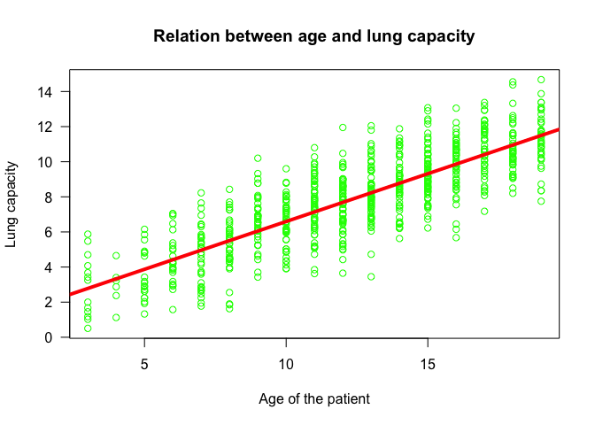

Plot the regression line

```r
plot(Age,LungCap,main="Relation between age and lung capacity"
     , col="green",las=1, xlab="Age of the patient", ylab="Lung capacity")
abline(mod,col=2,lwd=4)
```

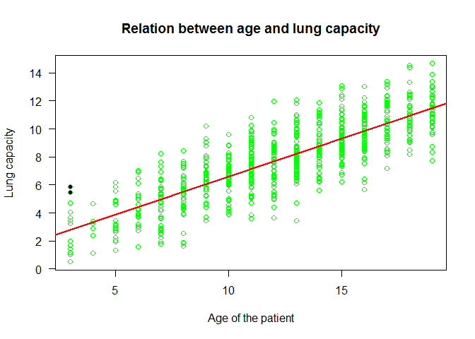

### Example2  simple regression

Example to appreciate Residuals and Residual Standard error

```r
x1=c(1,2,3,4,5)
y1=c(1,2,3,100, 200)
plot(x1,y1, xlim=c(0,5), ylim=c(-100,200))
abline(h=0)
mod2=lm(y1~x1); abline(mod2,col=2,lwd=3)
summary(mod2)
```

```
## 
## Call:
## lm(formula = y1 ~ x1)
## 
## Residuals:
##     1     2     3     4     5 
##  39.0  -9.6 -58.2 -10.8  39.6 
## 
## Coefficients:
##             Estimate Std. Error t value Pr(>|t|)  
## (Intercept)    -87.6       49.5   -1.77    0.175  
## x1              49.6       14.9    3.32    0.045 *
## ---
## Signif. codes:  0 '***' 0.001 '**' 0.01 '*' 0.05 '.' 0.1 ' ' 1
## 
## Residual standard error: 47.2 on 3 degrees of freedom
## Multiple R-squared:  0.786,	Adjusted R-squared:  0.715 
## F-statistic:   11 on 1 and 3 DF,  p-value: 0.045
```

```r
points(x1,mod2$fitted.values, pch=20, col="blue",cex=3)
```

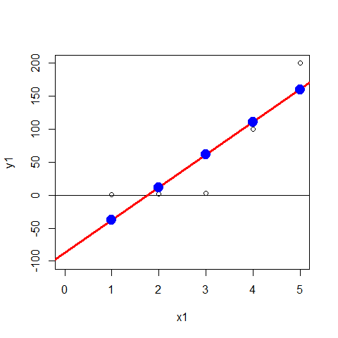

```r
plot(x1,mod2$residuals,pch=20,col="blue" ); abline(h=0, lwd=3)
```

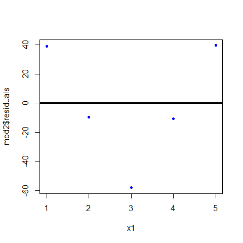

z are the residuals of the model (mod2), we can see them on the summary

```r
z1=c(39.0,-9.6, -58.2, -10.8, 39.6)
```

As we said, in regression, the total sum of squares helps to express the total variation of the y's

```r
SumSquares <- function(x) sum(x^2)
SumSquares(z1)  #6685.2
```

```
## [1] 6685
```

Residual Standard Errors for any linear model

```r
ResSE = function(mymodel) sqrt((sum(mymodel$residuals^2)/ mymodel$df.residual)/length(mymodel$df.residual)) 
ResSE(mod2) #47.20593, the same as shown in the summary
```

```
## [1] 47.21
```

```r
ResSE(mod)
```

```
## [1] 1.526
```

```r
sqrt(deviance(mod2)/df.residual(mod2)) #47.20593
```

```
## [1] 47.21
```


Model validation: do we meet the main assumptions of the linear regression?

1) Y values (or the errors) are INDEPENDENT (independence)
2) Y values can be expressed as a LINEAR function of X (linearity)
3) Variation of observations around the regression line (the residual standard error) is CONSTANT (homoscedasticity)
4) For a given X value, Y values (or the errors) are NORMALLY DISTRIBUTED (normality)

In relation to the first assumption, it is important to think about the study design / data collection, if we need to include random effects (see mixed models later on), or if we can have potential bias from spatial and temporal autocorrelation. 

All the other assumptions can be checked by checking the residuals


```r
par(mfrow=c(2,2))
plot(mod)
```

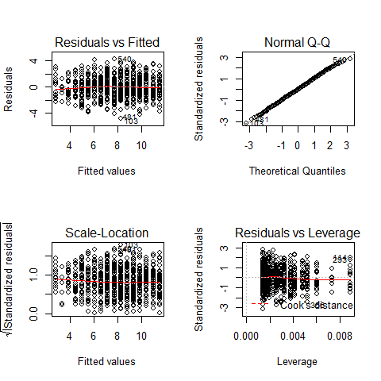

```r
par(mfrow=c(1,1))
```

TOP-LEFT PLOT: Residual vs Fitted
fitted values vs residuals; we should not see patterns here, red line relatively flat

TOP-RIGHT PLOT: Normal Q-Q
to check the normality of the residuals; the x axis is the expectation for a normal distribution, and the y axis the observed residuals

BOTTOM-LEFT PLOT: Scale-Location
The third plot is similar to the one above it, but on a different scale; it shows the square root of the standardized residuals (where all the values are positive) against the fitted values. If there was a problem, such as the variance increasing with the mean, then the points would be distributed inside a triangular shape, with the scatter of the residuals increasing as the fitted values increase. But there is no such a pattern here.

BOTTOM-RIGHT PLOT: Residuals vs Leverage
This plot shows standardized residuals as a function of leverage, along with Cook's distance for each of the observed values of the response variable. The point of this plot is to highlight those y values that have the biggest effect on the parameter estimate problem, this is, points are close to cook's distance contour'


Further analysis on linear model residuals.

```r
shapiro.test(mod$residuals)  #normally distributed
```

```
## 
## 	Shapiro-Wilk normality test
## 
## data:  mod$residuals
## W = 0.999, p-value = 0.9614
```

```r
hist(mod$residuals, freq=F,breaks=20)
lines(density(mod$residuals))
```

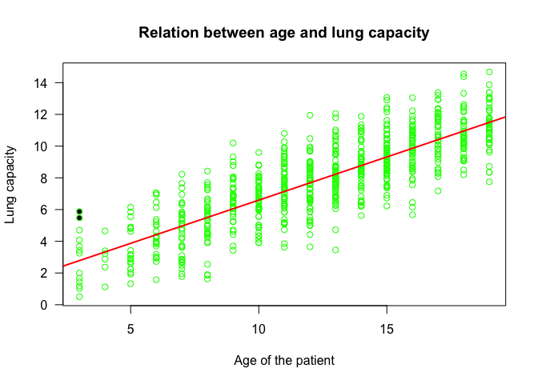


```r
plot(Age,LungCap,main="Relation between age and lung capacity"
     , col="green",las=1, xlab="Age of the patient", ylab="Lung capacity")
abline(mod,lwd=2,col=2)
points(Age[114],LungCap[114],pch=20) #to highlight a specific point
points(Age[293],LungCap[293],pch=20)
```

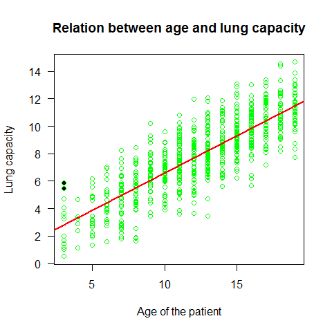

```r
detach(lung)
```

The Lung Capacity linear regression met the assumptions of a linear regression. 

### Example3  simple regression 

Now an example that doesn?t met these assumptions. This data shows the decay of a biodegradable plastic in soil: the response, y, is the mass of plastic remaining and the explanatory variable, x, is duration of burial.

```r
load("../Data/problems.RData")
```


```r
attach(problems)
plot(x,y)
mod1=lm(y~x,problems)
abline(mod1,col="red")
```

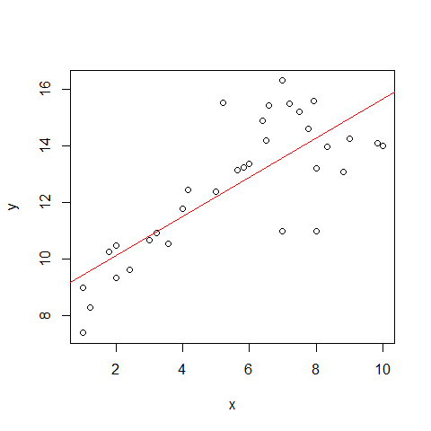

```r
summary(mod1)
```

```
## 
## Call:
## lm(formula = y ~ x, data = problems)
## 
## Residuals:
##    Min     1Q Median     3Q    Max 
## -3.273 -0.790  0.185  0.846  3.198 
## 
## Coefficients:
##             Estimate Std. Error t value Pr(>|t|)    
## (Intercept)   8.7441     0.6024   14.52  2.3e-15 ***
## x             0.6911     0.0979    7.06  6.3e-08 ***
## ---
## Signif. codes:  0 '***' 0.001 '**' 0.01 '*' 0.05 '.' 0.1 ' ' 1
## 
## Residual standard error: 1.5 on 31 degrees of freedom
## Multiple R-squared:  0.616,	Adjusted R-squared:  0.604 
## F-statistic: 49.8 on 1 and 31 DF,  p-value: 6.32e-08
```


```r
par(mfrow=c(2,2))
plot(mod1)
```


```r
par(mfrow=c(1,1)) 
```
Assumption of linearity and homoscedasticity (top-left plot) are hardly met in this example.


### Example4  simple regression 

Relation between decay and time

```r
decay <- read.delim("../Data/Decay.txt")

summary(decay)
```

```
##       time          amount     
##  Min.   : 0.0   Min.   :  8.2  
##  1st Qu.: 7.5   1st Qu.: 21.5  
##  Median :15.0   Median : 35.0  
##  Mean   :15.0   Mean   : 42.1  
##  3rd Qu.:22.5   3rd Qu.: 57.5  
##  Max.   :30.0   Max.   :125.0
```

```r
attach(decay)
plot(time,amount)
mod3=lm(amount~time)
abline(mod3,lwd=2,col=2)
```


```r
par(mfrow=c(2,2))
plot(mod3)
```


```r
par(mfrow=c(1,1))
```

Plot1: residuals against the fitted values (upper-left plot) which shows very pronounced curvature; most of the residuals for intermediate fitted values are negative, and the positive residuals are concentrated at the smallest and largest fitted values. This plot should not shown pattern of any sort. This suggests systematic inadequacy in the structure of the model. 

Plot 2 : does not show normality

```r
par(mfrow=c(1,1)) 
shapiro.test(mod3$residuals)  # no normally distributed
```

```
## 
## 	Shapiro-Wilk normality test
## 
## data:  mod3$residuals
## W = 0.9214, p-value = 0.0257
```

```r
hist(mod3$residuals, freq=F,breaks=20)
lines(density(mod3$residuals))
```

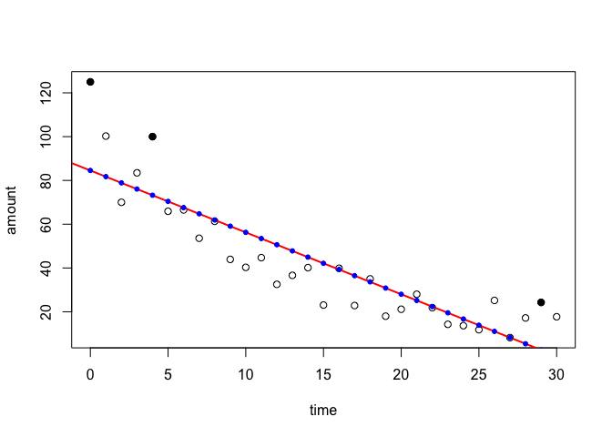

Plot 3: a positive-valued version of the first graph; it is good to detect non-constancy of variance (heteroscedasticity), which shows up as a triangular scatter. 

Plot 4: shows a pronounced pattern in the standardized residuals as a function of the leverage. The graph also shows Cooks distance, highlighting the identity of particularly influential data points.


```r
plot(time,amount) #there is a non-linear trend, maybe quadratic
abline(mod3,lwd=2,col=2)
#Highlight the influencial points
points(time[1],amount[1],pch=20,cex=1.5) 
points(time[5],amount[5],pch=20,cex=1.5)
points(time[30],amount[30],pch=20,cex=1.5)

points(time,mod3$fitted.values, pch=20, col="blue")
```

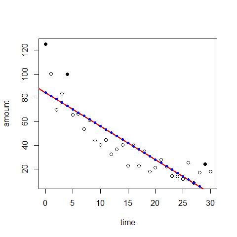

Positive and negative residuals

```r
plot(time,mod3$residuals)
abline(h=0, lwd=3)
points(time[mod3$residuals>=0],mod3$residuals[mod3$residuals>=0],pch=20,col="blue" )
points(time[mod3$residuals<0],mod3$residuals[mod3$residuals<0],pch=20,col="red" )      
```

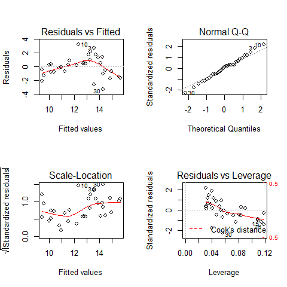


```r
mod4=lm(amount~time+I(time^2))
plot(time,amount)
lines(mod4$fitted.values, type="l", lwd=2,lty=3)# abline is no longer working here. 
```


```r
par(mfrow=c(2,2))
plot(mod4)
```

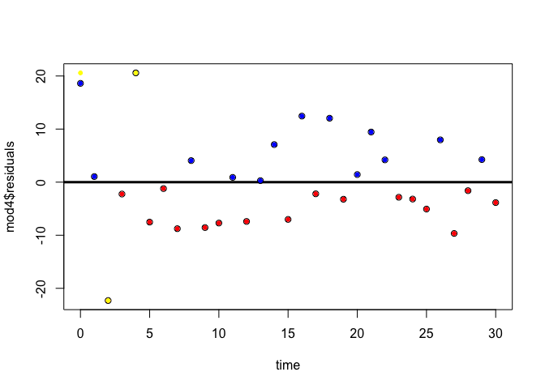

```r
par(mfrow=c(1,2))
```

Comparisons mod 3 vs mod 4 residuals

```r
plot(time,mod3$residuals)
abline(h=0, lwd=3)
points(time[mod3$residuals>=0],mod3$residuals[mod3$residuals>=0],pch=20,col="blue" )
points(time[mod3$residuals<0],mod3$residuals[mod3$residuals<0],pch=20,col="red" )
```


```r
plot(time,mod4$residuals)
abline(h=0, lwd=3)
points(time[mod4$residuals>=0],mod4$residuals[mod4$residuals>=0],pch=20,col="blue" )
points(time[mod4$residuals<0],mod4$residuals[mod4$residuals<0],pch=20,col="red" )

# Influential points in mod 4
points(time[1],mod4$residuals[5],pch=20,col="yellow" )
points(time[5],mod4$residuals[5],pch=20,col="yellow" )
points(time[3],mod4$residuals[3],pch=20,col="yellow" )
```

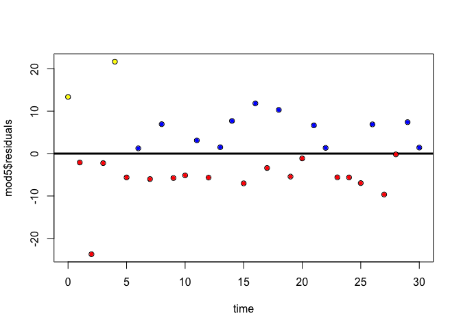

```r
par(mfrow=c(1,1))
```


```r
plot(time,amount)
mod5=lm(amount~time+I(time^2)+I(time^3))
lines(mod5$fitted.values, type="l", lwd=2,lty=3)
```

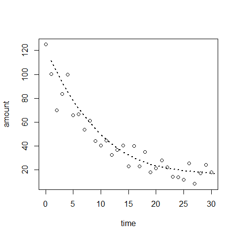

```r
plot(time,mod5$residuals)
abline(h=0, lwd=3)
points(time[mod5$residuals>=0],mod5$residuals[mod5$residuals>=0],pch=20,col="blue" )
points(time[mod5$residuals<0],mod5$residuals[mod5$residuals<0],pch=20,col="red" )
points(time[1],mod5$residuals[1],pch=20,col="yellow" )
points(time[5],mod5$residuals[5],pch=20,col="yellow" )
```

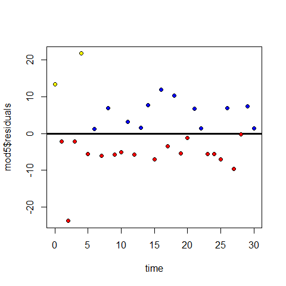

```r
par(mfrow=c(2,2))
plot(mod5)
```


```r
par(mfrow=c(1,1))

detach(decay)
```

### Example5  simple regression
The data 


```r
myData <- women
plot(myData)
```

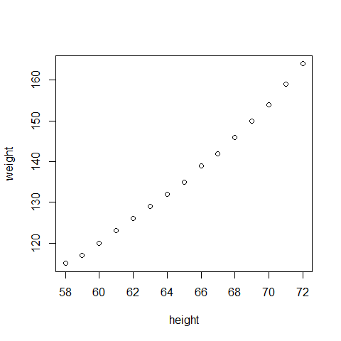

Fit the model 

```r
# Multiple Linear Regression Example
fit <- lm(weight ~ height, data=myData)
```


```r
summary(fit) # show results
```

```
## 
## Call:
## lm(formula = weight ~ height, data = myData)
## 
## Residuals:
##    Min     1Q Median     3Q    Max 
## -1.733 -1.133 -0.383  0.742  3.117 
## 
## Coefficients:
##             Estimate Std. Error t value Pr(>|t|)    
## (Intercept) -87.5167     5.9369   -14.7  1.7e-09 ***
## height        3.4500     0.0911    37.9  1.1e-14 ***
## ---
## Signif. codes:  0 '***' 0.001 '**' 0.01 '*' 0.05 '.' 0.1 ' ' 1
## 
## Residual standard error: 1.53 on 13 degrees of freedom
## Multiple R-squared:  0.991,	Adjusted R-squared:  0.99 
## F-statistic: 1.43e+03 on 1 and 13 DF,  p-value: 1.09e-14
```

Diagnostics 

```r
layout(matrix(c(1,2,3,4),2,2)) # optional 4 graphs/page
plot(fit)
```


```r
# Other useful functions
coefficients(fit) # model coefficients
```

```
## (Intercept)      height 
##      -87.52        3.45
```

```r
confint(fit, level=0.95) # CIs for model parameters
```

```
##                2.5 %  97.5 %
## (Intercept) -100.343 -74.691
## height         3.253   3.647
```

```r
fitted(fit) # predicted values
```

```
##     1     2     3     4     5     6     7     8     9    10    11    12 
## 112.6 116.0 119.5 122.9 126.4 129.8 133.3 136.7 140.2 143.6 147.1 150.5 
##    13    14    15 
## 154.0 157.4 160.9
```

```r
residuals(fit) # residuals
```

```
##        1        2        3        4        5        6        7        8 
##  2.41667  0.96667  0.51667  0.06667 -0.38333 -0.83333 -1.28333 -1.73333 
##        9       10       11       12       13       14       15 
## -1.18333 -1.63333 -1.08333 -0.53333  0.01667  1.56667  3.11667
```

```r
anova(fit) # anova table
```

```
## Analysis of Variance Table
## 
## Response: weight
##           Df Sum Sq Mean Sq F value  Pr(>F)    
## height     1   3333    3333    1433 1.1e-14 ***
## Residuals 13     30       2                    
## ---
## Signif. codes:  0 '***' 0.001 '**' 0.01 '*' 0.05 '.' 0.1 ' ' 1
```

```r
vcov(fit) # covariance matrix for model parameters
```

```
##             (Intercept)    height
## (Intercept)     35.2473 -0.539881
## height          -0.5399  0.008306
```

```r
influence(fit) # regression diagnostics 
```

```
## $hat
##       1       2       3       4       5       6       7       8       9 
## 0.24167 0.19524 0.15595 0.12381 0.09881 0.08095 0.07024 0.06667 0.07024 
##      10      11      12      13      14      15 
## 0.08095 0.09881 0.12381 0.15595 0.19524 0.24167 
## 
## $coefficients
##    (Intercept)     height
## 1      5.39103 -7.967e-02
## 2      1.75316 -2.574e-02
## 3      0.75132 -1.093e-02
## 4      0.07572 -1.087e-03
## 5     -0.32459  4.557e-03
## 6     -0.48143  6.477e-03
## 7     -0.41244  4.930e-03
## 8     -0.12381 -4.064e-17
## 9      0.21061 -4.545e-03
## 10     0.70665 -1.269e-02
## 11     0.75705 -1.288e-02
## 12     0.52464 -8.696e-03
## 13    -0.02160  3.526e-04
## 14    -2.58176  4.172e-02
## 15    -6.40458  1.027e-01
## 
## $sigma
##     1     2     3     4     5     6     7     8     9    10    11    12 
## 1.370 1.556 1.579 1.587 1.583 1.567 1.540 1.500 1.547 1.509 1.553 1.579 
##    13    14    15 
## 1.587 1.505 1.205 
## 
## $wt.res
##        1        2        3        4        5        6        7        8 
##  2.41667  0.96667  0.51667  0.06667 -0.38333 -0.83333 -1.28333 -1.73333 
##        9       10       11       12       13       14       15 
## -1.18333 -1.63333 -1.08333 -0.53333  0.01667  1.56667  3.11667
```


# Multiple linear regression

Multiple linear regression is the term for the situation in which you have multiple predictor variables, but still only one continous response with the same assumptions as before. 

<a href="http://www.youtube.com/watch?v=q1RD5ECsSB0" target="_blank">
<br/ >
Video demonstrating multiple linear regresssion in R
</a>


### Example1  Multiple linear regression 


```r
head(lung)
```

```
##   LungCap Age Height Smoke Gender Caesarean
## 1   6.475   6   62.1    no   male        no
## 2  10.125  18   74.7   yes female        no
## 3   9.550  16   69.7    no female       yes
## 4  11.125  14   71.0    no   male        no
## 5   4.800   5   56.9    no   male        no
## 6   6.225  11   58.7    no female        no
```

```r
attach(lung)
```

The final F-stat confirms if the null hypotesis Ho is met, that is, if all model coefficients are 0
The intercept is the when estimation for age and height are both 0. 

```r
model1=lm(LungCap~Age+Height)
summary(model1)
```

```
## 
## Call:
## lm(formula = LungCap ~ Age + Height)
## 
## Residuals:
##    Min     1Q Median     3Q    Max 
## -3.408 -0.710 -0.008  0.717  3.168 
## 
## Coefficients:
##              Estimate Std. Error t value Pr(>|t|)    
## (Intercept) -11.74707    0.47690  -24.63  < 2e-16 ***
## Age           0.12637    0.01785    7.08  3.4e-12 ***
## Height        0.27843    0.00993   28.05  < 2e-16 ***
## ---
## Signif. codes:  0 '***' 0.001 '**' 0.01 '*' 0.05 '.' 0.1 ' ' 1
## 
## Residual standard error: 1.06 on 722 degrees of freedom
## Multiple R-squared:  0.843,	Adjusted R-squared:  0.843 
## F-statistic: 1.94e+03 on 2 and 722 DF,  p-value: <2e-16
```

We got for the Age a slope of 0.12 controlled or adjusted by the height
Whenever the time is increased by 1 year, so it does the lung capacity by 0.126


```r
library(effects)
```

```
## Warning: package 'effects' was built under R version 3.0.3
```

```r
plot(allEffects(model1))
```


```r
plot(effect("Age",model1))
```

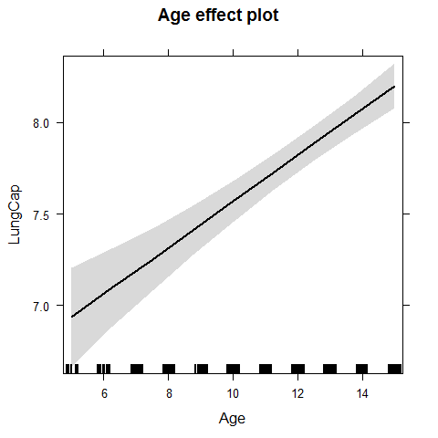

```r
plot(effect("Height",model1))
```

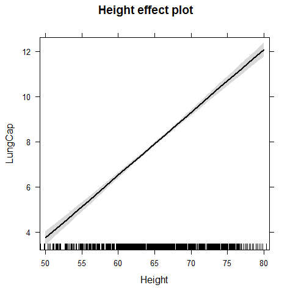

Now the same dataset with the ANCOVA (covariance analysis)

```r
model2 = lm(LungCap~Age + Height + Smoke + Gender + Caesarean)
summary(model2)
```

```
## 
## Call:
## lm(formula = LungCap ~ Age + Height + Smoke + Gender + Caesarean)
## 
## Residuals:
##    Min     1Q Median     3Q    Max 
## -3.339 -0.720  0.044  0.709  3.017 
## 
## Coefficients:
##              Estimate Std. Error t value Pr(>|t|)    
## (Intercept)  -11.3225     0.4710  -24.04  < 2e-16 ***
## Age            0.1605     0.0180    8.91  < 2e-16 ***
## Height         0.2641     0.0101   26.25  < 2e-16 ***
## Smokeyes      -0.6096     0.1260   -4.84  1.6e-06 ***
## Gendermale     0.3870     0.0797    4.86  1.5e-06 ***
## Caesareanyes  -0.2142     0.0907   -2.36    0.018 *  
## ---
## Signif. codes:  0 '***' 0.001 '**' 0.01 '*' 0.05 '.' 0.1 ' ' 1
## 
## Residual standard error: 1.02 on 719 degrees of freedom
## Multiple R-squared:  0.854,	Adjusted R-squared:  0.853 
## F-statistic:  843 on 5 and 719 DF,  p-value: <2e-16
```

```r
plot(allEffects(model2))
```

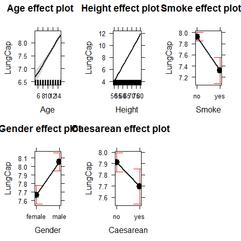

Checking that assumptions are met

```r
par(mfrow=c(2,2))
plot(model2)
```

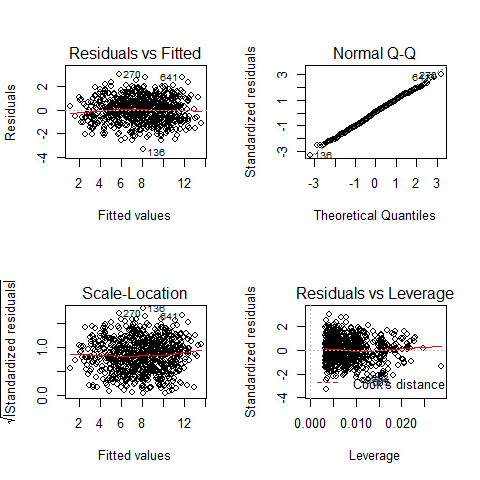

```r
par(mfrow=c(1,1))

plot(Height,model2$residuals);abline(h=0)
```

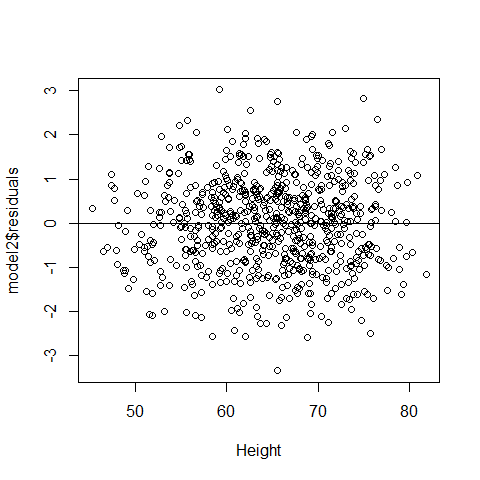

```r
plot(Age,model2$residuals);abline(h=0)
```

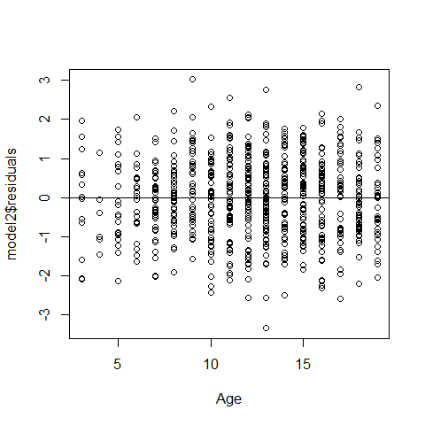

```r
plot(model2$residuals~Smoke);abline(h=0)
```

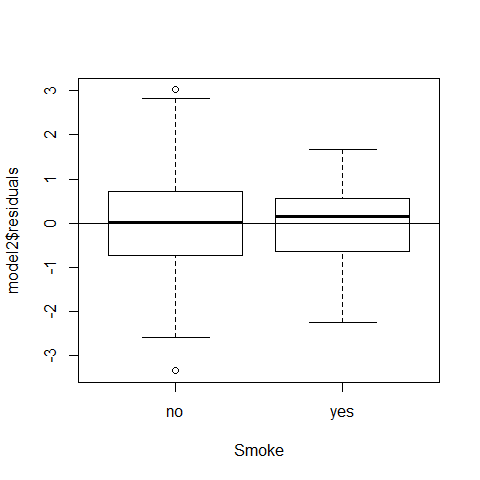

```r
plot(model2$residuals~Gender);abline(h=0)
```

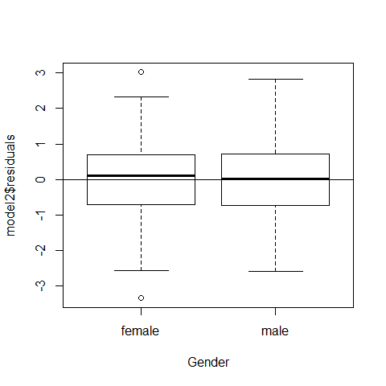

```r
plot(model2$residuals~Caesarean);abline(h=0)
```

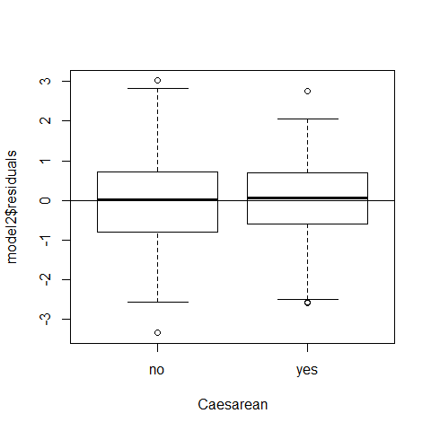

### Example2  Multiple linear regression - Collinearity Issues

Collinearity (or multicollinearity) is the undesirable situation where the correlations among the independent variables are
strong.
This can be a problem since it increases the standard errors of the coefficients. Increased standard errors in turn means that coefficients for some independent variables may be found not to be significantly different from 0, whereas without multicollinearity and with lower standard errors, these same coefficients might have been found to be significant and the researcher may not have come to null findings in the first place.


```r
plot(Height,Age)
```

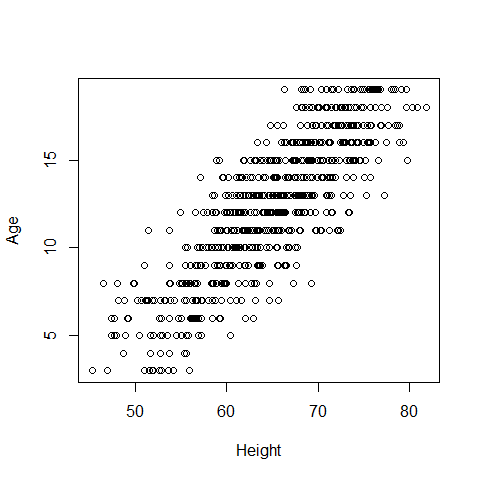

```r
cor(Height,Age)
```

```
## [1] 0.8357
```

It is not clear that the slope for age is the actual effect of age 
On lung capacity adjusting for height, age and height are bounded together

Our model structure was on the way model2 = lm(LungCap~Age + Height + Smoke + Gender + Caesarean) we cannot include Height and Age in the same model due to collinearity issues (|r|>0.7)


```r
model1=lm(LungCap~Height); summary(model1) #adjusted R-squared = 0.83
```

```
## 
## Call:
## lm(formula = LungCap ~ Height)
## 
## Residuals:
##    Min     1Q Median     3Q    Max 
## -3.362 -0.701 -0.003  0.779  3.294 
## 
## Coefficients:
##              Estimate Std. Error t value Pr(>|t|)    
## (Intercept) -13.99683    0.36745   -38.1   <2e-16 ***
## Height        0.33716    0.00563    59.9   <2e-16 ***
## ---
## Signif. codes:  0 '***' 0.001 '**' 0.01 '*' 0.05 '.' 0.1 ' ' 1
## 
## Residual standard error: 1.09 on 723 degrees of freedom
## Multiple R-squared:  0.832,	Adjusted R-squared:  0.832 
## F-statistic: 3.58e+03 on 1 and 723 DF,  p-value: <2e-16
```

```r
cor(Height, LungCap)
```

```
## [1] 0.9122
```

```r
model2=lm(LungCap~Age); summary(model2) #adjusted R-squared = 0.67
```

```
## 
## Call:
## lm(formula = LungCap ~ Age)
## 
## Residuals:
##    Min     1Q Median     3Q    Max 
## -4.780 -1.020  0.000  0.979  4.265 
## 
## Coefficients:
##             Estimate Std. Error t value Pr(>|t|)    
## (Intercept)   1.1469     0.1835    6.25  7.1e-10 ***
## Age           0.5448     0.0142   38.48  < 2e-16 ***
## ---
## Signif. codes:  0 '***' 0.001 '**' 0.01 '*' 0.05 '.' 0.1 ' ' 1
## 
## Residual standard error: 1.53 on 723 degrees of freedom
## Multiple R-squared:  0.672,	Adjusted R-squared:  0.671 
## F-statistic: 1.48e+03 on 1 and 723 DF,  p-value: <2e-16
```

```r
cor(Age,LungCap)
```

```
## [1] 0.8197
```

Testing for and to avoid collinearity issues
 

```r
names(lung)
```

```
## [1] "LungCap"   "Age"       "Height"    "Smoke"     "Gender"    "Caesarean"
```

```r
detach(lung)
lung$NSmoke=as.numeric(lung$Smoke)
lung$NGender=as.numeric(lung$Gender)
lung$NCaesarean=as.numeric(lung$Caesarean)
summary(lung)
```

```
##     LungCap            Age           Height     Smoke        Gender   
##  Min.   : 0.507   Min.   : 3.0   Min.   :45.3   no :648   female:358  
##  1st Qu.: 6.150   1st Qu.: 9.0   1st Qu.:59.9   yes: 77   male  :367  
##  Median : 8.000   Median :13.0   Median :65.4                         
##  Mean   : 7.863   Mean   :12.3   Mean   :64.8                         
##  3rd Qu.: 9.800   3rd Qu.:15.0   3rd Qu.:70.3                         
##  Max.   :14.675   Max.   :19.0   Max.   :81.8                         
##  Caesarean     NSmoke        NGender       NCaesarean  
##  no :561   Min.   :1.00   Min.   :1.00   Min.   :1.00  
##  yes:164   1st Qu.:1.00   1st Qu.:1.00   1st Qu.:1.00  
##            Median :1.00   Median :2.00   Median :1.00  
##            Mean   :1.11   Mean   :1.51   Mean   :1.23  
##            3rd Qu.:1.00   3rd Qu.:2.00   3rd Qu.:1.00  
##            Max.   :2.00   Max.   :2.00   Max.   :2.00
```

There are 3 different tools to check if there is collinearity
1) Pairwise scatterplots
2) Correlation coefficients

1 and 2 are combined into the same routine  
*source("Routines from Zuur et al 2009.r"), to load useful functions


Now we will set up the graphs, first the histograms on the diagonal

```r
panel.hist <- function(x, ...)                
{
    usr <- par("usr"); on.exit(par(usr))
    par(usr = c(usr[1:2], 0, 1.5) )
    h <- hist(x, plot = FALSE)
    breaks <- h$breaks; nB <- length(breaks)
    y <- h$counts; y <- y/max(y)
    rect(breaks[-nB], 0, breaks[-1], y, col = "cyan", ...)
}
```

Then the (absolute) correlations on the upper panels, with size proportional to the correlations.

```r
panel.cor <- function(x, y, digits = 2, prefix = "", cex.cor, ...)
{
    usr <- par("usr"); on.exit(par(usr))
    par(usr = c(0, 1, 0, 1))
    r <- abs(cor(x, y))
    txt <- format(c(r, 0.123456789), digits = digits)[1]
    txt <- paste0(prefix, txt)
    if(missing(cex.cor)) cex.cor <- 0.8/strwidth(txt)
    text(0.5, 0.5, txt, cex = cex.cor * r)
}

panel.smooth2=function (x, y, col = par("col"), bg = NA, pch = par("pch"),
                        cex = 1, col.smooth = "black", span = 2/3, iter = 3, ...)
{
  points(x, y, pch = pch, col = col, bg = bg, cex = cex)
  ok <- is.finite(x) & is.finite(y)
  if (any(ok))
    lines(stats::lowess(x[ok], y[ok], f = span, iter = iter),
          col = 1, ...)
}
```

Finally we bind  together the column of interest


```r
attach(lung)
Z<-cbind(LungCap,Age,Height,NSmoke,NGender,NCaesarean)
```

and assign names to the columns

```r
colnames(Z)<-c("LungCap","Age","Height","NSmoke","NGender","NCaesarean")

pairs(Z, lower.panel=panel.smooth2,
      upper.panel=panel.cor,diag.panel=panel.hist)
```

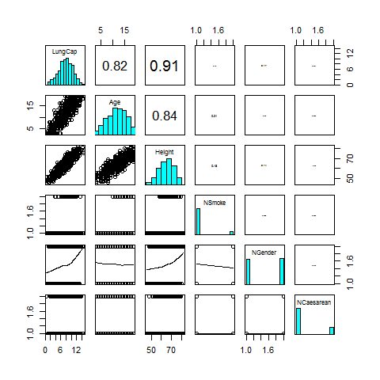
rule of thumb: when |r|>0.7, there is collinearity


3) VIF variance inflation factors (Multicollinearity)
VIF  rule of thumb: when VIF>3, there is a high chance of collinearity

```r
corvif <- function(dataz) {
  dataz <- as.data.frame(dataz)
  #correlation part
  #cat("Correlations of the variables\n\n")
  #tmp_cor <- cor(dataz,use="complete.obs")
  #print(tmp_cor)
  
  #vif part
  form    <- formula(paste("fooy ~ ",paste(strsplit(names(dataz)," "),collapse=" + ")))
  dataz   <- data.frame(fooy=1,dataz)
  lm_mod  <- lm(form,dataz)
  
  cat("\n\nVariance inflation factors\n\n")
  print(myvif(lm_mod))
}
```

Support function for corvif. Will not be called by the user

```r
myvif <- function(mod) {
  v <- vcov(mod)
  assign <- attributes(model.matrix(mod))$assign
  if (names(coefficients(mod)[1]) == "(Intercept)") {
    v <- v[-1, -1]
    assign <- assign[-1]
  } else warning("No intercept: vifs may not be sensible.")
  terms <- labels(terms(mod))
  n.terms <- length(terms)
  if (n.terms < 2) stop("The model contains fewer than 2 terms")
  if (length(assign) > dim(v)[1] ) {
    diag(tmp_cor)<-0
    if (any(tmp_cor==1.0)){
      return("Sample size is too small, 100% collinearity is present")
    } else {
      return("Sample size is too small")
    }
  }
  R <- cov2cor(v)
  detR <- det(R)
  result <- matrix(0, n.terms, 3)
  rownames(result) <- terms
  colnames(result) <- c("GVIF", "Df", "GVIF^(1/2Df)")
  for (term in 1:n.terms) {
    subs <- which(assign == term)
    result[term, 1] <- det(as.matrix(R[subs, subs])) * det(as.matrix(R[-subs, -subs])) / detR
    result[term, 2] <- length(subs)
  }
  if (all(result[, 2] == 1)) {
    result <- data.frame(GVIF=result[, 1])
  } else {
    result[, 3] <- result[, 1]^(1/(2 * result[, 2]))
  }
  invisible(result)
}
```

End VIF functions, we have to exclude the response variable from the VIF test again, there is a problem here with Height and Age, so we decide to keep the Heigth and discard Age

```r
corvif(Z[,-1])  
```

```
## 
## 
## Variance inflation factors
## 
##             GVIF
## Age        3.620
## Height     3.656
## NSmoke     1.050
## NGender    1.106
## NCaesarean 1.005
```

```r
corvif(Z[,c(-1,-2)])
```

```
## 
## 
## Variance inflation factors
## 
##             GVIF
## Height     1.060
## NSmoke     1.040
## NGender    1.027
## NCaesarean 1.005
```
Now all GVIF are under 3. We can build the multiple regression with the other predictors:
response = "LungCap"
independent variables = "Height"     "Smoke"      "Gender"     "Caesarean" 


```r
detach(lung)
```

### Example3  Multiple linear regression - ANCOVA

Forest bird densities measured in 56 forest patches in Australia

```r
Birds <- read.delim("../Data/birds.txt")
head(Birds)
```

```
##   Site ABUND AREA DIST LDIST YR.ISOL GRAZE ALT
## 1    1   5.3  0.1   39    39    1968     2 160
## 2    2   2.0  0.5  234   234    1920     5  60
## 3    3   1.5  0.5  104   311    1900     5 140
## 4    4  17.1  1.0   66    66    1966     3 160
## 5    5  13.8  1.0  246   246    1918     5 140
## 6    6  14.1  1.0  234   285    1965     3 130
```

```r
names(Birds)
```

```
## [1] "Site"    "ABUND"   "AREA"    "DIST"    "LDIST"   "YR.ISOL" "GRAZE"  
## [8] "ALT"
```
"Site"  
"ABUND"     RESPONSE [bird density measured in 56 forest patches in Victoria, Australia]
"AREA"  size FOREST patch  
"DIST"    dist closest patch
"LDIST"   distance to the nearest larger patch
"YR.ISOL" year isolation by clearance
"GRAZE"  index of livestock grazing (1 light, 5 intensive)
"ALT"    altitude of the patch

We convert it into a factor because livestock intensity are just classes and do not cover the same ranges of livestock grazing intensity 

```r
Birds$fGRAZE <- factor(Birds$GRAZE)

Birds$L.AREA<-log10(Birds$AREA)
Birds$L.DIST<-log10(Birds$DIST)
Birds$L.LDIST<-log10(Birds$LDIST)
```
Potential outliers in AREA, DIST, LDIST. They are not typos (data entry mistakes on 1 line) because ther are not on the same line. These outliers are likely too influential. They all are Measures of size and distances and can be easily converted with ln or log10 transf


```r
M0 <- lm(ABUND~ L.AREA + fGRAZE, Birds)
summary(M0) #here it is possible to appreciate the five intercepts and the slope
```

```
## 
## Call:
## lm(formula = ABUND ~ L.AREA + fGRAZE, data = Birds)
## 
## Residuals:
##     Min      1Q  Median      3Q     Max 
## -16.085  -2.479  -0.082   2.649  11.634 
## 
## Coefficients:
##             Estimate Std. Error t value Pr(>|t|)    
## (Intercept)   15.716      2.767    5.68  6.9e-07 ***
## L.AREA         7.247      1.255    5.77  4.9e-07 ***
## fGRAZE2        0.383      2.912    0.13  0.89599    
## fGRAZE3       -0.189      2.550   -0.07  0.94112    
## fGRAZE4       -1.592      2.976   -0.53  0.59518    
## fGRAZE5      -11.894      2.931   -4.06  0.00017 ***
## ---
## Signif. codes:  0 '***' 0.001 '**' 0.01 '*' 0.05 '.' 0.1 ' ' 1
## 
## Residual standard error: 5.88 on 50 degrees of freedom
## Multiple R-squared:  0.727,	Adjusted R-squared:   0.7 
## F-statistic: 26.6 on 5 and 50 DF,  p-value: 5.15e-13
```


```r
plot(Birds$L.AREA, Birds$ABUND,
     xlab="Log transformed AREA", ylab="Bird abundance",col=Birds$GRAZE,cex=1.3)
summary(M0)
```

```
## 
## Call:
## lm(formula = ABUND ~ L.AREA + fGRAZE, data = Birds)
## 
## Residuals:
##     Min      1Q  Median      3Q     Max 
## -16.085  -2.479  -0.082   2.649  11.634 
## 
## Coefficients:
##             Estimate Std. Error t value Pr(>|t|)    
## (Intercept)   15.716      2.767    5.68  6.9e-07 ***
## L.AREA         7.247      1.255    5.77  4.9e-07 ***
## fGRAZE2        0.383      2.912    0.13  0.89599    
## fGRAZE3       -0.189      2.550   -0.07  0.94112    
## fGRAZE4       -1.592      2.976   -0.53  0.59518    
## fGRAZE5      -11.894      2.931   -4.06  0.00017 ***
## ---
## Signif. codes:  0 '***' 0.001 '**' 0.01 '*' 0.05 '.' 0.1 ' ' 1
## 
## Residual standard error: 5.88 on 50 degrees of freedom
## Multiple R-squared:  0.727,	Adjusted R-squared:   0.7 
## F-statistic: 26.6 on 5 and 50 DF,  p-value: 5.15e-13
```

```r
Birds$ABUND1 <- 15.7 +  7.24 * Birds$L.AREA  # Intercepts are corrected for the levels of the categorical variable
Birds$ABUND2 <- 16.1 +  7.24 * Birds$L.AREA  
Birds$ABUND3 <- 15.5 +  7.24 * Birds$L.AREA
Birds$ABUND4 <- 14.1 +  7.24 * Birds$L.AREA
Birds$ABUND5 <- 3.8 +  7.24 * Birds$L.AREA

head(Birds)
```

```
##   Site ABUND AREA DIST LDIST YR.ISOL GRAZE ALT fGRAZE L.AREA L.DIST
## 1    1   5.3  0.1   39    39    1968     2 160      2 -1.000  1.591
## 2    2   2.0  0.5  234   234    1920     5  60      5 -0.301  2.369
## 3    3   1.5  0.5  104   311    1900     5 140      5 -0.301  2.017
## 4    4  17.1  1.0   66    66    1966     3 160      3  0.000  1.820
## 5    5  13.8  1.0  246   246    1918     5 140      5  0.000  2.391
## 6    6  14.1  1.0  234   285    1965     3 130      3  0.000  2.369
##   L.LDIST ABUND1 ABUND2 ABUND3 ABUND4 ABUND5
## 1   1.591   8.46   8.86   8.26   6.86 -3.440
## 2   2.369  13.52  13.92  13.32  11.92  1.621
## 3   2.493  13.52  13.92  13.32  11.92  1.621
## 4   1.820  15.70  16.10  15.50  14.10  3.800
## 5   2.391  15.70  16.10  15.50  14.10  3.800
## 6   2.455  15.70  16.10  15.50  14.10  3.800
```

```r
lines(Birds$L.AREA, Birds$ABUND1, lty = 1, lwd = 1, col =1)
lines(Birds$L.AREA, Birds$ABUND2, lty = 2, lwd = 2, col =2)
lines(Birds$L.AREA, Birds$ABUND3, lty = 3, lwd = 3, col =3)
lines(Birds$L.AREA, Birds$ABUND4, lty = 4, lwd = 4, col =4)
lines(Birds$L.AREA, Birds$ABUND5, lty = 5, lwd = 5, col =5)

legend.txt <- c("Graze 1","Graze 2","Graze 3","Graze 4","Graze 5")
legend("topleft",
       legend = legend.txt,
       col = c(1,2,3,4,5),
       lty = c(1,2,3,4,5),
       lwd = c(1,2,3,4,5),
       bty = "o",   # to add the box around the legend
       cex = 0.8)

title("Fitted model", cex.main = 2, family = "serif", font.main = 1)
summary(M0)
```

```
## 
## Call:
## lm(formula = ABUND ~ L.AREA + fGRAZE, data = Birds)
## 
## Residuals:
##     Min      1Q  Median      3Q     Max 
## -16.085  -2.479  -0.082   2.649  11.634 
## 
## Coefficients:
##             Estimate Std. Error t value Pr(>|t|)    
## (Intercept)   15.716      2.767    5.68  6.9e-07 ***
## L.AREA         7.247      1.255    5.77  4.9e-07 ***
## fGRAZE2        0.383      2.912    0.13  0.89599    
## fGRAZE3       -0.189      2.550   -0.07  0.94112    
## fGRAZE4       -1.592      2.976   -0.53  0.59518    
## fGRAZE5      -11.894      2.931   -4.06  0.00017 ***
## ---
## Signif. codes:  0 '***' 0.001 '**' 0.01 '*' 0.05 '.' 0.1 ' ' 1
## 
## Residual standard error: 5.88 on 50 degrees of freedom
## Multiple R-squared:  0.727,	Adjusted R-squared:   0.7 
## F-statistic: 26.6 on 5 and 50 DF,  p-value: 5.15e-13
```

```r
abline(v=0,lwd=2) # to see the intercept better
```

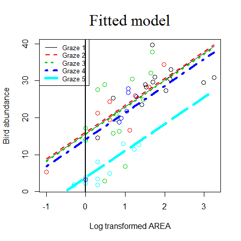


```r
library(effects)
plot(allEffects(M0))
```

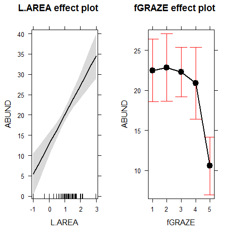


### Example4  Multiple linear regression - ANCOVA

Experiment on the impact of grazing on the fruit production of a biennial plant. 

Forty plants were allocated to two treatments, grazed and ungrazed, and the grazed plants were exposed to rabbits during the first two weeks of stem elongation. They were then protected from subsequent grazing by the erection of  a fence and allowed to regrow. 

Because initial plant size was thought likely to influence fruit production, the diameter of the top of the rootstock was measured before each plant was potted up. At the end of the growing season, the fruit production (dry weight in milligrams) was recorded on each of the 40 plants.

     Grazing: 2 levels (Grazed, with rabbits), (Ungrazed, no rabbits)
     Root: diameter of the rootstock right before the beginning of the experiment
     Fruit: weight of fruits produced by the plant (dry weight in milligrams)


```r
regrowth <- read.delim("../Data/regrowth.txt")
head(regrowth)
```

```
##    Root Fruit  Grazing
## 1 6.225 59.77 Ungrazed
## 2 6.487 60.98 Ungrazed
## 3 4.919 14.73 Ungrazed
## 4 5.130 19.28 Ungrazed
## 5 5.417 34.25 Ungrazed
## 6 5.359 35.53 Ungrazed
```

```r
#in case there would not be root data available
regrowth$Root = NULL
head(regrowth)
```

```
##   Fruit  Grazing
## 1 59.77 Ungrazed
## 2 60.98 Ungrazed
## 3 14.73 Ungrazed
## 4 19.28 Ungrazed
## 5 34.25 Ungrazed
## 6 35.53 Ungrazed
```


```r
attach(regrowth)
plot(Fruit~Grazing)
```

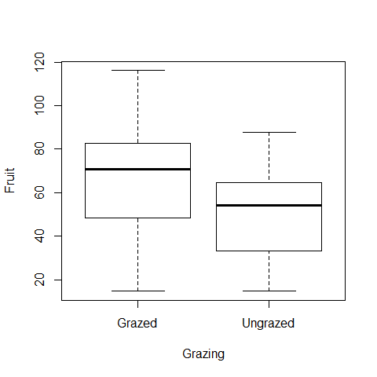

```r
#normality test
shapiro.test(Fruit[Grazing=="Grazed"])
```

```
## 
## 	Shapiro-Wilk normality test
## 
## data:  Fruit[Grazing == "Grazed"]
## W = 0.9795, p-value = 0.9276
```

```r
shapiro.test(Fruit[Grazing=="Ungrazed"])
```

```
## 
## 	Shapiro-Wilk normality test
## 
## data:  Fruit[Grazing == "Ungrazed"]
## W = 0.9537, p-value = 0.4272
```

```r
library(car)
```

```
## Warning: package 'car' was built under R version 3.0.3
```

```
## 
## Attaching package: 'car'
## 
## Das folgende Objekt ist maskiert from 'package:effects':
## 
##     Prestige
```

```r
leveneTest(Fruit~Grazing)
```

```
## Levene's Test for Homogeneity of Variance (center = median)
##       Df F value Pr(>F)
## group  1    0.15    0.7
##       38
```

```r
t.test(Fruit~Grazing,var.eq=TRUE,paired=F)
```

```
## 
## 	Two Sample t-test
## 
## data:  Fruit by Grazing
## t = 2.304, df = 38, p-value = 0.02678
## alternative hypothesis: true difference in means is not equal to 0
## 95 percent confidence interval:
##   2.071 32.049
## sample estimates:
##   mean in group Grazed mean in group Ungrazed 
##                  67.94                  50.88
```

```r
detach(regrowth)
```

Fruit production was significantly higher in plants that were grazed (mean = 67.9) compared to ungrazed plants (mean = 50.8)
(n grazed = 20; n ungrazed = 20; t = 2.304, df = 38, p-value = 0.02678)

Now we will take the root size in consideration


```r
regrowth <- read.delim("../Data/regrowth.txt")
head(regrowth)
```

```
##    Root Fruit  Grazing
## 1 6.225 59.77 Ungrazed
## 2 6.487 60.98 Ungrazed
## 3 4.919 14.73 Ungrazed
## 4 5.130 19.28 Ungrazed
## 5 5.417 34.25 Ungrazed
## 6 5.359 35.53 Ungrazed
```

```r
attach(regrowth)

par(mfrow=c(1,2))
plot(Fruit~Grazing) # it looks like fruit production is higher if plants are grazed, this would be all if the only data available would be on grazing but we have now to take also into account the root size
plot(Root,Fruit)
```

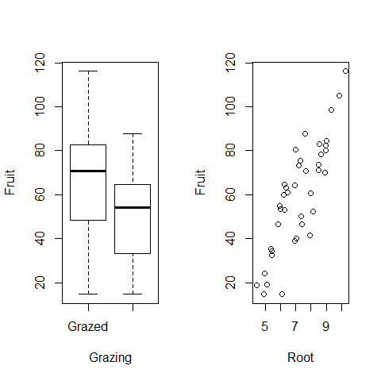

```r
par(mfrow=c(1,1))
```


```r
model1 = lm(Fruit~Grazing*Root)
summary(model1)
```

```
## 
## Call:
## lm(formula = Fruit ~ Grazing * Root)
## 
## Residuals:
##     Min      1Q  Median      3Q     Max 
## -17.318  -2.832   0.125   3.851  17.131 
## 
## Coefficients:
##                      Estimate Std. Error t value Pr(>|t|)    
## (Intercept)          -125.173     12.811   -9.77  1.2e-11 ***
## GrazingUngrazed        30.806     16.842    1.83    0.076 .  
## Root                   23.240      1.531   15.18  < 2e-16 ***
## GrazingUngrazed:Root    0.756      2.354    0.32    0.750    
## ---
## Signif. codes:  0 '***' 0.001 '**' 0.01 '*' 0.05 '.' 0.1 ' ' 1
## 
## Residual standard error: 6.83 on 36 degrees of freedom
## Multiple R-squared:  0.929,	Adjusted R-squared:  0.923 
## F-statistic:  158 on 3 and 36 DF,  p-value: <2e-16
```

```r
#we remove the interaction
model2=lm(Fruit~Grazing+Root)
summary(model2)
```

```
## 
## Call:
## lm(formula = Fruit ~ Grazing + Root)
## 
## Residuals:
##     Min      1Q  Median      3Q     Max 
## -17.192  -2.822   0.322   3.914  17.329 
## 
## Coefficients:
##                 Estimate Std. Error t value Pr(>|t|)    
## (Intercept)      -127.83       9.66   -13.2  1.3e-15 ***
## GrazingUngrazed    36.10       3.36    10.8  6.1e-13 ***
## Root               23.56       1.15    20.5  < 2e-16 ***
## ---
## Signif. codes:  0 '***' 0.001 '**' 0.01 '*' 0.05 '.' 0.1 ' ' 1
## 
## Residual standard error: 6.75 on 37 degrees of freedom
## Multiple R-squared:  0.929,	Adjusted R-squared:  0.925 
## F-statistic:  242 on 2 and 37 DF,  p-value: <2e-16
```

```r
plot(Root,Fruit,col=Grazing,pch=20,cex=3)
```

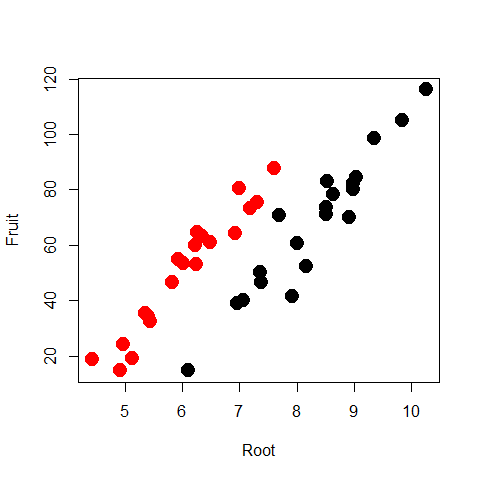

Predict the scenario for Grazed plants with 95% confidence

```r
mydata=data.frame(Root=seq(4.4,10.2,0.1), Grazing="Grazed")
pred1=predict(model2,mydata,type="response",se=T)
myfit1=pred1$fit
myfit1CIup=pred1$fit+1.96*pred1$se.fit
myfit1CIdown=pred1$fit-1.96*pred1$se.fit
lines(mydata$Root,myfit1,col="black")
lines(mydata$Root,myfit1CIup,col="black",lty=2)
lines(mydata$Root,myfit1CIdown,col="black",lty=2)
```


Predict the scenario for Ungrazed plants with 95% confidence

```r
mydata=data.frame(Root=seq(4.4,10.2,0.1), Grazing="Ungrazed")
pred2=predict(model2,mydata,type="response",se=T)
myfit2=pred2$fit
myfit2CIup=pred2$fit+1.96*pred2$se.fit
myfit2CIdown=pred2$fit-1.96*pred2$se.fit
lines(mydata$Root,myfit2,col="red")
lines(mydata$Root,myfit2CIup,col="red",lty=2)
lines(mydata$Root,myfit2CIdown,col="red",lty=2)
legend("topleft",c("Grazed","Ungrazed"), col=c("black","red"),title="Grazing",
       bty="n", pch=c(20,20),cex=2)
```

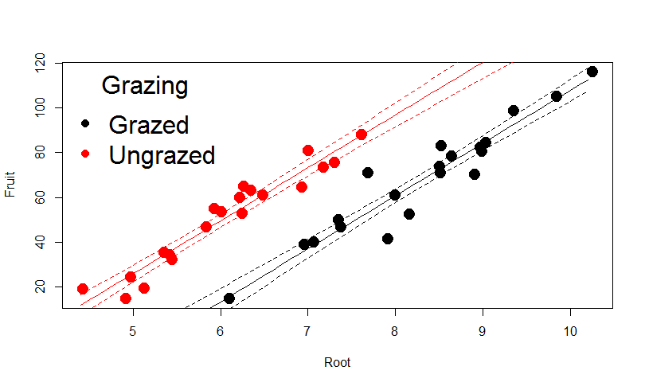


```r
par(mfrow=c(2,2))
plot(model2)
```

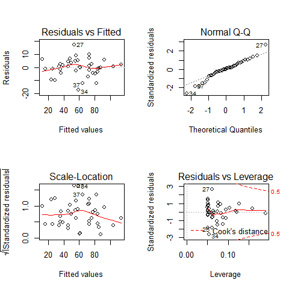

```r
par(mfrow=c(1,1))
```

