```r
library(knitr)
```

```
## Warning: package 'knitr' was built under R version 3.0.3
```

```r
opts_knit$set(global.par=TRUE) 
opts_chunk$set(cache.extra = rand_seed,fig.align='center')
set.seed(23)
```

# The general idea

General ideas of linear regression is that 

* Response is continous, theoretically from -infinity to + infinity
* Residuals are normally distributed around the model predictions

Idea of the GLM framework is take the linear regression framework, but allow relaxing both assumptions. To do this, we have to do two things

* We wrap the linear model in a transformation function that forces the response on the right interval (typical intervals are positive, or between 0 and 1). This transformation is called the link function
* We use other distributions as the Gaussian for the fit.

Those two ideas are explained in more detail below


## Other distributions

## Link function


# Important GLM types

## Logistic Regression

Presence / absence data - binary data
Logistic regression is a method for fitting a regression curve, y = f(x), when y consists of proportions or probabilities, or binary coded (0,1--failure,success) data. When the response is a binary (dichotomous) variable, and x is numerical, logistic regression fits a logistic curve to the relationship between x and y. 


Assumptions:
The true conditional probabilities are a logistic function of the independent variables.
No important variables are omitted.
No extraneous variables are included.
The independent variables are measured without error.
The observations are independent.
The independent variables are not linear combinations of each other.

### Example 1 - Logistic regresion

Binomial data

```r
require(effects) # holds the data
```

```
## Loading required package: effects
```

```
## Warning: package 'effects' was built under R version 3.0.3
```

```r
head(TitanicSurvival)
```

```
##                                 survived    sex     age passengerClass
## Allen, Miss. Elisabeth Walton        yes female 29.0000            1st
## Allison, Master. Hudson Trevor       yes   male  0.9167            1st
## Allison, Miss. Helen Loraine          no female  2.0000            1st
## Allison, Mr. Hudson Joshua Crei       no   male 30.0000            1st
## Allison, Mrs. Hudson J C (Bessi       no female 25.0000            1st
## Anderson, Mr. Harry                  yes   male 48.0000            1st
```

```r
attach(TitanicSurvival)
 
plot(survived ~ age)
```

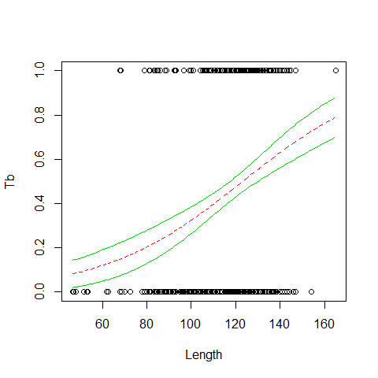

```r
surv <- as.numeric(survived)-1
 
plot(surv ~ age)
```

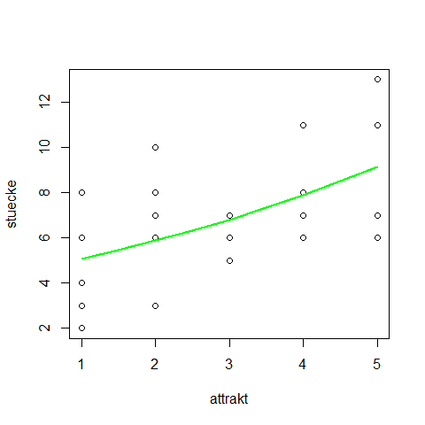

```r
fmt <- glm(surv ~ age + I(age^2) + I(age^3), family=binomial)
summary(fmt)
```

```
## 
## Call:
## glm(formula = surv ~ age + I(age^2) + I(age^3), family = binomial)
## 
## Deviance Residuals: 
##    Min      1Q  Median      3Q     Max  
## -1.506  -0.998  -0.970   1.348   2.014  
## 
## Coefficients:
##              Estimate Std. Error z value Pr(>|z|)    
## (Intercept)  7.85e-01   3.03e-01    2.59   0.0095 ** 
## age         -1.19e-01   3.29e-02   -3.61   0.0003 ***
## I(age^2)     3.41e-03   1.11e-03    3.07   0.0022 ** 
## I(age^3)    -2.93e-05   1.11e-05   -2.65   0.0081 ** 
## ---
## Signif. codes:  0 '***' 0.001 '**' 0.01 '*' 0.05 '.' 0.1 ' ' 1
## 
## (Dispersion parameter for binomial family taken to be 1)
## 
##     Null deviance: 1414.6  on 1045  degrees of freedom
## Residual deviance: 1398.5  on 1042  degrees of freedom
##   (263 observations deleted due to missingness)
## AIC: 1406
## 
## Number of Fisher Scoring iterations: 4
```
 
Showing that residuals are not normal at all
```r
hist(fmt$residuals, breaks = 100)
abline(v = 0, col = "red", lwd = 6, lty = 2)
```
residual plots can also be created with plot(fmt)
 

```r
newage <- seq(min(age, na.rm=T), max(age, na.rm=T), len=100)
preds <- predict(fmt, newdata=data.frame("age"=newage), se.fit=T)
lines(newage, plogis(preds$fit), col="purple", lwd=3)
lines(newage, plogis(preds$fit-2*preds$se.fit), col="purple", lwd=3, lty=2)
lines(newage, plogis(preds$fit+2*preds$se.fit), col="purple", lwd=3, lty=2) 
```

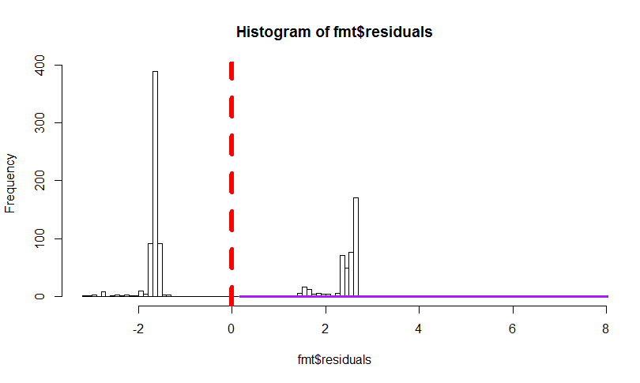

```r
fmt <- glm(surv ~ age + sex + passengerClass, family=binomial)
summary(fmt)
```

```
## 
## Call:
## glm(formula = surv ~ age + sex + passengerClass, family = binomial)
## 
## Deviance Residuals: 
##    Min      1Q  Median      3Q     Max  
## -2.640  -0.698  -0.434   0.669   2.396  
## 
## Coefficients:
##                   Estimate Std. Error z value Pr(>|z|)    
## (Intercept)        3.52207    0.32670   10.78  < 2e-16 ***
## age               -0.03439    0.00633   -5.43  5.6e-08 ***
## sexmale           -2.49784    0.16604  -15.04  < 2e-16 ***
## passengerClass2nd -1.28057    0.22554   -5.68  1.4e-08 ***
## passengerClass3rd -2.28966    0.22580  -10.14  < 2e-16 ***
## ---
## Signif. codes:  0 '***' 0.001 '**' 0.01 '*' 0.05 '.' 0.1 ' ' 1
## 
## (Dispersion parameter for binomial family taken to be 1)
## 
##     Null deviance: 1414.62  on 1045  degrees of freedom
## Residual deviance:  982.45  on 1041  degrees of freedom
##   (263 observations deleted due to missingness)
## AIC: 992.5
## 
## Number of Fisher Scoring iterations: 4
```

```r
detach(TitanicSurvival)
```


### Example 2 - Logistic regresion 

Wild boar with/without tubercolosis as a function of body lenght (age is collinear with length)

```r
Boar <- read.delim("Z:/GitHub/RMarkdowns - Stat with R/10_GLM binomial/Boar.txt")
Boar <- Boar[!(is.na(Boar$LengthCT)) & !(is.na(Boar$Tb)),]
head(Boar)
```

```
##   Tb SEX AgeClass LengthCT
## 1  0   1        1     46.5
## 2  0   2        1     47.0
## 3  0   1        1     48.0
## 4  0   1        1     51.5
## 5  0   2        1     53.0
## 6  0   2        1     53.0
```

```r
summary(Boar)
```

```
##        Tb             SEX          AgeClass       LengthCT    
##  Min.   :0.000   Min.   :1.00   Min.   :1.00   Min.   : 46.5  
##  1st Qu.:0.000   1st Qu.:1.00   1st Qu.:3.00   1st Qu.:106.5  
##  Median :0.000   Median :2.00   Median :3.00   Median :121.5  
##  Mean   :0.459   Mean   :1.58   Mean   :3.13   Mean   :117.0  
##  3rd Qu.:1.000   3rd Qu.:2.00   3rd Qu.:4.00   3rd Qu.:130.0  
##  Max.   :1.000   Max.   :2.00   Max.   :4.00   Max.   :165.0  
##                  NA's   :14
```

```r
cor(Boar[,c(3,4)], use="pairwise.complete.obs")
```

```
##          AgeClass LengthCT
## AgeClass    1.000    0.891
## LengthCT    0.891    1.000
```

Data exploration

```r
attach(Boar)
boxplot(LengthCT~Tb,ylab='body length',xlab='Tb')
```

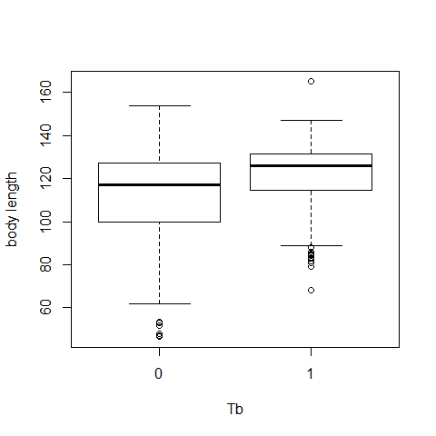

```r
plot(x=Boar$LengthCT, y = Boar$Tb,xlab="Length", ylab="Tb")

B0=lm(Tb ~LengthCT, data = Boar)
abline(B0) 
```

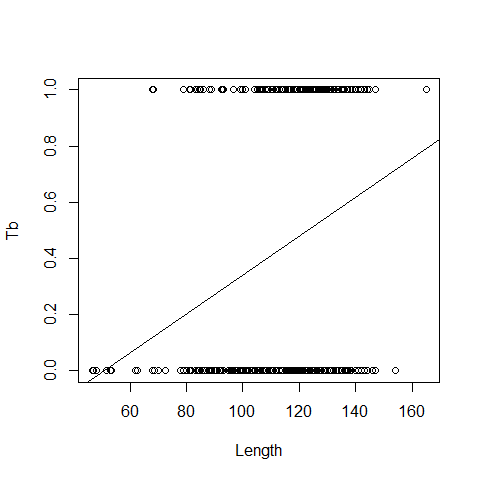
The wrong model, as we are working with probabilities, while linear regression also predicts negative probabilities and it is not possible a negative probability of getting sick

We need a function that maps the values between 0 and 1 (e.g., logit link, probit link, clog-log link, log-log link).
The default is logit link


```r
B1=glm(Tb ~LengthCT, family = binomial, data = Boar) # logit link is the default
summary(B1)
```

```
## 
## Call:
## glm(formula = Tb ~ LengthCT, family = binomial, data = Boar)
## 
## Deviance Residuals: 
##    Min      1Q  Median      3Q     Max  
## -1.609  -1.120  -0.709   1.126   1.952  
## 
## Coefficients:
##             Estimate Std. Error z value Pr(>|z|)    
## (Intercept) -3.89211    0.67115   -5.80  6.7e-09 ***
## LengthCT     0.03161    0.00559    5.66  1.5e-08 ***
## ---
## Signif. codes:  0 '***' 0.001 '**' 0.01 '*' 0.05 '.' 0.1 ' ' 1
## 
## (Dispersion parameter for binomial family taken to be 1)
## 
##     Null deviance: 700.76  on 507  degrees of freedom
## Residual deviance: 663.56  on 506  degrees of freedom
## AIC: 667.6
## 
## Number of Fisher Scoring iterations: 4
```

Probability that an animal is infected is:
p=(e^(-3.89+0.03length))/ (1 + e^( -3.89+0.03length))


```r
plot(x=Boar$LengthCT, y = Boar$Tb,xlab="Length", ylab="Tb")
MyData=data.frame(LengthCT= seq(from = 46.5, to =165, by = 1))
Pred<- predict(B1,newdata = MyData, type = "response")
lines(MyData$LengthCT,Pred,col=2,lty=2)
```

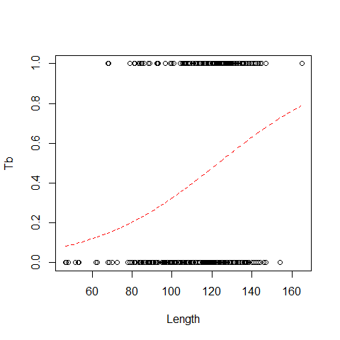

Alternatively

```r
plot.new()
curve(predict(B1,data.frame(LengthCT=x),type="resp"),add=TRUE,col=3) 
```


or we can use the "popbio" package

```r
library(popbio)
```

```
## Loading required package: quadprog
```

```r
logi.hist.plot(LengthCT,Tb,boxp=FALSE,type="hist",col="gray")
```

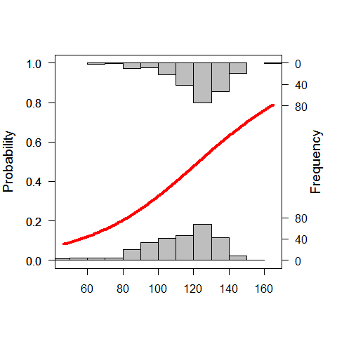

another option is to use a GLM

```r
B1.A=glm(Tb ~LengthCT, family = binomial(link="probit"), data = Boar)
summary(B1.A)
```

```
## 
## Call:
## glm(formula = Tb ~ LengthCT, family = binomial(link = "probit"), 
##     data = Boar)
## 
## Deviance Residuals: 
##    Min      1Q  Median      3Q     Max  
## -1.606  -1.122  -0.709   1.127   1.971  
## 
## Coefficients:
##             Estimate Std. Error z value Pr(>|z|)    
## (Intercept) -2.37915    0.39528   -6.02  1.8e-09 ***
## LengthCT     0.01932    0.00331    5.85  5.0e-09 ***
## ---
## Signif. codes:  0 '***' 0.001 '**' 0.01 '*' 0.05 '.' 0.1 ' ' 1
## 
## (Dispersion parameter for binomial family taken to be 1)
## 
##     Null deviance: 700.76  on 507  degrees of freedom
## Residual deviance: 663.58  on 506  degrees of freedom
## AIC: 667.6
## 
## Number of Fisher Scoring iterations: 4
```
logit and probit links assume that there are about the same number of zeros and ones
clog-log is a good option if there are a lots of zeros, or viceversa family = binomial(link="cloglog")


```r
plot(x=Boar$LengthCT, y = Boar$Tb,xlab="Length", ylab="Tb")
MyData=data.frame(LengthCT= seq(from = 46.5, to =165, by = 1))
Pred<- predict(B1.A,newdata = MyData, type = "response")
lines(MyData$LengthCT,Pred,col=2,lty=2)
```


Pseudo R Square

```r
#Null Deviance - residual Deviance / Null Deviance
((B1.A$null.deviance-B1.A$deviance)/B1.A$null.deviance)*100   #5% of total variability explained
```

```
## [1] 5.307
```


### Example 3 - Logistic regresion 

Parasites in cod (fish)

```r
ParasiteCod <- read.delim("Z:/GitHub/RMarkdowns - Stat with R/10_GLM binomial/ParasiteCod.txt")
head(ParasiteCod)
```

```
##   Sample Intensity Prevalence Year Depth Weight Length Sex Stage Age Area
## 1      1         0          0 1999   220    148     26   0     0   0    2
## 2      2         0          0 1999   220    144     26   0     0   0    2
## 3      3         0          0 1999   220    146     27   0     0   0    2
## 4      4         0          0 1999   220    138     26   0     0   0    2
## 5      5         0          0 1999   220     40     17   0     0   0    2
## 6      6         0          0 1999   220     68     20   0     0   0    2
```

Response variable: Prevalance 0 1
Explanatories: year, area, depth at which the fishes were caught
Depth and area are collinear; other explanatories are sex, length, weight, stage, age..all collinear except for sex


```r
ParasiteCod$fArea = factor(ParasiteCod$Area)

attach(ParasiteCod)
P1 = glm(Prevalence ~ fArea + Length,
               family = binomial, data = ParasiteCod)  

summary(P1)
```

```
## 
## Call:
## glm(formula = Prevalence ~ fArea + Length, family = binomial, 
##     data = ParasiteCod)
## 
## Deviance Residuals: 
##    Min      1Q  Median      3Q     Max  
## -1.815  -0.970  -0.835   1.157   1.629  
## 
## Coefficients:
##             Estimate Std. Error z value Pr(>|z|)    
## (Intercept) -0.47695    0.26307   -1.81   0.0698 .  
## fArea2      -0.70834    0.18143   -3.90  9.5e-05 ***
## fArea3      -0.57601    0.15922   -3.62   0.0003 ***
## fArea4       1.07060    0.17839    6.00  2.0e-09 ***
## Length       0.00874    0.00434    2.01   0.0441 *  
## ---
## Signif. codes:  0 '***' 0.001 '**' 0.01 '*' 0.05 '.' 0.1 ' ' 1
## 
## (Dispersion parameter for binomial family taken to be 1)
## 
##     Null deviance: 1727.8  on 1247  degrees of freedom
## Residual deviance: 1592.0  on 1243  degrees of freedom
##   (6 observations deleted due to missingness)
## AIC: 1602
## 
## Number of Fisher Scoring iterations: 4
```

```r
plot(Length,Prevalence)

MyData=data.frame(Length= seq(from = 20, to =100, by = 1),fArea="1")
Pred<- predict(P1,newdata = MyData, type = "response")
lines(MyData$Length,Pred,col=1,lty=1)

MyData=data.frame(Length= seq(from = 20, to =100, by = 1),fArea="2")
Pred<- predict(P1,newdata = MyData, type = "response")
lines(MyData$Length,Pred,col=2,lty=2)

MyData=data.frame(Length= seq(from = 20, to =100, by = 1),fArea="3")
Pred<- predict(P1,newdata = MyData, type = "response")
lines(MyData$Length,Pred,col=3,lty=3)

MyData=data.frame(Length= seq(from = 20, to =100, by = 1),fArea="4")
Pred<- predict(P1,newdata = MyData, type = "response")
lines(MyData$Length,Pred,col=4,lty=4)
```

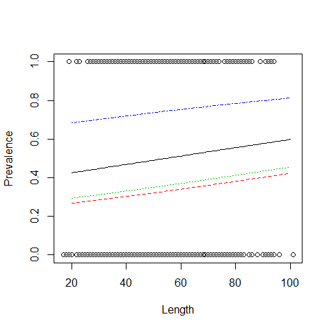

A much handier way

```r
plot.new()
curve(predict(P1,data.frame(Length=x,fArea="1"),type="resp"),add=TRUE,col=1,lwd=2)
curve(predict(P1,data.frame(Length=x,fArea="2"),type="resp"),add=TRUE,col=2,lwd=2)
curve(predict(P1,data.frame(Length=x,fArea="3"),type="resp"),add=TRUE,col=3,lwd=2)
curve(predict(P1,data.frame(Length=x,fArea="4"),type="resp"),add=TRUE,col=4,lwd=2)
```

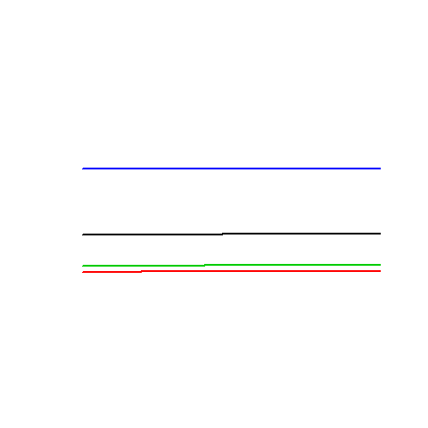


### Example 4 - Logistic regresion  

Tubercolosis in deer, this time proportion data (ranging from 0 to 1)

```r
Tbdeer <- read.delim("Z:/GitHub/RMarkdowns - Stat with R/10_GLM binomial/Tbdeer.txt")
head(Tbdeer)
```

```
##   Farm BoarPosTB BoarSampledTB DeerPosTB DeerSampledTB DeerPosCervi
## 1    1         4            14        NA            NA           NA
## 2    2        20            34         3            13            6
## 3    3         2             5         0            23           28
## 4    4         8            13         1            39           39
## 5    5         7            23         0             6           13
## 6    6        11            20         2            36           19
##   DeerSampledCervi OpenLand ScrubLand PinePlantation QuercusPlants
## 1               NA    0.409     0.591          0.000         7.000
## 2               15    0.412     0.059          0.000        14.706
## 3               28    0.182     0.136          0.091         5.318
## 4               45    0.300     0.250          0.000        14.737
## 5               13    0.000     0.571          0.000         9.333
## 6               25    0.286     0.476          0.000        21.543
##   QuercusTrees WildBoarIndex ReedDeerIndex EstateSize Fenced
## 1        1.619         0.095         0.000        960      0
## 2        0.118         0.576        17.470       1100      1
## 3        4.045         0.450        19.412       2200      1
## 4        4.200         0.100         6.318       1700      1
## 5        0.952         0.000         4.364       4000      0
## 6        2.972         0.238         5.141      19328      0
```

```r
Tbdeer$DeerPosProp = Tbdeer$DeerPosCervi / Tbdeer$DeerSampledCervi  # proportion of deer infected

Tbdeer$fFenced = factor(Tbdeer$Fenced)
```

Effect of percentage open land, scrubs, pine plantation, number of quercus per unit area, red deer abundance index, estate size, estate fenced ON probability of getting infected


```r
Deer2 <- glm(DeerPosProp~OpenLand+ScrubLand+ReedDeerIndex+
        fFenced,
        family=binomial,weights=DeerSampledCervi,data = Tbdeer)

summary(Deer2)
```

```
## 
## Call:
## glm(formula = DeerPosProp ~ OpenLand + ScrubLand + ReedDeerIndex + 
##     fFenced, family = binomial, data = Tbdeer, weights = DeerSampledCervi)
## 
## Deviance Residuals: 
##    Min      1Q  Median      3Q     Max  
## -8.652  -0.827   0.560   2.057   3.877  
## 
## Coefficients:
##               Estimate Std. Error z value Pr(>|z|)    
## (Intercept)     2.3635     0.3608    6.55  5.7e-11 ***
## OpenLand       -3.3056     0.5493   -6.02  1.8e-09 ***
## ScrubLand      -0.7810     0.5271   -1.48   0.1384    
## ReedDeerIndex   0.0629     0.0203    3.11   0.0019 ** 
## fFenced1       -1.1491     0.3582   -3.21   0.0013 ** 
## ---
## Signif. codes:  0 '***' 0.001 '**' 0.01 '*' 0.05 '.' 0.1 ' ' 1
## 
## (Dispersion parameter for binomial family taken to be 1)
## 
##     Null deviance: 235.58  on 23  degrees of freedom
## Residual deviance: 164.83  on 19  degrees of freedom
##   (8 observations deleted due to missingness)
## AIC: 233.9
## 
## Number of Fisher Scoring iterations: 4
```

This is a Binomial GLM with proportion data.
We can have overdispersion. 
Residual deviance / df should be ~1


```r
Deer2$deviance / Deer2$df.residual #~9
```

```
## [1] 8.675
```

```r
library(effects)
plot(allEffects(Deer2))
```

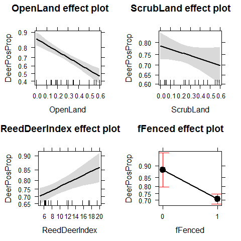

We add a dispersion parameter to the variance of Y

```r
Deer3 <- glm(DeerPosProp~OpenLand+ScrubLand+ReedDeerIndex+
        fFenced,
             family=quasibinomial,weights=DeerSampledCervi,data = Tbdeer)
summary(Deer3)
```

```
## 
## Call:
## glm(formula = DeerPosProp ~ OpenLand + ScrubLand + ReedDeerIndex + 
##     fFenced, family = quasibinomial, data = Tbdeer, weights = DeerSampledCervi)
## 
## Deviance Residuals: 
##    Min      1Q  Median      3Q     Max  
## -8.652  -0.827   0.560   2.057   3.877  
## 
## Coefficients:
##               Estimate Std. Error t value Pr(>|t|)  
## (Intercept)     2.3635     1.1133    2.12    0.047 *
## OpenLand       -3.3056     1.6949   -1.95    0.066 .
## ScrubLand      -0.7810     1.6262   -0.48    0.637  
## ReedDeerIndex   0.0629     0.0625    1.01    0.327  
## fFenced1       -1.1491     1.1051   -1.04    0.311  
## ---
## Signif. codes:  0 '***' 0.001 '**' 0.01 '*' 0.05 '.' 0.1 ' ' 1
## 
## (Dispersion parameter for quasibinomial family taken to be 9.52)
## 
##     Null deviance: 235.58  on 23  degrees of freedom
## Residual deviance: 164.83  on 19  degrees of freedom
##   (8 observations deleted due to missingness)
## AIC: NA
## 
## Number of Fisher Scoring iterations: 4
```

```r
Deer3$deviance / Deer3$df.residual
```

```
## [1] 8.675
```

```r
plot(allEffects(Deer3))
```

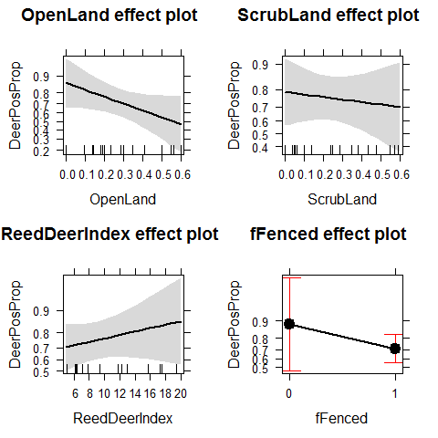

We have lost many of the significant patters that were biased by overdispersion.
The new results look pretty different


```r
plot(Tbdeer$OpenLand,Tbdeer$DeerPosProp)

curve(predict(Deer3,data.frame(OpenLand=x,   # scenario "no fenced"
      ScrubLand=mean(Tbdeer$ScrubLand),
      ReedDeerIndex=mean(Tbdeer$ReedDeerIndex),
      fFenced="0"),type="resp"),add=TRUE,col=1,lwd=2)

curve(predict(Deer3,data.frame(OpenLand=x,  # scenario "fenced"
      ScrubLand=mean(Tbdeer$ScrubLand),
      ReedDeerIndex=mean(Tbdeer$ReedDeerIndex),
      fFenced="1"),type="resp"),add=TRUE,col=2,lwd=2)
```

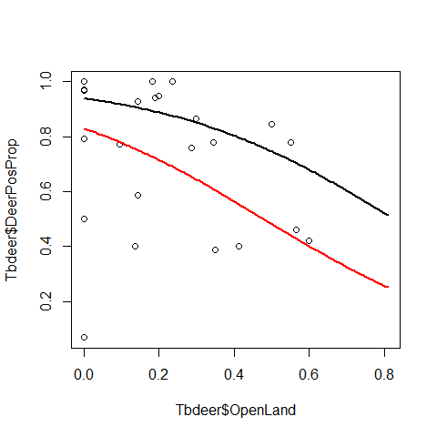

Plotting predictions with 95% CIs

```r
Boar <- read.delim("Z:/GitHub/RMarkdowns - Stat with R/10_GLM binomial/Boar.txt")
Boar <- Boar[!(is.na(Boar$LengthCT)) & !(is.na(Boar$Tb)),]
head(Boar)
```

```
##   Tb SEX AgeClass LengthCT
## 1  0   1        1     46.5
## 2  0   2        1     47.0
## 3  0   1        1     48.0
## 4  0   1        1     51.5
## 5  0   2        1     53.0
## 6  0   2        1     53.0
```

```r
summary(Boar)
```

```
##        Tb             SEX          AgeClass       LengthCT    
##  Min.   :0.000   Min.   :1.00   Min.   :1.00   Min.   : 46.5  
##  1st Qu.:0.000   1st Qu.:1.00   1st Qu.:3.00   1st Qu.:106.5  
##  Median :0.000   Median :2.00   Median :3.00   Median :121.5  
##  Mean   :0.459   Mean   :1.58   Mean   :3.13   Mean   :117.0  
##  3rd Qu.:1.000   3rd Qu.:2.00   3rd Qu.:4.00   3rd Qu.:130.0  
##  Max.   :1.000   Max.   :2.00   Max.   :4.00   Max.   :165.0  
##                  NA's   :14
```

```r
B1=glm(Tb ~LengthCT, family = binomial, data = Boar) # logit link is the default
summary(B1)
```

```
## 
## Call:
## glm(formula = Tb ~ LengthCT, family = binomial, data = Boar)
## 
## Deviance Residuals: 
##    Min      1Q  Median      3Q     Max  
## -1.609  -1.120  -0.709   1.126   1.952  
## 
## Coefficients:
##             Estimate Std. Error z value Pr(>|z|)    
## (Intercept) -3.89211    0.67115   -5.80  6.7e-09 ***
## LengthCT     0.03161    0.00559    5.66  1.5e-08 ***
## ---
## Signif. codes:  0 '***' 0.001 '**' 0.01 '*' 0.05 '.' 0.1 ' ' 1
## 
## (Dispersion parameter for binomial family taken to be 1)
## 
##     Null deviance: 700.76  on 507  degrees of freedom
## Residual deviance: 663.56  on 506  degrees of freedom
## AIC: 667.6
## 
## Number of Fisher Scoring iterations: 4
```

```r
plot(x=Boar$LengthCT, y = Boar$Tb,xlab="Length", ylab="Tb")
MyData=data.frame(LengthCT= seq(from = 46.5, to =165, by = 1))
Pred<- predict(B1,newdata = MyData, type = "response",se=T)

lines(MyData$LengthCT,Pred$fit,col=2,lty=2)
lines(MyData$LengthCT,Pred$fit+1.96*Pred$se.fit,col=3,lty=1)
lines(MyData$LengthCT,Pred$fit-1.96*Pred$se.fit,col=3,lty=1)
```


## Poisson Regression

### Example 1 - Poisson Regression


```r
cfc <- data.frame(
  stuecke = c(3,6,8,4,2,7,6,8,10,3,5,7,6,7,5,6,7,11,8,11,13,11,7,7,6),
  attrakt = c(1,1,1,1,1,2,2,2,2,2,3,3,3,3,3,4,4,4,4,4,5,5,5,5,5) 
)
attach(cfc)
plot(stuecke ~ attrakt)
 
fm <- glm(stuecke ~ attrakt, family=poisson)
summary(fm)
```

```
## 
## Call:
## glm(formula = stuecke ~ attrakt, family = poisson)
## 
## Deviance Residuals: 
##    Min      1Q  Median      3Q     Max  
## -1.554  -0.728   0.037   0.591   1.546  
## 
## Coefficients:
##             Estimate Std. Error z value Pr(>|z|)    
## (Intercept)   1.4746     0.1944    7.58  3.3e-14 ***
## attrakt       0.1479     0.0544    2.72   0.0065 ** 
## ---
## Signif. codes:  0 '***' 0.001 '**' 0.01 '*' 0.05 '.' 0.1 ' ' 1
## 
## (Dispersion parameter for poisson family taken to be 1)
## 
##     Null deviance: 25.829  on 24  degrees of freedom
## Residual deviance: 18.320  on 23  degrees of freedom
## AIC: 115.4
## 
## Number of Fisher Scoring iterations: 4
```

```r
newattrakt <- c(1,1.5,2,2.5,3,3.5,4,4.5,5)
preds <- predict(fm, newdata=data.frame("attrakt"=newattrakt))
lines(newattrakt, exp(preds), lwd=2, col="green")
```


same with 95% confidence interval:

```r
preds <- predict(fm, newdata=data.frame("attrakt"=newattrakt), se.fit=T)
plot.new()
str(preds)
```

```
## List of 3
##  $ fit           : Named num [1:9] 1.62 1.7 1.77 1.84 1.92 ...
##   ..- attr(*, "names")= chr [1:9] "1" "2" "3" "4" ...
##  $ se.fit        : Named num [1:9] 0.1459 0.1235 0.1034 0.0872 0.0775 ...
##   ..- attr(*, "names")= chr [1:9] "1" "2" "3" "4" ...
##  $ residual.scale: num 1
```

```r
lines(newattrakt, exp(preds$fit), lwd=2, col="green")
lines(newattrakt, exp(preds$fit+2*preds$se.fit), lwd=2, col="green", lty=2)
lines(newattrakt, exp(preds$fit-2*preds$se.fit), lwd=2, col="green", lty=2)
```


```r
detach(cfc)
```


### Example 2 - Poisson Regression 

Road kills data of amphibians species along a road in Portugal

```r
load("Z:/GitHub/RMarkdowns - Stat with R/11_GLM Poisson & quasi_poisson/RK.RData")
head(RK)
```

```
##   Sector      X      Y BufoCalamita TOT.N S.RICH OPEN.L OLIVE MONT.S
## 1      1 260181 256546            5    22      3  22.68 60.33  0.000
## 2      2 259914 256124            1    14      4  24.66 40.83  0.000
## 3      3 259672 255688           40    65      6  30.12 23.71  0.258
## 4      4 259454 255238           27    55      5  50.28 14.94  1.783
## 5      5 259307 254763           67    88      4  43.61 35.35  2.431
## 6      6 259189 254277           56   104      7  31.39 17.67  0.000
##     MONT POLIC SHRUB  URBAN WAT.RES L.WAT.C L.D.ROAD L.P.ROAD D.WAT.RES
## 1  0.653 4.811 0.406  7.787   0.043   0.583     3330    1.975    252.11
## 2  0.161 2.224 0.735 27.150   0.182   1.419     2587    1.761    139.57
## 3 10.918 1.946 0.474 28.086   0.453   2.005     2150    1.250     59.17
## 4 26.454 0.625 0.607  0.831   0.026   1.924     4223    0.666    277.84
## 5 11.330 0.791 0.173  2.452   0.000   2.167     2219    0.653    967.81
## 6 43.678 0.054 0.325  2.730   0.039   2.391     1006    1.309    560.00
##   D.WAT.COUR D.PARK N.PATCH P.EDGE L.SDI
## 1     735.00  250.2     122  553.9 1.801
## 2     134.05  741.2      96  457.1 1.886
## 3     269.03 1240.1      67  432.4 1.930
## 4      48.75 1739.9      63  421.3 1.865
## 5     126.10 2232.1      59  407.6 1.818
## 6     344.44 2724.1      49  420.3 1.799
```

First plot the relationship between the distance to the closest Park and the number of road kills (TOT.N) 

```r
plot(RK$D.PARK,RK$TOT.N,xlab="Distance to park",
     ylab="Road kills")
```

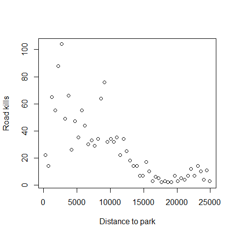

Next we fit out the Poisson GLM

```r
M1<-glm(TOT.N~D.PARK,family=poisson,data=RK)
summary(M1)
```

```
## 
## Call:
## glm(formula = TOT.N ~ D.PARK, family = poisson, data = RK)
## 
## Deviance Residuals: 
##    Min      1Q  Median      3Q     Max  
## -8.110  -1.695  -0.471   1.421   7.334  
## 
## Coefficients:
##              Estimate Std. Error z value Pr(>|z|)    
## (Intercept)  4.32e+00   4.32e-02    99.9   <2e-16 ***
## D.PARK      -1.06e-04   4.39e-06   -24.1   <2e-16 ***
## ---
## Signif. codes:  0 '***' 0.001 '**' 0.01 '*' 0.05 '.' 0.1 ' ' 1
## 
## (Dispersion parameter for poisson family taken to be 1)
## 
##     Null deviance: 1071.4  on 51  degrees of freedom
## Residual deviance:  390.9  on 50  degrees of freedom
## AIC: 634.3
## 
## Number of Fisher Scoring iterations: 4
```
There is a log link between the mean of Y and the predictor function that ensures that fitted values are always non negative, unlike linear regression

Pseudo R-squared for Poisson GLMs

```r
100*(M1$null.deviance-M1$deviance)/M1$null.deviance
```

```
## [1] 63.52
```

Null and residual deviance:
1) null and residual deviance are sort of equivalent of sum of squares and residual sum of squares
2) null deviance is the residual deviance in the only-intercept model, e.g the worst possible model

Plotting the fitted values

```r
MyData=data.frame(D.PARK=seq(from=0,to=25000,by=1000))
G<-predict(M1,newdata=MyData,type="link",se=T)
F<-exp(G$fit)
FSEUP<-exp(G$fit+1.96*G$se.fit)
FSELOW<-exp(G$fit-1.96*G$se.fit)
plot(RK$D.PARK,RK$TOT.N,xlab="Distance to park",
     ylab="Road kills")
lines(MyData$D.PARK,F,lty=1)
lines(MyData$D.PARK,FSEUP,lty=2)
lines(MyData$D.PARK,FSELOW,lty=2)
```

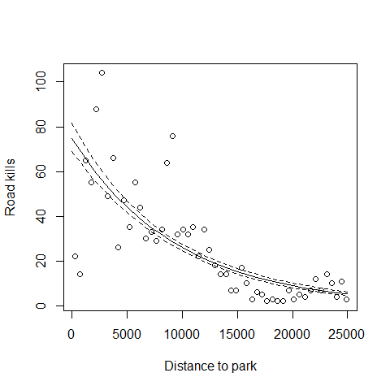

Back to the summary

```r
summary(M1)
```

```
## 
## Call:
## glm(formula = TOT.N ~ D.PARK, family = poisson, data = RK)
## 
## Deviance Residuals: 
##    Min      1Q  Median      3Q     Max  
## -8.110  -1.695  -0.471   1.421   7.334  
## 
## Coefficients:
##              Estimate Std. Error z value Pr(>|z|)    
## (Intercept)  4.32e+00   4.32e-02    99.9   <2e-16 ***
## D.PARK      -1.06e-04   4.39e-06   -24.1   <2e-16 ***
## ---
## Signif. codes:  0 '***' 0.001 '**' 0.01 '*' 0.05 '.' 0.1 ' ' 1
## 
## (Dispersion parameter for poisson family taken to be 1)
## 
##     Null deviance: 1071.4  on 51  degrees of freedom
## Residual deviance:  390.9  on 50  degrees of freedom
## AIC: 634.3
## 
## Number of Fisher Scoring iterations: 4
```
Remember that the potential problem with Poisson GLMs is overdispersion
Overdispersion means that the variance is LARGER than the mean (when we compare  what we could expect from a poisson distribution)

There are 3 options to check for overdispersion:
1) Residual Deviance / degrees of freedom

```r
M1$deviance/M1$df.residual
```

```
## [1] 7.818
```
Model clearly over-dispersed, it is 7.8 when it should be 1

2) 1-pchisq(residual deviance,df)

```r
1-pchisq(M1$deviance,M1$df.residual)
```

```
## [1] 0
```
Model overdispersed


3)In the R package AER we can find  the function dispersiontest, which implements a Test for Overdispersion by Cameron & Trivedi (1990)

```r
library(AER)
```

```
## Warning: package 'AER' was built under R version 3.0.3
```

```
## Loading required package: car
```

```
## Warning: package 'car' was built under R version 3.0.3
```

```
## 
## Attaching package: 'car'
## 
## Das folgende Objekt ist maskiert from 'package:effects':
## 
##     Prestige
## 
## Loading required package: lmtest
```

```
## Warning: package 'lmtest' was built under R version 3.0.3
```

```
## Loading required package: zoo
```

```
## Warning: package 'zoo' was built under R version 3.0.3
```

```
## 
## Attaching package: 'zoo'
## 
## Die folgenden Objekte sind maskiert from 'package:base':
## 
##     as.Date, as.Date.numeric
## 
## Loading required package: sandwich
```

```
## Warning: package 'sandwich' was built under R version 3.0.3
```

```
## Loading required package: survival
## Loading required package: splines
```

```r
dispersiontest(M1,trafo=1)  
```

```
## 
## 	Overdispersion test
## 
## data:  M1
## z = 3.219, p-value = 0.0006423
## alternative hypothesis: true alpha is greater than 0
## sample estimates:
## alpha 
## 6.366
```
Model clearly over-dispersed, alfa should be 0


There 2 ways to solve this:
1) By running a quasi-Poisson model 
2) Moving to the next level with a Negative-Binomial model

Quasi-Poisson model:
Sometimes spread in count data is larger than what is possible to be modelled with a POISSON distribution
It is possible to introduce a dispersion parameter p [p > 1 allows more spread than the standard Poisson mean-variance relationship (overdispersion); on the other hand, p < 1 means underdispersion] 
The estimation of a Poisson regression model with a dispersion parameter p is called quasi-likelihood (or quasi-Poisson), technically is no longer a poisson model.
As we introduce a dispersion parameter p, all SEs are multiplied with the square root of p.


```r
M2<-glm(TOT.N~D.PARK,family=quasipoisson,data=RK)
```
This is not a quasipoisson distribution (it does not exist)
This is a Poisson corrected for overdispersion, a quasi-GLM model


```r
summary(M2)
```

```
## 
## Call:
## glm(formula = TOT.N ~ D.PARK, family = quasipoisson, data = RK)
## 
## Deviance Residuals: 
##    Min      1Q  Median      3Q     Max  
## -8.110  -1.695  -0.471   1.421   7.334  
## 
## Coefficients:
##              Estimate Std. Error t value Pr(>|t|)    
## (Intercept)  4.32e+00   1.19e-01   36.16  < 2e-16 ***
## D.PARK      -1.06e-04   1.21e-05   -8.73  1.2e-11 ***
## ---
## Signif. codes:  0 '***' 0.001 '**' 0.01 '*' 0.05 '.' 0.1 ' ' 1
## 
## (Dispersion parameter for quasipoisson family taken to be 7.63)
## 
##     Null deviance: 1071.4  on 51  degrees of freedom
## Residual deviance:  390.9  on 50  degrees of freedom
## AIC: NA
## 
## Number of Fisher Scoring iterations: 4
```

Plot the predictions one more time but this time corrected for overdispersion


```r
MyData=data.frame(D.PARK=seq(from=0,to=25000,by=1000))
G<-predict(M2,newdata=MyData,type="link",se=T)
F<-exp(G$fit)
FSEUP<-exp(G$fit+1.96*G$se.fit)
FSELOW<-exp(G$fit-1.96*G$se.fit)
plot(RK$D.PARK,RK$TOT.N,xlab="Distance to park",
     ylab="Road kills")
lines(MyData$D.PARK,F,lty=1,col=2,lwd=4)
lines(MyData$D.PARK,FSEUP,lty=2,col=2)
lines(MyData$D.PARK,FSELOW,lty=2,col=2)
```

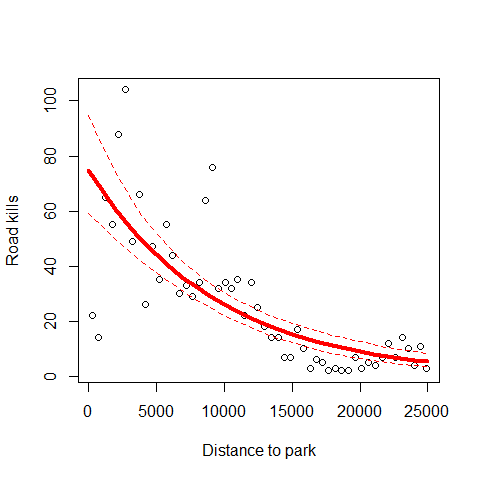
When comparing this model predictions (where we deal with overdispersion) with the first Poisson model, we can observe the same fitted values but completely different errors.

# Technical details 


```r
## Poisson with optimization by hand
 
# data
cfc <- data.frame(
  stuecke = c(3,6,8,4,2,7,6,8,10,3,5,7,6,7,5,6,7,11,8,11,13,11,7,7,6),
  attrakt = c(1,1,1,1,1,2,2,2,2,2,3,3,3,3,3,4,4,4,4,4,5,5,5,5,5) 
)
attach(cfc)
plot(stuecke ~ attrakt)
```

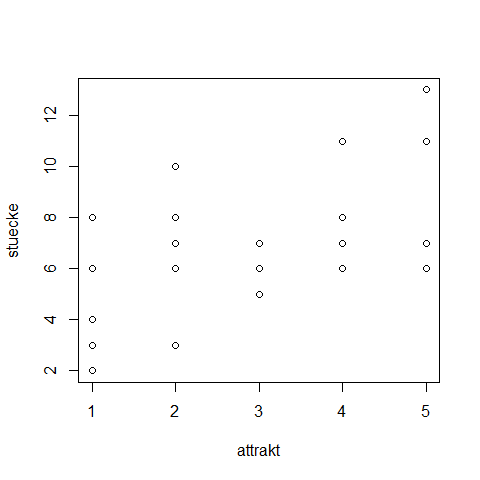

```r
# defining the likelihood of a Poisson regression
 
loglikelihood <- function(par, independent = attrakt, observed = stuecke){
  linear = par[1]*independent + par[2]  # linear predictor
  predict = exp(linear)                 # link function
  logprobabilities = dpois(observed, predict, log=T)  # distribution
  return(-sum(logprobabilities))
}
 
# plotting the likelihood for different slopes, fixed intercept
 
slope=seq(0.05,0.25,length.out = 100)
intercept = rep(1.4,100)
pars = cbind(slope, intercept)
plot(slope, apply(pars,1, loglikelihood), main = "Likelihood profile", ylab = "Neg Log Likelihood")
```

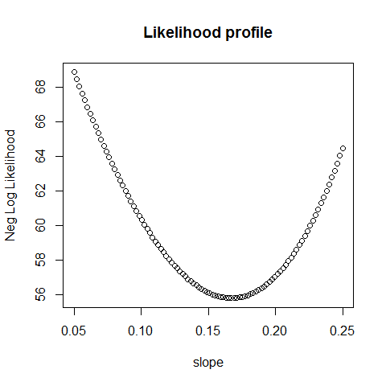

```r
# plotting the likelihood surface (= likelihood as a function of slope, intercept)
 
intercept = seq(1.2,1.7,length.out = 100)
parametervalues = expand.grid(slope,intercept)
parametervalues$response = apply(parametervalues,1, loglikelihood)
contour(slope, intercept, matrix(parametervalues$response, nrow = 100), nlevels = 20, main = "Likelihood response surface", xlab = "slope parameter", ylab = "intercept parameter")
 
 
# optimization with the optim function
 
bestfit = optim(c(0.12,1.3), loglikelihood, method = "BFGS")
points(bestfit$par[1], bestfit$par[2], col = "red", lwd = 4)
```

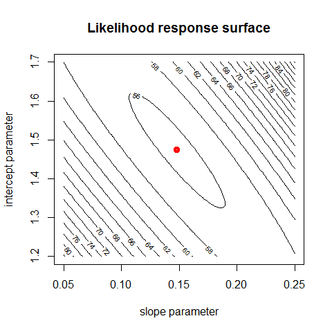

```r
# calculating the "Hessian" matrix (Funktionaldeterminante)
 
bestfit = optim(c(0.12,1.3), loglikelihood, method = "BFGS", hessian = T)
bestfit$hessian
```

```
##      [,1] [,2]
## [1,] 2225  573
## [2,]  573  174
```

```r
persp(slope, intercept, matrix(parametervalues$response, nrow = 100), theta = 40, phi = 30, expand = 0.7, col = c("grey","red"),  ticktype = "detailed")
```

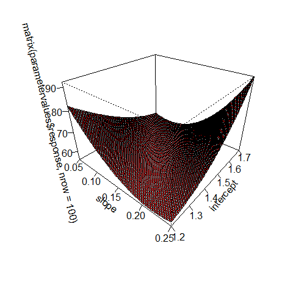

```r
# bonus plot
library(rgl)
```

```
## Warning: package 'rgl' was built under R version 3.0.3
```

```
## 
## Attaching package: 'rgl'
## 
## Das folgende Objekt ist maskiert from 'package:car':
## 
##     identify3d
```

```r
persp3d(slope, intercept, matrix(parametervalues$response, nrow = 100), col = c("grey","red"), box = FALSE)
 
 
detach(cfc)
```


## Links

http://blog.revolutionanalytics.com/2014/04/some-r-resources-for-glms.html

